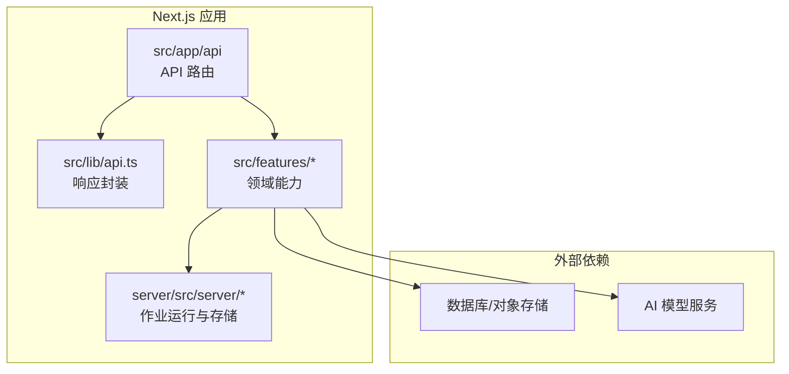
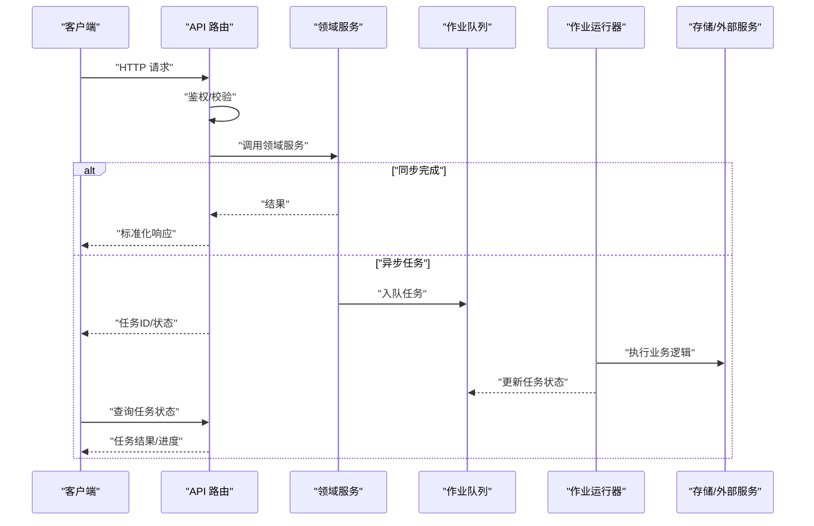
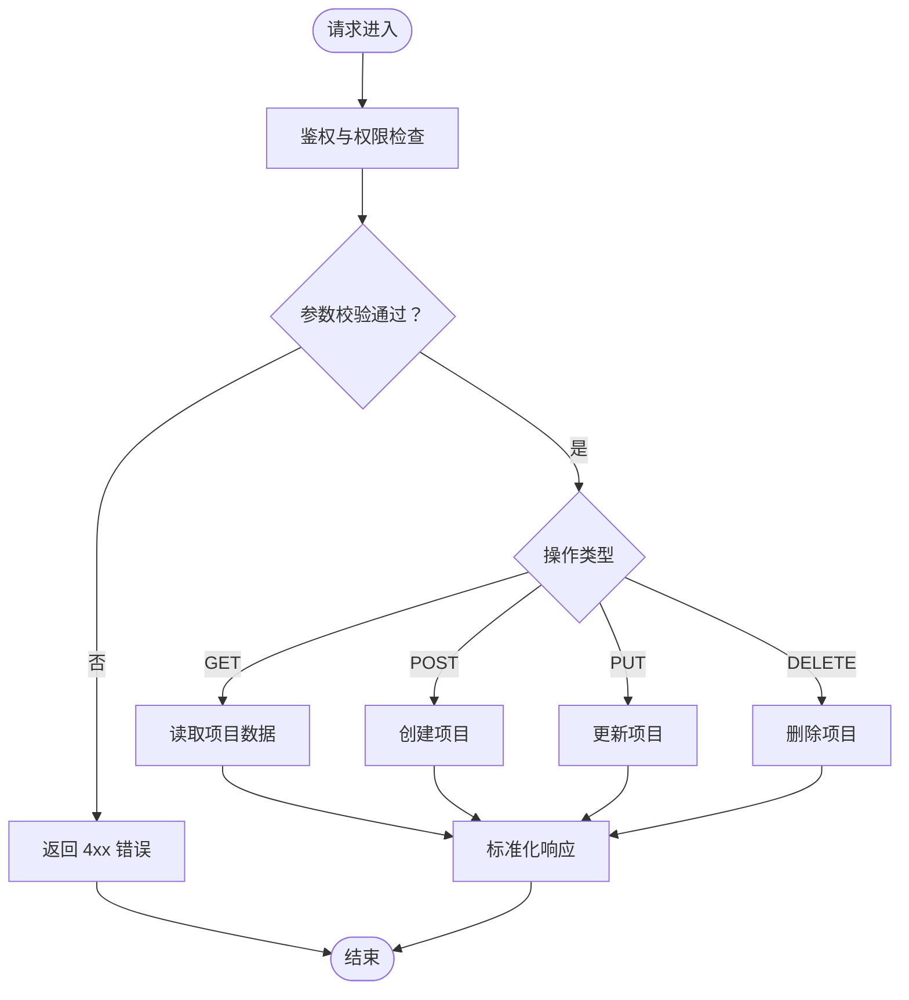
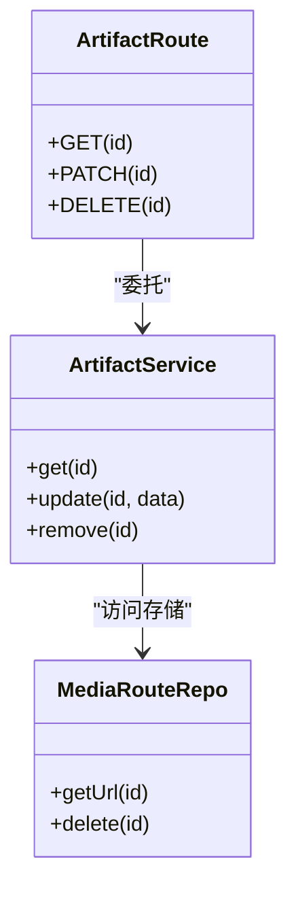
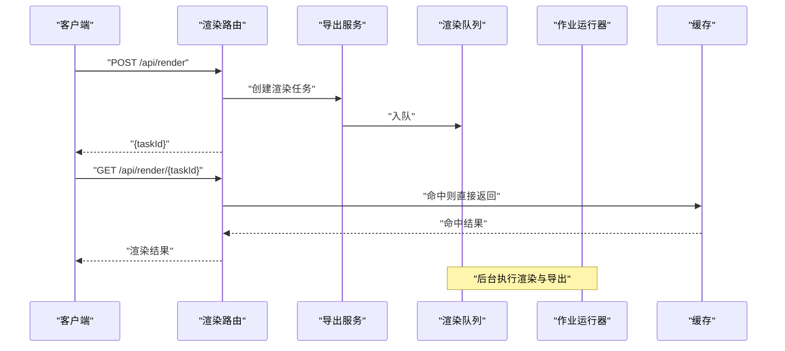
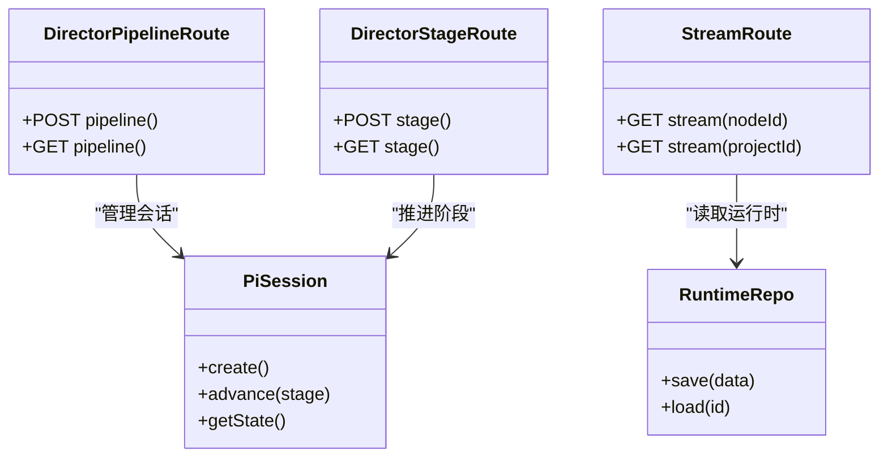
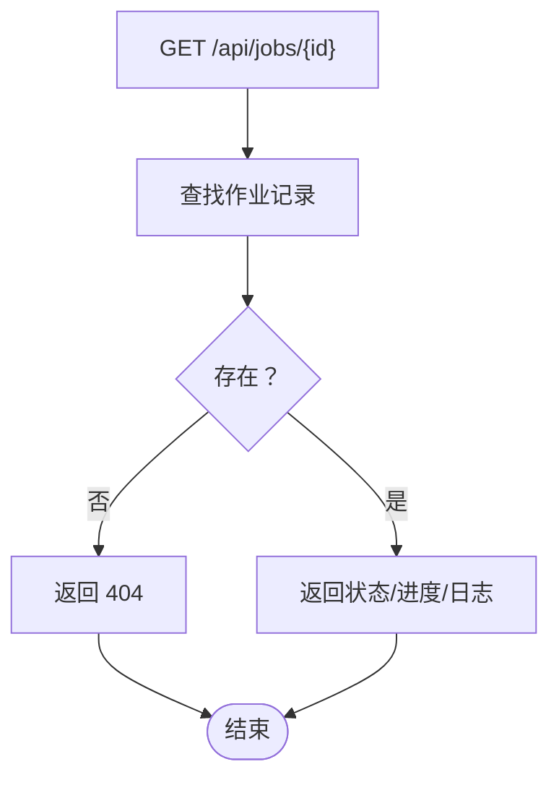
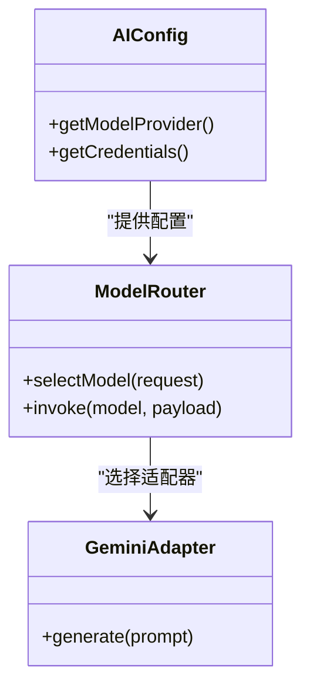
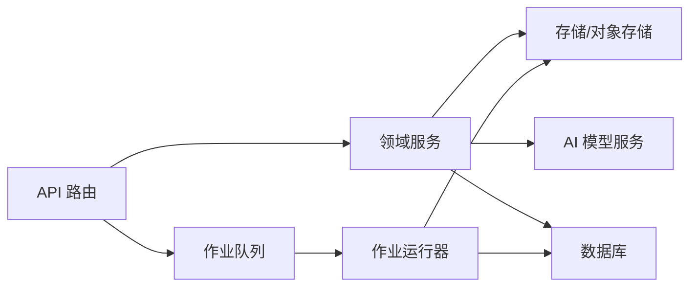

# API 设计架构

<cite>
**本文引用的文件**   
- [src/app/api/projects/route.ts](file://src/app/api/projects/route.ts)
- [src/app/api/projects/[id]/route.ts](file://src/app/api/projects/[id]/route.ts)
- [src/app/api/artifacts/[id]/route.ts](file://src/app/api/artifacts/[id]/route.ts)
- [src/app/api/render/route.ts](file://src/app/api/render/route.ts)
- [src/app/api/render/export/route.ts](file://src/app/api/render/export/route.ts)
- [src/app/api/director/pipeline/route.ts](file://src/app/api/director/pipeline/route.ts)
- [src/app/api/director/stage/route.ts](file://src/app/api/director/stage/route.ts)
- [src/app/api/director/stream/[nodeId]/route.ts](file://src/app/api/director/stream/[nodeId]/route.ts)
- [src/app/api/director/stream/project/[projectId]/route.ts](file://src/app/api/director/stream/project/[projectId]/route.ts)
- [src/app/api/jobs/[id]/route.ts](file://src/app/api/jobs/[id]/route.ts)
- [src/app/api/settings/route.ts](file://src/app/api/settings/route.ts)
- [src/app/api/ping/route.ts](file://src/app/api/ping/route.ts)
- [src/lib/api.ts](file://src/lib/api.ts)
- [src/features/ai/index.ts](file://src/features/ai/index.ts)
- [src/features/ai/config.ts](file://src/features/ai/config.ts)
- [src/features/ai/model-routing.ts](file://src/features/ai/model-routing.ts)
- [src/features/render/cache.ts](file://src/features/render/cache.ts)
- [src/features/render/export-service.ts](file://src/features/render/export-service.ts)
- [src/features/render/queue-handler.ts](file://src/features/render/queue-handler.ts)
- [src/features/director/queue-handler.ts](file://src/features/director/queue-handler.ts)
- [src/features/director/pi-session.ts](file://src/features/director/pi-session.ts)
- [src/features/director/runtime-repository.ts](file://src/features/director/runtime-repository.ts)
- [src/features/canvas/actions.ts](file://src/features/canvas/actions.ts)
- [src/features/canvas/contracts.ts](file://src/features/canvas/contracts.ts)
- [src/features/audio/narration.ts](file://src/features/audio/narration.ts)
- [src/features/audio/repository.ts](file://src/features/audio/repository.ts)
- [src/features/artifacts/service.ts](file://src/features/artifacts/service.ts)
- [src/features/artifacts/commit.ts](file://src/features/artifacts/commit.ts)
- [src/features/routing/media-route-repository.ts](file://src/features/routing/media-route-repository.ts)
- [src/features/routing/model-route-repository.ts](file://src/features/routing/model-route-repository.ts)
- [server/src/server/api.ts](file://server/src/server/api.ts)
- [server/src/server/job-runner.ts](file://server/src/server/job-runner.ts)
- [server/src/server/job-store.ts](file://server/src/server/job-store.ts)
- [docs/conventions/routing.md](file://docs/conventions/routing.md)
</cite>

## 目录
1. [简介](#简介)
2. [项目结构](#项目结构)
3. [核心组件](#核心组件)
4. [架构总览](#架构总览)
5. [详细组件分析](#详细组件分析)
6. [依赖关系分析](#依赖关系分析)
7. [性能考量](#性能考量)
8. [故障排查指南](#故障排查指南)
9. [结论](#结论)
10. [附录](#附录)

## 简介
本文件为 PurpleInk 平台的 API 设计架构文档，聚焦于基于 Next.js API Routes 的 RESTful API 设计原则与实现。内容涵盖：
- 路由组织策略、HTTP 方法使用规范与数据格式约定
- 认证中间件、请求验证、错误处理与响应标准化机制
- API 版本管理、向后兼容性与废弃接口处理方案
- 速率限制、缓存策略与安全防护措施
- 典型端点示例：项目 CRUD、AI 服务调用、文件上传下载等

## 项目结构
API 采用 Next.js App Router 的文件路由模式，按功能域划分目录，便于扩展与维护。关键目录与职责如下：
- src/app/api：REST 端点入口，按资源与子域组织（如 projects、render、director、jobs、settings、ping）
- src/lib/api.ts：通用 API 工具与响应封装
- src/features/*：领域能力实现（AI、渲染、导演编排、音频、制品、路由等）
- server/src/server/*：服务端作业运行器与存储抽象（异步任务执行与持久化）

图表来源
- [src/app/api/projects/route.ts](file://src/app/api/projects/route.ts)
- [src/lib/api.ts](file://src/lib/api.ts)
- [server/src/server/api.ts](file://server/src/server/api.ts)

章节来源
- [docs/conventions/routing.md](file://docs/conventions/routing.md)

## 核心组件
- API 路由层：定义 REST 端点，解析请求参数与体，调用领域服务，返回标准化响应
- 领域服务层：封装业务逻辑（项目、制品、渲染、导演编排、音频、设置等）
- 作业系统：将耗时任务入队并异步执行（渲染导出、AI 生成、媒体处理）
- 存储与路由：统一访问数据库与对象存储，提供媒体与模型路由能力
- 通用工具：响应封装、错误处理、配置加载、日志记录

章节来源
- [src/lib/api.ts](file://src/lib/api.ts)
- [src/features/render/export-service.ts](file://src/features/render/export-service.ts)
- [src/features/director/queue-handler.ts](file://src/features/director/queue-handler.ts)
- [server/src/server/job-runner.ts](file://server/src/server/job-runner.ts)
- [server/src/server/job-store.ts](file://server/src/server/job-store.ts)

## 架构总览
整体架构遵循“路由层薄、领域层厚、作业异步化”的原则。请求进入 Next.js API Route，进行鉴权与校验后委派给领域服务；涉及耗时操作通过队列交由作业运行器执行，前端通过轮询或流式通道获取进度。

图表来源
- [src/app/api/render/route.ts](file://src/app/api/render/route.ts)
- [src/features/render/queue-handler.ts](file://src/features/render/queue-handler.ts)
- [server/src/server/job-runner.ts](file://server/src/server/job-runner.ts)

## 详细组件分析

### 项目 CRUD（projects）
- 路由组织：集合路由 /api/projects，成员路由 /api/projects/[id]
- HTTP 方法：GET 列表/详情，POST 创建，PUT/PATCH 更新，DELETE 删除
- 数据格式：统一 JSON 结构，包含 data、error、meta 字段
- 鉴权与校验：在路由层校验身份与权限，对输入进行必要校验
- 错误处理：统一错误码与消息，避免泄露敏感信息

图表来源
- [src/app/api/projects/route.ts](file://src/app/api/projects/route.ts)
- [src/app/api/projects/[id]/route.ts](file://src/app/api/projects/[id]/route.ts)

章节来源
- [src/app/api/projects/route.ts](file://src/app/api/projects/route.ts)
- [src/app/api/projects/[id]/route.ts](file://src/app/api/projects/[id]/route.ts)

### 制品管理（artifacts）
- 路由：/api/artifacts/[id]
- 能力：获取/更新/删除制品元数据与关联文件
- 存储：通过制品服务与存储路由仓库访问对象存储

图表来源
- [src/app/api/artifacts/[id]/route.ts](file://src/app/api/artifacts/[id]/route.ts)
- [src/features/artifacts/service.ts](file://src/features/artifacts/service.ts)
- [src/features/routing/media-route-repository.ts](file://src/features/routing/media-route-repository.ts)

章节来源
- [src/app/api/artifacts/[id]/route.ts](file://src/app/api/artifacts/[id]/route.ts)
- [src/features/artifacts/service.ts](file://src/features/artifacts/service.ts)
- [src/features/artifacts/commit.ts](file://src/features/artifacts/commit.ts)
- [src/features/routing/media-route-repository.ts](file://src/features/routing/media-route-repository.ts)

### 渲染与导出（render）
- 路由：/api/render（提交渲染），/api/render/export（导出任务），/api/render/thumbnails（缩略图）
- 流程：提交渲染 -> 入队 -> 作业运行器执行 -> 产出产物 -> 前端轮询/流式获取
- 缓存：渲染结果可缓存以减少重复计算

图表来源
- [src/app/api/render/route.ts](file://src/app/api/render/route.ts)
- [src/app/api/render/export/route.ts](file://src/app/api/render/export/route.ts)
- [src/features/render/export-service.ts](file://src/features/render/export-service.ts)
- [src/features/render/cache.ts](file://src/features/render/cache.ts)
- [server/src/server/job-runner.ts](file://server/src/server/job-runner.ts)

章节来源
- [src/app/api/render/route.ts](file://src/app/api/render/route.ts)
- [src/app/api/render/export/route.ts](file://src/app/api/render/export/route.ts)
- [src/features/render/export-service.ts](file://src/features/render/export-service.ts)
- [src/features/render/cache.ts](file://src/features/render/cache.ts)
- [src/features/render/queue-handler.ts](file://src/features/render/queue-handler.ts)

### 导演编排（director）
- 路由：/api/director/pipeline（流水线控制）、/api/director/stage（阶段控制）、/api/director/stream（节点/项目级流式输出）
- 能力：编排 AI 生成步骤、阶段推进、实时日志/进度流
- 会话与运行时：维护会话上下文与运行时数据

图表来源
- [src/app/api/director/pipeline/route.ts](file://src/app/api/director/pipeline/route.ts)
- [src/app/api/director/stage/route.ts](file://src/app/api/director/stage/route.ts)
- [src/app/api/director/stream/[nodeId]/route.ts](file://src/app/api/director/stream/[nodeId]/route.ts)
- [src/app/api/director/stream/project/[projectId]/route.ts](file://src/app/api/director/stream/project/[projectId]/route.ts)
- [src/features/director/pi-session.ts](file://src/features/director/pi-session.ts)
- [src/features/director/runtime-repository.ts](file://src/features/director/runtime-repository.ts)

章节来源
- [src/app/api/director/pipeline/route.ts](file://src/app/api/director/pipeline/route.ts)
- [src/app/api/director/stage/route.ts](file://src/app/api/director/stage/route.ts)
- [src/app/api/director/stream/[nodeId]/route.ts](file://src/app/api/director/stream/[nodeId]/route.ts)
- [src/app/api/director/stream/project/[projectId]/route.ts](file://src/app/api/director/stream/project/[projectId]/route.ts)
- [src/features/director/pi-session.ts](file://src/features/director/pi-session.ts)
- [src/features/director/runtime-repository.ts](file://src/features/director/runtime-repository.ts)

### 作业查询（jobs）
- 路由：/api/jobs/[id]
- 能力：查询作业状态与结果，支持失败重试与日志查看

图表来源
- [src/app/api/jobs/[id]/route.ts](file://src/app/api/jobs/[id]/route.ts)

章节来源
- [src/app/api/jobs/[id]/route.ts](file://src/app/api/jobs/[id]/route.ts)

### 设置与配置（settings）
- 路由：/api/settings
- 能力：读写平台设置（如 AI 模型配置、TTS 配置等）

章节来源
- [src/app/api/settings/route.ts](file://src/app/api/settings/route.ts)

### 健康检查（ping）
- 路由：/api/ping
- 能力：快速健康检查与可用性探测

章节来源
- [src/app/api/ping/route.ts](file://src/app/api/ping/route.ts)

### AI 服务调用
- 路由：通过 director 与 render 相关端点间接调用 AI 能力
- 配置与路由：集中管理模型配置与路由策略，支持多模型切换与降级

图表来源
- [src/features/ai/config.ts](file://src/features/ai/config.ts)
- [src/features/ai/model-routing.ts](file://src/features/ai/model-routing.ts)
- [src/features/ai/index.ts](file://src/features/ai/index.ts)

章节来源
- [src/features/ai/config.ts](file://src/features/ai/config.ts)
- [src/features/ai/model-routing.ts](file://src/features/ai/model-routing.ts)
- [src/features/ai/index.ts](file://src/features/ai/index.ts)

### 音频与字幕（audio）
- 能力：语音合成、时长测量、字幕生成、SFX 处理
- 存储：通过音频仓库持久化元数据与媒体路径

章节来源
- [src/features/audio/narration.ts](file://src/features/audio/narration.ts)
- [src/features/audio/repository.ts](file://src/features/audio/repository.ts)

### 画布与动作（canvas）
- 能力：画布状态变更、导出设置、布局与状态管理
- 契约：明确数据结构与行为约束

章节来源
- [src/features/canvas/actions.ts](file://src/features/canvas/actions.ts)
- [src/features/canvas/contracts.ts](file://src/features/canvas/contracts.ts)

## 依赖关系分析
- 路由层依赖领域服务，领域服务依赖存储与外部服务（AI、对象存储、数据库）
- 作业系统与路由层解耦，通过队列通信，提升吞吐与稳定性
- 配置与路由仓库集中管理，降低耦合度

图表来源
- [src/lib/api.ts](file://src/lib/api.ts)
- [server/src/server/job-runner.ts](file://server/src/server/job-runner.ts)
- [server/src/server/job-store.ts](file://server/src/server/job-store.ts)

章节来源
- [src/lib/api.ts](file://src/lib/api.ts)
- [server/src/server/api.ts](file://server/src/server/api.ts)

## 性能考量
- 缓存策略：渲染结果与常用查询结果缓存，减少重复计算与 I/O
- 异步作业：耗时任务入队执行，避免阻塞请求线程
- 流式输出：长时任务通过流式通道推送进度与日志
- 限流与保护：在网关或中间件层实施速率限制，防止滥用
- 连接池与并发：合理配置数据库与外部服务连接池，优化并发性能

[本节为通用指导，不直接分析具体文件]

## 故障排查指南
- 统一错误响应：所有错误应返回结构化错误信息，便于前端展示与调试
- 日志记录：关键路径添加日志，包括请求 ID、用户 ID、参数摘要与异常堆栈
- 任务追踪：作业状态与进度持久化，支持失败重试与人工干预
- 常见错误：
  - 鉴权失败：检查令牌与权限策略
  - 参数校验失败：核对请求体结构与必填字段
  - 外部服务超时：检查网络与依赖服务健康状态
  - 存储写入失败：检查对象存储权限与配额

章节来源
- [src/lib/api.ts](file://src/lib/api.ts)
- [server/src/server/job-runner.ts](file://server/src/server/job-runner.ts)

## 结论
PurpleInk 的 API 架构以 Next.js API Routes 为基础，结合领域服务与作业系统，实现了清晰的分层与良好的可扩展性。通过统一的响应封装、错误处理与缓存策略，提升了系统的稳定性与性能。未来可在鉴权中间件、速率限制与 API 版本管理方面进一步增强，以满足更复杂的业务需求。

[本节为总结，不直接分析具体文件]

## 附录

### 路由组织策略
- 按资源命名：/api/{resource} 与 /api/{resource}/[id]
- 子域拆分：render、director、jobs、settings、ping 等独立模块
- 文件即路由：Next.js App Router 自动映射文件路径到 URL

章节来源
- [docs/conventions/routing.md](file://docs/conventions/routing.md)

### HTTP 方法使用规范
- GET：读取资源（幂等、安全）
- POST：创建资源
- PUT/PATCH：更新资源（全量/增量）
- DELETE：删除资源

[本节为通用规范，不直接分析具体文件]

### 数据格式约定
- 成功响应：{ data, meta }
- 错误响应：{ error: { code, message, details } }
- 分页：{ items, total, page, pageSize }

[本节为通用约定，不直接分析具体文件]

### 认证中间件与请求验证
- 鉴权：在路由层校验令牌与权限，必要时引入中间件
- 校验：对请求体与路径参数进行必要校验，返回统一错误

[本节为通用实践，不直接分析具体文件]

### 错误处理与响应标准化
- 统一错误码与消息结构
- 避免泄露内部细节，提供可操作的错误提示

章节来源
- [src/lib/api.ts](file://src/lib/api.ts)

### API 版本管理与兼容性
- 版本前缀：/api/v1/{resource}
- 向后兼容：新增字段非破坏性，废弃字段保留过渡期
- 废弃策略：公告与迁移指南，逐步下线旧接口

[本节为通用策略，不直接分析具体文件]

### 速率限制、缓存与安全
- 速率限制：网关或中间件层限流，区分用户与 IP
- 缓存：结果缓存与 CDN 加速，注意失效策略
- 安全：HTTPS、CORS、CSRF、输入过滤、最小权限原则

[本节为通用防护，不直接分析具体文件]

### 典型端点示例（描述性）
- 项目 CRUD：GET/POST /api/projects，GET/PUT/DELETE /api/projects/[id]
- 制品管理：GET/PATCH/DELETE /api/artifacts/[id]
- 渲染与导出：POST /api/render，POST /api/render/export，GET /api/render/thumbnails
- 导演编排：POST /api/director/pipeline，POST /api/director/stage，GET /api/director/stream/[nodeId]
- 作业查询：GET /api/jobs/[id]
- 设置：GET/PUT /api/settings
- 健康检查：GET /api/ping

[本节为端点概览，不直接分析具体文件]