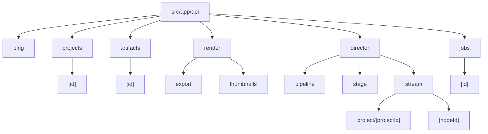
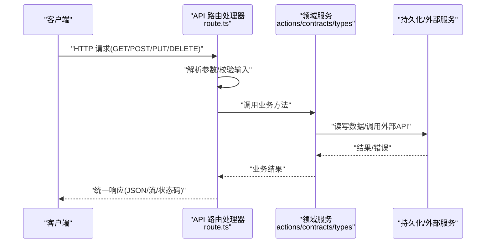
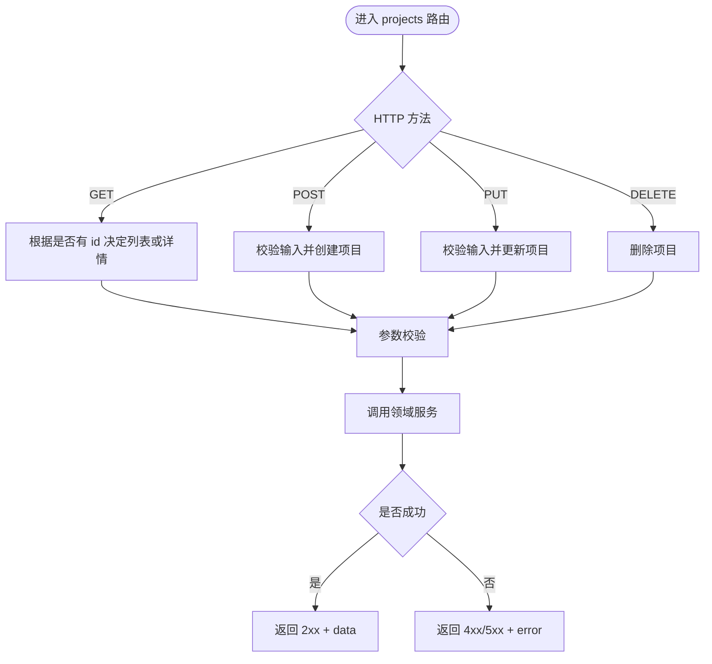
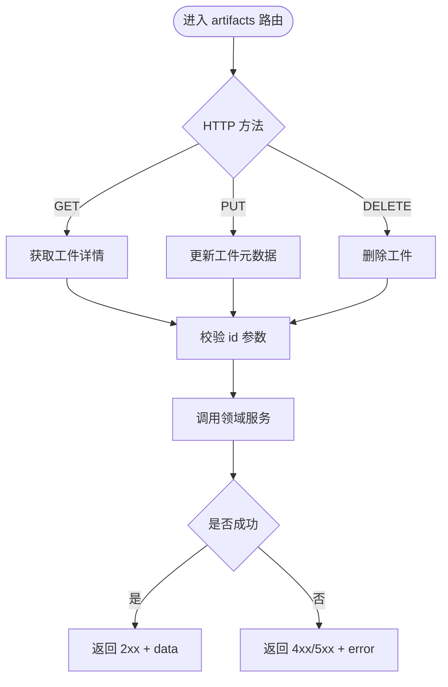
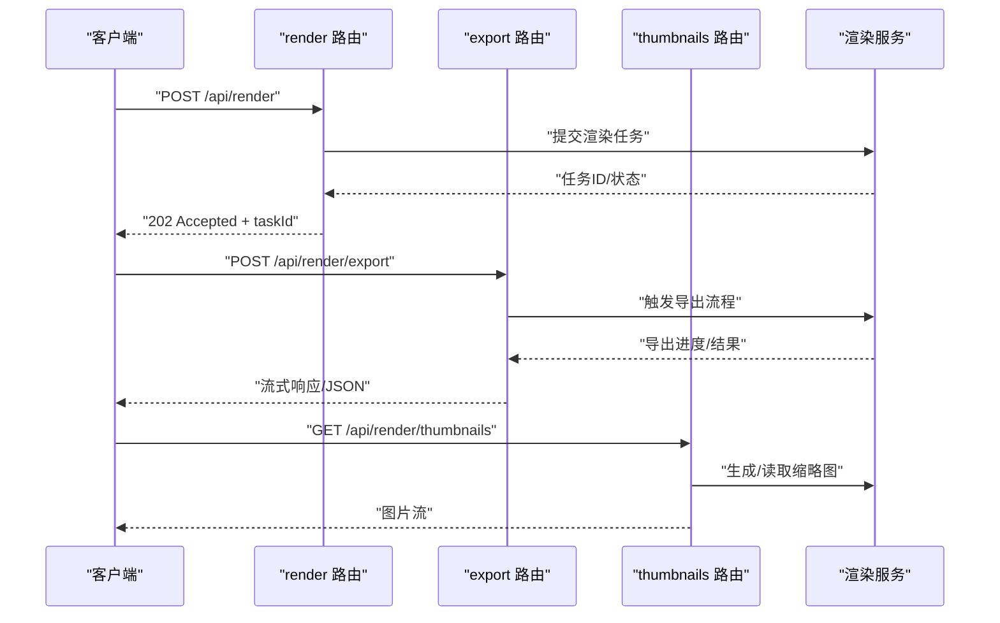
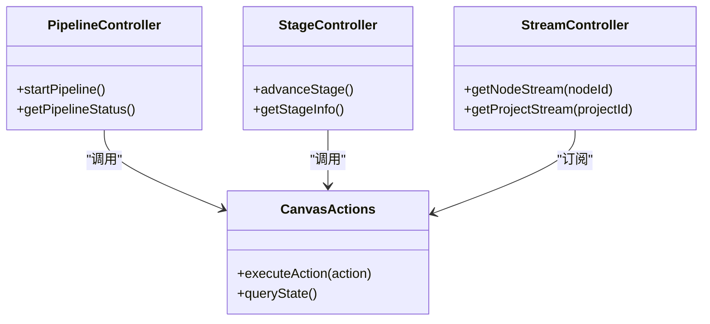
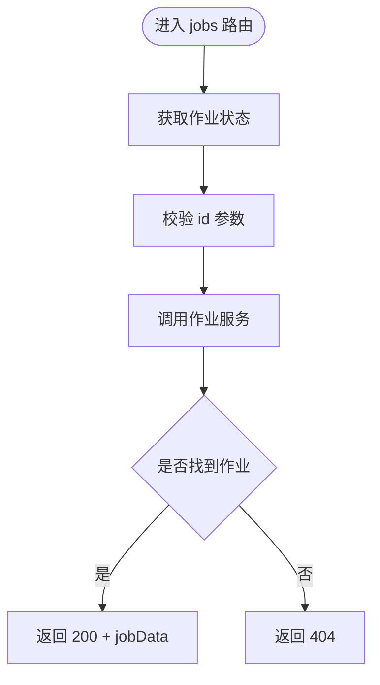
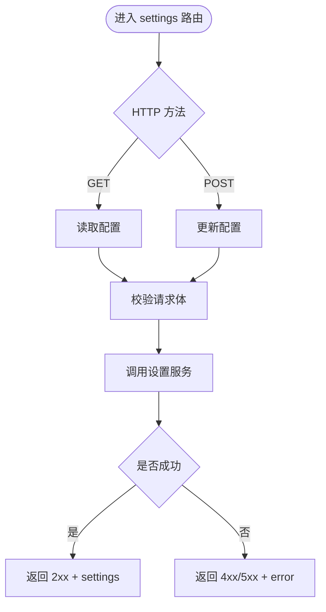
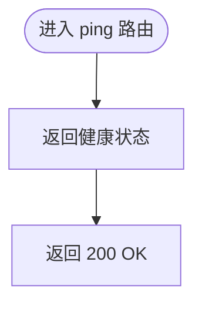
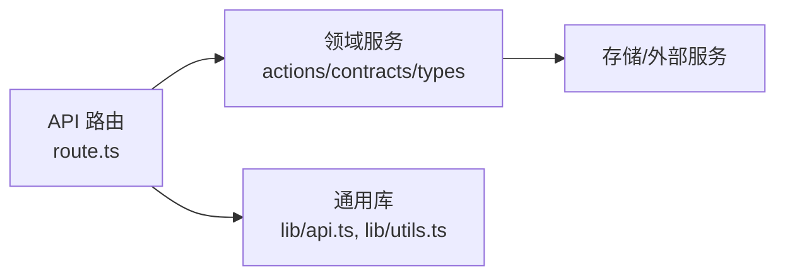

# API 路由组织与规范

<cite>
**本文引用的文件**   
- [src/app/api/artifacts/[id]/route.ts](file://src/app/api/artifacts/%5Bid%5D/route.ts)
- [src/app/api/artifacts/[id]/route.test.ts](file://src/app/api/artifacts/%5Bid%5D/route.test.ts)
- [src/app/api/director/pipeline/route.ts](file://src/app/api/director/pipeline/route.ts)
- [src/app/api/director/pipeline/route.test.ts](file://src/app/api/director/pipeline/route.test.ts)
- [src/app/api/director/stage/route.ts](file://src/app/api/director/stage/route.ts)
- [src/app/api/director/stage/route.test.ts](file://src/app/api/director/stage/route.test.ts)
- [src/app/api/director/stream/[nodeId]/route.ts](file://src/app/api/director/stream/%5BnodeId%5D/route.ts)
- [src/app/api/director/stream/[nodeId]/route.test.ts](file://src/app/api/director/stream/%5BnodeId%5D/route.test.ts)
- [src/app/api/director/stream/project/[projectId]/route.ts](file://src/app/api/director/stream/project/%5BprojectId%5D/route.ts)
- [src/app/api/director/stream/project/[projectId]/route.test.ts](file://src/app/api/director/stream/project/%5BprojectId%5D/route.test.ts)
- [src/app/api/jobs/[id]/route.ts](file://src/app/api/jobs/%5Bid%5D/route.ts)
- [src/app/api/jobs/[id]/route.test.ts](file://src/app/api/jobs/%5Bid%5D/route.test.ts)
- [src/app/api/ping/route.ts](file://src/app/api/ping/route.ts)
- [src/app/api/projects/[id]/route.ts](file://src/app/api/projects/%5Bid%5D/route.ts)
- [src/app/api/projects/route.ts](file://src/app/api/projects/route.ts)
- [src/app/api/projects/route.test.ts](file://src/app/api/projects/route.test.ts)
- [src/app/api/render/export/route.ts](file://src/app/api/render/export/route.ts)
- [src/app/api/render/export/route.test.ts](file://src/app/api/render/export/route.test.ts)
- [src/app/api/render/thumbnails/route.ts](file://src/app/api/render/thumbnails/route.ts)
- [src/app/api/render/route.ts](file://src/app/api/render/route.ts)
- [src/app/api/render/route.test.ts](file://src/app/api/render/route.test.ts)
- [src/app/api/settings/route.ts](file://src/app/api/settings/route.ts)
- [src/app/api/settings/route.test.ts](file://src/app/api/settings/route.test.ts)
- [src/features/canvas/actions.ts](file://src/features/canvas/actions.ts)
- [src/features/canvas/contracts.ts](file://src/features/canvas/contracts.ts)
- [src/features/canvas/types.ts](file://src/features/canvas/types.ts)
- [src/lib/api.ts](file://src/lib/api.ts)
- [src/lib/utils.ts](file://src/lib/utils.ts)
- [tests/app-route-contract.test.tsx](file://tests/app-route-contract.test.tsx)
</cite>

## 目录
1. [简介](#简介)
2. [项目结构](#项目结构)
3. [核心组件](#核心组件)
4. [架构总览](#架构总览)
5. [详细组件分析](#详细组件分析)
6. [依赖分析](#依赖分析)
7. [性能考虑](#性能考虑)
8. [故障排查指南](#故障排查指南)
9. [结论](#结论)
10. [附录](#附录)

## 简介
本规范面向 PurpleInk 平台基于 Next.js App Router 的 API 路由设计与实现，聚焦以下目标：
- 统一 RESTful 资源命名约定、嵌套路由策略与动态参数处理
- 按功能模块划分 API 目录，定义统一的响应格式与错误码
- 明确 HTTP 方法使用规范（GET、POST、PUT、DELETE）与状态码选择标准
- 提供项目、工件、渲染、导演流、作业等核心资源的 API 设计模式与示例
- 给出路由测试策略与调试技巧，确保可维护性与稳定性

## 项目结构
API 路由位于 src/app/api 下，采用“按资源域”划分的目录结构。每个路由以 route.ts 暴露 HTTP 处理器，配套 route.test.ts 进行契约与行为测试。典型结构如下：
- 根级健康检查：api/ping
- 项目管理：api/projects、api/projects/[id]
- 工件管理：api/artifacts/[id]
- 渲染服务：api/render、api/render/export、api/render/thumbnails
- 导演编排：api/director/pipeline、api/director/stage、api/director/stream、api/director/stream/project/[projectId]、api/director/stream/[nodeId]
- 作业查询：api/jobs/[id]

**图示来源** 
- [src/app/api/ping/route.ts](file://src/app/api/ping/route.ts)
- [src/app/api/projects/route.ts](file://src/app/api/projects/route.ts)
- [src/app/api/projects/[id]/route.ts](file://src/app/api/projects/%5Bid%5D/route.ts)
- [src/app/api/artifacts/[id]/route.ts](file://src/app/api/artifacts/%5Bid%5D/route.ts)
- [src/app/api/render/route.ts](file://src/app/api/render/route.ts)
- [src/app/api/render/export/route.ts](file://src/app/api/render/export/route.ts)
- [src/app/api/render/thumbnails/route.ts](file://src/app/api/render/thumbnails/route.ts)
- [src/app/api/director/pipeline/route.ts](file://src/app/api/director/pipeline/route.ts)
- [src/app/api/director/stage/route.ts](file://src/app/api/director/stage/route.ts)
- [src/app/api/director/stream/project/[projectId]/route.ts](file://src/app/api/director/stream/project/%5BprojectId%5D/route.ts)
- [src/app/api/director/stream/[nodeId]/route.ts](file://src/app/api/director/stream/%5BnodeId%5D/route.ts)
- [src/app/api/jobs/[id]/route.ts](file://src/app/api/jobs/%5Bid%5D/route.ts)

**章节来源**
- [src/app/api/ping/route.ts](file://src/app/api/ping/route.ts)
- [src/app/api/projects/route.ts](file://src/app/api/projects/route.ts)
- [src/app/api/projects/[id]/route.ts](file://src/app/api/projects/%5Bid%5D/route.ts)
- [src/app/api/artifacts/[id]/route.ts](file://src/app/api/artifacts/%5Bid%5D/route.ts)
- [src/app/api/render/route.ts](file://src/app/api/render/route.ts)
- [src/app/api/render/export/route.ts](file://src/app/api/render/export/route.ts)
- [src/app/api/render/thumbnails/route.ts](file://src/app/api/render/thumbnails/route.ts)
- [src/app/api/director/pipeline/route.ts](file://src/app/api/director/pipeline/route.ts)
- [src/app/api/director/stage/route.ts](file://src/app/api/director/stage/route.ts)
- [src/app/api/director/stream/project/[projectId]/route.ts](file://src/app/api/director/stream/project/%5BprojectId%5D/route.ts)
- [src/app/api/director/stream/[nodeId]/route.ts](file://src/app/api/director/stream/%5BnodeId%5D/route.ts)
- [src/app/api/jobs/[id]/route.ts](file://src/app/api/jobs/%5Bid%5D/route.ts)

## 核心组件
- 路由处理器：每个 route.ts 暴露对应 HTTP 方法的处理器函数，负责解析请求、校验输入、调用领域服务、返回统一响应。
- 领域服务：如 canvas actions、contracts、types 等，封装业务逻辑与数据模型。
- 通用库：lib/api.ts、lib/utils.ts 提供请求构造、错误处理、工具函数等。
- 测试契约：tests/app-route-contract.test.tsx 与各 route.test.ts 保障接口契约稳定。

**章节来源**
- [src/features/canvas/actions.ts](file://src/features/canvas/actions.ts)
- [src/features/canvas/contracts.ts](file://src/features/canvas/contracts.ts)
- [src/features/canvas/types.ts](file://src/features/canvas/types.ts)
- [src/lib/api.ts](file://src/lib/api.ts)
- [src/lib/utils.ts](file://src/lib/utils.ts)
- [tests/app-route-contract.test.tsx](file://tests/app-route-contract.test.tsx)

## 架构总览
Next.js App Router 将 URL 路径映射到 src/app 下的文件结构。API 路由通过 route.ts 暴露 HTTP 处理器，内部调用领域服务与存储层，最终返回 JSON 或流式响应。

**图示来源**
- [src/app/api/projects/route.ts](file://src/app/api/projects/route.ts)
- [src/app/api/projects/[id]/route.ts](file://src/app/api/projects/%5Bid%5D/route.ts)
- [src/app/api/artifacts/[id]/route.ts](file://src/app/api/artifacts/%5Bid%5D/route.ts)
- [src/app/api/render/route.ts](file://src/app/api/render/route.ts)
- [src/app/api/director/pipeline/route.ts](file://src/app/api/director/pipeline/route.ts)
- [src/app/api/director/stage/route.ts](file://src/app/api/director/stage/route.ts)
- [src/app/api/director/stream/project/[projectId]/route.ts](file://src/app/api/director/stream/project/%5BprojectId%5D/route.ts)
- [src/app/api/director/stream/[nodeId]/route.ts](file://src/app/api/director/stream/%5BnodeId%5D/route.ts)
- [src/app/api/jobs/[id]/route.ts](file://src/app/api/jobs/%5Bid%5D/route.ts)
- [src/features/canvas/actions.ts](file://src/features/canvas/actions.ts)
- [src/features/canvas/contracts.ts](file://src/features/canvas/contracts.ts)
- [src/features/canvas/types.ts](file://src/features/canvas/types.ts)

## 详细组件分析

### 项目管理 API（projects）
- 列表与创建：GET/POST /api/projects
- 单项目操作：GET/PUT/DELETE /api/projects/[id]
- 动态参数：[id] 作为路径参数，用于定位资源
- 响应格式：统一 JSON，包含 data、error、status 字段；成功返回 2xx，失败返回 4xx/5xx

**图示来源**
- [src/app/api/projects/route.ts](file://src/app/api/projects/route.ts)
- [src/app/api/projects/[id]/route.ts](file://src/app/api/projects/%5Bid%5D/route.ts)

**章节来源**
- [src/app/api/projects/route.ts](file://src/app/api/projects/route.ts)
- [src/app/api/projects/[id]/route.ts](file://src/app/api/projects/%5Bid%5D/route.ts)
- [src/app/api/projects/route.test.ts](file://src/app/api/projects/route.test.ts)

### 工件管理 API（artifacts）
- 单工件操作：GET/PUT/DELETE /api/artifacts/[id]
- 动态参数：[id] 标识工件唯一性
- 响应格式：统一 JSON，包含 data、error、status

**图示来源**
- [src/app/api/artifacts/[id]/route.ts](file://src/app/api/artifacts/%5Bid%5D/route.ts)

**章节来源**
- [src/app/api/artifacts/[id]/route.ts](file://src/app/api/artifacts/%5Bid%5D/route.ts)
- [src/app/api/artifacts/[id]/route.test.ts](file://src/app/api/artifacts/%5Bid%5D/route.test.ts)

### 渲染服务 API（render）
- 渲染任务：POST /api/render
- 导出：POST /api/render/export
- 缩略图：GET /api/render/thumbnails
- 支持流式输出与异步任务状态查询

**图示来源**
- [src/app/api/render/route.ts](file://src/app/api/render/route.ts)
- [src/app/api/render/export/route.ts](file://src/app/api/render/export/route.ts)
- [src/app/api/render/thumbnails/route.ts](file://src/app/api/render/thumbnails/route.ts)

**章节来源**
- [src/app/api/render/route.ts](file://src/app/api/render/route.ts)
- [src/app/api/render/export/route.ts](file://src/app/api/render/export/route.ts)
- [src/app/api/render/thumbnails/route.ts](file://src/app/api/render/thumbnails/route.ts)
- [src/app/api/render/route.test.ts](file://src/app/api/render/route.test.ts)
- [src/app/api/render/export/route.test.ts](file://src/app/api/render/export/route.test.ts)

### 导演编排 API（director）
- 流水线控制：POST/GET /api/director/pipeline
- 阶段控制：POST/GET /api/director/stage
- 流式节点：GET /api/director/stream/[nodeId]
- 项目级流：GET /api/director/stream/project/[projectId]

**图示来源**
- [src/app/api/director/pipeline/route.ts](file://src/app/api/director/pipeline/route.ts)
- [src/app/api/director/stage/route.ts](file://src/app/api/director/stage/route.ts)
- [src/app/api/director/stream/[nodeId]/route.ts](file://src/app/api/director/stream/%5BnodeId%5D/route.ts)
- [src/app/api/director/stream/project/[projectId]/route.ts](file://src/app/api/director/stream/project/%5BprojectId%5D/route.ts)
- [src/features/canvas/actions.ts](file://src/features/canvas/actions.ts)

**章节来源**
- [src/app/api/director/pipeline/route.ts](file://src/app/api/director/pipeline/route.ts)
- [src/app/api/director/stage/route.ts](file://src/app/api/director/stage/route.ts)
- [src/app/api/director/stream/[nodeId]/route.ts](file://src/app/api/director/stream/%5BnodeId%5D/route.ts)
- [src/app/api/director/stream/project/[projectId]/route.ts](file://src/app/api/director/stream/project/%5BprojectId%5D/route.ts)
- [src/app/api/director/pipeline/route.test.ts](file://src/app/api/director/pipeline/route.test.ts)
- [src/app/api/director/stage/route.test.ts](file://src/app/api/director/stage/route.test.ts)
- [src/app/api/director/stream/[nodeId]/route.test.ts](file://src/app/api/director/stream/%5BnodeId%5D/route.test.ts)
- [src/app/api/director/stream/project/[projectId]/route.test.ts](file://src/app/api/director/stream/project/%5BprojectId%5D/route.test.ts)

### 作业查询 API（jobs）
- 作业状态：GET /api/jobs/[id]
- 动态参数：[id] 标识作业唯一性

**图示来源**
- [src/app/api/jobs/[id]/route.ts](file://src/app/api/jobs/%5Bid%5D/route.ts)

**章节来源**
- [src/app/api/jobs/[id]/route.ts](file://src/app/api/jobs/%5Bid%5D/route.ts)
- [src/app/api/jobs/[id]/route.test.ts](file://src/app/api/jobs/%5Bid%5D/route.test.ts)

### 设置 API（settings）
- 配置读写：GET/POST /api/settings
- 用于系统配置、模型服务等

**图示来源**
- [src/app/api/settings/route.ts](file://src/app/api/settings/route.ts)

**章节来源**
- [src/app/api/settings/route.ts](file://src/app/api/settings/route.ts)
- [src/app/api/settings/route.test.ts](file://src/app/api/settings/route.test.ts)

### 健康检查 API（ping）
- 简单健康检查：GET /api/ping
- 用于负载均衡与健康探针

**图示来源**
- [src/app/api/ping/route.ts](file://src/app/api/ping/route.ts)

**章节来源**
- [src/app/api/ping/route.ts](file://src/app/api/ping/route.ts)

## 依赖分析
API 路由与领域服务之间的依赖关系如下：
- 路由层仅负责请求解析、校验与响应格式化
- 领域服务封装业务逻辑，避免在路由中直接操作数据
- 通用库提供工具函数与错误处理

**图示来源**
- [src/app/api/projects/route.ts](file://src/app/api/projects/route.ts)
- [src/app/api/artifacts/[id]/route.ts](file://src/app/api/artifacts/%5Bid%5D/route.ts)
- [src/app/api/render/route.ts](file://src/app/api/render/route.ts)
- [src/app/api/director/pipeline/route.ts](file://src/app/api/director/pipeline/route.ts)
- [src/features/canvas/actions.ts](file://src/features/canvas/actions.ts)
- [src/features/canvas/contracts.ts](file://src/features/canvas/contracts.ts)
- [src/features/canvas/types.ts](file://src/features/canvas/types.ts)
- [src/lib/api.ts](file://src/lib/api.ts)
- [src/lib/utils.ts](file://src/lib/utils.ts)

**章节来源**
- [src/app/api/projects/route.ts](file://src/app/api/projects/route.ts)
- [src/app/api/artifacts/[id]/route.ts](file://src/app/api/artifacts/%5Bid%5D/route.ts)
- [src/app/api/render/route.ts](file://src/app/api/render/route.ts)
- [src/app/api/director/pipeline/route.ts](file://src/app/api/director/pipeline/route.ts)
- [src/features/canvas/actions.ts](file://src/features/canvas/actions.ts)
- [src/features/canvas/contracts.ts](file://src/features/canvas/contracts.ts)
- [src/features/canvas/types.ts](file://src/features/canvas/types.ts)
- [src/lib/api.ts](file://src/lib/api.ts)
- [src/lib/utils.ts](file://src/lib/utils.ts)

## 性能考虑
- 避免在路由中进行重型计算，委托给领域服务或后台任务
- 合理使用缓存与分页，减少数据库压力
- 对大文件传输使用流式响应，避免内存峰值
- 异步任务使用队列与状态轮询，提升用户体验

## 故障排查指南
- 使用 route.test.ts 验证路由契约与边界条件
- 利用 tests/app-route-contract.test.tsx 进行端到端契约测试
- 检查错误码与响应格式是否符合规范
- 启用日志记录关键路径，便于问题定位

**章节来源**
- [tests/app-route-contract.test.tsx](file://tests/app-route-contract.test.tsx)
- [src/app/api/projects/route.test.ts](file://src/app/api/projects/route.test.ts)
- [src/app/api/artifacts/[id]/route.test.ts](file://src/app/api/artifacts/%5Bid%5D/route.test.ts)
- [src/app/api/render/route.test.ts](file://src/app/api/render/route.test.ts)
- [src/app/api/render/export/route.test.ts](file://src/app/api/render/export/route.test.ts)
- [src/app/api/director/pipeline/route.test.ts](file://src/app/api/director/pipeline/route.test.ts)
- [src/app/api/director/stage/route.test.ts](file://src/app/api/director/stage/route.test.ts)
- [src/app/api/director/stream/[nodeId]/route.test.ts](file://src/app/api/director/stream/%5BnodeId%5D/route.test.ts)
- [src/app/api/director/stream/project/[projectId]/route.test.ts](file://src/app/api/director/stream/project/%5BprojectId%5D/route.test.ts)
- [src/app/api/jobs/[id]/route.test.ts](file://src/app/api/jobs/%5Bid%5D/route.test.ts)
- [src/app/api/settings/route.test.ts](file://src/app/api/settings/route.test.ts)

## 结论
本规范为 PurpleInk 平台的 API 路由提供了清晰的设计原则与实现指南，涵盖 RESTful 命名、嵌套路由、动态参数、统一响应格式、错误码、HTTP 方法使用、测试策略与调试技巧。遵循本规范可提升代码一致性、可维护性与团队协作效率。

## 附录
- 统一响应格式建议：{ status, data, error }
- 错误码建议：4xx 客户端错误，5xx 服务端错误
- 动态参数命名：使用小写复数资源名，如 projects、artifacts
- 嵌套路由：保持语义清晰，避免过深嵌套