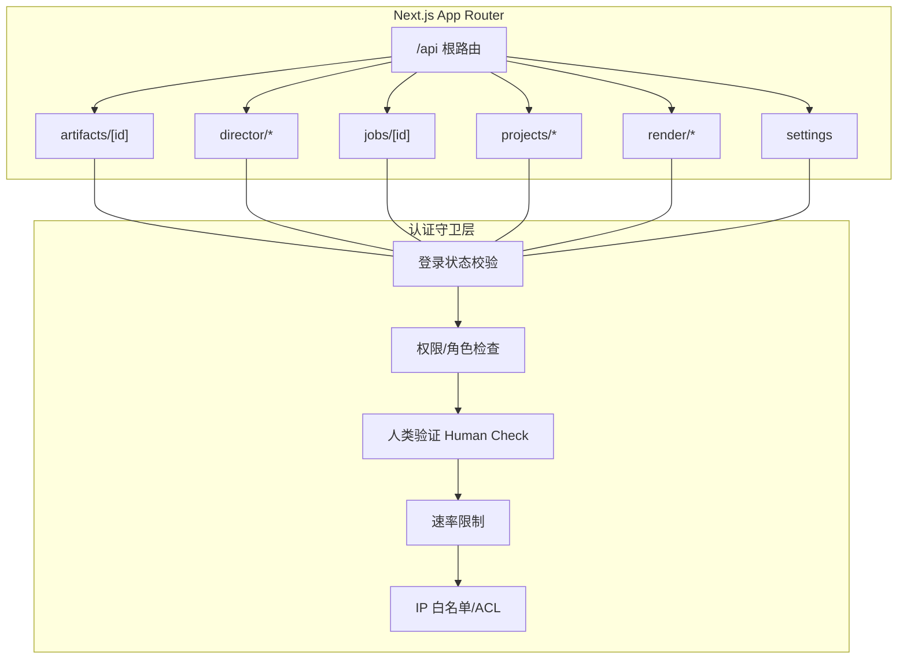
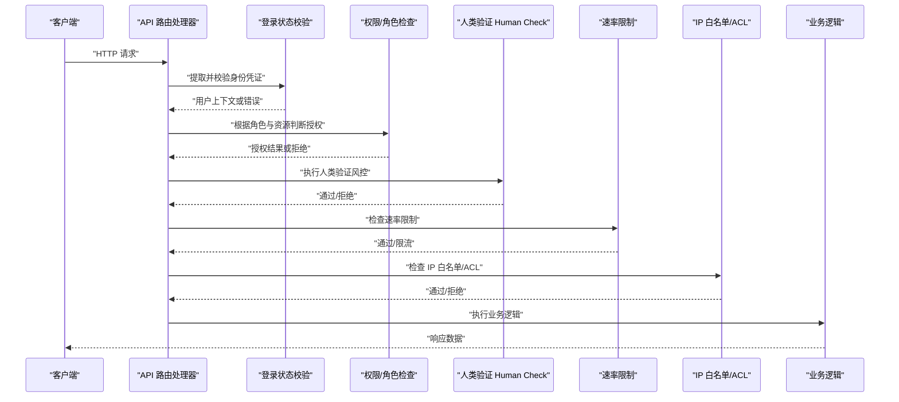
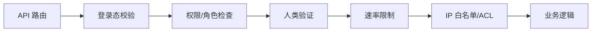

# API 认证守卫

<cite>
**本文引用的文件**   
- [src/app/api/artifacts/[id]/route.ts](file://src/app/api/artifacts/%5Bid%5D/route.ts)
- [src/app/api/director/pipeline/route.ts](file://src/app/api/director/pipeline/route.ts)
- [src/app/api/director/stage/route.ts](file://src/app/api/director/stage/route.ts)
- [src/app/api/director/stream/[nodeId]/route.ts](file://src/app/api/director/stream/%5BnodeId%5D/route.ts)
- [src/app/api/director/stream/project/[projectId]/route.ts](file://src/app/api/director/stream/project/%5BprojectId%5D/route.ts)
- [src/app/api/jobs/[id]/route.ts](file://src/app/api/jobs/%5Bid%5D/route.ts)
- [src/app/api/projects/[id]/route.ts](file://src/app/api/projects/%5Bid%5D/route.ts)
- [src/app/api/projects/route.ts](file://src/app/api/projects/route.ts)
- [src/app/api/render/export/route.ts](file://src/app/api/render/export/route.ts)
- [src/app/api/settings/route.ts](file://src/app/api/settings/route.ts)
- [src/lib/api.ts](file://src/lib/api.ts)
</cite>

## 目录
1. [简介](#简介)
2. [项目结构](#项目结构)
3. [核心组件](#核心组件)
4. [架构总览](#架构总览)
5. [详细组件分析](#详细组件分析)
6. [依赖分析](#依赖分析)
7. [性能考虑](#性能考虑)
8. [故障排查指南](#故障排查指南)
9. [结论](#结论)
10. [附录](#附录)

## 简介
本文件面向 PurpleInK 平台的 API 认证守卫，聚焦中间件级别的认证检查机制与访问控制策略。内容涵盖：
- 登录状态验证、权限检查与角色控制
- 人类验证（Human Check）实现思路，用于防止自动化攻击与滥用
- 请求频率限制、IP 白名单与访问控制列表（ACL）
- 具体守卫使用示例，展示如何保护不同 API 端点
- 认证失败的统一错误处理、重试机制与降级策略
- 性能优化建议与监控指标

说明：当前仓库未包含统一的认证中间件实现代码，以下文档基于 Next.js App Router 的 API 路由组织方式，给出可落地的守卫设计、调用位置与最佳实践，便于在现有路由中逐步引入并扩展。

## 项目结构
PurpleInK 采用 Next.js App Router，API 端点位于 src/app/api 下，按功能域划分目录（如 artifacts、director、jobs、projects、render、settings）。每个路由文件负责解析请求、鉴权校验、业务逻辑与响应返回。

图表来源
- [src/app/api/artifacts/[id]/route.ts](file://src/app/api/artifacts/%5Bid%5D/route.ts)
- [src/app/api/director/pipeline/route.ts](file://src/app/api/director/pipeline/route.ts)
- [src/app/api/director/stage/route.ts](file://src/app/api/director/stage/route.ts)
- [src/app/api/director/stream/[nodeId]/route.ts](file://src/app/api/director/stream/%5BnodeId%5D/route.ts)
- [src/app/api/director/stream/project/[projectId]/route.ts](file://src/app/api/director/stream/project/%5BprojectId%5D/route.ts)
- [src/app/api/jobs/[id]/route.ts](file://src/app/api/jobs/%5Bid%5D/route.ts)
- [src/app/api/projects/[id]/route.ts](file://src/app/api/projects/%5Bid%5D/route.ts)
- [src/app/api/projects/route.ts](file://src/app/api/projects/route.ts)
- [src/app/api/render/export/route.ts](file://src/app/api/render/export/route.ts)
- [src/app/api/settings/route.ts](file://src/app/api/settings/route.ts)

章节来源
- [src/app/api/artifacts/[id]/route.ts](file://src/app/api/artifacts/%5Bid%5D/route.ts)
- [src/app/api/director/pipeline/route.ts](file://src/app/api/director/pipeline/route.ts)
- [src/app/api/director/stage/route.ts](file://src/app/api/director/stage/route.ts)
- [src/app/api/director/stream/[nodeId]/route.ts](file://src/app/api/director/stream/%5BnodeId%5D/route.ts)
- [src/app/api/director/stream/project/[projectId]/route.ts](file://src/app/api/director/stream/project/%5BprojectId%5D/route.ts)
- [src/app/api/jobs/[id]/route.ts](file://src/app/api/jobs/%5Bid%5D/route.ts)
- [src/app/api/projects/[id]/route.ts](file://src/app/api/projects/%5Bid%5D/route.ts)
- [src/app/api/projects/route.ts](file://src/app/api/projects/route.ts)
- [src/app/api/render/export/route.ts](file://src/app/api/render/export/route.ts)
- [src/app/api/settings/route.ts](file://src/app/api/settings/route.ts)

## 核心组件
- 登录状态验证：从请求头或 Cookie 中提取身份凭证（如 JWT），校验有效性并解析用户上下文。
- 权限与角色控制：基于用户角色（如 admin/editor/viewer）与资源维度（project_id、artifact_id）进行授权决策。
- 人类验证（Human Check）：通过行为指纹、验证码、设备指纹与风险评分等组合手段，识别并拦截自动化脚本与机器人流量。
- 请求频率限制：按 IP、用户或接口粒度设置滑动窗口或令牌桶限流，避免滥用与资源耗尽。
- IP 白名单与 ACL：允许特定网段或地址访问敏感接口；对黑名单进行快速拒绝。
- 统一错误处理：标准化认证失败、权限不足、限流与风控拦截的错误码与消息体，便于前端一致处理。
- 重试与降级：对非幂等操作禁止自动重试；对只读接口提供缓存降级与默认值回退。

章节来源
- [src/lib/api.ts](file://src/lib/api.ts)

## 架构总览
下图展示了请求进入 API 路由后的认证守卫流程，以及各守卫之间的顺序与分支。

图表来源
- [src/app/api/projects/route.ts](file://src/app/api/projects/route.ts)
- [src/app/api/projects/[id]/route.ts](file://src/app/api/projects/%5Bid%5D/route.ts)
- [src/app/api/artifacts/[id]/route.ts](file://src/app/api/artifacts/%5Bid%5D/route.ts)
- [src/app/api/director/pipeline/route.ts](file://src/app/api/director/pipeline/route.ts)
- [src/app/api/director/stage/route.ts](file://src/app/api/director/stage/route.ts)
- [src/app/api/director/stream/[nodeId]/route.ts](file://src/app/api/director/stream/%5BnodeId%5D/route.ts)
- [src/app/api/director/stream/project/[projectId]/route.ts](file://src/app/api/director/stream/project/%5BprojectId%5D/route.ts)
- [src/app/api/jobs/[id]/route.ts](file://src/app/api/jobs/%5Bid%5D/route.ts)
- [src/app/api/render/export/route.ts](file://src/app/api/render/export/route.ts)
- [src/app/api/settings/route.ts](file://src/app/api/settings/route.ts)

## 详细组件分析

### 登录状态验证
- 目标：确保请求来自已登录用户，解析出用户 ID、角色、租户等信息。
- 关键点：
  - 从请求头或 Cookie 读取凭证（例如 Authorization: Bearer <token> 或 Set-Cookie）。
  - 校验签名、过期时间、受众与发行者。
  - 将用户上下文注入后续守卫与业务逻辑。
- 常见错误：
  - 缺失或无效凭证：返回 401 未授权。
  - 令牌过期：提示刷新或重新登录。
  - 解析失败：记录审计日志并返回通用错误。

章节来源
- [src/app/api/projects/route.ts](file://src/app/api/projects/route.ts)
- [src/app/api/projects/[id]/route.ts](file://src/app/api/projects/%5Bid%5D/route.ts)
- [src/app/api/artifacts/[id]/route.ts](file://src/app/api/artifacts/%5Bid%5D/route.ts)
- [src/app/api/director/pipeline/route.ts](file://src/app/api/director/pipeline/route.ts)
- [src/app/api/director/stage/route.ts](file://src/app/api/director/stage/route.ts)
- [src/app/api/director/stream/[nodeId]/route.ts](file://src/app/api/director/stream/%5BnodeId%5D/route.ts)
- [src/app/api/director/stream/project/[projectId]/route.ts](file://src/app/api/director/stream/project/%5BprojectId%5D/route.ts)
- [src/app/api/jobs/[id]/route.ts](file://src/app/api/jobs/%5Bid%5D/route.ts)
- [src/app/api/render/export/route.ts](file://src/app/api/render/export/route.ts)
- [src/app/api/settings/route.ts](file://src/app/api/settings/route.ts)

### 权限与角色控制
- 目标：基于用户角色与资源维度进行细粒度授权。
- 关键点：
  - 角色矩阵：admin（全量）、editor（编辑）、viewer（只读）。
  - 资源维度：project_id、artifact_id、job_id 等。
  - 策略：RBAC + ABAC（属性基访问控制），支持多租户隔离。
- 常见错误：
  - 无权限访问：返回 403 禁止访问。
  - 资源不存在或不属于当前用户：返回 404 或 403。

章节来源
- [src/app/api/projects/route.ts](file://src/app/api/projects/route.ts)
- [src/app/api/projects/[id]/route.ts](file://src/app/api/projects/%5Bid%5D/route.ts)
- [src/app/api/artifacts/[id]/route.ts](file://src/app/api/artifacts/%5Bid%5D/route.ts)
- [src/app/api/director/pipeline/route.ts](file://src/app/api/director/pipeline/route.ts)
- [src/app/api/director/stage/route.ts](file://src/app/api/director/stage/route.ts)
- [src/app/api/director/stream/[nodeId]/route.ts](file://src/app/api/director/stream/%5BnodeId%5D/route.ts)
- [src/app/api/director/stream/project/[projectId]/route.ts](file://src/app/api/director/stream/project/%5BprojectId%5D/route.ts)
- [src/app/api/jobs/[id]/route.ts](file://src/app/api/jobs/%5Bid%5D/route.ts)
- [src/app/api/render/export/route.ts](file://src/app/api/render/export/route.ts)
- [src/app/api/settings/route.ts](file://src/app/api/settings/route.ts)

### 人类验证（Human Check）
- 目标：区分真实用户与自动化脚本，降低恶意爬取、暴力破解与资源滥用风险。
- 关键点：
  - 行为指纹：鼠标轨迹、键盘节奏、页面交互时序。
  - 验证码：图形验证码、滑块验证或无声挑战。
  - 设备指纹：UA、屏幕分辨率、时区、语言、Canvas/WebGL 指纹。
  - 风险评分：综合上述信号计算风险分，阈值决定是否放行。
- 常见错误：
  - 高风险拦截：返回 429 或 403，并附带挑战任务。
  - 误判：提供申诉通道与人工复核。

章节来源
- [src/app/api/director/stream/[nodeId]/route.ts](file://src/app/api/director/stream/%5BnodeId%5D/route.ts)
- [src/app/api/director/stream/project/[projectId]/route.ts](file://src/app/api/director/stream/project/%5BprojectId%5D/route.ts)

### 请求频率限制
- 目标：保护后端资源不被瞬时高并发压垮。
- 关键点：
  - 限流维度：IP、用户 ID、接口路径。
  - 算法：滑动窗口、令牌桶、漏桶。
  - 配置：全局默认 + 接口级覆盖。
- 常见错误：
  - 触发限流：返回 429 Too Many Requests，附带重试间隔。
  - 限流失效：需检查计数器存储与分布式一致性。

章节来源
- [src/app/api/render/export/route.ts](file://src/app/api/render/export/route.ts)
- [src/app/api/director/pipeline/route.ts](file://src/app/api/director/pipeline/route.ts)

### IP 白名单与访问控制列表（ACL）
- 目标：限制敏感接口的访问来源。
- 关键点：
  - 白名单：允许的企业网段、CDN 出口 IP、内部服务 CIDR。
  - 黑名单：已知恶意 IP、代理池、爬虫特征。
  - 动态更新：支持热加载与灰度发布。
- 常见错误：
  - 误拦合法流量：提供例外规则与告警。
  - 绕过检测：结合 User-Agent、Referer、TLS 指纹等多源校验。

章节来源
- [src/app/api/settings/route.ts](file://src/app/api/settings/route.ts)
- [src/app/api/jobs/[id]/route.ts](file://src/app/api/jobs/%5Bid%5D/route.ts)

### 统一错误处理
- 目标：为认证失败、权限不足、限流与风控拦截提供一致的响应格式。
- 关键点：
  - 错误码：401 未授权、403 禁止访问、429 限流、5xx 服务端错误。
  - 消息体：包含 code、message、traceId、retryAfter（可选）。
  - 审计：记录关键事件与上下文，便于追踪与取证。
- 常见错误：
  - 泄露敏感信息：统一脱敏输出。
  - 前端无法识别：约定标准字段与枚举。

章节来源
- [src/app/api/projects/route.ts](file://src/app/api/projects/route.ts)
- [src/app/api/projects/[id]/route.ts](file://src/app/api/projects/%5Bid%5D/route.ts)
- [src/app/api/artifacts/[id]/route.ts](file://src/app/api/artifacts/%5Bid%5D/route.ts)
- [src/app/api/director/pipeline/route.ts](file://src/app/api/director/pipeline/route.ts)
- [src/app/api/director/stage/route.ts](file://src/app/api/director/stage/route.ts)
- [src/app/api/director/stream/[nodeId]/route.ts](file://src/app/api/director/stream/%5BnodeId%5D/route.ts)
- [src/app/api/director/stream/project/[projectId]/route.ts](file://src/app/api/director/stream/project/%5BprojectId%5D/route.ts)
- [src/app/api/jobs/[id]/route.ts](file://src/app/api/jobs/%5Bid%5D/route.ts)
- [src/app/api/render/export/route.ts](file://src/app/api/render/export/route.ts)
- [src/app/api/settings/route.ts](file://src/app/api/settings/route.ts)

### 重试机制与降级策略
- 目标：提升系统鲁棒性与用户体验。
- 关键点：
  - 幂等性：仅对 GET、HEAD、OPTIONS 等安全方法启用自动重试。
  - 指数退避：遵循 retry-after 与抖动策略。
  - 降级：只读接口优先返回缓存或默认值；写操作走队列异步化。
- 常见错误：
  - 雪崩效应：增加熔断与舱壁隔离。
  - 数据不一致：写操作必须保证最终一致性与补偿事务。

章节来源
- [src/app/api/render/export/route.ts](file://src/app/api/render/export/route.ts)
- [src/app/api/director/pipeline/route.ts](file://src/app/api/director/pipeline/route.ts)

### 守卫使用示例（按端点）
- 项目列表与详情（/api/projects, /api/projects/[id]）
  - 需要登录态与项目成员权限。
  - 适合开启人类验证与速率限制。
- 工件访问（/api/artifacts/[id]）
  - 需要登录态与工件所属项目权限。
  - 可结合 IP 白名单保护下载接口。
- 导演管道与阶段（/api/director/pipeline, /api/director/stage）
  - 需要登录态与编辑器及以上角色。
  - 建议严格限流与人类验证。
- 实时流（/api/director/stream/[nodeId], /api/director/stream/project/[projectId]）
  - 需要登录态与项目权限。
  - 建议人类验证与高频限流。
- 作业查询（/api/jobs/[id]）
  - 需要登录态与作业可见性权限。
  - 适合缓存与降级。
- 渲染导出（/api/render/export）
  - 需要登录态与导出权限。
  - 建议强限流与队列化。
- 设置（/api/settings）
  - 需要管理员角色。
  - 建议 IP 白名单与人类验证。

章节来源
- [src/app/api/projects/route.ts](file://src/app/api/projects/route.ts)
- [src/app/api/projects/[id]/route.ts](file://src/app/api/projects/%5Bid%5D/route.ts)
- [src/app/api/artifacts/[id]/route.ts](file://src/app/api/artifacts/%5Bid%5D/route.ts)
- [src/app/api/director/pipeline/route.ts](file://src/app/api/director/pipeline/route.ts)
- [src/app/api/director/stage/route.ts](file://src/app/api/director/stage/route.ts)
- [src/app/api/director/stream/[nodeId]/route.ts](file://src/app/api/director/stream/%5BnodeId%5D/route.ts)
- [src/app/api/director/stream/project/[projectId]/route.ts](file://src/app/api/director/stream/project/%5BprojectId%5D/route.ts)
- [src/app/api/jobs/[id]/route.ts](file://src/app/api/jobs/%5Bid%5D/route.ts)
- [src/app/api/render/export/route.ts](file://src/app/api/render/export/route.ts)
- [src/app/api/settings/route.ts](file://src/app/api/settings/route.ts)

## 依赖分析
- 耦合关系：
  - API 路由依赖认证守卫（登录态、权限、人类验证、限流、ACL）。
  - 守卫之间顺序执行，形成链式过滤。
- 外部依赖：
  - 身份提供商（JWT/OIDC）、风控服务、限流存储（Redis/内存）、ACL 配置源。
- 潜在循环依赖：
  - 避免守卫间互相调用，保持单向依赖。
- 接口契约：
  - 统一错误响应格式、审计字段、traceId。

图表来源
- [src/app/api/projects/route.ts](file://src/app/api/projects/route.ts)
- [src/app/api/projects/[id]/route.ts](file://src/app/api/projects/%5Bid%5D/route.ts)
- [src/app/api/artifacts/[id]/route.ts](file://src/app/api/artifacts/%5Bid%5D/route.ts)
- [src/app/api/director/pipeline/route.ts](file://src/app/api/director/pipeline/route.ts)
- [src/app/api/director/stage/route.ts](file://src/app/api/director/stage/route.ts)
- [src/app/api/director/stream/[nodeId]/route.ts](file://src/app/api/director/stream/%5BnodeId%5D/route.ts)
- [src/app/api/director/stream/project/[projectId]/route.ts](file://src/app/api/director/stream/project/%5BprojectId%5D/route.ts)
- [src/app/api/jobs/[id]/route.ts](file://src/app/api/jobs/%5Bid%5D/route.ts)
- [src/app/api/render/export/route.ts](file://src/app/api/render/export/route.ts)
- [src/app/api/settings/route.ts](file://src/app/api/settings/route.ts)

章节来源
- [src/app/api/projects/route.ts](file://src/app/api/projects/route.ts)
- [src/app/api/projects/[id]/route.ts](file://src/app/api/projects/%5Bid%5D/route.ts)
- [src/app/api/artifacts/[id]/route.ts](file://src/app/api/artifacts/%5Bid%5D/route.ts)
- [src/app/api/director/pipeline/route.ts](file://src/app/api/director/pipeline/route.ts)
- [src/app/api/director/stage/route.ts](file://src/app/api/director/stage/route.ts)
- [src/app/api/director/stream/[nodeId]/route.ts](file://src/app/api/director/stream/%5BnodeId%5D/route.ts)
- [src/app/api/director/stream/project/[projectId]/route.ts](file://src/app/api/director/stream/project/%5BprojectId%5D/route.ts)
- [src/app/api/jobs/[id]/route.ts](file://src/app/api/jobs/%5Bid%5D/route.ts)
- [src/app/api/render/export/route.ts](file://src/app/api/render/export/route.ts)
- [src/app/api/settings/route.ts](file://src/app/api/settings/route.ts)

## 性能考虑
- 缓存策略：
  - 只读接口启用短期缓存（ETag/Last-Modified）。
  - 热点数据使用本地缓存与分布式缓存分层。
- 限流与背压：
  - 合理设置限流阈值，避免过度拦截正常流量。
  - 对长耗时操作使用队列与异步处理。
- 连接与并发：
  - 数据库连接池调优，避免连接泄漏。
  - 外部依赖调用设置超时与熔断。
- 监控与观测：
  - 采集认证失败率、限流触发率、风控拦截率、P95/P99 延迟。
  - 关键链路埋点 traceId 贯穿请求生命周期。

[本节为通用指导，不直接分析具体文件]

## 故障排查指南
- 常见问题定位：
  - 401 未授权：检查凭证是否有效、是否过期、是否携带正确头。
  - 403 禁止访问：核对角色与资源权限策略。
  - 429 限流：查看限流配置与触发原因，必要时放宽阈值或扩容。
  - 风控拦截：检查人类验证配置与风险评分阈值。
- 调试步骤：
  - 启用详细日志与审计，记录请求上下文与守卫决策。
  - 使用 traceId 串联上下游调用。
  - 复现问题并回放请求，定位守卫断言失败点。
- 恢复措施：
  - 临时关闭非关键守卫（灰度开关）。
  - 回滚最近变更，恢复稳定版本。
  - 通知上游与下游，协调重试与降级。

章节来源
- [src/app/api/projects/route.ts](file://src/app/api/projects/route.ts)
- [src/app/api/projects/[id]/route.ts](file://src/app/api/projects/%5Bid%5D/route.ts)
- [src/app/api/artifacts/[id]/route.ts](file://src/app/api/artifacts/%5Bid%5D/route.ts)
- [src/app/api/director/pipeline/route.ts](file://src/app/api/director/pipeline/route.ts)
- [src/app/api/director/stage/route.ts](file://src/app/api/director/stage/route.ts)
- [src/app/api/director/stream/[nodeId]/route.ts](file://src/app/api/director/stream/%5BnodeId%5D/route.ts)
- [src/app/api/director/stream/project/[projectId]/route.ts](file://src/app/api/director/stream/project/%5BprojectId%5D/route.ts)
- [src/app/api/jobs/[id]/route.ts](file://src/app/api/jobs/%5Bid%5D/route.ts)
- [src/app/api/render/export/route.ts](file://src/app/api/render/export/route.ts)
- [src/app/api/settings/route.ts](file://src/app/api/settings/route.ts)

## 结论
通过构建中间件级别的认证守卫体系，PurpleInK 平台可在 API 层面实现统一的登录态校验、权限与角色控制、人类验证、速率限制与 IP 白名单/ACL。配合统一错误处理、重试与降级策略，可有效提升安全性、稳定性与可观测性。建议在现有路由中逐步引入守卫，完善监控与审计，持续优化性能与体验。

[本节为总结性内容，不直接分析具体文件]

## 附录
- 术语表：
  - RBAC：基于角色的访问控制
  - ABAC：基于属性的访问控制
  - Human Check：人类验证，用于识别真实用户与自动化流量
  - 限流：对请求频率进行限制，防止滥用
  - ACL：访问控制列表，定义允许或拒绝的访问来源
- 参考实现位置：
  - 各 API 路由文件中的鉴权与授权逻辑入口
  - 公共工具库（如 src/lib/api.ts）中的通用辅助函数

[本节为补充信息，不直接分析具体文件]