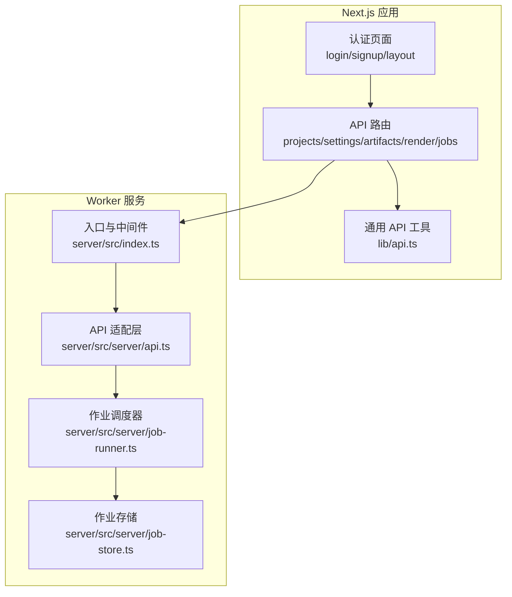
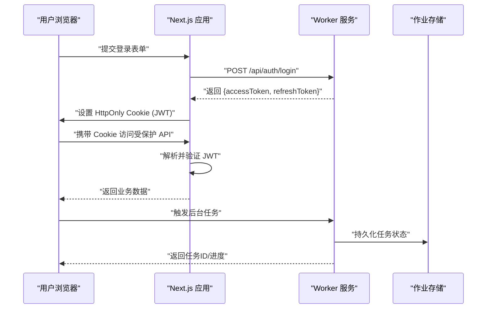
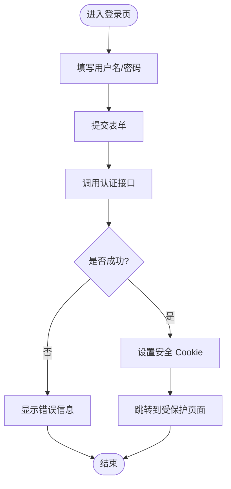
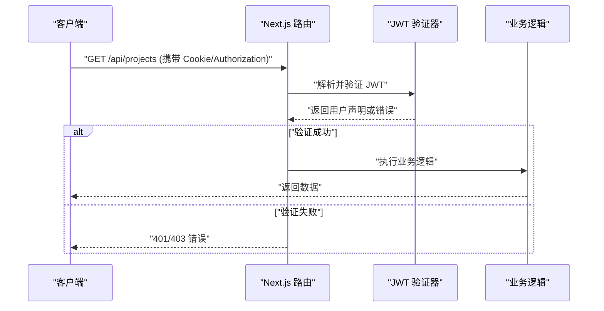
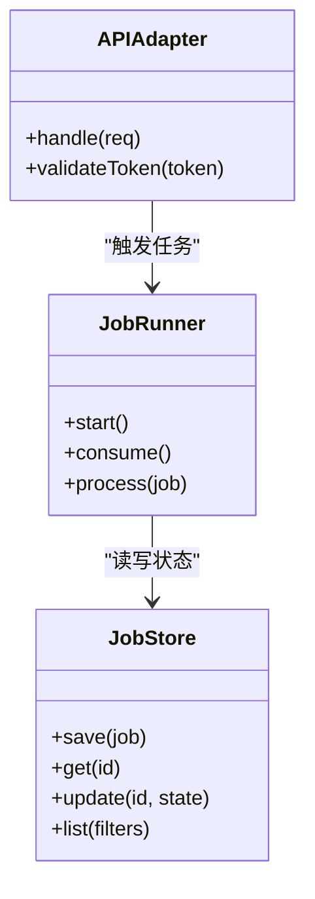
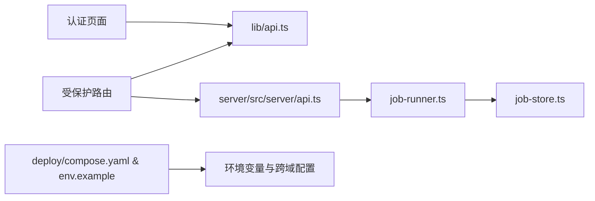

# 会话管理

<cite>
**本文档引用的文件**   
- [src/app/(auth)/login/page.tsx](file://src/app/(auth)/login/page.tsx)
- [src/app/(auth)/signup/page.tsx](file://src/app/(auth)/signup/page.tsx)
- [src/app/(auth)/layout.tsx](file://src/app/(auth)/layout.tsx)
- [src/app/(auth)/_components/auth-shell-form.tsx](file://src/app/(auth)/_components/auth-shell-form.tsx)
- [src/app/api/settings/route.ts](file://src/app/api/settings/route.ts)
- [src/app/api/projects/route.ts](file://src/app/api/projects/route.ts)
- [src/app/api/artifacts/[id]/route.ts](file://src/app/api/artifacts/[id]/route.ts)
- [src/app/api/director/pipeline/route.ts](file://src/app/api/director/pipeline/route.ts)
- [src/app/api/render/route.ts](file://src/app/api/render/route.ts)
- [src/app/api/jobs/[id]/route.ts](file://src/app/api/jobs/[id]/route.ts)
- [src/lib/api.ts](file://src/lib/api.ts)
- [server/src/index.ts](file://server/src/index.ts)
- [server/src/server/api.ts](file://server/src/server/api.ts)
- [server/src/server/job-runner.ts](file://server/src/server/job-runner.ts)
- [server/src/server/job-store.ts](file://server/src/server/job-store.ts)
- [deploy/compose.yaml](file://deploy/compose.yaml)
- [deploy/env.example](file://deploy/env.example)
- [package.json](file://package.json)
</cite>

## 目录
1. [简介](#简介)
2. [项目结构](#项目结构)
3. [核心组件](#核心组件)
4. [架构总览](#架构总览)
5. [详细组件分析](#详细组件分析)
6. [依赖关系分析](#依赖关系分析)
7. [性能考量](#性能考量)
8. [故障排查指南](#故障排查指南)
9. [结论](#结论)
10. [附录](#附录)

## 简介
本文件面向 PurpleInk 平台的会话管理，聚焦基于 JWT 的会话生命周期：令牌生成、验证、刷新与销毁；客户端与服务端存储策略（安全存储、过期处理、跨域配置）；会话状态同步、并发控制与内存优化；并提供可操作的示例流程。同时给出安全最佳实践，包括防重放攻击、会话固定攻击防护与敏感信息保护。

## 项目结构
PurpleInk 采用 Next.js 应用（前端/服务端同构）与独立 worker 服务（server 目录）的组合。认证与会话相关代码集中在以下位置：
- 认证页面与表单：(auth) 路由下的登录、注册与布局
- API 路由：受保护的 API 路由用于演示鉴权上下文获取
- 通用 API 工具：封装请求头、Cookie 与错误处理
- Worker 服务：后台任务执行与持久化

图表来源
- [src/app/(auth)/login/page.tsx](file://src/app/(auth)/login/page.tsx)
- [src/app/(auth)/signup/page.tsx](file://src/app/(auth)/signup/page.tsx)
- [src/app/(auth)/layout.tsx](file://src/app/(auth)/layout.tsx)
- [src/app/api/projects/route.ts](file://src/app/api/projects/route.ts)
- [src/app/api/settings/route.ts](file://src/app/api/settings/route.ts)
- [src/lib/api.ts](file://src/lib/api.ts)
- [server/src/index.ts](file://server/src/index.ts)
- [server/src/server/api.ts](file://server/src/server/api.ts)
- [server/src/server/job-runner.ts](file://server/src/server/job-runner.ts)
- [server/src/server/job-store.ts](file://server/src/server/job-store.ts)

章节来源
- [src/app/(auth)/login/page.tsx](file://src/app/(auth)/login/page.tsx)
- [src/app/(auth)/signup/page.tsx](file://src/app/(auth)/signup/page.tsx)
- [src/app/(auth)/layout.tsx](file://src/app/(auth)/layout.tsx)
- [src/app/api/projects/route.ts](file://src/app/api/projects/route.ts)
- [src/app/api/settings/route.ts](file://src/app/api/settings/route.ts)
- [src/lib/api.ts](file://src/lib/api.ts)
- [server/src/index.ts](file://server/src/index.ts)
- [server/src/server/api.ts](file://server/src/server/api.ts)
- [server/src/server/job-runner.ts](file://server/src/server/job-runner.ts)
- [server/src/server/job-store.ts](file://server/src/server/job-store.ts)

## 核心组件
- 认证页面与表单：负责用户输入收集、调用后端接口、处理响应并更新本地状态或 Cookie
- API 路由：在受保护接口中解析并校验 JWT，提取用户身份与权限，返回业务数据
- 通用 API 工具：统一设置请求头（如 Authorization/Cookie）、处理错误与重试
- Worker 服务：接收并执行后台任务，使用作业存储进行状态持久化与幂等控制

章节来源
- [src/app/(auth)/login/page.tsx](file://src/app/(auth)/login/page.tsx)
- [src/app/(auth)/signup/page.tsx](file://src/app/(auth)/signup/page.tsx)
- [src/app/(auth)/layout.tsx](file://src/app/(auth)/layout.tsx)
- [src/app/api/projects/route.ts](file://src/app/api/projects/route.ts)
- [src/app/api/settings/route.ts](file://src/app/api/settings/route.ts)
- [src/lib/api.ts](file://src/lib/api.ts)
- [server/src/server/job-runner.ts](file://server/src/server/job-runner.ts)
- [server/src/server/job-store.ts](file://server/src/server/job-store.ts)

## 架构总览
下图展示从登录到访问受保护资源的完整会话流，以及后台任务的执行路径。

图表来源
- [src/app/(auth)/login/page.tsx](file://src/app/(auth)/login/page.tsx)
- [src/app/api/projects/route.ts](file://src/app/api/projects/route.ts)
- [server/src/server/job-runner.ts](file://server/src/server/job-runner.ts)
- [server/src/server/job-store.ts](file://server/src/server/job-store.ts)

## 详细组件分析

### 认证页面与表单
- 登录/注册页负责收集凭据、调用认证接口、处理成功与失败分支
- 成功后通过响应头或 JSON 获取令牌，并在客户端设置安全 Cookie
- 失败时展示错误信息并清空输入

图表来源
- [src/app/(auth)/login/page.tsx](file://src/app/(auth)/login/page.tsx)
- [src/app/(auth)/signup/page.tsx](file://src/app/(auth)/signup/page.tsx)
- [src/app/(auth)/_components/auth-shell-form.tsx](file://src/app/(auth)/_components/auth-shell-form.tsx)

章节来源
- [src/app/(auth)/login/page.tsx](file://src/app/(auth)/login/page.tsx)
- [src/app/(auth)/signup/page.tsx](file://src/app/(auth)/signup/page.tsx)
- [src/app/(auth)/_components/auth-shell-form.tsx](file://src/app/(auth)/_components/auth-shell-form.tsx)

### 受保护 API 路由（JWT 验证）
- 路由从请求头或 Cookie 中提取 JWT
- 验证签名、有效期与必要声明
- 将用户身份注入请求上下文，供业务逻辑使用

图表来源
- [src/app/api/projects/route.ts](file://src/app/api/projects/route.ts)
- [src/app/api/settings/route.ts](file://src/app/api/settings/route.ts)
- [src/app/api/artifacts/[id]/route.ts](file://src/app/api/artifacts/[id]/route.ts)
- [src/app/api/director/pipeline/route.ts](file://src/app/api/director/pipeline/route.ts)
- [src/app/api/render/route.ts](file://src/app/api/render/route.ts)
- [src/app/api/jobs/[id]/route.ts](file://src/app/api/jobs/[id]/route.ts)

章节来源
- [src/app/api/projects/route.ts](file://src/app/api/projects/route.ts)
- [src/app/api/settings/route.ts](file://src/app/api/settings/route.ts)
- [src/app/api/artifacts/[id]/route.ts](file://src/app/api/artifacts/[id]/route.ts)
- [src/app/api/director/pipeline/route.ts](file://src/app/api/director/pipeline/route.ts)
- [src/app/api/render/route.ts](file://src/app/api/render/route.ts)
- [src/app/api/jobs/[id]/route.ts](file://src/app/api/jobs/[id]/route.ts)

### 通用 API 工具（请求封装）
- 统一设置请求头（如 Authorization、Cookie）
- 处理网络错误与业务错误，提供重试与超时控制
- 为后续扩展刷新令牌机制预留钩子

章节来源
- [src/lib/api.ts](file://src/lib/api.ts)

### Worker 服务（后台任务与会话关联）
- 入口初始化中间件与路由
- 作业调度器按队列消费任务，保证并发与幂等
- 作业存储持久化状态，支持查询与恢复

图表来源
- [server/src/server/job-runner.ts](file://server/src/server/job-runner.ts)
- [server/src/server/job-store.ts](file://server/src/server/job-store.ts)
- [server/src/server/api.ts](file://server/src/server/api.ts)

章节来源
- [server/src/index.ts](file://server/src/index.ts)
- [server/src/server/api.ts](file://server/src/server/api.ts)
- [server/src/server/job-runner.ts](file://server/src/server/job-runner.ts)
- [server/src/server/job-store.ts](file://server/src/server/job-store.ts)

## 依赖关系分析
- Next.js 应用依赖 lib/api.ts 进行 HTTP 交互
- 受保护路由依赖 JWT 验证逻辑（可在中间件或路由内实现）
- Worker 服务通过 job-runner 与 job-store 协作，确保任务可靠执行
- 部署配置（compose、env）决定环境变量与跨域策略

图表来源
- [src/lib/api.ts](file://src/lib/api.ts)
- [src/app/api/projects/route.ts](file://src/app/api/projects/route.ts)
- [server/src/server/api.ts](file://server/src/server/api.ts)
- [server/src/server/job-runner.ts](file://server/src/server/job-runner.ts)
- [server/src/server/job-store.ts](file://server/src/server/job-store.ts)
- [deploy/compose.yaml](file://deploy/compose.yaml)
- [deploy/env.example](file://deploy/env.example)

章节来源
- [package.json](file://package.json)
- [deploy/compose.yaml](file://deploy/compose.yaml)
- [deploy/env.example](file://deploy/env.example)

## 性能考量
- 令牌大小与载荷最小化：仅包含必要声明，减少传输与解析开销
- 短 TTL + 刷新令牌：降低泄露风险，提升整体安全性
- 无状态验证：服务端不缓存会话，避免内存膨胀与一致性难题
- 批量与懒加载：对受保护资源进行分页与按需加载，减少首屏压力
- 队列与并发：worker 侧限制并发度，避免过载；使用幂等键防止重复处理

[本节为通用指导，不直接分析具体文件]

## 故障排查指南
- 401/403 错误：检查 Cookie/Authorization 是否正确设置与传递；确认 JWT 签名与有效期
- 跨域问题：核对 CORS 配置与 Cookie SameSite/Secure 属性
- 刷新失败：检查刷新令牌是否有效且未过期；确认刷新接口未被拦截
- 任务失败：查看作业存储状态与日志；确认幂等键与重试策略

章节来源
- [src/app/api/projects/route.ts](file://src/app/api/projects/route.ts)
- [src/app/api/settings/route.ts](file://src/app/api/settings/route.ts)
- [src/lib/api.ts](file://src/lib/api.ts)
- [server/src/server/job-runner.ts](file://server/src/server/job-runner.ts)
- [server/src/server/job-store.ts](file://server/src/server/job-store.ts)

## 结论
PurpleInk 的会话管理以 JWT 为核心，结合安全的 Cookie 存储与严格的验证流程，确保用户身份与权限的正确性。通过无状态设计与合理的过期策略，系统在安全性与性能之间取得平衡。建议在生产环境启用 HTTPS、HttpOnly/SameSite/Secure Cookie、短 TTL 与刷新令牌，并完善监控与审计能力。

[本节为总结性内容，不直接分析具体文件]

## 附录

### 会话操作示例（创建、验证、刷新、销毁）
- 创建会话（登录）
  - 客户端提交用户名/密码至认证接口
  - 服务端签发 accessToken 与 refreshToken，并通过响应头返回
  - 客户端设置安全 Cookie（HttpOnly、Secure、SameSite）
- 验证会话（访问受保护资源）
  - 客户端在请求中携带 Cookie 或 Authorization
  - 服务端解析并验证 JWT，成功则返回数据，失败则返回 401/403
- 刷新会话（续期）
  - 客户端使用 refreshToken 调用刷新接口
  - 服务端校验后签发新 accessToken，必要时轮换 refreshToken
- 销毁会话（登出）
  - 客户端清除本地 Cookie 与内存中的令牌
  - 服务端可选地加入黑名单或使刷新令牌失效

章节来源
- [src/app/(auth)/login/page.tsx](file://src/app/(auth)/login/page.tsx)
- [src/app/(auth)/signup/page.tsx](file://src/app/(auth)/signup/page.tsx)
- [src/app/api/projects/route.ts](file://src/app/api/projects/route.ts)
- [src/lib/api.ts](file://src/lib/api.ts)

### 客户端与服务端存储策略
- 客户端存储
  - 优先使用 HttpOnly Cookie 存储 accessToken，避免 XSS 读取
  - refreshToken 可存储在安全 Cookie 或加密存储（如 Web Crypto），避免明文
  - 禁止将敏感信息写入 localStorage/sessionStorage
- 服务端存储
  - JWT 无状态验证，不持久化会话；如需黑名单，使用高性能 KV（Redis）
  - 刷新令牌可短期持久化并与设备指纹绑定，便于撤销与审计
- 过期处理
  - accessToken 短 TTL（如 5-15 分钟），refreshToken 较长（如 7-30 天）
  - 客户端检测到 401 时自动触发刷新流程，失败则引导重新登录

章节来源
- [src/lib/api.ts](file://src/lib/api.ts)
- [deploy/env.example](file://deploy/env.example)

### 跨域与安全配置
- CORS：限定允许的源、方法与头部；生产环境严格白名单
- Cookie：启用 Secure、HttpOnly、SameSite=Strict/Lax
- 传输：强制 HTTPS，禁用明文传输
- 密钥管理：JWT 签名密钥与刷新令牌密钥通过环境变量注入，避免硬编码

章节来源
- [deploy/compose.yaml](file://deploy/compose.yaml)
- [deploy/env.example](file://deploy/env.example)

### 会话状态同步、并发控制与内存优化
- 状态同步：JWT 无状态设计天然支持多实例；如需强一致，使用外部存储（Redis）做黑名单或设备绑定
- 并发控制：worker 侧限制并发度，使用队列与锁避免重复处理；幂等键保障一致性
- 内存优化：避免在服务端缓存大对象；定期清理临时数据与过期令牌

章节来源
- [server/src/server/job-runner.ts](file://server/src/server/job-runner.ts)
- [server/src/server/job-store.ts](file://server/src/server/job-store.ts)

### 安全最佳实践
- 防重放攻击：为关键接口添加一次性 nonce 或时间戳校验；服务端记录已处理的请求摘要
- 会话固定攻击防护：登录后更换令牌；刷新令牌轮换；绑定设备指纹
- 敏感信息保护：不在 JWT 中存放敏感数据；服务端校验最小权限；输出脱敏
- 审计与监控：记录登录、刷新、登出与异常事件；告警频繁失败与异常 IP

[本节为通用指导，不直接分析具体文件]