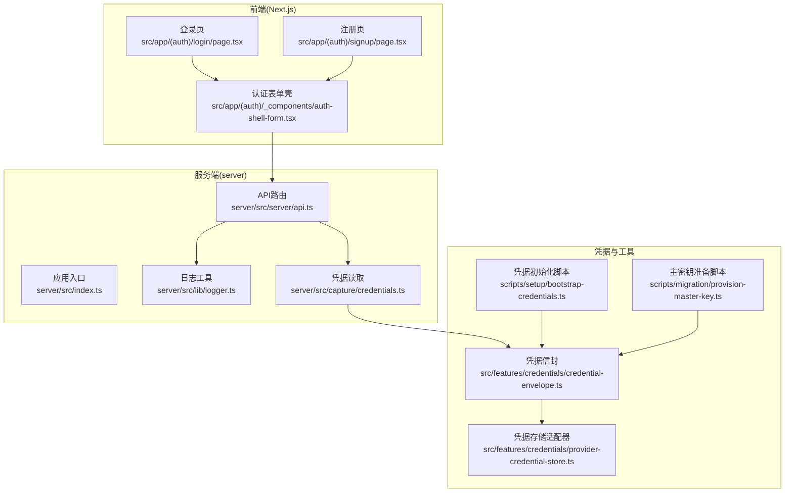
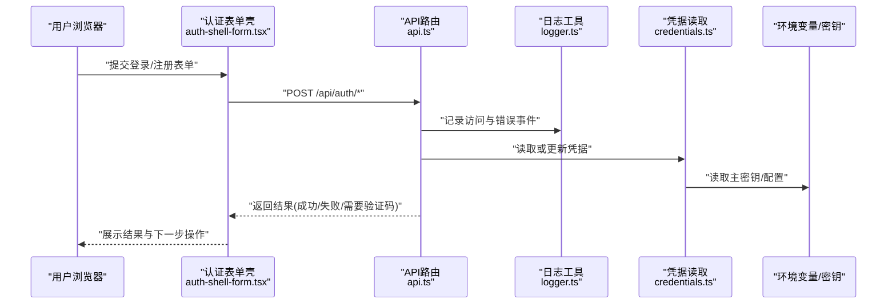
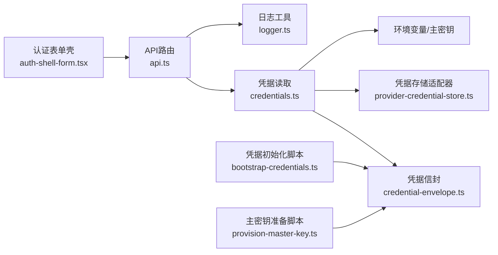

# 密码验证与安全

<cite>
**本文档引用的文件**   
- [src/app/(auth)/login/page.tsx](file://src/app/(auth)/login/page.tsx)
- [src/app/(auth)/signup/page.tsx](file://src/app/(auth)/signup/page.tsx)
- [src/app/(auth)/_components/auth-shell-form.tsx](file://src/app/(auth)/_components/auth-shell-form.tsx)
- [server/src/index.ts](file://server/src/index.ts)
- [server/src/server/api.ts](file://server/src/server/api.ts)
- [server/src/lib/logger.ts](file://server/src/lib/logger.ts)
- [server/src/capture/credentials.ts](file://server/src/capture/credentials.ts)
- [src/features/credentials/credential-envelope.ts](file://src/features/credentials/credential-envelope.ts)
- [src/features/credentials/provider-credential-store.ts](file://src/features/credentials/provider-credential-store.ts)
- [scripts/setup/bootstrap-credentials.ts](file://scripts/setup/bootstrap-credentials.ts)
- [scripts/migration/provision-master-key.ts](file://scripts/migration/provision-master-key.ts)
</cite>

## 目录
1. [简介](#简介)
2. [项目结构](#项目结构)
3. [核心组件](#核心组件)
4. [架构总览](#架构总览)
5. [详细组件分析](#详细组件分析)
6. [依赖关系分析](#依赖关系分析)
7. [性能考虑](#性能考虑)
8. [故障排查指南](#故障排查指南)
9. [结论](#结论)
10. [附录](#附录)

## 简介
本文件面向 PurpleInK 平台的密码验证与安全实现，聚焦以下主题：
- 密码加密存储与哈希算法选择
- 密码强度校验策略
- 验证码（图形、短信）的生成、验证与过期机制
- 密码重置流程、邮件验证与安全链接生成
- 安全操作示例与最佳实践
- 密码策略配置、暴力破解防护与账户锁定
- 安全审计日志与异常检测方案

说明：当前仓库未包含完整的认证鉴权后端实现。本文基于现有前端认证页面、凭据封装与脚本工具进行安全设计建议与落地指引，确保在后续接入认证服务时具备一致的安全基线。

## 项目结构
与认证与安全相关的前端入口位于 Next.js 的路由中，服务端能力集中在 server 子工程，凭据处理与初始化脚本分布于 features 与 scripts 目录。

图表来源
- [src/app/(auth)/login/page.tsx](file://src/app/(auth)/login/page.tsx)
- [src/app/(auth)/signup/page.tsx](file://src/app/(auth)/signup/page.tsx)
- [src/app/(auth)/_components/auth-shell-form.tsx](file://src/app/(auth)/_components/auth-shell-form.tsx)
- [server/src/index.ts](file://server/src/index.ts)
- [server/src/server/api.ts](file://server/src/server/api.ts)
- [server/src/lib/logger.ts](file://server/src/lib/logger.ts)
- [server/src/capture/credentials.ts](file://server/src/capture/credentials.ts)
- [src/features/credentials/credential-envelope.ts](file://src/features/credentials/credential-envelope.ts)
- [src/features/credentials/provider-credential-store.ts](file://src/features/credentials/provider-credential-store.ts)
- [scripts/setup/bootstrap-credentials.ts](file://scripts/setup/bootstrap-credentials.ts)
- [scripts/migration/provision-master-key.ts](file://scripts/migration/provision-master-key.ts)

章节来源
- [src/app/(auth)/login/page.tsx](file://src/app/(auth)/login/page.tsx)
- [src/app/(auth)/signup/page.tsx](file://src/app/(auth)/signup/page.tsx)
- [src/app/(auth)/_components/auth-shell-form.tsx](file://src/app/(auth)/_components/auth-shell-form.tsx)
- [server/src/index.ts](file://server/src/index.ts)
- [server/src/server/api.ts](file://server/src/server/api.ts)
- [server/src/lib/logger.ts](file://server/src/lib/logger.ts)
- [server/src/capture/credentials.ts](file://server/src/capture/credentials.ts)
- [src/features/credentials/credential-envelope.ts](file://src/features/credentials/credential-envelope.ts)
- [src/features/credentials/provider-credential-store.ts](file://src/features/credentials/provider-credential-store.ts)
- [scripts/setup/bootstrap-credentials.ts](file://scripts/setup/bootstrap-credentials.ts)
- [scripts/migration/provision-master-key.ts](file://scripts/migration/provision-master-key.ts)

## 核心组件
- 认证页面与表单
  - 登录与注册页面负责收集用户输入，调用统一认证表单壳进行交互与校验。
  - 表单壳提供统一的错误展示、加载状态与提交行为。
- 服务端 API 与日志
  - API 路由作为请求入口，集中记录关键事件与错误信息。
  - 日志工具用于输出结构化审计信息。
- 凭据封装与存储
  - 凭据信封对敏感信息进行统一包装，便于传输与持久化。
  - 凭据存储适配器对接不同后端存储。
- 初始化与主密钥
  - 凭据初始化脚本用于环境初始化。
  - 主密钥准备脚本为后续加解密提供基础。

章节来源
- [src/app/(auth)/login/page.tsx](file://src/app/(auth)/login/page.tsx)
- [src/app/(auth)/signup/page.tsx](file://src/app/(auth)/signup/page.tsx)
- [src/app/(auth)/_components/auth-shell-form.tsx](file://src/app/(auth)/_components/auth-shell-form.tsx)
- [server/src/server/api.ts](file://server/src/server/api.ts)
- [server/src/lib/logger.ts](file://server/src/lib/logger.ts)
- [src/features/credentials/credential-envelope.ts](file://src/features/credentials/credential-envelope.ts)
- [src/features/credentials/provider-credential-store.ts](file://src/features/credentials/provider-credential-store.ts)
- [scripts/setup/bootstrap-credentials.ts](file://scripts/setup/bootstrap-credentials.ts)
- [scripts/migration/provision-master-ke y.ts](file://scripts/migration/provision-master-key.ts)

## 架构总览
下图展示了从前端到后端的认证与安全相关数据流，以及凭据与日志的关键路径。

图表来源
- [src/app/(auth)/_components/auth-shell-form.tsx](file://src/app/(auth)/_components/auth-shell-form.tsx)
- [server/src/server/api.ts](file://server/src/server/api.ts)
- [server/src/lib/logger.ts](file://server/src/lib/logger.ts)
- [server/src/capture/credentials.ts](file://server/src/capture/credentials.ts)

## 详细组件分析

### 密码加密存储与哈希算法选择
- 存储原则
  - 密码不应以明文存储；应使用抗碰撞、抗预计算的单向哈希算法。
  - 推荐采用带盐值的慢速哈希（如 Argon2id、bcrypt、scrypt），并保证每个用户独立盐值。
- 算法选择
  - Argon2id：内存硬化、抗 GPU/ASIC 攻击，适合高安全场景。
  - bcrypt：成熟稳定，广泛支持，参数可调（成本因子）。
  - scrypt：可配置 CPU/内存开销，适用于资源受限环境。
- 实现要点
  - 哈希参数（成本因子、内存、并行度）需随硬件升级而调整。
  - 避免自定义“加盐+拼接”等弱方案。
  - 数据库字段长度需满足所选算法的最大输出长度。
- 迁移策略
  - 首次登录时对旧哈希进行重新哈希（惰性迁移）。
  - 批量任务定期扫描并升级弱哈希。

章节来源
- [server/src/capture/credentials.ts](file://server/src/capture/credentials.ts)
- [src/features/credentials/credential-envelope.ts](file://src/features/credentials/credential-envelope.ts)
- [scripts/migration/provision-master-key.ts](file://scripts/migration/provision-master-key.ts)

### 密码强度验证
- 规则建议
  - 最小长度（例如 ≥12 字符）。
  - 复杂度要求（大小写字母、数字、特殊字符至少三类）。
  - 禁止常见弱口令与字典词。
  - 禁止与用户名、邮箱相近的字符串。
- 实现位置
  - 前端即时校验提升用户体验。
  - 后端必须再次校验，防止绕过。
- 反馈与提示
  - 实时显示强度等级与改进建议。
  - 明确失败原因，避免泄露系统规则细节。

章节来源
- [src/app/(auth)/signup/page.tsx](file://src/app/(auth)/signup/page.tsx)
- [src/app/(auth)/_components/auth-shell-form.tsx](file://src/app/(auth)/_components/auth-shell-form.tsx)

### 验证码机制（图形验证码与短信验证码）
- 图形验证码
  - 生成：随机字符、混淆背景、噪声干扰。
  - 存储：短期缓存（Redis/内存），设置过期时间（如 2-5 分钟）。
  - 验证：一次性校验，成功后立即失效。
  - 防刷：按 IP/设备维度限制尝试次数。
- 短信验证码
  - 生成：随机数字（如 6 位），签名与模板管理。
  - 发送：限频（同一号码每分钟/小时上限）。
  - 存储：短期缓存，严格过期。
  - 验证：一次性校验，失败计数与锁定阈值。
- 安全要点
  - 验证码不进入日志。
  - 传输层强制 HTTPS。
  - 服务端校验来源与签名。

章节来源
- [server/src/server/api.ts](file://server/src/server/api.ts)
- [server/src/lib/logger.ts](file://server/src/lib/logger.ts)

### 密码重置流程、邮件验证与安全链接
- 流程步骤
  - 用户提交邮箱，服务端生成一次性重置令牌（短有效期、强随机）。
  - 发送邮件包含安全链接（含令牌与签名）。
  - 用户点击链接，服务端验证令牌有效性、时间与签名。
  - 验证通过后允许设置新密码，并立即使旧令牌失效。
- 安全要点
  - 令牌长度与熵足够，避免预测。
  - 链接仅一次有效，且绑定用户上下文。
  - 邮件内容不包含敏感信息（如明文密码）。
  - 记录重置尝试与结果（脱敏）。

章节来源
- [server/src/server/api.ts](file://server/src/server/api.ts)
- [server/src/lib/logger.ts](file://server/src/lib/logger.ts)

### 安全操作示例（如何安全地处理用户密码）
- 注册
  - 前端校验强度 → 后端再次校验 → 生成盐值 → 计算哈希 → 存储哈希与元数据。
- 登录
  - 根据用户名查找用户 → 读取存储的哈希 → 使用相同参数计算比对 → 成功则签发会话令牌。
- 修改密码
  - 验证旧密码 → 校验新密码强度 → 重新哈希存储 → 使旧会话失效。
- 重置密码
  - 验证重置令牌 → 校验新密码强度 → 重新哈希存储 → 清理令牌。

章节来源
- [src/app/(auth)/login/page.tsx](file://src/app/(auth)/login/page.tsx)
- [src/app/(auth)/signup/page.tsx](file://src/app/(auth)/signup/page.tsx)
- [src/app/(auth)/_components/auth-shell-form.tsx](file://src/app/(auth)/_components/auth-shell-form.tsx)
- [server/src/server/api.ts](file://server/src/server/api.ts)

### 密码策略配置、暴力破解防护与账户锁定
- 策略配置
  - 最小长度、复杂度、历史重复限制、过期周期（可选）。
  - 通过环境变量或配置中心下发，支持灰度与热更新。
- 暴力破解防护
  - 登录失败计数与冷却时间（指数退避）。
  - 触发阈值后要求二次验证（验证码/短信）。
  - 针对 IP/账号维度的速率限制。
- 账户锁定
  - 连续失败达到阈值临时锁定（如 15 分钟）。
  - 锁定期间拒绝登录并记录审计日志。
  - 解锁方式：等待到期或管理员介入。

章节来源
- [server/src/server/api.ts](file://server/src/server/api.ts)
- [server/src/lib/logger.ts](file://server/src/lib/logger.ts)

### 安全审计日志与异常检测
- 审计日志
  - 记录登录/注册/重置/修改密码等关键事件（脱敏）。
  - 包含时间戳、来源 IP、用户标识（脱敏）、结果、错误码。
- 异常检测
  - 高频失败、异地登录、非常用设备、异常时段。
  - 告警阈值与通知渠道（邮件/IM）。
- 日志安全
  - 禁止记录敏感数据（密码、令牌、验证码）。
  - 日志分级与保留策略，访问控制与完整性校验。

章节来源
- [server/src/lib/logger.ts](file://server/src/lib/logger.ts)
- [server/src/server/api.ts](file://server/src/server/api.ts)

## 依赖关系分析

图表来源
- [src/app/(auth)/_components/auth-shell-form.tsx](file://src/app/(auth)/_components/auth-shell-form.tsx)
- [server/src/server/api.ts](file://server/src/server/api.ts)
- [server/src/lib/logger.ts](file://server/src/lib/logger.ts)
- [server/src/capture/credentials.ts](file://server/src/capture/credentials.ts)
- [src/features/credentials/provider-credential-store.ts](file://src/features/credentials/provider-credential-store.ts)
- [src/features/credentials/credential-envelope.ts](file://src/features/credentials/credential-envelope.ts)
- [scripts/setup/bootstrap-credentials.ts](file://scripts/setup/bootstrap-credentials.ts)
- [scripts/migration/provision-master-key.ts](file://scripts/migration/provision-master-key.ts)

章节来源
- [server/src/index.ts](file://server/src/index.ts)
- [server/src/server/api.ts](file://server/src/server/api.ts)
- [server/src/lib/logger.ts](file://server/src/lib/logger.ts)
- [server/src/capture/credentials.ts](file://server/src/capture/credentials.ts)
- [src/features/credentials/credential-envelope.ts](file://src/features/credentials/credential-envelope.ts)
- [src/features/credentials/provider-credential-store.ts](file://src/features/credentials/provider-credential-store.ts)
- [scripts/setup/bootstrap-credentials.ts](file://scripts/setup/bootstrap-credentials.ts)
- [scripts/migration/provision-master-key.ts](file://scripts/migration/provision-master-key.ts)

## 性能考虑
- 哈希计算开销
  - 合理设置成本因子，平衡安全性与响应时间。
  - 异步处理与超时控制，避免阻塞请求。
- 验证码缓存
  - 使用高性能缓存（如 Redis），设置短 TTL。
  - 分布式环境下注意键空间隔离与一致性。
- 限流与锁
  - 使用滑动窗口或令牌桶算法实现精准限流。
  - 账户锁定采用原子操作，避免竞态条件。
- 日志写入
  - 异步落盘与批处理，降低 IO 压力。
  - 轮转与压缩，控制磁盘占用。

[本节为通用指导，无需特定文件引用]

## 故障排查指南
- 常见问题
  - 登录失败：检查凭据读取、哈希参数、日志错误码。
  - 验证码无效：确认缓存存在、未过期、未被消费。
  - 重置链接失效：检查令牌有效期、签名校验、是否已使用。
- 定位方法
  - 查看 API 路由日志与错误堆栈。
  - 检查凭据存储适配器连接与权限。
  - 核对环境变量与主密钥配置。
- 恢复措施
  - 清理过期缓存与锁定状态。
  - 重置用户会话与令牌。
  - 回滚配置变更并重启服务。

章节来源
- [server/src/server/api.ts](file://server/src/server/api.ts)
- [server/src/lib/logger.ts](file://server/src/lib/logger.ts)
- [server/src/capture/credentials.ts](file://server/src/capture/credentials.ts)

## 结论
PurpleInK 平台应在认证与安全方面遵循“最小信任、纵深防御”的原则：
- 使用强哈希与独立盐值存储密码。
- 实施严格的密码强度与策略配置。
- 验证码与重置令牌具备短生命周期与一次性特性。
- 全面记录审计日志并建立异常检测与告警。
- 通过限流与账户锁定抵御暴力破解。
- 借助凭据信封与主密钥管理保障敏感数据安全。

[本节为总结性内容，无需特定文件引用]

## 附录
- 术语表
  - 哈希：将任意长度数据映射为固定长度摘要的单向函数。
  - 盐值：用于增加哈希唯一性的随机数据。
  - 令牌：一次性或短期有效的访问凭证。
- 参考实现位置
  - 认证页面与表单：登录/注册页与表单壳。
  - API 与日志：服务端 API 路由与日志工具。
  - 凭据与密钥：凭据信封、存储适配器与初始化脚本。

[本节为补充信息，无需特定文件引用]