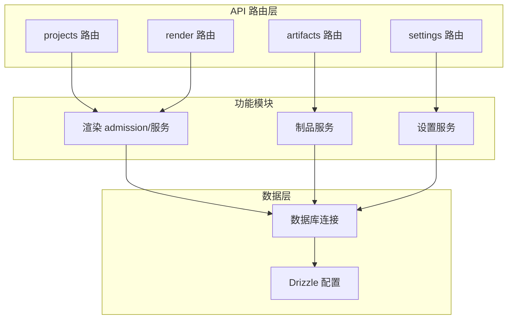
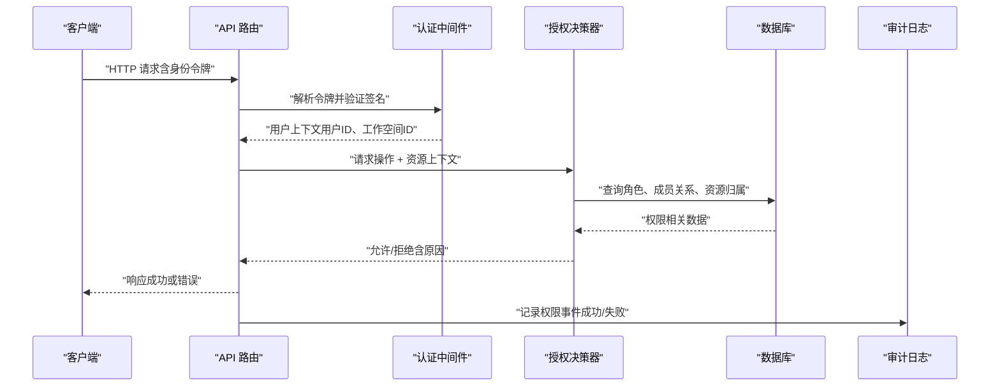
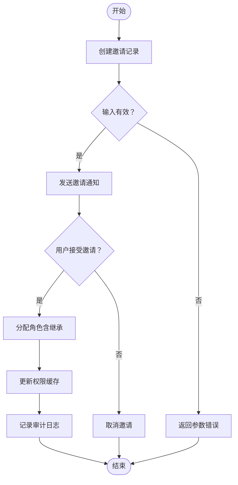
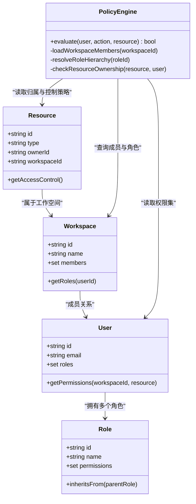
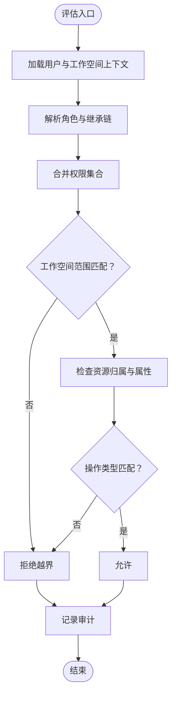
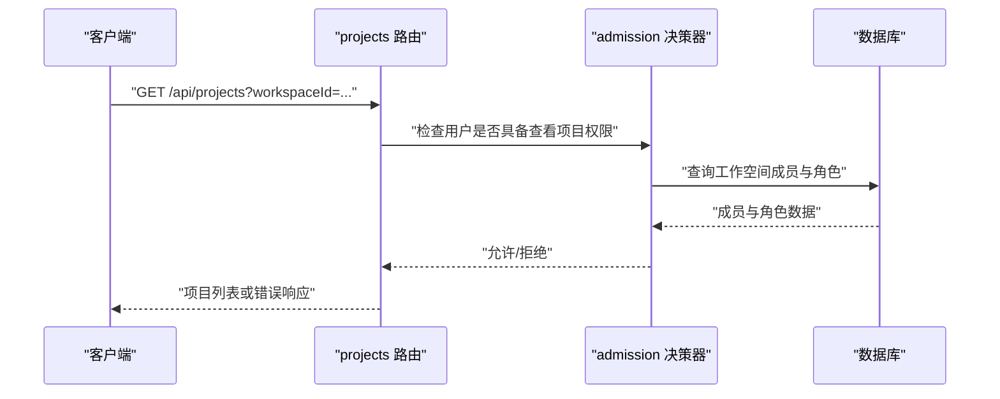
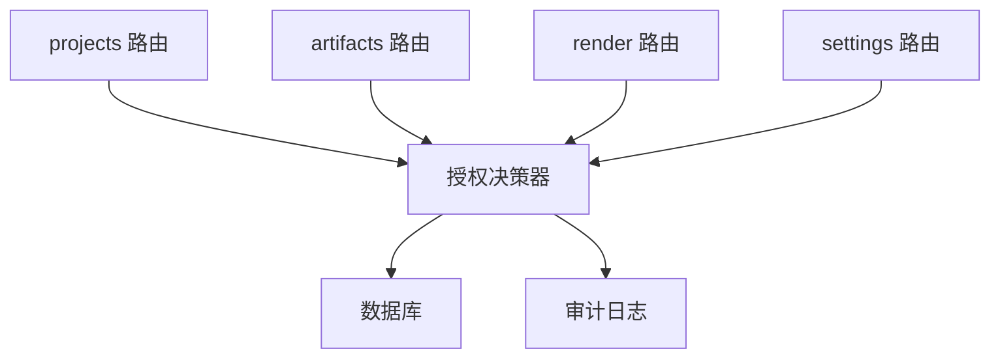

# 权限控制系统

<cite>
**本文引用的文件**   
- [src/app/api/projects/route.ts](file://src/app/api/projects/route.ts)
- [src/app/api/artifacts/[id]/route.ts](file://src/app/api/artifacts/[id]/route.ts)
- [src/app/api/render/route.ts](file://src/app/api/render/route.ts)
- [src/app/api/settings/route.ts](file://src/app/api/settings/route.ts)
- [src/features/render/admission.ts](file://src/features/render/admission.ts)
- [src/lib/db/index.ts](file://src/lib/db/index.ts)
- [drizzle.config.ts](file://drizzle.config.ts)
</cite>

## 目录
1. [简介](#简介)
2. [项目结构](#项目结构)
3. [核心组件](#核心组件)
4. [架构总览](#架构总览)
5. [详细组件分析](#详细组件分析)
6. [依赖关系分析](#依赖关系分析)
7. [性能考虑](#性能考虑)
8. [故障排查指南](#故障排查指南)
9. [结论](#结论)
10. [附录](#附录)

## 简介
本文件为 PurpleInK 平台的权限控制系统提供系统化文档，聚焦基于角色的访问控制（RBAC）与工作空间级权限管理。内容涵盖角色定义、权限分配与继承、资源级细粒度控制、动态权限评估、缓存策略与一致性保证、审计日志与合规报告等。由于当前仓库中未包含完整的 RBAC 实现代码，本文在“现状说明”基础上给出可落地的设计蓝图与实施建议，帮助团队在现有 API 路由与服务层之上构建统一的权限体系。

## 项目结构
从仓库结构看，权限相关能力主要分布在以下位置：
- API 路由层：Next.js App Router 的 server routes，用于处理请求入口与鉴权前置校验。
- 功能模块：如渲染、制品、设置等特性模块，承载业务逻辑与数据访问。
- 数据库与配置：Drizzle ORM 配置与数据库连接，支撑用户、角色、工作空间、成员关系与权限表。

图表来源
- [src/app/api/projects/route.ts](file://src/app/api/projects/route.ts)
- [src/app/api/artifacts/[id]/route.ts](file://src/app/api/artifacts/[id]/route.ts)
- [src/app/api/render/route.ts](file://src/app/api/render/route.ts)
- [src/app/api/settings/route.ts](file://src/app/api/settings/route.ts)
- [src/features/render/admission.ts](file://src/features/render/admission.ts)
- [src/lib/db/index.ts](file://src/lib/db/index.ts)
- [drizzle.config.ts](file://drizzle.config.ts)

章节来源
- [src/app/api/projects/route.ts](file://src/app/api/projects/route.ts)
- [src/app/api/artifacts/[id]/route.ts](file://src/app/api/artifacts/[id]/route.ts)
- [src/app/api/render/route.ts](file://src/app/api/render/route.ts)
- [src/app/api/settings/route.ts](file://src/app/api/settings/route.ts)
- [src/features/render/admission.ts](file://src/features/render/admission.ts)
- [src/lib/db/index.ts](file://src/lib/db/index.ts)
- [drizzle.config.ts](file://drizzle.config.ts)

## 核心组件
- 认证与会话上下文：统一解析请求中的身份标识（如 JWT），构造用户上下文对象，包含用户 ID、租户/工作空间 ID、角色与权限集合。
- 授权决策器（Policy Engine）：基于 RBAC 模型进行权限判定，支持角色继承、工作空间范围限定与资源级细粒度控制。
- 中间件/守卫：在 API 路由入口处执行鉴权检查，拒绝无权限或越权访问。
- 数据访问层：通过 Drizzle 查询用户-角色-工作空间-成员关系与资源归属，确保权限判断的数据准确性。
- 审计与合规：记录关键权限事件（邀请、授予、撤销、访问失败等），生成合规报表。

章节来源
- [src/app/api/projects/route.ts](file://src/app/api/projects/route.ts)
- [src/app/api/artifacts/[id]/route.ts](file://src/app/api/artifacts/[id]/route.ts)
- [src/app/api/render/route.ts](file://src/app/api/render/route.ts)
- [src/app/api/settings/route.ts](file://src/app/api/settings/route.ts)
- [src/features/render/admission.ts](file://src/features/render/admission.ts)
- [src/lib/db/index.ts](file://src/lib/db/index.ts)
- [drizzle.config.ts](file://drizzle.config.ts)

## 架构总览
下图展示 RBAC 在工作空间与资源级权限中的整体流程：请求进入 API 路由后，先进行身份认证，再加载用户上下文与权限集，随后由授权决策器结合工作空间与资源上下文进行动态评估，最终返回允许或拒绝结果，并记录审计日志。

图表来源
- [src/app/api/projects/route.ts](file://src/app/api/projects/route.ts)
- [src/app/api/artifacts/[id]/route.ts](file://src/app/api/artifacts/[id]/route.ts)
- [src/app/api/render/route.ts](file://src/app/api/render/route.ts)
- [src/app/api/settings/route.ts](file://src/app/api/settings/route.ts)
- [src/features/render/admission.ts](file://src/features/render/admission.ts)
- [src/lib/db/index.ts](file://src/lib/db/index.ts)

## 详细组件分析

### 工作空间级权限管理（成员邀请、授予与撤销）
- 成员邀请：创建邀请记录，绑定工作空间与目标邮箱/用户，设置过期时间与初始角色。
- 权限授予：将角色与工作空间关联，支持继承链（例如“管理员”继承“编辑者”、“查看者”）。
- 权限撤销：移除角色或降级角色，触发权限缓存失效与审计记录。
- 边界条件：防止重复邀请、越权操作、并发冲突；对敏感操作要求二次确认与审计。

章节来源
- [src/app/api/projects/route.ts](file://src/app/api/projects/route.ts)
- [src/app/api/settings/route.ts](file://src/app/api/settings/route.ts)
- [src/lib/db/index.ts](file://src/lib/db/index.ts)

### 资源级权限控制与细粒度访问
- 资源维度：项目、制品、渲染任务、导出任务等均可作为资源实体。
- 细粒度控制：按操作类型（读、写、删除、分享、导出）与资源属性（所有者、工作空间、标签）组合判定。
- 动态评估：根据运行时上下文（用户角色、工作空间成员关系、资源归属）计算是否允许。

图表来源
- [src/app/api/artifacts/[id]/route.ts](file://src/app/api/artifacts/[id]/route.ts)
- [src/app/api/render/route.ts](file://src/app/api/render/route.ts)
- [src/features/render/admission.ts](file://src/features/render/admission.ts)
- [src/lib/db/index.ts](file://src/lib/db/index.ts)

### 动态权限评估流程
- 输入：用户上下文（用户ID、工作空间ID）、操作类型、资源上下文（资源ID、类型、归属）。
- 步骤：
  1) 加载用户角色与工作空间成员关系；
  2) 解析角色继承链，合并权限集合；
  3) 检查资源归属与工作空间范围；
  4) 匹配操作类型与资源属性；
  5) 返回允许/拒绝，并记录审计。

章节来源
- [src/features/render/admission.ts](file://src/features/render/admission.ts)
- [src/lib/db/index.ts](file://src/lib/db/index.ts)

### API 路由中的权限检查示例
- 项目列表接口：在进入业务逻辑前，校验用户是否属于对应工作空间且具备“查看项目”权限。
- 制品详情接口：校验用户对制品的“读取”权限，若为删除则需“编辑/管理”角色。
- 渲染接口：校验用户对项目的“执行渲染”权限，并限制仅工作空间内成员可操作。
- 设置接口：校验“管理设置”权限，通常仅限管理员角色。

图表来源
- [src/app/api/projects/route.ts](file://src/app/api/projects/route.ts)
- [src/app/api/artifacts/[id]/route.ts](file://src/app/api/artifacts/[id]/route.ts)
- [src/app/api/render/route.ts](file://src/app/api/render/route.ts)
- [src/app/api/settings/route.ts](file://src/app/api/settings/route.ts)
- [src/features/render/admission.ts](file://src/features/render/admission.ts)
- [src/lib/db/index.ts](file://src/lib/db/index.ts)

章节来源
- [src/app/api/projects/route.ts](file://src/app/api/projects/route.ts)
- [src/app/api/artifacts/[id]/route.ts](file://src/app/api/artifacts/[id]/route.ts)
- [src/app/api/render/route.ts](file://src/app/api/render/route.ts)
- [src/app/api/settings/route.ts](file://src/app/api/settings/route.ts)
- [src/features/render/admission.ts](file://src/features/render/admission.ts)
- [src/lib/db/index.ts](file://src/lib/db/index.ts)

## 依赖关系分析
- API 路由依赖认证与授权中间件，以及业务服务（如渲染、制品、设置）。
- 授权决策器依赖数据库访问层，获取用户-角色-工作空间-成员关系与资源归属。
- 审计日志独立于主流程，异步写入，避免阻塞请求路径。

图表来源
- [src/app/api/projects/route.ts](file://src/app/api/projects/route.ts)
- [src/app/api/artifacts/[id]/route.ts](file://src/app/api/artifacts/[id]/route.ts)
- [src/app/api/render/route.ts](file://src/app/api/render/route.ts)
- [src/app/api/settings/route.ts](file://src/app/api/settings/route.ts)
- [src/features/render/admission.ts](file://src/features/render/admission.ts)
- [src/lib/db/index.ts](file://src/lib/db/index.ts)

章节来源
- [src/app/api/projects/route.ts](file://src/app/api/projects/route.ts)
- [src/app/api/artifacts/[id]/route.ts](file://src/app/api/artifacts/[id]/route.ts)
- [src/app/api/render/route.ts](file://src/app/api/render/route.ts)
- [src/app/api/settings/route.ts](file://src/app/api/settings/route.ts)
- [src/features/render/admission.ts](file://src/features/render/admission.ts)
- [src/lib/db/index.ts](file://src/lib/db/index.ts)

## 性能考虑
- 权限缓存策略：
  - 用户-角色-工作空间成员关系缓存（短 TTL，如 5-15 分钟），降低高频查询压力。
  - 资源级权限缓存（按资源 ID 与作用域键），针对只读操作提高命中率。
  - 缓存失效：在授予/撤销角色、变更资源归属时主动失效相关缓存。
- 一致性保证：
  - 使用事务确保成员关系与角色分配的原子性。
  - 引入版本号或时间戳字段，避免脏读与并发冲突。
  - 读写分离场景下，采用强一致读或延迟读策略。
- 优化建议：
  - 批量加载用户权限集，减少多次往返。
  - 对热点资源使用本地内存缓存（进程内）+ 分布式缓存（Redis）双层策略。
  - 审计日志异步化，避免阻塞主流程。

[本节为通用指导，不直接分析具体文件]

## 故障排查指南
- 常见问题：
  - 权限判定失败：检查用户是否属于工作空间、角色是否正确分配、资源归属是否匹配。
  - 缓存不一致：核对缓存键与工作空间/资源作用域，确保失效时机正确。
  - 并发冲突：检查事务隔离级别与锁机制，避免重复授予或撤销。
- 调试手段：
  - 启用详细审计日志，定位权限评估路径与失败原因。
  - 打印用户上下文与资源上下文，辅助复现问题。
  - 使用测试用例覆盖典型场景（邀请、授予、撤销、越权访问）。

章节来源
- [src/features/render/admission.ts](file://src/features/render/admission.ts)
- [src/lib/db/index.ts](file://src/lib/db/index.ts)

## 结论
PurpleInK 平台在当前阶段已具备 API 路由与基础服务层，适合在此基础上构建统一的 RBAC 权限控制系统。通过工作空间级成员管理与资源级细粒度控制，结合缓存与一致性策略，可实现高性能、可扩展且可审计的权限体系。建议在后续迭代中完善角色继承模型、权限策略语言与合规报表能力，以满足企业级安全需求。

[本节为总结性内容，不直接分析具体文件]

## 附录
- 术语表：
  - 工作空间：组织内的协作边界，成员与资源均归属于特定工作空间。
  - 角色：一组权限的集合，支持继承关系。
  - 资源：系统中的可操作实体，如项目、制品、渲染任务等。
  - 授权决策器：根据用户上下文与资源上下文进行权限判定的核心组件。
- 参考实现路径：
  - 认证与会话：在各 API 路由中解析令牌并构造用户上下文。
  - 授权决策：在 admission 模块中实现策略评估。
  - 数据访问：通过 Drizzle 查询用户-角色-工作空间-成员关系与资源归属。

[本节为补充信息，不直接分析具体文件]