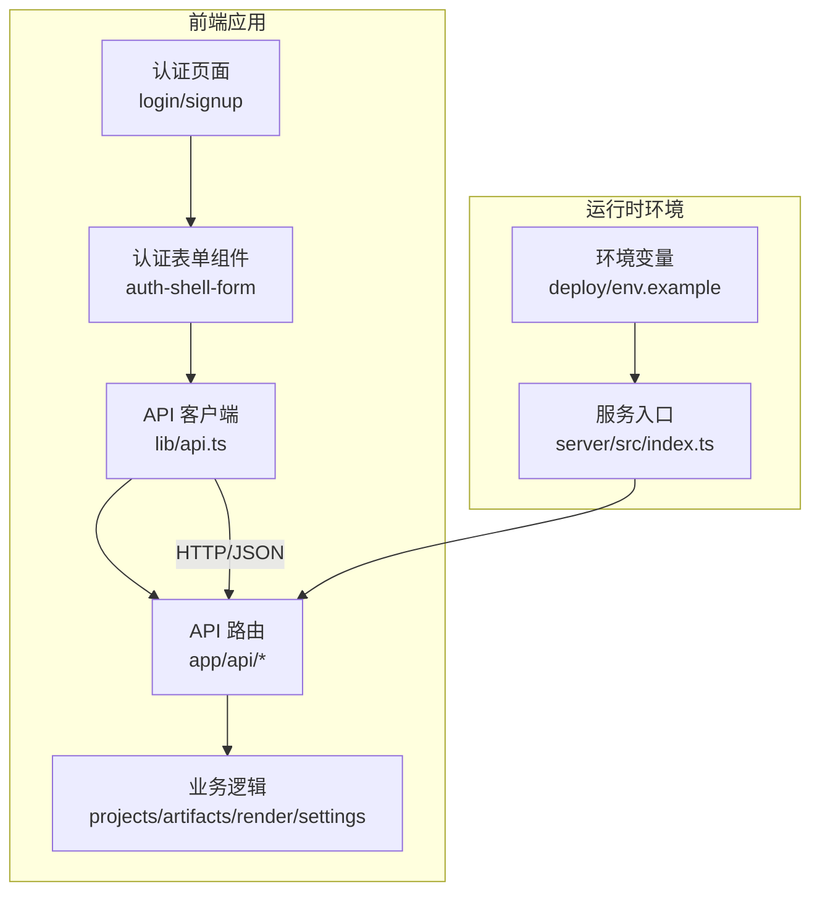
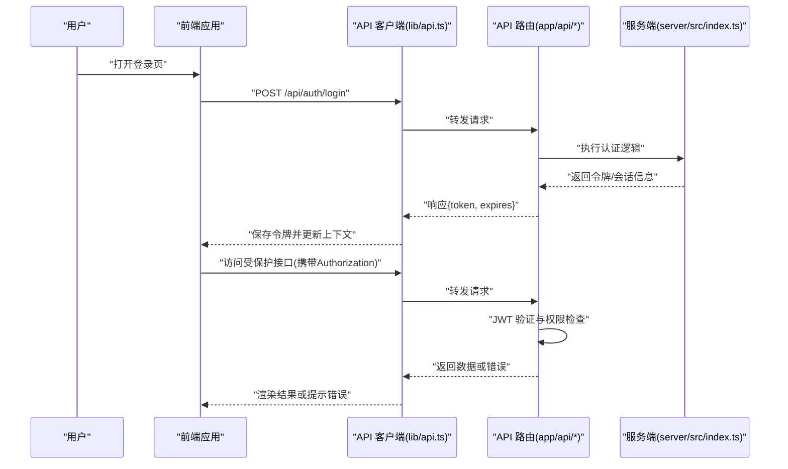
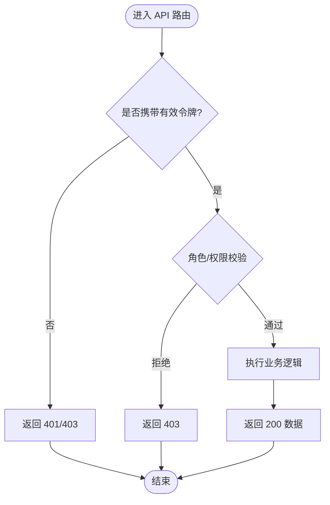
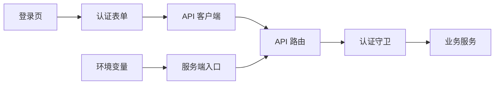

# 认证授权中间件

<cite>
**本文引用的文件**   
- [src/app/(auth)/layout.tsx](file://src/app/(auth)/layout.tsx)
- [src/app/(auth)/login/page.tsx](file://src/app/(auth)/login/page.tsx)
- [src/app/(auth)/signup/page.tsx](file://src/app/(auth)/signup/page.tsx)
- [src/app/(auth)/_components/auth-shell-form.tsx](file://src/app/(auth)/_components/auth-shell-form.tsx)
- [src/app/api/ping/route.ts](file://src/app/api/ping/route.ts)
- [src/app/api/projects/route.ts](file://src/app/api/projects/route.ts)
- [src/app/api/artifacts/[id]/route.ts](file://src/app/api/artifacts/[id]/route.ts)
- [src/app/api/render/route.ts](file://src/app/api/render/route.ts)
- [src/app/api/settings/route.ts](file://src/app/api/settings/route.ts)
- [src/lib/api.ts](file://src/lib/api.ts)
- [src/app/providers.tsx](file://src/app/providers.tsx)
- [deploy/env.example](file://deploy/env.example)
- [server/src/index.ts](file://server/src/index.ts)
</cite>

## 目录
1. [简介](#简介)
2. [项目结构](#项目结构)
3. [核心组件](#核心组件)
4. [架构总览](#架构总览)
5. [详细组件分析](#详细组件分析)
6. [依赖关系分析](#依赖关系分析)
7. [性能考虑](#性能考虑)
8. [故障排查指南](#故障排查指南)
9. [结论](#结论)
10. [附录](#附录)

## 简介
本文件为 PurpleInk 平台的认证与授权中间件提供系统化文档，重点覆盖：
- 基于 JWT 的会话管理（令牌生成、验证、刷新）
- API 级别的认证守卫（登录状态检查、权限验证、角色控制）
- 用户会话管理与安全存储策略
- 跨域请求处理（CORS）与安全头配置
- 统一错误处理与重试机制
- 密码重置、验证码验证流程与安全最佳实践
- 受保护端点的中间件使用示例

说明：当前仓库未包含显式的后端鉴权中间件实现。以下文档以现有前端路由、API 路由与通用工具为依据，给出可落地的设计与集成建议，确保在不破坏现有结构的前提下扩展认证能力。

## 项目结构
认证相关代码主要分布在以下位置：
- 认证页面与表单：(auth) 路由组下的登录、注册页及共享表单组件
- API 路由：app/api 下各业务端点，用于承载认证与受保护操作
- 通用 API 客户端：lib/api.ts，封装请求拦截、错误处理与重试
- 应用提供者：providers.tsx，集中注入全局上下文（如认证状态）
- 部署与环境变量：deploy/env.example，定义密钥与开关等敏感配置
- 服务端入口：server/src/index.ts，作为 Node/Next 服务启动点

图表来源
- [src/app/(auth)/login/page.tsx](file://src/app/(auth)/login/page.tsx)
- [src/app/(auth)/signup/page.tsx](file://src/app/(auth)/signup/page.tsx)
- [src/app/(auth)/_components/auth-shell-form.tsx](file://src/app/(auth)/_components/auth-shell-form.tsx)
- [src/lib/api.ts](file://src/lib/api.ts)
- [src/app/api/projects/route.ts](file://src/app/api/projects/route.ts)
- [src/app/api/artifacts/[id]/route.ts](file://src/app/api/artifacts/[id]/route.ts)
- [src/app/api/render/route.ts](file://src/app/api/render/route.ts)
- [src/app/api/settings/route.ts](file://src/app/api/settings/route.ts)
- [deploy/env.example](file://deploy/env.example)
- [server/src/index.ts](file://server/src/index.ts)

章节来源
- [src/app/(auth)/layout.tsx](file://src/app/(auth)/layout.tsx)
- [src/app/(auth)/login/page.tsx](file://src/app/(auth)/login/page.tsx)
- [src/app/(auth)/signup/page.tsx](file://src/app/(auth)/signup/page.tsx)
- [src/app/(auth)/_components/auth-shell-form.tsx](file://src/app/(auth)/_components/auth-shell-form.tsx)
- [src/lib/api.ts](file://src/lib/api.ts)
- [src/app/providers.tsx](file://src/app/providers.tsx)
- [deploy/env.example](file://deploy/env.example)
- [server/src/index.ts](file://server/src/index.ts)

## 核心组件
- 认证页面与表单
  - 登录/注册页面负责收集凭据并调用认证接口
  - 共享表单组件统一校验、提交与反馈
- API 客户端
  - 统一封装请求头、错误码处理、重试与令牌刷新
- API 路由
  - 暴露认证与受保护的业务接口
- 应用提供者
  - 提供认证上下文（如登录态、角色），驱动 UI 行为

章节来源
- [src/app/(auth)/_components/auth-shell-form.tsx](file://src/app/(auth)/_components/auth-shell-form.tsx)
- [src/lib/api.ts](file://src/lib/api.ts)
- [src/app/providers.tsx](file://src/app/providers.tsx)

## 架构总览
下图展示从浏览器到 API 路由的认证与授权流程，包括令牌传递、守卫校验与错误处理。

图表来源
- [src/app/(auth)/login/page.tsx](file://src/app/(auth)/login/page.tsx)
- [src/app/(auth)/_components/auth-shell-form.tsx](file://src/app/(auth)/_components/auth-shell-form.tsx)
- [src/lib/api.ts](file://src/lib/api.ts)
- [src/app/api/projects/route.ts](file://src/app/api/projects/route.ts)
- [src/app/api/artifacts/[id]/route.ts](file://src/app/api/artifacts/[id]/route.ts)
- [src/app/api/render/route.ts](file://src/app/api/render/route.ts)
- [src/app/api/settings/route.ts](file://src/app/api/settings/route.ts)
- [server/src/index.ts](file://server/src/index.ts)

## 详细组件分析

### 认证页面与表单
- 登录/注册页面
  - 职责：收集用户名/邮箱、密码，触发认证流程；处理成功跳转与失败提示
  - 交互：调用 API 客户端发送认证请求，接收令牌后更新全局上下文
- 共享表单组件
  - 职责：统一输入校验、提交状态管理、错误展示与重试按钮
  - 扩展点：支持验证码字段、密码重置流程接入

章节来源
- [src/app/(auth)/login/page.tsx](file://src/app/(auth)/login/page.tsx)
- [src/app/(auth)/signup/page.tsx](file://src/app/(auth)/signup/page.tsx)
- [src/app/(auth)/_components/auth-shell-form.tsx](file://src/app/(auth)/_components/auth-shell-form.tsx)

### API 客户端与请求拦截
- 请求拦截
  - 自动附加 Authorization 头（Bearer Token）
  - 根据响应状态码决定重试或刷新令牌
- 错误处理
  - 统一包装错误对象，区分网络错误、业务错误与认证错误
  - 对 401/403 进行特定处理（如刷新令牌、登出）
- 重试机制
  - 指数退避与最大重试次数限制
  - 针对幂等请求启用自动重试

章节来源
- [src/lib/api.ts](file://src/lib/api.ts)

### API 路由与认证守卫
- 公开接口
  - 例如 ping 接口，无需认证即可访问
- 受保护接口
  - 需要有效 JWT 才能访问，并在路由内校验角色/权限
  - 常见端点：项目、制品、渲染、设置等

图表来源
- [src/app/api/ping/route.ts](file://src/app/api/ping/route.ts)
- [src/app/api/projects/route.ts](file://src/app/api/projects/route.ts)
- [src/app/api/artifacts/[id]/route.ts](file://src/app/api/artifacts/[id]/route.ts)
- [src/app/api/render/route.ts](file://src/app/api/render/route.ts)
- [src/app/api/settings/route.ts](file://src/app/api/settings/route.ts)

章节来源
- [src/app/api/ping/route.ts](file://src/app/api/ping/route.ts)
- [src/app/api/projects/route.ts](file://src/app/api/projects/route.ts)
- [src/app/api/artifacts/[id]/route.ts](file://src/app/api/artifacts/[id]/route.ts)
- [src/app/api/render/route.ts](file://src/app/api/render/route.ts)
- [src/app/api/settings/route.ts](file://src/app/api/settings/route.ts)

### 应用提供者与全局上下文
- 作用：集中管理认证状态（登录态、用户信息、角色）
- 行为：在令牌变化时更新上下文，驱动 UI 重渲染与路由守卫

章节来源
- [src/app/providers.tsx](file://src/app/providers.tsx)

### 环境变量与安全配置
- 关键项：JWT 密钥、过期时间、CORS 白名单、验证码服务密钥等
- 建议：生产环境使用专用密钥，避免硬编码；开启 HTTPS 与严格传输安全

章节来源
- [deploy/env.example](file://deploy/env.example)

### 服务端入口与服务初始化
- 职责：加载环境变量、初始化中间件（如 CORS、日志）、挂载 API 路由
- 扩展点：在此处注册认证中间件、速率限制与健康检查

章节来源
- [server/src/index.ts](file://server/src/index.ts)

## 依赖关系分析
- 前端依赖
  - 认证页面依赖表单组件与 API 客户端
  - API 客户端依赖全局错误处理与重试策略
- 后端依赖
  - API 路由依赖认证守卫与权限校验
  - 服务端入口依赖环境变量与中间件配置

图表来源
- [src/app/(auth)/login/page.tsx](file://src/app/(auth)/login/page.tsx)
- [src/app/(auth)/_components/auth-shell-form.tsx](file://src/app/(auth)/_components/auth-shell-form.tsx)
- [src/lib/api.ts](file://src/lib/api.ts)
- [src/app/api/projects/route.ts](file://src/app/api/projects/route.ts)
- [deploy/env.example](file://deploy/env.example)
- [server/src/index.ts](file://server/src/index.ts)

章节来源
- [src/lib/api.ts](file://src/lib/api.ts)
- [src/app/providers.tsx](file://src/app/providers.tsx)
- [deploy/env.example](file://deploy/env.example)
- [server/src/index.ts](file://server/src/index.ts)

## 性能考虑
- 令牌缓存与刷新
  - 将令牌保存在内存或安全存储中，减少重复获取开销
  - 在令牌即将过期前主动刷新，避免频繁 401
- 请求合并与去抖
  - 对高频认证相关请求进行合并，降低服务器压力
- 错误快速失败
  - 对非幂等请求禁用自动重试，避免副作用放大
- 缓存策略
  - 对只读接口启用合理缓存，减轻认证校验频率

[本节为通用指导，不直接分析具体文件]

## 故障排查指南
- 常见问题
  - 401 未认证：检查 Authorization 头是否正确携带，令牌是否过期
  - 403 无权限：确认用户角色与资源权限匹配
  - 网络错误：检查 CORS 配置与域名白名单
- 调试步骤
  - 查看 API 客户端的错误日志与重试记录
  - 在服务端入口启用详细日志，定位认证守卫失败原因
  - 核对环境变量中的密钥与过期时间配置

章节来源
- [src/lib/api.ts](file://src/lib/api.ts)
- [server/src/index.ts](file://server/src/index.ts)

## 结论
通过在前端统一封装 API 客户端、在后端 API 路由中实施认证守卫，并结合环境变量与提供者管理全局上下文，PurpleInk 平台可实现稳定、可扩展的认证与授权体系。建议在后续迭代中引入统一的中间件层，进一步抽象令牌生命周期与权限校验逻辑，提升可维护性与安全性。

[本节为总结性内容，不直接分析具体文件]

## 附录

### JWT 会话管理设计要点
- 令牌生成
  - 服务端签发包含用户标识、角色与过期时间的 JWT
  - 推荐短期访问令牌 + 长期刷新令牌组合
- 令牌验证
  - 每次请求验证签名与有效期，必要时查询黑名单或撤销列表
- 令牌刷新
  - 客户端在 401 时尝试刷新令牌，失败则引导重新登录

[本节为概念性说明，不直接分析具体文件]

### API 级别认证守卫示例
- 登录状态检查
  - 在路由入口处解析 Authorization 头，验证令牌有效性
- 权限验证
  - 根据用户角色判断是否允许访问目标资源
- 角色控制
  - 对不同角色返回不同数据或功能入口

章节来源
- [src/app/api/projects/route.ts](file://src/app/api/projects/route.ts)
- [src/app/api/artifacts/[id]/route.ts](file://src/app/api/artifacts/[id]/route.ts)
- [src/app/api/render/route.ts](file://src/app/api/render/route.ts)
- [src/app/api/settings/route.ts](file://src/app/api/settings/route.ts)

### 用户会话管理与安全存储
- 存储位置
  - 优先使用 httpOnly Cookie 或内存存储，避免 XSS 风险
- 同步与一致性
  - 多标签页场景下保持令牌一致，避免并发冲突
- 清理策略
  - 退出登录时清除本地令牌与会话数据

章节来源
- [src/lib/api.ts](file://src/lib/api.ts)
- [src/app/providers.tsx](file://src/app/providers.tsx)

### 跨域请求处理（CORS）
- 配置原则
  - 仅允许可信域名，限制方法与头部
- 预检请求
  - 正确处理 OPTIONS 请求，避免阻塞正常请求
- 安全头
  - 启用 Strict-Transport-Security、X-Content-Type-Options 等

章节来源
- [deploy/env.example](file://deploy/env.example)
- [server/src/index.ts](file://server/src/index.ts)

### 统一错误处理与重试机制
- 错误分类
  - 网络错误、业务错误、认证错误分别处理
- 重试策略
  - 对幂等请求启用指数退避，限制最大重试次数
- 用户反馈
  - 明确提示错误原因与下一步操作

章节来源
- [src/lib/api.ts](file://src/lib/api.ts)

### 密码重置与验证码验证
- 密码重置
  - 发送一次性链接或验证码，限制有效期与使用次数
- 验证码验证
  - 服务端校验验证码有效性，防止暴力破解
- 安全最佳实践
  - 最小化敏感信息输出，记录审计日志

章节来源
- [src/app/(auth)/_components/auth-shell-form.tsx](file://src/app/(auth)/_components/auth-shell-form.tsx)

### 受保护 API 端点使用示例
- 登录成功后，客户端在后续请求中携带 Authorization 头
- 受保护端点在路由内验证令牌与权限，返回数据或错误
- 若令牌失效，客户端自动刷新或引导重新登录

章节来源
- [src/app/api/projects/route.ts](file://src/app/api/projects/route.ts)
- [src/app/api/artifacts/[id]/route.ts](file://src/app/api/artifacts/[id]/route.ts)
- [src/app/api/render/route.ts](file://src/app/api/render/route.ts)
- [src/app/api/settings/route.ts](file://src/app/api/settings/route.ts)