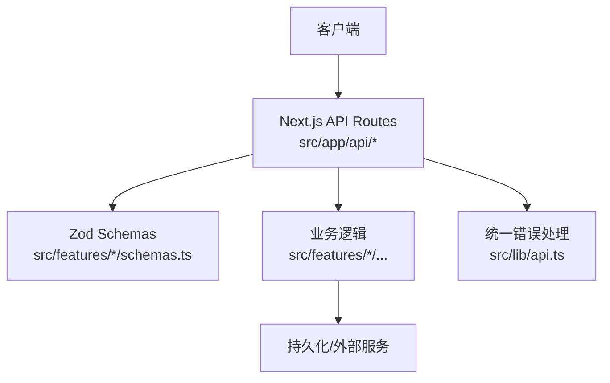
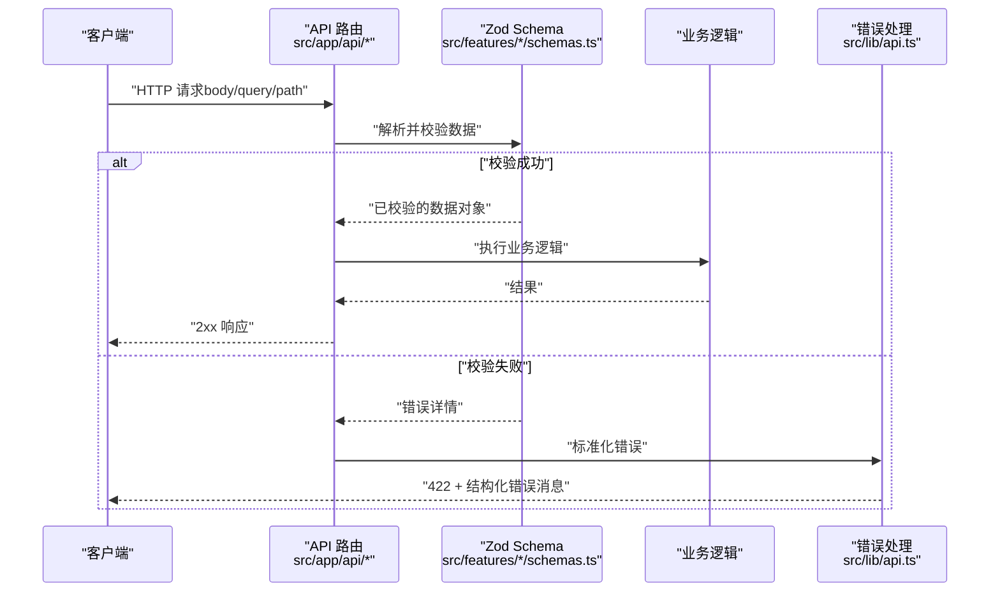
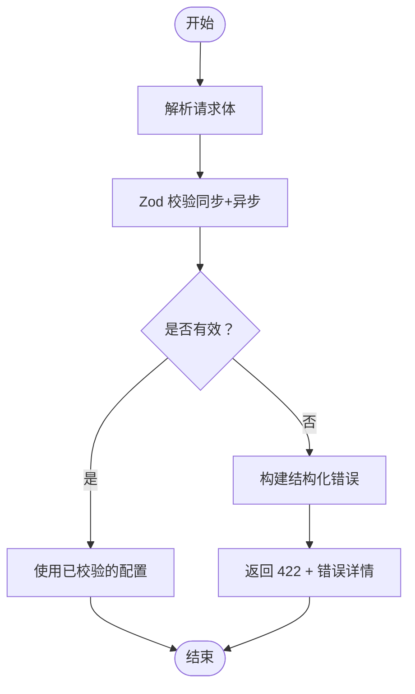
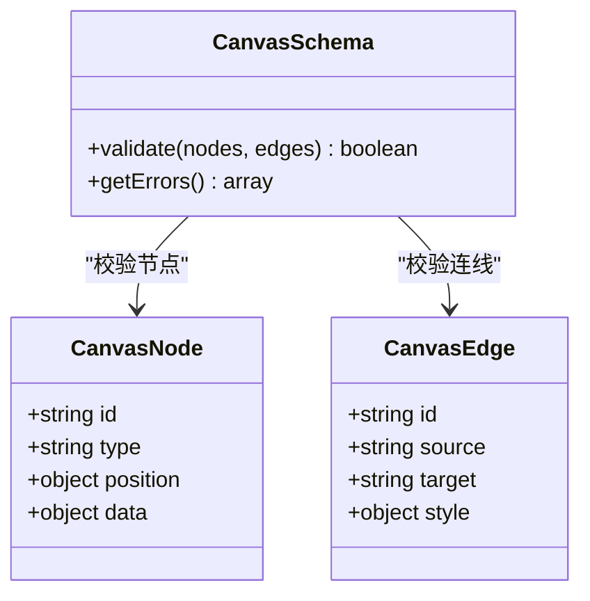
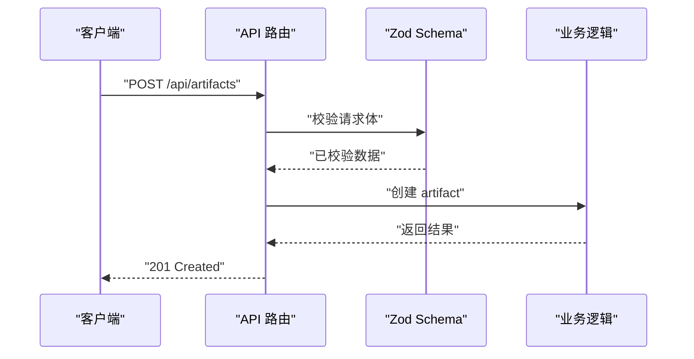
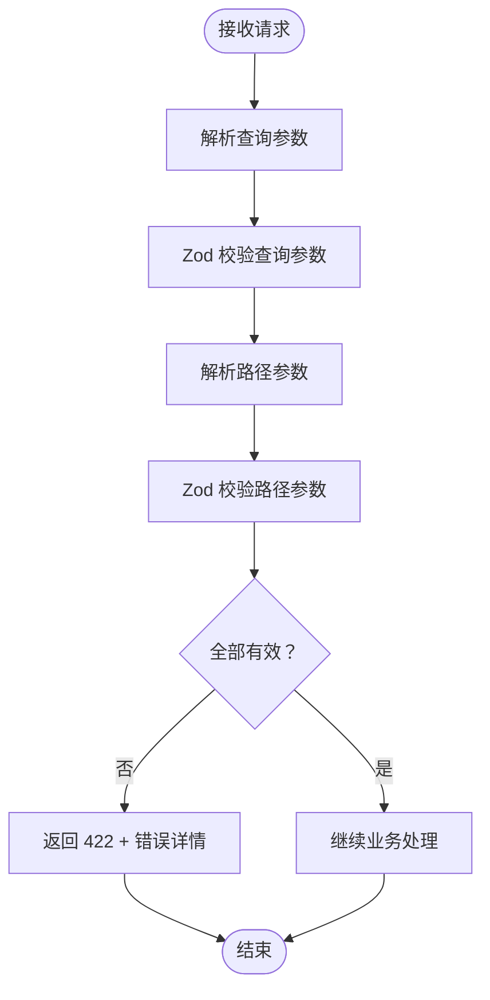
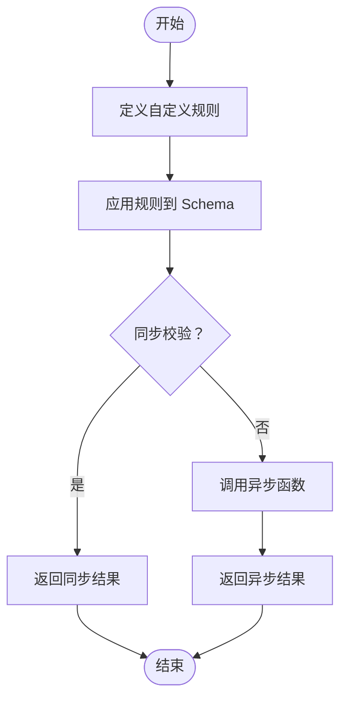
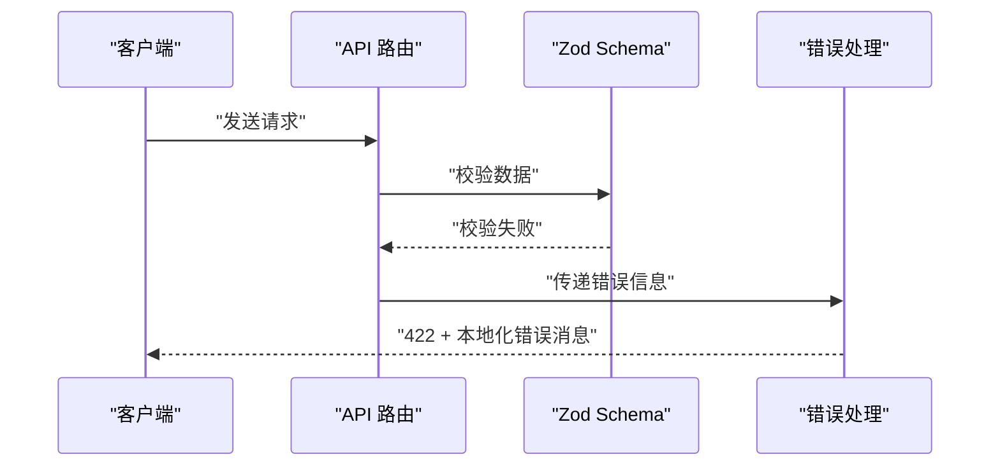
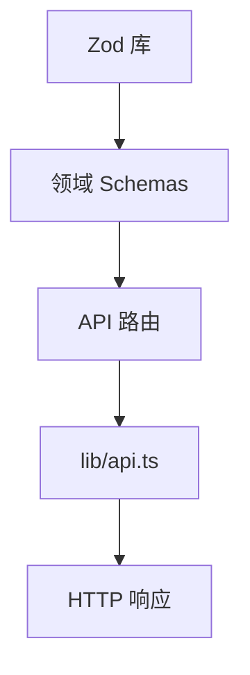

# 请求验证与数据校验

<cite>
**本文引用的文件**   
- [src/app/api/artifacts/[id]/route.ts](file://src/app/api/artifacts/[id]/route.ts)
- [src/app/api/director/pipeline/route.ts](file://src/app/api/director/pipeline/route.ts)
- [src/app/api/director/stage/route.ts](file://src/app/api/director/stage/route.ts)
- [src/app/api/director/stream/[nodeId]/route.ts](file://src/app/api/director/stream/[nodeId]/route.ts)
- [src/app/api/director/stream/project/[projectId]/route.ts](file://src/app/api/director/stream/project/[projectId]/route.ts)
- [src/app/api/jobs/[id]/route.ts](file://src/app/api/jobs/[id]/route.ts)
- [src/app/api/projects/[id]/route.ts](file://src/app/api/projects/[id]/route.ts)
- [src/app/api/render/export/route.ts](file://src/app/api/render/export/route.ts)
- [src/app/api/settings/route.ts](file://src/app/api/settings/route.ts)
- [src/features/ai/schemas.ts](file://src/features/ai/schemas.ts)
- [src/features/canvas/schemas.ts](file://src/features/canvas/schemas.ts)
- [src/lib/api.ts](file://src/lib/api.ts)
</cite>

## 目录
1. [简介](#简介)
2. [项目结构](#项目结构)
3. [核心组件](#核心组件)
4. [架构总览](#架构总览)
5. [详细组件分析](#详细组件分析)
6. [依赖分析](#依赖分析)
7. [性能考虑](#性能考虑)
8. [故障排查指南](#故障排查指南)
9. [结论](#结论)
10. [附录](#附录)

## 简介
本文件面向 PurpleInK 平台的请求验证与数据校验，系统性阐述基于 Zod 的类型安全验证方案。内容覆盖：
- 请求体验证、查询参数校验与路径参数验证
- 自定义验证规则、异步验证与条件验证的实现方式
- 错误消息国际化、验证性能优化与缓存策略
- 典型场景的验证器示例（AI 配置、用户输入、画布数据）
- 统一失败处理流程与用户友好的错误提示

## 项目结构
PurpleInK 采用 Next.js App Router 的 API Routes 组织接口，结合 features 层的领域模型与 schemas 定义进行类型安全的校验。整体分层如下：
- 路由层：各 API route.ts 负责解析请求体、路径参数与查询参数，并调用业务逻辑
- 领域层：features 下的 schemas.ts 集中定义 Zod 校验模式，保证数据结构与约束
- 工具层：lib/api.ts 提供统一的请求封装与错误处理

**图表来源** 
- [src/app/api/artifacts/[id]/route.ts](file://src/app/api/artifacts/[id]/route.ts)
- [src/features/ai/schemas.ts](file://src/features/ai/schemas.ts)
- [src/lib/api.ts](file://src/lib/api.ts)

**章节来源**
- [src/app/api/artifacts/[id]/route.ts](file://src/app/api/artifacts/[id]/route.ts)
- [src/app/api/director/pipeline/route.ts](file://src/app/api/director/pipeline/route.ts)
- [src/app/api/director/stage/route.ts](file://src/app/api/director/stage/route.ts)
- [src/app/api/director/stream/[nodeId]/route.ts](file://src/app/api/director/stream/[nodeId]/route.ts)
- [src/app/api/director/stream/project/[projectId]/route.ts](file://src/app/api/director/stream/project/[projectId]/route.ts)
- [src/app/api/jobs/[id]/route.ts](file://src/app/api/jobs/[id]/route.ts)
- [src/app/api/projects/[id]/route.ts](file://src/app/api/projects/[id]/route.ts)
- [src/app/api/render/export/route.ts](file://src/app/api/render/export/route.ts)
- [src/app/api/settings/route.ts](file://src/app/api/settings/route.ts)
- [src/features/ai/schemas.ts](file://src/features/ai/schemas.ts)
- [src/features/canvas/schemas.ts](file://src/features/canvas/schemas.ts)
- [src/lib/api.ts](file://src/lib/api.ts)

## 核心组件
- 请求体验证：在 API Route 中通过 Zod schema 对 body 进行同步或异步校验，确保字段类型、范围、格式与业务约束
- 查询参数校验：使用 URLSearchParams 解析后交由 Zod 校验，支持分页、过滤、排序等常见场景
- 路径参数验证：对动态段（如 id、projectId、nodeId）进行类型转换与格式校验，避免非法 ID 进入业务层
- 自定义规则：通过 .refine/.superRefine 实现跨字段校验、唯一性检查、复杂业务规则
- 异步验证：在 .refine 中使用 async 函数，支持远程校验（如用户名可用性、资源配额检查）
- 条件验证：根据某个字段值切换其他字段的必填/可选或不同校验规则
- 错误消息国际化：为每个错误码/路径提供可替换的消息模板，按语言返回
- 统一错误处理：将校验失败转换为标准 HTTP 响应（如 422），包含结构化错误信息

**章节来源**
- [src/app/api/artifacts/[id]/route.ts](file://src/app/api/artifacts/[id]/route.ts)
- [src/app/api/director/pipeline/route.ts](file://src/app/api/director/pipeline/route.ts)
- [src/app/api/director/stage/route.ts](file://src/app/api/director/stage/route.ts)
- [src/app/api/director/stream/[nodeId]/route.ts](file://src/app/api/director/stream/[nodeId]/route.ts)
- [src/app/api/director/stream/project/[projectId]/route.ts](file://src/app/api/director/stream/project/[projectId]/route.ts)
- [src/app/api/jobs/[id]/route.ts](file://src/app/api/jobs/[id]/route.ts)
- [src/app/api/projects/[id]/route.ts](file://src/app/api/projects/[id]/route.ts)
- [src/app/api/render/export/route.ts](file://src/app/api/render/export/route.ts)
- [src/app/api/settings/route.ts](file://src/app/api/settings/route.ts)
- [src/features/ai/schemas.ts](file://src/features/ai/schemas.ts)
- [src/features/canvas/schemas.ts](file://src/features/canvas/schemas.ts)
- [src/lib/api.ts](file://src/lib/api.ts)

## 架构总览
下图展示了从客户端到业务层的请求验证流程，以及错误处理的统一出口。

**图表来源** 
- [src/app/api/artifacts/[id]/route.ts](file://src/app/api/artifacts/[id]/route.ts)
- [src/features/ai/schemas.ts](file://src/features/ai/schemas.ts)
- [src/lib/api.ts](file://src/lib/api.ts)

## 详细组件分析

### AI 配置验证（features/ai/schemas.ts）
- 目标：确保 AI 提供商配置（如密钥、端点、模型名、并发限制）合法且符合业务约束
- 关键点：
  - 必填字段与默认值：为关键配置项设置默认值与必填校验
  - 格式校验：URL、邮箱、枚举值（如 provider、model）
  - 条件校验：当启用特定 provider 时，要求额外字段（如 region、apiVersion）
  - 异步校验：检查密钥有效性或配额上限（可通过 .refine 异步实现）
  - 错误消息：为每个字段提供多语言错误模板

**图表来源** 
- [src/features/ai/schemas.ts](file://src/features/ai/schemas.ts)

**章节来源**
- [src/features/ai/schemas.ts](file://src/features/ai/schemas.ts)

### 画布数据验证（features/canvas/schemas.ts）
- 目标：确保画布节点、连线、布局等数据的完整性与一致性
- 关键点：
  - 节点类型校验：节点必须包含 id、type、position 等字段
  - 连线关系校验：source/target 必须指向存在的节点
  - 布局约束：坐标范围、层级顺序、重叠检测
  - 条件校验：不同类型节点需要不同的附加字段
  - 批量更新：数组元素逐项校验，支持增量更新

**图表来源** 
- [src/features/canvas/schemas.ts](file://src/features/canvas/schemas.ts)

**章节来源**
- [src/features/canvas/schemas.ts](file://src/features/canvas/schemas.ts)

### API 路由中的请求体验证
- artifacts 路由：验证 artifact 的创建/更新请求体，包括标题、描述、元数据等
- director pipeline/stage 路由：验证导演工作流中的管道与阶段配置，确保步骤顺序与依赖关系正确
- jobs 路由：验证任务提交参数，如优先级、重试次数、超时时间
- render export 路由：验证导出任务的分辨率、格式、质量等参数
- settings 路由：验证系统设置项，如主题、语言、通知偏好

**图表来源** 
- [src/app/api/artifacts/[id]/route.ts](file://src/app/api/artifacts/[id]/route.ts)
- [src/app/api/director/pipeline/route.ts](file://src/app/api/director/pipeline/route.ts)
- [src/app/api/director/stage/route.ts](file://src/app/api/director/stage/route.ts)
- [src/app/api/jobs/[id]/route.ts](file://src/app/api/jobs/[id]/route.ts)
- [src/app/api/render/export/route.ts](file://src/app/api/render/export/route.ts)
- [src/app/api/settings/route.ts](file://src/app/api/settings/route.ts)

**章节来源**
- [src/app/api/artifacts/[id]/route.ts](file://src/app/api/artifacts/[id]/route.ts)
- [src/app/api/director/pipeline/route.ts](file://src/app/api/director/pipeline/route.ts)
- [src/app/api/director/stage/route.ts](file://src/app/api/director/stage/route.ts)
- [src/app/api/jobs/[id]/route.ts](file://src/app/api/jobs/[id]/route.ts)
- [src/app/api/render/export/route.ts](file://src/app/api/render/export/route.ts)
- [src/app/api/settings/route.ts](file://src/app/api/settings/route.ts)

### 查询参数与路径参数验证
- 查询参数：分页（page、limit）、过滤（status、category）、排序（sort、order）
- 路径参数：UUID 格式校验、存在性检查、权限关联
- 示例：
  - /api/projects/:id：验证 projectId 是否为有效 UUID
  - /api/director/stream/:nodeId：验证 nodeId 是否存在于当前会话

**图表来源** 
- [src/app/api/director/stream/[nodeId]/route.ts](file://src/app/api/director/stream/[nodeId]/route.ts)
- [src/app/api/director/stream/project/[projectId]/route.ts](file://src/app/api/director/stream/project/[projectId]/route.ts)
- [src/app/api/projects/[id]/route.ts](file://src/app/api/projects/[id]/route.ts)

**章节来源**
- [src/app/api/director/stream/[nodeId]/route.ts](file://src/app/api/director/stream/[nodeId]/route.ts)
- [src/app/api/director/stream/project/[projectId]/route.ts](file://src/app/api/director/stream/project/[projectId]/route.ts)
- [src/app/api/projects/[id]/route.ts](file://src/app/api/projects/[id]/route.ts)

### 自定义验证规则与异步验证
- 自定义规则：使用 .refine 实现跨字段校验（如密码强度、日期范围）
- 异步验证：在 .refine 中调用异步函数（如数据库查询、外部 API）
- 条件验证：根据字段值动态调整校验规则（如不同支付方式的必填字段）

**图表来源** 
- [src/features/ai/schemas.ts](file://src/features/ai/schemas.ts)
- [src/features/canvas/schemas.ts](file://src/features/canvas/schemas.ts)

**章节来源**
- [src/features/ai/schemas.ts](file://src/features/ai/schemas.ts)
- [src/features/canvas/schemas.ts](file://src/features/canvas/schemas.ts)

### 错误消息国际化与统一处理
- 错误消息模板：为每个校验错误定义多语言模板
- 统一处理：在 lib/api.ts 中集中处理校验错误，返回标准格式
- 用户友好：将技术错误转化为用户可读的提示

**图表来源** 
- [src/lib/api.ts](file://src/lib/api.ts)

**章节来源**
- [src/lib/api.ts](file://src/lib/api.ts)

## 依赖分析
PurpleInK 的验证体系依赖以下核心模块：
- Zod：用于数据校验与类型推断
- Next.js API Routes：作为请求入口
- features/schemas：领域特定的校验规则
- lib/api：统一错误处理与响应格式化

**图表来源** 
- [src/features/ai/schemas.ts](file://src/features/ai/schemas.ts)
- [src/features/canvas/schemas.ts](file://src/features/canvas/schemas.ts)
- [src/lib/api.ts](file://src/lib/api.ts)

**章节来源**
- [src/features/ai/schemas.ts](file://src/features/ai/schemas.ts)
- [src/features/canvas/schemas.ts](file://src/features/canvas/schemas.ts)
- [src/lib/api.ts](file://src/lib/api.ts)

## 性能考虑
- 校验缓存：对重复的请求体验证结果进行短期缓存，减少重复计算
- 延迟校验：对非关键路径的异步校验采用懒加载
- 批量校验：对数组数据进行并行校验，提升吞吐量
- 内存管理：及时释放大型对象的引用，避免内存泄漏
- 监控指标：记录校验失败率、平均耗时等关键指标

[本节为通用性能建议，不直接分析具体文件]

## 故障排查指南
- 常见问题：
  - 校验失败：检查 Zod schema 定义是否正确
  - 异步校验超时：优化异步函数或增加超时配置
  - 错误消息不明确：完善错误模板，提供更具体的提示信息
- 调试技巧：
  - 启用详细日志：记录校验过程中的中间状态
  - 单元测试：为关键校验规则编写测试用例
  - 模拟数据：使用固定输入验证边界情况

**章节来源**
- [src/lib/api.ts](file://src/lib/api.ts)

## 结论
PurpleInK 平台通过基于 Zod 的类型安全验证方案，实现了全面的请求验证与数据校验。该方案覆盖了请求体、查询参数、路径参数的校验，支持自定义规则、异步验证与条件验证，并提供统一的错误处理与国际化支持。通过合理的性能优化与缓存策略，确保了系统的稳定性和可扩展性。

[本节为总结性内容，不直接分析具体文件]

## 附录
- 最佳实践：
  - 始终在前端和后端都进行数据校验
  - 使用 TypeScript 与 Zod 联合，获得完整的类型安全
  - 为所有 API 端点编写校验测试
  - 定期审查和更新校验规则
- 参考资源：
  - Zod 官方文档
  - Next.js API Routes 最佳实践
  - 错误处理设计模式

[本节为补充信息，不直接分析具体文件]