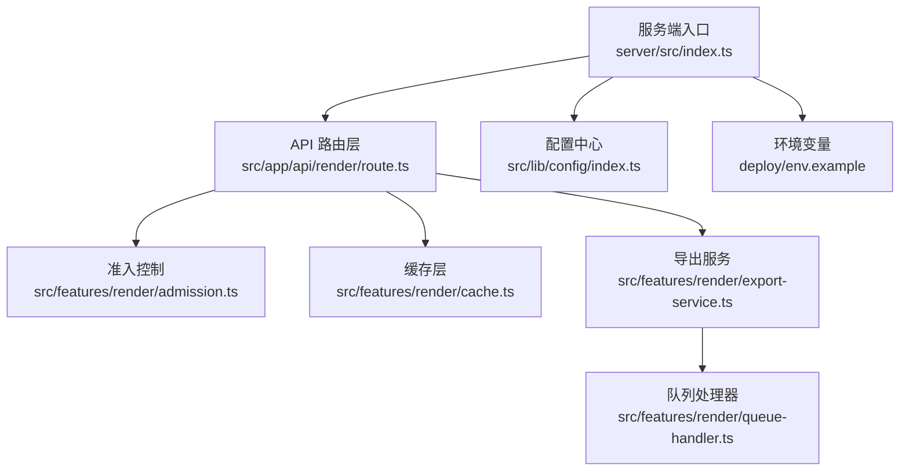
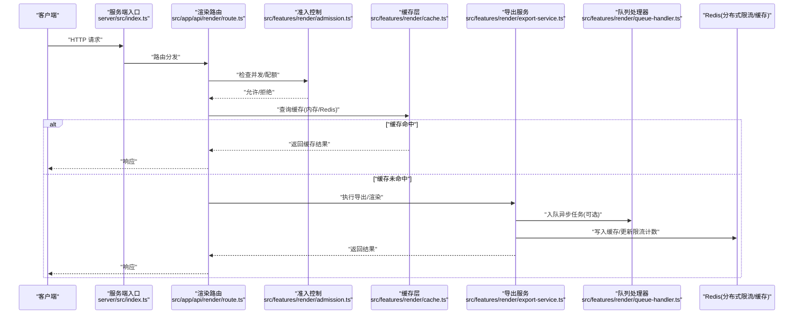
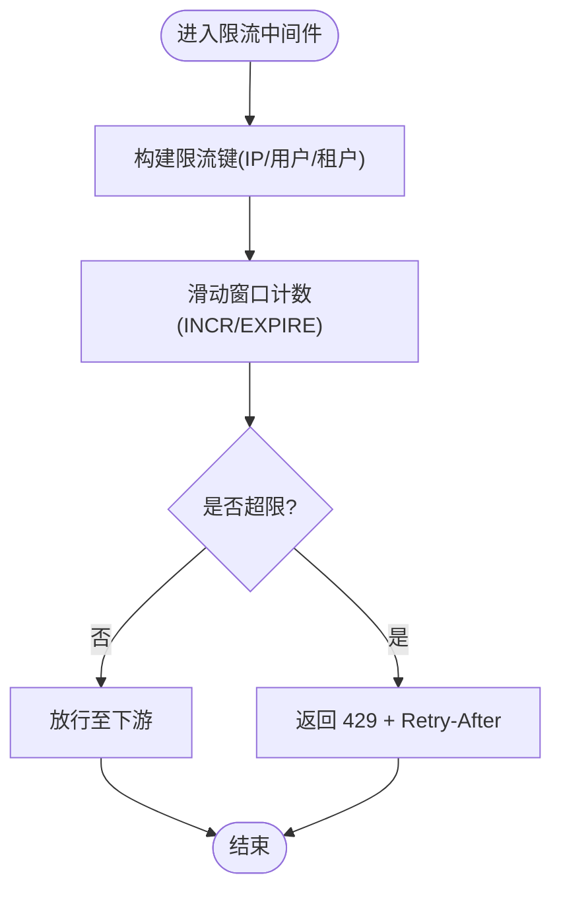
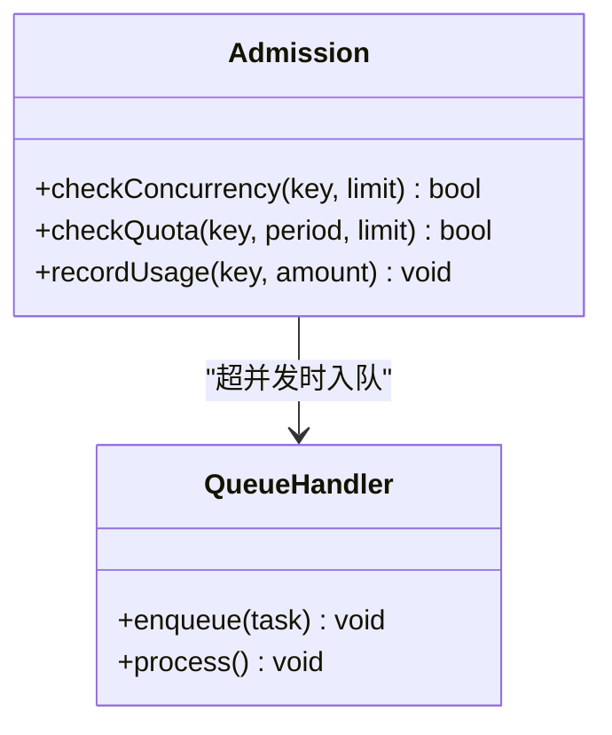
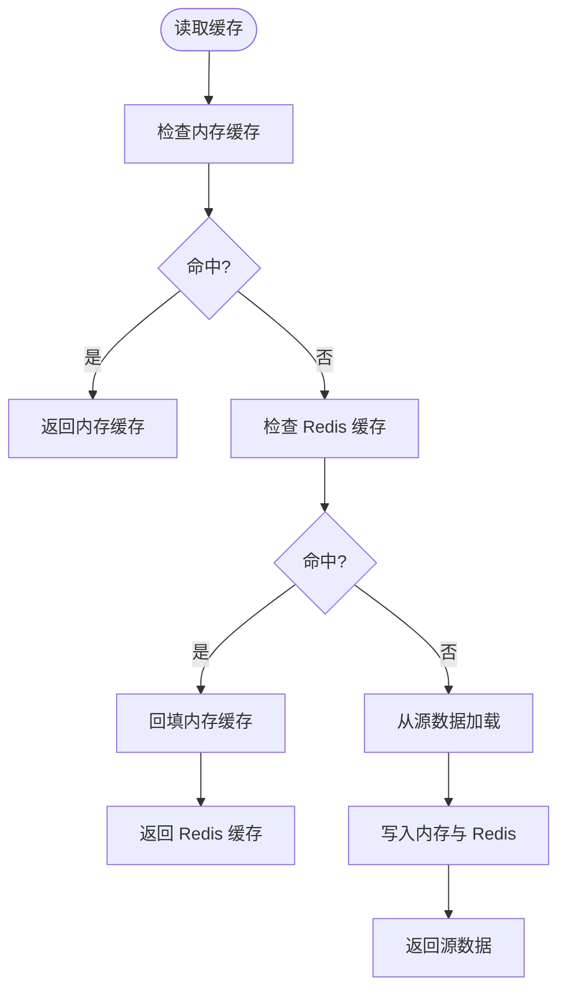
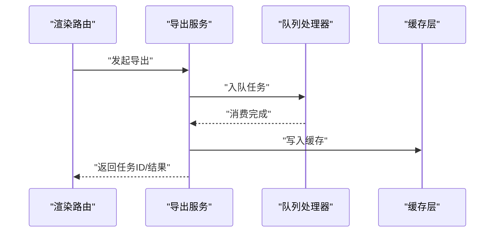
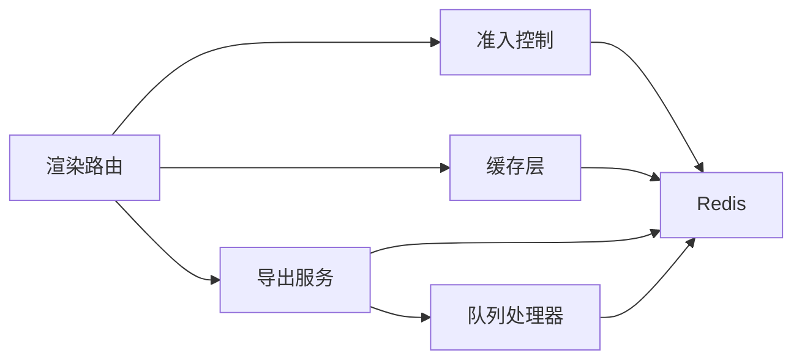

# 速率限制与缓存策略

<cite>
**本文引用的文件**   
- [server/src/index.ts](file://server/src/index.ts)
- [src/app/api/render/route.ts](file://src/app/api/render/route.ts)
- [src/features/render/cache.ts](file://src/features/render/cache.ts)
- [src/features/render/admission.ts](file://src/features/render/admission.ts)
- [src/features/render/export-service.ts](file://src/features/render/export-service.ts)
- [src/features/render/queue-handler.ts](file://src/features/render/queue-handler.ts)
- [src/lib/config/index.ts](file://src/lib/config/index.ts)
- [deploy/env.example](file://deploy/env.example)
</cite>

## 目录
1. [简介](#简介)
2. [项目结构](#项目结构)
3. [核心组件](#核心组件)
4. [架构总览](#架构总览)
5. [详细组件分析](#详细组件分析)
6. [依赖关系分析](#依赖关系分析)
7. [性能考量](#性能考量)
8. [故障排查指南](#故障排查指南)
9. [结论](#结论)
10. [附录](#附录)

## 简介
本文件面向 PurpleInK 平台的速率限制与缓存策略，聚焦以下目标：
- 基于 Redis 的分布式限流实现：请求频率控制、并发限制与配额管理。
- 多级缓存策略：内存缓存、Redis 缓存与浏览器缓存的使用场景与组合方式。
- 缓存失效策略、缓存预热与一致性保证机制。
- 不同 API 端点的限流配置示例与最佳实践。
- 缓存性能监控与调优建议。

说明：当前仓库未包含显式的“rate-limit”或“redis-client”模块代码，但存在渲染与导出相关的 admission（准入）、队列处理与缓存模块，以及部署与环境变量样例。下文将结合这些模块给出可落地的设计与集成方案，并标注对应源码位置以便后续落地实施。

## 项目结构
与速率限制和缓存相关的关键路径与职责如下：
- server/src/index.ts：服务端入口，负责初始化中间件、路由注册与服务启动，是接入限流中间件与缓存中间件的合适位置。
- src/app/api/render/route.ts：渲染相关 API 路由，作为限流与缓存策略的主要切面。
- src/features/render/cache.ts：渲染结果缓存的实现与接口定义。
- src/features/render/admission.ts：请求准入控制（可用于并发限制与配额校验）。
- src/features/render/export-service.ts：导出服务编排，适合在导出链路中引入缓存与限流。
- src/features/render/queue-handler.ts：任务队列处理器，用于削峰填谷与并发控制。
- src/lib/config/index.ts：统一配置读取与管理，便于集中化限流与缓存参数。
- deploy/env.example：环境变量样例，便于注入 Redis 连接信息与限流阈值等配置。

**图示来源**
- [server/src/index.ts](file://server/src/index.ts)
- [src/app/api/render/route.ts](file://src/app/api/render/route.ts)
- [src/features/render/cache.ts](file://src/features/render/cache.ts)
- [src/features/render/admission.ts](file://src/features/render/admission.ts)
- [src/features/render/export-service.ts](file://src/features/render/export-service.ts)
- [src/features/render/queue-handler.ts](file://src/features/render/queue-handler.ts)
- [src/lib/config/index.ts](file://src/lib/config/index.ts)
- [deploy/env.example](file://deploy/env.example)

**章节来源**
- [server/src/index.ts](file://server/src/index.ts)
- [src/app/api/render/route.ts](file://src/app/api/render/route.ts)
- [src/features/render/cache.ts](file://src/features/render/cache.ts)
- [src/features/render/admission.ts](file://src/features/render/admission.ts)
- [src/features/render/export-service.ts](file://src/features/render/export-service.ts)
- [src/features/render/queue-handler.ts](file://src/features/render/queue-handler.ts)
- [src/lib/config/index.ts](file://src/lib/config/index.ts)
- [deploy/env.example](file://deploy/env.example)

## 核心组件
- 分布式限流器（基于 Redis）
  - 使用滑动窗口或令牌桶算法，按 IP、用户 ID、API Key 或租户维度进行频率控制。
  - 通过原子操作（INCR/EXPIRE/LUA 脚本）保证多实例一致性。
- 并发限制器（准入控制）
  - 在 admission 层对并发数进行上限控制，避免后端过载。
  - 结合队列处理器进行削峰与优先级调度。
- 配额管理器
  - 按日/月统计调用次数，达到阈值后降级或拒绝。
  - 支持动态调整配额与灰度发布。
- 多级缓存
  - 内存缓存：短 TTL、进程内 LRU，适用于热点数据与计算密集型结果的快速命中。
  - Redis 缓存：跨进程共享，适合中等 TTL 的渲染产物、元数据与状态。
  - 浏览器缓存：HTTP 缓存头（ETag/Cache-Control），减少重复请求。
- 缓存失效与一致性
  - 写时失效（WTL）与惰性失效（TTL）结合。
  - 版本化键名与内容哈希，确保强一致或最终一致。
- 缓存预热
  - 启动阶段或低峰期预加载热点键，降低冷启动延迟。

**章节来源**
- [src/features/render/admission.ts](file://src/features/render/admission.ts)
- [src/features/render/cache.ts](file://src/features/render/cache.ts)
- [src/features/render/export-service.ts](file://src/features/render/export-service.ts)
- [src/features/render/queue-handler.ts](file://src/features/render/queue-handler.ts)
- [src/lib/config/index.ts](file://src/lib/config/index.ts)
- [deploy/env.example](file://deploy/env.example)

## 架构总览
下图展示从客户端到服务端、再到缓存与队列的整体流程，限流与缓存贯穿关键节点。

**图示来源**
- [server/src/index.ts](file://server/src/index.ts)
- [src/app/api/render/route.ts](file://src/app/api/render/route.ts)
- [src/features/render/admission.ts](file://src/features/render/admission.ts)
- [src/features/render/cache.ts](file://src/features/render/cache.ts)
- [src/features/render/export-service.ts](file://src/features/render/export-service.ts)
- [src/features/render/queue-handler.ts](file://src/features/render/queue-handler.ts)

## 详细组件分析

### 分布式限流器（基于 Redis）
- 设计要点
  - 维度：IP、用户 ID、API Key、租户。
  - 算法：滑动窗口（推荐）或令牌桶；推荐使用 Lua 脚本保证原子性。
  - 存储：Redis 有序集合或计数器+过期时间。
  - 响应：超过阈值返回 429，附带 Retry-After 与剩余配额信息。
- 集成点
  - 在服务端入口或路由层挂载限流中间件。
  - 在 admission 层做二次并发限制。
- 配置项（示例）
  - 全局：每秒最大请求数、每分钟最大请求数。
  - 端点级：特定 API 的更严格限制（如导出、渲染）。
  - 用户级：按用户配额与优先级。
- 监控指标
  - 限流拒绝率、平均延迟、Redis 命中率、QPS 峰值。

**图示来源**
- [src/lib/config/index.ts](file://src/lib/config/index.ts)
- [deploy/env.example](file://deploy/env.example)

**章节来源**
- [src/lib/config/index.ts](file://src/lib/config/index.ts)
- [deploy/env.example](file://deploy/env.example)

### 并发限制与配额管理（admission）
- 并发限制
  - 维护全局或分维度的并发计数器，超过阈值直接拒绝或排队。
  - 与队列处理器配合，将高负载请求转入异步处理。
- 配额管理
  - 按日/月累计调用次数，达到阈值后降级或拒绝。
  - 支持动态调整与灰度发布。
- 与限流的关系
  - 限流保护瞬时流量尖峰；配额保护长期资源消耗。

**图示来源**
- [src/features/render/admission.ts](file://src/features/render/admission.ts)
- [src/features/render/queue-handler.ts](file://src/features/render/queue-handler.ts)

**章节来源**
- [src/features/render/admission.ts](file://src/features/render/admission.ts)
- [src/features/render/queue-handler.ts](file://src/features/render/queue-handler.ts)

### 多级缓存策略（cache）
- 内存缓存
  - 适用：热点渲染结果、小体积元数据。
  - 策略：LRU、短 TTL（秒级），进程内隔离。
- Redis 缓存
  - 适用：跨进程共享的中长 TTL 数据（分钟级）。
  - 策略：版本号键、内容哈希、条件更新。
- 浏览器缓存
  - 适用：静态资源与可幂等的 GET 请求。
  - 策略：ETag、Cache-Control、Last-Modified。
- 一致性保证
  - 写时失效：更新源数据后删除或更新缓存。
  - 版本化键：避免脏读。
  - 双写与回退：优先读缓存，失败回退数据库。

**图示来源**
- [src/features/render/cache.ts](file://src/features/render/cache.ts)

**章节来源**
- [src/features/render/cache.ts](file://src/features/render/cache.ts)

### 导出服务与队列（export-service & queue-handler）
- 导出服务
  - 编排渲染、转码、合成等步骤。
  - 在成功完成后写入缓存，并在失败时清理部分缓存。
- 队列处理器
  - 削峰填谷，限制消费者并发。
  - 重试与死信队列，保障可靠性。

**图示来源**
- [src/features/render/export-service.ts](file://src/features/render/export-service.ts)
- [src/features/render/queue-handler.ts](file://src/features/render/queue-handler.ts)
- [src/features/render/cache.ts](file://src/features/render/cache.ts)

**章节来源**
- [src/features/render/export-service.ts](file://src/features/render/export-service.ts)
- [src/features/render/queue-handler.ts](file://src/features/render/queue-handler.ts)
- [src/features/render/cache.ts](file://src/features/render/cache.ts)

### API 端点限流配置示例
以下为常见端点的限流策略建议（以示例形式呈现，实际值需根据业务容量与 SLA 确定）：
- /api/render（渲染）
  - 全局：每秒 50 次，每分钟 1000 次。
  - 用户级：每秒 5 次，每分钟 100 次。
  - 配额：每日 500 次，超出后降级为队列模式。
- /api/render/export（导出）
  - 全局：每秒 10 次，每分钟 200 次。
  - 用户级：每秒 2 次，每分钟 40 次。
  - 配额：每日 100 次，超出后排队等待。
- /api/settings（设置）
  - 全局：每秒 20 次，每分钟 300 次。
  - 用户级：每秒 5 次，每分钟 60 次。
  - 配额：无（仅防刷）。

提示：上述配置可通过配置中心与环境变量注入，便于动态调整与灰度发布。

**章节来源**
- [src/app/api/render/route.ts](file://src/app/api/render/route.ts)
- [src/lib/config/index.ts](file://src/lib/config/index.ts)
- [deploy/env.example](file://deploy/env.example)

## 依赖关系分析
- 组件耦合
  - 路由层依赖 admission 与 cache，导出服务依赖队列处理器。
  - 限流器与缓存层均依赖 Redis，需保证连接池与超时配置合理。
- 外部依赖
  - Redis：分布式限流与缓存。
  - 队列系统：消息队列（如 BullMQ/RabbitMQ/Kafka），用于异步任务。
- 潜在循环依赖
  - 避免导出服务反向依赖缓存写入逻辑，应通过事件或回调解耦。

**图示来源**
- [src/app/api/render/route.ts](file://src/app/api/render/route.ts)
- [src/features/render/admission.ts](file://src/features/render/admission.ts)
- [src/features/render/cache.ts](file://src/features/render/cache.ts)
- [src/features/render/export-service.ts](file://src/features/render/export-service.ts)
- [src/features/render/queue-handler.ts](file://src/features/render/queue-handler.ts)

**章节来源**
- [src/app/api/render/route.ts](file://src/app/api/render/route.ts)
- [src/features/render/admission.ts](file://src/features/render/admission.ts)
- [src/features/render/cache.ts](file://src/features/render/cache.ts)
- [src/features/render/export-service.ts](file://src/features/render/export-service.ts)
- [src/features/render/queue-handler.ts](file://src/features/render/queue-handler.ts)

## 性能考量
- 限流
  - 使用 Lua 脚本减少网络往返，提升原子性与吞吐。
  - 合理设置窗口大小与过期时间，避免内存膨胀。
- 缓存
  - 内存缓存使用 LRU 与短 TTL，控制内存占用。
  - Redis 缓存采用压缩与序列化优化，减少带宽与 CPU。
  - 浏览器缓存合理使用 ETag，降低重复传输。
- 队列
  - 消费者并发与批处理大小调优，平衡延迟与吞吐。
  - 重试策略与死信队列，避免雪崩。
- 监控
  - 采集 QPS、P95/P99 延迟、错误率、缓存命中率、Redis 连接池利用率。
  - 告警阈值：限流拒绝率 > 5%、缓存命中率 < 70%、队列积压 > 阈值。

[本节为通用指导，不直接分析具体文件]

## 故障排查指南
- 常见问题
  - 限流误判：检查键空间与维度是否正确，确认 Lua 脚本原子性。
  - 缓存不一致：核对版本化键与写时失效逻辑，避免脏读。
  - 队列堆积：检查消费者并发与处理能力，关注死信队列。
  - Redis 连接异常：检查连接池、超时与重试策略。
- 诊断步骤
  - 查看限流计数器与缓存命中率指标。
  - 追踪请求链路，定位瓶颈环节。
  - 逐步关闭缓存或限流，验证问题根因。

[本节为通用指导，不直接分析具体文件]

## 结论
通过基于 Redis 的分布式限流与多级缓存策略，PurpleInK 平台可在高并发场景下保持稳定与高性能。建议在路由层与导出服务中集成限流与缓存，并结合队列处理器实现削峰与异步处理。持续监控与调优是保障服务质量的关键。

[本节为总结，不直接分析具体文件]

## 附录
- 环境变量示例（节选）
  - REDIS_HOST、REDIS_PORT、REDIS_PASSWORD
  - RATE_LIMIT_GLOBAL_RPS、RATE_LIMIT_USER_RPS
  - CACHE_TTL_MEMORY、CACHE_TTL_REDIS
  - QUEUE_CONCURRENCY、QUEUE_RETRY_COUNT
- 配置建议
  - 将限流与缓存参数集中管理，支持运行时热更新。
  - 针对不同端点与用户群体设置差异化策略。

**章节来源**
- [deploy/env.example](file://deploy/env.example)
- [src/lib/config/index.ts](file://src/lib/config/index.ts)