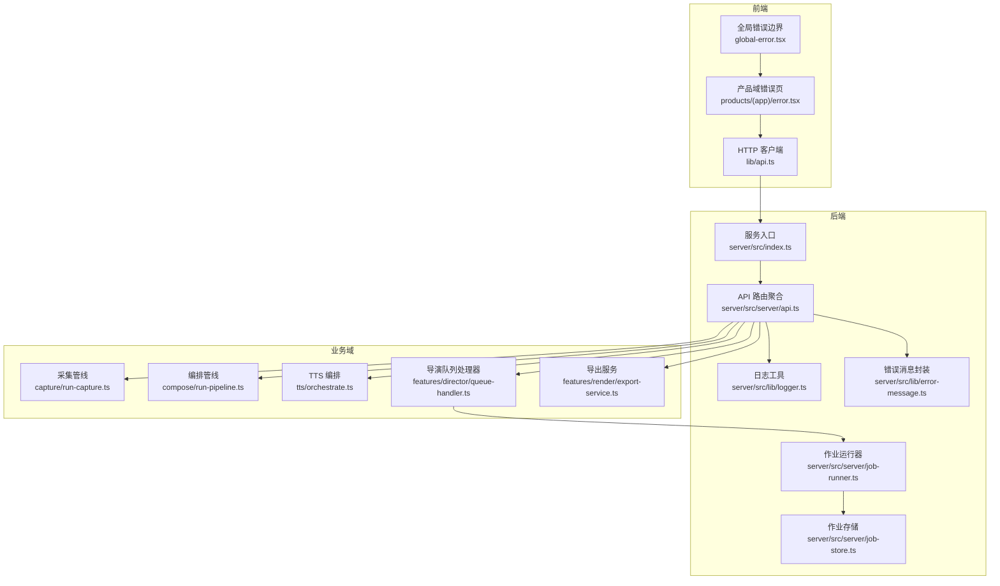
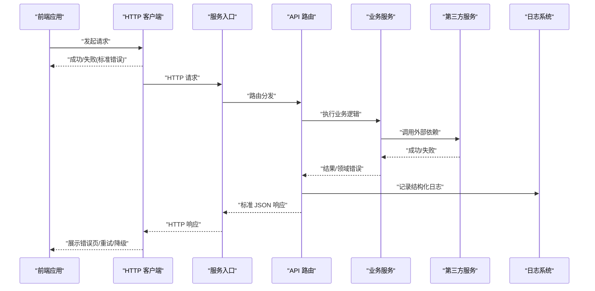
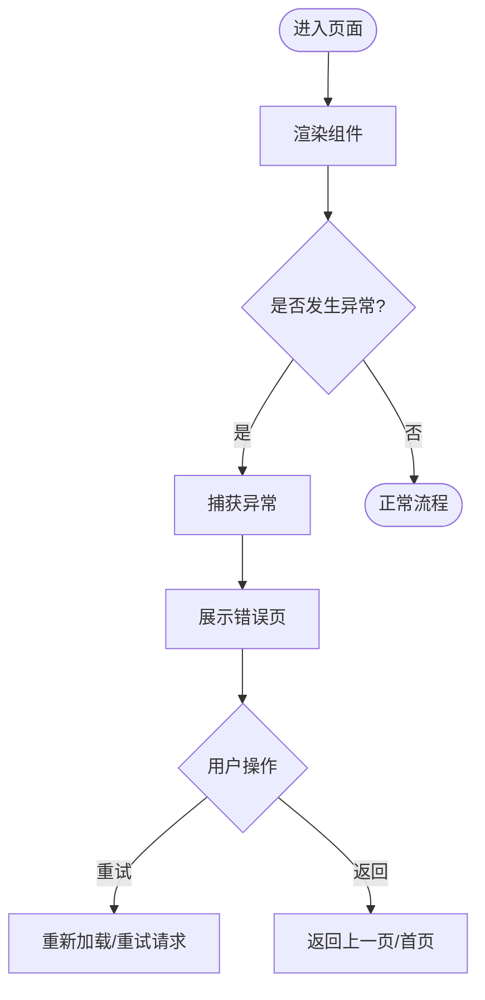
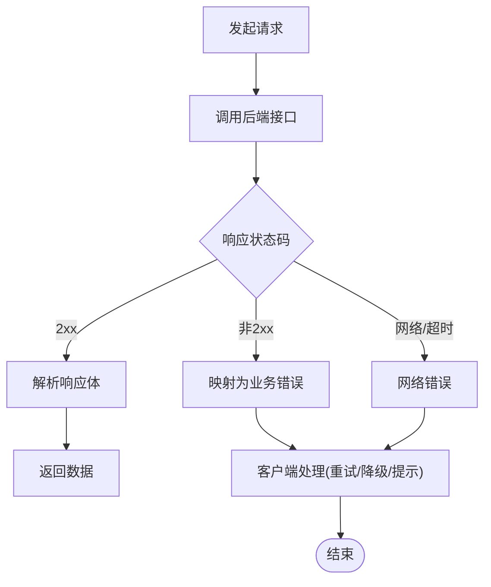
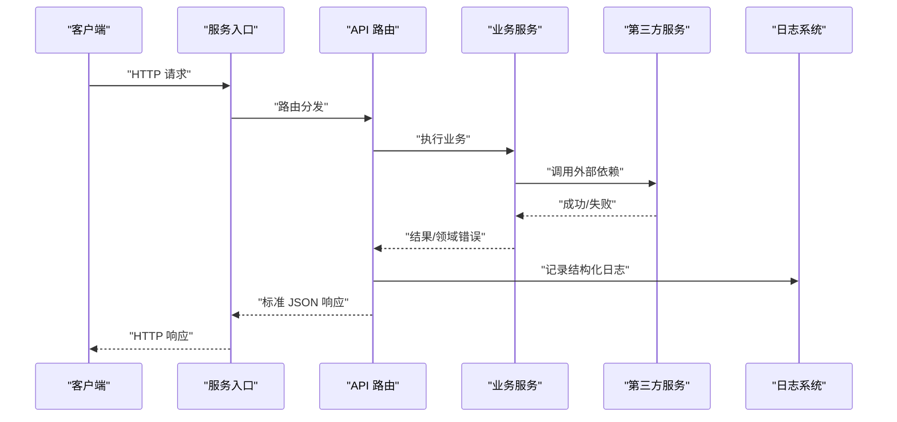
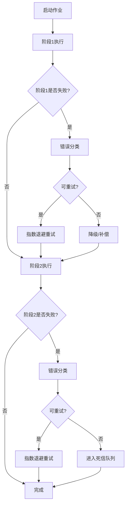
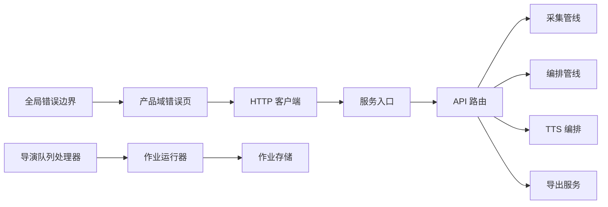

# 错误处理与响应标准化

<cite>
**本文引用的文件**   
- [src/app/global-error.tsx](file://src/app/global-error.tsx)
- [src/app/not-found.tsx](file://src/app/not-found.tsx)
- [src/app/products/(app)/error.tsx](file://src/app/products/(app)/error.tsx)
- [src/lib/api.ts](file://src/lib/api.ts)
- [server/src/index.ts](file://server/src/index.ts)
- [server/src/server/api.ts](file://server/src/server/api.ts)
- [server/src/lib/logger.ts](file://server/src/lib/logger.ts)
- [server/src/lib/error-message.ts](file://server/src/lib/error-message.ts)
- [server/src/capture/run-capture.ts](file://server/src/capture/run-capture.ts)
- [server/src/compose/run-pipeline.ts](file://server/src/compose/run-pipeline.ts)
- [server/src/tts/orchestrate.ts](file://server/src/tts/orchestrate.ts)
- [server/src/server/job-runner.ts](file://server/src/server/job-runner.ts)
- [server/src/server/job-store.ts](file://server/src/server/job-store.ts)
- [src/features/director/queue-handler.ts](file://src/features/director/queue-handler.ts)
- [src/features/render/export-service.ts](file://src/features/render/export-service.ts)
- [tests/worker-error-hygiene.test.ts](file://tests/worker-error-hygiene.test.ts)
</cite>

## 目录
1. [简介](#简介)
2. [项目结构](#项目结构)
3. [核心组件](#核心组件)
4. [架构总览](#架构总览)
5. [详细组件分析](#详细组件分析)
6. [依赖关系分析](#依赖关系分析)
7. [性能考量](#性能考量)
8. [故障排查指南](#故障排查指南)
9. [结论](#结论)
10. [附录](#附录)

## 简介
本文件为 PurpleInK 平台提供统一的错误处理与响应标准化规范，覆盖 API 层、业务层与基础设施层的错误分类、响应格式、全局捕获、日志记录与监控集成，并给出错误恢复与降级策略。目标是让前后端在异常场景下保持一致的错误语义与用户体验，提升可观测性与可维护性。

## 项目结构
错误处理相关的关键位置：
- 前端全局错误与页面级错误边界：用于捕获渲染期与路由期异常，统一返回用户可见的错误页。
- 前端通用 HTTP 客户端：封装请求失败、超时、网络异常的统一处理与重试/降级策略。
- 服务端入口与中间件：集中处理未捕获异常、HTTP 状态码映射、结构化错误响应。
- 作业运行器与队列处理器：对长任务进行错误分类、重试、回滚与状态持久化。
- 第三方服务调用（AI/TTS/存储）：对外部依赖的失败进行分类、熔断与降级。

图表来源 
- [src/app/global-error.tsx](file://src/app/global-error.tsx)
- [src/app/products/(app)/error.tsx](file://src/app/products/(app)/error.tsx)
- [src/lib/api.ts](file://src/lib/api.ts)
- [server/src/index.ts](file://server/src/index.ts)
- [server/src/server/api.ts](file://server/src/server/api.ts)
- [server/src/lib/logger.ts](file://server/src/lib/logger.ts)
- [server/src/lib/error-message.ts](file://server/src/lib/error-message.ts)
- [server/src/capture/run-capture.ts](file://server/src/capture/run-capture.ts)
- [server/src/compose/run-pipeline.ts](file://server/src/compose/run-pipeline.ts)
- [server/src/tts/orchestrate.ts](file://server/src/tts/orchestrate.ts)
- [src/features/director/queue-handler.ts](file://src/features/director/queue-handler.ts)
- [src/features/render/export-service.ts](file://src/features/render/export-service.ts)
- [server/src/server/job-runner.ts](file://server/src/server/job-runner.ts)
- [server/src/server/job-store.ts](file://server/src/server/job-store.ts)

章节来源
- [src/app/global-error.tsx](file://src/app/global-error.tsx)
- [src/app/not-found.tsx](file://src/app/not-found.tsx)
- [src/app/products/(app)/error.tsx](file://src/app/products/(app)/error.tsx)
- [src/lib/api.ts](file://src/lib/api.ts)
- [server/src/index.ts](file://server/src/index.ts)
- [server/src/server/api.ts](file://server/src/server/api.ts)
- [server/src/lib/logger.ts](file://server/src/lib/logger.ts)
- [server/src/lib/error-message.ts](file://server/src/lib/error-message.ts)

## 核心组件
- 全局错误边界（前端）：捕获 React 渲染期异常与未处理 Promise 拒绝，统一展示错误页，避免白屏。
- 产品域错误页（前端）：面向用户的友好提示，包含错误码、简要原因与操作建议。
- HTTP 客户端（前端）：统一拦截请求失败、超时、网络错误，转换为标准错误对象，支持重试与降级。
- 服务端入口与 API 聚合：集中注册中间件，将未捕获异常转为标准 JSON 响应，附带调试信息。
- 日志与错误消息封装：结构化日志输出，敏感信息脱敏，错误码与消息分离便于多语言与追踪。
- 作业运行器与存储：长任务生命周期管理，错误分类、重试、补偿与状态持久化。
- 业务域服务：采集、编排、TTS、导出等模块按统一契约抛出错误，供上层统一处理。

章节来源
- [src/app/global-error.tsx](file://src/app/global-error.tsx)
- [src/app/products/(app)/error.tsx](file://src/app/products/(app)/error.tsx)
- [src/lib/api.ts](file://src/lib/api.ts)
- [server/src/index.ts](file://server/src/index.ts)
- [server/src/server/api.ts](file://server/src/server/api.ts)
- [server/src/lib/logger.ts](file://server/src/lib/logger.ts)
- [server/src/lib/error-message.ts](file://server/src/lib/error-message.ts)
- [server/src/server/job-runner.ts](file://server/src/server/job-runner.ts)
- [server/src/server/job-store.ts](file://server/src/server/job-store.ts)

## 架构总览
错误流从前端到后端的整体路径如下：
- 前端通过全局错误边界捕获渲染期异常，展示产品域错误页；HTTP 客户端将网络/超时/解析错误统一为标准错误对象。
- 后端入口统一捕获未处理异常，API 层根据错误类型映射 HTTP 状态码，返回标准 JSON 响应。
- 业务层抛出领域错误，由中间件或包装器转换为标准错误对象；外部依赖失败被归类为网络/第三方错误。
- 作业运行器对长任务进行错误分类、重试与补偿，状态写入作业存储，供查询与告警。

图表来源 
- [src/lib/api.ts](file://src/lib/api.ts)
- [server/src/index.ts](file://server/src/index.ts)
- [server/src/server/api.ts](file://server/src/server/api.ts)
- [server/src/lib/logger.ts](file://server/src/lib/logger.ts)

## 详细组件分析

### 前端全局错误边界与产品域错误页
- 全局错误边界负责捕获未处理的渲染异常与 Promise 拒绝，避免应用崩溃，统一跳转到错误页。
- 产品域错误页接收错误对象，提取错误码与消息，向用户展示友好提示与操作建议（如重试、返回首页）。
- 对于网络错误，客户端应区分超时、连接失败、DNS 解析失败等，并在 UI 上给出差异化提示。

章节来源
- [src/app/global-error.tsx](file://src/app/global-error.tsx)
- [src/app/not-found.tsx](file://src/app/not-found.tsx)
- [src/app/products/(app)/error.tsx](file://src/app/products/(app)/error.tsx)

### 前端 HTTP 客户端（统一请求与错误转换）
- 统一拦截器：捕获网络错误、超时、HTTP 非 2xx、JSON 解析失败，转换为标准错误对象。
- 错误分类：网络错误、业务错误（由后端返回）、客户端参数校验错误。
- 重试与降级：对幂等请求支持指数退避重试；对关键路径提供降级策略（缓存、默认值、只读模式）。
- 调试信息：附加请求 ID、时间戳、URL、方法、部分负载摘要（脱敏），便于问题定位。

章节来源
- [src/lib/api.ts](file://src/lib/api.ts)

### 服务端入口与 API 层（统一响应与错误映射）
- 服务入口：注册全局异常捕获，将未处理异常转换为标准 JSON 响应，设置合适的 HTTP 状态码。
- API 路由：对输入进行校验，抛出自定义领域错误；对第三方调用失败进行分类（网络/限流/认证失败）。
- 响应格式：所有错误响应遵循统一结构，包含错误码、消息、调试信息与可选的请求上下文。
- 日志记录：结构化日志，包含请求 ID、用户标识、资源标识、错误类别与堆栈摘要。

章节来源
- [server/src/index.ts](file://server/src/index.ts)
- [server/src/server/api.ts](file://server/src/server/api.ts)
- [server/src/lib/logger.ts](file://server/src/lib/logger.ts)
- [server/src/lib/error-message.ts](file://server/src/lib/error-message.ts)

### 作业运行器与存储（长任务错误处理）
- 作业运行器：对长任务进行分阶段执行，捕获各阶段错误，分类为可重试/不可重试，执行补偿或回滚。
- 错误分类：业务错误（参数/状态不合法）、系统错误（资源不足/内部异常）、网络错误（超时/连接失败）、第三方错误（限流/鉴权失败）。
- 重试策略：指数退避、最大重试次数、死信队列；对幂等操作安全重试。
- 状态持久化：作业状态与错误信息写入存储，支持查询、审计与告警。

章节来源
- [server/src/server/job-runner.ts](file://server/src/server/job-runner.ts)
- [server/src/server/job-store.ts](file://server/src/server/job-store.ts)
- [src/features/director/queue-handler.ts](file://src/features/director/queue-handler.ts)

### 业务域服务（采集、编排、TTS、导出）
- 采集管线：捕获浏览器驱动失败、页面加载超时、凭证错误，分类为网络/第三方错误，提供重试与降级（Mock 驱动）。
- 编排管线：步骤间状态校验、依赖缺失、模板渲染失败，抛出业务错误，支持回滚与部分提交。
- TTS 编排：音频合成失败、编码错误、存储上传失败，分类为第三方/系统错误，触发重试或切换提供商。
- 导出服务：帧序列处理失败、编码失败、并发冲突，采用重试与队列限流，保证最终一致性。

章节来源
- [server/src/capture/run-capture.ts](file://server/src/capture/run-capture.ts)
- [server/src/compose/run-pipeline.ts](file://server/src/compose/run-pipeline.ts)
- [server/src/tts/orchestrate.ts](file://server/src/tts/orchestrate.ts)
- [src/features/render/export-service.ts](file://src/features/render/export-service.ts)

### 错误分类体系与响应格式
- 错误分类：
  - 业务错误：参数校验失败、状态不合法、权限不足。
  - 系统错误：资源不足、内部异常、配置错误。
  - 网络错误：超时、连接失败、DNS 解析失败。
  - 第三方错误：限流、鉴权失败、服务不可用。
- 响应格式：
  - 错误码：唯一、分层（模块/子模块/具体错误），便于前端展示与后端统计。
  - 错误消息：人类可读，支持多语言；调试信息仅用于开发环境，生产环境脱敏。
  - 请求上下文：请求 ID、时间戳、用户/资源标识，便于追踪。
- 示例（以路径引用代替代码内容）：
  - API 层错误响应示例：[server/src/server/api.ts](file://server/src/server/api.ts)
  - 错误消息封装示例：[server/src/lib/error-message.ts](file://server/src/lib/error-message.ts)
  - 前端 HTTP 客户端错误处理示例：[src/lib/api.ts](file://src/lib/api.ts)

章节来源
- [server/src/server/api.ts](file://server/src/server/api.ts)
- [server/src/lib/error-message.ts](file://server/src/lib/error-message.ts)
- [src/lib/api.ts](file://src/lib/api.ts)

## 依赖关系分析
- 前端依赖：全局错误边界依赖产品域错误页；HTTP 客户端依赖统一错误对象与日志。
- 后端依赖：服务入口依赖 API 路由；API 路由依赖业务服务与日志；作业运行器依赖作业存储。
- 业务域依赖：采集/编排/TTS/导出均依赖外部第三方服务与存储，需统一错误分类与重试策略。

图表来源 
- [src/app/global-error.tsx](file://src/app/global-error.tsx)
- [src/app/products/(app)/error.tsx](file://src/app/products/(app)/error.tsx)
- [src/lib/api.ts](file://src/lib/api.ts)
- [server/src/index.ts](file://server/src/index.ts)
- [server/src/server/api.ts](file://server/src/server/api.ts)
- [server/src/capture/run-capture.ts](file://server/src/capture/run-capture.ts)
- [server/src/compose/run-pipeline.ts](file://server/src/compose/run-pipeline.ts)
- [server/src/tts/orchestrate.ts](file://server/src/tts/orchestrate.ts)
- [src/features/director/queue-handler.ts](file://src/features/director/queue-handler.ts)
- [src/features/render/export-service.ts](file://src/features/render/export-service.ts)
- [server/src/server/job-runner.ts](file://server/src/server/job-runner.ts)
- [server/src/server/job-store.ts](file://server/src/server/job-store.ts)

## 性能考量
- 错误响应体积：避免在生产环境返回大型堆栈或敏感信息，减少带宽与解析开销。
- 重试风暴：使用指数退避与抖动，限制最大重试次数，避免雪崩。
- 日志采样：对高频错误进行采样记录，降低 I/O 压力。
- 降级优先：对关键路径提供只读模式或缓存命中，确保可用性。

## 故障排查指南
- 快速定位：通过请求 ID 与时间戳关联前端日志与后端结构化日志。
- 错误分类：根据错误码前缀判断所属模块与错误类型，缩小排查范围。
- 重试与降级：检查重试策略是否合理，确认降级开关与缓存状态。
- 第三方服务：查看限流、鉴权与服务可用性指标，必要时切换提供商。
- 作业失败：检查作业存储中的错误信息与补偿记录，确认是否进入死信队列。

章节来源
- [tests/worker-error-hygiene.test.ts](file://tests/worker-error-hygiene.test.ts)
- [server/src/lib/logger.ts](file://server/src/lib/logger.ts)
- [server/src/server/job-store.ts](file://server/src/server/job-store.ts)

## 结论
通过统一错误分类、标准化响应格式、全局捕获与结构化日志，PurpleInK 平台能够在 API 层、业务层与基础设施层实现一致的异常处理体验。结合重试、降级与补偿策略，系统在故障场景下具备更强的韧性与可观测性。

## 附录
- 错误码命名建议：模块_子模块_错误类型_具体错误（例如：capture_network_timeout）。
- 调试信息脱敏：生产环境移除敏感字段（密钥、用户隐私），保留必要上下文（请求 ID、时间戳、资源标识）。
- 监控集成：将错误率、重试次数、第三方失败比例接入监控系统，设置告警阈值。