# 中间件管道架构

<cite>
**本文引用的文件**   
- [next.config.ts](file://next.config.ts)
- [src/instrumentation.ts](file://src/instrumentation.ts)
- [src/app/layout.tsx](file://src/app/layout.tsx)
- [src/app/providers.tsx](file://src/app/providers.tsx)
- [src/app/api/ping/route.ts](file://src/app/api/ping/route.ts)
- [src/app/api/projects/route.ts](file://src/app/api/projects/route.ts)
- [src/lib/api.ts](file://src/lib/api.ts)
- [server/src/index.ts](file://server/src/index.ts)
- [server/src/server/api.ts](file://server/src/server/api.ts)
- [server/src/lib/load-env.ts](file://server/src/lib/load-env.ts)
- [server/src/lib/logger.ts](file://server/src/lib/logger.ts)
- [deploy/env.example](file://deploy/env.example)
- [config/tts.env.example](file://config/tts.env.example)
</cite>

## 目录
1. [简介](#简介)
2. [项目结构](#项目结构)
3. [核心组件](#核心组件)
4. [架构总览](#架构总览)
5. [详细组件分析](#详细组件分析)
6. [依赖关系分析](#依赖关系分析)
7. [性能考量](#性能考量)
8. [故障排查指南](#故障排查指南)
9. [结论](#结论)
10. [附录](#附录)

## 简介
本文件为 PurpleInK 平台的“中间件管道架构”文档，聚焦于基于 Next.js 的请求处理管道设计。内容涵盖：
- 中间件执行顺序、上下文传递与错误传播机制
- 配置管理中间件、环境变量加载与动态配置更新
- 日志记录、请求追踪与性能监控集成
- CORS 配置、安全头设置与请求过滤策略
- 自定义中间件开发指南、测试方法与部署注意事项
- 中间件组合模式、依赖注入与模块化设计原则

该文档旨在帮助开发者快速理解并扩展平台在 Web 与 Server 侧的请求处理链路，确保可观测性、安全性与可扩展性。

## 项目结构
PurpleInK 采用 Next.js App Router 组织路由与 API 端点，同时在 server 子工程中提供独立的 Node/Next 服务入口与工具库。关键位置如下：
- 应用层入口与全局布局：src/app/layout.tsx、src/app/providers.tsx
- 应用级初始化与监控：src/instrumentation.ts
- API 路由示例：src/app/api/*/route.ts
- 通用 API 工具与封装：src/lib/api.ts
- 服务端工程入口与 API：server/src/index.ts、server/src/server/api.ts
- 环境变量与配置样例：deploy/env.example、config/tts.env.example
- 服务器侧环境加载与日志：server/src/lib/load-env.ts、server/src/lib/logger.ts

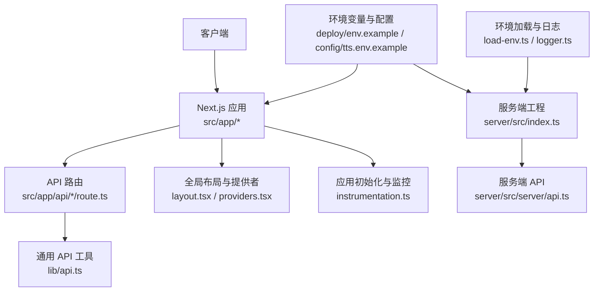

**图表来源**
- [src/app/layout.tsx](file://src/app/layout.tsx)
- [src/app/providers.tsx](file://src/app/providers.tsx)
- [src/instrumentation.ts](file://src/instrumentation.ts)
- [src/app/api/ping/route.ts](file://src/app/api/ping/route.ts)
- [src/app/api/projects/route.ts](file://src/app/api/projects/route.ts)
- [src/lib/api.ts](file://src/lib/api.ts)
- [server/src/index.ts](file://server/src/index.ts)
- [server/src/server/api.ts](file://server/src/server/api.ts)
- [deploy/env.example](file://deploy/env.example)
- [config/tts.env.example](file://config/tts.env.example)
- [server/src/lib/load-env.ts](file://server/src/lib/load-env.ts)
- [server/src/lib/logger.ts](file://server/src/lib/logger.ts)

**章节来源**
- [next.config.ts](file://next.config.ts)
- [src/app/layout.tsx](file://src/app/layout.tsx)
- [src/app/providers.tsx](file://src/app/providers.tsx)
- [src/instrumentation.ts](file://src/instrumentation.ts)
- [src/app/api/ping/route.ts](file://src/app/api/ping/route.ts)
- [src/app/api/projects/route.ts](file://src/app/api/projects/route.ts)
- [src/lib/api.ts](file://src/lib/api.ts)
- [server/src/index.ts](file://server/src/index.ts)
- [server/src/server/api.ts](file://server/src/server/api.ts)
- [deploy/env.example](file://deploy/env.example)
- [config/tts.env.example](file://config/tts.env.example)
- [server/src/lib/load-env.ts](file://server/src/lib/load-env.ts)
- [server/src/lib/logger.ts](file://server/src/lib/logger.ts)

## 核心组件
- 应用初始化与监控（instrumentation）：负责在应用启动时注册监控、指标上报与错误捕获钩子，为后续中间件链提供统一的观测能力。
- 全局布局与提供者（layout/providers）：作为请求进入页面渲染前的第一道拦截点，适合挂载跨域、安全头、认证鉴权等横切逻辑。
- API 路由（app/api/*/route.ts）：每个路由即一个处理单元，可在内部或外部通过统一工具进行参数校验、权限检查、限流与日志埋点。
- 通用 API 工具（lib/api.ts）：封装请求构建、响应包装、错误标准化与重试策略，便于中间件复用。
- 服务端工程（server）：独立的服务入口与 API 实现，配合 load-env 与 logger 完成环境加载与结构化日志输出。

**章节来源**
- [src/instrumentation.ts](file://src/instrumentation.ts)
- [src/app/layout.tsx](file://src/app/layout.tsx)
- [src/app/providers.tsx](file://src/app/providers.tsx)
- [src/app/api/ping/route.ts](file://src/app/api/ping/route.ts)
- [src/app/api/projects/route.ts](file://src/app/api/projects/route.ts)
- [src/lib/api.ts](file://src/lib/api.ts)
- [server/src/index.ts](file://server/src/index.ts)
- [server/src/server/api.ts](file://server/src/server/api.ts)

## 架构总览
下图展示从客户端到 Next.js 应用再到后端服务的整体请求路径，以及中间件在各层的介入点。

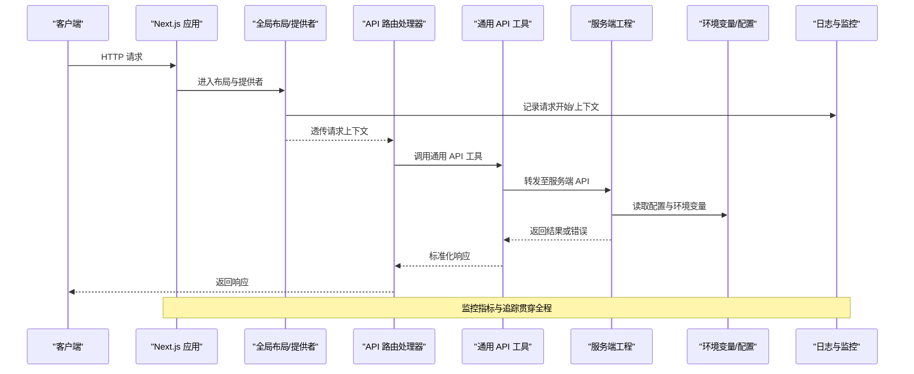

**图表来源**
- [src/app/layout.tsx](file://src/app/layout.tsx)
- [src/app/providers.tsx](file://src/app/providers.tsx)
- [src/app/api/ping/route.ts](file://src/app/api/ping/route.ts)
- [src/lib/api.ts](file://src/lib/api.ts)
- [server/src/index.ts](file://server/src/index.ts)
- [server/src/server/api.ts](file://server/src/server/api.ts)
- [deploy/env.example](file://deploy/env.example)
- [config/tts.env.example](file://config/tts.env.example)
- [server/src/lib/load-env.ts](file://server/src/lib/load-env.ts)
- [server/src/lib/logger.ts](file://server/src/lib/logger.ts)

## 详细组件分析

### 应用初始化与监控（instrumentation）
- 职责：在应用生命周期早期注册指标采集、错误上报与请求追踪钩子；为后续中间件提供统一的上下文与观测能力。
- 关键点：
  - 启动阶段初始化监控 SDK/探针
  - 注册全局错误处理器与未捕获异常钩子
  - 暴露统一的指标上报接口供中间件使用

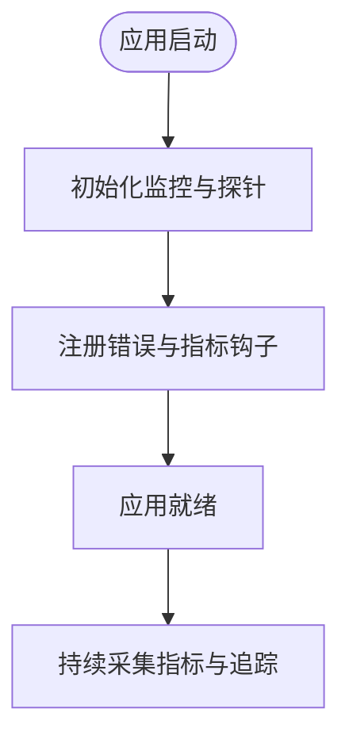

**图表来源**
- [src/instrumentation.ts](file://src/instrumentation.ts)

**章节来源**
- [src/instrumentation.ts](file://src/instrumentation.ts)

### 全局布局与提供者（layout/providers）
- 职责：作为页面渲染前的一层拦截点，集中处理跨域、安全头、认证鉴权、请求上下文注入等横切逻辑。
- 关键点：
  - 设置 CORS 与安全头（如 CSP、X-Frame-Options、Referrer-Policy）
  - 注入用户会话、租户信息、追踪 ID 到请求上下文
  - 对敏感路径进行白名单放行与黑名单拦截

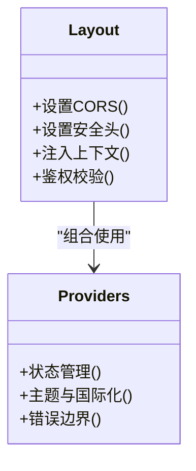

**图表来源**
- [src/app/layout.tsx](file://src/app/layout.tsx)
- [src/app/providers.tsx](file://src/app/providers.tsx)

**章节来源**
- [src/app/layout.tsx](file://src/app/layout.tsx)
- [src/app/providers.tsx](file://src/app/providers.tsx)

### API 路由与通用工具（api route & lib/api）
- 职责：定义具体业务 API，并在路由内或通过通用工具实现参数校验、权限检查、限流、重试与错误标准化。
- 关键点：
  - 路由内最小化逻辑，复杂流程下沉至工具或服务层
  - 统一错误码与消息格式，便于前端与监控消费
  - 支持请求体大小限制、字段白名单与输入清洗

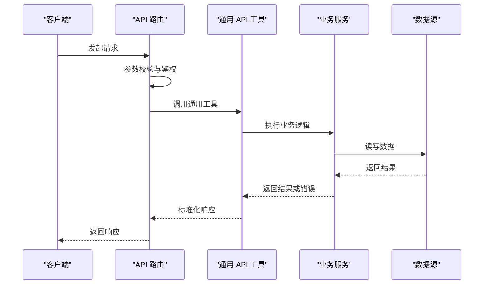

**图表来源**
- [src/app/api/ping/route.ts](file://src/app/api/ping/route.ts)
- [src/app/api/projects/route.ts](file://src/app/api/projects/route.ts)
- [src/lib/api.ts](file://src/lib/api.ts)

**章节来源**
- [src/app/api/ping/route.ts](file://src/app/api/ping/route.ts)
- [src/app/api/projects/route.ts](file://src/app/api/projects/route.ts)
- [src/lib/api.ts](file://src/lib/api.ts)

### 服务端工程与环境加载（server）
- 职责：提供独立的服务入口与 API 实现，结合环境变量加载与结构化日志，确保运行期配置正确性与可观测性。
- 关键点：
  - 启动时加载 .env 与运行时环境变量
  - 使用结构化日志记录请求、错误与性能指标
  - 对外暴露稳定的 API 契约，便于上层复用

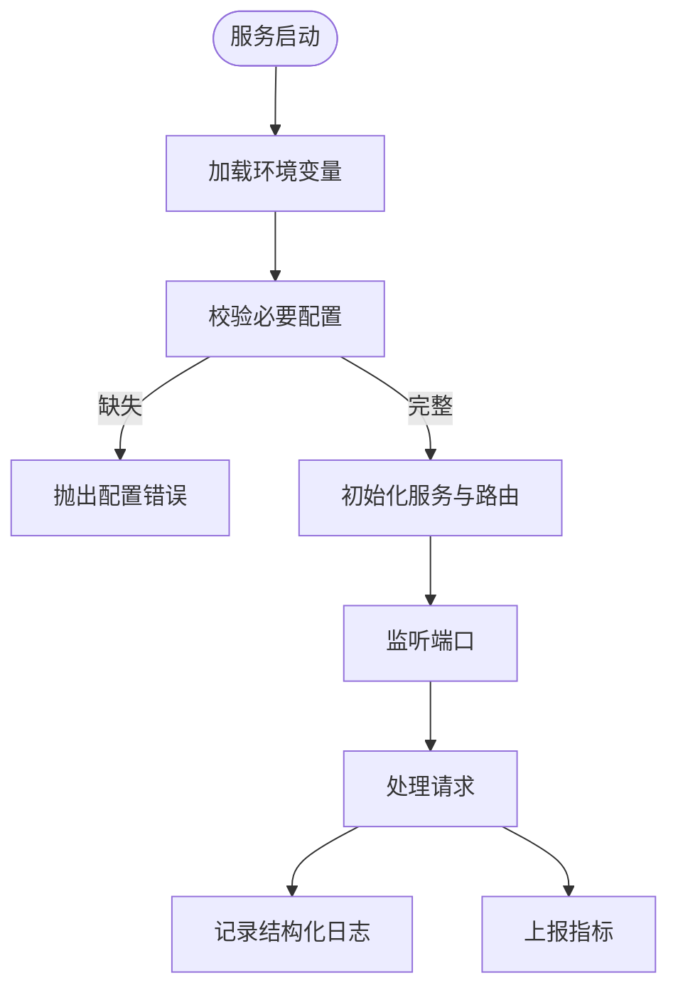

**图表来源**
- [server/src/index.ts](file://server/src/index.ts)
- [server/src/server/api.ts](file://server/src/server/api.ts)
- [server/src/lib/load-env.ts](file://server/src/lib/load-env.ts)
- [server/src/lib/logger.ts](file://server/src/lib/logger.ts)

**章节来源**
- [server/src/index.ts](file://server/src/index.ts)
- [server/src/server/api.ts](file://server/src/server/api.ts)
- [server/src/lib/load-env.ts](file://server/src/lib/load-env.ts)
- [server/src/lib/logger.ts](file://server/src/lib/logger.ts)

### 配置管理与动态更新
- 环境变量来源：
  - 部署级配置：deploy/env.example
  - 模块级配置：config/tts.env.example
- 动态更新策略：
  - 启动时加载基础配置，运行时通过热重载或配置中心刷新
  - 敏感配置（密钥）通过安全存储与只读访问控制
  - 变更需具备回滚与灰度发布能力

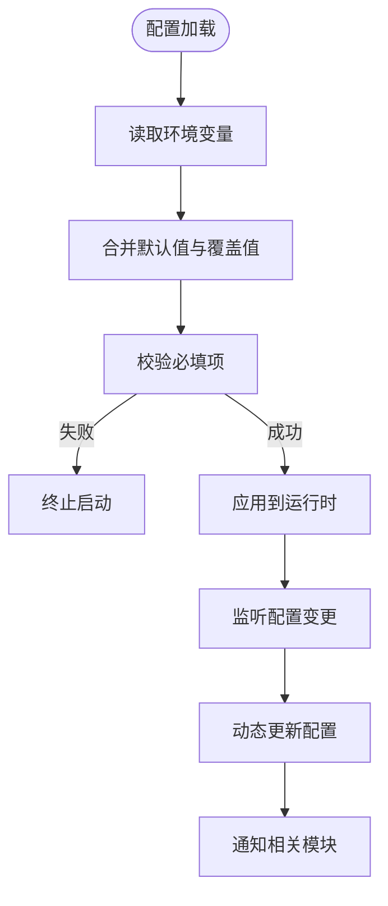

**图表来源**
- [deploy/env.example](file://deploy/env.example)
- [config/tts.env.example](file://config/tts.env.example)
- [server/src/lib/load-env.ts](file://server/src/lib/load-env.ts)

**章节来源**
- [deploy/env.example](file://deploy/env.example)
- [config/tts.env.example](file://config/tts.env.example)
- [server/src/lib/load-env.ts](file://server/src/lib/load-env.ts)

### 日志记录、请求追踪与性能监控
- 日志记录：
  - 结构化日志（JSON）便于聚合与分析
  - 按级别（info/warn/error）与模块分类
- 请求追踪：
  - 为每个请求生成唯一追踪 ID，贯穿上下游
  - 记录关键节点耗时与状态码
- 性能监控：
  - 采集 CPU、内存、I/O 与业务指标
  - 设置阈值告警与可视化看板

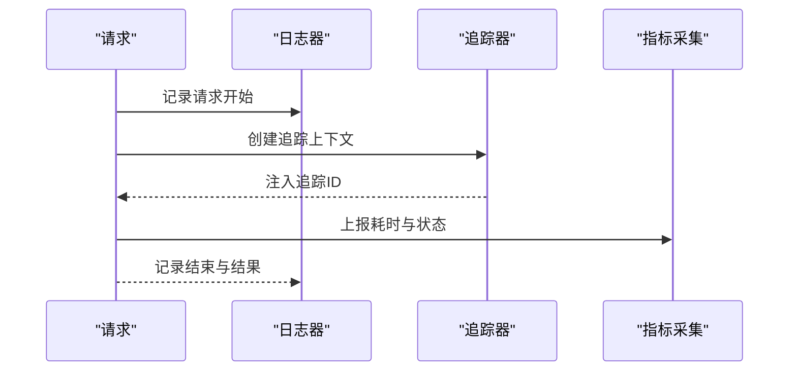

**图表来源**
- [server/src/lib/logger.ts](file://server/src/lib/logger.ts)
- [src/instrumentation.ts](file://src/instrumentation.ts)

**章节来源**
- [server/src/lib/logger.ts](file://server/src/lib/logger.ts)
- [src/instrumentation.ts](file://src/instrumentation.ts)

### CORS、安全头与请求过滤
- CORS 配置：
  - 允许的来源、方法、头部与凭据策略
  - 预检请求缓存与最大时长
- 安全头设置：
  - Content-Security-Policy、X-Content-Type-Options、X-Frame-Options、Strict-Transport-Security
- 请求过滤策略：
  - 白名单域名与路径
  - 请求体大小限制与字段白名单
  - 速率限制与 IP 黑名单

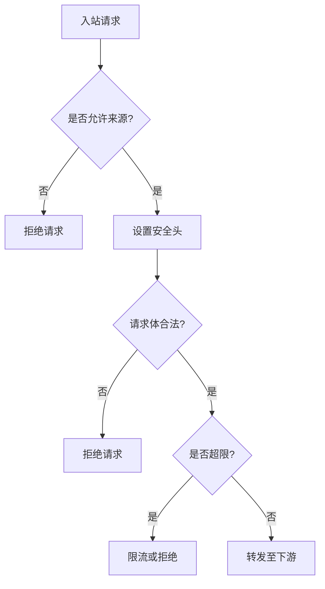

**图表来源**
- [src/app/layout.tsx](file://src/app/layout.tsx)
- [src/app/providers.tsx](file://src/app/providers.tsx)

**章节来源**
- [src/app/layout.tsx](file://src/app/layout.tsx)
- [src/app/providers.tsx](file://src/app/providers.tsx)

### 自定义中间件开发指南
- 设计原则：
  - 单一职责：每个中间件只做一件事
  - 幂等与无副作用：避免修改共享状态
  - 可组合：通过函数组合或装饰器串联
- 开发步骤：
  - 定义中间件签名（请求、上下文、下一步）
  - 实现前置处理与后置处理
  - 错误处理与超时控制
  - 单元测试与集成测试覆盖
- 最佳实践：
  - 使用类型约束与校验库保证输入合法性
  - 将敏感逻辑与配置外置，避免硬编码
  - 提供开关与降级策略

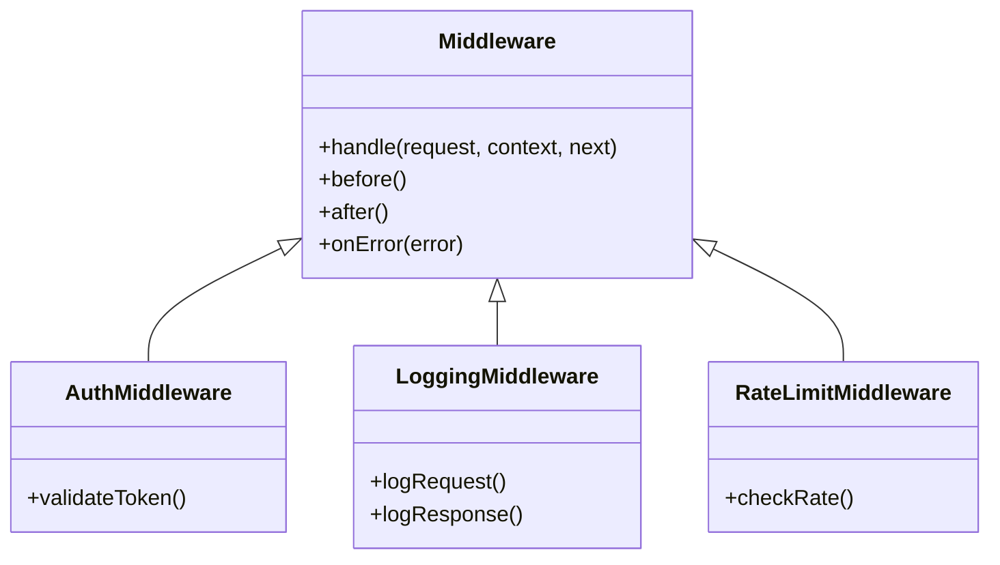

**图表来源**
- [src/lib/api.ts](file://src/lib/api.ts)
- [src/app/api/ping/route.ts](file://src/app/api/ping/route.ts)

**章节来源**
- [src/lib/api.ts](file://src/lib/api.ts)
- [src/app/api/ping/route.ts](file://src/app/api/ping/route.ts)

### 测试方法与部署注意事项
- 测试方法：
  - 单元测试：针对中间件逻辑与工具函数
  - 集成测试：模拟真实请求链路，验证端到端行为
  - 契约测试：确保 API 前后端契约稳定
- 部署注意事项：
  - 环境变量隔离（开发/测试/生产）
  - 健康检查与就绪探针
  - 滚动更新与回滚策略
  - 资源配额与限流保护

**章节来源**
- [src/app/api/ping/route.ts](file://src/app/api/ping/route.ts)
- [src/app/api/projects/route.ts](file://src/app/api/projects/route.ts)
- [deploy/env.example](file://deploy/env.example)

## 依赖关系分析
- 组件耦合：
  - instrumentation 与 layout/providers 低耦合，通过事件与上下文交互
  - API 路由与 lib/api 高内聚，工具层屏蔽细节
  - server 与 load-env/logger 强依赖，确保运行期稳定性
- 外部依赖：
  - 监控与日志 SDK
  - 数据库与缓存驱动
  - 第三方服务（TTS、AI 模型等）

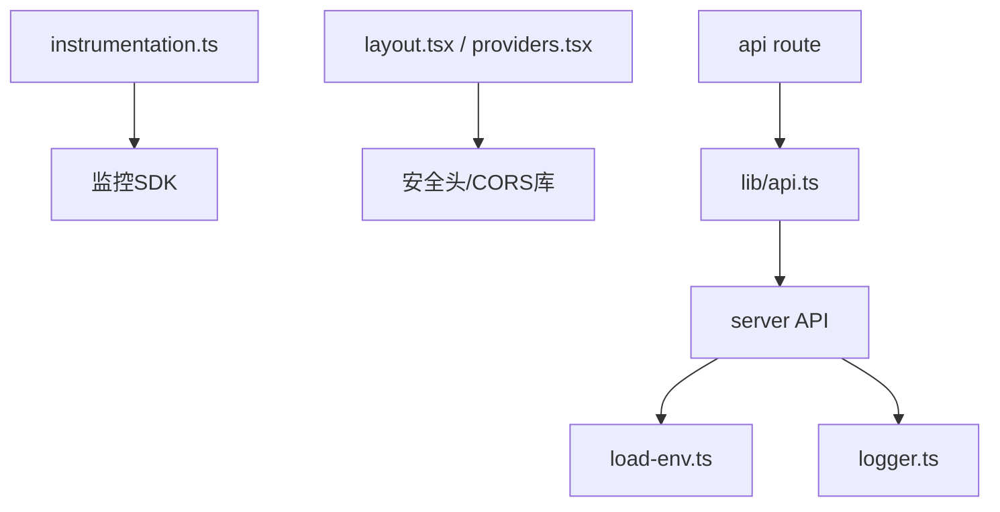

**图表来源**
- [src/instrumentation.ts](file://src/instrumentation.ts)
- [src/app/layout.tsx](file://src/app/layout.tsx)
- [src/app/providers.tsx](file://src/app/providers.tsx)
- [src/lib/api.ts](file://src/lib/api.ts)
- [server/src/server/api.ts](file://server/src/server/api.ts)
- [server/src/lib/load-env.ts](file://server/src/lib/load-env.ts)
- [server/src/lib/logger.ts](file://server/src/lib/logger.ts)

**章节来源**
- [src/instrumentation.ts](file://src/instrumentation.ts)
- [src/app/layout.tsx](file://src/app/layout.tsx)
- [src/app/providers.tsx](file://src/app/providers.tsx)
- [src/lib/api.ts](file://src/lib/api.ts)
- [server/src/server/api.ts](file://server/src/server/api.ts)
- [server/src/lib/load-env.ts](file://server/src/lib/load-env.ts)
- [server/src/lib/logger.ts](file://server/src/lib/logger.ts)

## 性能考量
- 减少中间件数量与复杂度，避免长尾延迟
- 使用连接池与缓存降低 I/O 开销
- 异步与非阻塞处理，提升并发吞吐
- 监控热点路径与慢查询，及时优化

[本节为通用指导，不直接分析具体文件]

## 故障排查指南
- 常见问题：
  - 环境变量缺失导致启动失败
  - CORS 或安全头配置错误导致跨域问题
  - 日志未输出或追踪 ID 丢失
- 排查步骤：
  - 检查环境变量与配置文件
  - 查看结构化日志与错误堆栈
  - 使用追踪 ID 定位请求链路
  - 逐步禁用中间件定位问题

**章节来源**
- [server/src/lib/load-env.ts](file://server/src/lib/load-env.ts)
- [server/src/lib/logger.ts](file://server/src/lib/logger.ts)
- [src/instrumentation.ts](file://src/instrumentation.ts)

## 结论
PurpleInK 的中间件管道以 Next.js 为核心，结合应用初始化、全局布局、API 路由与服务端工程，形成清晰的分层与职责划分。通过统一的环境加载、结构化日志与监控，实现了高可观测性与可维护性。遵循组合模式与依赖注入原则，开发者可轻松扩展与定制中间件，满足多样化业务需求。

[本节为总结，不直接分析具体文件]

## 附录
- 术语表：
  - 中间件：在请求处理链中执行的横切逻辑单元
  - 上下文：跨中间件传递的状态与元数据
  - 追踪 ID：用于标识一次请求的唯一标识
- 参考文件：
  - 环境变量样例：deploy/env.example、config/tts.env.example
  - 日志与监控：server/src/lib/logger.ts、src/instrumentation.ts

[本节为补充信息，不直接分析具体文件]