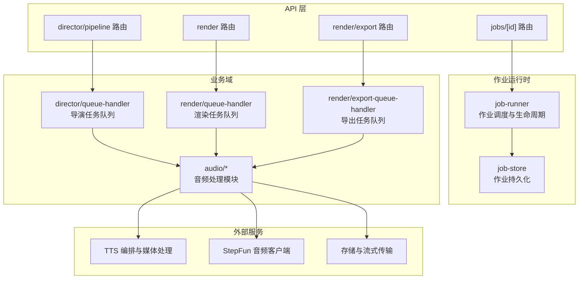
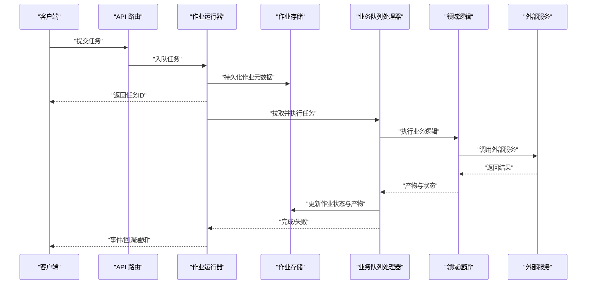
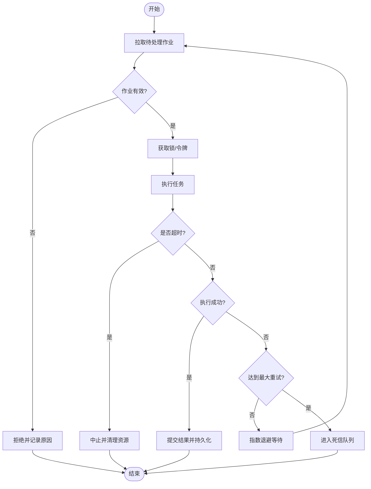
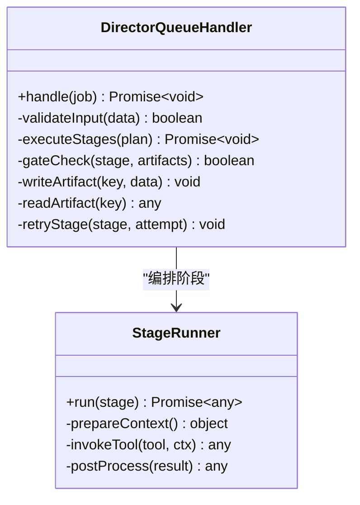
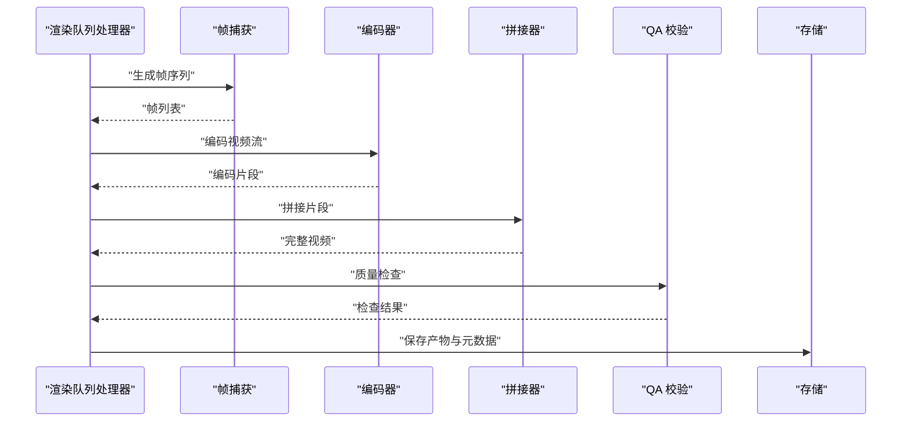
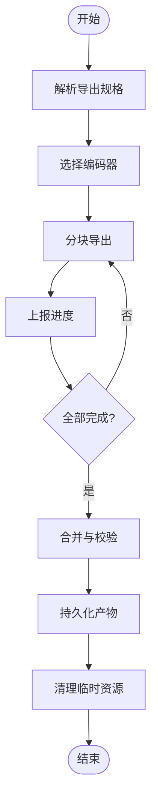
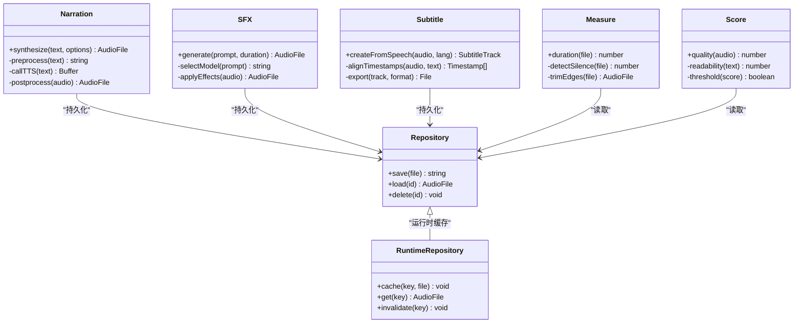
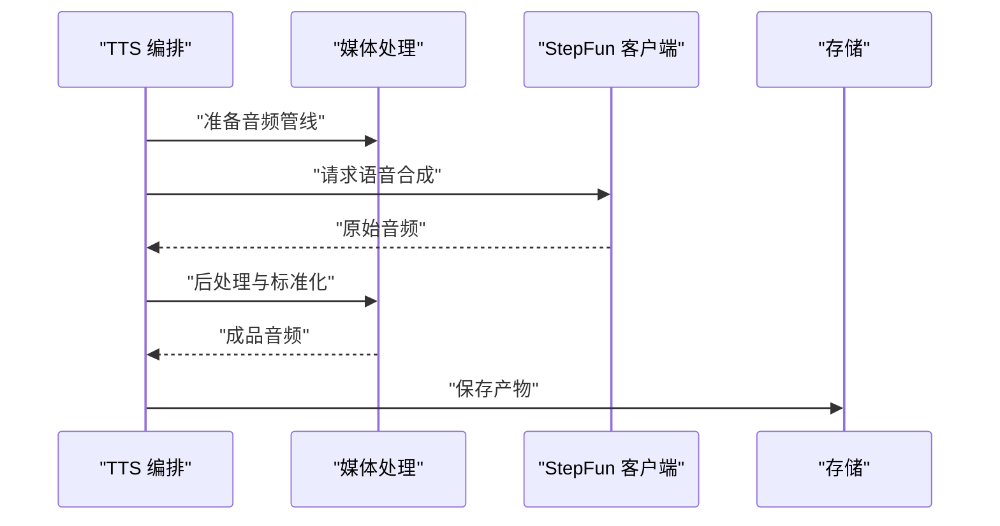
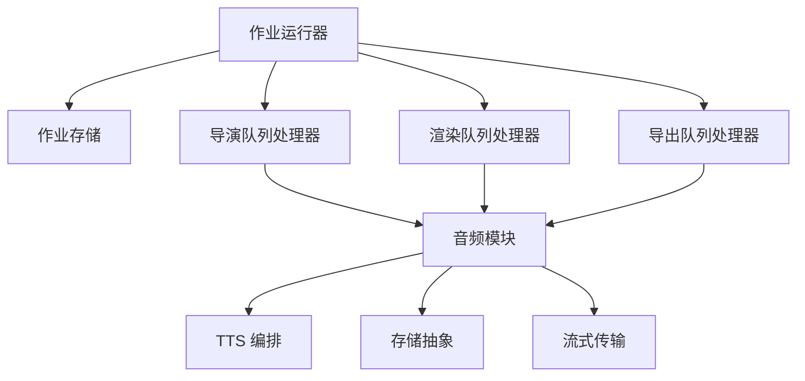

# 任务处理器

<cite>
**本文引用的文件**   
- [server/src/server/job-runner.ts](file://server/src/server/job-runner.ts)
- [server/src/server/job-store.ts](file://server/src/server/job-store.ts)
- [src/features/director/queue-handler.ts](file://src/features/director/queue-handler.ts)
- [src/features/render/queue-handler.ts](file://src/features/render/queue-handler.ts)
- [src/features/render/export-queue-handler.ts](file://src/features/render/export-queue-handler.ts)
- [src/features/audio/narration.ts](file://src/features/audio/narration.ts)
- [src/features/audio/repository.ts](file://src/features/audio/repository.ts)
- [src/features/audio/runtime-repository.ts](file://src/features/audio/runtime-repository.ts)
- [src/features/audio/score.ts](file://src/features/audio/score.ts)
- [src/features/audio/subtitle.ts](file://src/features/audio/subtitle.ts)
- [src/features/audio/measure.ts](file://src/features/audio/measure.ts)
- [src/features/audio/sfx.ts](file://src/features/audio/sfx.ts)
- [src/features/audio/stepfun-audio-client.ts](file://src/features/audio/stepfun-audio-client.ts)
- [src/lib/queue/index.ts](file://src/lib/queue/index.ts)
- [src/lib/storage/index.ts](file://src/lib/storage/index.ts)
- [src/lib/stream/index.ts](file://src/lib/stream/index.ts)
- [src/app/api/jobs/[id]/route.ts](file://src/app/api/jobs/[id]/route.ts)
- [src/app/api/director/pipeline/route.ts](file://src/app/api/director/pipeline/route.ts)
- [src/app/api/render/route.ts](file://src/app/api/render/route.ts)
- [src/app/api/render/export/route.ts](file://src/app/api/render/export/route.ts)
- [server/src/compose/run-pipeline.ts](file://server/src/compose/run-pipeline.ts)
- [server/src/capture/run-capture.ts](file://server/src/capture/run-capture.ts)
- [server/src/tts/orchestrate.ts](file://server/src/tts/orchestrate.ts)
- [server/src/tts/media.ts](file://server/src/tts/media.ts)
- [server/src/tts/listenhub.ts](file://server/src/tts/listenhub.ts)
- [server/src/lib/logger.ts](file://server/src/lib/logger.ts)
- [server/src/lib/error-message.ts](file://server/src/lib/error-message.ts)
- [server/src/lib/llm-response-parser.ts](file://server/src/lib/llm-response-parser.ts)
- [server/src/lib/step-client.ts](file://server/src/lib/step-client.ts)
- [server/src/lib/load-env.ts](file://server/src/lib/load-env.ts)
</cite>

## 目录
1. [简介](#简介)
2. [项目结构](#项目结构)
3. [核心组件](#核心组件)
4. [架构总览](#架构总览)
5. [详细组件分析](#详细组件分析)
6. [依赖关系分析](#依赖关系分析)
7. [性能考量](#性能考量)
8. [故障排查指南](#故障排查指南)
9. [结论](#结论)
10. [附录](#附录)

## 简介
本文件为 PurpleInk 平台的“任务处理器”提供系统化、可操作的技术文档。内容覆盖导演任务、渲染任务与音频处理任务的实现逻辑，贯穿任务执行流程、错误处理与重试机制、依赖关系管理、资源分配与隔离策略、监控与日志、性能分析与优化建议，以及自定义任务处理器的开发指南与最佳实践。目标是帮助开发者快速理解并扩展平台任务处理能力，确保高可靠、高性能与可观测性。

## 项目结构
PurpleInk 的任务处理由“服务端作业运行器 + 业务域队列处理器 + 外部服务集成”组成：
- 服务端作业运行器负责通用任务调度、持久化与生命周期管理
- 业务域（导演、渲染、音频）各自维护队列处理器与领域逻辑
- 外部服务（TTS、媒体处理、LLM）通过客户端或编排层接入
- API 路由暴露任务提交与状态查询接口

**图示来源** 
- [server/src/server/job-runner.ts](file://server/src/server/job-runner.ts)
- [server/src/server/job-store.ts](file://server/src/server/job-store.ts)
- [src/features/director/queue-handler.ts](file://src/features/director/queue-handler.ts)
- [src/features/render/queue-handler.ts](file://src/features/render/queue-handler.ts)
- [src/features/render/export-queue-handler.ts](file://src/features/render/export-queue-handler.ts)
- [src/app/api/jobs/[id]/route.ts](file://src/app/api/jobs/[id]/route.ts)
- [src/app/api/director/pipeline/route.ts](file://src/app/api/director/pipeline/route.ts)
- [src/app/api/render/route.ts](file://src/app/api/render/route.ts)
- [src/app/api/render/export/route.ts](file://src/app/api/render/export/route.ts)

**章节来源**
- [server/src/server/job-runner.ts](file://server/src/server/job-runner.ts)
- [server/src/server/job-store.ts](file://server/src/server/job-store.ts)
- [src/app/api/jobs/[id]/route.ts](file://src/app/api/jobs/[id]/route.ts)
- [src/app/api/director/pipeline/route.ts](file://src/app/api/director/pipeline/route.ts)
- [src/app/api/render/route.ts](file://src/app/api/render/route.ts)
- [src/app/api/render/export/route.ts](file://src/app/api/render/export/route.ts)

## 核心组件
- 作业运行器（Job Runner）
  - 职责：拉取待处理作业、执行任务、更新状态、失败重试、超时控制、资源清理
  - 关键能力：并发控制、幂等执行、健康检查、指标上报
- 作业存储（Job Store）
  - 职责：作业元数据与状态持久化、事务一致性、索引优化
- 导演任务处理器（Director Queue Handler）
  - 职责：解析导演计划、编排阶段、驱动节点执行、产物写入、阶段门控
- 渲染任务处理器（Render Queue Handler）
  - 职责：帧捕获、编码、拼接、缩略图生成、QA 校验、缓存命中
- 导出任务处理器（Export Queue Handler）
  - 职责：导出流水线编排、多格式输出、结果回写
- 音频处理模块（Audio）
  - 职责：旁白合成、音效生成、字幕生成、时长测量、评分、存储与运行时仓库
- TTS 编排与媒体处理
  - 职责：语音合成编排、媒体转码、流式处理、外部服务调用

**章节来源**
- [server/src/server/job-runner.ts](file://server/src/server/job-runner.ts)
- [server/src/server/job-store.ts](file://server/src/server/job-store.ts)
- [src/features/director/queue-handler.ts](file://src/features/director/queue-handler.ts)
- [src/features/render/queue-handler.ts](file://src/features/render/queue-handler.ts)
- [src/features/render/export-queue-handler.ts](file://src/features/render/export-queue-handler.ts)
- [src/features/audio/narration.ts](file://src/features/audio/narration.ts)
- [src/features/audio/repository.ts](file://src/features/audio/repository.ts)
- [src/features/audio/runtime-repository.ts](file://src/features/audio/runtime-repository.ts)
- [src/features/audio/score.ts](file://src/features/audio/score.ts)
- [src/features/audio/subtitle.ts](file://src/features/audio/subtitle.ts)
- [src/features/audio/measure.ts](file://src/features/audio/measure.ts)
- [src/features/audio/sfx.ts](file://src/features/audio/sfx.ts)
- [src/features/audio/stepfun-audio-client.ts](file://src/features/audio/stepfun-audio-client.ts)
- [server/src/tts/orchestrate.ts](file://server/src/tts/orchestrate.ts)
- [server/src/tts/media.ts](file://server/src/tts/media.ts)

## 架构总览
任务从 API 进入，经作业运行器调度到具体业务队列处理器；处理器协调领域逻辑与外部服务，最终将结果落盘并更新作业状态。

**图示来源** 
- [server/src/server/job-runner.ts](file://server/src/server/job-runner.ts)
- [server/src/server/job-store.ts](file://server/src/server/job-store.ts)
- [src/app/api/jobs/[id]/route.ts](file://src/app/api/jobs/[id]/route.ts)
- [src/app/api/director/pipeline/route.ts](file://src/app/api/director/pipeline/route.ts)
- [src/app/api/render/route.ts](file://src/app/api/render/route.ts)
- [src/app/api/render/export/route.ts](file://src/app/api/render/export/route.ts)

## 详细组件分析

### 作业运行器（Job Runner）
- 执行模型
  - 拉取-执行-确认模式，支持幂等与去重
  - 并发限制与分片策略，避免热点键竞争
- 超时与重试
  - 可配置超时阈值，触发中断与清理
  - 指数退避重试，最大重试次数与死信队列
- 资源隔离
  - 进程/线程池隔离，内存上限与 GC 策略
  - 临时文件与句柄的自动回收
- 监控与日志
  - 结构化日志、指标采集、追踪 ID 透传
  - 健康检查与告警

**图示来源** 
- [server/src/server/job-runner.ts](file://server/src/server/job-runner.ts)
- [server/src/server/job-store.ts](file://server/src/server/job-store.ts)

**章节来源**
- [server/src/server/job-runner.ts](file://server/src/server/job-runner.ts)
- [server/src/server/job-store.ts](file://server/src/server/job-store.ts)

### 导演任务处理器（Director Queue Handler）
- 输入与校验
  - 接收导演计划与上下文参数，进行 Schema 校验与依赖检查
- 阶段编排
  - 按阶段顺序执行，支持并行子阶段与门控条件
  - 产物读取/写入，阶段间数据传递
- 错误恢复
  - 阶段级重试与补偿逻辑，断点续跑
- 监控与审计
  - 阶段耗时、产物大小、错误堆栈、用户上下文

**图示来源** 
- [src/features/director/queue-handler.ts](file://src/features/director/queue-handler.ts)

**章节来源**
- [src/features/director/queue-handler.ts](file://src/features/director/queue-handler.ts)

### 渲染任务处理器（Render Queue Handler）
- 帧捕获与编码
  - 浏览器驱动或无头渲染，帧序列生成与压缩
  - 编码参数自适应，质量与速度权衡
- 拼接与输出
  - 多片段拼接、时间轴对齐、音画同步
  - 缩略图生成与预览
- QA 校验
  - 视觉采样、黑帧检测、时长校验
- 缓存与幂等
  - 基于输入指纹的缓存命中，避免重复计算

**图示来源** 
- [src/features/render/queue-handler.ts](file://src/features/render/queue-handler.ts)
- [src/features/render/renderer.ts](file://src/features/render/renderer.ts)
- [src/features/render/frame-capture.ts](file://src/features/render/frame-capture.ts)
- [src/features/render/encode.ts](file://src/features/render/encode.ts)
- [src/features/render/concat.ts](file://src/features/render/concat.ts)
- [src/features/render/thumbnail.ts](file://src/features/render/thumbnail.ts)
- [src/features/render/qa-check.ts](file://src/features/render/qa-check.ts)

**章节来源**
- [src/features/render/queue-handler.ts](file://src/features/render/queue-handler.ts)
- [src/features/render/renderer.ts](file://src/features/render/renderer.ts)
- [src/features/render/frame-capture.ts](file://src/features/render/frame-capture.ts)
- [src/features/render/encode.ts](file://src/features/render/encode.ts)
- [src/features/render/concat.ts](file://src/features/render/concat.ts)
- [src/features/render/thumbnail.ts](file://src/features/render/thumbnail.ts)
- [src/features/render/qa-check.ts](file://src/features/render/qa-check.ts)

### 导出任务处理器（Export Queue Handler）
- 导出编排
  - 根据导出规格选择编码器与封装格式
  - 多目标输出（本地、云存储、CDN）
- 进度与断点
  - 分段导出与进度上报，异常后恢复
- 资源管理
  - 临时文件清理、磁盘空间监控

**图示来源** 
- [src/features/render/export-queue-handler.ts](file://src/features/render/export-queue-handler.ts)

**章节来源**
- [src/features/render/export-queue-handler.ts](file://src/features/render/export-queue-handler.ts)

### 音频处理模块（Audio）
- 旁白合成（Narration）
  - 文本预处理、TTS 调用、音频后处理
- 音效生成（SFX）
  - 基于提示词或规则生成音效片段
- 字幕生成（Subtitle）
  - 语音识别与时间戳对齐，SRT/VTT 输出
- 时长测量（Measure）
  - 精确时长统计，边界修正
- 评分（Score）
  - 音质与可读性评估，阈值判定
- 存储与运行时仓库
  - 统一存取接口，缓存与持久化分离

**图示来源** 
- [src/features/audio/narration.ts](file://src/features/audio/narration.ts)
- [src/features/audio/sfx.ts](file://src/features/audio/sfx.ts)
- [src/features/audio/subtitle.ts](file://src/features/audio/subtitle.ts)
- [src/features/audio/measure.ts](file://src/features/audio/measure.ts)
- [src/features/audio/score.ts](file://src/features/audio/score.ts)
- [src/features/audio/repository.ts](file://src/features/audio/repository.ts)
- [src/features/audio/runtime-repository.ts](file://src/features/audio/runtime-repository.ts)

**章节来源**
- [src/features/audio/narration.ts](file://src/features/audio/narration.ts)
- [src/features/audio/sfx.ts](file://src/features/audio/sfx.ts)
- [src/features/audio/subtitle.ts](file://src/features/audio/subtitle.ts)
- [src/features/audio/measure.ts](file://src/features/audio/measure.ts)
- [src/features/audio/score.ts](file://src/features/audio/score.ts)
- [src/features/audio/repository.ts](file://src/features/audio/repository.ts)
- [src/features/audio/runtime-repository.ts](file://src/features/audio/runtime-repository.ts)

### TTS 编排与媒体处理
- 编排层
  - 任务拆分、重试与降级策略
  - 多供应商适配与路由
- 媒体处理
  - 转码、混音、降噪、响度标准化
- 外部客户端
  - StepFun 音频客户端封装，限流与熔断

**图示来源** 
- [server/src/tts/orchestrate.ts](file://server/src/tts/orchestrate.ts)
- [server/src/tts/media.ts](file://server/src/tts/media.ts)
- [src/features/audio/stepfun-audio-client.ts](file://src/features/audio/stepfun-audio-client.ts)

**章节来源**
- [server/src/tts/orchestrate.ts](file://server/src/tts/orchestrate.ts)
- [server/src/tts/media.ts](file://server/src/tts/media.ts)
- [src/features/audio/stepfun-audio-client.ts](file://src/features/audio/stepfun-audio-client.ts)

## 依赖关系分析
- 组件耦合
  - 作业运行器与作业存储强耦合，保证一致性与事务
  - 业务队列处理器与领域模块松耦合，便于替换与扩展
- 外部依赖
  - TTS 与媒体处理通过适配器解耦，支持多供应商
  - 存储与流式传输抽象化，屏蔽底层差异
- 潜在循环依赖
  - 通过接口与事件总线避免直接循环引用

**图示来源** 
- [server/src/server/job-runner.ts](file://server/src/server/job-runner.ts)
- [server/src/server/job-store.ts](file://server/src/server/job-store.ts)
- [src/features/director/queue-handler.ts](file://src/features/director/queue-handler.ts)
- [src/features/render/queue-handler.ts](file://src/features/render/queue-handler.ts)
- [src/features/render/export-queue-handler.ts](file://src/features/render/export-queue-handler.ts)
- [src/features/audio/narration.ts](file://src/features/audio/narration.ts)
- [src/lib/storage/index.ts](file://src/lib/storage/index.ts)
- [src/lib/stream/index.ts](file://src/lib/stream/index.ts)

**章节来源**
- [server/src/server/job-runner.ts](file://server/src/server/job-runner.ts)
- [server/src/server/job-store.ts](file://server/src/server/job-store.ts)
- [src/lib/storage/index.ts](file://src/lib/storage/index.ts)
- [src/lib/stream/index.ts](file://src/lib/stream/index.ts)

## 性能考量
- 并发与吞吐
  - 合理设置队列并发度，避免 CPU/IO 瓶颈
  - 使用连接池与批量操作减少开销
- 缓存与复用
  - 输入指纹缓存、中间产物缓存、结果缓存
  - 共享只读资源，减少重复加载
- 内存与 IO
  - 流式处理大文件，避免全量加载
  - 及时释放句柄与临时文件
- 监控与调优
  - 关键指标：延迟、吞吐、错误率、资源利用率
  - 慢查询与热点路径定位，持续优化

[本节为通用指导，不直接分析具体文件]

## 故障排查指南
- 常见问题
  - 任务超时：检查外部服务响应与网络状况
  - 重试风暴：调整退避策略与最大重试次数
  - 资源泄漏：监控文件句柄与内存占用
- 日志与追踪
  - 结构化日志包含任务 ID、阶段、错误码
  - 链路追踪贯穿 API、运行器、处理器与外部服务
- 恢复策略
  - 断点续跑与补偿逻辑
  - 死信队列人工介入与修复

**章节来源**
- [server/src/lib/logger.ts](file://server/src/lib/logger.ts)
- [server/src/lib/error-message.ts](file://server/src/lib/error-message.ts)
- [server/src/lib/llm-response-parser.ts](file://server/src/lib/llm-response-parser.ts)
- [server/src/lib/step-client.ts](file://server/src/lib/step-client.ts)
- [server/src/lib/load-env.ts](file://server/src/lib/load-env.ts)

## 结论
PurpleInk 的任务处理器以作业运行器为核心，结合业务域队列处理器与外部服务编排，形成高内聚、低耦合、可扩展的任务执行体系。通过严格的错误处理、重试机制、资源隔离与监控日志，保障系统在高负载下的稳定性与可观测性。开发者可依据本文档快速扩展自定义任务处理器，遵循最佳实践确保质量与性能。

## 附录
- 自定义任务处理器开发指南
  - 定义任务 Schema 与校验规则
  - 实现队列处理器接口，处理输入、执行逻辑与结果持久化
  - 注册到作业运行器与路由，暴露 API
  - 添加单元测试与集成测试，覆盖正常与异常路径
- 最佳实践
  - 幂等设计与去重键
  - 超时与重试策略配置化
  - 资源清理与异常恢复
  - 结构化日志与指标上报
  - 缓存命中率与性能基准测试

[本节为通用指导，不直接分析具体文件]