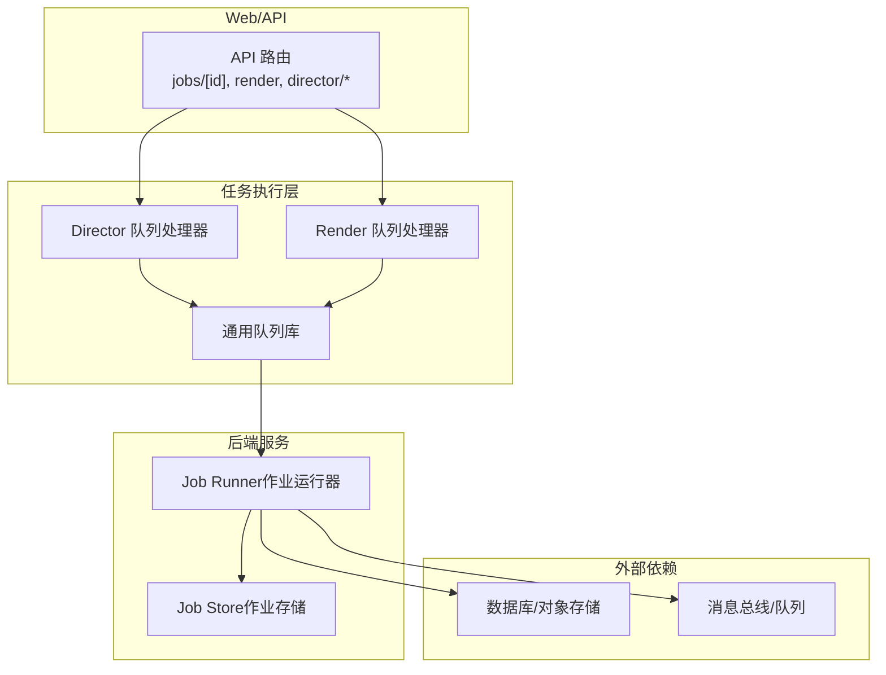
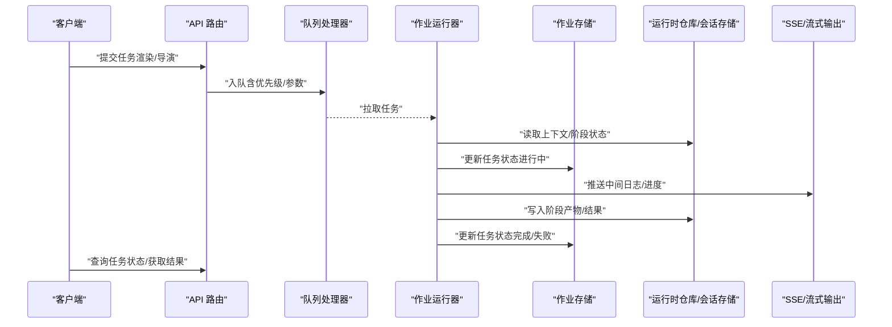
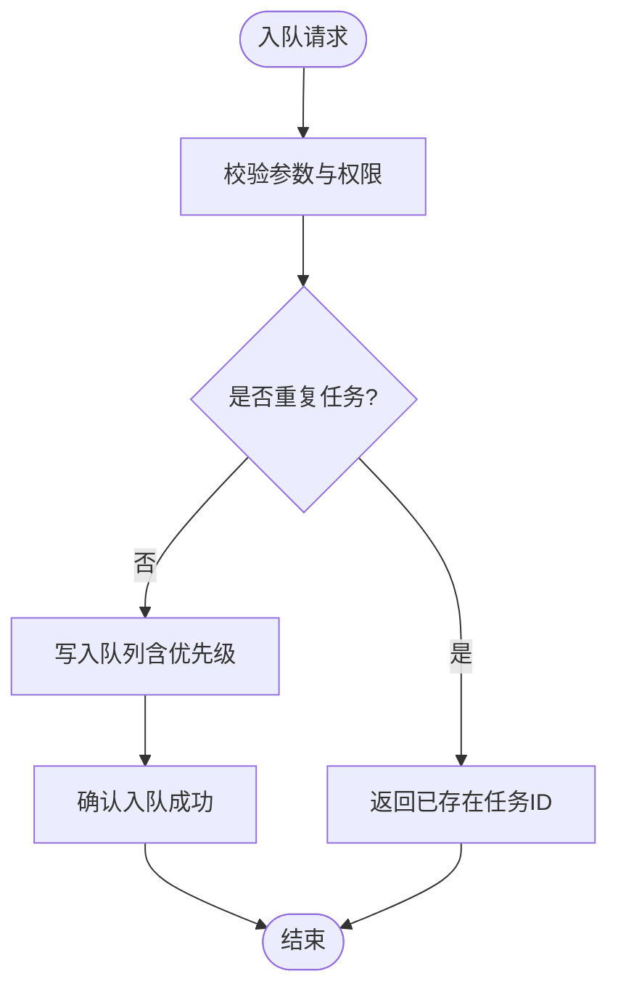
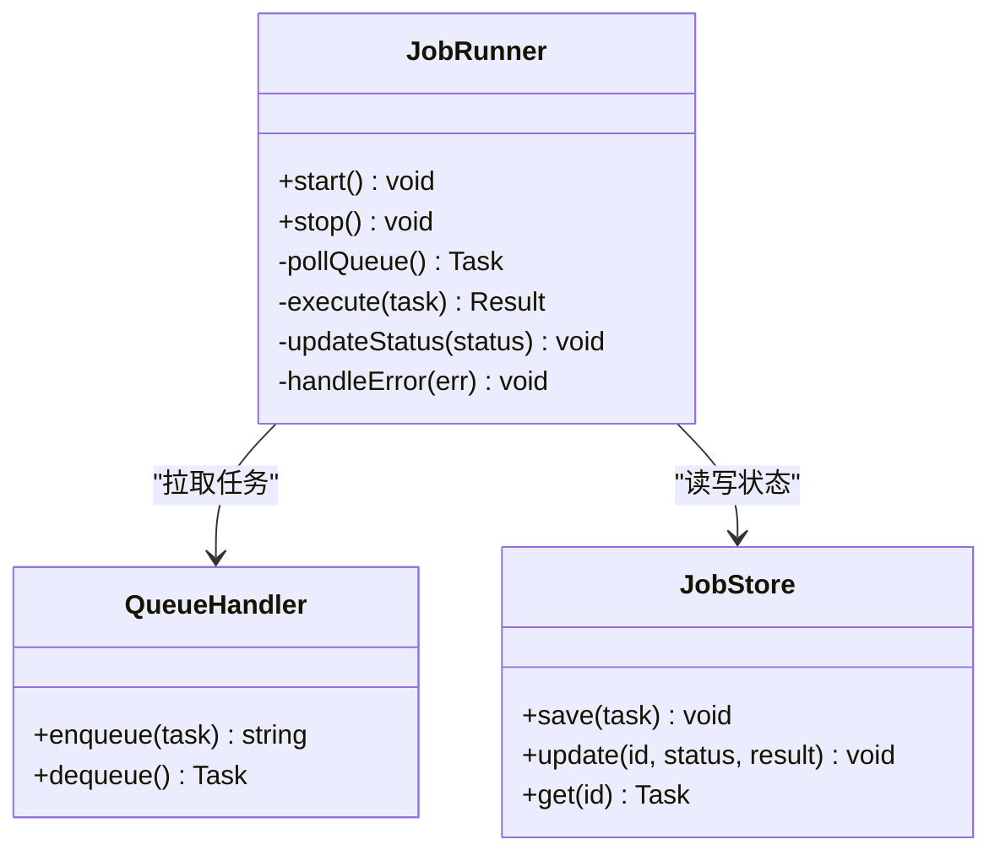
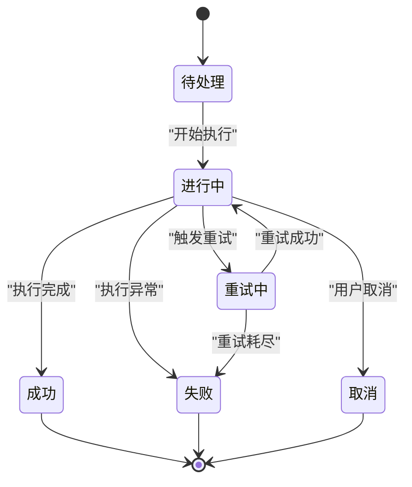
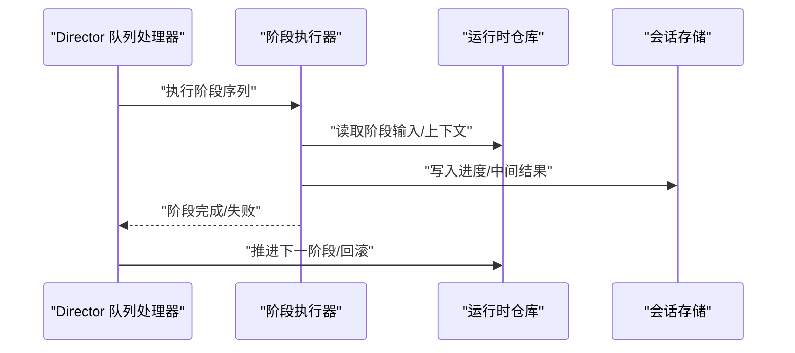
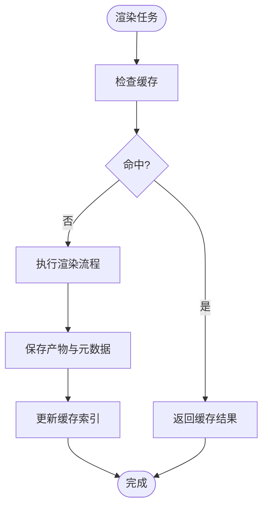
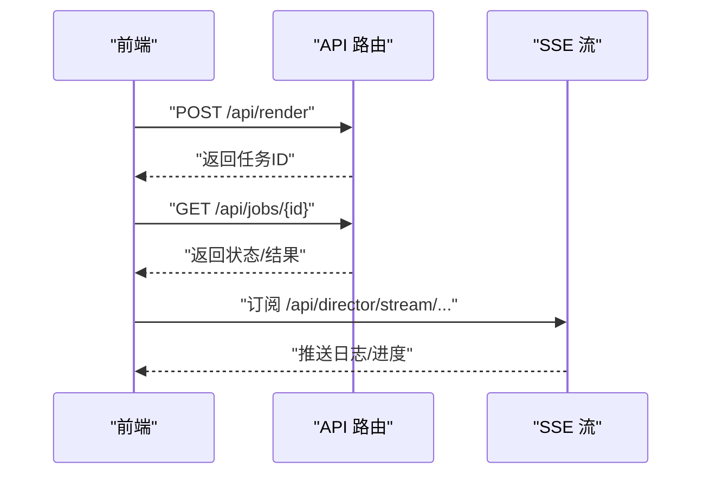
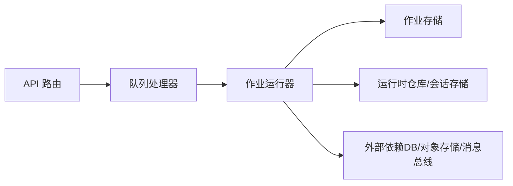

# 任务执行框架

<cite>
**本文引用的文件**   
- [server/src/index.ts](file://server/src/index.ts)
- [server/src/server/job-runner.ts](file://server/src/server/job-runner.ts)
- [server/src/server/job-store.ts](file://server/src/server/job-store.ts)
- [src/features/director/queue-handler.ts](file://src/features/director/queue-handler.ts)
- [src/features/render/queue-handler.ts](file://src/features/render/queue-handler.ts)
- [src/lib/queue/index.ts](file://src/lib/queue/index.ts)
- [src/app/api/jobs/[id]/route.ts](file://src/app/api/jobs/[id]/route.ts)
- [src/app/api/render/route.ts](file://src/app/api/render/route.ts)
- [src/app/api/director/pipeline/route.ts](file://src/app/api/director/pipeline/route.ts)
- [src/app/api/director/stage/route.ts](file://src/app/api/director/stage/route.ts)
- [src/app/api/director/stream/[nodeId]/route.ts](file://src/app/api/director/stream/[nodeId]/route.ts)
- [src/app/api/director/stream/project/[projectId]/route.ts](file://src/app/api/director/stream/project/[projectId]/route.ts)
- [src/app/api/render/export/route.ts](file://src/app/api/render/export/route.ts)
- [src/app/api/render/thumbnails/route.ts](file://src/app/api/render/thumbnails/route.ts)
- [src/app/api/ping/route.ts](file://src/app/api/ping/route.ts)
- [src/features/director/runtime-repository.ts](file://src/features/director/runtime-repository.ts)
- [src/features/director/session-store.ts](file://src/features/director/session-store.ts)
- [src/features/director/stage-runner.ts](file://src/features/director/stage-runner.ts)
- [src/features/director/advance.ts](file://src/features/director/advance.ts)
- [src/features/director/pi-output.ts](file://src/features/director/pi-output.ts)
- [src/features/director/pi-stream-bridge.ts](file://src/features/director/pi-stream-bridge.ts)
- [src/features/render/renderer.ts](file://src/features/render/renderer.ts)
- [src/features/render/cache.ts](file://src/features/render/cache.ts)
- [src/features/render/admission.ts](file://src/features/render/admission.ts)
- [src/features/render/repository.ts](file://src/features/render/repository.ts)
- [deploy/compose.yaml](file://deploy/compose.yaml)
- [deploy/env.example](file://deploy/env.example)
- [deploy/worker.env.example](file://deploy/worker.env.example)
</cite>

## 目录
1. [简介](#简介)
2. [项目结构](#项目结构)
3. [核心组件](#核心组件)
4. [架构总览](#架构总览)
5. [详细组件分析](#详细组件分析)
6. [依赖关系分析](#依赖关系分析)
7. [性能考量](#性能考量)
8. [故障排查指南](#故障排查指南)
9. [结论](#结论)
10. [附录](#附录)

## 简介
本文件为 PurpleInk 平台的“任务执行框架”提供系统化、可落地的技术文档。内容覆盖通用任务执行架构（生命周期管理、工作池调度与资源分配）、任务队列实现（优先级排序与并发控制）、任务状态机与事件驱动架构（消息传递机制）、监控与健康检查、指标采集，以及任务注册、插件扩展点与自定义处理器开发指南。同时涵盖分布式任务处理、负载均衡与故障转移策略的设计与实践建议。

## 项目结构
PurpleInk 的任务执行相关代码主要分布在以下位置：
- server 子工程：负责后台作业运行器与持久化存储抽象
- src/features/director：导演编排、阶段执行、运行时仓库与会话存储
- src/features/render：渲染管线、缓存、准入控制与仓库
- src/lib/queue：通用队列基础设施
- src/app/api：HTTP API 路由，用于提交任务、查询状态、流式输出等
- deploy：容器编排与环境变量示例

图表来源
- [src/app/api/jobs/[id]/route.ts](file://src/app/api/jobs/[id]/route.ts)
- [src/app/api/render/route.ts](file://src/app/api/render/route.ts)
- [src/app/api/director/pipeline/route.ts](file://src/app/api/director/pipeline/route.ts)
- [src/app/api/director/stage/route.ts](file://src/app/api/director/stage/route.ts)
- [src/app/api/director/stream/[nodeId]/route.ts](file://src/app/api/director/stream/[nodeId]/route.ts)
- [src/app/api/director/stream/project/[projectId]/route.ts](file://src/app/api/director/stream/project/[projectId]/route.ts)
- [src/app/api/render/export/route.ts](file://src/app/api/render/export/route.ts)
- [src/app/api/render/thumbnails/route.ts](file://src/app/api/render/thumbnails/route.ts)
- [src/features/director/queue-handler.ts](file://src/features/director/queue-handler.ts)
- [src/features/render/queue-handler.ts](file://src/features/render/queue-handler.ts)
- [src/lib/queue/index.ts](file://src/lib/queue/index.ts)
- [server/src/server/job-runner.ts](file://server/src/server/job-runner.ts)
- [server/src/server/job-store.ts](file://server/src/server/job-store.ts)

章节来源
- [server/src/index.ts](file://server/src/index.ts)
- [deploy/compose.yaml](file://deploy/compose.yaml)
- [deploy/env.example](file://deploy/env.example)
- [deploy/worker.env.example](file://deploy/worker.env.example)

## 核心组件
- 任务队列处理器（Queue Handler）
  - Director 队列处理器：负责导演编排任务的入队、消费与阶段推进
  - Render 队列处理器：负责渲染任务的入队、消费与结果落盘
- 通用队列库（lib/queue）：提供队列抽象、优先级、并发控制与重试策略
- 作业运行器（Job Runner）：从队列拉取任务、分配工作线程、管理生命周期
- 作业存储（Job Store）：任务元数据、状态与结果的持久化接口
- 运行时仓库与会话存储（Director Runtime Repository & Session Store）：阶段产物、会话上下文与进度
- API 路由：任务提交、状态查询、流式日志与导出入口

章节来源
- [src/features/director/queue-handler.ts](file://src/features/director/queue-handler.ts)
- [src/features/render/queue-handler.ts](file://src/features/render/queue-handler.ts)
- [src/lib/queue/index.ts](file://src/lib/queue/index.ts)
- [server/src/server/job-runner.ts](file://server/src/server/job-runner.ts)
- [server/src/server/job-store.ts](file://server/src/server/job-store.ts)
- [src/features/director/runtime-repository.ts](file://src/features/director/runtime-repository.ts)
- [src/features/director/session-store.ts](file://src/features/director/session-store.ts)

## 架构总览
整体采用“API 入队 → 队列分发 → 运行器消费 → 处理器执行业务逻辑 → 状态回写 → 前端轮询/SSE 推送”的事件驱动架构。Director 与 Render 两条流水线通过统一的队列与运行器解耦，便于水平扩展与独立扩缩容。

图表来源
- [src/app/api/render/route.ts](file://src/app/api/render/route.ts)
- [src/app/api/director/pipeline/route.ts](file://src/app/api/director/pipeline/route.ts)
- [src/features/director/queue-handler.ts](file://src/features/director/queue-handler.ts)
- [src/features/render/queue-handler.ts](file://src/features/render/queue-handler.ts)
- [server/src/server/job-runner.ts](file://server/src/server/job-runner.ts)
- [server/src/server/job-store.ts](file://server/src/server/job-store.ts)
- [src/features/director/runtime-repository.ts](file://src/features/director/runtime-repository.ts)
- [src/features/director/session-store.ts](file://src/features/director/session-store.ts)
- [src/app/api/director/stream/[nodeId]/route.ts](file://src/app/api/director/stream/[nodeId]/route.ts)
- [src/app/api/director/stream/project/[projectId]/route.ts](file://src/app/api/director/stream/project/[projectId]/route.ts)

## 详细组件分析

### 任务队列与优先级排序
- 队列抽象与实现
  - 支持多类型任务（导演/渲染），按业务域隔离队列
  - 优先级字段影响出队顺序，结合权重或时间衰减避免饥饿
  - 支持重试次数上限与退避策略
- 并发控制
  - 每个队列处理器维护最大并发度，防止过载
  - 任务粒度拆分（如分帧渲染）提升吞吐
- 幂等性与去重
  - 基于任务键（如项目+阶段+输入哈希）进行去重
  - 失败重试需保证幂等

图表来源
- [src/lib/queue/index.ts](file://src/lib/queue/index.ts)
- [src/features/director/queue-handler.ts](file://src/features/director/queue-handler.ts)
- [src/features/render/queue-handler.ts](file://src/features/render/queue-handler.ts)

章节来源
- [src/lib/queue/index.ts](file://src/lib/queue/index.ts)
- [src/features/director/queue-handler.ts](file://src/features/director/queue-handler.ts)
- [src/features/render/queue-handler.ts](file://src/features/render/queue-handler.ts)

### 作业运行器与工作池调度
- 拉取策略
  - 定时/长轮询从队列拉取任务，支持批量拉取以提升吞吐
- 工作池
  - 固定大小线程池，按 CPU/IO 特性配置并发度
  - 任务超时与取消，避免僵尸任务
- 生命周期
  - 启动 → 拉取 → 执行 → 结果回写 → 清理资源
  - 异常捕获与错误分类（网络/计算/持久化）

图表来源
- [server/src/server/job-runner.ts](file://server/src/server/job-runner.ts)
- [server/src/server/job-store.ts](file://server/src/server/job-store.ts)

章节来源
- [server/src/server/job-runner.ts](file://server/src/server/job-runner.ts)
- [server/src/server/job-store.ts](file://server/src/server/job-store.ts)

### 任务状态机与事件驱动
- 状态定义
  - 待处理、进行中、成功、失败、重试中、取消
- 事件模型
  - 任务创建、开始、阶段推进、完成、失败、重试
- 消息传递
  - 内部使用队列事件；对外通过 SSE/HTTP 推送进度与日志

图表来源
- [src/features/director/advance.ts](file://src/features/director/advance.ts)
- [src/features/director/pi-output.ts](file://src/features/director/pi-output.ts)
- [src/app/api/jobs/[id]/route.ts](file://src/app/api/jobs/[id]/route.ts)

章节来源
- [src/app/api/jobs/[id]/route.ts](file://src/app/api/jobs/[id]/route.ts)
- [src/features/director/advance.ts](file://src/features/director/advance.ts)
- [src/features/director/pi-output.ts](file://src/features/director/pi-output.ts)

### 导演编排与阶段执行
- 阶段执行器（Stage Runner）
  - 按阶段图拓扑顺序执行，支持并行与条件分支
  - 阶段间数据通过运行时仓库传递
- 推进器（Advance）
  - 根据阶段结果决定下一步动作（继续/回退/重试）
- 会话存储（Session Store）
  - 保存会话上下文、中间产物与进度快照

图表来源
- [src/features/director/stage-runner.ts](file://src/features/director/stage-runner.ts)
- [src/features/director/advance.ts](file://src/features/director/advance.ts)
- [src/features/director/runtime-repository.ts](file://src/features/director/runtime-repository.ts)
- [src/features/director/session-store.ts](file://src/features/director/session-store.ts)

章节来源
- [src/features/director/stage-runner.ts](file://src/features/director/stage-runner.ts)
- [src/features/director/advance.ts](file://src/features/director/advance.ts)
- [src/features/director/runtime-repository.ts](file://src/features/director/runtime-repository.ts)
- [src/features/director/session-store.ts](file://src/features/director/session-store.ts)

### 渲染管线与缓存
- 渲染器（Renderer）
  - 将项目/镜头转换为媒体产物，支持分帧与合并
- 缓存（Cache）
  - 基于输入哈希的缓存命中，减少重复计算
- 准入控制（Admission）
  - 限制并发与资源占用，保障系统稳定性
- 仓库（Repository）
  - 渲染产物与元数据的持久化

图表来源
- [src/features/render/renderer.ts](file://src/features/render/renderer.ts)
- [src/features/render/cache.ts](file://src/features/render/cache.ts)
- [src/features/render/admission.ts](file://src/features/render/admission.ts)
- [src/features/render/repository.ts](file://src/features/render/repository.ts)

章节来源
- [src/features/render/renderer.ts](file://src/features/render/renderer.ts)
- [src/features/render/cache.ts](file://src/features/render/cache.ts)
- [src/features/render/admission.ts](file://src/features/render/admission.ts)
- [src/features/render/repository.ts](file://src/features/render/repository.ts)

### API 与流式输出
- 任务提交与查询
  - /api/render：提交渲染任务
  - /api/jobs/[id]：查询任务状态与结果
- 导演流式输出
  - /api/director/stream/[nodeId]：节点级实时日志
  - /api/director/stream/project/[projectId]：项目级聚合日志
- 健康检查
  - /api/ping：服务存活探针

图表来源
- [src/app/api/render/route.ts](file://src/app/api/render/route.ts)
- [src/app/api/jobs/[id]/route.ts](file://src/app/api/jobs/[id]/route.ts)
- [src/app/api/director/stream/[nodeId]/route.ts](file://src/app/api/director/stream/[nodeId]/route.ts)
- [src/app/api/director/stream/project/[projectId]/route.ts](file://src/app/api/director/stream/project/[projectId]/route.ts)
- [src/app/api/ping/route.ts](file://src/app/api/ping/route.ts)

章节来源
- [src/app/api/render/route.ts](file://src/app/api/render/route.ts)
- [src/app/api/jobs/[id]/route.ts](file://src/app/api/jobs/[id]/route.ts)
- [src/app/api/director/stream/[nodeId]/route.ts](file://src/app/api/director/stream/[nodeId]/route.ts)
- [src/app/api/director/stream/project/[projectId]/route.ts](file://src/app/api/director/stream/project/[projectId]/route.ts)
- [src/app/api/ping/route.ts](file://src/app/api/ping/route.ts)

### 任务注册与插件扩展点
- 任务注册机制
  - 在队列处理器中按任务类型注册处理器函数
  - 支持动态加载与热插拔（进程内）
- 插件扩展点
  - 定义统一接口（输入校验、执行体、结果格式化、错误映射）
  - 通过配置文件或环境变量启用/禁用插件
- 自定义处理器开发指南
  - 实现标准接口并注册到对应队列处理器
  - 遵循幂等性、超时与错误分类规范
  - 编写单元测试与集成测试验证行为

章节来源
- [src/features/director/queue-handler.ts](file://src/features/director/queue-handler.ts)
- [src/features/render/queue-handler.ts](file://src/features/render/queue-handler.ts)

### 分布式任务处理、负载均衡与故障转移
- 分布式部署
  - 使用容器编排（compose）横向扩展 Worker 实例
  - 共享队列与持久化存储，确保任务不丢失
- 负载均衡
  - 队列消费者自动竞争拉取，天然负载均衡
  - 可按 CPU/内存/IO 类型设置不同队列与并发度
- 故障转移
  - 任务超时与心跳检测，失败自动重试
  - 幂等执行保证重复消费安全
  - 健康检查与优雅停机，避免中断正在执行的任务

章节来源
- [deploy/compose.yaml](file://deploy/compose.yaml)
- [deploy/env.example](file://deploy/env.example)
- [deploy/worker.env.example](file://deploy/worker.env.example)

## 依赖关系分析
- 模块耦合
  - API 路由仅依赖队列处理器与作业存储接口，保持低耦合
  - 运行器依赖队列与存储抽象，屏蔽底层实现差异
- 外部依赖
  - 数据库/对象存储用于持久化任务与产物
  - 消息总线/队列用于跨进程/跨实例任务分发
- 潜在循环依赖
  - 通过接口与事件解耦，避免直接循环引用

图表来源
- [src/app/api/render/route.ts](file://src/app/api/render/route.ts)
- [src/app/api/director/pipeline/route.ts](file://src/app/api/director/pipeline/route.ts)
- [src/features/director/queue-handler.ts](file://src/features/director/queue-handler.ts)
- [src/features/render/queue-handler.ts](file://src/features/render/queue-handler.ts)
- [server/src/server/job-runner.ts](file://server/src/server/job-runner.ts)
- [server/src/server/job-store.ts](file://server/src/server/job-store.ts)
- [src/features/director/runtime-repository.ts](file://src/features/director/runtime-repository.ts)
- [src/features/director/session-store.ts](file://src/features/director/session-store.ts)

章节来源
- [src/app/api/render/route.ts](file://src/app/api/render/route.ts)
- [src/app/api/director/pipeline/route.ts](file://src/app/api/director/pipeline/route.ts)
- [src/features/director/queue-handler.ts](file://src/features/director/queue-handler.ts)
- [src/features/render/queue-handler.ts](file://src/features/render/queue-handler.ts)
- [server/src/server/job-runner.ts](file://server/src/server/job-runner.ts)
- [server/src/server/job-store.ts](file://server/src/server/job-store.ts)
- [src/features/director/runtime-repository.ts](file://src/features/director/runtime-repository.ts)
- [src/features/director/session-store.ts](file://src/features/director/session-store.ts)

## 性能考量
- 队列与并发
  - 合理设置队列并发度与批大小，平衡延迟与吞吐
  - 热点任务拆分与并行执行，避免单任务阻塞
- 缓存与去重
  - 基于输入哈希的缓存命中显著降低重复计算
  - 任务去重减少冗余负载
- I/O 与存储
  - 异步 I/O 与缓冲写入，减少磁盘抖动
  - 大对象走对象存储，元数据落库
- 资源隔离
  - 不同任务类型使用独立工作池，避免相互干扰
- 监控与指标
  - 收集队列长度、任务耗时、失败率、重试次数等关键指标
  - 暴露健康检查端点供编排平台探测

[本节为通用指导，无需特定文件来源]

## 故障排查指南
- 常见问题定位
  - 任务堆积：检查队列消费者数量与并发度
  - 任务失败：查看错误分类与重试策略，定位具体阶段
  - 状态不一致：核对幂等性与事务边界
- 诊断工具
  - 健康检查端点：/api/ping
  - 任务查询：/api/jobs/{id}
  - 流式日志：/api/director/stream/...
- 恢复策略
  - 重启消费者实例，利用幂等性保证一致性
  - 对失败任务进行人工干预后重新入队

章节来源
- [src/app/api/ping/route.ts](file://src/app/api/ping/route.ts)
- [src/app/api/jobs/[id]/route.ts](file://src/app/api/jobs/[id]/route.ts)
- [src/app/api/director/stream/[nodeId]/route.ts](file://src/app/api/director/stream/[nodeId]/route.ts)
- [src/app/api/director/stream/project/[projectId]/route.ts](file://src/app/api/director/stream/project/[projectId]/route.ts)

## 结论
PurpleInk 的任务执行框架以“队列 + 运行器 + 处理器”为核心，结合状态机与事件驱动，实现了高内聚、低耦合的可扩展架构。通过缓存、准入控制与并发治理，系统在吞吐与稳定性之间取得平衡。面向分布式场景，借助容器编排与幂等设计，可实现弹性伸缩与故障自愈。建议在后续迭代中完善指标采集与告警体系，进一步提升可观测性与运维效率。

[本节为总结性内容，无需特定文件来源]

## 附录
- 环境配置
  - 参考 deploy/env.example 与 deploy/worker.env.example 配置队列、存储与外部服务连接
- 部署说明
  - 使用 deploy/compose.yaml 快速拉起 Web、Worker 与依赖服务
- 扩展开发
  - 在对应队列处理器中注册新任务类型，遵循统一接口与测试规范

章节来源
- [deploy/env.example](file://deploy/env.example)
- [deploy/worker.env.example](file://deploy/worker.env.example)
- [deploy/compose.yaml](file://deploy/compose.yaml)