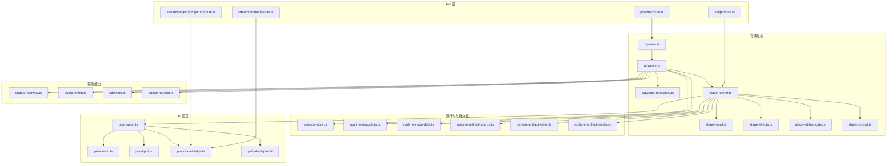
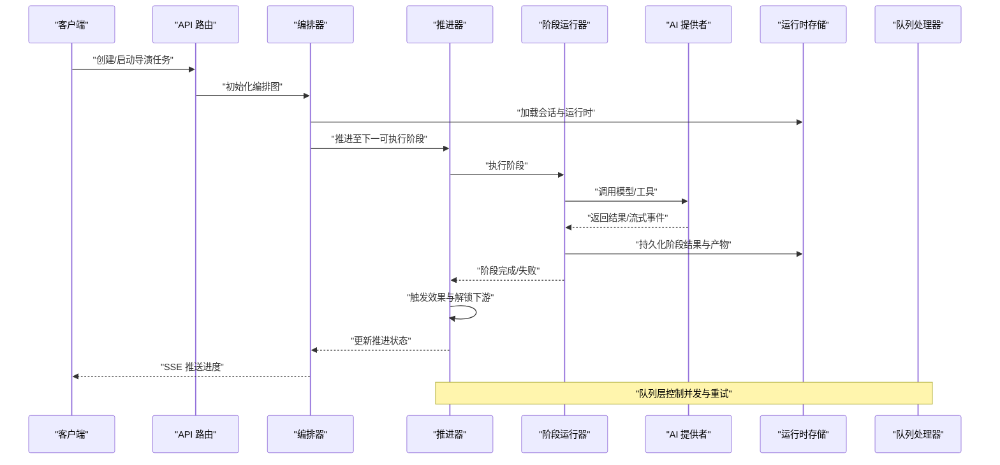
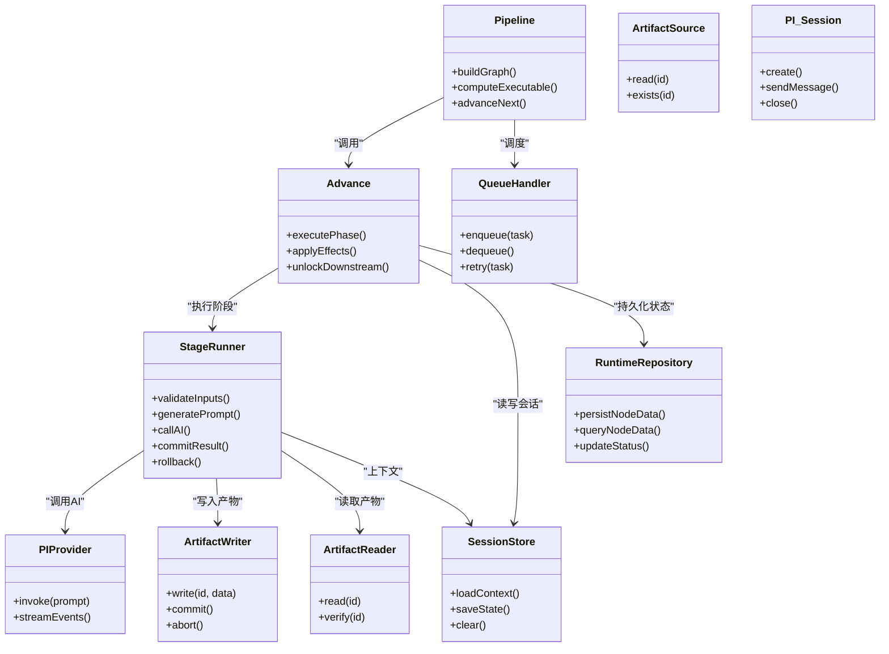

# 导演任务处理器

<cite>
**本文引用的文件**   
- [src/features/director/index.ts](file://src/features/director/index.ts)
- [src/features/director/pipeline.ts](file://src/features/director/pipeline.ts)
- [src/features/director/advance.ts](file://src/features/director/advance.ts)
- [src/features/director/advance-repository.ts](file://src/features/director/advance-repository.ts)
- [src/features/director/runtime-repository.ts](file://src/features/director/runtime-repository.ts)
- [src/features/director/session-store.ts](file://src/features/director/session-store.ts)
- [src/features/director/stage-runner.ts](file://src/features/director/stage-runner.ts)
- [src/features/director/stage-result.ts](file://src/features/director/stage-result.ts)
- [src/features/director/stage-effects.ts](file://src/features/director/stage-effects.ts)
- [src/features/director/stage-artifact-gate.ts](file://src/features/director/stage-artifact-gate.ts)
- [src/features/director/stage-prompt.ts](file://src/features/director/stage-prompt.ts)
- [src/features/director/pi-provider.ts](file://src/features/director/pi-provider.ts)
- [src/features/director/pi-session.ts](file://src/features/director/pi-session.ts)
- [src/features/director/pi-output.ts](file://src/features/director/pi-output.ts)
- [src/features/director/pi-stream-bridge.ts](file://src/features/director/pi-stream-bridge.ts)
- [src/features/director/pi-tool-adapter.ts](file://src/features/director/pi-tool-adapter.ts)
- [src/features/director/runtime-artifact-source.ts](file://src/features/director/runtime-artifact-source.ts)
- [src/features/director/runtime-artifact-writer.ts](file://src/features/director/runtime-artifact-writer.ts)
- [src/features/director/runtime-artifact-reader.ts](file://src/features/director/runtime-artifact-reader.ts)
- [src/features/director/runtime-node-data.ts](file://src/features/director/runtime-node-data.ts)
- [src/features/director/output-recovery.ts](file://src/features/director/output-recovery.ts)
- [src/features/director/audio-timing.ts](file://src/features/director/audio-timing.ts)
- [src/features/director/fabricate.ts](file://src/features/director/fabricate.ts)
- [src/features/director/queue-handler.ts](file://src/features/director/queue-handler.ts)
- [src/app/api/director/pipeline/route.ts](file://src/app/api/director/pipeline/route.ts)
- [src/app/api/director/stage/route.ts](file://src/app/api/director/stage/route.ts)
- [src/app/api/director/stream/[nodeId]/route.ts](file://src/app/api/director/stream/[nodeId]/route.ts)
- [src/app/api/director/stream/project/[projectId]/route.ts](file://src/app/api/director/stream/project/[projectId]/route.ts)
</cite>

## 目录
1. [简介](#简介)
2. [项目结构](#项目结构)
3. [核心组件](#核心组件)
4. [架构总览](#架构总览)
5. [详细组件分析](#详细组件分析)
6. [依赖关系分析](#依赖关系分析)
7. [性能考量](#性能考量)
8. [故障排查指南](#故障排查指南)
9. [结论](#结论)
10. [附录](#附录)

## 简介
本文件面向 PurpleInk 平台的“导演任务处理器”，系统性阐述导演任务的执行流程、工作流编排、阶段管理与状态持久化；并覆盖任务调度策略、依赖解析与执行顺序控制、错误处理与重试、故障恢复、监控日志与指标采集、配置参数验证与资源管理，以及并发控制、资源隔离与优先级管理。文档以代码级为依据，辅以架构图与时序图，帮助读者从整体到细节全面理解系统。

## 项目结构
导演能力集中在 src/features/director 模块中，并通过 API 路由暴露给前端或外部调用方：
- 编排与推进：pipeline.ts、advance.ts、advance-repository.ts
- 阶段执行：stage-runner.ts、stage-result.ts、stage-effects.ts、stage-artifact-gate.ts、stage-prompt.ts
- 会话与运行时：session-store.ts、runtime-repository.ts、runtime-node-data.ts
- 产物读写：runtime-artifact-source.ts、runtime-artifact-writer.ts、runtime-artifact-reader.ts
- AI 交互：pi-provider.ts、pi-session.ts、pi-output.ts、pi-stream-bridge.ts、pi-tool-adapter.ts
- 辅助能力：output-recovery.ts、audio-timing.ts、fabricate.ts
- 队列与调度：queue-handler.ts
- API 入口：src/app/api/director/*

图表来源
- [src/app/api/director/pipeline/route.ts](file://src/app/api/director/pipeline/route.ts)
- [src/app/api/director/stage/route.ts](file://src/app/api/director/stage/route.ts)
- [src/app/api/director/stream/[nodeId]/route.ts](file://src/app/api/director/stream/[nodeId]/route.ts)
- [src/app/api/director/stream/project/[projectId]/route.ts](file://src/app/api/director/stream/project/[projectId]/route.ts)
- [src/features/director/pipeline.ts](file://src/features/director/pipeline.ts)
- [src/features/director/advance.ts](file://src/features/director/advance.ts)
- [src/features/director/advance-repository.ts](file://src/features/director/advance-repository.ts)
- [src/features/director/stage-runner.ts](file://src/features/director/stage-runner.ts)
- [src/features/director/stage-result.ts](file://src/features/director/stage-result.ts)
- [src/features/director/stage-effects.ts](file://src/features/director/stage-effects.ts)
- [src/features/director/stage-artifact-gate.ts](file://src/features/director/stage-artifact-gate.ts)
- [src/features/director/stage-prompt.ts](file://src/features/director/stage-prompt.ts)
- [src/features/director/session-store.ts](file://src/features/director/session-store.ts)
- [src/features/director/runtime-repository.ts](file://src/features/director/runtime-repository.ts)
- [src/features/director/runtime-node-data.ts](file://src/features/director/runtime-node-data.ts)
- [src/features/director/runtime-artifact-source.ts](file://src/features/director/runtime-artifact-source.ts)
- [src/features/director/runtime-artifact-writer.ts](file://src/features/director/runtime-artifact-writer.ts)
- [src/features/director/runtime-artifact-reader.ts](file://src/features/director/runtime-artifact-reader.ts)
- [src/features/director/pi-provider.ts](file://src/features/director/pi-provider.ts)
- [src/features/director/pi-session.ts](file://src/features/director/pi-session.ts)
- [src/features/director/pi-output.ts](file://src/features/director/pi-output.ts)
- [src/features/director/pi-stream-bridge.ts](file://src/features/director/pi-stream-bridge.ts)
- [src/features/director/pi-tool-adapter.ts](file://src/features/director/pi-tool-adapter.ts)
- [src/features/director/output-recovery.ts](file://src/features/director/output-recovery.ts)
- [src/features/director/audio-timing.ts](file://src/features/director/audio-timing.ts)
- [src/features/director/fabricate.ts](file://src/features/director/fabricate.ts)
- [src/features/director/queue-handler.ts](file://src/features/director/queue-handler.ts)

章节来源
- [src/features/director/index.ts](file://src/features/director/index.ts)
- [src/app/api/director/pipeline/route.ts](file://src/app/api/director/pipeline/route.ts)
- [src/app/api/director/stage/route.ts](file://src/app/api/director/stage/route.ts)
- [src/app/api/director/stream/[nodeId]/route.ts](file://src/app/api/director/stream/[nodeId]/route.ts)
- [src/app/api/director/stream/project/[projectId]/route.ts](file://src/app/api/director/stream/project/[projectId]/route.ts)

## 核心组件
- 编排器（Pipeline）：负责构建任务图、解析依赖、确定执行顺序、协调阶段推进与状态同步。
- 推进器（Advance）：驱动工作流从当前节点向前推进，处理阶段完成后的副作用、产物落盘与下游解锁。
- 阶段运行器（Stage Runner）：封装单阶段生命周期，包括前置校验、提示词生成、AI 调用、结果提交与回滚。
- 会话与运行时存储（Session Store / Runtime Repository）：维护会话上下文、运行时数据与中间产物，保证幂等与可恢复。
- 产物源/写者/读取器（Artifact Source/Writer/Reader）：抽象产物存取接口，支持本地/远端存储与一致性保障。
- AI 提供者与会话（PI Provider/Session）：统一对外部大模型服务的访问、流式输出与工具适配。
- 效果与门控（Effects/Gate）：阶段完成后触发副作用（如更新下游依赖），在阶段开始前进行产物就绪检查。
- 队列与调度（Queue Handler）：任务入队、出队、并发限制、优先级与重试策略。
- 辅助能力：输出恢复、音频时序对齐、素材合成等。

章节来源
- [src/features/director/pipeline.ts](file://src/features/director/pipeline.ts)
- [src/features/director/advance.ts](file://src/features/director/advance.ts)
- [src/features/director/stage-runner.ts](file://src/features/director/stage-runner.ts)
- [src/features/director/session-store.ts](file://src/features/director/session-store.ts)
- [src/features/director/runtime-repository.ts](file://src/features/director/runtime-repository.ts)
- [src/features/director/runtime-artifact-source.ts](file://src/features/director/runtime-artifact-source.ts)
- [src/features/director/runtime-artifact-writer.ts](file://src/features/director/runtime-artifact-writer.ts)
- [src/features/director/runtime-artifact-reader.ts](file://src/features/director/runtime-artifact-reader.ts)
- [src/features/director/pi-provider.ts](file://src/features/director/pi-provider.ts)
- [src/features/director/pi-session.ts](file://src/features/director/pi-session.ts)
- [src/features/director/stage-effects.ts](file://src/features/director/stage-effects.ts)
- [src/features/director/stage-artifact-gate.ts](file://src/features/director/stage-artifact-gate.ts)
- [src/features/director/queue-handler.ts](file://src/features/director/queue-handler.ts)
- [src/features/director/output-recovery.ts](file://src/features/director/output-recovery.ts)
- [src/features/director/audio-timing.ts](file://src/features/director/audio-timing.ts)
- [src/features/director/fabricate.ts](file://src/features/director/fabricate.ts)

## 架构总览
导演任务处理器采用“编排-推进-执行”的分层架构：
- API 层接收请求，创建或查询任务，建立 SSE 流用于实时进度。
- 编排层根据任务定义构建 DAG，计算可执行集合，按依赖顺序推进。
- 执行层对每个阶段进行输入校验、提示词组装、AI 调用、结果写入与副作用触发。
- 持久化层通过会话与运行时仓库确保状态可恢复、产物可回溯。
- 队列层提供并发控制、优先级与重试机制，保障吞吐与稳定性。

图表来源
- [src/app/api/director/pipeline/route.ts](file://src/app/api/director/pipeline/route.ts)
- [src/app/api/director/stage/route.ts](file://src/app/api/director/stage/route.ts)
- [src/app/api/director/stream/[nodeId]/route.ts](file://src/app/api/director/stream/[nodeId]/route.ts)
- [src/app/api/director/stream/project/[projectId]/route.ts](file://src/app/api/director/stream/project/[projectId]/route.ts)
- [src/features/director/pipeline.ts](file://src/features/director/pipeline.ts)
- [src/features/director/advance.ts](file://src/features/director/advance.ts)
- [src/features/director/stage-runner.ts](file://src/features/director/stage-runner.ts)
- [src/features/director/pi-provider.ts](file://src/features/director/pi-provider.ts)
- [src/features/director/runtime-repository.ts](file://src/features/director/runtime-repository.ts)
- [src/features/director/queue-handler.ts](file://src/features/director/queue-handler.ts)

## 详细组件分析

### 编排器（Pipeline）
- 职责：解析任务定义、构建依赖图、计算初始可执行阶段、维护全局状态机。
- 关键点：
  - 依赖解析：基于节点边关系构建拓扑，识别无环约束。
  - 执行顺序：按拓扑排序与优先级决定阶段执行序列。
  - 状态同步：将推进决策写入运行时存储，供其他组件消费。
- 优化点：增量计算可执行集合，避免全量重算；缓存已解析的依赖子图。

章节来源
- [src/features/director/pipeline.ts](file://src/features/director/pipeline.ts)
- [src/features/director/advance-repository.ts](file://src/features/director/advance-repository.ts)

### 推进器（Advance）
- 职责：驱动工作流从当前状态推进到下一状态，处理阶段完成后的副作用与下游解锁。
- 关键点：
  - 阶段完成判定：依据阶段结果与产物门控决定是否继续。
  - 副作用触发：更新下游依赖状态、清理临时资源。
  - 异常分支：失败时进入恢复路径，记录错误并尝试重试。
- 优化点：批量副作用合并，减少 IO 次数；幂等推进避免重复执行。

章节来源
- [src/features/director/advance.ts](file://src/features/director/advance.ts)
- [src/features/director/stage-effects.ts](file://src/features/director/stage-effects.ts)
- [src/features/director/stage-artifact-gate.ts](file://src/features/director/stage-artifact-gate.ts)

### 阶段运行器（Stage Runner）
- 职责：封装单阶段的完整生命周期，包括前置校验、提示词生成、AI 调用、结果提交与回滚。
- 关键点：
  - 前置校验：检查输入产物是否就绪、参数合法性。
  - 提示词组装：结合上下文与模板生成结构化提示。
  - AI 调用：通过 PI 提供者发起请求，支持流式输出。
  - 结果提交：写入运行时存储，触发下游解锁。
  - 回滚机制：失败时撤销部分副作用，保持状态一致。
- 优化点：并行调用多个工具；超时与熔断保护；结果校验与降级。

章节来源
- [src/features/director/stage-runner.ts](file://src/features/director/stage-runner.ts)
- [src/features/director/stage-prompt.ts](file://src/features/director/stage-prompt.ts)
- [src/features/director/pi-provider.ts](file://src/features/director/pi-provider.ts)
- [src/features/director/pi-session.ts](file://src/features/director/pi-session.ts)
- [src/features/director/pi-output.ts](file://src/features/director/pi-output.ts)
- [src/features/director/pi-stream-bridge.ts](file://src/features/director/pi-stream-bridge.ts)
- [src/features/director/pi-tool-adapter.ts](file://src/features/director/pi-tool-adapter.ts)

### 会话与运行时存储（Session Store / Runtime Repository）
- 职责：维护会话上下文、运行时数据、阶段状态与产物元信息。
- 关键点：
  - 会话隔离：按任务/项目维度隔离上下文。
  - 状态持久化：阶段开始、进行中、完成、失败等状态变更持久化。
  - 产物元数据：记录产物位置、大小、哈希、版本等。
- 优化点：事务性写入；增量更新；缓存热点数据。

章节来源
- [src/features/director/session-store.ts](file://src/features/director/session-store.ts)
- [src/features/director/runtime-repository.ts](file://src/features/director/runtime-repository.ts)
- [src/features/director/runtime-node-data.ts](file://src/features/director/runtime-node-data.ts)

### 产物源/写者/读取器（Artifact Source/Writer/Reader）
- 职责：抽象产物存取接口，支持多后端与一致性保障。
- 关键点：
  - 源：按路径/标识读取产物，支持断点续传。
  - 写：原子写入与校验，失败自动重试。
  - 读：校验完整性，必要时触发恢复。
- 优化点：分块传输；压缩与去重；缓存热产物。

章节来源
- [src/features/director/runtime-artifact-source.ts](file://src/features/director/runtime-artifact-source.ts)
- [src/features/director/runtime-artifact-writer.ts](file://src/features/director/runtime-artifact-writer.ts)
- [src/features/director/runtime-artifact-reader.ts](file://src/features/director/runtime-artifact-reader.ts)

### 队列与调度（Queue Handler）
- 职责：任务入队、出队、并发限制、优先级与重试策略。
- 关键点：
  - 并发控制：按资源类型划分队列，限制同时执行数。
  - 优先级：高优先级任务优先调度，支持抢占与公平队列。
  - 重试：指数退避与最大重试次数，失败进入死信队列。
- 优化点：背压与限流；动态扩缩容；监控告警。

章节来源
- [src/features/director/queue-handler.ts](file://src/features/director/queue-handler.ts)

### 辅助能力（Output Recovery / Audio Timing / Fabricate）
- 输出恢复：从部分产物重建完整输出，支持断点续跑。
- 音频时序：对齐音频与画面时间轴，保证音画同步。
- 素材合成：合并多路素材，生成最终产物。

章节来源
- [src/features/director/output-recovery.ts](file://src/features/director/output-recovery.ts)
- [src/features/director/audio-timing.ts](file://src/features/director/audio-timing.ts)
- [src/features/director/fabricate.ts](file://src/features/director/fabricate.ts)

### API 路由（Pipeline/Stage/Stream）
- 职责：暴露 REST/SSE 接口，创建任务、查询阶段、推送实时流。
- 关键点：
  - Pipeline 路由：创建/启动/暂停/恢复任务。
  - Stage 路由：触发特定阶段执行或重试。
  - Stream 路由：SSE 推送阶段进度、日志与产物状态。
- 优化点：分页与过滤；鉴权与限流；错误码标准化。

章节来源
- [src/app/api/director/pipeline/route.ts](file://src/app/api/director/pipeline/route.ts)
- [src/app/api/director/stage/route.ts](file://src/app/api/director/stage/route.ts)
- [src/app/api/director/stream/[nodeId]/route.ts](file://src/app/api/director/stream/[nodeId]/route.ts)
- [src/app/api/director/stream/project/[projectId]/route.ts](file://src/app/api/director/stream/project/[projectId]/route.ts)

## 依赖关系分析
导演任务处理器内部模块耦合清晰，遵循分层与单一职责原则：
- API 层仅依赖编排与阶段执行接口，不关心实现细节。
- 编排与推进依赖运行时存储与队列，解耦于具体持久化与调度实现。
- 阶段运行器依赖 AI 提供者与会话，屏蔽外部服务差异。
- 产物存取通过抽象接口，便于替换后端。

图表来源
- [src/features/director/pipeline.ts](file://src/features/director/pipeline.ts)
- [src/features/director/advance.ts](file://src/features/director/advance.ts)
- [src/features/director/stage-runner.ts](file://src/features/director/stage-runner.ts)
- [src/features/director/session-store.ts](file://src/features/director/session-store.ts)
- [src/features/director/runtime-repository.ts](file://src/features/director/runtime-repository.ts)
- [src/features/director/runtime-artifact-source.ts](file://src/features/director/runtime-artifact-source.ts)
- [src/features/director/runtime-artifact-writer.ts](file://src/features/director/runtime-artifact-writer.ts)
- [src/features/director/runtime-artifact-reader.ts](file://src/features/director/runtime-artifact-reader.ts)
- [src/features/director/pi-provider.ts](file://src/features/director/pi-provider.ts)
- [src/features/director/pi-session.ts](file://src/features/director/pi-session.ts)
- [src/features/director/queue-handler.ts](file://src/features/director/queue-handler.ts)

章节来源
- [src/features/director/pipeline.ts](file://src/features/director/pipeline.ts)
- [src/features/director/advance.ts](file://src/features/director/advance.ts)
- [src/features/director/stage-runner.ts](file://src/features/director/stage-runner.ts)
- [src/features/director/runtime-repository.ts](file://src/features/director/runtime-repository.ts)
- [src/features/director/queue-handler.ts](file://src/features/director/queue-handler.ts)

## 性能考量
- 依赖计算优化：增量更新可执行集合，避免全量拓扑重算。
- 并行执行：独立阶段并行执行，受队列并发限制保护。
- 产物缓存：相同输入命中缓存，减少重复计算与 IO。
- 流式处理：AI 输出与日志通过流式传输，降低内存占用。
- 背压与限流：队列层防止过载，保护下游服务。
- 资源隔离：按任务/项目隔离会话与产物空间，避免干扰。

[本节为通用指导，无需引用具体文件]

## 故障排查指南
- 阶段失败：检查阶段前置条件、产物门控与 AI 调用日志；查看错误码与堆栈。
- 推进卡住：确认依赖是否满足、是否有未解锁的下游；检查推进器副作用是否成功。
- 产物不一致：校验产物哈希与版本；必要时触发输出恢复。
- 队列积压：监控队列长度与消费者健康；调整并发与优先级。
- 会话丢失：检查会话存储可用性；必要时从运行时仓库恢复。

章节来源
- [src/features/director/stage-runner.ts](file://src/features/director/stage-runner.ts)
- [src/features/director/advance.ts](file://src/features/director/advance.ts)
- [src/features/director/output-recovery.ts](file://src/features/director/output-recovery.ts)
- [src/features/director/queue-handler.ts](file://src/features/director/queue-handler.ts)
- [src/features/director/session-store.ts](file://src/features/director/session-store.ts)

## 结论
导演任务处理器通过清晰的编排-推进-执行分层，实现了复杂工作流的可靠执行。依赖解析、阶段管理、状态持久化与队列调度共同保障了系统的可扩展性与稳定性。配合流式输出、产物缓存与资源隔离，可在高并发场景下保持良好性能。建议持续完善监控与告警，强化错误恢复与回滚机制，进一步提升鲁棒性。

[本节为总结，无需引用具体文件]

## 附录
- 配置选项：任务并发度、重试次数、超时时间、产物存储后端、AI 服务密钥等。
- 参数验证：阶段输入类型、必填字段、范围校验。
- 资源管理：CPU/内存配额、磁盘空间、网络带宽限制。
- 监控指标：阶段耗时、成功率、队列长度、产物大小、AI 调用延迟。

[本节为补充说明，无需引用具体文件]