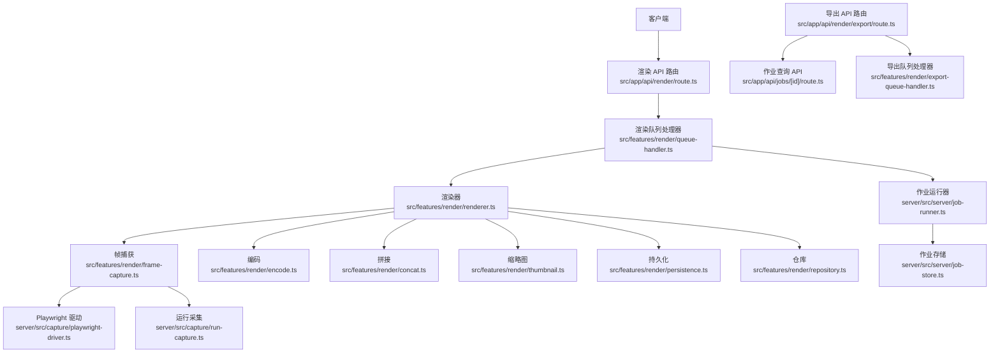
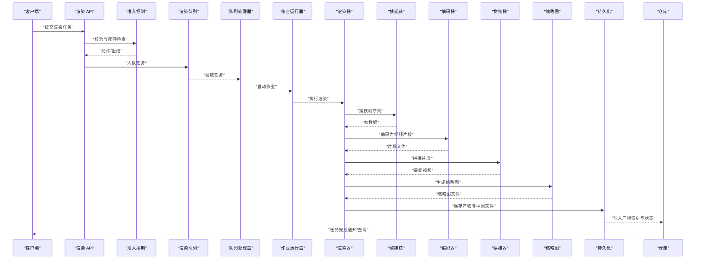
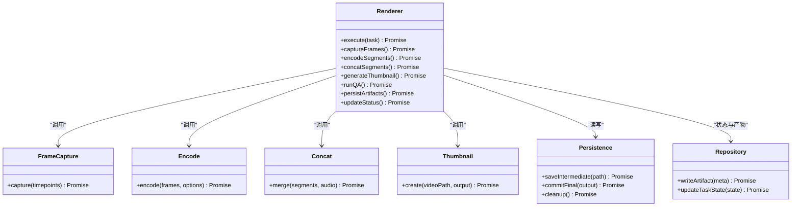
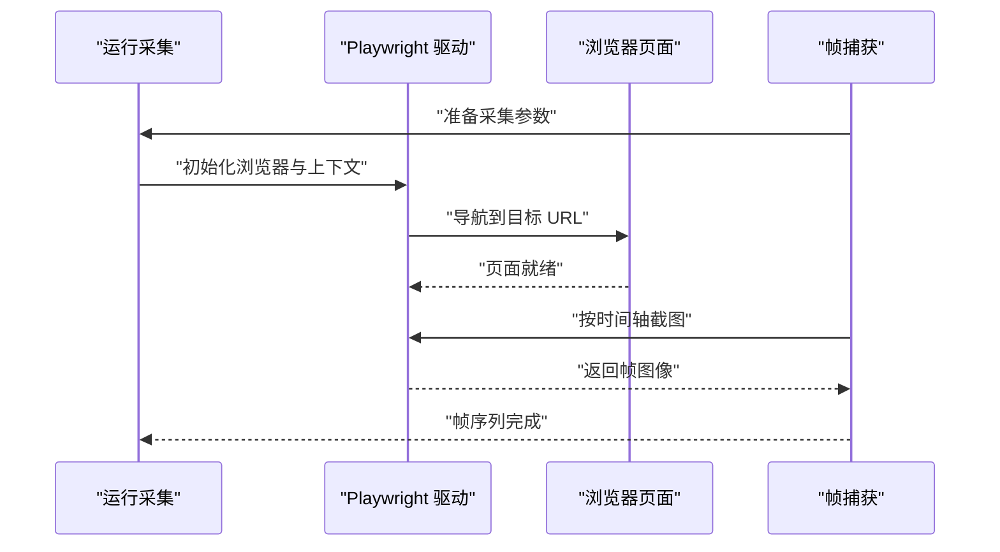
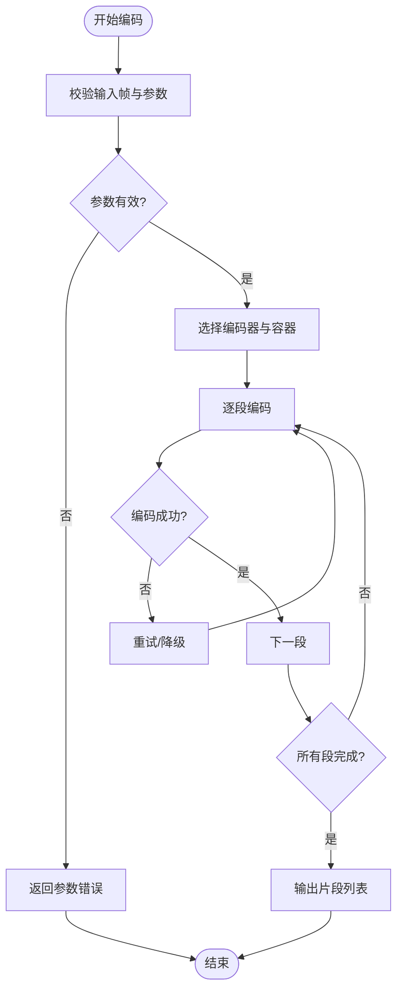
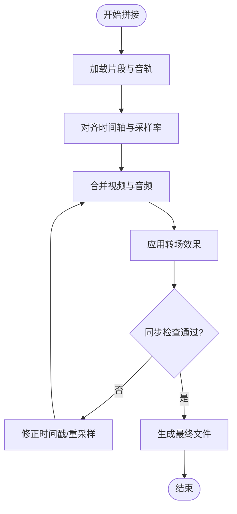
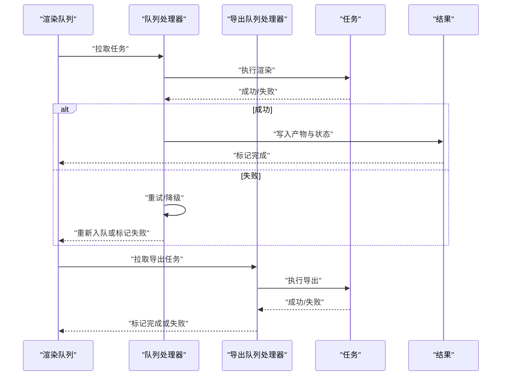
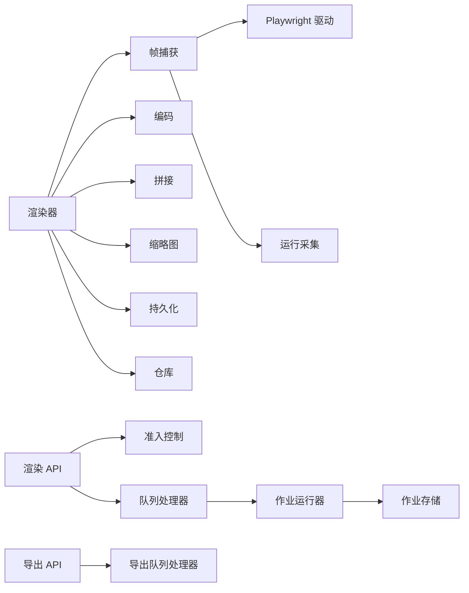

# 渲染任务处理器

<cite>
**本文引用的文件**   
- [server/src/capture/playwright-driver.ts](file://server/src/capture/playwright-driver.ts)
- [server/src/capture/run-capture.ts](file://server/src/capture/run-capture.ts)
- [src/features/render/renderer.ts](file://src/features/render/renderer.ts)
- [src/features/render/queue-handler.ts](file://src/features/render/queue-handler.ts)
- [src/features/render/export-queue-handler.ts](file://src/features/render/export-queue-handler.ts)
- [src/features/render/frame-capture.ts](file://src/features/render/frame-capture.ts)
- [src/features/render/encode.ts](file://src/features/render/encode.ts)
- [src/features/render/concat.ts](file://src/features/render/concat.ts)
- [src/features/render/thumbnail.ts](file://src/features/render/thumbnail.ts)
- [src/features/render/persistence.ts](file://src/features/render/persistence.ts)
- [src/features/render/repository.ts](file://src/features/render/repository.ts)
- [src/features/render/admission.ts](file://src/features/render/admission.ts)
- [src/features/render/qa-check.ts](file://src/features/render/qa-check.ts)
- [src/app/api/render/route.ts](file://src/app/api/render/route.ts)
- [src/app/api/render/export/route.ts](file://src/app/api/render/export/route.ts)
- [src/app/api/jobs/[id]/route.ts](file://src/app/api/jobs/[id]/route.ts)
- [server/src/server/job-runner.ts](file://server/src/server/job-runner.ts)
- [server/src/server/job-store.ts](file://server/src/server/job-store.ts)
</cite>

## 目录
1. [简介](#简介)
2. [项目结构](#项目结构)
3. [核心组件](#核心组件)
4. [架构总览](#架构总览)
5. [详细组件分析](#详细组件分析)
6. [依赖关系分析](#依赖关系分析)
7. [性能考量](#性能考量)
8. [故障排查指南](#故障排查指南)
9. [结论](#结论)
10. [附录](#附录)

## 简介
本文件面向 PurpleInk 平台的“渲染任务处理器”，聚焦视频渲染任务的端到端执行流程，包括帧捕获、媒体组装与格式转换；深入说明渲染队列管理、任务分配与负载均衡策略；解释渲染进度跟踪、状态更新与结果存储；涵盖错误处理机制、失败重试与资源清理；并提供渲染配置选项、质量设置与输出格式控制。同时覆盖浏览器自动化（Playwright）集成与截图处理的关键实现要点。

## 项目结构
渲染子系统由前端 API 路由、渲染服务层、队列处理器、浏览器驱动与持久化等模块组成：
- API 路由层负责接收渲染请求、创建任务并返回任务 ID 与查询接口
- 渲染服务层封装了帧捕获、编码、拼接、缩略图生成等核心能力
- 队列处理器负责消费任务、调度执行、并发控制与重试
- Playwright 驱动用于浏览器自动化与页面渲染
- 持久化与仓库负责任务状态、产物元数据与中间结果的落盘

**图表来源** 
- [src/app/api/render/route.ts](file://src/app/api/render/route.ts)
- [src/app/api/render/export/route.ts](file://src/app/api/render/export/route.ts)
- [src/app/api/jobs/[id]/route.ts](file://src/app/api/jobs/[id]/route.ts)
- [src/features/render/queue-handler.ts](file://src/features/render/queue-handler.ts)
- [src/features/render/export-queue-handler.ts](file://src/features/render/export-queue-handler.ts)
- [src/features/render/renderer.ts](file://src/features/render/renderer.ts)
- [src/features/render/frame-capture.ts](file://src/features/render/frame-capture.ts)
- [src/features/render/encode.ts](file://src/features/render/encode.ts)
- [src/features/render/concat.ts](file://src/features/render/concat.ts)
- [src/features/render/thumbnail.ts](file://src/features/render/thumbnail.ts)
- [src/features/render/persistence.ts](file://src/features/render/persistence.ts)
- [src/features/render/repository.ts](file://src/features/render/repository.ts)
- [server/src/capture/playwright-driver.ts](file://server/src/capture/playwright-driver.ts)
- [server/src/capture/run-capture.ts](file://server/src/capture/run-capture.ts)
- [server/src/server/job-runner.ts](file://server/src/server/job-runner.ts)
- [server/src/server/job-store.ts](file://server/src/server/job-store.ts)

**章节来源**
- [src/app/api/render/route.ts](file://src/app/api/render/route.ts)
- [src/app/api/render/export/route.ts](file://src/app/api/render/export/route.ts)
- [src/app/api/jobs/[id]/route.ts](file://src/app/api/jobs/[id]/route.ts)
- [src/features/render/queue-handler.ts](file://src/features/render/queue-handler.ts)
- [src/features/render/export-queue-handler.ts](file://src/features/render/export-queue-handler.ts)
- [src/features/render/renderer.ts](file://src/features/render/renderer.ts)
- [server/src/capture/playwright-driver.ts](file://server/src/capture/playwright-driver.ts)
- [server/src/capture/run-capture.ts](file://server/src/capture/run-capture.ts)
- [server/src/server/job-runner.ts](file://server/src/server/job-runner.ts)
- [server/src/server/job-store.ts](file://server/src/server/job-store.ts)

## 核心组件
- 渲染器（Renderer）：编排帧捕获、编码、拼接、缩略图生成与 QA 检查，协调持久化与仓库写入
- 帧捕获（Frame Capture）：基于 Playwright 的浏览器自动化，按时间轴或关键帧抓取画面
- 编码器（Encode）：将帧序列编码为视频流，支持分辨率、码率、容器与编码参数
- 拼接器（Concat）：将分段视频片段合并为最终输出，处理音频同步与转场
- 缩略图（Thumbnail）：从视频或帧序列生成预览图
- 队列处理器（Queue Handler）：消费渲染任务，执行并发控制、重试与失败回滚
- 导出队列处理器（Export Queue Handler）：专门处理导出类任务（如多格式输出、打包下载）
- 持久化（Persistence）：任务状态、中间产物与最终产物的落盘与生命周期管理
- 仓库（Repository）：抽象访问任务元数据、产物索引与统计信息
- 准入控制（Admission）：限制入队速率、资源配额与优先级策略
- 作业运行器（Job Runner）：后台进程级任务调度，与作业存储交互
- 作业存储（Job Store）：持久化作业状态、重试计数与错误信息

**章节来源**
- [src/features/render/renderer.ts](file://src/features/render/renderer.ts)
- [src/features/render/frame-capture.ts](file://src/features/render/frame-capture.ts)
- [src/features/render/encode.ts](file://src/features/render/encode.ts)
- [src/features/render/concat.ts](file://src/features/render/concat.ts)
- [src/features/render/thumbnail.ts](file://src/features/render/thumbnail.ts)
- [src/features/render/queue-handler.ts](file://src/features/render/queue-handler.ts)
- [src/features/render/export-queue-handler.ts](file://src/features/render/export-queue-handler.ts)
- [src/features/render/persistence.ts](file://src/features/render/persistence.ts)
- [src/features/render/repository.ts](file://src/features/render/repository.ts)
- [src/features/render/admission.ts](file://src/features/render/admission.ts)
- [server/src/server/job-runner.ts](file://server/src/server/job-runner.ts)
- [server/src/server/job-store.ts](file://server/src/server/job-store.ts)

## 架构总览
渲染任务从 API 进入后，经准入控制入队，由队列处理器拉取并交由渲染器执行。渲染器调用帧捕获获取画面，再经编码与拼接形成最终视频，同时生成缩略图并通过持久化与仓库记录状态与产物。导出任务通过专用队列处理器进行多格式打包与分发。

**图表来源** 
- [src/app/api/render/route.ts](file://src/app/api/render/route.ts)
- [src/features/render/admission.ts](file://src/features/render/admission.ts)
- [src/features/render/queue-handler.ts](file://src/features/render/queue-handler.ts)
- [server/src/server/job-runner.ts](file://server/src/server/job-runner.ts)
- [src/features/render/renderer.ts](file://src/features/render/renderer.ts)
- [src/features/render/frame-capture.ts](file://src/features/render/frame-capture.ts)
- [src/features/render/encode.ts](file://src/features/render/encode.ts)
- [src/features/render/concat.ts](file://src/features/render/concat.ts)
- [src/features/render/thumbnail.ts](file://src/features/render/thumbnail.ts)
- [src/features/render/persistence.ts](file://src/features/render/persistence.ts)
- [src/features/render/repository.ts](file://src/features/render/repository.ts)

## 详细组件分析

### 渲染器（Renderer）
- 职责：编排渲染流水线，协调帧捕获、编码、拼接、缩略图生成与 QA 检查
- 关键点：
  - 分阶段推进任务状态，记录每个阶段的开始/结束时间与错误
  - 支持可插拔的帧捕获与编码后端
  - 在失败时触发回滚与中间文件清理
  - 与持久化与仓库协作，确保状态一致性与产物索引正确

**图表来源** 
- [src/features/render/renderer.ts](file://src/features/render/renderer.ts)
- [src/features/render/frame-capture.ts](file://src/features/render/frame-capture.ts)
- [src/features/render/encode.ts](file://src/features/render/encode.ts)
- [src/features/render/concat.ts](file://src/features/render/concat.ts)
- [src/features/render/thumbnail.ts](file://src/features/render/thumbnail.ts)
- [src/features/render/persistence.ts](file://src/features/render/persistence.ts)
- [src/features/render/repository.ts](file://src/features/render/repository.ts)

**章节来源**
- [src/features/render/renderer.ts](file://src/features/render/renderer.ts)

### 帧捕获（Frame Capture）与浏览器自动化
- 职责：基于 Playwright 驱动打开目标页面，按时间轴或关键帧截取画面
- 关键点：
  - 使用 Playwright 驱动进行页面加载、等待与截图
  - 支持滚动、缩放与视口尺寸配置，保证一致性
  - 提供重试与超时控制，避免网络抖动影响
  - 与运行采集脚本协同，确保确定性输出

**图表来源** 
- [src/features/render/frame-capture.ts](file://src/features/render/frame-capture.ts)
- [server/src/capture/playwright-driver.ts](file://server/src/capture/playwright-driver.ts)
- [server/src/capture/run-capture.ts](file://server/src/capture/run-capture.ts)

**章节来源**
- [src/features/render/frame-capture.ts](file://src/features/render/frame-capture.ts)
- [server/src/capture/playwright-driver.ts](file://server/src/capture/playwright-driver.ts)
- [server/src/capture/run-capture.ts](file://server/src/capture/run-capture.ts)

### 编码（Encode）与格式转换
- 职责：将帧序列编码为视频片段，支持多种编码参数与容器格式
- 关键点：
  - 支持分辨率、帧率、码率、编码器选择（如 H.264/H.265）
  - 可配置 GOP、B 帧、调色与色彩空间
  - 失败时自动重试与降级策略（如降低分辨率或码率）
  - 输出分段便于后续拼接与并行处理

**图表来源** 
- [src/features/render/encode.ts](file://src/features/render/encode.ts)

**章节来源**
- [src/features/render/encode.ts](file://src/features/render/encode.ts)

### 拼接（Concat）与媒体组装
- 职责：将多个视频片段与音频轨道合并为最终输出，处理转场与同步
- 关键点：
  - 支持音频对齐、音量归一化与淡入淡出
  - 处理不同片段的分辨率与帧率差异
  - 失败时回滚已生成的片段，保留中间状态以便重试

**图表来源** 
- [src/features/render/concat.ts](file://src/features/render/concat.ts)

**章节来源**
- [src/features/render/concat.ts](file://src/features/render/concat.ts)

### 缩略图（Thumbnail）
- 职责：从视频或帧序列生成预览图，供前端展示与审核
- 关键点：
  - 支持多种尺寸与格式（PNG/JPEG/WebP）
  - 可选择关键帧或随机帧作为缩略图
  - 失败时回退到默认占位图

**章节来源**
- [src/features/render/thumbnail.ts](file://src/features/render/thumbnail.ts)

### 队列处理器（Queue Handler）与导出队列处理器（Export Queue Handler）
- 职责：消费渲染任务，执行并发控制、重试与失败回滚；导出队列处理器负责多格式打包与下载
- 关键点：
  - 支持优先级队列与公平调度
  - 失败重试策略（指数退避、最大重试次数）
  - 资源隔离与限流，防止过载
  - 导出任务支持批量输出与压缩归档

**图表来源** 
- [src/features/render/queue-handler.ts](file://src/features/render/queue-handler.ts)
- [src/features/render/export-queue-handler.ts](file://src/features/render/export-queue-handler.ts)

**章节来源**
- [src/features/render/queue-handler.ts](file://src/features/render/queue-handler.ts)
- [src/features/render/export-queue-handler.ts](file://src/features/render/export-queue-handler.ts)

### 作业运行器（Job Runner）与作业存储（Job Store）
- 职责：后台进程级任务调度，与作业存储交互以持久化状态与重试信息
- 关键点：
  - 支持多进程/线程安全的工作池
  - 作业状态机（待处理、进行中、成功、失败、重试中）
  - 错误日志与堆栈追踪，便于问题定位

**章节来源**
- [server/src/server/job-runner.ts](file://server/src/server/job-runner.ts)
- [server/src/server/job-store.ts](file://server/src/server/job-store.ts)

### 持久化（Persistence）与仓库（Repository）
- 职责：任务状态、中间产物与最终产物的落盘与索引管理
- 关键点：
  - 原子写入与事务性更新，确保一致性
  - 产物版本管理与清理策略
  - 仓库提供查询接口，支持分页与过滤

**章节来源**
- [src/features/render/persistence.ts](file://src/features/render/persistence.ts)
- [src/features/render/repository.ts](file://src/features/render/repository.ts)

### 准入控制（Admission）与 QA 检查（QA Check）
- 准入控制：限制入队速率、资源配额与优先级策略，防止系统过载
- QA 检查：对输出进行质量验证（如分辨率、时长、黑帧检测），失败则回滚并重试

**章节来源**
- [src/features/render/admission.ts](file://src/features/render/admission.ts)
- [src/features/render/qa-check.ts](file://src/features/render/qa-check.ts)

### API 路由（渲染与导出）
- 渲染 API：接收渲染请求，创建任务并返回任务 ID
- 导出 API：触发导出任务，支持多格式与打包下载
- 作业查询 API：根据任务 ID 查询状态与结果

**章节来源**
- [src/app/api/render/route.ts](file://src/app/api/render/route.ts)
- [src/app/api/render/export/route.ts](file://src/app/api/render/export/route.ts)
- [src/app/api/jobs/[id]/route.ts](file://src/app/api/jobs/[id]/route.ts)

## 依赖关系分析
渲染子系统内部模块耦合清晰，职责分离明确：
- 渲染器依赖帧捕获、编码、拼接、缩略图、持久化与仓库
- 队列处理器依赖作业运行器与作业存储
- 帧捕获依赖 Playwright 驱动与运行采集脚本
- API 路由依赖准入控制与队列处理器

**图表来源** 
- [src/features/render/renderer.ts](file://src/features/render/renderer.ts)
- [src/features/render/frame-capture.ts](file://src/features/render/frame-capture.ts)
- [src/features/render/encode.ts](file://src/features/render/encode.ts)
- [src/features/render/concat.ts](file://src/features/render/concat.ts)
- [src/features/render/thumbnail.ts](file://src/features/render/thumbnail.ts)
- [src/features/render/persistence.ts](file://src/features/render/persistence.ts)
- [src/features/render/repository.ts](file://src/features/render/repository.ts)
- [src/features/render/queue-handler.ts](file://src/features/render/queue-handler.ts)
- [server/src/server/job-runner.ts](file://server/src/server/job-runner.ts)
- [server/src/server/job-store.ts](file://server/src/server/job-store.ts)
- [server/src/capture/playwright-driver.ts](file://server/src/capture/playwright-driver.ts)
- [server/src/capture/run-capture.ts](file://server/src/capture/run-capture.ts)
- [src/app/api/render/route.ts](file://src/app/api/render/route.ts)
- [src/app/api/render/export/route.ts](file://src/app/api/render/export/route.ts)

**章节来源**
- [src/features/render/renderer.ts](file://src/features/render/renderer.ts)
- [src/features/render/queue-handler.ts](file://src/features/render/queue-handler.ts)
- [server/src/server/job-runner.ts](file://server/src/server/job-runner.ts)
- [server/src/server/job-store.ts](file://server/src/server/job-store.ts)
- [server/src/capture/playwright-driver.ts](file://server/src/capture/playwright-driver.ts)
- [server/src/capture/run-capture.ts](file://server/src/capture/run-capture.ts)
- [src/app/api/render/route.ts](file://src/app/api/render/route.ts)
- [src/app/api/render/export/route.ts](file://src/app/api/render/export/route.ts)

## 性能考量
- 并发控制：队列处理器与工作池需合理设置并发度，避免 CPU/IO 瓶颈
- 内存管理：帧序列与中间文件应流式处理，减少峰值内存占用
- 缓存策略：对重复渲染任务启用缓存，缩短响应时间
- 编码优化：选择合适的编码器与参数，平衡质量与速度
- I/O 优化：使用 SSD 与并行写入，提升磁盘吞吐
- 监控指标：记录各阶段耗时、失败率与资源利用率，持续优化

[本节为通用指导，不直接分析具体文件]

## 故障排查指南
- 常见问题：
  - 帧捕获失败：检查 Playwright 驱动配置、网络连通性与页面加载超时
  - 编码失败：确认编码器可用性与参数合法性，尝试降级参数
  - 拼接失败：核对片段时间轴与音频采样率，检查转场配置
  - 队列积压：调整并发度与入队速率，检查作业运行器健康状态
  - 持久化失败：确认磁盘空间与权限，检查事务一致性
- 调试建议：
  - 启用详细日志与堆栈追踪
  - 使用 QA 检查定位质量问题
  - 逐步回放中间产物，定位失败阶段
  - 使用作业存储查询重试历史与错误信息

**章节来源**
- [server/src/capture/playwright-driver.ts](file://server/src/capture/playwright-driver.ts)
- [src/features/render/encode.ts](file://src/features/render/encode.ts)
- [src/features/render/concat.ts](file://src/features/render/concat.ts)
- [src/features/render/queue-handler.ts](file://src/features/render/queue-handler.ts)
- [src/features/render/persistence.ts](file://src/features/render/persistence.ts)
- [server/src/server/job-store.ts](file://server/src/server/job-store.ts)

## 结论
PurpleInk 渲染任务处理器通过清晰的模块化设计与完善的队列与持久化机制，实现了高效的视频渲染流水线。帧捕获、编码、拼接与缩略图生成各环节相互独立且可插拔，便于扩展与优化。通过准入控制、QA 检查与重试策略，系统在稳定性与质量方面具备良好保障。建议在生产环境中加强监控与性能调优，持续提升渲染效率与用户体验。

[本节为总结性内容，不直接分析具体文件]

## 附录
- 渲染配置选项：分辨率、帧率、码率、编码器、容器格式、转场效果、缩略图尺寸与格式
- 质量设置：黑帧检测、时长校验、分辨率一致性、音频同步检查
- 输出格式控制：MP4、WebM、MOV 等容器，H.264/H.265 编码，音频 AAC/MP3
- 浏览器自动化：Playwright 视口、缩放、滚动与等待策略
- 截图处理：帧序列生成、去抖与一致性校验

[本节为补充信息，不直接分析具体文件]