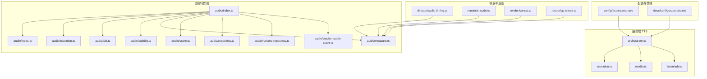
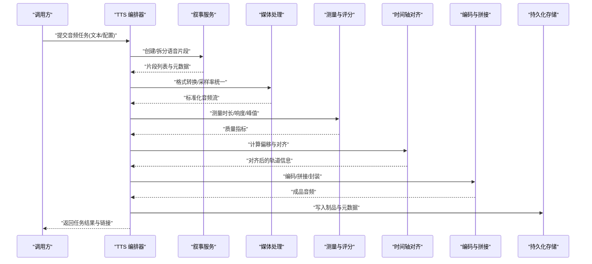
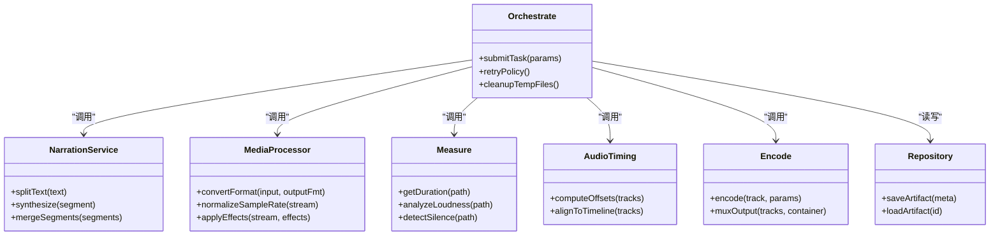

# 音频任务处理器

<cite>
**本文引用的文件**   
- [server/src/tts/orchestrate.ts](file://server/src/tts/orchestrate.ts)
- [server/src/tts/narration.ts](file://server/src/tts/narration.ts)
- [server/src/tts/media.ts](file://server/src/tts/media.ts)
- [server/src/tts/listenhub.ts](file://server/src/tts/listenhub.ts)
- [src/features/audio/index.ts](file://src/features/audio/index.ts)
- [src/features/audio/types.ts](file://src/features/audio/types.ts)
- [src/features/audio/narration.ts](file://src/features/audio/narration.ts)
- [src/features/audio/sfx.ts](file://src/features/audio/sfx.ts)
- [src/features/audio/subtitle.ts](file://src/features/audio/subtitle.ts)
- [src/features/audio/measure.ts](file://src/features/audio/measure.ts)
- [src/features/audio/score.ts](file://src/features/audio/score.ts)
- [src/features/audio/repository.ts](file://src/features/audio/repository.ts)
- [src/features/audio/runtime-repository.ts](file://src/features/audio/runtime-repository.ts)
- [src/features/audio/stepfun-audio-client.ts](file://src/features/audio/stepfun-audio-client.ts)
- [src/features/director/audio-timing.ts](file://src/features/director/audio-timing.ts)
- [src/features/render/encode.ts](file://src/features/render/encode.ts)
- [src/features/render/concat.ts](file://src/features/render/concat.ts)
- [src/features/render/qa-check.ts](file://src/features/render/qa-check.ts)
- [config/tts.env.example](file://config/tts.env.example)
- [docs/configuration/tts.md](file://docs/configuration/tts.md)
</cite>

## 目录
1. [简介](#简介)
2. [项目结构](#项目结构)
3. [核心组件](#核心组件)
4. [架构总览](#架构总览)
5. [详细组件分析](#详细组件分析)
6. [依赖关系分析](#依赖关系分析)
7. [性能考量](#性能考量)
8. [故障排查指南](#故障排查指南)
9. [结论](#结论)
10. [附录](#附录)

## 简介
本文件为 PurpleInk 平台的“音频任务处理器”提供系统化、可操作的文档。内容覆盖语音合成（TTS）、音频转录与音效生成等关键流程，深入说明 TTS 服务集成、音频格式转换、时间轴同步、质量检查、音量标准化与格式优化；同时给出错误处理机制、失败重试策略与临时文件清理方案，并汇总配置选项、模型选择、音质参数、多语言支持、字幕生成与音频分析能力，帮助读者快速理解与高效使用。

## 项目结构
音频相关能力主要分布在以下模块：
- server 层 TTS 编排与媒体处理：负责与外部 TTS 服务交互、媒体封装与基础处理。
- features/audio：音频领域核心能力，包括叙事（narration）、音效（sfx）、字幕（subtitle）、测量与评分、持久化与运行时仓库、第三方音频客户端等。
- features/director：导演管线中的音频时间轴对齐与调度。
- features/render：渲染阶段的编码、拼接与 QA 检查。
- config/docs：TTS 环境变量示例与配置说明。

图表来源
- [server/src/tts/orchestrate.ts](file://server/src/tts/orchestrate.ts)
- [server/src/tts/narration.ts](file://server/src/tts/narration.ts)
- [server/src/tts/media.ts](file://server/src/tts/media.ts)
- [server/src/tts/listenhub.ts](file://server/src/tts/listenhub.ts)
- [src/features/audio/index.ts](file://src/features/audio/index.ts)
- [src/features/audio/types.ts](file://src/features/audio/types.ts)
- [src/features/audio/narration.ts](file://src/features/audio/narration.ts)
- [src/features/audio/sfx.ts](file://src/features/audio/sfx.ts)
- [src/features/audio/subtitle.ts](file://src/features/audio/subtitle.ts)
- [src/features/audio/measure.ts](file://src/features/audio/measure.ts)
- [src/features/audio/score.ts](file://src/features/audio/score.ts)
- [src/features/audio/repository.ts](file://src/features/audio/repository.ts)
- [src/features/audio/runtime-repository.ts](file://src/features/audio/runtime-repository.ts)
- [src/features/audio/stepfun-audio-client.ts](file://src/features/audio/stepfun-audio-client.ts)
- [src/features/director/audio-timing.ts](file://src/features/director/audio-timing.ts)
- [src/features/render/encode.ts](file://src/features/render/encode.ts)
- [src/features/render/concat.ts](file://src/features/render/concat.ts)
- [src/features/render/qa-check.ts](file://src/features/render/qa-check.ts)
- [config/tts.env.example](file://config/tts.env.example)
- [docs/configuration/tts.md](file://docs/configuration/tts.md)

章节来源
- [server/src/tts/orchestrate.ts](file://server/src/tts/orchestrate.ts)
- [server/src/tts/narration.ts](file://server/src/tts/narration.ts)
- [server/src/tts/media.ts](file://server/src/tts/media.ts)
- [server/src/tts/listenhub.ts](file://server/src/tts/listenhub.ts)
- [src/features/audio/index.ts](file://src/features/audio/index.ts)
- [src/features/audio/types.ts](file://src/features/audio/types.ts)
- [src/features/director/audio-timing.ts](file://src/features/director/audio-timing.ts)
- [src/features/render/encode.ts](file://src/features/render/encode.ts)
- [src/features/render/concat.ts](file://src/features/render/concat.ts)
- [src/features/render/qa-check.ts](file://src/features/render/qa-check.ts)
- [config/tts.env.example](file://config/tts.env.example)
- [docs/configuration/tts.md](file://docs/configuration/tts.md)

## 核心组件
- TTS 编排器（orchestrate）：协调文本到语音的调用、结果回写与状态流转，是音频任务的入口。
- 叙事（narration）：管理段落级语音合成任务、分片与合并、元数据与时间戳。
- 媒体（media）：音频格式转换、采样率/声道统一、封装与转码。
- 监听中心（listenhub）：事件订阅与广播，用于异步任务进度与异常上报。
- 音频特性域（features/audio）：
  - narration/sfx/subtitle：分别负责语音片段、音效与字幕的生成与装配。
  - measure/score：时长测量、响度与峰值检测、质量评分。
  - repository/runtime-repository：音频制品与运行时数据的持久化与查询。
  - stepfun-audio-client：对接 StepFun 音频服务的客户端封装。
- 导演与渲染（director/render）：
  - audio-timing：基于测量结果进行时间轴对齐与偏移修正。
  - encode/concat/qa-check：编码输出、多轨拼接与质量检查。

章节来源
- [server/src/tts/orchestrate.ts](file://server/src/tts/orchestrate.ts)
- [server/src/tts/narration.ts](file://server/src/tts/narration.ts)
- [server/src/tts/media.ts](file://server/src/tts/media.ts)
- [server/src/tts/listenhub.ts](file://server/src/tts/listenhub.ts)
- [src/features/audio/narration.ts](file://src/features/audio/narration.ts)
- [src/features/audio/sfx.ts](file://src/features/audio/sfx.ts)
- [src/features/audio/subtitle.ts](file://src/features/audio/subtitle.ts)
- [src/features/audio/measure.ts](file://src/features/audio/measure.ts)
- [src/features/audio/score.ts](file://src/features/audio/score.ts)
- [src/features/audio/repository.ts](file://src/features/audio/repository.ts)
- [src/features/audio/runtime-repository.ts](file://src/features/audio/runtime-repository.ts)
- [src/features/audio/stepfun-audio-client.ts](file://src/features/audio/stepfun-audio-client.ts)
- [src/features/director/audio-timing.ts](file://src/features/director/audio-timing.ts)
- [src/features/render/encode.ts](file://src/features/render/encode.ts)
- [src/features/render/concat.ts](file://src/features/render/concat.ts)
- [src/features/render/qa-check.ts](file://src/features/render/qa-check.ts)

## 架构总览
下图展示从请求进入、TTS 编排、媒体处理、质量检查到最终输出的端到端流程。

图表来源
- [server/src/tts/orchestrate.ts](file://server/src/tts/orchestrate.ts)
- [server/src/tts/narration.ts](file://server/src/tts/narration.ts)
- [server/src/tts/media.ts](file://server/src/tts/media.ts)
- [src/features/audio/measure.ts](file://src/features/audio/measure.ts)
- [src/features/director/audio-timing.ts](file://src/features/director/audio-timing.ts)
- [src/features/render/encode.ts](file://src/features/render/encode.ts)
- [src/features/render/concat.ts](file://src/features/render/concat.ts)

## 详细组件分析

### TTS 编排器（orchestrate）
职责
- 接收任务参数（文本、语言、音色、速率、音量等），校验并下发至叙事服务。
- 协调媒体处理、质量检查与时间轴对齐，确保输出一致性与可回放性。
- 管理任务生命周期、重试与失败回滚，记录审计日志。

关键点
- 参数校验与默认值填充，避免下游异常。
- 分段策略：按语义或长度切分，提升并发与容错。
- 中间产物管理：临时文件命名规范与清理时机。
- 事件上报：通过监听中心推送进度与错误。

章节来源
- [server/src/tts/orchestrate.ts](file://server/src/tts/orchestrate.ts)
- [server/src/tts/listenhub.ts](file://server/src/tts/listenhub.ts)

### 叙事服务（narration）
职责
- 将输入文本拆分为可合成的片段，维护片段顺序、时间戳与语言信息。
- 与 TTS 客户端交互，获取音频片段与元数据（如音素时长、停顿）。
- 合并相邻片段，去重与边界平滑处理。

关键点
- 片段粒度控制：避免过长导致超时或内存压力。
- 语言与方言映射：根据配置选择对应模型与发音人。
- 失败重试：指数退避与最大重试次数限制。

章节来源
- [server/src/tts/narration.ts](file://server/src/tts/narration.ts)
- [src/features/audio/narration.ts](file://src/features/audio/narration.ts)

### 媒体处理（media）
职责
- 统一采样率、声道数与位深，消除格式差异。
- 格式转换（如 WAV/MP3/AAC），封装容器选择。
- 裁剪、淡入淡出、静音段去除等预处理。

关键点
- 无损优先：尽量在浮点域处理，减少量化噪声。
- 流式处理：大文件分块读写，降低内存占用。
- 元数据保留：标题、艺术家、封面等信息透传。

章节来源
- [server/src/tts/media.ts](file://server/src/tts/media.ts)

### 监听中心（listenhub）
职责
- 定义事件类型（开始、进度、完成、失败）。
- 订阅/发布机制，解耦各阶段处理逻辑。
- 错误聚合与告警上报。

关键点
- 事件幂等：重复事件不造成副作用。
- 背压控制：消费者处理慢时缓冲与丢弃策略。

章节来源
- [server/src/tts/listenhub.ts](file://server/src/tts/listenhub.ts)

### 音频特性域（features/audio）
- narration：片段管理与合成结果拼装。
- sfx：音效库检索、混音与动态增益。
- subtitle：SRT/VTT 生成、时间轴对齐与多语言切换。
- measure：时长测量、响度（LUFS）、峰值、静音检测。
- score：综合质量评分（清晰度、响度均衡、失真）。
- repository/runtime-repository：制品与运行时状态持久化。
- stepfun-audio-client：StepFun 音频服务调用封装（鉴权、限流、重试）。

章节来源
- [src/features/audio/narration.ts](file://src/features/audio/narration.ts)
- [src/features/audio/sfx.ts](file://src/features/audio/sfx.ts)
- [src/features/audio/subtitle.ts](file://src/features/audio/subtitle.ts)
- [src/features/audio/measure.ts](file://src/features/audio/measure.ts)
- [src/features/audio/score.ts](file://src/features/audio/score.ts)
- [src/features/audio/repository.ts](file://src/features/audio/repository.ts)
- [src/features/audio/runtime-repository.ts](file://src/features/audio/runtime-repository.ts)
- [src/features/audio/stepfun-audio-client.ts](file://src/features/audio/stepfun-audio-client.ts)

### 导演与渲染（director/render）
- audio-timing：依据测量结果计算偏移，保证口型/画面与声音对齐。
- encode：目标格式编码（比特率、码率模式、编码器参数）。
- concat：多轨道拼接（对白、音效、环境音），交叉淡化。
- qa-check：响度达标、峰值不过载、无爆音与静音段异常。

章节来源
- [src/features/director/audio-timing.ts](file://src/features/director/audio-timing.ts)
- [src/features/render/encode.ts](file://src/features/render/encode.ts)
- [src/features/render/concat.ts](file://src/features/render/concat.ts)
- [src/features/render/qa-check.ts](file://src/features/render/qa-check.ts)

## 依赖关系分析

图表来源
- [server/src/tts/orchestrate.ts](file://server/src/tts/orchestrate.ts)
- [server/src/tts/narration.ts](file://server/src/tts/narration.ts)
- [server/src/tts/media.ts](file://server/src/tts/media.ts)
- [src/features/audio/measure.ts](file://src/features/audio/measure.ts)
- [src/features/director/audio-timing.ts](file://src/features/director/audio-timing.ts)
- [src/features/render/encode.ts](file://src/features/render/encode.ts)
- [src/features/audio/repository.ts](file://src/features/audio/repository.ts)

章节来源
- [server/src/tts/orchestrate.ts](file://server/src/tts/orchestrate.ts)
- [server/src/tts/narration.ts](file://server/src/tts/narration.ts)
- [server/src/tts/media.ts](file://server/src/tts/media.ts)
- [src/features/audio/measure.ts](file://src/features/audio/measure.ts)
- [src/features/director/audio-timing.ts](file://src/features/director/audio-timing.ts)
- [src/features/render/encode.ts](file://src/features/render/encode.ts)
- [src/features/audio/repository.ts](file://src/features/audio/repository.ts)

## 性能考量
- 并行合成：按片段并发调用 TTS，结合队列限流避免过载。
- 流式处理：大文件分块读写，减少内存峰值。
- 缓存命中：相同文本+模型+参数的结果缓存，避免重复合成。
- 编码参数调优：根据目标平台选择合适的比特率与码率模式。
- I/O 优化：SSD 存储、临时目录隔离、批量清理策略。

[本节为通用指导，无需特定文件引用]

## 故障排查指南
常见问题与定位要点
- TTS 调用失败：检查鉴权、配额、网络连通与限流；查看监听中心事件与重试计数。
- 音频无声或极小音量：确认归一化步骤是否执行、增益参数是否正确、静音检测阈值设置。
- 时间轴错位：核对测量时长与偏移计算，检查片段边界与淡入淡出参数。
- 编码失败：检查编码器可用性、容器兼容性、目标比特率上限。
- 临时文件残留：确认任务结束清理钩子是否触发，磁盘空间是否充足。

建议排查路径
- 启用详细日志与事件追踪，定位失败阶段。
- 复现实例最小化：仅保留必要片段与效果，逐步增加复杂度。
- 对比基准：使用已知正确的样本作为对照，缩小问题范围。

章节来源
- [server/src/tts/listenhub.ts](file://server/src/tts/listenhub.ts)
- [src/features/audio/measure.ts](file://src/features/audio/measure.ts)
- [src/features/render/qa-check.ts](file://src/features/render/qa-check.ts)

## 结论
PurpleInk 的音频任务处理器以“编排器”为核心，串联叙事、媒体、测量、时间轴对齐与编码等环节，形成稳定可靠的端到端音频生产流水线。通过模块化设计、事件驱动与完善的 QA 检查，能够支撑多语言、多模型、高质量音频内容的自动化生成与交付。合理配置与监控是保障系统稳定性的关键。

[本节为总结性内容，无需特定文件引用]

## 附录

### 配置与环境变量
- TTS 环境变量示例：参考 tts.env.example，包含服务地址、鉴权、模型与速率限制等。
- 配置文档：tts.md 详细说明各项参数的含义与推荐值。

章节来源
- [config/tts.env.example](file://config/tts.env.example)
- [docs/configuration/tts.md](file://docs/configuration/tts.md)

### 音频质量检查与音量标准化
- 质量检查：响度（LUFS）、峰值、失真、静音段检测。
- 音量标准化：目标响度、压缩比、限幅阈值、峰值保护。
- 格式优化：采样率、声道、位深、比特率与编码器选择。

章节来源
- [src/features/audio/measure.ts](file://src/features/audio/measure.ts)
- [src/features/audio/score.ts](file://src/features/audio/score.ts)
- [src/features/render/encode.ts](file://src/features/render/encode.ts)
- [src/features/render/qa-check.ts](file://src/features/render/qa-check.ts)

### 时间轴同步与字幕生成
- 时间轴同步：基于测量结果计算偏移，对齐画面与声音。
- 字幕生成：SRT/VTT 输出，多语言切换，时间戳精度控制。

章节来源
- [src/features/director/audio-timing.ts](file://src/features/director/audio-timing.ts)
- [src/features/audio/subtitle.ts](file://src/features/audio/subtitle.ts)

### 错误处理与重试策略
- 重试策略：指数退避、最大重试次数、熔断与降级。
- 临时文件清理：任务成功/失败均触发清理，防止磁盘泄漏。
- 事件上报：失败原因、堆栈与上下文信息记录。

章节来源
- [server/src/tts/listenhub.ts](file://server/src/tts/listenhub.ts)
- [src/features/audio/stepfun-audio-client.ts](file://src/features/audio/stepfun-audio-client.ts)

### 多语言支持与模型选择
- 语言映射：输入语言到模型/发音人的自动选择。
- 模型路由：根据质量、延迟与成本选择最优模型。
- 方言与口音：可选扩展包与自定义发音人。

章节来源
- [src/features/audio/narration.ts](file://src/features/audio/narration.ts)
- [src/features/audio/stepfun-audio-client.ts](file://src/features/audio/stepfun-audio-client.ts)

### 音效生成与混音
- 音效检索：关键词匹配、相似度排序、版权校验。
- 混音策略：优先级、动态增益、交叉淡化、声像定位。

章节来源
- [src/features/audio/sfx.ts](file://src/features/audio/sfx.ts)

### 数据持久化与运行时状态
- 制品存储：音频文件、字幕、元数据与质量报告。
- 运行时状态：任务进度、中间产物、错误信息与重试计数。

章节来源
- [src/features/audio/repository.ts](file://src/features/audio/repository.ts)
- [src/features/audio/runtime-repository.ts](file://src/features/audio/runtime-repository.ts)