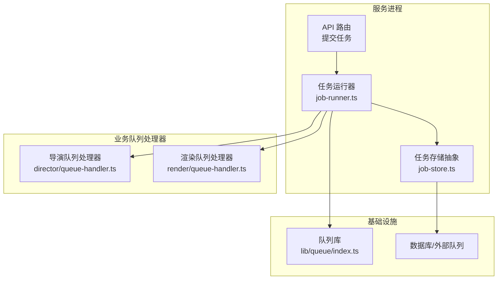
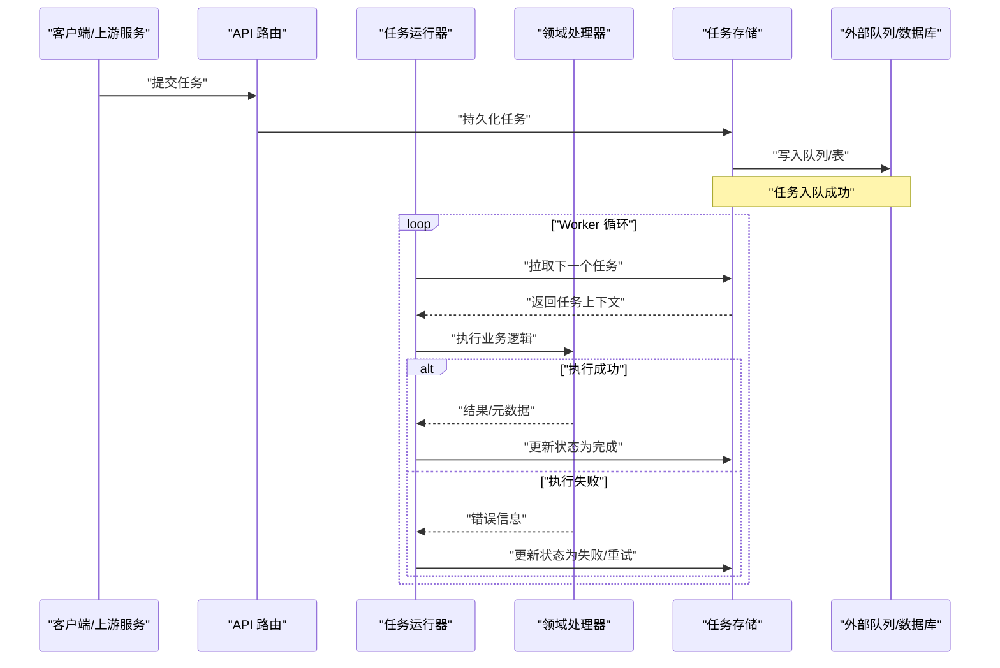
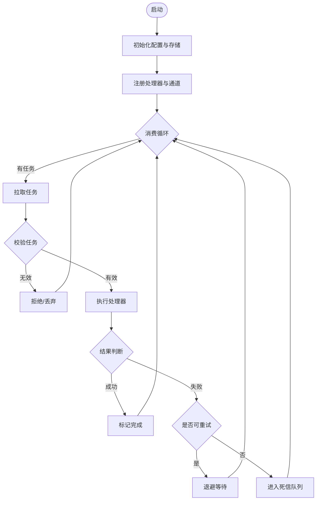
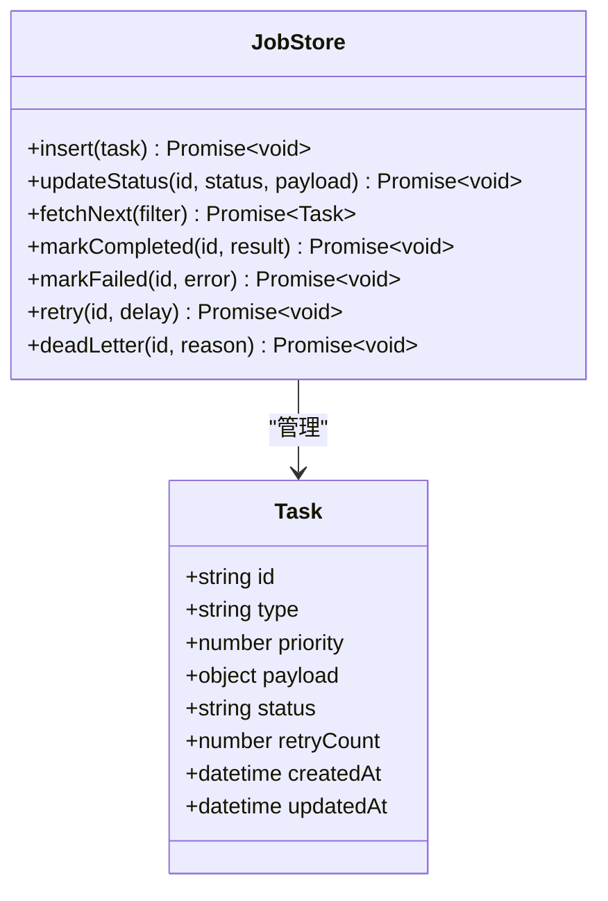
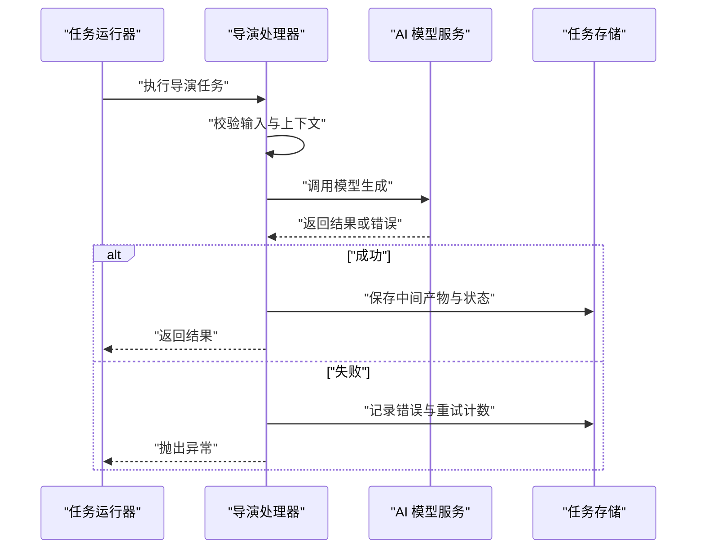
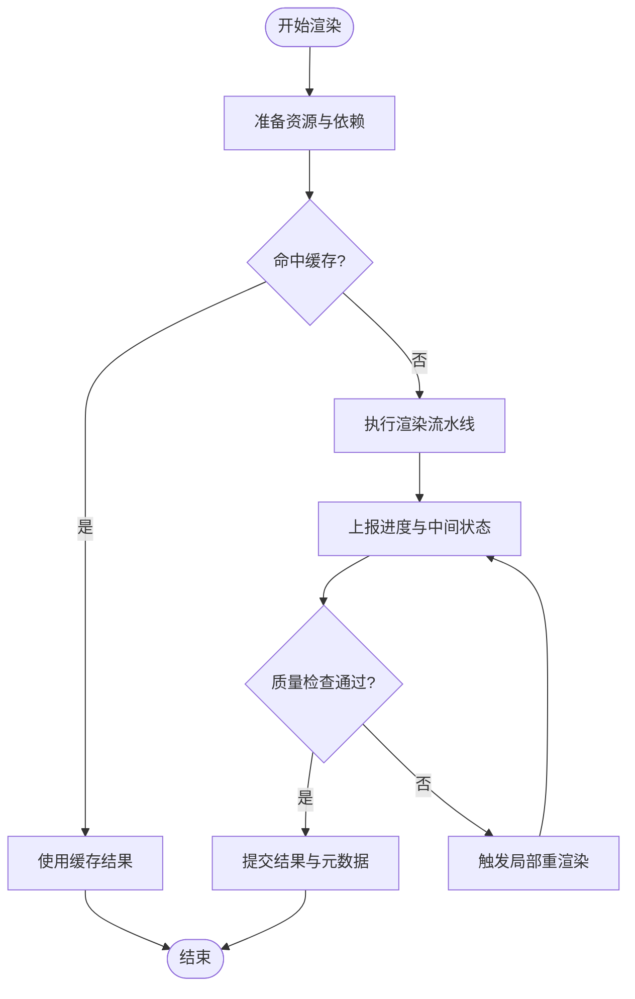
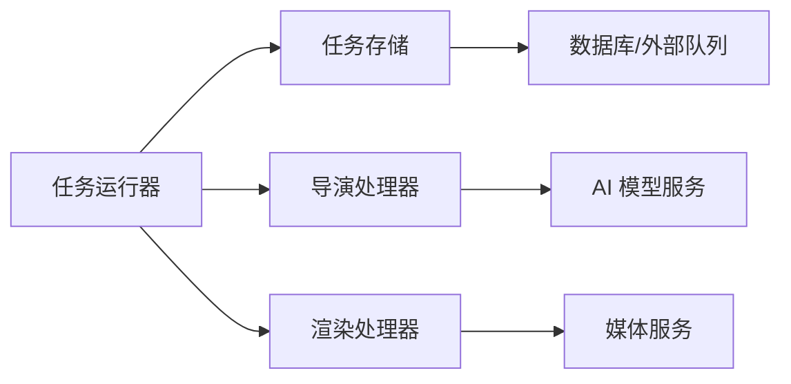

# 任务队列系统

<cite>
**本文引用的文件**   
- [server/src/server/job-runner.ts](file://server/src/server/job-runner.ts)
- [server/src/server/job-store.ts](file://server/src/server/job-store.ts)
- [src/features/director/queue-handler.ts](file://src/features/director/queue-handler.ts)
- [src/features/render/queue-handler.ts](file://src/features/render/queue-handler.ts)
- [src/lib/queue/index.ts](file://src/lib/queue/index.ts)
- [deploy/compose.yaml](file://deploy/compose.yaml)
- [deploy/env.example](file://deploy/env.example)
- [deploy/worker.env.example](file://deploy/worker.env.example)
- [Dockerfile.worker](file://Dockerfile.worker)
- [docker-compose.dev.yml](file://docker-compose.dev.yml)
- [server/package.json](file://server/package.json)
- [package.json](file://package.json)
- [docs/issues/ISSUE-004-queue-concurrency-lanes.md](file://docs/issues/ISSUE-004-queue-concurrency-lanes.md)
- [docs/issues/issue-006/no-http-queue-consumption.md](file://docs/issues/issue-006/no-http-queue-consumption.md)
</cite>

## 目录
1. [简介](#简介)
2. [项目结构](#项目结构)
3. [核心组件](#核心组件)
4. [架构总览](#架构总览)
5. [详细组件分析](#详细组件分析)
6. [依赖关系分析](#依赖关系分析)
7. [性能考量](#性能考量)
8. [故障排查指南](#故障排查指南)
9. [结论](#结论)
10. [附录](#附录)

## 简介
本文件为 PurpleInk 平台的任务队列系统提供系统化文档，聚焦基于 Node.js 的异步任务处理架构。内容涵盖任务调度、优先级与负载均衡策略、消费者设计、重试与失败补偿、分布式处理与水平扩展、故障转移、监控与可观测性、配置优化、内存管理与资源清理、消息持久化、状态跟踪等关键主题。读者可通过本文快速理解队列在渲染、导出、AI 编排等场景中的职责边界与实现要点。

## 项目结构
PurpleInk 的任务队列相关代码分布在服务端运行时与业务特性模块中：
- 服务端运行时（server）提供通用任务运行器与存储抽象，作为 Worker 进程的核心。
- 业务特性（features）按领域划分队列处理器，如导演编排与渲染导出。
- 公共库（lib/queue）提供队列基础设施能力。
- 部署与容器化脚本定义多进程 Worker 的启动方式与环境变量。

图表来源
- [server/src/server/job-runner.ts](file://server/src/server/job-runner.ts)
- [server/src/server/job-store.ts](file://server/src/server/job-store.ts)
- [src/features/director/queue-handler.ts](file://src/features/director/queue-handler.ts)
- [src/features/render/queue-handler.ts](file://src/features/render/queue-handler.ts)
- [src/lib/queue/index.ts](file://src/lib/queue/index.ts)

章节来源
- [server/src/server/job-runner.ts](file://server/src/server/job-runner.ts)
- [server/src/server/job-store.ts](file://server/src/server/job-store.ts)
- [src/features/director/queue-handler.ts](file://src/features/director/queue-handler.ts)
- [src/features/render/queue-handler.ts](file://src/features/render/queue-handler.ts)
- [src/lib/queue/index.ts](file://src/lib/queue/index.ts)

## 核心组件
- 任务运行器（Job Runner）
  - 负责从队列拉取任务、执行生命周期管理（入队、出队、执行、完成、失败）、并发控制与错误恢复。
  - 通过存储抽象与持久化层交互，确保任务状态一致性与可恢复性。
- 任务存储（Job Store）
  - 抽象任务的增删改查、状态迁移、幂等保证与事务边界。
  - 支持多种后端（内存、数据库、外部消息队列），便于替换与扩展。
- 领域队列处理器（Queue Handlers）
  - 针对具体业务域（导演编排、渲染导出）实现任务处理逻辑。
  - 统一输入输出契约、错误码与指标上报。
- 队列库（Queue Library）
  - 提供通用的队列能力（优先级、分片、重试、退避、限流、背压）。
  - 封装与外部队列系统的适配细节。

章节来源
- [server/src/server/job-runner.ts](file://server/src/server/job-runner.ts)
- [server/src/server/job-store.ts](file://server/src/server/job-store.ts)
- [src/features/director/queue-handler.ts](file://src/features/director/queue-handler.ts)
- [src/features/render/queue-handler.ts](file://src/features/render/queue-handler.ts)
- [src/lib/queue/index.ts](file://src/lib/queue/index.ts)

## 架构总览
任务队列采用“生产者—队列—消费者”解耦模式：
- 生产者（API/上游服务）将任务写入队列或持久化存储。
- 消费者（Worker 进程）通过运行器拉取并执行任务，调用领域处理器完成业务逻辑。
- 存储层保障任务持久化与状态一致性，支持横向扩展与故障转移。

图表来源
- [server/src/server/job-runner.ts](file://server/src/server/job-runner.ts)
- [server/src/server/job-store.ts](file://server/src/server/job-store.ts)
- [src/features/director/queue-handler.ts](file://src/features/director/queue-handler.ts)
- [src/features/render/queue-handler.ts](file://src/features/render/queue-handler.ts)

## 详细组件分析

### 任务运行器（Job Runner）
- 职责
  - 任务生命周期管理：入队校验、出队、执行、完成、失败、重试、死信。
  - 并发控制：按通道（lane）隔离不同优先级或类型任务，避免相互阻塞。
  - 错误恢复：捕获异常、记录日志、触发重试策略与告警。
  - 指标收集：吞吐、延迟、错误率、队列长度、消费者数量。
- 关键流程
  - 初始化：加载配置、连接存储、注册处理器、启动消费循环。
  - 拉取策略：优先队列、轮询、权重分配、背压控制。
  - 执行模型：单任务串行、批量拉取、超时保护、资源限制。
  - 状态同步：原子更新、幂等键、去重与冲突解决。

图表来源
- [server/src/server/job-runner.ts](file://server/src/server/job-runner.ts)

章节来源
- [server/src/server/job-runner.ts](file://server/src/server/job-runner.ts)

### 任务存储（Job Store）
- 职责
  - 提供统一的 CRUD 接口，屏蔽底层存储差异。
  - 维护任务状态机（待处理、进行中、已完成、失败、重试、死信）。
  - 支持事务与幂等，确保高并发下的数据一致性。
- 关键能力
  - 插入与更新：原子操作、条件更新、版本控制。
  - 查询与过滤：按优先级、标签、状态、时间窗口筛选。
  - 迁移与归档：历史任务归档、清理策略、压缩与索引优化。

图表来源
- [server/src/server/job-store.ts](file://server/src/server/job-store.ts)

章节来源
- [server/src/server/job-store.ts](file://server/src/server/job-store.ts)

### 导演队列处理器（Director Queue Handler）
- 职责
  - 处理导演编排相关的任务，如剧本生成、镜头规划、提示词组装。
  - 协调 AI 模型调用、工具链执行与中间产物落盘。
- 关键流程
  - 参数校验与权限检查。
  - 分阶段执行与状态回写。
  - 错误分类与重试策略（网络错误、模型限流、业务校验失败）。

图表来源
- [src/features/director/queue-handler.ts](file://src/features/director/queue-handler.ts)

章节来源
- [src/features/director/queue-handler.ts](file://src/features/director/queue-handler.ts)

### 渲染队列处理器（Render Queue Handler）
- 职责
  - 处理渲染导出任务，包括帧捕获、编码、合成与质量检查。
  - 管理媒体资源、缓存与临时文件的生命周期。
- 关键流程
  - 资源准备与依赖检查。
  - 分块渲染与进度上报。
  - 失败补偿：断点续传、增量渲染、回滚与清理。

图表来源
- [src/features/render/queue-handler.ts](file://src/features/render/queue-handler.ts)

章节来源
- [src/features/render/queue-handler.ts](file://src/features/render/queue-handler.ts)

### 队列库（Queue Library）
- 职责
  - 提供通用队列能力：优先级、分片、重试、退避、限流、背压、监控。
  - 封装与外部队列系统的适配（Redis、RabbitMQ、Kafka、数据库表）。
- 关键能力
  - 通道隔离：按类型或优先级划分通道，避免热点任务阻塞其他任务。
  - 消费者组：支持多实例协作消费，自动再平衡。
  - 可观测性：指标采集、链路追踪、结构化日志。

章节来源
- [src/lib/queue/index.ts](file://src/lib/queue/index.ts)

## 依赖关系分析
- 组件耦合
  - 运行器依赖存储抽象与处理器接口，降低对具体实现的耦合。
  - 处理器仅依赖业务服务与存储接口，保持领域边界清晰。
- 外部依赖
  - 数据库/消息队列：通过存储抽象与适配器接入。
  - 监控与日志：集成指标采集与链路追踪。
- 潜在风险
  - 循环依赖：需通过接口与事件解耦。
  - 单点故障：存储与队列需具备高可用与副本机制。

图表来源
- [server/src/server/job-runner.ts](file://server/src/server/job-runner.ts)
- [server/src/server/job-store.ts](file://server/src/server/job-store.ts)
- [src/features/director/queue-handler.ts](file://src/features/director/queue-handler.ts)
- [src/features/render/queue-handler.ts](file://src/features/render/queue-handler.ts)

章节来源
- [server/src/server/job-runner.ts](file://server/src/server/job-runner.ts)
- [server/src/server/job-store.ts](file://server/src/server/job-store.ts)
- [src/features/director/queue-handler.ts](file://src/features/director/queue-handler.ts)
- [src/features/render/queue-handler.ts](file://src/features/render/queue-handler.ts)

## 性能考量
- 并发与通道
  - 按任务类型或优先级划分通道，避免热点任务阻塞。
  - 合理设置消费者数量与每通道并发度，结合 CPU/IO 特性调优。
- 背压与限流
  - 当下游服务限流时，启用令牌桶或漏桶算法进行削峰填谷。
  - 队列长度阈值告警与自动降级策略。
- 内存与资源
  - 大对象分块处理与流式传输，减少峰值内存占用。
  - 及时释放临时文件与数据库连接，避免泄漏。
- 缓存与幂等
  - 对重复任务进行幂等键去重，避免重复计算。
  - 中间结果缓存与失效策略，提升整体吞吐。

章节来源
- [docs/issues/ISSUE-004-queue-concurrency-lanes.md](file://docs/issues/ISSUE-004-queue-concurrency-lanes.md)

## 故障排查指南
- 常见问题
  - 任务堆积：检查消费者健康、队列长度、下游限流与错误率。
  - 任务失败：查看错误日志、重试次数、死信队列与补偿策略。
  - 性能下降：分析 CPU/内存、GC 停顿、数据库慢查询与锁竞争。
- 诊断步骤
  - 确认运行器与处理器日志级别与采样率。
  - 检查存储层状态机与索引效率。
  - 使用链路追踪定位跨服务调用瓶颈。
- 恢复策略
  - 重启消费者、扩容实例、调整通道并发。
  - 清理死信队列与重试积压任务。
  - 回滚变更与降级到稳定版本。

章节来源
- [docs/issues/issue-006/no-http-queue-consumption.md](file://docs/issues/issue-006/no-http-queue-consumption.md)

## 结论
PurpleInk 的任务队列系统以清晰的职责分离与可扩展的抽象为核心，支撑渲染、导出与 AI 编排等多领域任务的高效处理。通过通道隔离、重试与补偿、持久化与可观测性，系统在稳定性与性能之间取得平衡。建议在生产环境持续监控指标、优化资源配置，并完善故障演练与应急预案。

## 附录
- 部署与扩缩容
  - 使用容器编排启动多个 Worker 实例，按负载动态扩缩容。
  - 环境变量集中管理，区分生产与开发配置。
- 配置优化
  - 调整队列容量、消费者并发、重试退避与超时参数。
  - 开启压缩与分页读取，降低 IO 压力。
- 监控与告警
  - 采集队列长度、处理延迟、错误率、消费者存活等指标。
  - 设置阈值告警与自动化修复动作。

章节来源
- [deploy/compose.yaml](file://deploy/compose.yaml)
- [deploy/env.example](file://deploy/env.example)
- [deploy/worker.env.example](file://deploy/worker.env.example)
- [Dockerfile.worker](file://Dockerfile.worker)
- [docker-compose.dev.yml](file://docker-compose.dev.yml)
- [server/package.json](file://server/package.json)
- [package.json](file://package.json)