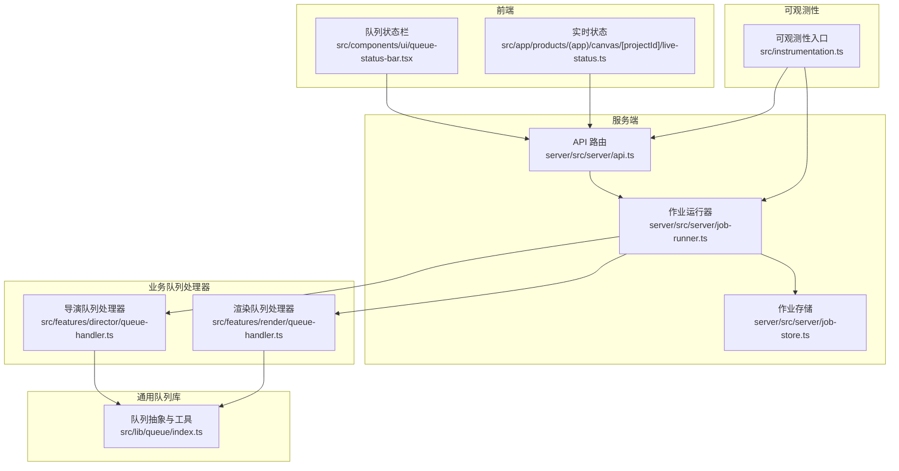
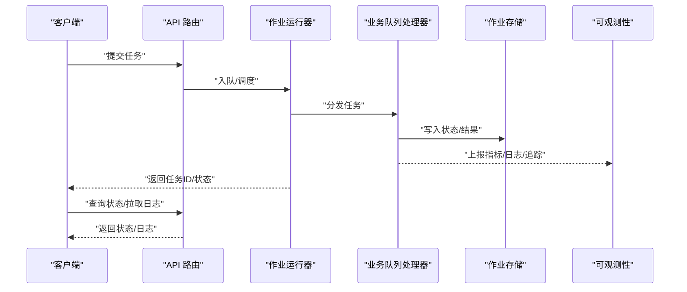
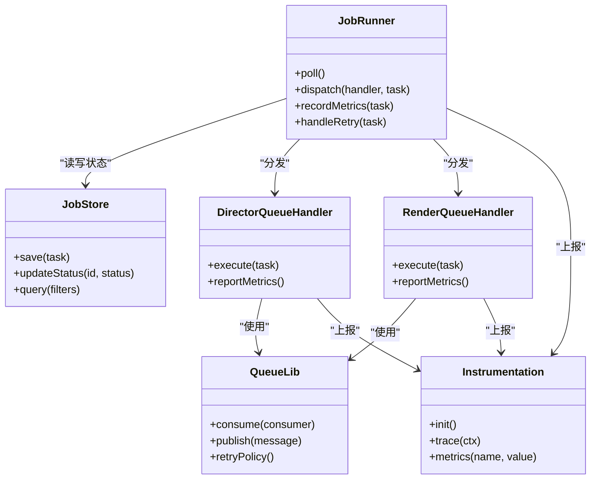

# 监控与调试

<cite>
**本文引用的文件**   
- [server/src/server/job-runner.ts](file://server/src/server/job-runner.ts)
- [server/src/server/job-store.ts](file://server/src/server/job-store.ts)
- [server/src/server/api.ts](file://server/src/server/api.ts)
- [src/features/director/queue-handler.ts](file://src/features/director/queue-handler.ts)
- [src/features/render/queue-handler.ts](file://src/features/render/queue-handler.ts)
- [src/lib/queue/index.ts](file://src/lib/queue/index.ts)
- [src/components/ui/queue-status-bar.tsx](file://src/components/ui/queue-status-bar.tsx)
- [src/app/products/(app)/canvas/[projectId]/live-status.ts](file://src/app/products/(app)/canvas/[projectId]/live-status.ts)
- [src/instrumentation.ts](file://src/instrumentation.ts)
- [deploy/compose.yaml](file://deploy/compose.yaml)
- [deploy/env.example](file://deploy/env.example)
- [deploy/worker.env.example](file://deploy/worker.env.example)
</cite>

## 目录
1. [简介](#简介)
2. [项目结构](#项目结构)
3. [核心组件](#核心组件)
4. [架构总览](#架构总览)
5. [详细组件分析](#详细组件分析)
6. [依赖关系分析](#依赖关系分析)
7. [性能考量](#性能考量)
8. [故障排查指南](#故障排查指南)
9. [结论](#结论)
10. [附录](#附录)

## 简介
本文件面向 PurpleInK 平台的队列系统，提供生产级监控与调试的完整实践。内容覆盖：
- 关键指标采集与分析：吞吐量、延迟、错误率
- 任务执行状态实时跟踪、日志聚合与错误诊断
- 队列健康检查、容量规划与预警机制
- 调试工具使用、性能瓶颈分析与内存泄漏检测
- 分布式追踪、链路追踪与可观测性集成方案
- 生产环境最佳实践与故障排查流程

## 项目结构
与队列监控与调试相关的代码主要分布在以下位置：
- 服务端作业调度与持久化：server/src/server/*
- 业务队列处理器（导演、渲染等）：src/features/*/queue-handler.ts
- 通用队列库：src/lib/queue/*
- 前端队列状态展示与实时状态：src/components/ui/queue-status-bar.tsx、src/app/products/(app)/.../live-status.ts
- 应用可观测性入口：src/instrumentation.ts
- 部署与环境配置：deploy/*

图表来源
- [server/src/server/api.ts](file://server/src/server/api.ts)
- [server/src/server/job-runner.ts](file://server/src/server/job-runner.ts)
- [server/src/server/job-store.ts](file://server/src/server/job-store.ts)
- [src/features/director/queue-handler.ts](file://src/features/director/queue-handler.ts)
- [src/features/render/queue-handler.ts](file://src/features/render/queue-handler.ts)
- [src/lib/queue/index.ts](file://src/lib/queue/index.ts)
- [src/components/ui/queue-status-bar.tsx](file://src/components/ui/queue-status-bar.tsx)
- [src/app/products/(app)/canvas/[projectId]/live-status.ts](file://src/app/products/(app)/canvas/[projectId]/live-status.ts)
- [src/instrumentation.ts](file://src/instrumentation.ts)

章节来源
- [server/src/server/api.ts](file://server/src/server/api.ts)
- [server/src/server/job-runner.ts](file://server/src/server/job-runner.ts)
- [server/src/server/job-store.ts](file://server/src/server/job-store.ts)
- [src/features/director/queue-handler.ts](file://src/features/director/queue-handler.ts)
- [src/features/render/queue-handler.ts](file://src/features/render/queue-handler.ts)
- [src/lib/queue/index.ts](file://src/lib/queue/index.ts)
- [src/components/ui/queue-status-bar.tsx](file://src/components/ui/queue-status-bar.tsx)
- [src/app/products/(app)/canvas/[projectId]/live-status.ts](file://src/app/products/(app)/canvas/[projectId]/live-status.ts)
- [src/instrumentation.ts](file://src/instrumentation.ts)

## 核心组件
- 作业运行器（Job Runner）：负责从队列拉取任务、分发给具体处理器、管理生命周期与重试策略，并记录关键指标。
- 作业存储（Job Store）：持久化任务元数据、状态变更与审计信息，支撑查询与回溯。
- 业务队列处理器：按领域划分（如导演、渲染），实现具体任务逻辑，上报指标与异常。
- 通用队列库：封装队列接入、限流、并发控制、重试、退避等能力。
- 前端状态展示：通过 UI 组件与实时状态模块，向用户展示队列积压、处理进度与错误提示。
- 可观测性入口：统一埋点、指标导出、日志结构化与分布式追踪上下文注入。

章节来源
- [server/src/server/job-runner.ts](file://server/src/server/job-runner.ts)
- [server/src/server/job-store.ts](file://server/src/server/job-store.ts)
- [src/features/director/queue-handler.ts](file://src/features/director/queue-handler.ts)
- [src/features/render/queue-handler.ts](file://src/features/render/queue-handler.ts)
- [src/lib/queue/index.ts](file://src/lib/queue/index.ts)
- [src/components/ui/queue-status-bar.tsx](file://src/components/ui/queue-status-bar.tsx)
- [src/app/products/(app)/canvas/[projectId]/live-status.ts](file://src/app/products/(app)/canvas/[projectId]/live-status.ts)
- [src/instrumentation.ts](file://src/instrumentation.ts)

## 架构总览
下图展示了请求到队列处理的端到端路径，以及指标、日志与追踪的采集点。

图表来源
- [server/src/server/api.ts](file://server/src/server/api.ts)
- [server/src/server/job-runner.ts](file://server/src/server/job-runner.ts)
- [src/features/director/queue-handler.ts](file://src/features/director/queue-handler.ts)
- [src/features/render/queue-handler.ts](file://src/features/render/queue-handler.ts)
- [server/src/server/job-store.ts](file://server/src/server/job-store.ts)
- [src/instrumentation.ts](file://src/instrumentation.ts)

## 详细组件分析

### 作业运行器（Job Runner）
职责与行为
- 周期性轮询或事件驱动拉取待处理任务
- 根据处理器注册表选择对应业务队列处理器
- 控制并发度、限流与重试策略（含指数退避）
- 在任务开始、完成、失败时更新状态并上报指标
- 与作业存储交互，确保状态一致性与可追溯

关键指标采集点
- 吞吐：单位时间成功/失败任务数
- 延迟：入队到开始、开始到结束、端到端耗时
- 错误率：失败次数/总次数，按处理器维度细分
- 资源：CPU/内存占用、GC 停顿、队列堆积长度

建议增强
- 增加“等待时长”与“排队时长”分离统计
- 引入滑动窗口与百分位延迟（P50/P95/P99）
- 对长尾任务进行告警与降级

章节来源
- [server/src/server/job-runner.ts](file://server/src/server/job-runner.ts)
- [server/src/server/job-store.ts](file://server/src/server/job-store.ts)
- [src/instrumentation.ts](file://src/instrumentation.ts)

### 作业存储（Job Store）
职责与行为
- 持久化任务元数据（类型、参数、优先级、租户/项目 ID）
- 记录状态机流转（待处理、进行中、成功、失败、重试中）
- 支持按条件查询、分页与审计回放
- 为监控面板与诊断工具提供数据源

设计要点
- 幂等写入与乐观锁，避免重复消费
- 索引优化：按状态、创建时间、处理器类型建索引
- 归档与冷热分层：历史任务归档，热数据保留短期

章节来源
- [server/src/server/job-store.ts](file://server/src/server/job-store.ts)

### 业务队列处理器（导演/渲染）
职责与行为
- 解析任务参数，校验输入
- 执行业务逻辑（调用外部服务、生成产物、落盘）
- 上报结构化日志与指标，携带追踪上下文
- 处理异常与重试边界，保证幂等与一致性

性能关注
- I/O 密集任务的异步化与批量化
- 大对象序列化/反序列化的开销控制
- 外部依赖超时与熔断策略

章节来源
- [src/features/director/queue-handler.ts](file://src/features/director/queue-handler.ts)
- [src/features/render/queue-handler.ts](file://src/features/render/queue-handler.ts)
- [src/instrumentation.ts](file://src/instrumentation.ts)

### 通用队列库
职责与行为
- 抽象队列接入（内存/消息中间件）
- 提供消费者组、分区、顺序性保障
- 内置重试、退避、死信队列、去重
- 暴露指标钩子与日志埋点

扩展建议
- 插件式拦截器（鉴权、审计、灰度）
- 多后端适配（Redis/RabbitMQ/Kafka）
- 动态扩缩容感知与负载均衡

章节来源
- [src/lib/queue/index.ts](file://src/lib/queue/index.ts)

### 前端队列状态展示
职责与行为
- 展示队列积压、处理进度、错误计数
- 实时刷新与断线重连
- 提供快速定位任务详情与日志入口

可用性建议
- 防抖与增量更新，降低网络压力
- 错误态友好提示与自愈引导

章节来源
- [src/components/ui/queue-status-bar.tsx](file://src/components/ui/queue-status-bar.tsx)
- [src/app/products/(app)/canvas/[projectId]/live-status.ts](file://src/app/products/(app)/canvas/[projectId]/live-status.ts)

### 可观测性入口
职责与行为
- 统一初始化指标、日志、追踪
- 注入追踪上下文贯穿请求与队列处理
- 暴露健康检查与就绪探针接口

生产建议
- 指标采样与降采样策略
- 日志分级与脱敏
- 追踪采样率与采样规则

章节来源
- [src/instrumentation.ts](file://src/instrumentation.ts)

## 依赖关系分析
- 低耦合高内聚：作业运行器仅依赖处理器接口与存储接口，便于替换与扩展
- 明确边界：业务处理器不直接访问基础设施，通过通用队列库与存储抽象
- 可观测性横切：通过入口模块统一注入，避免散乱埋点

图表来源
- [server/src/server/job-runner.ts](file://server/src/server/job-runner.ts)
- [server/src/server/job-store.ts](file://server/src/server/job-store.ts)
- [src/features/director/queue-handler.ts](file://src/features/director/queue-handler.ts)
- [src/features/render/queue-handler.ts](file://src/features/render/queue-handler.ts)
- [src/lib/queue/index.ts](file://src/lib/queue/index.ts)
- [src/instrumentation.ts](file://src/instrumentation.ts)

章节来源
- [server/src/server/job-runner.ts](file://server/src/server/job-runner.ts)
- [server/src/server/job-store.ts](file://server/src/server/job-store.ts)
- [src/features/director/queue-handler.ts](file://src/features/director/queue-handler.ts)
- [src/features/render/queue-handler.ts](file://src/features/render/queue-handler.ts)
- [src/lib/queue/index.ts](file://src/lib/queue/index.ts)
- [src/instrumentation.ts](file://src/instrumentation.ts)

## 性能考量
- 吞吐与延迟
  - 合理设置消费者并发与批大小，避免过度竞争
  - 区分冷/热任务，采用不同队列与处理器池
  - 对 I/O 密集型任务启用连接池与缓存
- 错误率与稳定性
  - 重试策略需结合幂等与去重，防止雪崩
  - 外部依赖超时、熔断与降级
- 资源与内存
  - 监控 RSS、堆使用、GC 频率与停顿
  - 限制单次任务最大负载，避免 OOM
- 存储与查询
  - 热点任务索引优化，分页与游标查询
  - 历史数据归档，减少主库压力

[本节为通用指导，不直接分析具体文件]

## 故障排查指南
常见问题与步骤
- 任务堆积
  - 检查消费者数量与处理器能力是否匹配
  - 查看队列长度与消费速率趋势
  - 确认是否有阻塞型任务或外部依赖慢
- 高错误率
  - 过滤错误类型与处理器维度
  - 检查重试次数与死信队列
  - 核对输入校验与权限配置
- 延迟升高
  - 观察 P95/P99 延迟分布
  - 检查 GC 与 CPU 占用
  - 排查数据库与外部服务响应时间
- 内存泄漏
  - 对比长时间运行的堆快照
  - 定位未释放引用与大对象
  - 检查事件监听器与定时器清理

实用技巧
- 使用结构化日志关联任务 ID 与追踪 ID
- 通过健康检查与就绪探针快速定位节点状态
- 利用灰度发布与流量切换缩小影响面

章节来源
- [server/src/server/job-runner.ts](file://server/src/server/job-runner.ts)
- [server/src/server/job-store.ts](file://server/src/server/job-store.ts)
- [src/instrumentation.ts](file://src/instrumentation.ts)

## 结论
通过统一的作业运行器、清晰的处理器边界、完善的存储与通用队列库，以及贯穿的可观测性体系，PurpleInK 平台可实现对队列系统的全面监控与高效调试。建议在生产环境中持续完善指标、日志与追踪，建立容量规划与预警机制，形成闭环的运维体系。

[本节为总结性内容，不直接分析具体文件]

## 附录

### 指标定义与采集建议
- 吞吐量：每秒成功/失败任务数（按处理器、项目维度）
- 延迟：入队到开始、开始到结束、端到端（P50/P95/P99）
- 错误率：失败次数/总次数（按错误码分类）
- 资源：CPU、内存、GC、队列长度、消费者活跃数
- 可靠性：重试次数、死信队列长度、幂等冲突数

[本节为通用指导，不直接分析具体文件]

### 健康检查与就绪探针
- 存活探针：进程是否存活、依赖是否可达
- 就绪探针：队列消费者是否正常、处理器是否可用
- 自定义健康端点：输出关键指标摘要与阈值状态

章节来源
- [deploy/compose.yaml](file://deploy/compose.yaml)
- [deploy/env.example](file://deploy/env.example)
- [deploy/worker.env.example](file://deploy/worker.env.example)

### 容量规划与预警
- 容量模型：基于峰值 QPS、平均处理时长与目标延迟计算所需消费者数量
- 弹性伸缩：基于队列长度与延迟阈值的自动扩缩容
- 预警规则：错误率突增、延迟超阈值、队列堆积、资源饱和

[本节为通用指导，不直接分析具体文件]

### 分布式追踪与链路追踪
- 追踪上下文：在 API 入口生成 TraceId，随任务传递至处理器
- 采样策略：按重要性与成本动态调整采样率
- 可视化：将 API、队列、处理器、存储调用串联成链路图

章节来源
- [src/instrumentation.ts](file://src/instrumentation.ts)

### 调试工具与使用
- 任务回放：基于存储的历史任务进行复现
- 日志聚合：按任务 ID 聚合全链路日志
- 指标看板：实时监控队列健康与性能
- 交互式诊断：在线修改限流与并发参数（灰度）

[本节为通用指导，不直接分析具体文件]