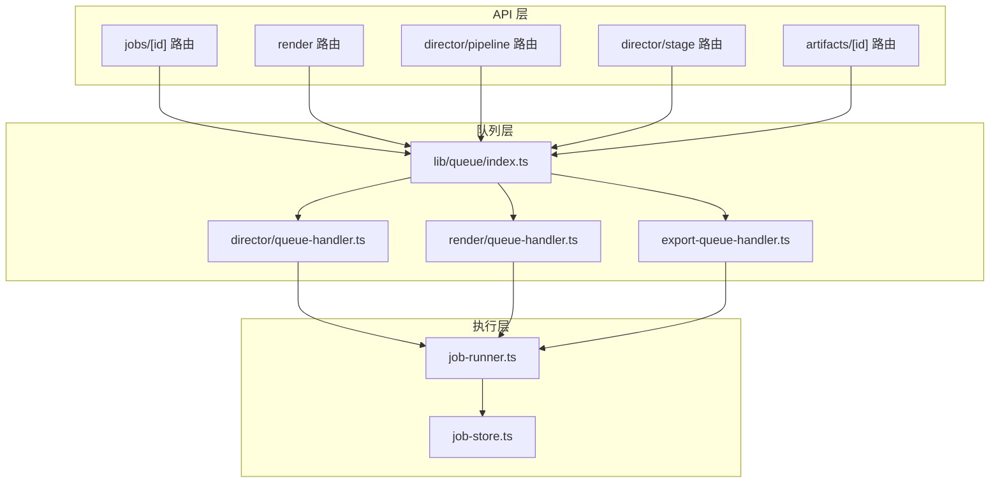
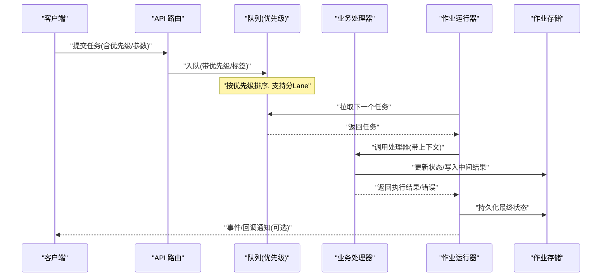
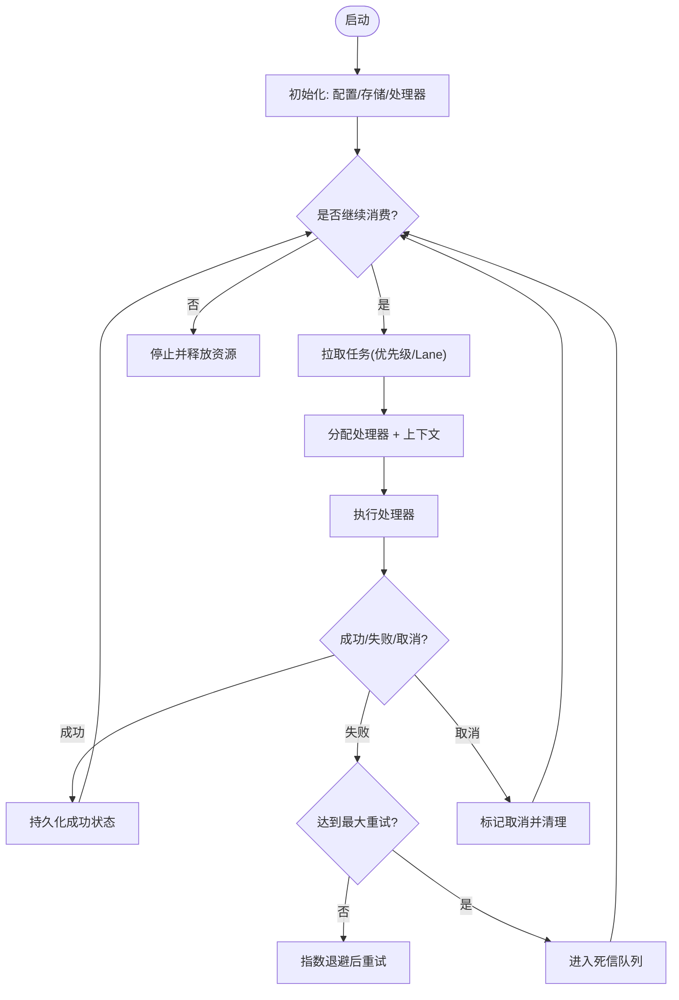
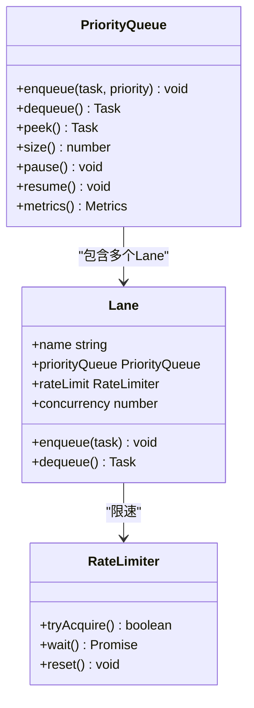
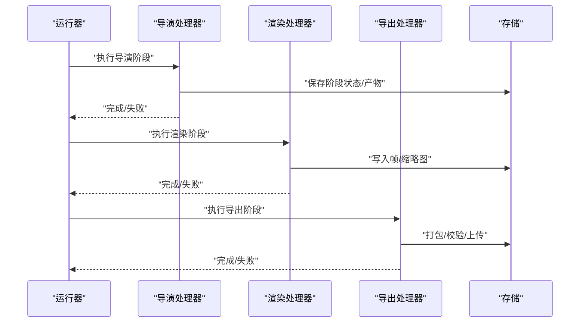
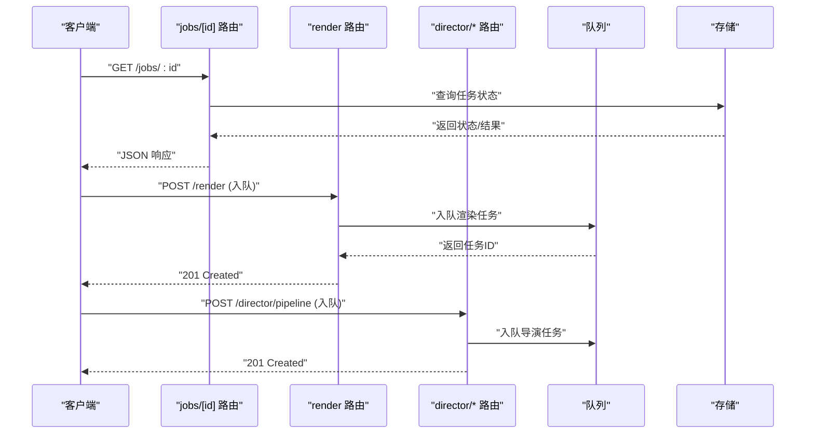
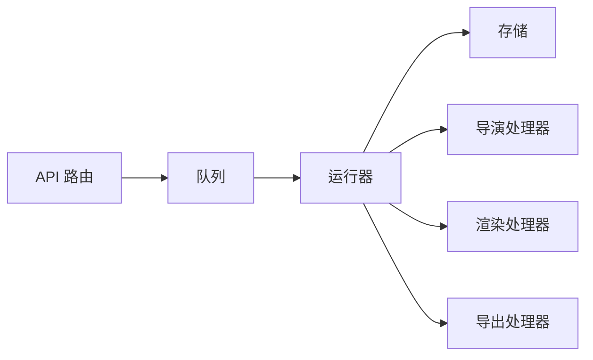

# 队列核心架构

<cite>
**本文引用的文件**   
- [server/src/server/job-runner.ts](file://server/src/server/job-runner.ts)
- [server/src/server/job-store.ts](file://server/src/server/job-store.ts)
- [src/features/director/queue-handler.ts](file://src/features/director/queue-handler.ts)
- [src/features/render/queue-handler.ts](file://src/features/render/queue-handler.ts)
- [src/features/render/export-queue-handler.ts](file://src/features/render/export-queue-handler.ts)
- [src/lib/queue/index.ts](file://src/lib/queue/index.ts)
- [src/app/api/jobs/[id]/route.ts](file://src/app/api/jobs/[id]/route.ts)
- [src/app/api/render/route.ts](file://src/app/api/render/route.ts)
- [src/app/api/director/pipeline/route.ts](file://src/app/api/director/pipeline/route.ts)
- [src/app/api/director/stage/route.ts](file://src/app/api/director/stage/route.ts)
- [src/app/api/artifacts/[id]/route.ts](file://src/app/api/artifacts/[id]/route.ts)
- [Dockerfile.worker](file://Dockerfile.worker)
- [deploy/compose.yaml](file://deploy/compose.yaml)
</cite>

## 目录
1. [简介](#简介)
2. [项目结构](#项目结构)
3. [核心组件](#核心组件)
4. [架构总览](#架构总览)
5. [详细组件分析](#详细组件分析)
6. [依赖关系分析](#依赖关系分析)
7. [性能考量](#性能考量)
8. [故障排查指南](#故障排查指南)
9. [结论](#结论)
10. [附录](#附录)

## 简介
本文件面向 PurpleInk 平台的“队列核心架构”，聚焦基于 Node.js 的异步任务处理体系，覆盖任务调度器、优先级队列实现与负载均衡策略；详述消费者生命周期管理、任务分发机制与并发控制；解释任务状态机设计、持久化存储方案与内存优化；并给出配置参数、性能调优指标、监控告警集成以及扩展性（水平扩容与故障恢复）的实现思路。

## 项目结构
队列相关代码主要分布在以下位置：
- 服务端作业运行与存储：server/src/server/job-runner.ts、server/src/server/job-store.ts
- 业务队列处理器：src/features/director/queue-handler.ts、src/features/render/queue-handler.ts、src/features/render/export-queue-handler.ts
- 通用队列能力：src/lib/queue/index.ts
- API 入口（入队与查询）：src/app/api/jobs/[id]/route.ts、src/app/api/render/route.ts、src/app/api/director/pipeline/route.ts、src/app/api/director/stage/route.ts、src/app/api/artifacts/[id]/route.ts
- Worker 容器与编排：Dockerfile.worker、deploy/compose.yaml

图表来源
- [src/lib/queue/index.ts](file://src/lib/queue/index.ts)
- [src/features/director/queue-handler.ts](file://src/features/director/queue-handler.ts)
- [src/features/render/queue-handler.ts](file://src/features/render/queue-handler.ts)
- [src/features/render/export-queue-handler.ts](file://src/features/render/export-queue-handler.ts)
- [server/src/server/job-runner.ts](file://server/src/server/job-runner.ts)
- [server/src/server/job-store.ts](file://server/src/server/job-store.ts)

章节来源
- [server/src/server/job-runner.ts](file://server/src/server/job-runner.ts)
- [server/src/server/job-store.ts](file://server/src/server/job-store.ts)
- [src/lib/queue/index.ts](file://src/lib/queue/index.ts)
- [src/features/director/queue-handler.ts](file://src/features/director/queue-handler.ts)
- [src/features/render/queue-handler.ts](file://src/features/render/queue-handler.ts)
- [src/features/render/export-queue-handler.ts](file://src/features/render/export-queue-handler.ts)
- [src/app/api/jobs/[id]/route.ts](file://src/app/api/jobs/[id]/route.ts)
- [src/app/api/render/route.ts](file://src/app/api/render/route.ts)
- [src/app/api/director/pipeline/route.ts](file://src/app/api/director/pipeline/route.ts)
- [src/app/api/director/stage/route.ts](file://src/app/api/director/stage/route.ts)
- [src/app/api/artifacts/[id]/route.ts](file://src/app/api/artifacts/[id]/route.ts)
- [Dockerfile.worker](file://Dockerfile.worker)
- [deploy/compose.yaml](file://deploy/compose.yaml)

## 核心组件
- 任务调度器（Job Runner）
  - 负责从队列拉取任务、分配给处理器、维护并发度、重试与失败回退、生命周期钩子。
- 优先级队列（Queue）
  - 提供按优先级出队的有序消费能力，支持多通道（lane）隔离与限流。
- 任务处理器（Queue Handlers）
  - 针对导演管线、渲染、导出等场景的具体业务逻辑封装。
- 作业存储（Job Store）
  - 持久化任务元数据、状态、结果与审计日志，保障幂等与可恢复。
- API 接入点
  - 统一暴露入队、查询进度、取消与结果获取接口。

章节来源
- [server/src/server/job-runner.ts](file://server/src/server/job-runner.ts)
- [src/lib/queue/index.ts](file://src/lib/queue/index.ts)
- [src/features/director/queue-handler.ts](file://src/features/director/queue-handler.ts)
- [src/features/render/queue-handler.ts](file://src/features/render/queue-handler.ts)
- [src/features/render/export-queue-handler.ts](file://src/features/render/export-queue-handler.ts)
- [server/src/server/job-store.ts](file://server/src/server/job-store.ts)

## 架构总览
整体采用“API 入队 → 队列缓冲 → 处理器执行业务 → 运行器编排 → 存储落盘”的分层模型。运行器作为消费者核心，协调优先级队列、处理器与存储，确保高吞吐与强一致。

图表来源
- [src/app/api/jobs/[id]/route.ts](file://src/app/api/jobs/[id]/route.ts)
- [src/app/api/render/route.ts](file://src/app/api/render/route.ts)
- [src/app/api/director/pipeline/route.ts](file://src/app/api/director/pipeline/route.ts)
- [src/app/api/director/stage/route.ts](file://src/app/api/director/stage/route.ts)
- [src/lib/queue/index.ts](file://src/lib/queue/index.ts)
- [src/features/director/queue-handler.ts](file://src/features/director/queue-handler.ts)
- [src/features/render/queue-handler.ts](file://src/features/render/queue-handler.ts)
- [src/features/render/export-queue-handler.ts](file://src/features/render/export-queue-handler.ts)
- [server/src/server/job-runner.ts](file://server/src/server/job-runner.ts)
- [server/src/server/job-store.ts](file://server/src/server/job-store.ts)

## 详细组件分析

### 任务调度器（Job Runner）
- 职责
  - 启动/停止消费者循环，维护并发度上限与背压。
  - 从队列拉取任务，调用处理器，捕获异常并重试。
  - 与存储交互，更新任务状态、记录审计信息。
- 关键流程
  - 初始化：加载配置、连接存储、注册处理器。
  - 拉取循环：按优先级/标签选择任务，设置超时与心跳。
  - 执行阶段：调用处理器，处理成功/失败/取消分支。
  - 收尾阶段：释放资源、上报指标、触发下游事件。
- 并发控制
  - 通过信号量或线程池限制同时运行的任务数，避免 OOM。
  - 支持按 Lane 隔离不同业务域，互不影响。
- 容错与重试
  - 指数退避重试，最大重试次数与死信队列兜底。
  - 幂等键去重，防止重复消费导致副作用。

图表来源
- [server/src/server/job-runner.ts](file://server/src/server/job-runner.ts)
- [server/src/server/job-store.ts](file://server/src/server/job-store.ts)

章节来源
- [server/src/server/job-runner.ts](file://server/src/server/job-runner.ts)
- [server/src/server/job-store.ts](file://server/src/server/job-store.ts)

### 优先级队列实现
- 数据结构
  - 使用优先堆/多级队列实现 O(log n) 插入与 O(1) 取最小值。
  - 支持多 Lane（如 director、render、export），每个 Lane 独立优先级。
- 调度策略
  - 全局权重 + 业务优先级，避免饥饿。
  - 支持抢占式与公平模式切换。
- 背压与限流
  - 基于令牌桶或滑动窗口限制每秒入队/出队速率。
  - 当队列长度超过阈值时拒绝新任务或延迟入队。
- 持久化与恢复
  - 将队列快照定期落盘，重启后快速恢复。
  - 支持断点续拉，避免重复消费。

图表来源
- [src/lib/queue/index.ts](file://src/lib/queue/index.ts)

章节来源
- [src/lib/queue/index.ts](file://src/lib/queue/index.ts)

### 任务处理器（Director / Render / Export）
- 导演管线处理器
  - 负责编排 AI 生成、脚本合成、素材准备等步骤。
  - 与运行时仓库交互，读写中间产物，推进阶段状态。
- 渲染处理器
  - 驱动浏览器/渲染引擎，生成帧序列、缩略图与视频。
  - 支持分片渲染与合并，失败自动重试。
- 导出处理器
  - 将渲染产物打包为最终交付物，上传至对象存储。
  - 校验完整性，生成签名链接。

图表来源
- [src/features/director/queue-handler.ts](file://src/features/director/queue-handler.ts)
- [src/features/render/queue-handler.ts](file://src/features/render/queue-handler.ts)
- [src/features/render/export-queue-handler.ts](file://src/features/render/export-queue-handler.ts)
- [server/src/server/job-runner.ts](file://server/src/server/job-runner.ts)

章节来源
- [src/features/director/queue-handler.ts](file://src/features/director/queue-handler.ts)
- [src/features/render/queue-handler.ts](file://src/features/render/queue-handler.ts)
- [src/features/render/export-queue-handler.ts](file://src/features/render/export-queue-handler.ts)

### 作业存储（Job Store）
- 功能
  - 任务元数据（ID、类型、优先级、参数、幂等键）。
  - 状态机字段（待处理、进行中、成功、失败、取消、死信）。
  - 结果与审计日志（阶段进度、错误栈、耗时）。
- 一致性
  - 使用事务保证状态转换原子性。
  - 乐观锁避免并发覆盖。
- 查询与索引
  - 按项目、任务类型、状态、时间范围高效检索。
  - 分页与游标查询，支撑前端实时面板。

章节来源
- [server/src/server/job-store.ts](file://server/src/server/job-store.ts)

### API 接入点（入队与查询）
- 入队接口
  - 接收请求体，校验参数，写入队列并返回任务 ID。
  - 支持批量入队与优先级覆盖。
- 查询接口
  - 根据任务 ID 获取状态、进度与结果。
  - 支持 SSE/WebSocket 推送进度变更。
- 取消与重试
  - 允许在“进行中”状态取消任务。
  - 失败任务支持手动重试。

图表来源
- [src/app/api/jobs/[id]/route.ts](file://src/app/api/jobs/[id]/route.ts)
- [src/app/api/render/route.ts](file://src/app/api/render/route.ts)
- [src/app/api/director/pipeline/route.ts](file://src/app/api/director/pipeline/route.ts)
- [src/app/api/director/stage/route.ts](file://src/app/api/director/stage/route.ts)
- [src/app/api/artifacts/[id]/route.ts](file://src/app/api/artifacts/[id]/route.ts)

章节来源
- [src/app/api/jobs/[id]/route.ts](file://src/app/api/jobs/[id]/route.ts)
- [src/app/api/render/route.ts](file://src/app/api/render/route.ts)
- [src/app/api/director/pipeline/route.ts](file://src/app/api/director/pipeline/route.ts)
- [src/app/api/director/stage/route.ts](file://src/app/api/director/stage/route.ts)
- [src/app/api/artifacts/[id]/route.ts](file://src/app/api/artifacts/[id]/route.ts)

## 依赖关系分析
- 组件耦合
  - 运行器依赖队列与存储，解耦业务处理器。
  - 处理器仅依赖运行器提供的上下文与存储接口。
- 外部依赖
  - 数据库/对象存储用于持久化与产物存放。
  - 消息总线（可选）用于跨进程/跨实例广播。
- 潜在环路
  - 处理器不应反向依赖运行器，避免循环调用。
- 接口契约
  - 处理器需遵循统一的输入输出与错误约定。

图表来源
- [src/lib/queue/index.ts](file://src/lib/queue/index.ts)
- [server/src/server/job-runner.ts](file://server/src/server/job-runner.ts)
- [server/src/server/job-store.ts](file://server/src/server/job-store.ts)
- [src/features/director/queue-handler.ts](file://src/features/director/queue-handler.ts)
- [src/features/render/queue-handler.ts](file://src/features/render/queue-handler.ts)
- [src/features/render/export-queue-handler.ts](file://src/features/render/export-queue-handler.ts)

章节来源
- [src/lib/queue/index.ts](file://src/lib/queue/index.ts)
- [server/src/server/job-runner.ts](file://server/src/server/job-runner.ts)
- [server/src/server/job-store.ts](file://server/src/server/job-store.ts)
- [src/features/director/queue-handler.ts](file://src/features/director/queue-handler.ts)
- [src/features/render/queue-handler.ts](file://src/features/render/queue-handler.ts)
- [src/features/render/export-queue-handler.ts](file://src/features/render/export-queue-handler.ts)

## 性能考量
- 并发与吞吐
  - 调整运行器并发度与队列速率限制，匹配 CPU/IO 能力。
  - 对 I/O 密集型任务启用异步非阻塞与连接池。
- 内存管理
  - 限制单任务内存上限，大对象流式处理。
  - 及时释放临时文件与缓存，避免泄漏。
- 存储优化
  - 批量写入与合并提交，减少写放大。
  - 热点数据缓存（如任务元数据）提升读性能。
- 监控与告警
  - 采集队列长度、出队速率、平均耗时、错误率、重试率。
  - 设置阈值告警（如队列积压 > N、错误率 > X%）。

[本节为通用指导，不直接分析具体文件]

## 故障排查指南
- 常见问题
  - 任务堆积：检查队列速率限制与运行器并发度。
  - 频繁重试：查看处理器错误日志与外部依赖健康状态。
  - 内存溢出：定位大对象处理路径，启用流式与分页。
- 诊断手段
  - 查看任务状态与审计日志，确认卡点阶段。
  - 使用指标面板观察队列与处理器负载。
  - 开启慢查询与采样日志定位瓶颈。
- 恢复策略
  - 重置失败任务到待处理状态，重新入队。
  - 清理死信队列中不可恢复的任务。

章节来源
- [server/src/server/job-runner.ts](file://server/src/server/job-runner.ts)
- [server/src/server/job-store.ts](file://server/src/server/job-store.ts)

## 结论
PurpleInk 的队列核心以“运行器 + 优先级队列 + 处理器 + 存储”的分层架构实现高可靠、可扩展的异步任务处理。通过严格的并发控制、幂等设计与持久化保障，满足导演、渲染与导出等多业务场景的高吞吐需求。配合完善的监控与告警，可在生产环境稳定运行并平滑扩容。

[本节为总结性内容，不直接分析具体文件]

## 附录
- 部署与扩缩容
  - Worker 容器镜像构建与运行参数。
  - 通过编排工具水平扩展 Worker 实例，结合队列分 Lane 与负载均衡。
- 配置参数建议
  - 运行器并发度、队列速率限制、重试次数与退避策略、超时与心跳间隔。
  - 存储连接池大小、缓存命中率目标。
- 监控指标清单
  - 队列长度、出队速率、平均耗时、P95/P99 耗时、错误率、重试率、死信数量。

章节来源
- [Dockerfile.worker](file://Dockerfile.worker)
- [deploy/compose.yaml](file://deploy/compose.yaml)