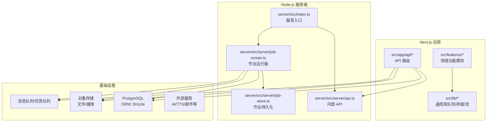
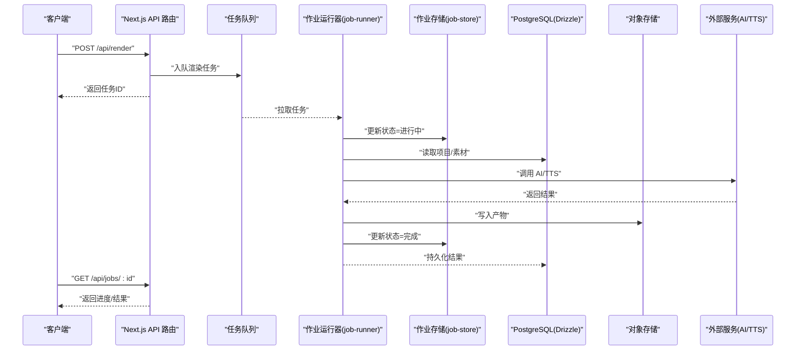
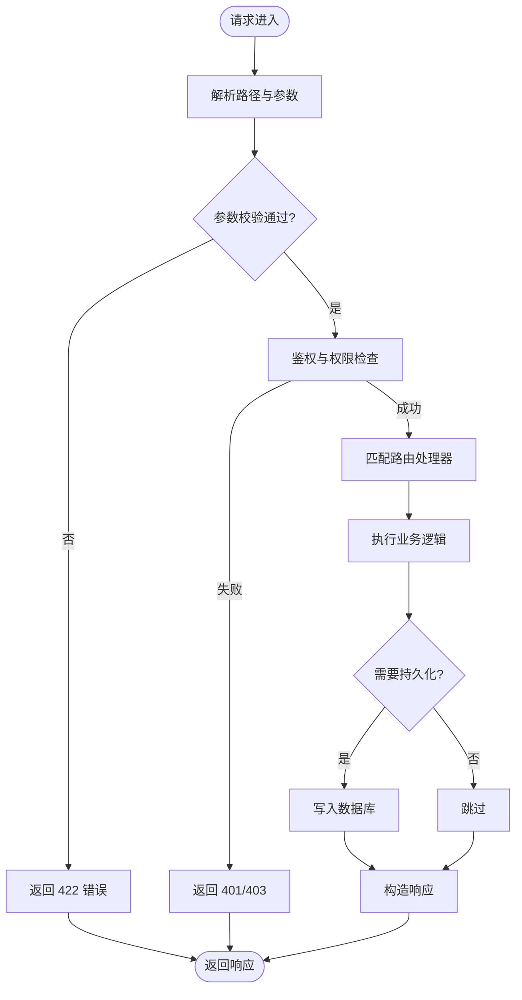
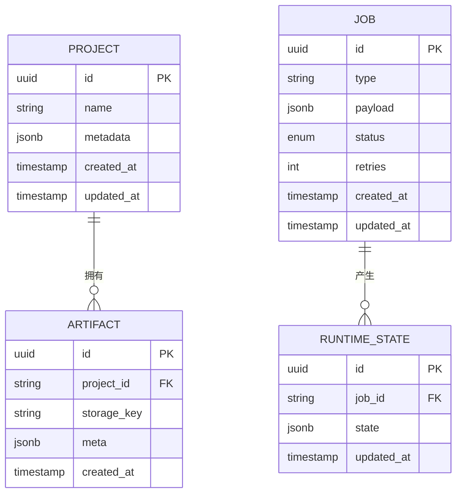
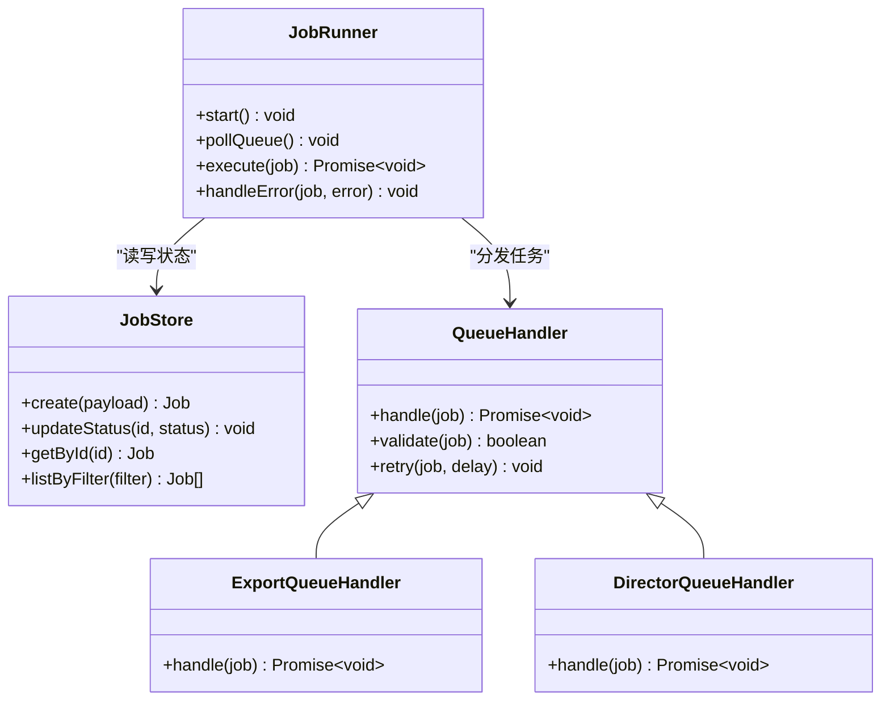
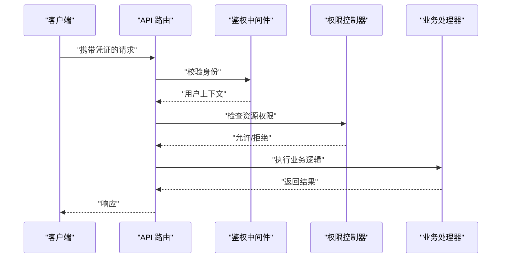
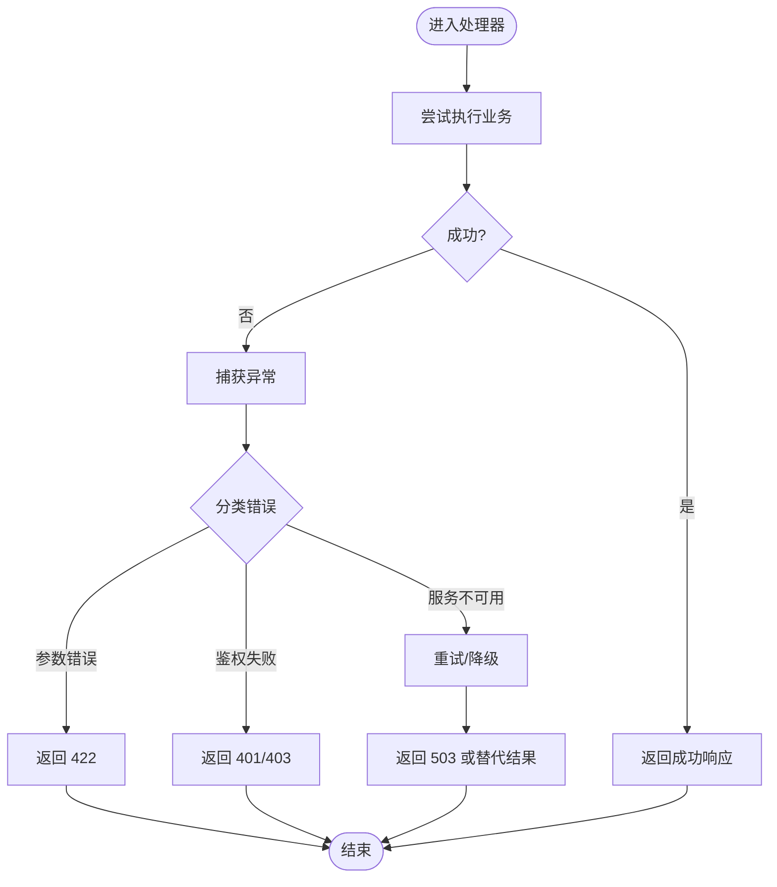
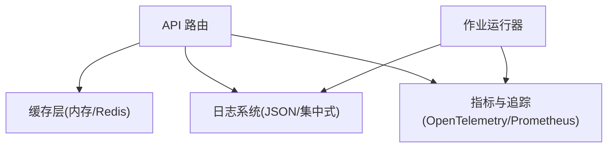
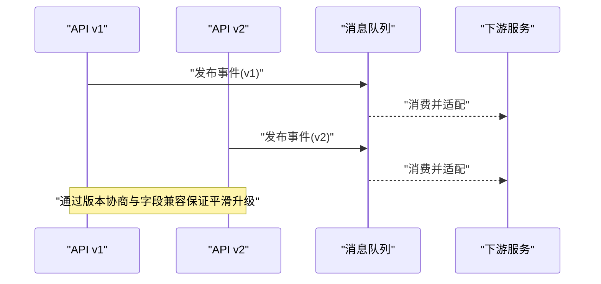
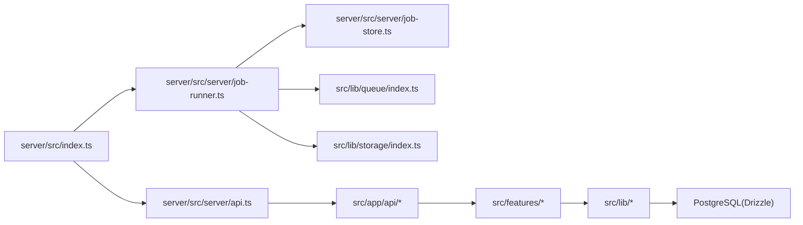

# 后端架构设计

<cite>
**本文档引用的文件**   
- [server/src/index.ts](file://server/src/index.ts)
- [server/src/server/api.ts](file://server/src/server/api.ts)
- [server/src/server/job-runner.ts](file://server/src/server/job-runner.ts)
- [server/src/server/job-store.ts](file://server/src/server/job-store.ts)
- [server/package.json](file://server/package.json)
- [drizzle.config.ts](file://drizzle.config.ts)
- [scripts/setup/db-migrate.ts](file://scripts/setup/db-migrate.ts)
- [scripts/setup/postgres-init.sql](file://scripts/setup/postgres-init.sql)
- [src/app/api/ping/route.ts](file://src/app/api/ping/route.ts)
- [src/app/api/projects/route.ts](file://src/app/api/projects/route.ts)
- [src/app/api/render/route.ts](file://src/app/api/render/route.ts)
- [src/app/api/director/pipeline/route.ts](file://src/app/api/director/pipeline/route.ts)
- [src/app/api/jobs/[id]/route.ts](file://src/app/api/jobs/[id]/route.ts)
- [src/features/director/queue-handler.ts](file://src/features/director/queue-handler.ts)
- [src/features/render/export-queue-handler.ts](file://src/features/render/export-queue-handler.ts)
- [src/lib/queue/index.ts](file://src/lib/queue/index.ts)
- [src/lib/storage/index.ts](file://src/lib/storage/index.ts)
- [src/lib/stream/index.ts](file://src/lib/stream/index.ts)
- [src/instrumentation.ts](file://src/instrumentation.ts)
- [deploy/compose.yaml](file://deploy/compose.yaml)
- [deploy/env.example](file://deploy/env.example)
- [deploy/worker.env.example](file://deploy/worker.env.example)
</cite>

## 目录
1. [简介](#简介)
2. [项目结构](#项目结构)
3. [核心组件](#核心组件)
4. [架构总览](#架构总览)
5. [详细组件分析](#详细组件分析)
6. [依赖关系分析](#依赖关系分析)
7. [性能考量](#性能考量)
8. [故障排查指南](#故障排查指南)
9. [结论](#结论)
10. [附录](#附录)

## 简介
本文件为 PurpleInk 平台的后端架构设计文档，聚焦基于 Node.js 的后端服务。内容涵盖 API 路由设计、中间件管道与请求处理流程；数据库 ORM 层设计与数据模型抽象；异步任务处理、队列系统与后台作业管理；认证授权与安全策略；错误处理模式；缓存策略、日志记录与监控集成；微服务通信、API 版本管理与向后兼容性保证。文档面向技术与非技术读者，力求以循序渐进的方式呈现系统全貌与关键实现细节。

## 项目结构
PurpleInk 采用前后端分离的 Next.js 应用与独立服务端进程组合：
- server 子工程：独立的 Node.js 服务，提供运行时能力（采集、编排、渲染、TTS 等）与作业执行器。
- src 目录：Next.js 应用代码，包含 API 路由、页面与业务逻辑。
- scripts：迁移、初始化与验证脚本。
- deploy：容器化部署配置与环境模板。

**图示来源** 
- [server/src/index.ts](file://server/src/index.ts)
- [server/src/server/api.ts](file://server/src/server/api.ts)
- [server/src/server/job-runner.ts](file://server/src/server/job-runner.ts)
- [server/src/server/job-store.ts](file://server/src/server/job-store.ts)
- [drizzle.config.ts](file://drizzle.config.ts)
- [src/lib/queue/index.ts](file://src/lib/queue/index.ts)
- [src/lib/storage/index.ts](file://src/lib/storage/index.ts)

**章节来源**
- [server/package.json](file://server/package.json)
- [drizzle.config.ts](file://drizzle.config.ts)
- [deploy/compose.yaml](file://deploy/compose.yaml)

## 核心组件
- API 路由层：Next.js App Router 暴露 RESTful 接口，统一参数校验、鉴权与错误处理。
- 作业执行器：job-runner 负责从队列拉取任务、调度阶段执行、状态回写与重试。
- 作业存储：job-store 提供作业元数据与状态的持久化（PostgreSQL）。
- 领域服务：director、render、audio、artifacts 等模块封装业务规则与外部调用。
- 基础设施库：queue、storage、stream 提供跨模块复用能力。
- 数据库 ORM：Drizzle 定义表结构与查询，配合迁移脚本保障一致性。

**章节来源**
- [src/app/api/render/route.ts](file://src/app/api/render/route.ts)
- [src/app/api/director/pipeline/route.ts](file://src/app/api/director/pipeline/route.ts)
- [src/features/director/queue-handler.ts](file://src/features/director/queue-handler.ts)
- [src/features/render/export-queue-handler.ts](file://src/features/render/export-queue-handler.ts)
- [server/src/server/job-runner.ts](file://server/src/server/job-runner.ts)
- [server/src/server/job-store.ts](file://server/src/server/job-store.ts)
- [drizzle.config.ts](file://drizzle.config.ts)

## 架构总览
整体采用“前端 API 路由 + 后端作业执行器”的分层架构：
- 请求进入 Next.js API 路由，进行鉴权、校验后入队或直接调用领域服务。
- 耗时任务通过队列交由 job-runner 异步执行，支持分阶段推进与状态回写。
- 数据访问通过 Drizzle ORM 与 PostgreSQL，结合迁移脚本确保 schema 演进。
- 外部依赖（AI、TTS、对象存储）通过适配器与重试机制隔离。

**图示来源** 
- [src/app/api/render/route.ts](file://src/app/api/render/route.ts)
- [src/app/api/jobs/[id]/route.ts](file://src/app/api/jobs/[id]/route.ts)
- [src/features/render/export-queue-handler.ts](file://src/features/render/export-queue-handler.ts)
- [server/src/server/job-runner.ts](file://server/src/server/job-runner.ts)
- [server/src/server/job-store.ts](file://server/src/server/job-store.ts)
- [drizzle.config.ts](file://drizzle.config.ts)

## 详细组件分析

### API 路由设计与请求处理流程
- 路由组织：按资源划分目录（如 projects、render、director），使用动态段（[id]）表达实体操作。
- 请求处理：参数校验、鉴权、限流、日志记录、错误归一化。
- 响应格式：统一 JSON 结构，包含数据、分页、错误码与追踪 ID。
- 版本管理：通过 URL 前缀或 Header 控制版本，保持向后兼容。

**图示来源** 
- [src/app/api/projects/route.ts](file://src/app/api/projects/route.ts)
- [src/app/api/render/route.ts](file://src/app/api/render/route.ts)
- [src/app/api/jobs/[id]/route.ts](file://src/app/api/jobs/[id]/route.ts)

**章节来源**
- [src/app/api/ping/route.ts](file://src/app/api/ping/route.ts)
- [src/app/api/projects/route.ts](file://src/app/api/projects/route.ts)
- [src/app/api/render/route.ts](file://src/app/api/render/route.ts)
- [src/app/api/director/pipeline/route.ts](file://src/app/api/director/pipeline/route.ts)
- [src/app/api/jobs/[id]/route.ts](file://src/app/api/jobs/[id]/route.ts)

### 数据库 ORM 层设计与数据模型抽象
- ORM 选型：Drizzle 提供类型安全的 SQL 构建与迁移工具。
- 模型抽象：将领域实体映射为表结构，定义索引与约束，避免 N+1 查询。
- 查询优化：使用连接查询、选择性字段投影、分页与缓存热点数据。
- 迁移策略：脚本驱动（db-migrate）与 SQL 初始化（postgres-init.sql）结合，保证环境一致性。

**图示来源** 
- [drizzle.config.ts](file://drizzle.config.ts)
- [scripts/setup/db-migrate.ts](file://scripts/setup/db-migrate.ts)
- [scripts/setup/postgres-init.sql](file://scripts/setup/postgres-init.sql)

**章节来源**
- [drizzle.config.ts](file://drizzle.config.ts)
- [scripts/setup/db-migrate.ts](file://scripts/setup/db-migrate.ts)
- [scripts/setup/postgres-init.sql](file://scripts/setup/postgres-init.sql)

### 异步任务处理、队列系统与后台作业管理
- 队列设计：任务类型化（渲染、导出、采集等），支持优先级与重试策略。
- 作业运行器：job-runner 拉取任务、分阶段执行、状态回写与异常恢复。
- 作业存储：job-store 维护作业元数据、阶段状态与产物引用。
- 消费者：各领域的 queue-handler 实现具体任务处理逻辑（如 director、render）。

**图示来源** 
- [server/src/server/job-runner.ts](file://server/src/server/job-runner.ts)
- [server/src/server/job-store.ts](file://server/src/server/job-store.ts)
- [src/features/render/export-queue-handler.ts](file://src/features/render/export-queue-handler.ts)
- [src/features/director/queue-handler.ts](file://src/features/director/queue-handler.ts)

**章节来源**
- [server/src/server/job-runner.ts](file://server/src/server/job-runner.ts)
- [server/src/server/job-store.ts](file://server/src/server/job-store.ts)
- [src/features/render/export-queue-handler.ts](file://src/features/render/export-queue-handler.ts)
- [src/features/director/queue-handler.ts](file://src/features/director/queue-handler.ts)

### 认证授权架构与 API 安全策略
- 认证：基于会话或 JWT 的身份校验，支持多租户隔离。
- 授权：资源级权限控制（RBAC），对敏感操作进行二次校验。
- 安全：输入校验、输出过滤、速率限制、CORS 与 CSRF 防护。
- 审计：关键操作日志与追踪 ID 贯穿请求链路。

**图示来源** 
- [src/app/api/projects/route.ts](file://src/app/api/projects/route.ts)
- [src/app/api/render/route.ts](file://src/app/api/render/route.ts)

**章节来源**
- [src/app/api/projects/route.ts](file://src/app/api/projects/route.ts)
- [src/app/api/render/route.ts](file://src/app/api/render/route.ts)

### 错误处理模式
- 统一错误码：HTTP 状态码与业务错误码分层。
- 异常捕获：全局错误边界与未捕获异常保护。
- 重试与降级：对外部依赖调用设置超时、重试与熔断。
- 可观测性：结构化日志与指标上报。

**图示来源** 
- [src/app/api/render/route.ts](file://src/app/api/render/route.ts)
- [src/app/api/jobs/[id]/route.ts](file://src/app/api/jobs/[id]/route.ts)

**章节来源**
- [src/app/api/render/route.ts](file://src/app/api/render/route.ts)
- [src/app/api/jobs/[id]/route.ts](file://src/app/api/jobs/[id]/route.ts)

### 缓存策略、日志记录与监控集成
- 缓存：热点数据（项目列表、配置）使用内存/Redis 缓存，设置过期与失效策略。
- 日志：结构化日志（JSON），包含请求 ID、用户、耗时与错误堆栈。
- 监控：指标收集（QPS、延迟、错误率）、分布式追踪与告警。

**图示来源** 
- [src/instrumentation.ts](file://src/instrumentation.ts)
- [src/lib/stream/index.ts](file://src/lib/stream/index.ts)

**章节来源**
- [src/instrumentation.ts](file://src/instrumentation.ts)
- [src/lib/stream/index.ts](file://src/lib/stream/index.ts)

### 微服务通信、API 版本管理与向后兼容性
- 微服务通信：通过 HTTP/gRPC 与消息队列解耦，定义稳定契约与幂等键。
- 版本管理：URL 前缀（/v1/）或 Header（X-API-Version）控制版本。
- 兼容性：废弃字段保留、新增字段可选、灰度发布与回滚策略。

**图示来源** 
- [src/app/api/render/route.ts](file://src/app/api/render/route.ts)
- [src/app/api/director/pipeline/route.ts](file://src/app/api/director/pipeline/route.ts)

**章节来源**
- [src/app/api/render/route.ts](file://src/app/api/render/route.ts)
- [src/app/api/director/pipeline/route.ts](file://src/app/api/director/pipeline/route.ts)

## 依赖关系分析
- 服务入口：server/src/index.ts 启动 HTTP 服务与作业运行器。
- 内部 API：server/src/server/api.ts 提供进程内或跨进程调用。
- 作业执行：job-runner 依赖 job-store、队列与外部服务。
- 领域模块：director、render、audio 等通过 lib 库共享能力。
- 数据库：Drizzle 配置与迁移脚本驱动 schema 演进。

**图示来源** 
- [server/src/index.ts](file://server/src/index.ts)
- [server/src/server/api.ts](file://server/src/server/api.ts)
- [server/src/server/job-runner.ts](file://server/src/server/job-runner.ts)
- [server/src/server/job-store.ts](file://server/src/server/job-store.ts)
- [src/lib/queue/index.ts](file://src/lib/queue/index.ts)
- [src/lib/storage/index.ts](file://src/lib/storage/index.ts)

**章节来源**
- [server/src/index.ts](file://server/src/index.ts)
- [server/src/server/api.ts](file://server/src/server/api.ts)
- [server/src/server/job-runner.ts](file://server/src/server/job-runner.ts)
- [server/src/server/job-store.ts](file://server/src/server/job-store.ts)
- [src/lib/queue/index.ts](file://src/lib/queue/index.ts)
- [src/lib/storage/index.ts](file://src/lib/storage/index.ts)

## 性能考量
- 数据库：合理索引、连接池、批量写入与事务边界控制。
- 队列：并发消费、背压与死信队列处理。
- 缓存：多级缓存（内存/Redis）与缓存穿透/雪崩防护。
- I/O：流式处理大文件、异步并行与超时控制。
- 监控：延迟与吞吐指标、慢查询分析与容量规划。

[本节为通用指导，不直接分析具体文件]

## 故障排查指南
- 常见问题：队列积压、作业失败重试风暴、数据库锁竞争、外部服务超时。
- 诊断手段：查看作业状态、错误日志、指标面板与分布式追踪。
- 修复策略：扩容消费者、调整重试退避、优化查询与增加熔断。

**章节来源**
- [server/src/server/job-runner.ts](file://server/src/server/job-runner.ts)
- [server/src/server/job-store.ts](file://server/src/server/job-store.ts)
- [src/app/api/jobs/[id]/route.ts](file://src/app/api/jobs/[id]/route.ts)

## 结论
PurpleInK 后端以 Next.js API 路由与 Node.js 作业执行器为核心，结合 Drizzle ORM、队列系统与对象存储，构建了可扩展、可观测且高可用的媒体生产流水线。通过清晰的职责划分、稳健的错误处理与完善的监控体系，平台能够支撑复杂的多阶段任务与外部服务集成，同时保证 API 版本兼容与平滑演进。

[本节为总结性内容，不直接分析具体文件]

## 附录
- 部署与环境：参考 compose.yaml 与 env 模板，配置数据库、队列与对象存储。
- 迁移与初始化：使用 db-migrate 与 postgres-init.sql 初始化环境。
- 测试与验证：e2e 与单元测试覆盖关键路径，确保稳定性。

**章节来源**
- [deploy/compose.yaml](file://deploy/compose.yaml)
- [deploy/env.example](file://deploy/env.example)
- [deploy/worker.env.example](file://deploy/worker.env.example)
- [scripts/setup/db-migrate.ts](file://scripts/setup/db-migrate.ts)
- [scripts/setup/postgres-init.sql](file://scripts/setup/postgres-init.sql)