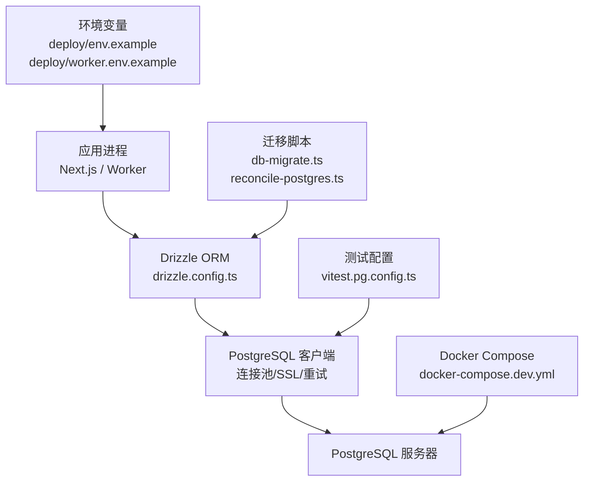
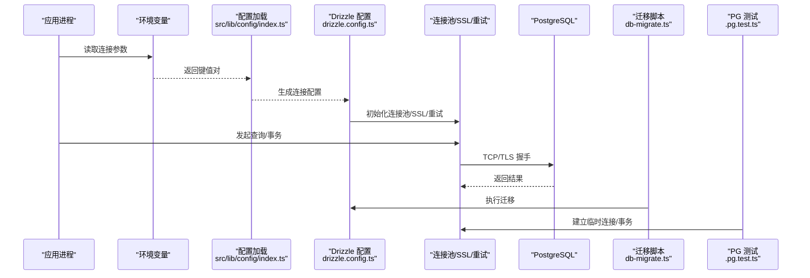
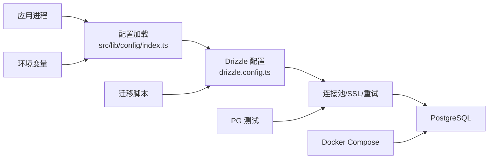

# ORM 配置与连接管理

<cite>
**本文引用的文件**   
- [drizzle.config.ts](file://drizzle.config.ts)
- [package.json](file://package.json)
- [docker-compose.dev.yml](file://docker-compose.dev.yml)
- [deploy/compose.yaml](file://deploy/compose.yaml)
- [deploy/env.example](file://deploy/env.example)
- [deploy/worker.env.example](file://deploy/worker.env.example)
- [scripts/setup/db-migrate.ts](file://scripts/setup/db-migrate.ts)
- [scripts/migration/reconcile-postgres.ts](file://scripts/migration/reconcile-postgres.ts)
- [src/lib/config/index.ts](file://src/lib/config/index.ts)
- [src/features/render/cache.pg.test.ts](file://src/features/render/cache.pg.test.ts)
- [src/features/audio/runtime-repository.pg.test.ts](file://src/features/audio/runtime-repository.pg.test.ts)
- [src/features/director/runtime-repository.pg.test.ts](file://src/features/director/runtime-repository.pg.test.ts)
- [src/features/routing/media-route-repository.pg.test.ts](file://src/features/routing/media-route-repository.pg.test.ts)
- [src/features/routing/model-route-repository.pg.test.ts](file://src/features/routing/model-route-repository.pg.test.ts)
- [vitest.pg.config.ts](file://vitest.pg.config.ts)
</cite>

## 目录
1. [简介](#简介)
2. [项目结构](#项目结构)
3. [核心组件](#核心组件)
4. [架构总览](#架构总览)
5. [详细组件分析](#详细组件分析)
6. [依赖关系分析](#依赖关系分析)
7. [性能考虑](#性能考虑)
8. [故障排查指南](#故障排查指南)
9. [结论](#结论)
10. [附录](#附录)

## 简介
本文件面向 PurpleInk 平台，系统性梳理 Drizzle ORM 的配置、数据库连接池与连接生命周期管理，重点覆盖 PostgreSQL 连接参数、SSL 设置、连接重试机制、环境变量与连接字符串格式、多环境部署策略，以及连接监控、性能调优与故障恢复的最佳实践。文档同时给出连接泄漏防护、超时配置与资源清理策略的落地建议，帮助读者在生产环境中稳定、高效地使用 Drizzle + PostgreSQL。

## 项目结构
本项目采用 Next.js 应用与独立 Worker/脚本的组合方式，Drizzle ORM 通过配置文件集中管理迁移与连接参数；测试与运行期通过环境变量注入连接信息；PostgreSQL 服务由 Docker Compose 编排。关键位置如下：
- Drizzle 配置入口：根目录 drizzle.config.ts
- 包管理与脚本：package.json（含迁移与构建脚本）
- 开发/部署编排：docker-compose.dev.yml、deploy/compose.yaml
- 环境变量示例：deploy/env.example、deploy/worker.env.example
- 迁移与数据一致性脚本：scripts/setup/db-migrate.ts、scripts/migration/reconcile-postgres.ts
- 运行时配置加载：src/lib/config/index.ts
- PostgreSQL 集成测试：多个 .pg.test.ts 文件用于验证连接与事务行为

图表来源
- [drizzle.config.ts](file://drizzle.config.ts)
- [docker-compose.dev.yml](file://docker-compose.dev.yml)
- [deploy/compose.yaml](file://deploy/compose.yaml)
- [deploy/env.example](file://deploy/env.example)
- [deploy/worker.env.example](file://deploy/worker.env.example)
- [scripts/setup/db-migrate.ts](file://scripts/setup/db-migrate.ts)
- [scripts/migration/reconcile-postgres.ts](file://scripts/migration/reconcile-postgres.ts)
- [vitest.pg.config.ts](file://vitest.pg.config.ts)

章节来源
- [drizzle.config.ts](file://drizzle.config.ts)
- [package.json](file://package.json)
- [docker-compose.dev.yml](file://docker-compose.dev.yml)
- [deploy/compose.yaml](file://deploy/compose.yaml)
- [deploy/env.example](file://deploy/env.example)
- [deploy/worker.env.example](file://deploy/worker.env.example)
- [scripts/setup/db-migrate.ts](file://scripts/setup/db-migrate.ts)
- [scripts/migration/reconcile-postgres.ts](file://scripts/migration/reconcile-postgres.ts)
- [vitest.pg.config.ts](file://vitest.pg.config.ts)

## 核心组件
- Drizzle 配置中心：通过 drizzle.config.ts 统一声明数据库连接、迁移路径、驱动类型等，确保开发与生产一致。
- 环境变量与连接字符串：使用 deploy/env.example 与 deploy/worker.env.example 提供标准变量名，便于在不同环境复用。
- 迁移与一致性工具：db-migrate.ts 负责执行迁移；reconcile-postgres.ts 用于校验或修复数据一致性。
- 运行时配置加载：src/lib/config/index.ts 负责读取并校验环境变量，为 ORM 初始化提供输入。
- PostgreSQL 集成测试：多个 .pg.test.ts 文件验证连接、事务、并发与错误处理。

章节来源
- [drizzle.config.ts](file://drizzle.config.ts)
- [deploy/env.example](file://deploy/env.example)
- [deploy/worker.env.example](file://deploy/worker.env.example)
- [scripts/setup/db-migrate.ts](file://scripts/setup/db-migrate.ts)
- [scripts/migration/reconcile-postgres.ts](file://scripts/migration/reconcile-postgres.ts)
- [src/lib/config/index.ts](file://src/lib/config/index.ts)
- [src/features/render/cache.pg.test.ts](file://src/features/render/cache.pg.test.ts)
- [src/features/audio/runtime-repository.pg.test.ts](file://src/features/audio/runtime-repository.pg.test.ts)
- [src/features/director/runtime-repository.pg.test.ts](file://src/features/director/runtime-repository.pg.test.ts)
- [src/features/routing/media-route-repository.pg.test.ts](file://src/features/routing/media-route-repository.pg.test.ts)
- [src/features/routing/model-route-repository.pg.test.ts](file://src/features/routing/model-route-repository.pg.test.ts)

## 架构总览
下图展示从应用进程到数据库的连接链路，包括环境变量注入、Drizzle 配置、连接池与 SSL 设置、迁移与测试流程。

图表来源
- [src/lib/config/index.ts](file://src/lib/config/index.ts)
- [drizzle.config.ts](file://drizzle.config.ts)
- [scripts/setup/db-migrate.ts](file://scripts/setup/db-migrate.ts)
- [src/features/render/cache.pg.test.ts](file://src/features/render/cache.pg.test.ts)

## 详细组件分析

### Drizzle 配置与连接池
- 配置目标：在 drizzle.config.ts 中定义数据库驱动、连接字符串或参数对象、迁移目录、SQL 输出等。
- 连接池要点：
  - 最大连接数：根据业务峰值 QPS 与平均延迟估算，避免耗尽数据库资源。
  - 最小连接数：保持基础空闲连接，降低冷启动延迟。
  - 空闲超时：及时回收长期不用的连接，减少内存占用。
  - 获取连接超时：防止请求阻塞导致雪崩。
- SSL 设置：
  - 强制 TLS：生产环境启用 ssl=true，并校验证书链。
  - 自定义 CA：通过环境变量注入 CA 证书路径或内容。
  - 客户端证书：如需双向认证，配置 clientCert/clientKey。
- 重试机制：
  - 网络抖动重试：针对瞬态错误（如连接中断、锁等待）进行有限次重试。
  - 幂等性保障：仅对读操作或明确幂等的写操作启用自动重试。
  - 退避策略：指数退避+抖动，避免惊群效应。

章节来源
- [drizzle.config.ts](file://drizzle.config.ts)

### 环境变量与连接字符串
- 变量命名规范：
  - DATABASE_URL：完整连接字符串，包含协议、主机、端口、库名、用户、密码及可选参数（sslmode、connect_timeout 等）。
  - DB_HOST、DB_PORT、DB_NAME、DB_USER、DB_PASSWORD：拆分式配置，便于不同环境替换。
  - DB_SSL_MODE：off、allow、prefer、require、verify-ca、verify-full。
  - DB_CA_CERT、DB_CLIENT_CERT、DB_CLIENT_KEY：证书相关参数。
- 连接字符串格式化：
  - 必须转义特殊字符（如密码中的 @、:、? 等）。
  - 参数顺序不影响解析，但建议固定顺序提升可读性。
- 多环境部署：
  - 开发：本地 docker-compose.dev.yml 启动 PostgreSQL，使用宽松安全策略。
  - 预发/生产：严格 SSL 模式、只读副本、连接池上限收紧。
  - Worker 进程：通过 worker.env.example 隔离任务型负载的连接参数。

章节来源
- [deploy/env.example](file://deploy/env.example)
- [deploy/worker.env.example](file://deploy/worker.env.example)
- [docker-compose.dev.yml](file://docker-compose.dev.yml)
- [deploy/compose.yaml](file://deploy/compose.yaml)

### 迁移与数据一致性
- 迁移执行：
  - db-migrate.ts 负责拉取最新迁移并应用到目标数据库。
  - 建议在容器启动前或健康检查后执行，确保 schema 就绪。
- 数据一致性：
  - reconcile-postgres.ts 可用于比对期望状态与实际状态，修复不一致。
  - 结合事务保证批量操作的原子性。

章节来源
- [scripts/setup/db-migrate.ts](file://scripts/setup/db-migrate.ts)
- [scripts/migration/reconcile-postgres.ts](file://scripts/migration/reconcile-postgres.ts)

### 运行时配置加载
- src/lib/config/index.ts 负责：
  - 读取环境变量并进行类型校验。
  - 合并默认值与环境覆盖。
  - 暴露统一的配置接口给 ORM 初始化模块。
- 最佳实践：
  - 启动时打印关键配置摘要（脱敏），便于排障。
  - 对缺失或非法配置快速失败，避免隐式降级。

章节来源
- [src/lib/config/index.ts](file://src/lib/config/index.ts)

### PostgreSQL 集成测试与连接生命周期
- 测试用例覆盖：
  - cache.pg.test.ts、runtime-repository.pg.test.ts、media-route-repository.pg.test.ts、model-route-repository.pg.test.ts 等验证连接、事务、并发与错误处理。
- 连接生命周期：
  - 测试前建立连接，测试后释放；每个测试用例可拥有独立事务以隔离数据。
  - 使用 vitest.pg.config.ts 指定测试环境的连接参数与钩子。

章节来源
- [src/features/render/cache.pg.test.ts](file://src/features/render/cache.pg.test.ts)
- [src/features/audio/runtime-repository.pg.test.ts](file://src/features/audio/runtime-repository.pg.test.ts)
- [src/features/director/runtime-repository.pg.test.ts](file://src/features/director/runtime-repository.pg.test.ts)
- [src/features/routing/media-route-repository.pg.test.ts](file://src/features/routing/media-route-repository.pg.test.ts)
- [src/features/routing/model-route-repository.pg.test.ts](file://src/features/routing/model-route-repository.pg.test.ts)
- [vitest.pg.config.ts](file://vitest.pg.config.ts)

### 连接监控与可观测性
- 指标采集：
  - 连接池大小、活跃连接数、等待队列长度、平均响应时间、错误率。
  - 通过数据库客户端或中间件上报至监控系统。
- 日志记录：
  - 记录连接建立/关闭、慢查询、重试次数与原因。
  - 敏感信息脱敏（如密码、令牌）。
- 告警规则：
  - 连接池耗尽、SSL 握手失败、连续重试超过阈值、慢查询比例升高。

[本节为通用指导，无需特定文件来源]

### 性能调优与资源清理
- 连接池调优：
  - 根据 CPU 核数与 I/O 能力设定 maxConnections。
  - 调整 idleTimeoutMs 与 acquireTimeoutMs，平衡延迟与资源占用。
- 查询优化：
  - 合理使用索引、分页与批处理。
  - 避免 N+1 查询，使用 JOIN 或批量加载。
- 资源清理：
  - 应用退出时优雅关闭连接池，等待未完成任务完成。
  - 测试中使用 beforeAll/afterAll 钩子管理连接。

[本节为通用指导，无需特定文件来源]

### 连接泄漏防护与超时配置
- 泄漏防护：
  - 所有查询包裹在 try/finally 中确保释放。
  - 使用事务边界明确获取与释放时机。
  - 引入连接审计日志，定位长时间持有的连接。
- 超时配置：
  - connectTimeoutMs：连接建立超时。
  - queryTimeoutMs：单条查询超时。
  - transactionTimeoutMs：事务整体超时。
  - idleTimeoutMs：空闲连接回收。

[本节为通用指导，无需特定文件来源]

## 依赖关系分析
- 应用进程依赖 Drizzle 配置与运行时配置加载模块。
- Drizzle 配置依赖环境变量提供的连接参数。
- 迁移与测试脚本依赖 Drizzle CLI 与 PostgreSQL 客户端。
- Docker Compose 提供数据库服务与网络连通性。

图表来源
- [src/lib/config/index.ts](file://src/lib/config/index.ts)
- [drizzle.config.ts](file://drizzle.config.ts)
- [scripts/setup/db-migrate.ts](file://scripts/setup/db-migrate.ts)
- [src/features/render/cache.pg.test.ts](file://src/features/render/cache.pg.test.ts)
- [docker-compose.dev.yml](file://docker-compose.dev.yml)
- [deploy/env.example](file://deploy/env.example)

章节来源
- [package.json](file://package.json)
- [docker-compose.dev.yml](file://docker-compose.dev.yml)
- [deploy/compose.yaml](file://deploy/compose.yaml)
- [deploy/env.example](file://deploy/env.example)
- [deploy/worker.env.example](file://deploy/worker.env.example)
- [scripts/setup/db-migrate.ts](file://scripts/setup/db-migrate.ts)
- [scripts/migration/reconcile-postgres.ts](file://scripts/migration/reconcile-postgres.ts)
- [src/lib/config/index.ts](file://src/lib/config/index.ts)
- [drizzle.config.ts](file://drizzle.config.ts)
- [vitest.pg.config.ts](file://vitest.pg.config.ts)

## 性能考虑
- 连接池容量与延迟权衡：增大池大小可降低排队延迟，但会增加数据库负载与上下文切换成本。
- SSL 开销：TLS 握手与加密带来 CPU 与网络开销，建议使用硬件加速或会话复用。
- 慢查询治理：定期分析慢查询日志，优化 SQL 与索引。
- 缓存策略：热点数据使用 Redis 或内存缓存，减轻数据库压力。
- 读写分离：读多写少场景使用只读副本，提升吞吐。

[本节为通用指导，无需特定文件来源]

## 故障排查指南
- 连接失败：
  - 检查环境变量是否正确注入，连接字符串是否合法。
  - 确认防火墙与安全组允许访问数据库端口。
  - 查看 SSL 证书链与版本兼容性。
- 连接池耗尽：
  - 监控活跃连接与等待队列，定位未释放连接的代码路径。
  - 增加池大小或优化查询耗时。
- 事务超时：
  - 分析长事务与锁竞争，拆分或优化事务边界。
- 重试风暴：
  - 调整重试次数与退避策略，避免雪崩。
- 迁移失败：
  - 回滚到上一版本，检查迁移脚本幂等性与依赖。

章节来源
- [scripts/setup/db-migrate.ts](file://scripts/setup/db-migrate.ts)
- [scripts/migration/reconcile-postgres.ts](file://scripts/migration/reconcile-postgres.ts)
- [src/lib/config/index.ts](file://src/lib/config/index.ts)
- [vitest.pg.config.ts](file://vitest.pg.config.ts)

## 结论
通过集中化的 Drizzle 配置、严格的环境变量管理、完善的连接池与 SSL 设置、健壮的重试与超时策略，PurpleInk 能够在多环境下稳定地连接 PostgreSQL。配合监控、调优与故障恢复策略，可有效降低运维风险并提升系统性能。建议在生产环境持续跟踪连接指标与慢查询，定期演练故障恢复流程，确保高可用与高吞吐。

[本节为总结性内容，无需特定文件来源]

## 附录
- 常用环境变量清单：
  - DATABASE_URL：完整连接字符串
  - DB_HOST、DB_PORT、DB_NAME、DB_USER、DB_PASSWORD：拆分参数
  - DB_SSL_MODE：ssl 模式
  - DB_CA_CERT、DB_CLIENT_CERT、DB_CLIENT_KEY：证书参数
- 推荐连接池参数：
  - maxConnections：根据峰值 QPS 与延迟估算
  - minConnections：基础空闲连接
  - idleTimeoutMs：空闲回收
  - acquireTimeoutMs：获取连接超时
  - connectTimeoutMs：连接建立超时
  - queryTimeoutMs：查询超时
  - transactionTimeoutMs：事务超时

[本节为补充信息，无需特定文件来源]