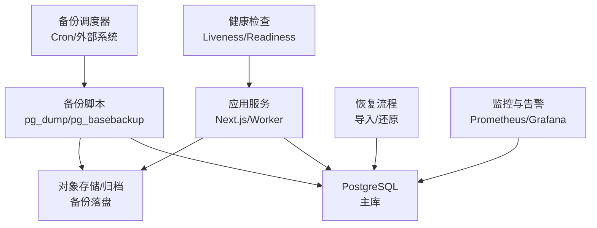
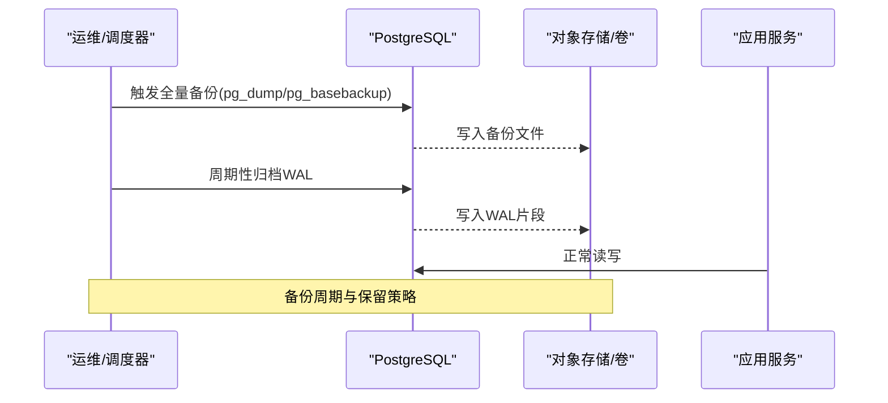
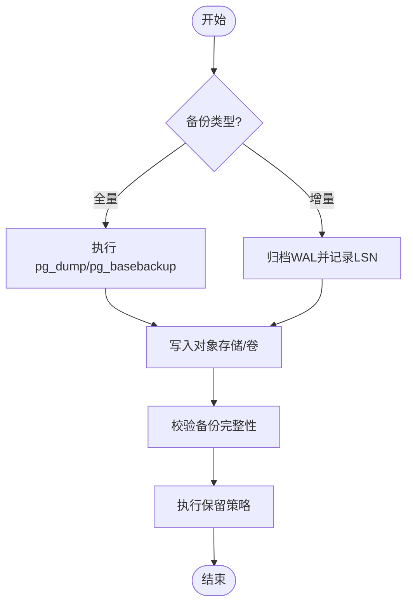
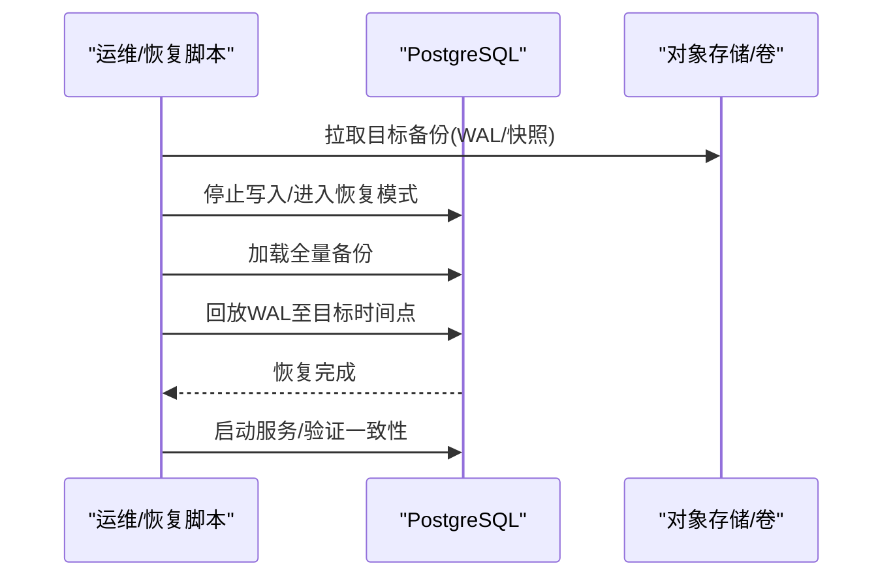
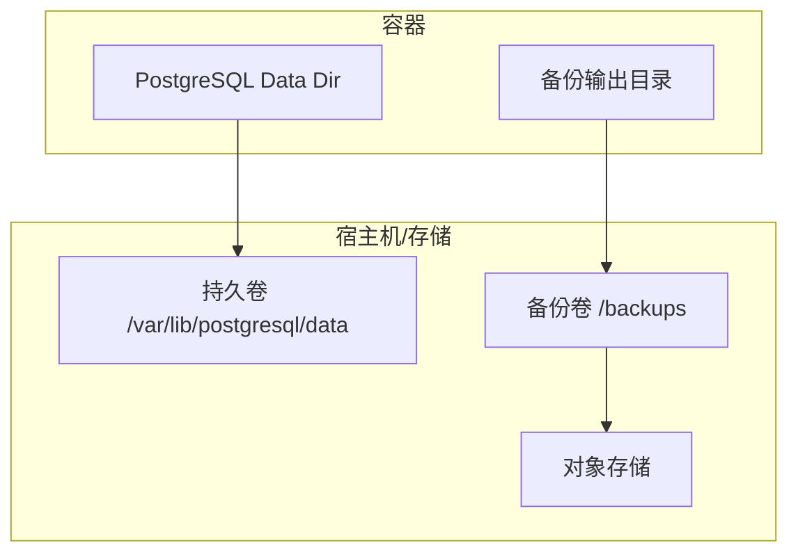
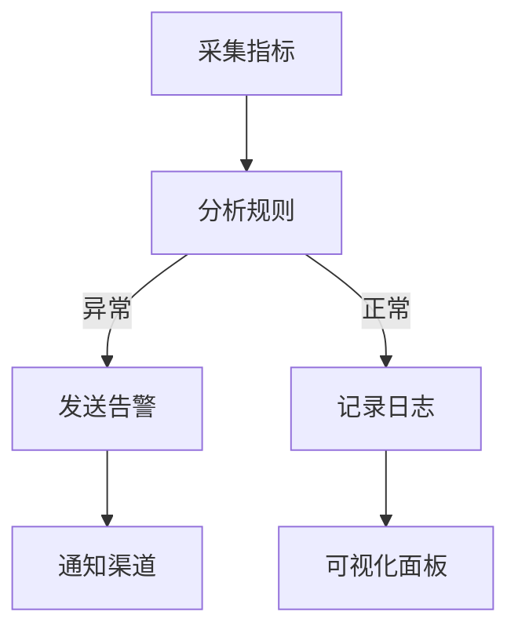
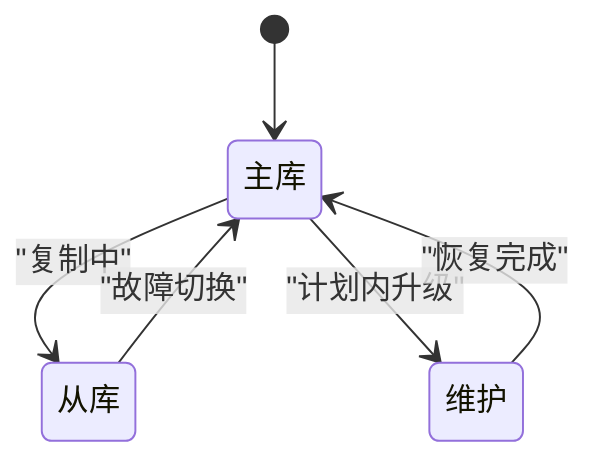
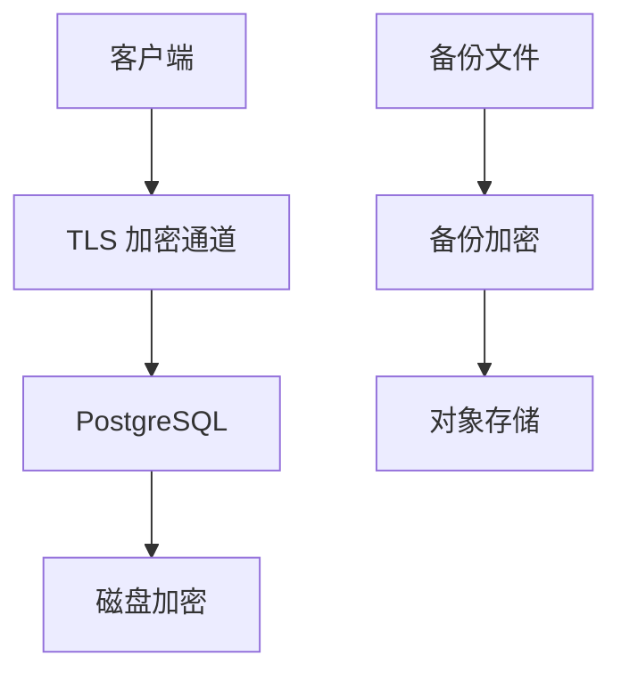
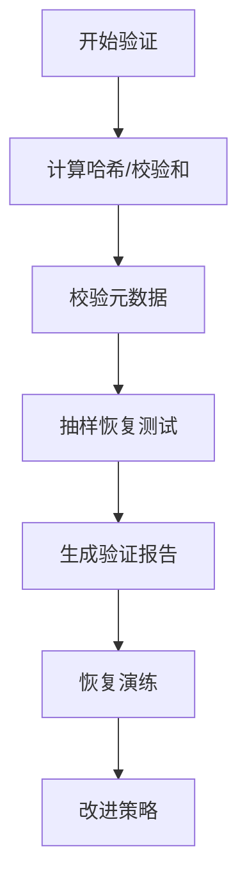
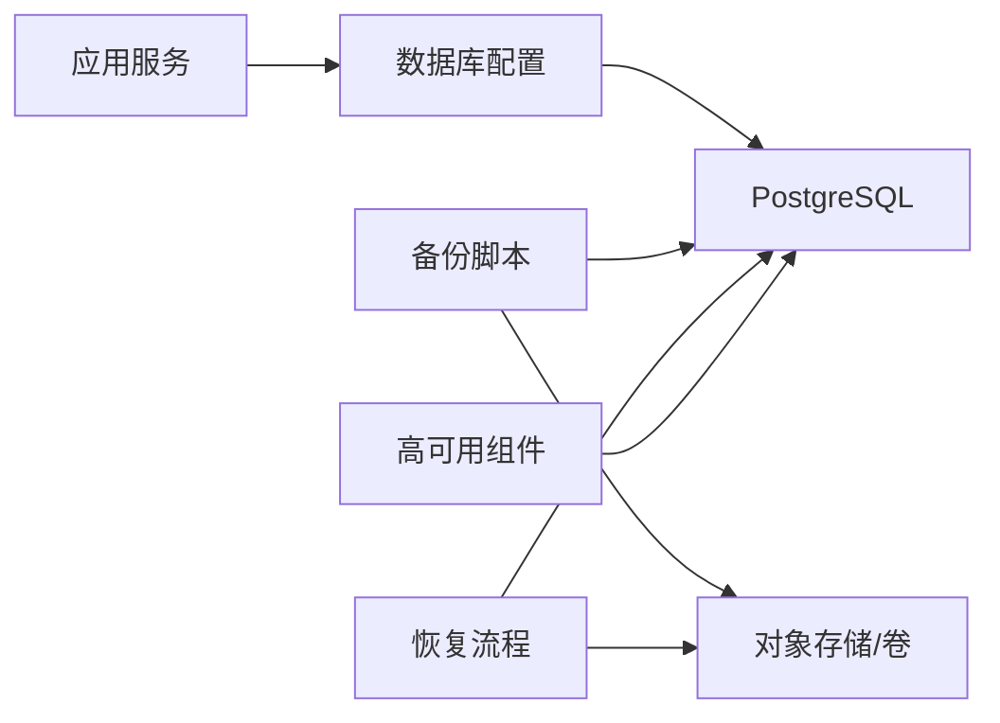

# 备份恢复与高可用

<cite>
**本文引用的文件**   
- [deploy/compose.yaml](file://deploy/compose.yaml)
- [scripts/migration/sqlite-backup.ts](file://scripts/migration/sqlite-backup.ts)
- [scripts/migration/import-postgres.ts](file://scripts/migration/import-postgres.ts)
- [scripts/setup/postgres-init.sql](file://scripts/setup/postgres-init.sql)
- [drizzle.config.ts](file://drizzle.config.ts)
- [Dockerfile.migrate](file://Dockerfile.migrate)
- [docker-compose.dev.yml](file://docker-compose.dev.yml)
</cite>

## 目录
1. [简介](#简介)
2. [项目结构](#项目结构)
3. [核心组件](#核心组件)
4. [架构总览](#架构总览)
5. [详细组件分析](#详细组件分析)
6. [依赖关系分析](#依赖关系分析)
7. [性能考虑](#性能考虑)
8. [故障排查指南](#故障排查指南)
9. [结论](#结论)
10. [附录](#附录)

## 简介
本文件面向 PurpleInk 平台，提供完整的数据库备份、恢复与高可用方案。重点覆盖：
- PostgreSQL 全量与增量备份策略
- 数据恢复流程与灾难恢复计划（DRP）
- 容器化环境的数据持久化、卷管理与存储策略
- 监控告警、健康检查与自动故障转移
- 数据加密、安全传输与访问控制
- 备份验证、完整性校验与恢复演练流程

## 项目结构
与备份恢复和高可用相关的核心位置：
- 部署编排与容器化：deploy/compose.yaml、docker-compose.dev.yml
- 数据库初始化脚本：scripts/setup/postgres-init.sql
- 迁移与备份工具：scripts/migration/sqlite-backup.ts、scripts/migration/import-postgres.ts
- 数据库连接配置：drizzle.config.ts
- 迁移镜像构建：Dockerfile.migrate

[本图为概念性架构图，不直接映射具体源码文件]

## 核心组件
- 数据库层：PostgreSQL（主库），通过环境变量或配置文件管理连接参数
- 备份层：基于 pg_dump/pg_basebackup 的全量与增量备份，结合外部调度器执行
- 存储层：本地卷或云对象存储，用于保存备份快照与 WAL 归档
- 恢复层：按时间点恢复（PITR）、逻辑恢复（导入导出）、跨库迁移（SQLite→PostgreSQL）
- 高可用层：主从复制、流式复制、自动故障转移（如 Patroni + etcd/Consul）
- 监控层：指标采集、告警规则、健康检查探针

**章节来源**
- [deploy/compose.yaml](file://deploy/compose.yaml)
- [docker-compose.dev.yml](file://docker-compose.dev.yml)
- [drizzle.config.ts](file://drizzle.config.ts)

## 架构总览
PurpleInk 的备份与高可用整体架构如下：
- 应用通过 ORM/驱动连接 PostgreSQL
- 备份任务由外部调度器触发，调用 pg_dump/pg_basebackup 生成全量/增量备份
- 备份产物落盘到持久卷或对象存储，并保留多份历史副本
- 恢复时根据 RPO/RTO 选择 PITR 或逻辑恢复路径
- 高可用通过主从复制与自动故障转移保障业务连续性

[本图为概念性序列图，不直接映射具体源码文件]

## 详细组件分析

### 备份策略与实现
- 全量备份
  - 使用 pg_dump 进行逻辑全量备份，适合中小规模与跨版本迁移
  - 使用 pg_basebackup 进行物理全量备份，适合大规模与快速恢复
- 增量备份
  - 启用 WAL 归档，配合 pg_basebackup 实现连续归档
  - 利用时间线（Timeline）与归档片段实现精确时间点恢复（PITR）
- 备份调度
  - 通过 Cron 或外部调度系统定时触发
  - 备份命名包含时间戳与类型，便于检索与清理

[本图为概念性流程图，不直接映射具体源码文件]

**章节来源**
- [scripts/migration/sqlite-backup.ts](file://scripts/migration/sqlite-backup.ts)
- [scripts/migration/import-postgres.ts](file://scripts/migration/import-postgres.ts)
- [scripts/setup/postgres-init.sql](file://scripts/setup/postgres-init.sql)

### 数据恢复流程
- 逻辑恢复（pg_restore）
  - 适用于单库/表级恢复，支持选择性恢复
  - 适合开发测试环境与跨版本迁移
- 物理恢复（PITR）
  - 基于全量备份+WAL归档恢复到指定时间点
  - 适合生产环境灾难恢复，满足严格 RPO/RTO
- 跨库迁移
  - SQLite→PostgreSQL 的导入流程，确保结构与数据一致性

[本图为概念性序列图，不直接映射具体源码文件]

**章节来源**
- [scripts/migration/import-postgres.ts](file://scripts/migration/import-postgres.ts)
- [scripts/setup/postgres-init.sql](file://scripts/setup/postgres-init.sql)

### 容器化数据持久化与卷管理
- 数据卷挂载
  - 将 PostgreSQL 数据目录挂载为持久卷，避免容器重启丢失
  - 备份文件建议独立卷或对象存储，便于生命周期管理
- 存储策略
  - 本地卷：简单可靠，适合单机或小型集群
  - 对象存储：可扩展、可跨区域复制，适合多云与灾备
- 编排配置
  - Compose 文件中定义卷名、挂载路径与权限
  - 开发环境可使用 docker-compose.dev.yml 快速搭建

[本图为概念性架构图，不直接映射具体源码文件]

**章节来源**
- [deploy/compose.yaml](file://deploy/compose.yaml)
- [docker-compose.dev.yml](file://docker-compose.dev.yml)

### 监控告警与健康检查
- 监控指标
  - 连接数、慢查询、锁等待、复制延迟、磁盘使用率
  - 备份任务状态、成功率、耗时与大小
- 健康检查
  - Liveness：进程存活探测
  - Readiness：数据库连通性与可用性探测
- 告警规则
  - 备份失败、WAL 积压、复制延迟超阈值、磁盘空间不足

[本图为概念性流程图，不直接映射具体源码文件]

### 自动故障转移与高可用
- 主从复制
  - 启用流式复制，从库只读，主库写
  - 监控复制延迟，设置阈值告警
- 自动切换
  - 使用 Patroni + etcd/Consul 管理 Leader 选举
  - 客户端通过虚拟 IP 或 DNS 指向当前主库
- 回滚与修复
  - 故障恢复后重新加入集群，同步数据差异

[本图为概念性状态图，不直接映射具体源码文件]

### 数据加密与安全传输
- 传输加密
  - 启用 TLS，强制 SSL 连接
  - 证书管理纳入密钥管理系统
- 静态加密
  - 磁盘/卷级别加密，备份文件加密存储
- 访问控制
  - 最小权限原则，按角色分配数据库用户与权限
  - 审计日志开启，记录关键操作

[本图为概念性架构图，不直接映射具体源码文件]

### 备份验证与恢复演练
- 备份验证
  - 校验文件大小、哈希值、元数据完整性
  - 抽样恢复测试，验证数据结构与业务可读性
- 恢复演练
  - 定期在隔离环境执行完整恢复流程
  - 记录恢复时长与问题，优化 RTO/RPO

[本图为概念性流程图，不直接映射具体源码文件]

## 依赖关系分析
- 应用依赖数据库连接配置（drizzle.config.ts）
- 备份脚本依赖 pg_dump/pg_basebackup 与 WAL 归档
- 恢复流程依赖备份产物与 WAL 片段
- 高可用依赖复制与协调组件（Patroni/etcd）

[本图为概念性依赖图，不直接映射具体源码文件]

**章节来源**
- [drizzle.config.ts](file://drizzle.config.ts)
- [Dockerfile.migrate](file://Dockerfile.migrate)

## 性能考虑
- 备份窗口
  - 避开业务高峰，采用分库分表或只读副本备份
  - 合理设置并发与批处理大小
- WAL 归档
  - 控制归档频率与压缩策略，减少 I/O 压力
- 恢复性能
  - 物理恢复优先于逻辑恢复，缩短 RTO
  - 并行回放 WAL，提升恢复速度

[本节为通用指导，无需引用具体文件]

## 故障排查指南
- 常见问题
  - 备份失败：检查权限、网络、存储空间与 pg_dump 参数
  - 恢复失败：确认备份完整性、WAL 连续性与时序
  - 复制延迟：检查网络带宽、磁盘 I/O 与锁竞争
- 诊断步骤
  - 查看日志与指标，定位瓶颈
  - 使用 pg_stat_* 视图分析查询与锁
  - 验证备份与恢复流程在隔离环境可复现

**章节来源**
- [scripts/migration/sqlite-backup.ts](file://scripts/migration/sqlite-backup.ts)
- [scripts/migration/import-postgres.ts](file://scripts/migration/import-postgres.ts)

## 结论
通过完善的全量与增量备份策略、严格的恢复流程与高可用架构，PurpleInk 可在容器化环境中实现稳定可靠的数据库保护与业务连续性。建议持续演练与优化，确保 RPO/RTO 满足业务需求。

[本节为总结性内容，无需引用具体文件]

## 附录
- 术语说明
  - RPO：恢复点目标，允许丢失的最大数据时间
  - RTO：恢复时间目标，恢复所需的最长时间
  - PITR：按时间点恢复
  - WAL：预写日志
- 参考配置
  - 环境变量与连接参数见 drizzle.config.ts
  - 容器编排与卷挂载见 deploy/compose.yaml 与 docker-compose.dev.yml

**章节来源**
- [drizzle.config.ts](file://drizzle.config.ts)
- [deploy/compose.yaml](file://deploy/compose.yaml)
- [docker-compose.dev.yml](file://docker-compose.dev.yml)