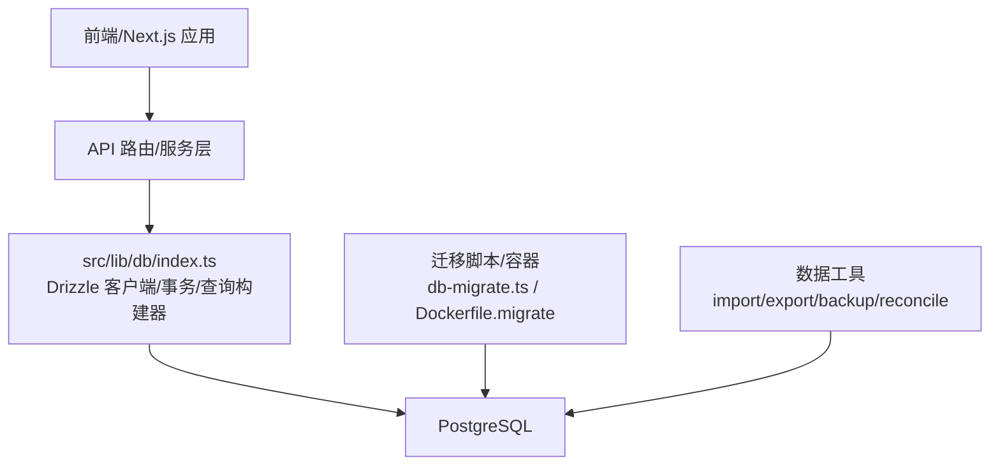
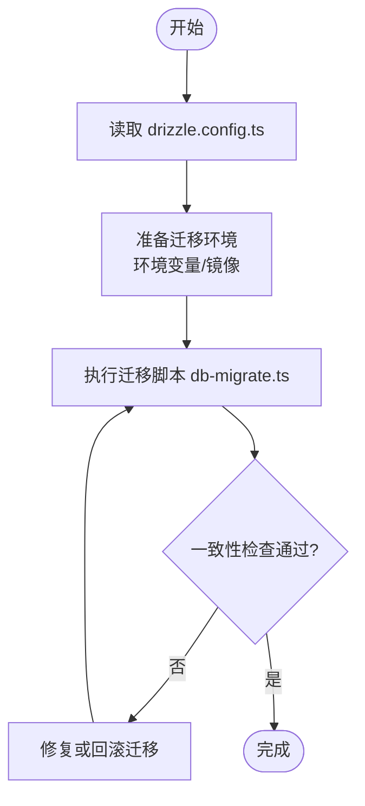
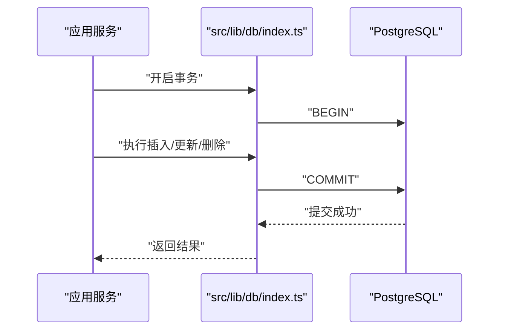
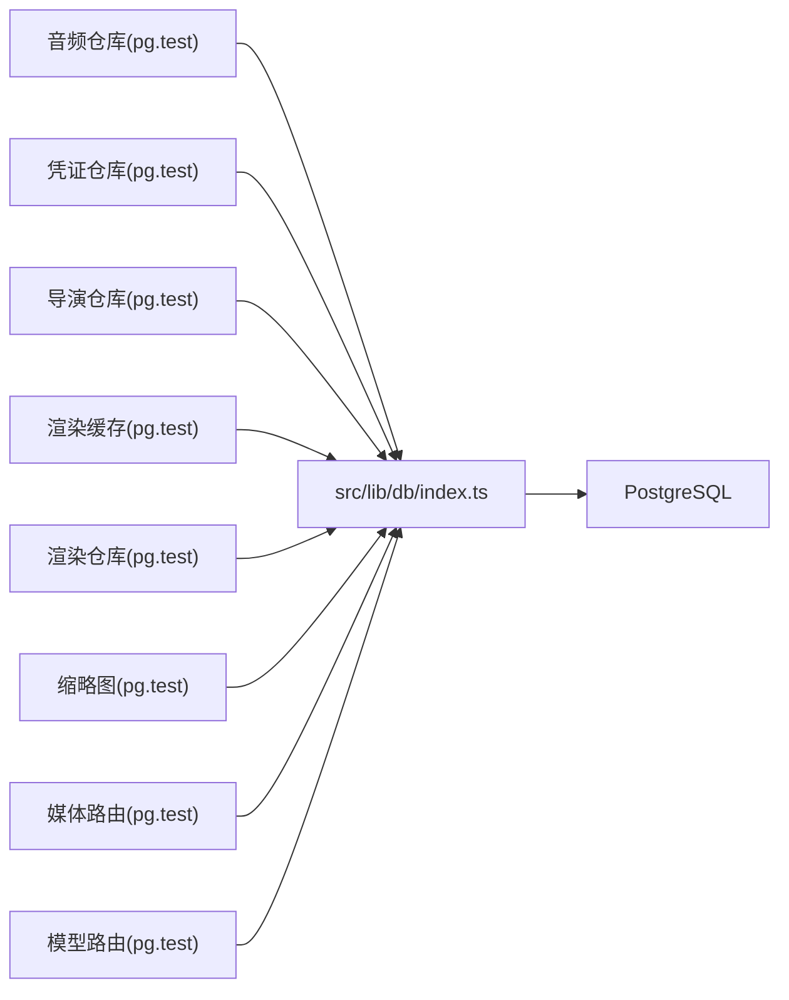

# 数据库层架构

<cite>
**本文引用的文件**   
- [drizzle.config.ts](file://drizzle.config.ts)
- [Dockerfile.migrate](file://Dockerfile.migrate)
- [docker-compose.dev.yml](file://docker-compose.dev.yml)
- [scripts/setup/db-migrate.ts](file://scripts/setup/db-migrate.ts)
- [scripts/migration/reconcile-postgres.ts](file://scripts/migration/reconcile-postgres.ts)
- [scripts/migration/import-postgres.ts](file://scripts/migration/import-postgres.ts)
- [scripts/migration/export-sqlite.ts](file://scripts/migration/export-sqlite.ts)
- [scripts/migration/sqlite-backup.ts](file://scripts/migration/sqlite-backup.ts)
- [scripts/setup/postgres-init.sql](file://scripts/setup/postgres-init.sql)
- [src/lib/db/index.ts](file://src/lib/db/index.ts)
- [src/features/audio/runtime-repository.pg.test.ts](file://src/features/audio/runtime-repository.pg.test.ts)
- [src/features/credentials/provider-credential-store.pg.test.ts](file://src/features/credentials/provider-credential-store.pg.test.ts)
- [src/features/director/runtime-repository.pg.test.ts](file://src/features/director/runtime-repository.pg.test.ts)
- [src/features/render/cache.pg.test.ts](file://src/features/render/cache.pg.test.ts)
- [src/features/render/repository.pg.test.ts](file://src/features/render/repository.pg.test.ts)
- [src/features/render/thumbnail.integration.pg.test.ts](file://src/features/render/thumbnail.integration.pg.test.ts)
- [src/features/routing/media-route-repository.pg.test.ts](file://src/features/routing/media-route-repository.pg.test.ts)
- [src/features/routing/model-route-repository.pg.test.ts](file://src/features/routing/model-route-repository.pg.test.ts)
</cite>

## 目录
1. [简介](#简介)
2. [项目结构](#项目结构)
3. [核心组件](#核心组件)
4. [架构总览](#架构总览)
5. [详细组件分析](#详细组件分析)
6. [依赖关系分析](#依赖关系分析)
7. [性能考虑](#性能考虑)
8. [故障排查指南](#故障排查指南)
9. [结论](#结论)
10. [附录](#附录)

## 简介
本文件为 PurpleInk 平台的数据库层架构文档，聚焦基于 Drizzle ORM 的数据访问层设计、PostgreSQL 数据库设计与优化、迁移与版本控制、连接池与事务管理、备份恢复与监控高可用、以及数据一致性与并发控制等主题。文档面向技术与非技术读者，提供从概念到实现细节的渐进式说明，并辅以架构图与流程图帮助理解。

## 项目结构
PurpleInk 的数据库相关能力分布在以下位置：
- 配置与构建：Drizzle 配置文件、迁移 Dockerfile、开发环境 Compose 文件
- 迁移脚本：初始化 SQL、导入导出、SQLite 备份与同步
- 运行时数据库访问：统一的数据库入口与类型定义（位于 src/lib/db）
- 功能域仓库与测试：各业务模块通过 pg 测试验证与 PostgreSQL 交互

```mermaid
graph TB
subgraph "配置与构建"
DCFG["drizzle.config.ts"]
DMIG["Dockerfile.migrate"]
DCMP["docker-compose.dev.yml"]
end
subgraph "迁移与工具"
SMIG["scripts/setup/db-migrate.ts"]
RCON["scripts/migration/reconcile-postgres.ts"]
IMPG["scripts/migration/import-postgres.ts"]
EXSL["scripts/migration/export-sqlite.ts"]
BAKL["scripts/migration/sqlite-backup.ts"]
PSQL["scripts/setup/postgres-init.sql"]
end
subgraph "运行时访问"
DBIDX["src/lib/db/index.ts"]
end
subgraph "功能域仓库(示例)"
AUDO["audio/runtime-repository.pg.test.ts"]
CRED["credentials/provider-credential-store.pg.test.ts"]
DIRR["director/runtime-repository.pg.test.ts"]
RENK["render/cache.pg.test.ts"]
REPO["render/repository.pg.test.ts"]
THUM["render/thumbnail.integration.pg.test.ts"]
MRTE["routing/media-route-repository.pg.test.ts"]
MORT["routing/model-route-repository.pg.test.ts"]
end
DCFG --> SMIG
DMIG --> SMIG
DCMP --> PSQL
SMIG --> DBIDX
RCON --> DBIDX
IMPG --> DBIDX
EXSL --> DBIDX
BAKL --> DBIDX
AUDO --> DBIDX
CRED --> DBIDX
DIRR --> DBIDX
RENK --> DBIDX
REPO --> DBIDX
THUM --> DBIDX
MRTE --> DBIDX
MORT --> DBIDX
```

图表来源
- [drizzle.config.ts](file://drizzle.config.ts)
- [Dockerfile.migrate](file://Dockerfile.migrate)
- [docker-compose.dev.yml](file://docker-compose.dev.yml)
- [scripts/setup/db-migrate.ts](file://scripts/setup/db-migrate.ts)
- [scripts/migration/reconcile-postgres.ts](file://scripts/migration/reconcile-postgres.ts)
- [scripts/migration/import-postgres.ts](file://scripts/migration/import-postgres.ts)
- [scripts/migration/export-sqlite.ts](file://scripts/migration/export-sqlite.ts)
- [scripts/migration/sqlite-backup.ts](file://scripts/migration/sqlite-backup.ts)
- [scripts/setup/postgres-init.sql](file://scripts/setup/postgres-init.sql)
- [src/lib/db/index.ts](file://src/lib/db/index.ts)
- [src/features/audio/runtime-repository.pg.test.ts](file://src/features/audio/runtime-repository.pg.test.ts)
- [src/features/credentials/provider-credential-store.pg.test.ts](file://src/features/credentials/provider-credential-store.pg.test.ts)
- [src/features/director/runtime-repository.pg.test.ts](file://src/features/director/runtime-repository.pg.test.ts)
- [src/features/render/cache.pg.test.ts](file://src/features/render/cache.pg.test.ts)
- [src/features/render/repository.pg.test.ts](file://src/features/render/repository.pg.test.ts)
- [src/features/render/thumbnail.integration.pg.test.ts](file://src/features/render/thumbnail.integration.pg.test.ts)
- [src/features/routing/media-route-repository.pg.test.ts](file://src/features/routing/media-route-repository.pg.test.ts)
- [src/features/routing/model-route-repository.pg.test.ts](file://src/features/routing/model-route-repository.pg.test.ts)

章节来源
- [drizzle.config.ts](file://drizzle.config.ts)
- [Dockerfile.migrate](file://Dockerfile.migrate)
- [docker-compose.dev.yml](file://docker-compose.dev.yml)
- [scripts/setup/db-migrate.ts](file://scripts/setup/db-migrate.ts)
- [scripts/migration/reconcile-postgres.ts](file://scripts/migration/reconcile-postgres.ts)
- [scripts/migration/import-postgres.ts](file://scripts/migration/import-postgres.ts)
- [scripts/migration/export-sqlite.ts](file://scripts/migration/export-sqlite.ts)
- [scripts/migration/sqlite-backup.ts](file://scripts/migration/sqlite-backup.ts)
- [scripts/setup/postgres-init.sql](file://scripts/setup/postgres-init.sql)
- [src/lib/db/index.ts](file://src/lib/db/index.ts)

## 核心组件
- Drizzle 配置与迁移入口
  - drizzle.config.ts：集中配置数据库连接、迁移目录、生成目标等
  - scripts/setup/db-migrate.ts：封装迁移执行流程，统一 CLI 入口
  - Dockerfile.migrate：提供迁移运行容器镜像，确保环境一致性
- 数据访问入口
  - src/lib/db/index.ts：暴露数据库客户端、连接参数、事务封装与查询构建器使用约定
- 迁移与数据工具
  - reconcile-postgres.ts：校验/修复 PG 模式与代码模型的一致性
  - import-postgres.ts / export-sqlite.ts：跨库导入导出
  - sqlite-backup.ts：SQLite 备份策略与自动化
  - postgres-init.sql：PostgreSQL 初始化脚本（角色、扩展、默认设置）
- 功能域仓库与集成测试
  - 各 .pg.test.ts 文件体现与 PostgreSQL 的真实交互，作为数据访问契约与行为验证

章节来源
- [drizzle.config.ts](file://drizzle.config.ts)
- [scripts/setup/db-migrate.ts](file://scripts/setup/db-migrate.ts)
- [Dockerfile.migrate](file://Dockerfile.migrate)
- [src/lib/db/index.ts](file://src/lib/db/index.ts)
- [scripts/migration/reconcile-postgres.ts](file://scripts/migration/reconcile-postgres.ts)
- [scripts/migration/import-postgres.ts](file://scripts/migration/import-postgres.ts)
- [scripts/migration/export-sqlite.ts](file://scripts/migration/export-sqlite.ts)
- [scripts/migration/sqlite-backup.ts](file://scripts/migration/sqlite-backup.ts)
- [scripts/setup/postgres-init.sql](file://scripts/setup/postgres-init.sql)
- [src/features/audio/runtime-repository.pg.test.ts](file://src/features/audio/runtime-repository.pg.test.ts)
- [src/features/credentials/provider-credential-store.pg.test.ts](file://src/features/credentials/provider-credential-store.pg.test.ts)
- [src/features/director/runtime-repository.pg.test.ts](file://src/features/director/runtime-repository.pg.test.ts)
- [src/features/render/cache.pg.test.ts](file://src/features/render/cache.pg.test.ts)
- [src/features/render/repository.pg.test.ts](file://src/features/render/repository.pg.test.ts)
- [src/features/render/thumbnail.integration.pg.test.ts](file://src/features/render/thumbnail.integration.pg.test.ts)
- [src/features/routing/media-route-repository.pg.test.ts](file://src/features/routing/media-route-repository.pg.test.ts)
- [src/features/routing/model-route-repository.pg.test.ts](file://src/features/routing/model-route-repository.pg.test.ts)

## 架构总览
下图展示应用与数据库层的整体交互：前端/Next.js API 路由调用领域服务，领域服务通过 src/lib/db 访问 Drizzle 客户端，执行迁移与查询；迁移由专用容器或脚本驱动，保证环境与版本一致性。

图表来源
- [src/lib/db/index.ts](file://src/lib/db/index.ts)
- [scripts/setup/db-migrate.ts](file://scripts/setup/db-migrate.ts)
- [Dockerfile.migrate](file://Dockerfile.migrate)
- [scripts/migration/reconcile-postgres.ts](file://scripts/migration/reconcile-postgres.ts)
- [scripts/migration/import-postgres.ts](file://scripts/migration/import-postgres.ts)
- [scripts/migration/export-sqlite.ts](file://scripts/migration/export-sqlite.ts)
- [scripts/migration/sqlite-backup.ts](file://scripts/migration/sqlite-backup.ts)

## 详细组件分析

### Drizzle 配置与迁移机制
- 配置要点
  - 数据库连接字符串、迁移目录、生成输出路径在 drizzle.config.ts 中集中管理
  - 支持多环境切换（开发/测试/生产），建议通过环境变量注入连接信息
- 迁移流程
  - 使用 scripts/setup/db-migrate.ts 作为统一入口，内部调用 Drizzle 迁移命令
  - Dockerfile.migrate 提供可重复的迁移执行环境，避免本地与 CI 差异
  - reconcile-postgres.ts 用于比对代码模型与数据库实际状态，辅助回滚与修复
- 版本与回滚
  - 迁移文件命名需遵循时间戳或版本号规范，确保可排序与可回滚
  - 推荐“向前迁移 + 安全回滚”策略，避免破坏性变更直接覆盖历史迁移

图表来源
- [drizzle.config.ts](file://drizzle.config.ts)
- [scripts/setup/db-migrate.ts](file://scripts/setup/db-migrate.ts)
- [Dockerfile.migrate](file://Dockerfile.migrate)
- [scripts/migration/reconcile-postgres.ts](file://scripts/migration/reconcile-postgres.ts)

章节来源
- [drizzle.config.ts](file://drizzle.config.ts)
- [scripts/setup/db-migrate.ts](file://scripts/setup/db-migrate.ts)
- [Dockerfile.migrate](file://Dockerfile.migrate)
- [scripts/migration/reconcile-postgres.ts](file://scripts/migration/reconcile-postgres.ts)

### 数据访问层与查询构建器
- 统一入口
  - src/lib/db/index.ts 暴露数据库客户端、连接参数、事务封装与查询构建器使用约定
  - 所有领域仓库应通过该入口获取连接，避免分散连接管理
- 查询构建器模式
  - 使用 Drizzle 的 select/insert/update/delete 构建类型安全的查询
  - 复杂查询建议使用 with 子句、join 与聚合函数，减少 N+1 问题
- 事务管理
  - 通过事务封装方法包裹多步写入，确保原子性与一致性
  - 长事务应避免，拆分批处理与异步任务

图表来源
- [src/lib/db/index.ts](file://src/lib/db/index.ts)

章节来源
- [src/lib/db/index.ts](file://src/lib/db/index.ts)

### PostgreSQL 数据库设计与索引策略
- 设计原则
  - 规范化与反规范化平衡：主表保持范式，热点查询适当冗余字段
  - 明确主键与外键约束，保证引用完整性
  - 使用合适的字符集与时区设置，避免时区转换开销
- 索引策略
  - 对高频过滤、排序与关联列建立索引
  - 复合索引按选择性从高到低排列列顺序
  - 定期分析慢查询，结合 EXPLAIN 调整索引与查询计划
- 表结构优化
  - 大字段分表或归档，避免单行过大
  - 分区表适用于时间序列或大规模日志数据

章节来源
- [scripts/setup/postgres-init.sql](file://scripts/setup/postgres-init.sql)

### 连接池与事务管理
- 连接池配置
  - 根据并发量与数据库容量合理设置最大连接数、最小连接数、超时与空闲回收
  - 在多进程/多实例部署下，确保连接总数不超过数据库上限
- 事务最佳实践
  - 短事务优先，避免长时间持有锁
  - 重试机制针对幂等写操作，失败时指数退避
  - 读写分离场景下，注意事务边界与一致性级别

章节来源
- [src/lib/db/index.ts](file://src/lib/db/index.ts)

### 数据备份恢复与监控告警
- 备份策略
  - 全量备份 + 增量 WAL 归档，确保 RPO/RTO 目标
  - SQLite 备份脚本提供轻量级方案，适合小规模场景
- 恢复演练
  - 定期演练恢复流程，验证备份有效性
  - 记录恢复步骤与耗时，持续优化
- 监控告警
  - 监控连接数、慢查询、锁等待、磁盘空间与复制延迟
  - 关键指标阈值告警，自动触发扩容或降级

章节来源
- [scripts/migration/sqlite-backup.ts](file://scripts/migration/sqlite-backup.ts)
- [scripts/migration/export-sqlite.ts](file://scripts/migration/export-sqlite.ts)
- [scripts/migration/import-postgres.ts](file://scripts/migration/import-postgres.ts)

### 高可用性部署方案
- 主从复制与故障转移
  - 配置流复制与自动故障转移，提升可用性
  - 读写分离降低主库压力，提高吞吐
- 多区域部署
  - 跨区域只读副本，就近读取降低延迟
  - 数据同步一致性策略与冲突解决预案

章节来源
- [docker-compose.dev.yml](file://docker-compose.dev.yml)

### 数据一致性、并发控制与锁机制
- 一致性保证
  - 使用事务与隔离级别控制脏读、不可重复读与幻读
  - 分布式场景下采用补偿事务或 Saga 模式
- 并发控制
  - 乐观锁通过版本号字段避免覆盖写
  - 悲观锁在热点资源竞争时使用行级锁
- 锁机制
  - 避免死锁：固定加锁顺序、缩短事务、减少锁范围
  - 监控锁等待与阻塞链，及时定位瓶颈

章节来源
- [src/lib/db/index.ts](file://src/lib/db/index.ts)

## 依赖关系分析
- 模块耦合
  - 领域仓库依赖 src/lib/db 提供的数据库客户端与事务封装
  - 迁移与工具脚本独立于运行时，但共享 drizzle.config.ts 配置
- 外部依赖
  - PostgreSQL 作为持久化存储
  - Drizzle ORM 提供类型安全与迁移能力
- 潜在循环依赖
  - 确保领域仓库不反向依赖迁移脚本，避免循环

图表来源
- [src/features/audio/runtime-repository.pg.test.ts](file://src/features/audio/runtime-repository.pg.test.ts)
- [src/features/credentials/provider-credential-store.pg.test.ts](file://src/features/credentials/provider-credential-store.pg.test.ts)
- [src/features/director/runtime-repository.pg.test.ts](file://src/features/director/runtime-repository.pg.test.ts)
- [src/features/render/cache.pg.test.ts](file://src/features/render/cache.pg.test.ts)
- [src/features/render/repository.pg.test.ts](file://src/features/render/repository.pg.test.ts)
- [src/features/render/thumbnail.integration.pg.test.ts](file://src/features/render/thumbnail.integration.pg.test.ts)
- [src/features/routing/media-route-repository.pg.test.ts](file://src/features/routing/media-route-repository.pg.test.ts)
- [src/features/routing/model-route-repository.pg.test.ts](file://src/features/routing/model-route-repository.pg.test.ts)
- [src/lib/db/index.ts](file://src/lib/db/index.ts)

章节来源
- [src/lib/db/index.ts](file://src/lib/db/index.ts)
- [src/features/audio/runtime-repository.pg.test.ts](file://src/features/audio/runtime-repository.pg.test.ts)
- [src/features/credentials/provider-credential-store.pg.test.ts](file://src/features/credentials/provider-credential-store.pg.test.ts)
- [src/features/director/runtime-repository.pg.test.ts](file://src/features/director/runtime-repository.pg.test.ts)
- [src/features/render/cache.pg.test.ts](file://src/features/render/cache.pg.test.ts)
- [src/features/render/repository.pg.test.ts](file://src/features/render/repository.pg.test.ts)
- [src/features/render/thumbnail.integration.pg.test.ts](file://src/features/render/thumbnail.integration.pg.test.ts)
- [src/features/routing/media-route-repository.pg.test.ts](file://src/features/routing/media-route-repository.pg.test.ts)
- [src/features/routing/model-route-repository.pg.test.ts](file://src/features/routing/model-route-repository.pg.test.ts)

## 性能考虑
- 查询优化
  - 使用 EXPLAIN ANALYZE 分析执行计划，消除全表扫描
  - 分页查询使用游标或基于 ID 的范围查询，避免深分页
- 索引维护
  - 定期重建碎片索引，统计信息更新
  - 避免过度索引导致写入放大
- 连接池调优
  - 根据 CPU 核数与 I/O 能力调整最大连接数
  - 监控连接泄漏与超时错误
- 缓存策略
  - 热点数据使用内存缓存（如 Redis）减轻数据库压力
  - 缓存失效策略与一致性保障

[本节为通用指导，不直接分析具体文件]

## 故障排查指南
- 常见问题
  - 连接池耗尽：检查连接释放、长事务与未关闭连接
  - 迁移失败：核对环境变量、权限与迁移文件顺序
  - 慢查询：定位热点 SQL，补充索引或改写查询
- 诊断工具
  - 启用慢查询日志与审计日志
  - 使用 pg_stat_statements 分析高频与慢查询
- 回滚策略
  - 迁移失败时回滚到上一版本，修复后重新执行
  - 数据损坏时从最近备份恢复并回放 WAL

章节来源
- [scripts/setup/db-migrate.ts](file://scripts/setup/db-migrate.ts)
- [scripts/migration/reconcile-postgres.ts](file://scripts/migration/reconcile-postgres.ts)
- [scripts/migration/sqlite-backup.ts](file://scripts/migration/sqlite-backup.ts)

## 结论
PurpleInk 的数据库层以 Drizzle ORM 为核心，结合规范的迁移管理与类型安全的查询构建器，形成稳定可扩展的数据访问体系。通过合理的 PostgreSQL 设计、索引策略、连接池与事务管理，以及完善的备份恢复与监控高可用方案，平台能够在高并发与大数据量场景下保持高性能与高可靠性。建议在后续迭代中持续优化慢查询、完善监控告警与自动化运维流程，进一步提升系统稳定性与可观测性。

[本节为总结性内容，不直接分析具体文件]

## 附录
- 术语表
  - Drizzle ORM：类型安全的数据库查询构建器与迁移工具
  - WAL：Write-Ahead Logging，预写日志，用于崩溃恢复与复制
  - RPO/RTO：恢复点目标/恢复时间目标，衡量备份与恢复能力
- 参考文件
  - 配置与迁移：drizzle.config.ts、scripts/setup/db-migrate.ts、Dockerfile.migrate
  - 数据工具：reconcile-postgres.ts、import-postgres.ts、export-sqlite.ts、sqlite-backup.ts
  - 初始化脚本：postgres-init.sql
  - 运行时访问：src/lib/db/index.ts
  - 领域仓库测试：各 .pg.test.ts 文件

[本节为附录内容，不直接分析具体文件]