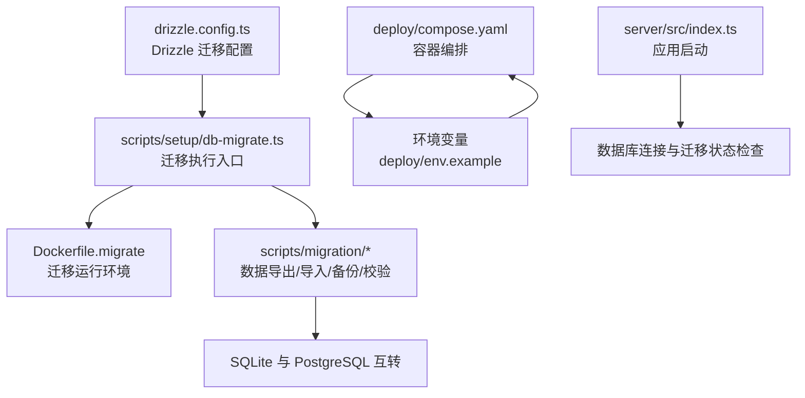
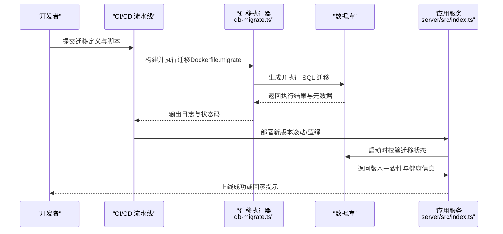
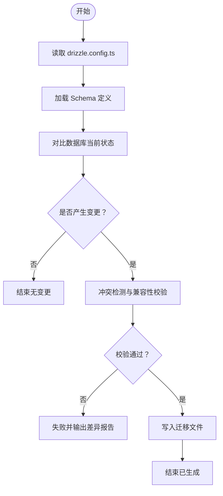
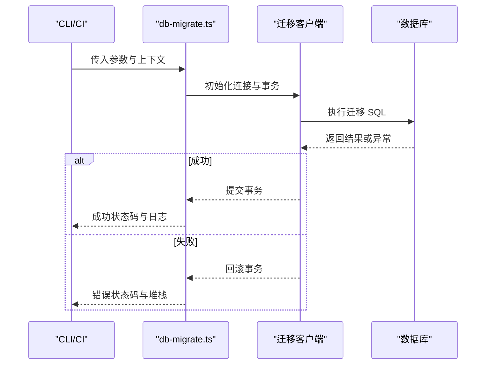
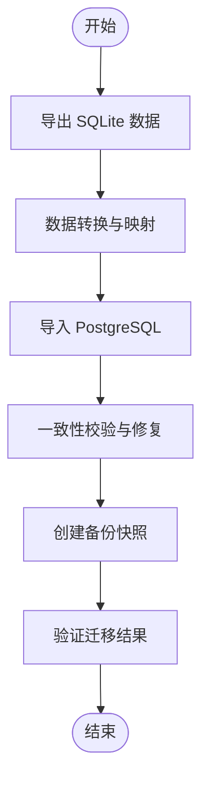
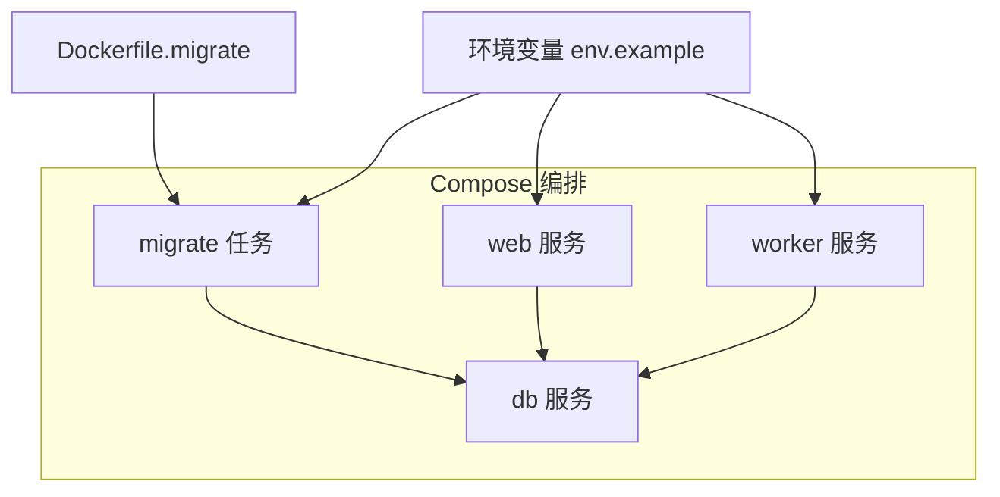
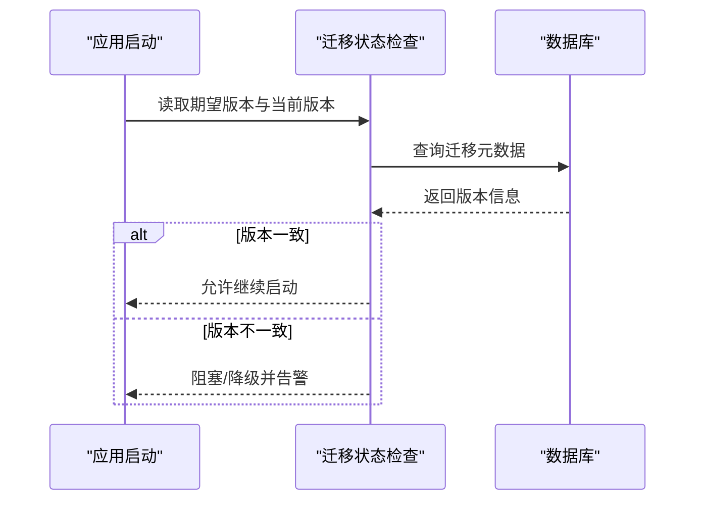
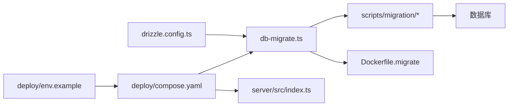

# 数据库迁移管理

<cite>
**本文档引用的文件**   
- [drizzle.config.ts](file://drizzle.config.ts)
- [Dockerfile.migrate](file://Dockerfile.migrate)
- [scripts/setup/db-migrate.ts](file://scripts/setup/db-migrate.ts)
- [scripts/migration/export-sqlite.ts](file://scripts/migration/export-sqlite.ts)
- [scripts/migration/import-postgres.ts](file://scripts/migration/import-postgres.ts)
- [scripts/migration/reconcile-postgres.ts](file://scripts/migration/reconcile-postgres.ts)
- [scripts/migration/sqlite-backup.ts](file://scripts/migration/sqlite-backup.ts)
- [deploy/compose.yaml](file://deploy/compose.yaml)
- [deploy/env.example](file://deploy/env.example)
- [server/src/index.ts](file://server/src/index.ts)
</cite>

## 目录
1. [简介](#简介)
2. [项目结构](#项目结构)
3. [核心组件](#核心组件)
4. [架构总览](#架构总览)
5. [详细组件分析](#详细组件分析)
6. [依赖关系分析](#依赖关系分析)
7. [性能考虑](#性能考虑)
8. [故障排查指南](#故障排查指南)
9. [结论](#结论)
10. [附录](#附录)

## 简介
本文件为 PurpleInK 平台的数据库迁移管理文档，聚焦 Drizzle Migration 的工作原理、迁移文件生成与执行流程、版本控制与回滚策略、冲突解决机制，以及生产环境的零停机部署与灰度发布实践。同时提供迁移脚本编写规范、数据转换逻辑、错误处理模式、测试验证与监控告警建议，帮助团队在复杂业务场景下安全、可控地演进数据库结构。

## 项目结构
本项目采用基于 Drizzle ORM 的迁移体系，配合 Docker 化迁移镜像与脚本工具链，形成“定义即迁移”的工程化能力。关键位置如下：
- 迁移配置：根级 drizzle.config.ts
- 迁移执行入口：scripts/setup/db-migrate.ts
- 迁移辅助脚本：scripts/migration/*（SQLite/PostgreSQL 互导、备份、一致性校验）
- 容器化迁移：Dockerfile.migrate
- 部署编排：deploy/compose.yaml 与环境示例 deploy/env.example
- 服务启动集成：server/src/index.ts（应用侧对迁移状态的依赖）

**图表来源**
- [drizzle.config.ts](file://drizzle.config.ts)
- [scripts/setup/db-migrate.ts](file://scripts/setup/db-migrate.ts)
- [Dockerfile.migrate](file://Dockerfile.migrate)
- [scripts/migration/export-sqlite.ts](file://scripts/migration/export-sqlite.ts)
- [scripts/migration/import-postgres.ts](file://scripts/migration/import-postgres.ts)
- [scripts/migration/reconcile-postgres.ts](file://scripts/migration/reconcile-postgres.ts)
- [scripts/migration/sqlite-backup.ts](file://scripts/migration/sqlite-backup.ts)
- [deploy/compose.yaml](file://deploy/compose.yaml)
- [deploy/env.example](file://deploy/env.example)
- [server/src/index.ts](file://server/src/index.ts)

**章节来源**
- [drizzle.config.ts](file://drizzle.config.ts)
- [scripts/setup/db-migrate.ts](file://scripts/setup/db-migrate.ts)
- [Dockerfile.migrate](file://Dockerfile.migrate)
- [deploy/compose.yaml](file://deploy/compose.yaml)
- [deploy/env.example](file://deploy/env.example)
- [server/src/index.ts](file://server/src/index.ts)

## 核心组件
- Drizzle 迁移配置（drizzle.config.ts）
  - 负责数据库连接参数、迁移目录、SQL 方言等核心设置，是迁移生成的依据。
- 迁移执行入口（scripts/setup/db-migrate.ts）
  - 封装迁移命令调用、事务边界、失败回滚与日志输出，确保迁移原子性。
- 迁移辅助脚本（scripts/migration/*）
  - export-sqlite.ts：从 SQLite 导出数据，便于本地调试或离线迁移。
  - import-postgres.ts：将数据导入 PostgreSQL，支撑多库切换与升级。
  - reconcile-postgres.ts：对目标库进行一致性校验与修复，降低迁移风险。
  - sqlite-backup.ts：对 SQLite 进行快照备份，作为回滚基线。
- 容器化迁移（Dockerfile.migrate）
  - 构建最小化迁移运行环境，隔离依赖，保证可重复执行。
- 部署编排与环境（deploy/compose.yaml、deploy/env.example）
  - 定义迁移任务与服务容器的启动顺序、资源限制与变量注入。
- 应用启动集成（server/src/index.ts）
  - 在应用启动时检查迁移状态，必要时阻塞启动或降级运行。

**章节来源**
- [drizzle.config.ts](file://drizzle.config.ts)
- [scripts/setup/db-migrate.ts](file://scripts/setup/db-migrate.ts)
- [scripts/migration/export-sqlite.ts](file://scripts/migration/export-sqlite.ts)
- [scripts/migration/import-postgres.ts](file://scripts/migration/import-postgres.ts)
- [scripts/migration/reconcile-postgres.ts](file://scripts/migration/reconcile-postgres.ts)
- [scripts/migration/sqlite-backup.ts](file://scripts/migration/sqlite-backup.ts)
- [Dockerfile.migrate](file://Dockerfile.migrate)
- [deploy/compose.yaml](file://deploy/compose.yaml)
- [deploy/env.example](file://deploy/env.example)
- [server/src/index.ts](file://server/src/index.ts)

## 架构总览
下图展示从代码变更到数据库迁移落地的端到端流程，包括开发、测试、预发与生产各阶段的关键节点。

**图表来源**
- [scripts/setup/db-migrate.ts](file://scripts/setup/db-migrate.ts)
- [Dockerfile.migrate](file://Dockerfile.migrate)
- [server/src/index.ts](file://server/src/index.ts)

## 详细组件分析

### Drizzle 迁移配置与生成流程
- 配置要点
  - 数据库连接：支持 SQLite/PostgreSQL，通过环境变量注入连接串。
  - 迁移目录：约定式目录结构，按版本号命名，确保幂等与可追溯。
  - SQL 方言：根据目标数据库自动选择方言，避免语法不兼容。
- 生成流程
  - 读取 schema 定义，对比当前数据库状态，生成增量 SQL。
  - 生成前进行冲突检测，防止重复或反向不兼容变更。
  - 生成后由 CI 校验 SQL 合法性与影响面评估。

**图表来源**
- [drizzle.config.ts](file://drizzle.config.ts)

**章节来源**
- [drizzle.config.ts](file://drizzle.config.ts)

### 迁移执行入口与事务保障
- 职责
  - 封装迁移命令调用，统一日志与错误处理。
  - 以事务包裹迁移执行，失败自动回滚，保证原子性。
  - 记录迁移元数据（时间戳、版本、影响行数），便于审计。
- 执行步骤
  - 解析环境变量与连接参数。
  - 初始化迁移客户端并建立连接。
  - 执行迁移脚本并捕获异常。
  - 输出结构化日志与退出码。

**图表来源**
- [scripts/setup/db-migrate.ts](file://scripts/setup/db-migrate.ts)

**章节来源**
- [scripts/setup/db-migrate.ts](file://scripts/setup/db-migrate.ts)

### 数据迁移与一致性校验
- 导出/导入
  - export-sqlite.ts：从 SQLite 导出表结构与数据，便于离线迁移与演示。
  - import-postgres.ts：将数据导入 PostgreSQL，支持字段映射与类型转换。
- 一致性校验
  - reconcile-postgres.ts：比对源/目标库结构差异，自动修复或生成修复脚本。
- 备份与恢复
  - sqlite-backup.ts：创建 SQLite 快照，作为回滚基线；支持压缩与归档。

**图表来源**
- [scripts/migration/export-sqlite.ts](file://scripts/migration/export-sqlite.ts)
- [scripts/migration/import-postgres.ts](file://scripts/migration/import-postgres.ts)
- [scripts/migration/reconcile-postgres.ts](file://scripts/migration/reconcile-postgres.ts)
- [scripts/migration/sqlite-backup.ts](file://scripts/migration/sqlite-backup.ts)

**章节来源**
- [scripts/migration/export-sqlite.ts](file://scripts/migration/export-sqlite.ts)
- [scripts/migration/import-postgres.ts](file://scripts/migration/import-postgres.ts)
- [scripts/migration/reconcile-postgres.ts](file://scripts/migration/reconcile-postgres.ts)
- [scripts/migration/sqlite-backup.ts](file://scripts/migration/sqlite-backup.ts)

### 容器化迁移与部署编排
- Dockerfile.migrate
  - 构建最小化 Node 运行时，安装依赖，暴露迁移命令。
  - 支持只读挂载迁移目录，确保不可变执行环境。
- compose.yaml
  - 定义迁移任务与服务容器的启动顺序、网络与存储卷。
  - 支持并行执行与资源限制，提升吞吐与稳定性。
- env.example
  - 列出必要的环境变量（数据库连接串、超时、重试次数等）。

**图表来源**
- [Dockerfile.migrate](file://Dockerfile.migrate)
- [deploy/compose.yaml](file://deploy/compose.yaml)
- [deploy/env.example](file://deploy/env.example)

**章节来源**
- [Dockerfile.migrate](file://Dockerfile.migrate)
- [deploy/compose.yaml](file://deploy/compose.yaml)
- [deploy/env.example](file://deploy/env.example)

### 应用启动与迁移状态检查
- server/src/index.ts
  - 启动时检查数据库迁移版本与应用期望版本是否一致。
  - 不一致时可选择阻塞启动、降级运行或触发异步迁移。
  - 记录健康检查指标，供外部监控系统采集。

**图表来源**
- [server/src/index.ts](file://server/src/index.ts)

**章节来源**
- [server/src/index.ts](file://server/src/index.ts)

## 依赖关系分析
- 模块耦合
  - db-migrate.ts 依赖 drizzle.config.ts 的配置与迁移目录约定。
  - scripts/migration/* 相互独立但共享环境变量与连接参数。
  - Dockerfile.migrate 为迁移执行提供运行时约束。
  - compose.yaml 协调迁移任务与服务容器的生命周期。
- 外部依赖
  - 数据库驱动（SQLite/PostgreSQL）
  - Node.js 运行时与 Drizzle 相关包
- 潜在循环依赖
  - 迁移脚本应避免直接引用应用业务逻辑，保持单向依赖。

**图表来源**
- [drizzle.config.ts](file://drizzle.config.ts)
- [scripts/setup/db-migrate.ts](file://scripts/setup/db-migrate.ts)
- [scripts/migration/export-sqlite.ts](file://scripts/migration/export-sqlite.ts)
- [scripts/migration/import-postgres.ts](file://scripts/migration/import-postgres.ts)
- [scripts/migration/reconcile-postgres.ts](file://scripts/migration/reconcile-postgres.ts)
- [scripts/migration/sqlite-backup.ts](file://scripts/migration/sqlite-backup.ts)
- [Dockerfile.migrate](file://Dockerfile.migrate)
- [deploy/compose.yaml](file://deploy/compose.yaml)
- [deploy/env.example](file://deploy/env.example)
- [server/src/index.ts](file://server/src/index.ts)

**章节来源**
- [drizzle.config.ts](file://drizzle.config.ts)
- [scripts/setup/db-migrate.ts](file://scripts/setup/db-migrate.ts)
- [scripts/migration/export-sqlite.ts](file://scripts/migration/export-sqlite.ts)
- [scripts/migration/import-postgres.ts](file://scripts/migration/import-postgres.ts)
- [scripts/migration/reconcile-postgres.ts](file://scripts/migration/reconcile-postgres.ts)
- [scripts/migration/sqlite-backup.ts](file://scripts/migration/sqlite-backup.ts)
- [Dockerfile.migrate](file://Dockerfile.migrate)
- [deploy/compose.yaml](file://deploy/compose.yaml)
- [deploy/env.example](file://deploy/env.example)
- [server/src/index.ts](file://server/src/index.ts)

## 性能考虑
- 迁移批量化
  - 将小粒度变更合并为批次，减少锁竞争与事务开销。
- 索引与统计信息
  - 大表变更优先重建索引与更新统计信息，避免查询退化。
- 并发与限流
  - 控制迁移并发度，避免压垮数据库；对导入脚本启用背压。
- 资源隔离
  - 使用独立迁移容器与资源配额，避免与业务服务争抢资源。
- 监控与度量
  - 记录迁移耗时、锁等待、错误率等指标，纳入统一监控平台。

[本节为通用指导，无需特定文件引用]

## 故障排查指南
- 常见错误
  - 连接失败：检查环境变量与网络连通性。
  - 权限不足：确认数据库用户具备 DDL/DML 权限。
  - 版本不一致：核对期望版本与实际版本，必要时手动对齐。
  - 死锁与超时：调整超时参数与重试策略，拆分大事务。
- 诊断步骤
  - 查看迁移日志与数据库慢查询日志。
  - 使用 reconcile-postgres.ts 进行差异分析与修复。
  - 通过 sqlite-backup.ts 恢复至稳定基线。
- 回滚预案
  - 保留每次迁移前的快照与备份。
  - 制定一键回滚脚本，包含数据与结构双回滚。
  - 在预发环境充分演练回滚流程。

**章节来源**
- [scripts/migration/reconcile-postgres.ts](file://scripts/migration/reconcile-postgres.ts)
- [scripts/migration/sqlite-backup.ts](file://scripts/migration/sqlite-backup.ts)

## 结论
通过 Drizzle Migration 与工程化工具链，PurpleInK 平台实现了安全、可追溯、可回滚的数据库迁移体系。结合容器化编排与严格的版本控制，能够在生产环境实现零停机与灰度发布。建议持续完善迁移测试、监控告警与演练机制，进一步提升变更质量与交付效率。

[本节为总结性内容，无需特定文件引用]

## 附录
- 迁移脚本编写规范
  - 单一职责：每个迁移文件仅处理一个变更点。
  - 幂等性：支持重复执行而不产生副作用。
  - 向后兼容：变更前确保旧版本代码与新结构共存。
  - 注释与审计：记录变更原因、影响范围与负责人。
- 数据转换逻辑
  - 类型映射：明确源/目标类型转换规则与默认值。
  - 数据清洗：去除脏数据、补齐缺失字段。
  - 分批处理：大表迁移分批次，避免长事务。
- 错误处理模式
  - 统一异常包装与日志格式。
  - 失败自动回滚与告警通知。
  - 人工干预入口与恢复指引。
- 迁移测试与验证
  - 单元测试：覆盖边界条件与异常路径。
  - 集成测试：在类生产环境执行完整迁移流程。
  - 数据校验：对比迁移前后数据一致性与完整性。
- 监控与告警
  - 指标：迁移时长、成功率、错误数、锁等待。
  - 日志：结构化输出，集中收集与分析。
  - 告警：阈值触发与分级通知，快速响应。

[本节为通用指导，无需特定文件引用]