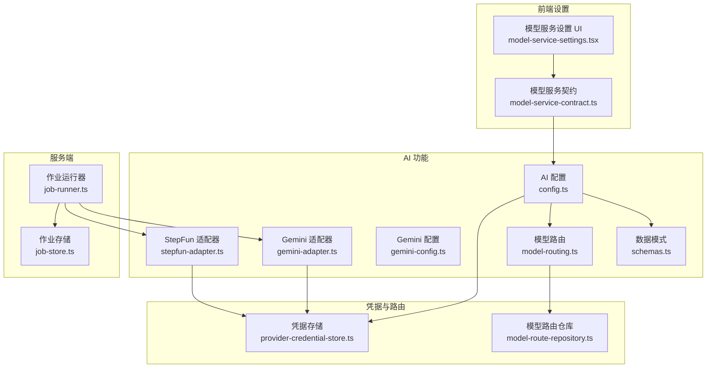
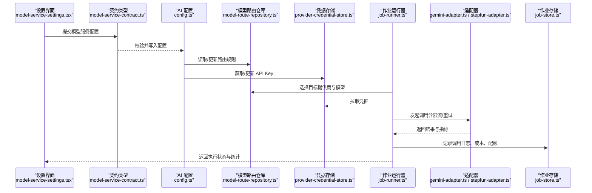
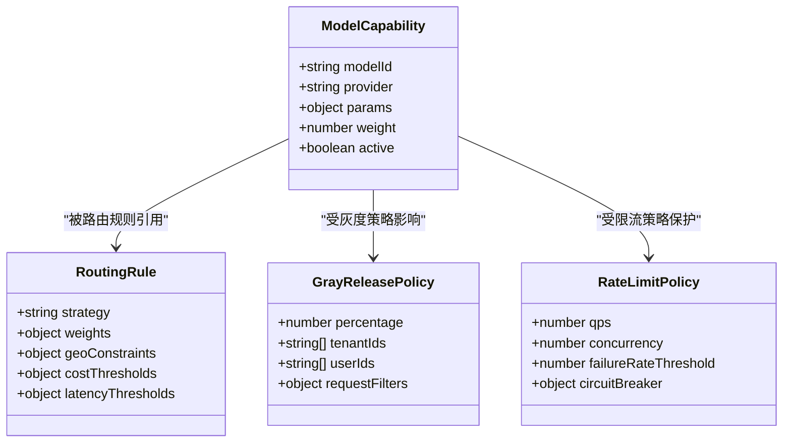
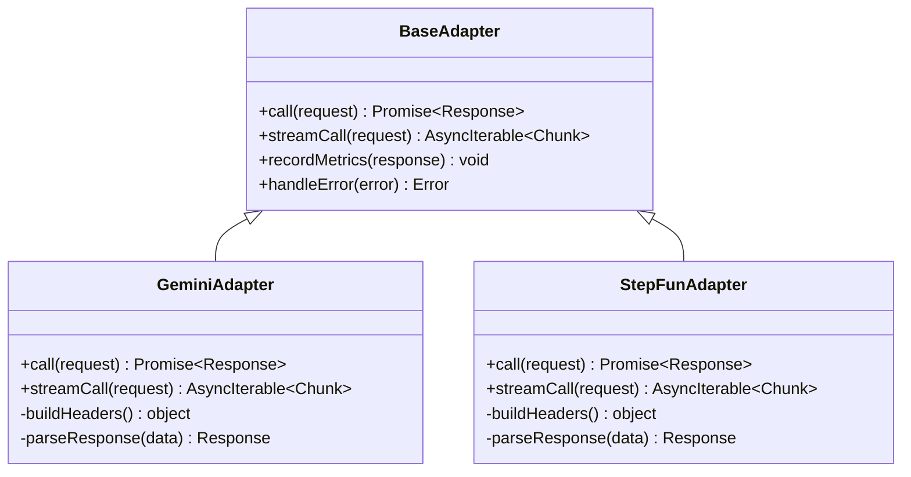
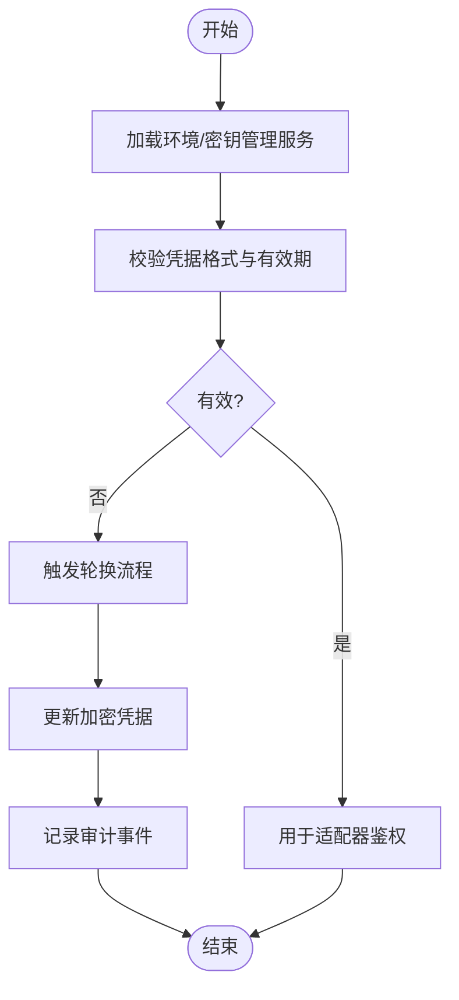
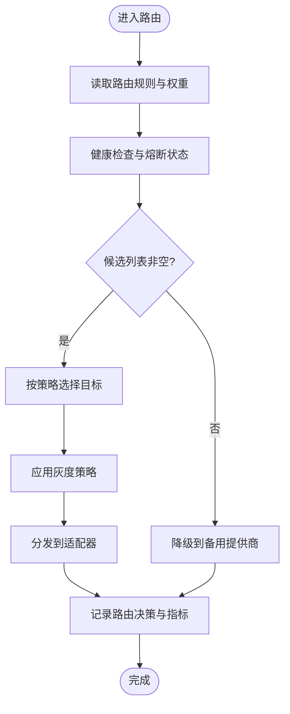
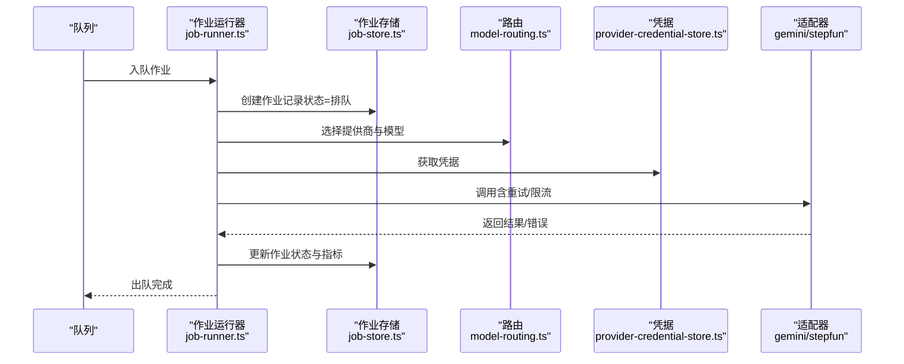
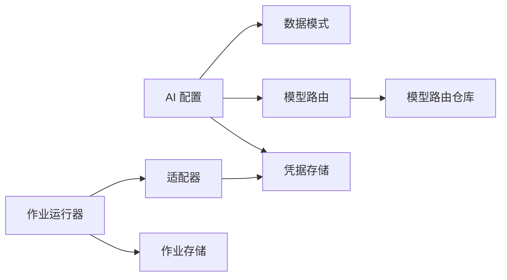

# AI 服务模型

<cite>
**本文档引用的文件**   
- [src/features/ai/config.ts](file://src/features/ai/config.ts)
- [src/features/ai/schemas.ts](file://src/features/ai/schemas.ts)
- [src/features/ai/model-routing.ts](file://src/features/ai/model-routing.ts)
- [src/features/ai/gemini-config.ts](file://src/features/ai/gemini-config.ts)
- [src/features/ai/gemini-adapter.ts](file://src/features/ai/gemini-adapter.ts)
- [src/features/ai/stepfun-adapter.ts](file://src/features/ai/stepfun-adapter.ts)
- [src/features/credentials/provider-credential-store.ts](file://src/features/credentials/provider-credential-store.ts)
- [src/features/routing/model-route-repository.ts](file://src/features/routing/model-route-repository.ts)
- [src/app/products/(app)/settings/model-service-settings.tsx](file://src/app/products/(app)/settings/model-service-settings.tsx)
- [src/app/products/(app)/settings/model-service-contract.ts](file://src/app/products/(app)/settings/model-service-contract.ts)
- [server/src/server/job-runner.ts](file://server/src/server/job-runner.ts)
- [server/src/server/job-store.ts](file://server/src/server/job-store.ts)
</cite>

## 目录
1. [简介](#简介)
2. [项目结构](#项目结构)
3. [核心组件](#核心组件)
4. [架构总览](#架构总览)
5. [详细组件分析](#详细组件分析)
6. [依赖关系分析](#依赖关系分析)
7. [性能考虑](#性能考虑)
8. [故障排查指南](#故障排查指南)
9. [结论](#结论)
10. [附录](#附录)

## 简介
本文件为 PurpleInk 的 AI 服务集成提供全面的数据模型文档，覆盖以下关键主题：
- AI 模型调用记录、提供商路由配置与负载均衡策略的数据结构设计
- 模型适配器的配置管理、API 密钥存储与限流控制的数据模型
- AI 服务使用统计、成本计算与配额管理的表结构设计
- 模型性能监控、错误重试机制与故障转移的数据存储方案
- 支持配置热更新、动态路由与灰度发布的模型设计

目标是帮助开发者与运维人员理解并扩展 PurpleInk 的 AI 能力，确保高可用、可观测、可治理。

## 项目结构
AI 相关代码主要分布在以下模块：
- features/ai：AI 配置、适配器、路由与模式定义
- features/credentials：凭据（如 API Key）的安全存储
- features/routing：模型路由持久化与查询
- app/products/settings：设置界面与契约类型
- server/src/server：作业执行与持久化

图表来源
- [src/features/ai/config.ts](file://src/features/ai/config.ts)
- [src/features/ai/schemas.ts](file://src/features/ai/schemas.ts)
- [src/features/ai/model-routing.ts](file://src/features/ai/model-routing.ts)
- [src/features/ai/gemini-config.ts](file://src/features/ai/gemini-config.ts)
- [src/features/ai/gemini-adapter.ts](file://src/features/ai/gemini-adapter.ts)
- [src/features/ai/stepfun-adapter.ts](file://src/features/ai/stepfun-adapter.ts)
- [src/features/credentials/provider-credential-store.ts](file://src/features/credentials/provider-credential-store.ts)
- [src/features/routing/model-route-repository.ts](file://src/features/routing/model-route-repository.ts)
- [src/app/products/(app)/settings/model-service-settings.tsx](file://src/app/products/(app)/settings/model-service-settings.tsx)
- [src/app/products/(app)/settings/model-service-contract.ts](file://src/app/products/(app)/settings/model-service-contract.ts)
- [server/src/server/job-runner.ts](file://server/src/server/job-runner.ts)
- [server/src/server/job-store.ts](file://server/src/server/job-store.ts)

章节来源
- [src/features/ai/config.ts](file://src/features/ai/config.ts)
- [src/features/ai/schemas.ts](file://src/features/ai/schemas.ts)
- [src/features/ai/model-routing.ts](file://src/features/ai/model-routing.ts)
- [src/features/ai/gemini-config.ts](file://src/features/ai/gemini-config.ts)
- [src/features/ai/gemini-adapter.ts](file://src/features/ai/gemini-adapter.ts)
- [src/features/ai/stepfun-adapter.ts](file://src/features/ai/stepfun-adapter.ts)
- [src/features/credentials/provider-credential-store.ts](file://src/features/credentials/provider-credential-store.ts)
- [src/features/routing/model-route-repository.ts](file://src/features/routing/model-route-repository.ts)
- [src/app/products/(app)/settings/model-service-settings.tsx](file://src/app/products/(app)/settings/model-service-settings.tsx)
- [src/app/products/(app)/settings/model-service-contract.ts](file://src/app/products/(app)/settings/model-service-contract.ts)
- [server/src/server/job-runner.ts](file://server/src/server/job-runner.ts)
- [server/src/server/job-store.ts](file://server/src/server/job-store.ts)

## 核心组件
- AI 配置与模式：集中管理模型能力、参数、权重与路由规则，提供强类型校验
- 模型适配器：封装不同提供商（如 Gemini、StepFun）的调用细节，统一输入输出
- 凭据存储：安全存取各提供商的 API Key，支持加密与访问审计
- 模型路由仓库：持久化路由规则、权重与灰度策略，提供查询与更新接口
- 作业运行器与存储：调度 AI 任务、记录执行状态、结果与指标

章节来源
- [src/features/ai/config.ts](file://src/features/ai/config.ts)
- [src/features/ai/schemas.ts](file://src/features/ai/schemas.ts)
- [src/features/ai/gemini-config.ts](file://src/features/ai/gemini-config.ts)
- [src/features/ai/gemini-adapter.ts](file://src/features/ai/gemini-adapter.ts)
- [src/features/ai/stepfun-adapter.ts](file://src/features/ai/stepfun-adapter.ts)
- [src/features/credentials/provider-credential-store.ts](file://src/features/credentials/provider-credential-store.ts)
- [src/features/routing/model-route-repository.ts](file://src/features/routing/model-route-repository.ts)
- [server/src/server/job-runner.ts](file://server/src/server/job-runner.ts)
- [server/src/server/job-store.ts](file://server/src/server/job-store.ts)

## 架构总览
下图展示从前端设置到后端作业执行的端到端流程，以及 AI 适配器与凭据、路由的交互。

图表来源
- [src/app/products/(app)/settings/model-service-settings.tsx](file://src/app/products/(app)/settings/model-service-settings.tsx)
- [src/app/products/(app)/settings/model-service-contract.ts](file://src/app/products/(app)/settings/model-service-contract.ts)
- [src/features/ai/config.ts](file://src/features/ai/config.ts)
- [src/features/routing/model-route-repository.ts](file://src/features/routing/model-route-repository.ts)
- [src/features/credentials/provider-credential-store.ts](file://src/features/credentials/provider-credential-store.ts)
- [server/src/server/job-runner.ts](file://server/src/server/job-runner.ts)
- [server/src/server/job-store.ts](file://server/src/server/job-store.ts)
- [src/features/ai/gemini-adapter.ts](file://src/features/ai/gemini-adapter.ts)
- [src/features/ai/stepfun-adapter.ts](file://src/features/ai/stepfun-adapter.ts)

## 详细组件分析

### AI 配置与数据模式
- 职责：定义模型能力、参数默认值、路由权重、灰度比例、限流阈值等；提供运行时校验与合并策略
- 关键点：
  - 模型能力枚举与参数约束（温度、最大令牌数、超时等）
  - 路由策略（轮询、加权、按地域/延迟/成本）
  - 灰度发布（按租户/用户/请求比例的流量切分）
  - 限流与熔断（QPS、并发、失败率阈值）

图表来源
- [src/features/ai/schemas.ts](file://src/features/ai/schemas.ts)
- [src/features/ai/config.ts](file://src/features/ai/config.ts)

章节来源
- [src/features/ai/schemas.ts](file://src/features/ai/schemas.ts)
- [src/features/ai/config.ts](file://src/features/ai/config.ts)

### 模型适配器（Gemini、StepFun）
- 职责：封装具体提供商的 SDK/HTTP 调用，统一输入输出格式，处理鉴权、重试、限流与指标上报
- 关键点：
  - 输入标准化（消息、工具、系统提示）
  - 输出解析（结构化响应、流式片段）
  - 错误分类（网络、认证、限流、业务）
  - 指标采集（时延、成功率、Token 用量、成本）

图表来源
- [src/features/ai/gemini-adapter.ts](file://src/features/ai/gemini-adapter.ts)
- [src/features/ai/stepfun-adapter.ts](file://src/features/ai/stepfun-adapter.ts)

章节来源
- [src/features/ai/gemini-adapter.ts](file://src/features/ai/gemini-adapter.ts)
- [src/features/ai/stepfun-adapter.ts](file://src/features/ai/stepfun-adapter.ts)

### 凭据存储（API Key）
- 职责：安全存储与检索各提供商的 API Key，支持加密、版本管理与访问审计
- 关键点：
  - 凭据信封（provider、keyId、encryptedKey、createdAt、updatedAt）
  - 访问控制（最小权限、审计日志）
  - 轮换与回滚（多版本并存、灰度切换）

图表来源
- [src/features/credentials/provider-credential-store.ts](file://src/features/credentials/provider-credential-store.ts)

章节来源
- [src/features/credentials/provider-credential-store.ts](file://src/features/credentials/provider-credential-store.ts)

### 模型路由与负载均衡
- 职责：根据策略选择目标提供商与模型实例，支持加权、地理、延迟、成本与灰度
- 关键点：
  - 策略引擎（轮询、随机、最少连接、延迟优先、成本优先）
  - 健康检查与熔断（失败率、超时、降级）
  - 灰度发布（按租户/用户/请求比例逐步放量）

图表来源
- [src/features/ai/model-routing.ts](file://src/features/ai/model-routing.ts)
- [src/features/routing/model-route-repository.ts](file://src/features/routing/model-route-repository.ts)

章节来源
- [src/features/ai/model-routing.ts](file://src/features/ai/model-routing.ts)
- [src/features/routing/model-route-repository.ts](file://src/features/routing/model-route-repository.ts)

### 作业运行器与存储（调用记录、统计、成本、配额）
- 职责：调度 AI 任务、编排重试与回退、记录调用日志与指标、聚合成本与配额
- 关键点：
  - 作业状态机（排队、运行、成功、失败、重试、取消）
  - 指标字段（时延、吞吐、错误码、Token 用量、成本）
  - 配额管理（租户/用户维度限额、软/硬限制、告警）

图表来源
- [server/src/server/job-runner.ts](file://server/src/server/job-runner.ts)
- [server/src/server/job-store.ts](file://server/src/server/job-store.ts)
- [src/features/ai/model-routing.ts](file://src/features/ai/model-routing.ts)
- [src/features/credentials/provider-credential-store.ts](file://src/features/credentials/provider-credential-store.ts)
- [src/features/ai/gemini-adapter.ts](file://src/features/ai/gemini-adapter.ts)
- [src/features/ai/stepfun-adapter.ts](file://src/features/ai/stepfun-adapter.ts)

章节来源
- [server/src/server/job-runner.ts](file://server/src/server/job-runner.ts)
- [server/src/server/job-store.ts](file://server/src/server/job-store.ts)

### 前端设置与契约
- 职责：提供模型服务配置的可视化编辑与校验，确保前后端契约一致
- 关键点：
  - 表单字段映射到配置模式（能力、权重、灰度、限流）
  - 实时校验与错误提示
  - 变更生效与回滚

章节来源
- [src/app/products/(app)/settings/model-service-settings.tsx](file://src/app/products/(app)/settings/model-service-settings.tsx)
- [src/app/products/(app)/settings/model-service-contract.ts](file://src/app/products/(app)/settings/model-service-contract.ts)

## 依赖关系分析
- 低耦合：适配器与路由解耦，通过统一接口与配置驱动
- 高内聚：凭据存储独立于业务逻辑，便于安全升级
- 外部依赖：数据库（作业与路由持久化）、加密服务（凭据）、提供商 SDK（适配器）

图表来源
- [src/features/ai/config.ts](file://src/features/ai/config.ts)
- [src/features/ai/schemas.ts](file://src/features/ai/schemas.ts)
- [src/features/ai/model-routing.ts](file://src/features/ai/model-routing.ts)
- [src/features/routing/model-route-repository.ts](file://src/features/routing/model-route-repository.ts)
- [src/features/credentials/provider-credential-store.ts](file://src/features/credentials/provider-credential-store.ts)
- [server/src/server/job-runner.ts](file://server/src/server/job-runner.ts)
- [server/src/server/job-store.ts](file://server/src/server/job-store.ts)

章节来源
- [src/features/ai/config.ts](file://src/features/ai/config.ts)
- [src/features/ai/schemas.ts](file://src/features/ai/schemas.ts)
- [src/features/ai/model-routing.ts](file://src/features/ai/model-routing.ts)
- [src/features/routing/model-route-repository.ts](file://src/features/routing/model-route-repository.ts)
- [src/features/credentials/provider-credential-store.ts](file://src/features/credentials/provider-credential-store.ts)
- [server/src/server/job-runner.ts](file://server/src/server/job-runner.ts)
- [server/src/server/job-store.ts](file://server/src/server/job-store.ts)

## 性能考虑
- 路由选择：优先基于本地缓存与内存索引，减少 DB 查询
- 适配器层：连接池、超时与重试退避、流式处理降低内存峰值
- 作业调度：批处理与并行度控制，避免下游限流
- 指标采集：异步上报与采样，避免阻塞主路径

[本节为通用指导，不直接分析具体文件]

## 故障排查指南
- 常见问题：
  - 凭据过期或无效：检查凭据版本与有效期，触发轮换
  - 路由失败：查看健康检查与熔断状态，确认权重与灰度配置
  - 适配器错误：区分网络、认证、限流与业务错误，定位错误码
  - 作业堆积：检查队列长度、并发度与下游 QPS 限制
- 建议操作：
  - 启用详细日志与追踪 ID，关联作业与调用链
  - 快速回滚配置与灰度比例
  - 临时降级到备用提供商

章节来源
- [server/src/server/job-runner.ts](file://server/src/server/job-runner.ts)
- [server/src/server/job-store.ts](file://server/src/server/job-store.ts)
- [src/features/credentials/provider-credential-store.ts](file://src/features/credentials/provider-credential-store.ts)
- [src/features/ai/model-routing.ts](file://src/features/ai/model-routing.ts)

## 结论
PurpleInk 的 AI 服务集成通过清晰的数据模型与模块化设计，实现了灵活的提供商路由、安全的凭据管理、可靠的作业调度与完善的监控统计。建议在后续迭代中持续完善限流与熔断策略、增强灰度发布能力，并引入更细粒度的成本与配额管控，以提升系统的稳定性与经济性。

[本节为总结性内容，不直接分析具体文件]

## 附录
- 术语说明：
  - 适配器：封装特定 AI 提供商的调用细节
  - 路由：根据策略选择目标提供商与模型
  - 灰度发布：按比例逐步放开新功能或新提供商
  - 限流：控制请求速率与并发，防止过载
- 参考实现路径：
  - 配置与模式：[src/features/ai/config.ts](file://src/features/ai/config.ts)、[src/features/ai/schemas.ts](file://src/features/ai/schemas.ts)
  - 适配器：[src/features/ai/gemini-adapter.ts](file://src/features/ai/gemini-adapter.ts)、[src/features/ai/stepfun-adapter.ts](file://src/features/ai/stepfun-adapter.ts)
  - 凭据：[src/features/credentials/provider-credential-store.ts](file://src/features/credentials/provider-credential-store.ts)
  - 路由：[src/features/ai/model-routing.ts](file://src/features/ai/model-routing.ts)、[src/features/routing/model-route-repository.ts](file://src/features/routing/model-route-repository.ts)
  - 作业：[server/src/server/job-runner.ts](file://server/src/server/job-runner.ts)、[server/src/server/job-store.ts](file://server/src/server/job-store.ts)

[本节为补充信息，不直接分析具体文件]