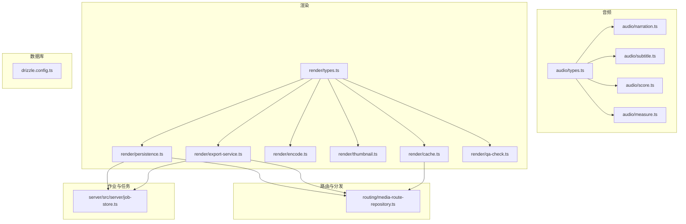
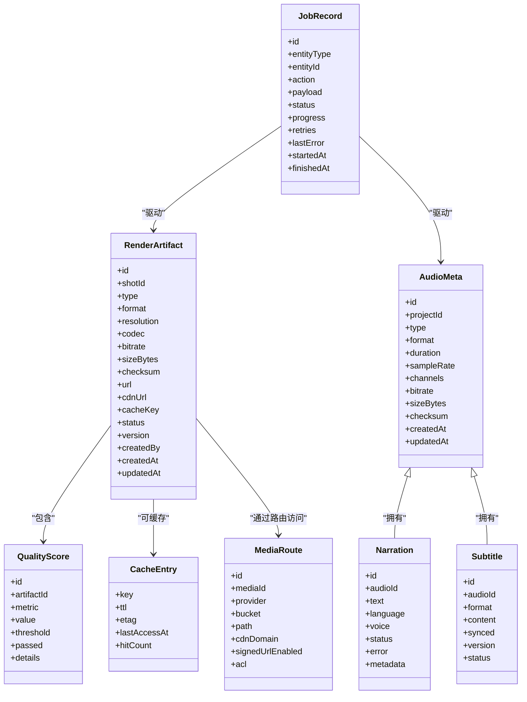
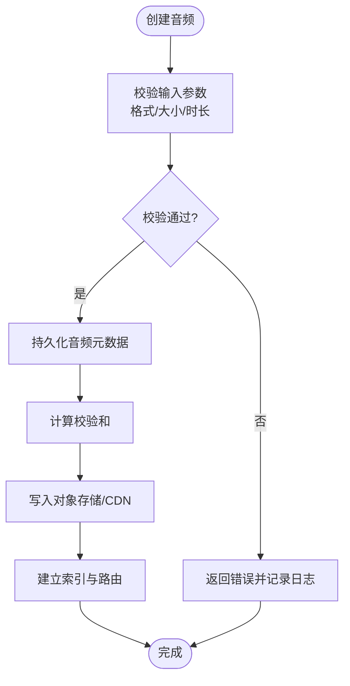
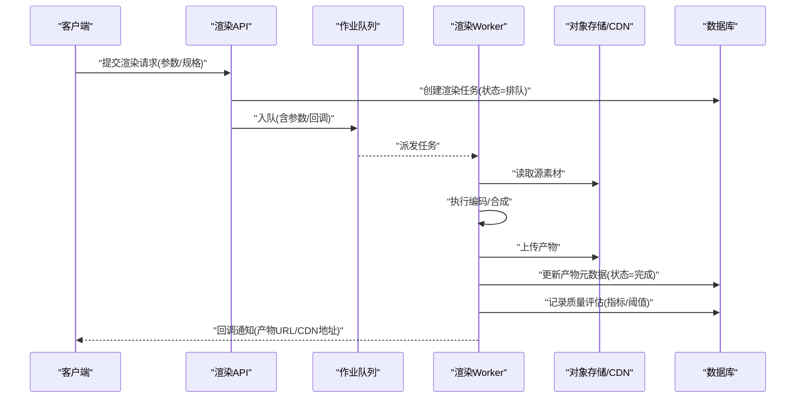
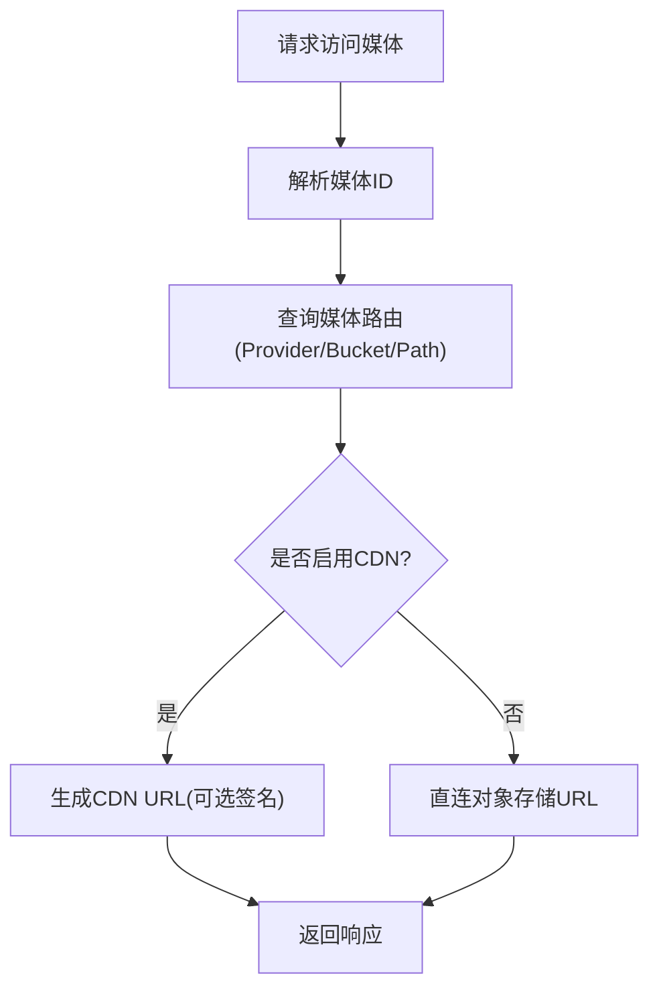
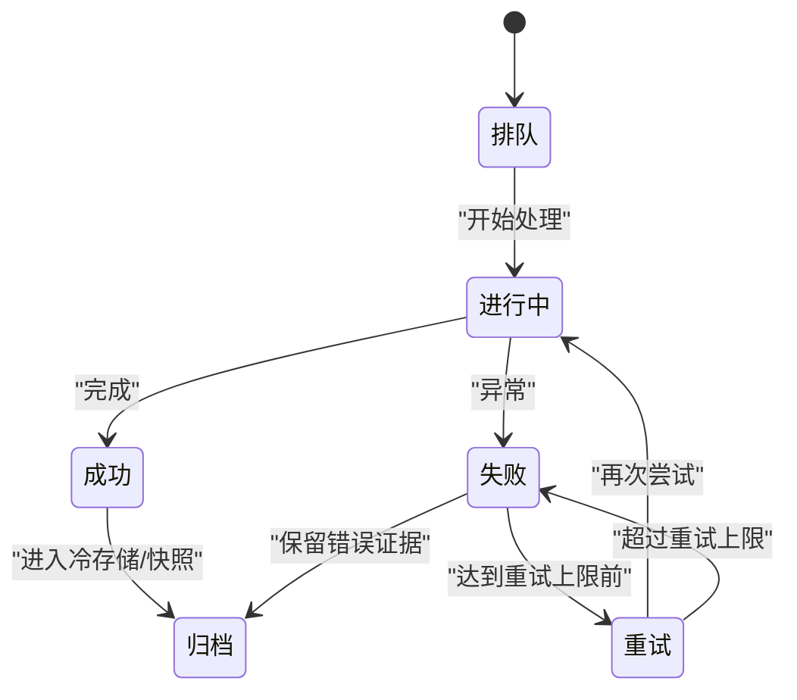
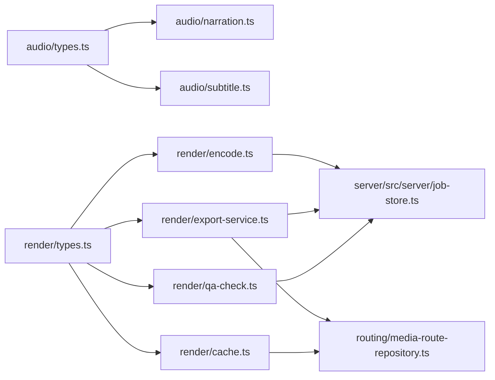

# 媒体资源模型

<cite>
**本文引用的文件**   
- [src/features/audio/types.ts](file://src/features/audio/types.ts)
- [src/features/audio/narration.ts](file://src/features/audio/narration.ts)
- [src/features/audio/subtitle.ts](file://src/features/audio/subtitle.ts)
- [src/features/audio/score.ts](file://src/features/audio/score.ts)
- [src/features/audio/measure.ts](file://src/features/audio/measure.ts)
- [src/features/render/types.ts](file://src/features/render/types.ts)
- [src/features/render/persistence.ts](file://src/features/render/persistence.ts)
- [src/features/render/cache.ts](file://src/features/render/cache.ts)
- [src/features/render/qa-check.ts](file://src/features/render/qa-check.ts)
- [src/features/render/thumbnail.ts](file://src/features/render/thumbnail.ts)
- [src/features/render/export-service.ts](file://src/features/render/export-service.ts)
- [src/features/render/encode.ts](file://src/features/render/encode.ts)
- [src/features/routing/media-route-repository.ts](file://src/features/routing/media-route-repository.ts)
- [server/src/server/job-store.ts](file://server/src/server/job-store.ts)
- [drizzle.config.ts](file://drizzle.config.ts)
</cite>

## 目录
1. [简介](#简介)
2. [项目结构](#项目结构)
3. [核心组件](#核心组件)
4. [架构总览](#架构总览)
5. [详细组件分析](#详细组件分析)
6. [依赖关系分析](#依赖关系分析)
7. [性能考量](#性能考量)
8. [故障排查指南](#故障排查指南)
9. [结论](#结论)
10. [附录](#附录)

## 简介
本文件为 PurpleInk 媒体资源系统的数据模型文档，聚焦音频、视频片段、字幕与渲染结果等媒体实体的数据结构设计。内容涵盖：
- 媒体元数据管理、格式转换记录与版本控制
- 存储路径策略、CDN 集成与缓存机制的数据模型支持
- 媒体质量评估、处理状态跟踪与错误恢复的数据存储方案
- 权限控制、访问统计与生命周期管理的模型设计

该文档面向产品、研发与运维人员，既提供高层概览，也给出代码级映射与可视化图示，帮助读者快速理解并扩展媒体资源体系。

## 项目结构
围绕媒体资源的核心代码主要分布在以下模块：
- 音频子域：类型定义、旁白、字幕、评分与测量工具
- 渲染子域：类型、持久化、缓存、编码、缩略图、导出服务与质量检查
- 路由与分发：媒体路由仓库（用于 CDN/存储后端选择）
- 作业与任务：后台作业存储（用于处理状态与重试）
- 数据库配置：Drizzle ORM 配置（用于统一迁移与模式管理）

图表来源
- [src/features/audio/types.ts](file://src/features/audio/types.ts)
- [src/features/audio/narration.ts](file://src/features/audio/narration.ts)
- [src/features/audio/subtitle.ts](file://src/features/audio/subtitle.ts)
- [src/features/audio/score.ts](file://src/features/audio/score.ts)
- [src/features/audio/measure.ts](file://src/features/audio/measure.ts)
- [src/features/render/types.ts](file://src/features/render/types.ts)
- [src/features/render/persistence.ts](file://src/features/render/persistence.ts)
- [src/features/render/cache.ts](file://src/features/render/cache.ts)
- [src/features/render/encode.ts](file://src/features/render/encode.ts)
- [src/features/render/thumbnail.ts](file://src/features/render/thumbnail.ts)
- [src/features/render/export-service.ts](file://src/features/render/export-service.ts)
- [src/features/render/qa-check.ts](file://src/features/render/qa-check.ts)
- [src/features/routing/media-route-repository.ts](file://src/features/routing/media-route-repository.ts)
- [server/src/server/job-store.ts](file://server/src/server/job-store.ts)
- [drizzle.config.ts](file://drizzle.config.ts)

章节来源
- [src/features/audio/types.ts](file://src/features/audio/types.ts)
- [src/features/render/types.ts](file://src/features/render/types.ts)
- [src/features/routing/media-route-repository.ts](file://src/features/routing/media-route-repository.ts)
- [server/src/server/job-store.ts](file://server/src/server/job-store.ts)
- [drizzle.config.ts](file://drizzle.config.ts)

## 核心组件
- 音频实体与元数据
  - 音频片段、旁白、字幕、评分与测量指标的类型定义与关联关系
- 渲染产物与流程
  - 渲染任务、编码参数、缩略图、导出产物、质量检查与缓存键
- 存储与分发
  - 媒体路由仓库（决定对象存储/CDN 路径与访问策略）
- 作业与状态
  - 后台作业存储（承载处理状态、重试、错误信息）
- 数据库模式
  - Drizzle 配置驱动的统一迁移与表结构管理

章节来源
- [src/features/audio/types.ts](file://src/features/audio/types.ts)
- [src/features/render/types.ts](file://src/features/render/types.ts)
- [src/features/routing/media-route-repository.ts](file://src/features/routing/media-route-repository.ts)
- [server/src/server/job-store.ts](file://server/src/server/job-store.ts)
- [drizzle.config.ts](file://drizzle.config.ts)

## 架构总览
媒体资源系统以“类型定义 + 仓储/服务 + 作业调度”的分层组织：
- 类型层：集中定义音频、字幕、渲染产物、质量指标等数据结构
- 服务层：封装旁白生成、字幕处理、编码、缩略图、导出、缓存与 QA
- 仓储层：负责持久化、路由选择（对象存储/CDN）、缓存键生成
- 作业层：异步执行耗时任务（编码、导出、QA），维护状态与重试

图表来源
- [src/features/audio/types.ts](file://src/features/audio/types.ts)
- [src/features/audio/narration.ts](file://src/features/audio/narration.ts)
- [src/features/audio/subtitle.ts](file://src/features/audio/subtitle.ts)
- [src/features/render/types.ts](file://src/features/render/types.ts)
- [src/features/render/cache.ts](file://src/features/render/cache.ts)
- [src/features/routing/media-route-repository.ts](file://src/features/routing/media-route-repository.ts)
- [server/src/server/job-store.ts](file://server/src/server/job-store.ts)

## 详细组件分析

### 音频实体与元数据模型
- 音频片段
  - 字段：唯一标识、所属项目、类型、容器/编码格式、时长、采样率、声道数、码率、文件大小、校验和、时间戳
  - 用途：作为所有音频相关资源的根实体，支撑后续旁白、音效、字幕的关联
- 旁白
  - 字段：关联音频、文本、语言、音色、处理状态、错误信息、扩展元数据
  - 用途：记录 TTS 或外部语音服务的输入输出与结果
- 字幕
  - 字段：关联音频、格式（如 SRT/VTT）、内容、是否时间同步、版本号、状态
  - 用途：管理多版本字幕与时间轴对齐
- 评分与测量
  - 字段：指标名称、数值、阈值、是否通过、详情
  - 用途：量化音频质量（响度、峰值、静音段、噪声比等）

图表来源
- [src/features/audio/types.ts](file://src/features/audio/types.ts)
- [src/features/audio/measure.ts](file://src/features/audio/measure.ts)

章节来源
- [src/features/audio/types.ts](file://src/features/audio/types.ts)
- [src/features/audio/narration.ts](file://src/features/audio/narration.ts)
- [src/features/audio/subtitle.ts](file://src/features/audio/subtitle.ts)
- [src/features/audio/score.ts](file://src/features/audio/score.ts)
- [src/features/audio/measure.ts](file://src/features/audio/measure.ts)

### 渲染产物与版本控制模型
- 渲染产物
  - 字段：唯一标识、分镜 ID、类型、格式、分辨率、编码器、码率、大小、校验和、URL、CDN URL、缓存键、状态、版本、创建者、时间戳
  - 用途：描述一次渲染产物的全量元数据，支撑回放、分享与二次编辑
- 质量评估
  - 字段：关联产物、指标、数值、阈值、是否通过、详情
  - 用途：自动化质量门禁（分辨率、码率、黑帧、音画同步等）
- 缓存
  - 字段：键、TTL、ETag、最后访问时间、命中次数
  - 用途：加速重复渲染与预览，降低存储与带宽成本
- 编码与导出
  - 字段：编码器参数、目标格式、转码流水线阶段、中间产物引用
  - 用途：记录转码过程的可追溯性与回滚能力

图表来源
- [src/features/render/types.ts](file://src/features/render/types.ts)
- [src/features/render/encode.ts](file://src/features/render/encode.ts)
- [src/features/render/export-service.ts](file://src/features/render/export-service.ts)
- [src/features/render/qa-check.ts](file://src/features/render/qa-check.ts)
- [server/src/server/job-store.ts](file://server/src/server/job-store.ts)

章节来源
- [src/features/render/types.ts](file://src/features/render/types.ts)
- [src/features/render/encode.ts](file://src/features/render/encode.ts)
- [src/features/render/export-service.ts](file://src/features/render/export-service.ts)
- [src/features/render/qa-check.ts](file://src/features/render/qa-check.ts)
- [src/features/render/cache.ts](file://src/features/render/cache.ts)
- [server/src/server/job-store.ts](file://server/src/server/job-store.ts)

### 存储路径策略与 CDN 集成
- 路径策略
  - 按项目/分镜/产物类型分层，结合哈希与版本号保证幂等与可回溯
  - 使用统一的命名规范，便于检索与清理
- CDN 集成
  - 通过媒体路由仓库抽象不同后端（S3/OSS/COS 等）与 CDN 域名
  - 支持签名 URL 与 ACL 控制，保障安全访问
- 缓存机制
  - 基于缓存键（输入指纹+参数指纹）命中已有产物
  - TTL 与 ETag 协同，减少无效刷新

图表来源
- [src/features/routing/media-route-repository.ts](file://src/features/routing/media-route-repository.ts)

章节来源
- [src/features/routing/media-route-repository.ts](file://src/features/routing/media-route-repository.ts)

### 处理状态跟踪与错误恢复
- 状态机
  - 排队 → 进行中 → 成功/失败 → 重试（有限次数）→ 归档
- 错误恢复
  - 记录错误堆栈与上下文，支持按阶段重试与断点续传
  - 失败产物保留以便诊断，避免污染生产数据
- 进度上报
  - 阶段性进度与指标（编码进度、内存占用、I/O 吞吐）

图表来源
- [server/src/server/job-store.ts](file://server/src/server/job-store.ts)

章节来源
- [server/src/server/job-store.ts](file://server/src/server/job-store.ts)

### 权限控制、访问统计与生命周期管理
- 权限控制
  - 基于项目/分镜维度的 ACL，结合签名 URL 限制访问范围与有效期
  - 支持角色与策略（只读/下载/编辑）
- 访问统计
  - 记录访问次数、首次/最近访问时间、来源 IP、用户代理
  - 与缓存命中计数联动，优化热点资源
- 生命周期管理
  - 热/温/冷分层存储策略，自动迁移与清理过期产物
  - 版本保留策略（保留最近 N 版，历史归档）

章节来源
- [src/features/routing/media-route-repository.ts](file://src/features/routing/media-route-repository.ts)
- [src/features/render/cache.ts](file://src/features/render/cache.ts)

### 数据库模式与迁移
- 统一使用 Drizzle ORM 进行模式管理与迁移
- 建议表结构（概念性说明）
  - audio_meta：音频元数据主表
  - narration：旁白记录
  - subtitle：字幕记录
  - render_artifacts：渲染产物
  - quality_scores：质量评估
  - cache_entries：缓存条目
  - media_routes：媒体路由
  - job_records：作业记录
- 迁移与一致性
  - 通过 drizzle.config.ts 统一管理迁移脚本与连接配置
  - 确保跨环境一致性与回滚能力

章节来源
- [drizzle.config.ts](file://drizzle.config.ts)

## 依赖关系分析
- 音频模块依赖类型定义，服务于旁白与字幕处理
- 渲染模块依赖类型定义，串联编码、缩略图、导出、缓存与 QA
- 媒体路由仓库被渲染与导出服务共同依赖，解耦存储后端
- 作业存储贯穿渲染与音频处理，承担状态与重试职责
- Drizzle 配置为所有持久化操作的统一入口

图表来源
- [src/features/audio/types.ts](file://src/features/audio/types.ts)
- [src/features/audio/narration.ts](file://src/features/audio/narration.ts)
- [src/features/audio/subtitle.ts](file://src/features/audio/subtitle.ts)
- [src/features/render/types.ts](file://src/features/render/types.ts)
- [src/features/render/encode.ts](file://src/features/render/encode.ts)
- [src/features/render/export-service.ts](file://src/features/render/export-service.ts)
- [src/features/render/cache.ts](file://src/features/render/cache.ts)
- [src/features/render/qa-check.ts](file://src/features/render/qa-check.ts)
- [src/features/routing/media-route-repository.ts](file://src/features/routing/media-route-repository.ts)
- [server/src/server/job-store.ts](file://server/src/server/job-store.ts)

章节来源
- [src/features/audio/types.ts](file://src/features/audio/types.ts)
- [src/features/render/types.ts](file://src/features/render/types.ts)
- [src/features/routing/media-route-repository.ts](file://src/features/routing/media-route-repository.ts)
- [server/src/server/job-store.ts](file://server/src/server/job-store.ts)

## 性能考量
- 缓存优先：基于输入与参数指纹生成稳定缓存键，最大化命中
- 并行处理：编码与导出采用队列并发，限制资源占用
- I/O 优化：大文件分块上传/下载，流式处理减少内存峰值
- 存储分层：热数据近线、温数据标准、冷数据归档，降低成本
- 质量门禁：前置校验与后置评估，减少无效产出

[本节为通用指导，不直接分析具体文件]

## 故障排查指南
- 常见问题定位
  - 渲染失败：查看作业记录中的错误信息与重试次数
  - 音质问题：检查质量评估指标与阈值设置
  - 访问异常：核对媒体路由配置与签名 URL 有效期
- 调试手段
  - 开启详细日志，记录关键步骤的输入输出
  - 使用缓存键与 ETag 验证缓存命中情况
  - 对失败产物保留副本，便于离线分析

章节来源
- [server/src/server/job-store.ts](file://server/src/server/job-store.ts)
- [src/features/render/qa-check.ts](file://src/features/render/qa-check.ts)
- [src/features/routing/media-route-repository.ts](file://src/features/routing/media-route-repository.ts)

## 结论
PurpleInk 媒体资源系统通过清晰的数据模型与服务分层，实现了从音频到渲染产物的全链路管理。借助媒体路由、缓存与作业调度，系统在可扩展性、可靠性与性能方面具备良好基础。建议在后续迭代中完善权限与审计、强化质量门禁与监控告警，进一步提升用户体验与运营效率。

[本节为总结性内容，不直接分析具体文件]

## 附录
- 术语表
  - 媒体路由：抽象对象存储与 CDN 访问路径与策略
  - 缓存键：由输入与参数指纹生成的稳定标识
  - 质量评估：对音视频质量的量化指标与阈值判定
- 参考实现路径
  - 音频类型与处理：见音频模块相关文件
  - 渲染产物与流程：见渲染模块相关文件
  - 路由与作业：见媒体路由仓库与作业存储

[本节为补充信息，不直接分析具体文件]