# 工作流模型

<cite>
**本文引用的文件**   
- [src/features/director/types.ts](file://src/features/director/types.ts)
- [src/features/director/advance.ts](file://src/features/director/advance.ts)
- [src/features/director/stage-runner.ts](file://src/features/director/stage-runner.ts)
- [src/features/director/stage-result.ts](file://src/features/director/stage-result.ts)
- [src/features/director/runtime-repository.ts](file://src/features/director/runtime-repository.ts)
- [src/features/director/pipeline.ts](file://src/features/director/pipeline.ts)
- [src/features/director/stage-effects.ts](file://src/features/director/stage-effects.ts)
- [src/features/director/stage-artifact-gate.ts](file://src/features/director/stage-artifact-gate.ts)
- [src/features/director/runtime-node-data.ts](file://src/features/director/runtime-node-data.ts)
- [src/features/director/runtime-artifact-reader.ts](file://src/features/director/runtime-artifact-reader.ts)
- [src/features/director/runtime-artifact-writer.ts](file://src/features/director/runtime-artifact-writer.ts)
- [src/features/director/session-store.ts](file://src/features/director/session-store.ts)
- [src/features/director/pi-session.ts](file://src/features/director/pi-session.ts)
- [src/features/director/pi-provider.ts](file://src/features/director/pi-provider.ts)
- [src/features/director/pi-output.ts](file://src/features/director/pi-output.ts)
- [src/features/director/output-recovery.ts](file://src/features/director/output-recovery.ts)
- [src/features/director/audio-timing.ts](file://src/features/director/audio-timing.ts)
- [src/features/director/fabricate.ts](file://src/features/director/fabricate.ts)
- [src/features/director/queue-handler.ts](file://src/features/director/queue-handler.ts)
- [server/src/server/job-runner.ts](file://server/src/server/job-runner.ts)
- [server/src/server/job-store.ts](file://server/src/server/job-store.ts)
- [drizzle.config.ts](file://drizzle.config.ts)
</cite>

## 目录
1. [引言](#引言)
2. [项目结构](#项目结构)
3. [核心组件](#核心组件)
4. [架构总览](#架构总览)
5. [详细组件分析](#详细组件分析)
6. [依赖关系分析](#依赖关系分析)
7. [性能考量](#性能考量)
8. [故障排查指南](#故障排查指南)
9. [结论](#结论)
10. [附录](#附录)

## 引言
本文件面向 PurpleInk 导演系统（Director）的工作流数据模型，系统性阐述状态机、阶段（Stage）管理、执行记录与审计追踪的数据结构设计。文档覆盖：
- 工作流节点类型、依赖关系与执行顺序建模
- 版本控制、快照机制与回滚策略的数据存储设计
- 执行历史、日志与审计表结构
- 模板、参数化配置与动态生成的数据模型支持

目标是让读者在不深入代码细节的情况下，也能理解并扩展工作流的数据模型与运行机制。

## 项目结构
导演系统位于 src/features/director，围绕“阶段编排”“运行时工件”“会话与持久化”“队列与任务调度”展开；服务端作业运行器与存储位于 server/src/server。数据库迁移与模式定义由 drizzle 驱动。

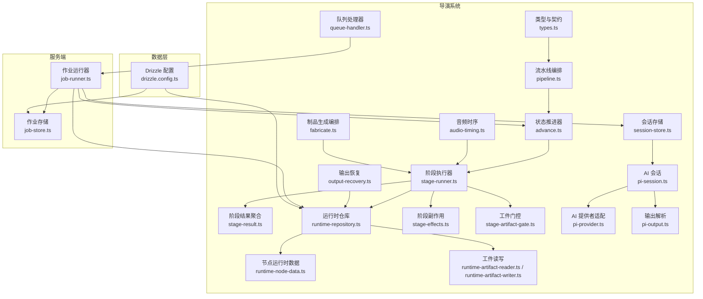

图表来源 
- [src/features/director/types.ts](file://src/features/director/types.ts)
- [src/features/director/pipeline.ts](file://src/features/director/pipeline.ts)
- [src/features/director/advance.ts](file://src/features/director/advance.ts)
- [src/features/director/stage-runner.ts](file://src/features/director/stapterunner.ts)
- [src/features/director/stage-result.ts](file://src/features/director/stage-result.ts)
- [src/features/director/runtime-repository.ts](file://src/features/director/runtime-repository.ts)
- [src/features/director/runtime-node-data.ts](file://src/features/director/runtime-node-data.ts)
- [src/features/director/runtime-artifact-reader.ts](file://src/features/director/runtime-artifact-reader.ts)
- [src/features/director/runtime-artifact-writer.ts](file://src/features/director/runtime-artifact-writer.ts)
- [src/features/director/stage-effects.ts](file://src/features/director/stage-effects.ts)
- [src/features/director/stage-artifact-gate.ts](file://src/features/director/stage-artifact-gate.ts)
- [src/features/director/session-store.ts](file://src/features/director/session-store.ts)
- [src/features/director/pi-session.ts](file://src/features/director/pi-session.ts)
- [src/features/director/pi-provider.ts](file://src/features/director/pi-provider.ts)
- [src/features/director/pi-output.ts](file://src/features/director/pi-output.ts)
- [src/features/director/output-recovery.ts](file://src/features/director/output-recovery.ts)
- [src/features/director/audio-timing.ts](file://src/features/director/audio-timing.ts)
- [src/features/director/fabricate.ts](file://src/features/director/fabricate.ts)
- [src/features/director/queue-handler.ts](file://src/features/director/queue-handler.ts)
- [server/src/server/job-runner.ts](file://server/src/server/job-runner.ts)
- [server/src/server/job-store.ts](file://server/src/server/job-store.ts)
- [drizzle.config.ts](file://drizzle.config.ts)

章节来源
- [src/features/director/types.ts](file://src/features/director/types.ts)
- [src/features/director/pipeline.ts](file://src/features/director/pipeline.ts)
- [src/features/director/advance.ts](file://src/features/director/advance.ts)
- [src/features/director/stage-runner.ts](file://src/features/director/stage-runner.ts)
- [src/features/director/stage-result.ts](file://src/features/director/stage-result.ts)
- [src/features/director/runtime-repository.ts](file://src/features/director/runtime-repository.ts)
- [src/features/director/runtime-node-data.ts](file://src/features/director/runtime-node-data.ts)
- [src/features/director/runtime-artifact-reader.ts](file://src/features/director/runtime-artifact-reader.ts)
- [src/features/director/runtime-artifact-writer.ts](file://src/features/director/runtime-artifact-writer.ts)
- [src/features/director/stage-effects.ts](file://src/features/director/stage-effects.ts)
- [src/features/director/stage-artifact-gate.ts](file://src/features/director/stage-artifact-gate.ts)
- [src/features/director/session-store.ts](file://src/features/director/session-store.ts)
- [src/features/director/pi-session.ts](file://src/features/director/pi-session.ts)
- [src/features/director/pi-provider.ts](file://src/features/director/pi-provider.ts)
- [src/features/director/pi-output.ts](file://src/features/director/pi-output.ts)
- [src/features/director/output-recovery.ts](file://src/features/director/output-recovery.ts)
- [src/features/director/audio-timing.ts](file://src/features/director/audio-timing.ts)
- [src/features/director/fabricate.ts](file://src/features/director/fabricate.ts)
- [src/features/director/queue-handler.ts](file://src/features/director/queue-handler.ts)
- [server/src/server/job-runner.ts](file://server/src/server/job-runner.ts)
- [server/src/server/job-store.ts](file://server/src/server/job-store.ts)
- [drizzle.config.ts](file://drizzle.config.ts)

## 核心组件
- 类型与契约：集中定义工作流实体、阶段、节点、工件、状态枚举等基础数据结构。
- 流水线编排：根据阶段依赖图构建可执行的拓扑序列，处理分支与合并。
- 状态推进器：驱动工作流从初始态到终态的原子推进，保证一致性。
- 阶段执行器：按依赖顺序执行阶段，收集结果、副作用与错误。
- 阶段结果聚合：汇总各阶段产出，形成统一的结果视图。
- 运行时仓库：提供节点数据、工件、会话、执行记录的读写能力。
- 节点运行时数据：描述节点在运行时的输入、输出、上下文与元数据。
- 工件读写：以版本化方式存取中间产物与最终产物。
- 阶段副作用：阶段执行后触发的清理、通知、指标上报等。
- 工件门控：基于前置工件存在性与校验决定阶段是否可执行。
- 会话存储：持久化对话上下文与中间状态。
- AI 会话与提供者：封装与外部模型的交互、消息协议与输出解析。
- 输出恢复：失败重试与断点续跑的数据恢复。
- 音频时序：对齐音视频轨道的时间基准。
- 制品生成编排：将多阶段产物组装为最终制品。
- 队列处理器与服务端作业：将工作流步骤解耦为异步任务，保障吞吐与容错。

章节来源
- [src/features/director/types.ts](file://src/features/director/types.ts)
- [src/features/director/pipeline.ts](file://src/features/director/pipeline.ts)
- [src/features/director/advance.ts](file://src/features/director/advance.ts)
- [src/features/director/stage-runner.ts](file://src/features/director/stage-runner.ts)
- [src/features/director/stage-result.ts](file://src/features/director/stage-result.ts)
- [src/features/director/runtime-repository.ts](file://src/features/director/runtime-repository.ts)
- [src/features/director/runtime-node-data.ts](file://src/features/director/runtime-node-data.ts)
- [src/features/director/runtime-artifact-reader.ts](file://src/features/director/runtime-artifact-reader.ts)
- [src/features/director/runtime-artifact-writer.ts](file://src/features/director/runtime-artifact-writer.ts)
- [src/features/director/stage-effects.ts](file://src/features/director/stage-effects.ts)
- [src/features/director/stage-artifact-gate.ts](file://src/features/director/stage-artifact-gate.ts)
- [src/features/director/session-store.ts](file://src/features/director/session-store.ts)
- [src/features/director/pi-session.ts](file://src/features/director/pi-session.ts)
- [src/features/director/pi-provider.ts](file://src/features/director/pi-provider.ts)
- [src/features/director/pi-output.ts](file://src/features/director/pi-output.ts)
- [src/features/director/output-recovery.ts](file://src/features/director/output-recovery.ts)
- [src/features/director/audio-timing.ts](file://src/features/director/audio-timing.ts)
- [src/features/director/fabricate.ts](file://src/features/director/fabricate.ts)
- [src/features/director/queue-handler.ts](file://src/features/director/queue-handler.ts)

## 架构总览
导演系统采用“流水线 + 阶段 + 工件”的有向无环图（DAG）模型。每个阶段代表一个可独立执行的单元，阶段之间通过工件进行数据交换。状态推进器负责维护全局状态机，确保阶段按依赖顺序执行并在失败时具备恢复能力。

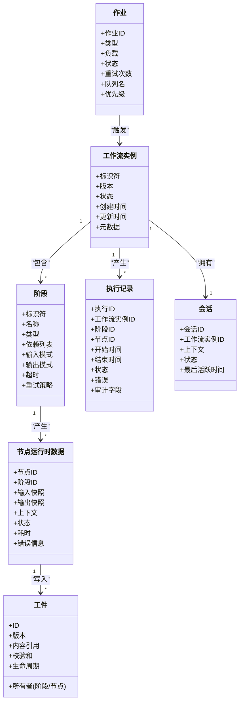

图表来源 
- [src/features/director/types.ts](file://src/features/director/types.ts)
- [src/features/director/runtime-node-data.ts](file://src/features/director/runtime-node-data.ts)
- [src/features/director/runtime-repository.ts](file://src/features/director/runtime-repository.ts)
- [server/src/server/job-runner.ts](file://server/src/server/job-runner.ts)
- [server/src/server/job-store.ts](file://server/src/server/job-store.ts)

## 详细组件分析

### 状态机与阶段管理
- 状态机：工作流实例具有明确的状态集合（如待启动、运行中、暂停、成功、失败、回滚中等），状态推进器在每个阶段前后进行状态转换与校验。
- 阶段管理：阶段定义包含类型、依赖、输入/输出模式、超时与重试策略。阶段执行器依据依赖拓扑确定执行顺序，支持并行与串行混合。
- 工件门控：在执行前检查前置工件是否存在且满足约束，避免无效执行。

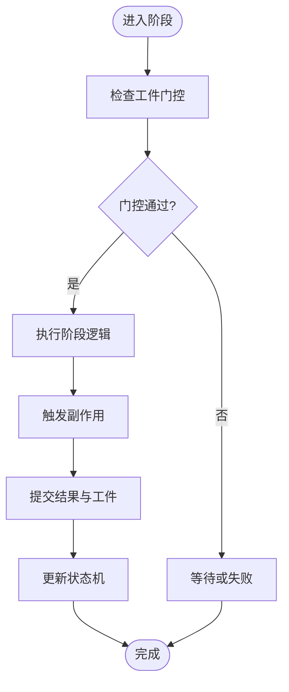

图表来源 
- [src/features/director/advance.ts](file://src/features/director/advance.ts)
- [src/features/director/stage-runner.ts](file://src/features/director/stage-runner.ts)
- [src/features/director/stage-artifact-gate.ts](file://src/features/director/stage-artifact-gate.ts)
- [src/features/director/stage-effects.ts](file://src/features/director/stage-effects.ts)

章节来源
- [src/features/director/advance.ts](file://src/features/director/advance.ts)
- [src/features/director/stage-runner.ts](file://src/features/director/stage-runner.ts)
- [src/features/director/stage-artifact-gate.ts](file://src/features/director/stage-artifact-gate.ts)
- [src/features/director/stage-effects.ts](file://src/features/director/stage-effects.ts)

### 节点类型、依赖与执行顺序
- 节点类型：包括采集、生成、合成、导出、质检等，每种类型定义输入/输出模式与工具调用约定。
- 依赖建模：阶段间通过工件 ID 建立依赖边，形成 DAG；执行器对 DAG 进行拓扑排序，计算可并行执行的批次。
- 执行顺序：同一批内节点可并发执行，跨批之间严格遵循依赖顺序。

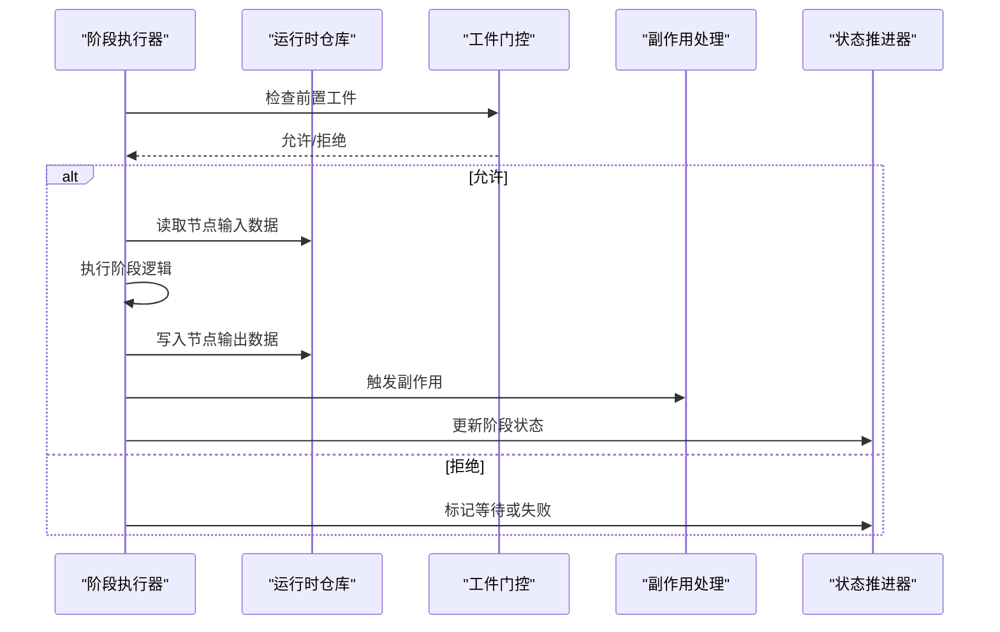

图表来源 
- [src/features/director/stage-runner.ts](file://src/features/director/stage-runner.ts)
- [src/features/director/runtime-repository.ts](file://src/features/director/runtime-repository.ts)
- [src/features/director/stage-artifact-gate.ts](file://src/features/director/stage-artifact-gate.ts)
- [src/features/director/stage-effects.ts](file://src/features/director/stage-effects.ts)
- [src/features/director/advance.ts](file://src/features/director/advance.ts)

章节来源
- [src/features/director/types.ts](file://src/features/director/types.ts)
- [src/features/director/pipeline.ts](file://src/features/director/pipeline.ts)
- [src/features/director/stage-runner.ts](file://src/features/director/stage-runner.ts)
- [src/features/director/runtime-repository.ts](file://src/features/director/runtime-repository.ts)

### 版本控制、快照与回滚
- 版本控制：工件与节点数据均带版本号，支持增量更新与回溯。
- 快照机制：阶段执行前后分别生成输入/输出快照，用于对比与恢复。
- 回滚策略：当阶段失败或检测到不一致时，基于最近有效快照回滚至稳定状态，并记录回滚审计事件。

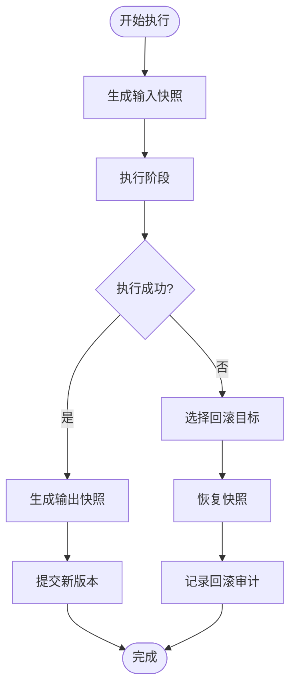

图表来源 
- [src/features/director/runtime-node-data.ts](file://src/features/director/runtime-node-data.ts)
- [src/features/director/runtime-artifact-reader.ts](file://src/features/director/runtime-artifact-reader.ts)
- [src/features/director/runtime-artifact-writer.ts](file://src/features/director/runtime-artifact-writer.ts)
- [src/features/director/output-recovery.ts](file://src/features/director/output-recovery.ts)

章节来源
- [src/features/director/runtime-node-data.ts](file://src/features/director/runtime-node-data.ts)
- [src/features/director/runtime-artifact-reader.ts](file://src/features/director/runtime-artifact-reader.ts)
- [src/features/director/runtime-artifact-writer.ts](file://src/features/director/runtime-artifact-writer.ts)
- [src/features/director/output-recovery.ts](file://src/features/director/output-recovery.ts)

### 执行历史、日志与审计追踪
- 执行历史：每次阶段与节点执行均生成执行记录，包含时间戳、状态、错误信息与关联工件。
- 日志记录：结构化日志与流式日志结合，便于前端实时展示与后端检索。
- 审计追踪：关键操作（创建、修改、删除、回滚）均记录审计事件，支持合规与问题定位。

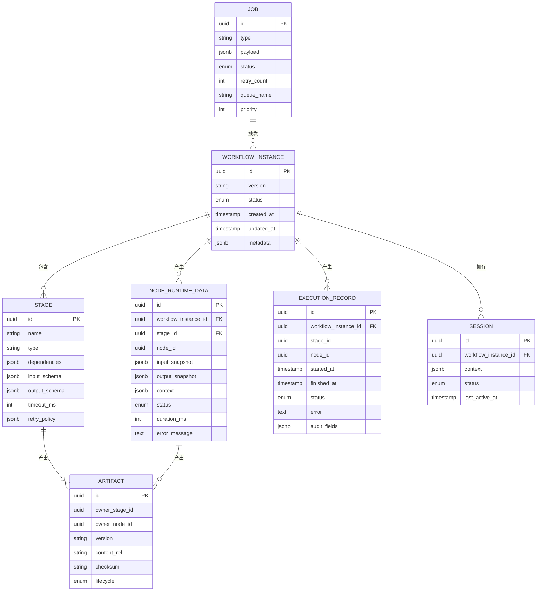

图表来源 
- [src/features/director/types.ts](file://src/features/director/types.ts)
- [src/features/director/runtime-repository.ts](file://src/features/director/runtime-repository.ts)
- [server/src/server/job-runner.ts](file://server/src/server/job-runner.ts)
- [server/src/server/job-store.ts](file://server/src/server/job-store.ts)

章节来源
- [src/features/director/runtime-repository.ts](file://src/features/director/runtime-repository.ts)
- [server/src/server/job-runner.ts](file://server/src/server/job-runner.ts)
- [server/src/server/job-store.ts](file://server/src/server/job-store.ts)

### 模板、参数化与动态生成
- 模板：阶段定义支持模板变量与默认值，便于复用与批量生成。
- 参数化：输入模式与输出模式通过 JSON Schema 约束，运行时校验参数合法性。
- 动态生成：根据上游工件与上下文动态构造下游阶段的输入，实现自适应流水线。

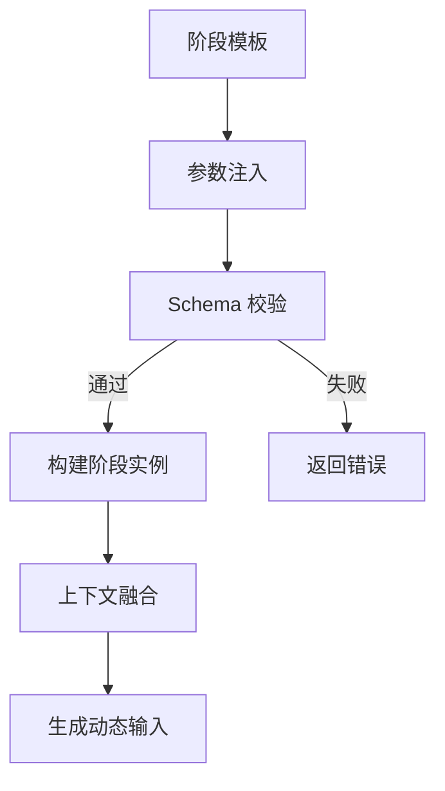

图表来源 
- [src/features/director/types.ts](file://src/features/director/types.ts)
- [src/features/director/pipeline.ts](file://src/features/director/pipeline.ts)

章节来源
- [src/features/director/types.ts](file://src/features/director/types.ts)
- [src/features/director/pipeline.ts](file://src/features/director/pipeline.ts)

### 会话、AI 交互与输出解析
- 会话存储：保存对话上下文、中间状态与最后活跃时间。
- AI 提供者：封装不同模型的请求与响应格式，统一消息协议。
- 输出解析：将模型输出解析为标准化的阶段结果，支持错误与边界情况处理。

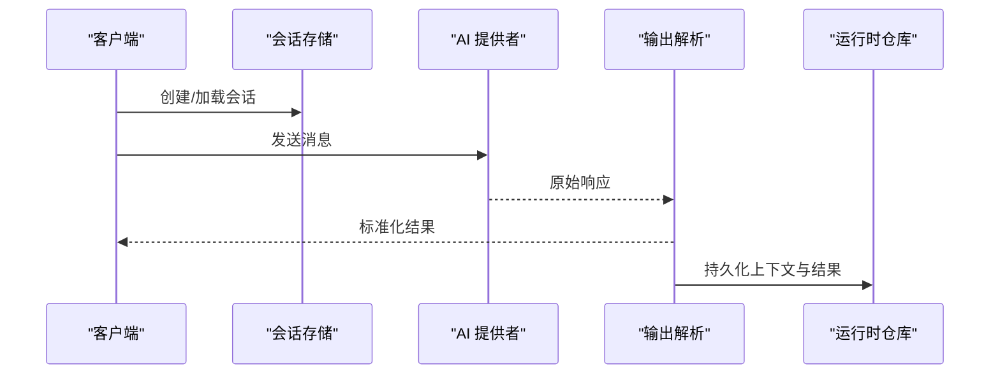

图表来源 
- [src/features/director/session-store.ts](file://src/features/director/session-store.ts)
- [src/features/director/pi-session.ts](file://src/features/director/pi-session.ts)
- [src/features/director/pi-provider.ts](file://src/features/director/pi-provider.ts)
- [src/features/director/pi-output.ts](file://src/features/director/pi-output.ts)
- [src/features/director/runtime-repository.ts](file://src/features/director/runtime-repository.ts)

章节来源
- [src/features/director/session-store.ts](file://src/features/director/session-store.ts)
- [src/features/director/pi-session.ts](file://src/features/director/pi-session.ts)
- [src/features/director/pi-provider.ts](file://src/features/director/pi-provider.ts)
- [src/features/director/pi-output.ts](file://src/features/director/pi-output.ts)
- [src/features/director/runtime-repository.ts](file://src/features/director/runtime-repository.ts)

### 音频时序与制品组装
- 音频时序：对齐音轨与画面帧率，确保同步播放。
- 制品组装：将多个阶段产物按规则拼接、转码与打包，生成最终交付物。

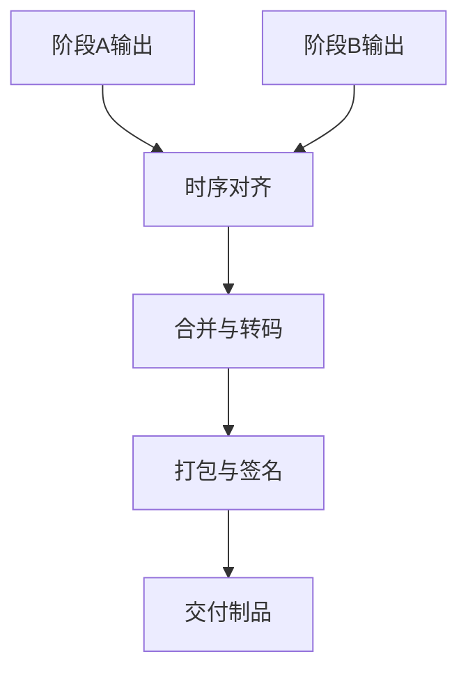

图表来源 
- [src/features/director/audio-timing.ts](file://src/features/director/audio-timing.ts)
- [src/features/director/fabricate.ts](file://src/features/director/fabricate.ts)

章节来源
- [src/features/director/audio-timing.ts](file://src/features/director/audio-timing.ts)
- [src/features/director/fabricate.ts](file://src/features/director/fabricate.ts)

### 队列与作业调度
- 队列处理器：将阶段执行拆分为作业，支持优先级、重试与限流。
- 作业运行器：消费队列中的作业，调用状态推进器与运行时仓库执行具体步骤。
- 作业存储：持久化作业状态与负载，支持查询与监控。

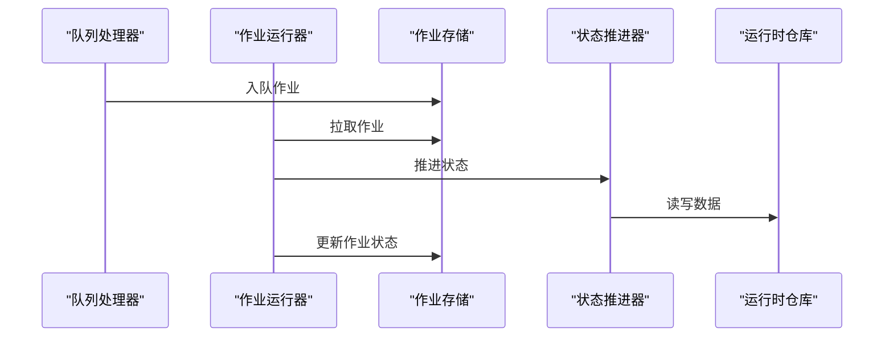

图表来源 
- [src/features/director/queue-handler.ts](file://src/features/director/queue-handler.ts)
- [server/src/server/job-runner.ts](file://server/src/server/job-runner.ts)
- [server/src/server/job-store.ts](file://server/src/server/job-store.ts)
- [src/features/director/advance.ts](file://src/features/director/advance.ts)
- [src/features/director/runtime-repository.ts](file://src/features/director/runtime-repository.ts)

章节来源
- [src/features/director/queue-handler.ts](file://src/features/director/queue-handler.ts)
- [server/src/server/job-runner.ts](file://server/src/server/job-runner.ts)
- [server/src/server/job-store.ts](file://server/src/server/job-store.ts)
- [src/features/director/advance.ts](file://src/features/director/advance.ts)
- [src/features/director/runtime-repository.ts](file://src/features/director/runtime-repository.ts)

## 依赖关系分析
- 低耦合高内聚：阶段执行器仅依赖运行时仓库与工件门控，不直接访问外部服务。
- 明确的接口契约：类型文件定义了所有实体的结构与约束，降低模块间耦合。
- 外部依赖：AI 提供者抽象了不同模型的差异，便于替换与扩展。
- 数据层：通过 Drizzle 配置统一管理数据库连接与迁移。

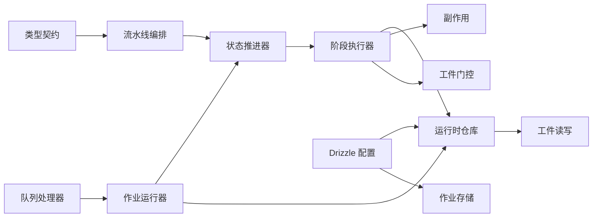

图表来源 
- [src/features/director/types.ts](file://src/features/director/types.ts)
- [src/features/director/pipeline.ts](file://src/features/director/pipeline.ts)
- [src/features/director/advance.ts](file://src/features/director/advance.ts)
- [src/features/director/stage-runner.ts](file://src/features/director/stage-runner.ts)
- [src/features/director/runtime-repository.ts](file://src/features/director/runtime-repository.ts)
- [src/features/director/runtime-artifact-reader.ts](file://src/features/director/runtime-artifact-reader.ts)
- [src/features/director/runtime-artifact-writer.ts](file://src/features/director/runtime-artifact-writer.ts)
- [src/features/director/stage-effects.ts](file://src/features/director/stage-effects.ts)
- [src/features/director/stage-artifact-gate.ts](file://src/features/director/stage-artifact-gate.ts)
- [src/features/director/queue-handler.ts](file://src/features/director/queue-handler.ts)
- [server/src/server/job-runner.ts](file://server/src/server/job-runner.ts)
- [server/src/server/job-store.ts](file://server/src/server/job-store.ts)
- [drizzle.config.ts](file://drizzle.config.ts)

章节来源
- [src/features/director/types.ts](file://src/features/director/types.ts)
- [src/features/director/pipeline.ts](file://src/features/director/pipeline.ts)
- [src/features/director/advance.ts](file://src/features/director/advance.ts)
- [src/features/director/stage-runner.ts](file://src/features/director/stage-runner.ts)
- [src/features/director/runtime-repository.ts](file://src/features/director/runtime-repository.ts)
- [src/features/director/runtime-artifact-reader.ts](file://src/features/director/runtime-artifact-reader.ts)
- [src/features/director/runtime-artifact-writer.ts](file://src/features/director/runtime-artifact-writer.ts)
- [src/features/director/stage-effects.ts](file://src/features/director/stage-effects.ts)
- [src/features/director/stage-artifact-gate.ts](file://src/features/director/stage-artifact-gate.ts)
- [src/features/director/queue-handler.ts](file://src/features/director/queue-handler.ts)
- [server/src/server/job-runner.ts](file://server/src/server/job-runner.ts)
- [server/src/server/job-store.ts](file://server/src/server/job-store.ts)
- [drizzle.config.ts](file://drizzle.config.ts)

## 性能考量
- 并行执行：基于 DAG 的批级并行，最大化利用 CPU 与 I/O。
- 工件缓存：对只读工件进行缓存，减少重复计算与传输。
- 流式处理：大文件与长任务采用流式读写，降低内存峰值。
- 重试与退避：指数退避与幂等键避免重复执行与雪崩。
- 资源隔离：阶段级别设置超时与资源限制，防止单点阻塞。

[本节为通用指导，无需特定文件来源]

## 故障排查指南
- 常见错误：工件缺失、Schema 校验失败、超时、外部服务不可用。
- 定位方法：查看执行记录与审计事件，核对工件版本与校验和。
- 恢复策略：使用输出恢复模块回滚至最近有效快照，必要时重新入队作业。
- 监控建议：关注队列积压、作业失败率与阶段耗时分布。

章节来源
- [src/features/director/output-recovery.ts](file://src/features/director/output-recovery.ts)
- [src/features/director/runtime-repository.ts](file://src/features/director/runtime-repository.ts)
- [server/src/server/job-runner.ts](file://server/src/server/job-runner.ts)
- [server/src/server/job-store.ts](file://server/src/server/job-store.ts)

## 结论
PurpleInk 导演系统通过清晰的数据模型与分层架构，实现了可组合、可观测、可恢复的工作流执行环境。阶段与工件的强契约、版本化与快照机制保障了稳定性与可追溯性；队列与作业调度提升了吞吐与弹性。未来可在模板库、动态依赖推断与更细粒度的权限控制方面继续演进。

[本节为总结，无需特定文件来源]

## 附录
- 术语表：工作流实例、阶段、节点、工件、执行记录、会话、作业等。
- 参考实现：类型定义、仓库接口、作业运行器与存储实现。
- 扩展建议：新增阶段类型需补充输入/输出模式、工具适配与测试用例。

[本节为补充说明，无需特定文件来源]