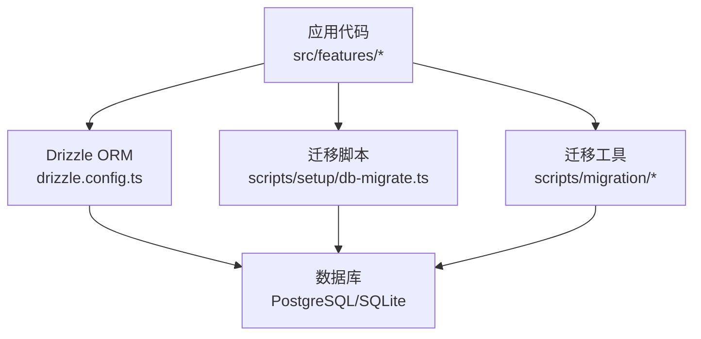
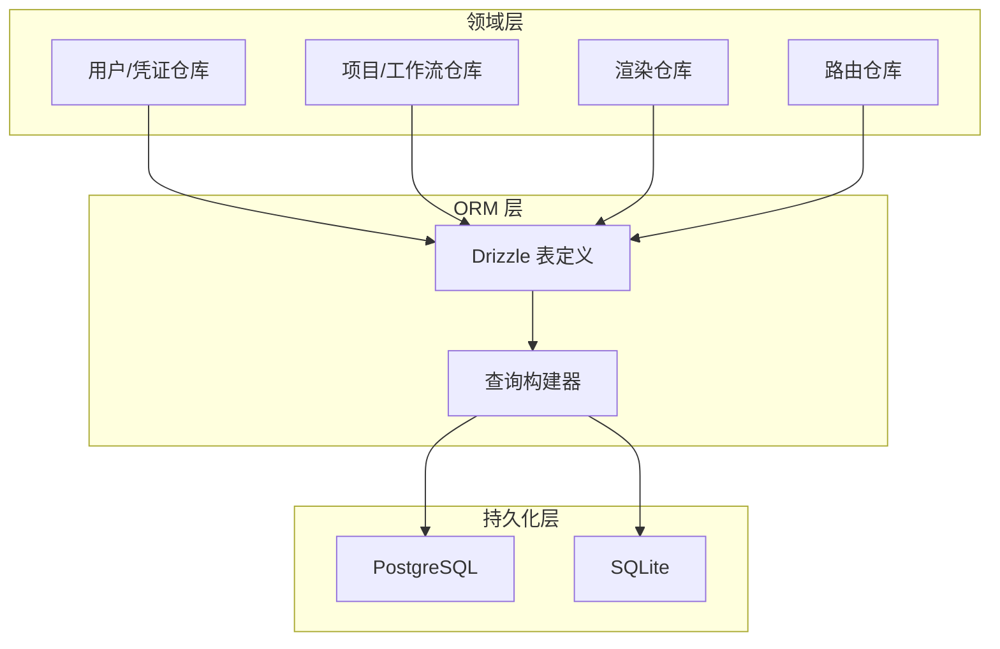
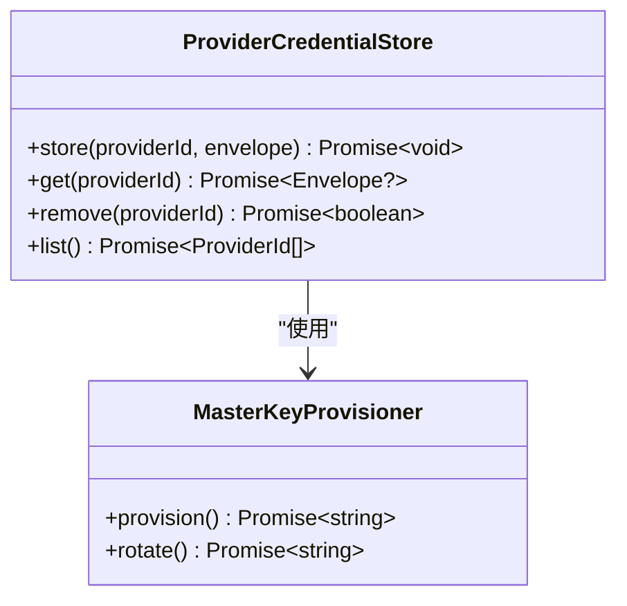
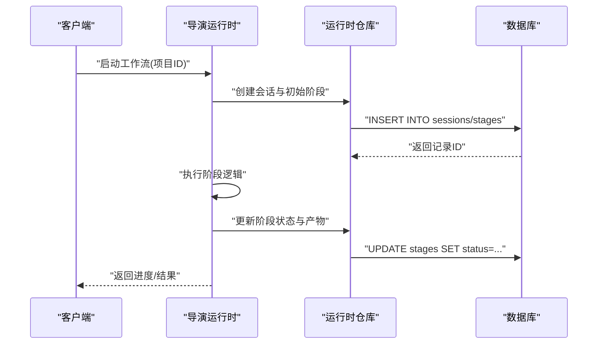
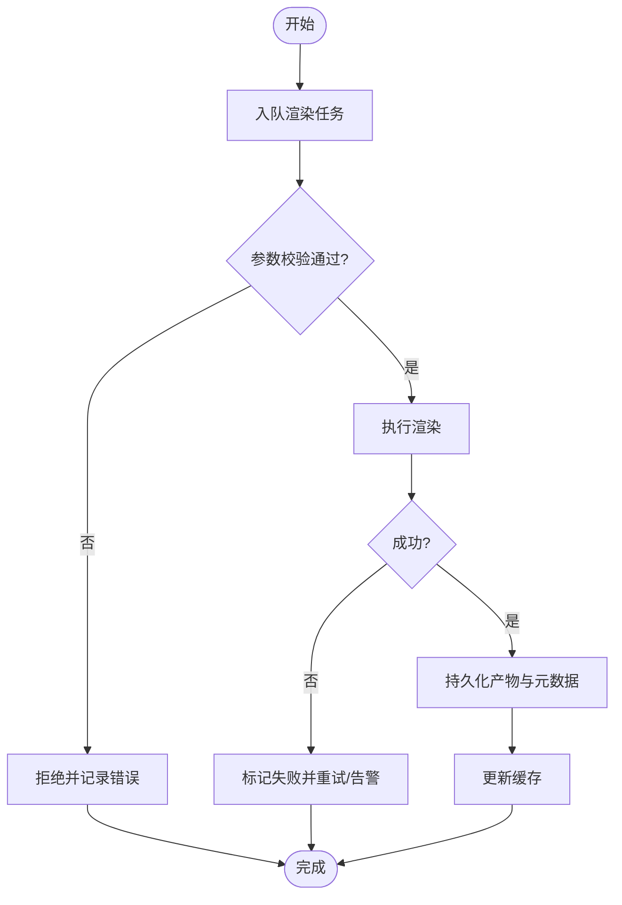
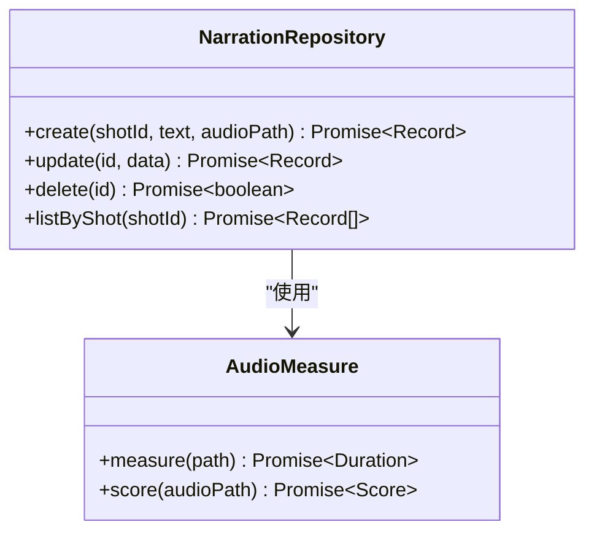
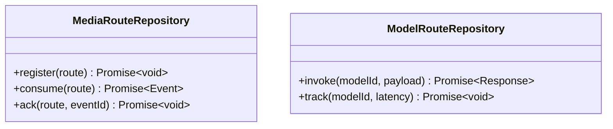
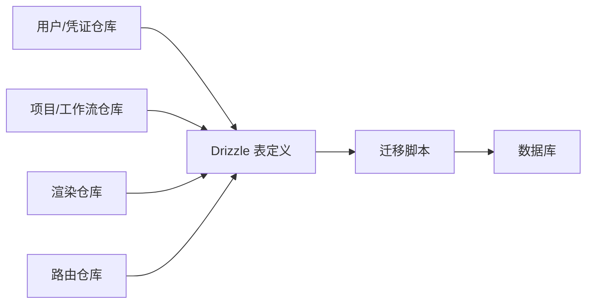

# 数据模型设计

<cite>
**本文引用的文件**   
- [drizzle.config.ts](file://drizzle.config.ts)
- [db-migrate.ts](file://scripts/setup/db-migrate.ts)
- [postgres-init.sql](file://scripts/setup/postgres-init.sql)
- [export-sqlite.ts](file://scripts/migration/export-sqlite.ts)
- [import-postgres.ts](file://scripts/migration/import-postgres.ts)
- [reconcile-postgres.ts](file://scripts/migration/reconcile-postgres.ts)
- [provision-master-key.ts](file://scripts/migration/provision-master-key.ts)
- [runtime-repository.pg.test.ts](file://src/features/director/runtime-repository.pg.test.ts)
- [repository.pg.test.ts](file://src/features/render/repository.pg.test.ts)
- [media-route-repository.pg.test.ts](file://src/features/routing/media-route-repository.pg.test.ts)
- [model-route-repository.pg.test.ts](file://src/features/routing/model-route-repository.pg.test.ts)
- [provider-credential-store.pg.test.ts](file://src/features/credentials/provider-credential-store.pg.test.ts)
- [runtime-repository.ts](file://src/features/director/runtime-repository.ts)
- [render-shot-repository.ts](file://src/features/render/render-shot-repository.ts)
- [render-artifact-repository.ts](file://src/features/render/render-artifact-repository.ts)
- [narration-repository.ts](file://src/features/audio/narration-repository.ts)
</cite>

## 目录
1. [简介](#简介)
2. [项目结构](#项目结构)
3. [核心组件](#核心组件)
4. [架构总览](#架构总览)
5. [详细组件分析](#详细组件分析)
6. [依赖关系分析](#依赖关系分析)
7. [性能考量](#性能考量)
8. [故障排查指南](#故障排查指南)
9. [结论](#结论)
10. [附录](#附录)

## 简介
本文件为 PurpleInk 平台的数据模型设计文档，聚焦基于 Drizzle ORM 的表结构定义、字段类型映射与数据约束；阐述实体关系建模、外键与索引策略；覆盖用户、项目、工作流、渲染任务等核心业务实体的数据结构设计；并提供数据验证规则、默认值设置、级联操作配置、迁移兼容性、版本演进策略与向后兼容保证；同时给出查询优化建议、N+1 问题解决方案与批量操作最佳实践。

## 项目结构
- 数据库与 ORM 配置位于根目录 drizzle.config.ts，用于驱动 Drizzle 的迁移与生成流程。
- 迁移与初始化脚本集中在 scripts/setup 与 scripts/migration：
  - setup/db-migrate.ts：执行数据库迁移。
  - setup/postgres-init.sql：PostgreSQL 初始化脚本（如角色、扩展）。
  - migration/*：跨库迁移工具（SQLite/PostgreSQL）与主密钥准备。
- 数据访问层以“仓库”模式组织在 src/features/*/repository*.ts 中，并通过 .pg.test.ts 集成测试暴露实际使用的表结构与约束。

**图表来源** 
- [drizzle.config.ts](file://drizzle.config.ts)
- [db-migrate.ts](file://scripts/setup/db-migrate.ts)
- [postgres-init.sql](file://scripts/setup/postgres-init.sql)
- [export-sqlite.ts](file://scripts/migration/export-sqlite.ts)
- [import-postgres.ts](file://scripts/migration/import-postgres.ts)
- [reconcile-postgres.ts](file://scripts/migration/reconcile-postgres.ts)

**章节来源**
- [drizzle.config.ts](file://drizzle.config.ts)
- [db-migrate.ts](file://scripts/setup/db-migrate.ts)
- [postgres-init.sql](file://scripts/setup/postgres-init.sql)

## 核心组件
- 用户与权限：通过凭证存储模块管理第三方凭据与主密钥，确保敏感信息的安全存取。
- 项目与工作流：项目作为顶层容器，承载画布、镜头、导出等子资源；工作流由导演子系统编排阶段与节点状态。
- 渲染任务：渲染管线将镜头与素材转换为产物，包含帧序列、缩略图、QA 检查与缓存。
- 路由与媒体：媒体路由与模型路由负责外部输入与模型调用的统一接入点。

上述组件通过仓库接口与数据库交互，仓库实现遵循 Drizzle 的表定义与查询构建器，保证类型安全与可维护性。

**章节来源**
- [provider-credential-store.pg.test.ts](file://src/features/credentials/provider-credential-store.pg.test.ts)
- [runtime-repository.ts](file://src/features/director/runtime-repository.ts)
- [render-shot-repository.ts](file://src/features/render/render-shot-repository.ts)
- [render-artifact-repository.ts](file://src/features/render/render-artifact-repository.ts)
- [media-route-repository.pg.test.ts](file://src/features/routing/media-route-repository.pg.test.ts)
- [model-route-repository.pg.test.ts](file://src/features/routing/model-route-repository.pg.test.ts)

## 架构总览
PurpleInk 的数据层采用“领域仓库 + Drizzle ORM”的分层架构：
- 领域层：各 feature 下的仓库模块封装业务语义与数据访问。
- ORM 层：Drizzle 表定义与查询构建器提供类型安全的 SQL 生成。
- 持久化层：PostgreSQL/SQLite 双引擎支持，通过迁移脚本保持 schema 一致性。

**图表来源** 
- [runtime-repository.pg.test.ts](file://src/features/director/runtime-repository.pg.test.ts)
- [repository.pg.test.ts](file://src/features/render/repository.pg.test.ts)
- [media-route-repository.pg.test.ts](file://src/features/routing/media-route-repository.pg.test.ts)
- [model-route-repository.pg.test.ts](file://src/features/routing/model-route-repository.pg.test.ts)

## 详细组件分析

### 用户与凭证
- 目标：安全存储第三方服务凭据与平台主密钥，支持按提供者隔离与加密信封。
- 关键职责：
  - 凭据信封：序列化、签名与校验。
  - 存储后端：基于 PostgreSQL 的持久化，具备唯一性与审计字段。
  - 主密钥：集中化管理，用于敏感数据加解密。
- 数据约束建议：
  - 唯一性：provider_id + secret_key 组合唯一。
  - 非空：必需字段不可为空。
  - 时间戳：创建与更新时间自动填充。
- 级联策略：删除凭据不应影响其他业务实体；如需清理，使用显式级联或软删除。

**图表来源** 
- [provider-credential-store.pg.test.ts](file://src/features/credentials/provider-credential-store.pg.test.ts)
- [provision-master-key.ts](file://scripts/migration/provision-master-key.ts)

**章节来源**
- [provider-credential-store.pg.test.ts](file://src/features/credentials/provider-credential-store.pg.test.ts)
- [provision-master-key.ts](file://scripts/migration/provision-master-key.ts)

### 项目与工作流（导演运行时）
- 目标：管理项目生命周期与工作流执行状态，支撑多阶段流水线。
- 关键职责：
  - 会话与状态：记录运行时的阶段、节点状态、输入输出引用。
  - 推进逻辑：根据阶段结果推进到下一阶段，处理失败重试。
  - 产物读写：与渲染仓库协作，写入中间产物与最终产物。
- 数据约束建议：
  - 状态机：阶段枚举严格限定，避免非法状态。
  - 外键：project_id、shot_id 等关联字段必须存在。
  - 索引：按 project_id、stage、status 建立复合索引加速查询。
- 级联策略：项目删除时级联清理其工作流与产物；谨慎使用 ON DELETE CASCADE，必要时采用软删除。

**图表来源** 
- [runtime-repository.ts](file://src/features/director/runtime-repository.ts)
- [runtime-repository.pg.test.ts](file://src/features/director/runtime-repository.pg.test.ts)

**章节来源**
- [runtime-repository.ts](file://src/features/director/runtime-repository.ts)
- [runtime-repository.pg.test.ts](file://src/features/director/runtime-repository.pg.test.ts)

### 渲染任务（镜头与产物）
- 目标：将镜头内容渲染为视频/图像产物，并生成缩略图与 QA 报告。
- 关键职责：
  - 镜头仓储：管理镜头元数据、源素材、渲染参数与状态。
  - 产物仓储：管理帧序列、缩略图、导出产物与缓存。
  - 队列与并发：控制渲染任务的入队、出队与并发度。
- 数据约束建议：
  - 状态枚举：pending、running、success、failed 等。
  - 外键：project_id、shot_id、artifact_id 等关联字段。
  - 索引：按 project_id、shot_id、status、created_at 建立索引。
- 级联策略：删除镜头时级联清理相关产物；对大对象（如帧序列）采用软删除或归档策略。

**图表来源** 
- [render-shot-repository.ts](file://src/features/render/render-shot-repository.ts)
- [render-artifact-repository.ts](file://src/features/render/render-artifact-repository.ts)
- [repository.pg.test.ts](file://src/features/render/repository.pg.test.ts)

**章节来源**
- [render-shot-repository.ts](file://src/features/render/render-shot-repository.ts)
- [render-artifact-repository.ts](file://src/features/render/render-artifact-repository.ts)
- [repository.pg.test.ts](file://src/features/render/repository.pg.test.ts)

### 音频与旁白
- 目标：管理音频片段、旁白文本与字幕，支撑 TTS 与后期合成。
- 关键职责：
  - 旁白仓储：存储文本、时长、音频路径与对齐信息。
  - 测量与评分：音频时长测量、质量评分。
  - 字幕生成：基于音频与文本生成 SRT/VTT。
- 数据约束建议：
  - 非空：文本与音频路径必填。
  - 唯一性：同一镜头内旁白条目不重复。
  - 索引：按 shot_id、created_at 建立索引。

**图表来源** 
- [narration-repository.ts](file://src/features/audio/narration-repository.ts)

**章节来源**
- [narration-repository.ts](file://src/features/audio/narration-repository.ts)

### 路由与媒体接入
- 目标：统一管理媒体与模型的路由入口，屏蔽底层差异。
- 关键职责：
  - 媒体路由：接收外部媒体上传与回调。
  - 模型路由：转发模型调用请求与响应。
- 数据约束建议：
  - 唯一性：路由标识唯一。
  - 外键：关联项目或租户。
  - 索引：按路由标识与状态查询。

**图表来源** 
- [media-route-repository.pg.test.ts](file://src/features/routing/media-route-repository.pg.test.ts)
- [model-route-repository.pg.test.ts](file://src/features/routing/model-route-repository.pg.test.ts)

**章节来源**
- [media-route-repository.pg.test.ts](file://src/features/routing/media-route-repository.pg.test.ts)
- [model-route-repository.pg.test.ts](file://src/features/routing/model-route-repository.pg.test.ts)

## 依赖关系分析
- 仓库模块之间通过明确的接口耦合，避免循环依赖。
- Drizzle 表定义与查询构建器被各仓库复用，保证一致的字段类型与约束。
- 迁移脚本与初始化脚本与表结构强绑定，任何变更需同步更新。

**图表来源** 
- [runtime-repository.pg.test.ts](file://src/features/director/runtime-repository.pg.test.ts)
- [repository.pg.test.ts](file://src/features/render/repository.pg.test.ts)
- [media-route-repository.pg.test.ts](file://src/features/routing/media-route-repository.pg.test.ts)
- [model-route-repository.pg.test.ts](file://src/features/routing/model-route-repository.pg.test.ts)

**章节来源**
- [runtime-repository.pg.test.ts](file://src/features/director/runtime-repository.pg.test.ts)
- [repository.pg.test.ts](file://src/features/render/repository.pg.test.ts)
- [media-route-repository.pg.test.ts](file://src/features/routing/media-route-repository.pg.test.ts)
- [model-route-repository.pg.test.ts](file://src/features/routing/model-route-repository.pg.test.ts)

## 性能考量
- 索引设计原则：
  - 高频查询字段建立单列或复合索引（如 project_id + status + created_at）。
  - 避免过度索引导致写放大。
- N+1 问题解决方案：
  - 使用 JOIN 或批量加载（in 查询）减少往返次数。
  - 在仓库层提供聚合查询方法，一次性获取所需数据。
- 批量操作最佳实践：
  - 使用事务包裹批量插入/更新，提升一致性与性能。
  - 分批次提交，避免长事务锁竞争。
- 缓存策略：
  - 对热点数据（如项目列表、镜头元数据）引入内存缓存。
  - 合理设置过期时间与失效策略。

[本节为通用指导，无需特定文件来源]

## 故障排查指南
- 迁移失败：
  - 检查 db-migrate.ts 执行日志与数据库连接配置。
  - 对比 postgres-init.sql 与当前数据库状态。
- 数据不一致：
  - 使用 reconcile-postgres.ts 进行一致性校验与修复。
  - 通过 export-sqlite.ts 与 import-postgres.ts 进行跨库比对。
- 查询性能问题：
  - 使用 EXPLAIN 分析慢查询，补充缺失索引。
  - 检查是否存在 N+1 查询模式。

**章节来源**
- [db-migrate.ts](file://scripts/setup/db-migrate.ts)
- [postgres-init.sql](file://scripts/setup/postgres-init.sql)
- [reconcile-postgres.ts](file://scripts/migration/reconcile-postgres.ts)
- [export-sqlite.ts](file://scripts/migration/export-sqlite.ts)
- [import-postgres.ts](file://scripts/migration/import-postgres.ts)

## 结论
PurpleInk 的数据模型以 Drizzle ORM 为核心，结合清晰的仓库分层与迁移脚本，实现了类型安全、可维护且高性能的数据访问。通过合理的实体关系建模、外键与索引策略，以及严格的迁移与兼容性管理，平台能够稳定支撑用户、项目、工作流与渲染任务等核心业务场景。未来演进应持续关注查询性能、数据一致性与向后兼容性，确保系统长期稳健发展。

[本节为总结性内容，无需特定文件来源]

## 附录
- 数据迁移兼容性：
  - 所有表结构变更需通过迁移脚本管理，禁止直接修改数据库。
  - 迁移脚本应具备幂等性，支持回滚与重放。
- 版本演进策略：
  - 采用语义化版本控制，重大变更提供升级指南。
  - 旧版本数据可通过转换脚本平滑迁移至新版本。
- 向后兼容保证：
  - 新增字段默认值与非空约束需谨慎评估影响范围。
  - 废弃字段保留一段时间，逐步清理。

[本节为通用指导，无需特定文件来源]