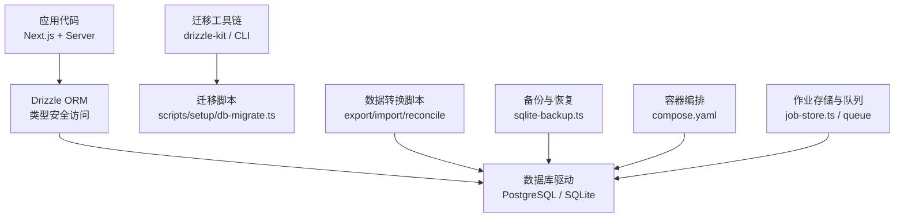
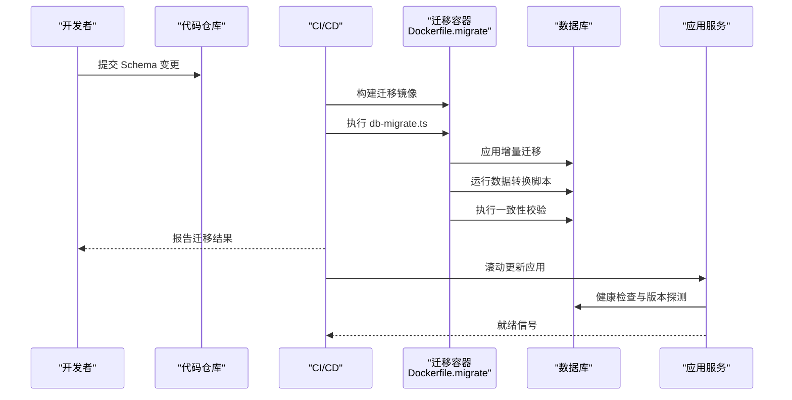
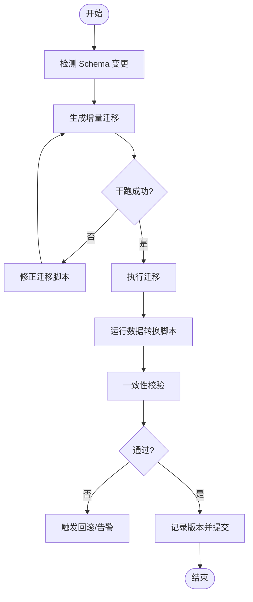
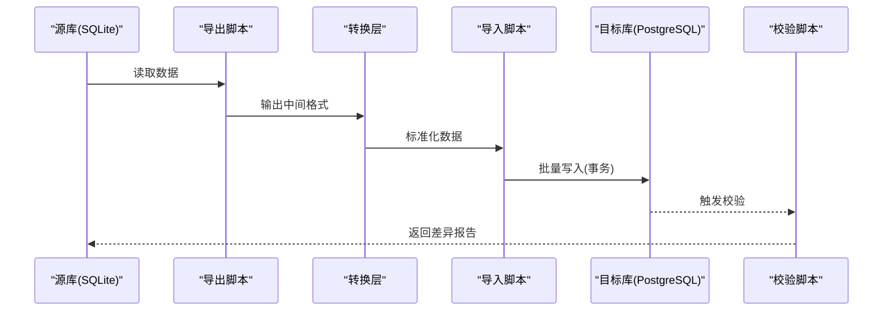
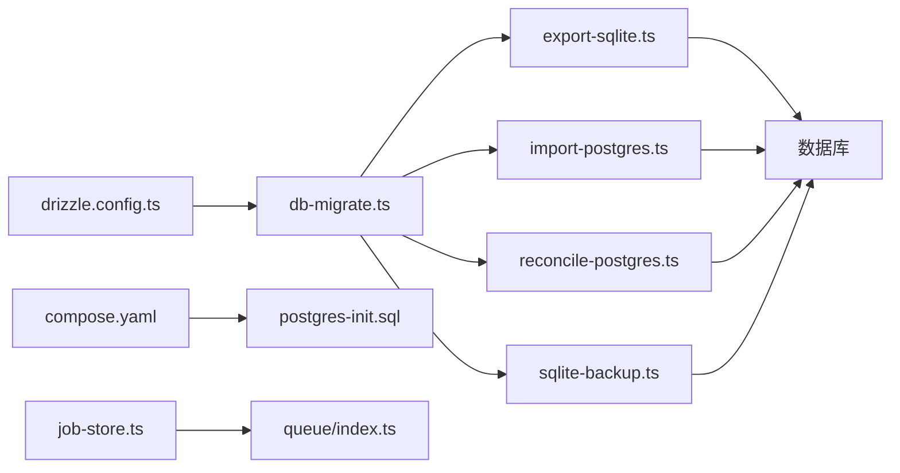

# 数据迁移策略

<cite>
**本文引用的文件**   
- [drizzle.config.ts](file://drizzle.config.ts)
- [Dockerfile.migrate](file://Dockerfile.migrate)
- [scripts/setup/db-migrate.ts](file://scripts/setup/db-migrate.ts)
- [scripts/migration/export-sqlite.ts](file://scripts/migration/export-sqlite.ts)
- [scripts/migration/import-postgres.ts](file://scripts/migration/import-postgres.ts)
- [scripts/migration/reconcile-postgres.ts](file://scripts/migration/reconcile-postgres.ts)
- [scripts/migration/sqlite-backup.ts](file://scripts/migration/sqlite-backup.ts)
- [scripts/setup/postgres-init.sql](file://scripts/setup/postgres-init.sql)
- [deploy/compose.yaml](file://deploy/compose.yaml)
- [server/src/server/job-store.ts](file://server/src/server/job-store.ts)
- [src/features/audio/runtime-repository.pg.test.ts](file://src/features/audio/runtime-repository.pg.test.ts)
- [src/features/director/runtime-repository.pg.test.ts](file://src/features/director/runtime-repository.pg.test.ts)
- [src/features/render/repository.pg.test.ts](file://src/features/render/repository.pg-test.ts)
- [src/lib/queue/index.ts](file://src/lib/queue/index.ts)
</cite>

## 目录
1. [简介](#简介)
2. [项目结构](#项目结构)
3. [核心组件](#核心组件)
4. [架构总览](#架构总览)
5. [详细组件分析](#详细组件分析)
6. [依赖关系分析](#依赖关系分析)
7. [性能考虑](#性能考虑)
8. [故障排查指南](#故障排查指南)
9. [结论](#结论)
10. [附录](#附录)

## 简介
本文件为 PurpleInk 平台制定基于 Drizzle ORM 的数据迁移策略，覆盖版本控制、增量迁移、数据转换脚本、向后兼容性保证、生产环境最佳实践、零停机部署与一致性保障、迁移测试与验证、自动化部署集成、备份恢复与灾难恢复以及迁移故障处理预案。目标是确保数据库变更可追溯、可回滚、可验证，并在高可用环境中实现安全升级。

## 项目结构
仓库中与数据迁移相关的核心位置：
- Drizzle 配置与迁移入口：根级 drizzle.config.ts、Dockerfile.migrate、scripts/setup/db-migrate.ts
- 迁移辅助脚本：scripts/migration/*（SQLite 导出/导入、PostgreSQL 校验与备份）
- 初始化 SQL：scripts/setup/postgres-init.sql
- 容器编排：deploy/compose.yaml（用于本地/CI 启动依赖服务）
- 运行时持久化与队列：server/src/server/job-store.ts、src/lib/queue/index.ts
- 面向 PostgreSQL 的仓储测试：src/features/*/runtime-repository.pg.test.ts 等

图表来源
- [drizzle.config.ts](file://drizzle.config.ts)
- [Dockerfile.migrate](file://Dockerfile.migrate)
- [scripts/setup/db-migrate.ts](file://scripts/setup/db-migrate.ts)
- [scripts/migration/export-sqlite.ts](file://scripts/migration/export-sqlite.ts)
- [scripts/migration/import-postgres.ts](file://scripts/migration/import-postgres.ts)
- [scripts/migration/reconcile-postgres.ts](file://scripts/migration/reconcile-postgres.ts)
- [scripts/migration/sqlite-backup.ts](file://scripts/migration/sqlite-backup.ts)
- [deploy/compose.yaml](file://deploy/compose.yaml)
- [server/src/server/job-store.ts](file://server/src/server/job-store.ts)
- [src/lib/queue/index.ts](file://src/lib/queue/index.ts)

章节来源
- [drizzle.config.ts](file://drizzle.config.ts)
- [Dockerfile.migrate](file://Dockerfile.migrate)
- [scripts/setup/db-migrate.ts](file://scripts/setup/db-migrate.ts)
- [scripts/migration/export-sqlite.ts](file://scripts/migration/export-sqlite.ts)
- [scripts/migration/import-postgres.ts](file://scripts/migration/import-postgres.ts)
- [scripts/migration/reconcile-postgres.ts](file://scripts/migration/reconcile-postgres.ts)
- [scripts/migration/sqlite-backup.ts](file://scripts/migration/sqlite-backup.ts)
- [scripts/setup/postgres-init.sql](file://scripts/setup/postgres-init.sql)
- [deploy/compose.yaml](file://deploy/compose.yaml)
- [server/src/server/job-store.ts](file://server/src/server/job-store.ts)
- [src/lib/queue/index.ts](file://src/lib/queue/index.ts)

## 核心组件
- Drizzle 配置与迁移入口
  - 通过 drizzle.config.ts 定义数据库连接、迁移输出目录与生成器选项；配合 Dockerfile.migrate 提供无侵入的迁移执行环境。
  - scripts/setup/db-migrate.ts 封装迁移命令调用，统一参数与环境变量注入，便于在 CI/CD 中复用。
- 数据转换与校验脚本
  - export-sqlite.ts：从 SQLite 导出数据到中间格式，便于跨引擎迁移。
  - import-postgres.ts：将中间格式导入 PostgreSQL，支持批量写入与事务边界控制。
  - reconcile-postgres.ts：对导入结果进行一致性校验与差异修复，确保目标库与源数据一致。
  - sqlite-backup.ts：对 SQLite 进行快照备份，作为回滚基线。
- 初始化与编排
  - postgres-init.sql：数据库初始化脚本（用户、权限、扩展）。
  - compose.yaml：编排数据库与迁移容器，支持一键拉起依赖服务。
- 运行时持久化与队列
  - job-store.ts：作业状态持久化，需与迁移版本对齐。
  - queue/index.ts：队列抽象，避免在迁移期间阻塞或丢失任务。

章节来源
- [drizzle.config.ts](file://drizzle.config.ts)
- [Dockerfile.migrate](file://Dockerfile.migrate)
- [scripts/setup/db-migrate.ts](file://scripts/setup/db-migrate.ts)
- [scripts/migration/export-sqlite.ts](file://scripts/migration/export-sqlite.ts)
- [scripts/migration/import-postgres.ts](file://scripts/migration/import-postgres.ts)
- [scripts/migration/reconcile-postgres.ts](file://scripts/migration/reconcile-postgres.ts)
- [scripts/migration/sqlite-backup.ts](file://scripts/migration/sqlite-backup.ts)
- [scripts/setup/postgres-init.sql](file://scripts/setup/postgres-init.sql)
- [deploy/compose.yaml](file://deploy/compose.yaml)
- [server/src/server/job-store.ts](file://server/src/server/job-store.ts)
- [src/lib/queue/index.ts](file://src/lib/queue/index.ts)

## 架构总览
下图展示从开发到生产的迁移流水线：开发者提交 schema 变更 → 生成迁移脚本 → 在镜像中执行迁移 → 运行数据转换与校验 → 发布应用并验证健康检查。

图表来源
- [Dockerfile.migrate](file://Dockerfile.migrate)
- [scripts/setup/db-migrate.ts](file://scripts/setup/db-migrate.ts)
- [scripts/migration/export-sqlite.ts](file://scripts/migration/export-sqlite.ts)
- [scripts/migration/import-postgres.ts](file://scripts/migration/import-postgres.ts)
- [scripts/migration/reconcile-postgres.ts](file://scripts/migration/reconcile-postgres.ts)
- [deploy/compose.yaml](file://deploy/compose.yaml)

## 详细组件分析

### Drizzle 迁移流程与版本控制
- 版本管理
  - 使用 Drizzle 的迁移机制，每个变更生成独立迁移文件，按顺序执行，确保幂等性与可回滚性。
  - 通过环境变量控制目标数据库连接，支持多环境切换。
- 增量迁移
  - 仅对新增或修改的表/列执行变更，避免全量重建。
  - 对破坏性变更采用“先加后删”的两阶段策略，保持向前兼容。
- 回滚机制
  - 针对可逆操作生成反向迁移；不可逆操作通过数据转换脚本补偿。
  - 结合备份快照（SQLite）或数据库快照（PostgreSQL）实现快速回滚。

图表来源
- [drizzle.config.ts](file://drizzle.config.ts)
- [scripts/setup/db-migrate.ts](file://scripts/setup/db-migrate.ts)

章节来源
- [drizzle.config.ts](file://drizzle.config.ts)
- [scripts/setup/db-migrate.ts](file://scripts/setup/db-migrate.ts)

### 数据转换脚本与向后兼容性
- 导出与导入
  - export-sqlite.ts 将 SQLite 数据导出为标准中间格式，屏蔽底层差异。
  - import-postgres.ts 批量导入至 PostgreSQL，使用事务包裹以保证原子性。
- 一致性校验
  - reconcile-postgres.ts 对比源与目标数据的关键指标（行数、哈希、抽样值），发现差异自动修复或告警。
- 向后兼容
  - 字段重命名采用“新增字段 → 双写 → 迁移 → 删除旧字段”的流程。
  - 默认值与约束变更分阶段推进，避免中断现有写入路径。

图表来源
- [scripts/migration/export-sqlite.ts](file://scripts/migration/export-sqlite.ts)
- [scripts/migration/import-postgres.ts](file://scripts/migration/import-postgres.ts)
- [scripts/migration/reconcile-postgres.ts](file://scripts/migration/reconcile-postgres.ts)

章节来源
- [scripts/migration/export-sqlite.ts](file://scripts/migration/export-sqlite.ts)
- [scripts/migration/import-postgres.ts](file://scripts/migration/import-postgres.ts)
- [scripts/migration/reconcile-postgres.ts](file://scripts/migration/reconcile-postgres.ts)

### 备份与恢复
- SQLite 备份
  - sqlite-backup.ts 定期生成快照，支持压缩与异地存储，作为回滚基线。
- PostgreSQL 恢复
  - 结合 pg_dump/pg_restore 或云厂商快照，快速恢复到指定时间点。
- 恢复演练
  - 在预发环境定期演练恢复流程，验证 RTO/RPO 指标。

章节来源
- [scripts/migration/sqlite-backup.ts](file://scripts/migration/sqlite-backup.ts)

### 初始化与编排
- 初始化脚本
  - postgres-init.sql 创建用户、角色、扩展，确保最小权限原则。
- 容器编排
  - compose.yaml 编排数据库与迁移容器，支持环境变量注入与依赖启动顺序。

章节来源
- [scripts/setup/postgres-init.sql](file://scripts/setup/postgres-init.sql)
- [deploy/compose.yaml](file://deploy/compose.yaml)

### 运行时持久化与队列
- 作业存储
  - job-store.ts 负责作业状态持久化，需与迁移版本对齐，避免读写不一致。
- 队列抽象
  - src/lib/queue/index.ts 抽象队列接口，迁移期间暂停消费或延迟处理，防止任务丢失。

章节来源
- [server/src/server/job-store.ts](file://server/src/server/job-store.ts)
- [src/lib/queue/index.ts](file://src/lib/queue/index.ts)

### 面向 PostgreSQL 的仓储测试
- 测试覆盖
  - runtime-repository.pg.test.ts 等文件验证仓储层在真实 PG 环境下的行为，包括事务、索引与查询计划。
- 迁移回归
  - 每次迁移后运行 PG 测试套件，确保查询语义与性能未退化。

章节来源
- [src/features/audio/runtime-repository.pg.test.ts](file://src/features/audio/runtime-repository.pg.test.ts)
- [src/features/director/runtime-repository.pg.test.ts](file://src/features/director/runtime-repository.pg.test.ts)
- [src/features/render/repository.pg-test.ts](file://src/features/render/repository.pg-test.ts)

## 依赖关系分析
迁移相关模块之间的依赖如下：

图表来源
- [drizzle.config.ts](file://drizzle.config.ts)
- [scripts/setup/db-migrate.ts](file://scripts/setup/db-migrate.ts)
- [scripts/migration/export-sqlite.ts](file://scripts/migration/export-sqlite.ts)
- [scripts/migration/import-postgres.ts](file://scripts/migration/import-postgres.ts)
- [scripts/migration/reconcile-postgres.ts](file://scripts/migration/reconcile-postgres.ts)
- [scripts/migration/sqlite-backup.ts](file://scripts/migration/sqlite-backup.ts)
- [scripts/setup/postgres-init.sql](file://scripts/setup/postgres-init.sql)
- [deploy/compose.yaml](file://deploy/compose.yaml)
- [server/src/server/job-store.ts](file://server/src/server/job-store.ts)
- [src/lib/queue/index.ts](file://src/lib/queue/index.ts)

章节来源
- [drizzle.config.ts](file://drizzle.config.ts)
- [scripts/setup/db-migrate.ts](file://scripts/setup/db-migrate.ts)
- [scripts/migration/export-sqlite.ts](file://scripts/migration/export-sqlite.ts)
- [scripts/migration/import-postgres.ts](file://scripts/migration/import-postgres.ts)
- [scripts/migration/reconcile-postgres.ts](file://scripts/migration/reconcile-postgres.ts)
- [scripts/migration/sqlite-backup.ts](file://scripts/migration/sqlite-backup.ts)
- [scripts/setup/postgres-init.sql](file://scripts/setup/postos-init.sql)
- [deploy/compose.yaml](file://deploy/compose.yaml)
- [server/src/server/job-store.ts](file://server/src/server/job-store.ts)
- [src/lib/queue/index.ts](file://src/lib/queue/index.ts)

## 性能考虑
- 批量写入与事务边界
  - 导入脚本应使用批量插入与合理的事务大小，减少锁竞争与 WAL 压力。
- 索引与统计信息
  - 迁移前后重建必要索引，更新统计信息，避免查询退化。
- 并发与限流
  - 大表迁移时限制并发度，避免影响在线业务；必要时使用影子表与交换策略。
- 监控与度量
  - 记录迁移耗时、错误率、锁等待时间，设置阈值告警。

[本节为通用指导，不直接分析具体文件]

## 故障排查指南
- 常见错误
  - 迁移冲突：版本号重复或顺序错误，需清理迁移历史并重放。
  - 数据不一致：校验失败，需定位差异行并手动修复或重新导入。
  - 锁超时：长事务或热点表导致，需优化事务粒度与索引。
- 诊断步骤
  - 查看迁移日志与校验报告，定位失败阶段。
  - 检查数据库锁、慢查询与资源使用。
  - 回滚到最近稳定版本，恢复备份快照。
- 应急预案
  - 立即停止滚动更新，启用只读模式。
  - 执行回滚脚本与恢复流程，验证健康检查。
  - 复盘根因，补充测试用例与防护逻辑。

章节来源
- [scripts/migration/reconcile-postgres.ts](file://scripts/migration/reconcile-postgres.ts)
- [scripts/migration/sqlite-backup.ts](file://scripts/migration/sqlite-backup.ts)

## 结论
通过 Drizzle ORM 的迁移体系与配套脚本，PurpleInk 实现了可追溯、可回滚、可验证的数据迁移流程。结合备份恢复、一致性校验与自动化部署，能够在生产环境安全地进行零停机升级。建议持续完善测试覆盖、监控告警与演练机制，确保迁移过程稳健可靠。

[本节为总结性内容，不直接分析具体文件]

## 附录
- 最佳实践清单
  - 所有变更以增量迁移形式提交，禁止手工修改生产数据库。
  - 破坏性变更采用两阶段策略，确保向前兼容。
  - 每次迁移后运行 PG 测试套件与一致性校验。
  - 定期演练备份恢复流程，验证 RTO/RPO。
  - 在 CI/CD 中固化迁移步骤，禁止人工干预。
- 参考文件
  - 迁移配置与入口：drizzle.config.ts、Dockerfile.migrate、scripts/setup/db-migrate.ts
  - 数据转换与校验：scripts/migration/*
  - 初始化与编排：scripts/setup/postgres-init.sql、deploy/compose.yaml
  - 运行时持久化：server/src/server/job-store.ts、src/lib/queue/index.ts
  - PG 仓储测试：src/features/*/runtime-repository.pg.test.ts

[本节为附录说明，不直接分析具体文件]