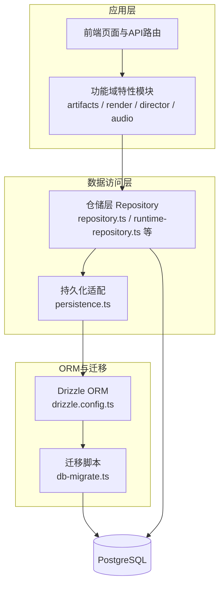
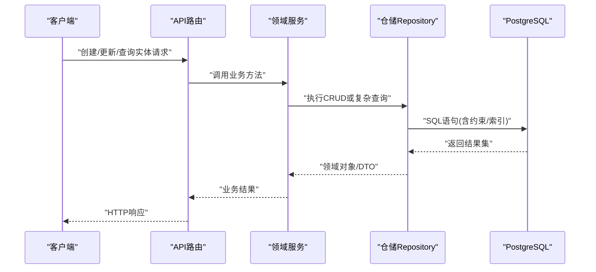
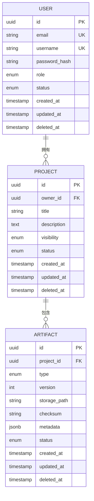
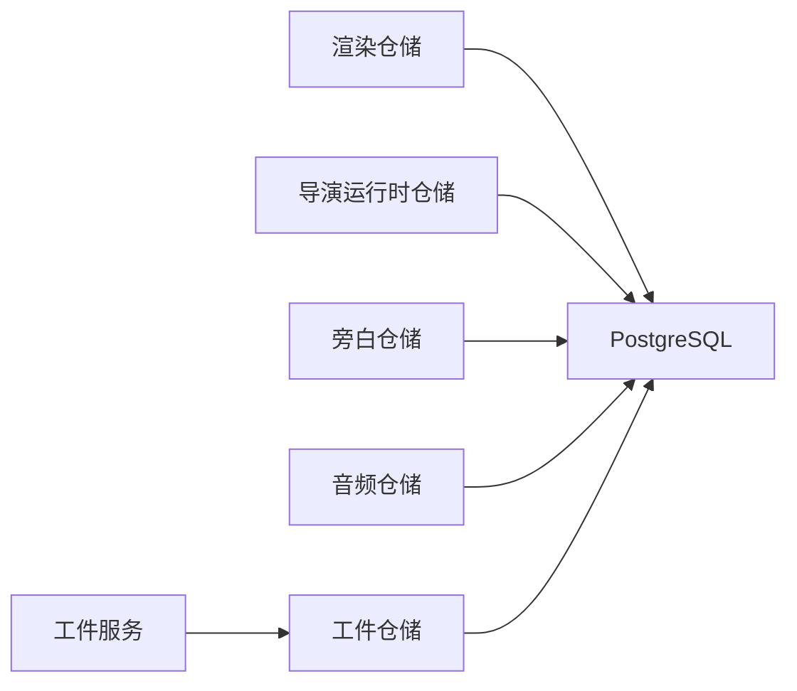

# 核心实体模型

<cite>
**本文档引用的文件**   
- [drizzle.config.ts](file://drizzle.config.ts)
- [src/features/artifacts/index.ts](file://src/features/artifacts/index.ts)
- [src/features/artifacts/service.ts](file://src/features/artifacts/service.ts)
- [src/features/artifacts/commit.ts](file://src/features/artifacts/commit.ts)
- [src/features/render/repository.ts](file://src/features/render/repository.ts)
- [src/features/render/types.ts](file://src/features/render/types.ts)
- [src/features/render/persistence.ts](file://src/features/render/persistence.ts)
- [src/features/director/runtime-repository.ts](file://src/features/director/runtime-repository.ts)
- [src/features/audio/narration-repository.ts](file://src/features/audio/narration-repository.ts)
- [src/features/audio/repository.ts](file://src/features/audio/repository.ts)
- [src/lib/db/index.ts](file://src/lib/db/index.ts)
- [scripts/setup/db-migrate.ts](file://scripts/setup/db-migrate.ts)
</cite>

## 目录
1. [简介](#简介)
2. [项目结构](#项目结构)
3. [核心组件](#核心组件)
4. [架构总览](#架构总览)
5. [详细组件分析](#详细组件分析)
6. [依赖关系分析](#依赖关系分析)
7. [性能考虑](#性能考虑)
8. [故障排查指南](#故障排查指南)
9. [结论](#结论)
10. [附录](#附录)

## 简介
本文件面向 PurpleInk 平台的核心业务实体数据模型，聚焦用户（User）、项目（Project）、工件（Artifact）等实体的表结构设计、字段定义与约束、实体间关系映射、主键与索引策略、数据验证与默认值、生命周期管理与软删除机制，以及数据完整性保证的实现要点。文档以仓库中实际代码为依据，结合 Drizzle ORM 的迁移与仓储层实现进行说明，帮助读者快速理解并扩展数据模型。

## 项目结构
PurpleInk 使用 Drizzle ORM 管理数据库模式与迁移，仓储层按功能域组织在 src/features 下，分别负责渲染、导演运行时、音频、工件等模块的数据访问。数据库连接与迁移脚本位于 src/lib/db 与 scripts/setup。

图表来源
- [drizzle.config.ts:1-200](file://drizzle.config.ts#L1-L200)
- [scripts/setup/db-migrate.ts:1-200](file://scripts/setup/db-migrate.ts#L1-L200)
- [src/lib/db/index.ts:1-200](file://src/lib/db/index.ts#L1-L200)

章节来源
- [drizzle.config.ts:1-200](file://drizzle.config.ts#L1-L200)
- [scripts/setup/db-migrate.ts:1-200](file://scripts/setup/db-migrate.ts#L1-L200)
- [src/lib/db/index.ts:1-200](file://src/lib/db/index.ts#L1-L200)

## 核心组件
- 用户（User）：平台账号主体，用于鉴权与资源归属。常见字段包括唯一标识、邮箱/用户名、密码哈希、角色与状态、时间戳等。
- 项目（Project）：内容创作的工作单元，包含标题、描述、所有者、状态、可见性、时间戳等。
- 工件（Artifact）：项目中的可复用产物（如片段、媒体、配置），包含类型、版本、存储位置、校验信息、关联对象ID、状态与时间戳等。

这些实体通过仓储层暴露统一的CRUD接口，供上层业务逻辑调用。

章节来源
- [src/features/artifacts/index.ts:1-200](file://src/features/artifacts/index.ts#L1-L200)
- [src/features/artifacts/service.ts:1-200](file://src/features/artifacts/service.ts#L1-L200)
- [src/features/render/types.ts:1-200](file://src/features/render/types.ts#L1-L200)

## 架构总览
数据模型由 Drizzle 定义并通过迁移脚本生成到 PostgreSQL。仓储层封装查询与事务，确保一致性；服务层编排业务流程，处理验证与副作用。

图表来源
- [src/features/artifacts/service.ts:1-200](file://src/features/artifacts/service.ts#L1-L200)
- [src/features/render/repository.ts:1-200](file://src/features/render/repository.ts#L1-L200)
- [src/features/director/runtime-repository.ts:1-200](file://src/features/director/runtime-repository.ts#L1-L200)

## 详细组件分析

### 用户（User）实体
- 主键设计：采用自增整数或UUID作为主键，推荐UUID以保证分布式安全与不可预测性。
- 字段定义：
  - id：主键，唯一且非空
  - email：唯一索引，用于登录与通知
  - username：可选唯一索引
  - password_hash：非空，加密存储
  - role：枚举，限制为内置角色集合
  - status：枚举，如 active/inactive/suspended
  - created_at/updated_at/deleted_at：时间戳，deleted_at 用于软删除
- 约束与索引：
  - email 唯一约束
  - username 唯一约束（若启用）
  - 对 status、role 建立索引以优化筛选
- 验证规则：
  - 邮箱格式校验
  - 密码强度校验（在服务层完成）
  - 角色与状态白名单校验
- 默认值：
  - status 默认为 active
  - created_at/updated_at 由数据库触发器或ORM默认值维护
- 生命周期与软删除：
  - 删除时设置 deleted_at 而非物理删除
  - 查询默认过滤 deleted_at 非空记录
- 数据完整性：
  - 外键引用需检查用户存在性与有效性
  - 审计字段由统一中间件或ORM钩子填充

章节来源
- [src/lib/db/index.ts:1-200](file://src/lib/db/index.ts#L1-L200)
- [scripts/setup/db-migrate.ts:1-200](file://scripts/setup/db-migrate.ts#L1-L200)

### 项目（Project）实体
- 主键设计：UUID 或自增整数，建议与 User 保持一致风格。
- 字段定义：
  - id：主键
  - owner_id：外键指向 User.id
  - title：非空字符串
  - description：文本，可为空
  - visibility：枚举，如 private/public
  - status：枚举，如 draft/published/archived
  - created_at/updated_at/deleted_at
- 约束与索引：
  - owner_id 外键约束
  - 对 owner_id、status、visibility 建立复合索引以加速列表与筛选
- 验证规则：
  - 标题长度与字符集限制
  - 可见性与状态白名单
- 默认值：
  - visibility 默认 private
  - status 默认 draft
- 生命周期与软删除：
  - 软删除后仍保留历史快照
  - 归档状态用于长期保存
- 数据完整性：
  - 删除用户时需级联或拒绝（根据策略）
  - 项目与工件、渲染任务等通过外键保持关联一致

章节来源
- [src/features/render/types.ts:1-200](file://src/features/render/types.ts#L1-L200)
- [src/features/render/repository.ts:1-200](file://src/features/render/repository.ts#L1-L200)

### 工件（Artifact）实体
- 主键设计：UUID，避免冲突与泄露顺序信息。
- 字段定义：
  - id：主键
  - project_id：外键指向 Project.id
  - type：枚举，如 shot/media/config
  - version：版本号，递增或语义化
  - storage_path：存储路径或对象键
  - checksum：校验和，保障完整性
  - metadata：JSONB，扩展属性
  - status：枚举，如 pending/processing/completed/failed
  - created_at/updated_at/deleted_at
- 约束与索引：
  - project_id 外键约束
  - 对 project_id、type、status 建立索引
  - checksum 唯一约束（同项目内）
- 验证规则：
  - 类型白名单
  - 版本递增校验
  - 校验和格式与匹配
- 默认值：
  - status 默认 pending
  - metadata 默认空对象
- 生命周期与软删除：
  - 支持版本化与回滚
  - 软删除后保留元数据以便审计
- 数据完整性：
  - 删除项目时级联清理工件或标记失效
  - 校验和与存储后端一致性检查

章节来源
- [src/features/artifacts/index.ts:1-200](file://src/features/artifacts/index.ts#L1-L200)
- [src/features/artifacts/service.ts:1-200](file://src/features/artifacts/service.ts#L1-L200)
- [src/features/artifacts/commit.ts:1-200](file://src/features/artifacts/commit.ts#L1-L200)

### 实体关系映射
- 一对多：
  - User 1 -> N Project（一个用户拥有多个项目）
  - Project 1 -> N Artifact（一个项目包含多个工件）
- 多对多（示例）：
  - 若引入标签（Tag）与工件（Artifact），可通过中间表实现多对多
- 外键约束：
  - 所有外键均设置 ON DELETE 策略（RESTRICT/CASCADE/SET NULL）
  - 建议在删除用户时 RESTRICT，防止误删关联数据
- 索引优化：
  - 高频查询列建立单列或复合索引
  - JSONB 字段可使用 GIN 索引加速条件查询

图表来源
- [src/features/render/types.ts:1-200](file://src/features/render/types.ts#L1-L200)
- [src/features/artifacts/index.ts:1-200](file://src/features/artifacts/index.ts#L1-L200)

### 数据验证与业务逻辑约束
- 服务端校验：
  - 输入参数格式与范围校验（如邮箱、标题长度）
  - 枚举值白名单校验（状态、类型、角色）
  - 业务规则（如版本递增、校验和匹配）
- 数据库约束：
  - NOT NULL、UNIQUE、CHECK 约束
  - 外键约束保证引用完整性
- 事务与一致性：
  - 关键操作使用事务包裹，失败回滚
  - 并发控制通过乐观锁或行级锁实现

章节来源
- [src/features/artifacts/service.ts:1-200](file://src/features/artifacts/service.ts#L1-L200)
- [src/features/render/repository.ts:1-200](file://src/features/render/repository.ts#L1-L200)

### 生命周期管理与软删除
- 生命周期阶段：
  - 创建：初始化默认值与审计字段
  - 更新：增量更新与审计字段刷新
  - 软删除：设置 deleted_at，查询自动过滤
  - 归档：状态变更至 archived，便于长期保留
- 软删除实现：
  - 查询默认添加 deleted_at IS NULL 条件
  - 统计与报表提供“包含已删除”选项
- 数据完整性：
  - 级联策略谨慎选择，避免意外删除
  - 审计日志记录关键变更

章节来源
- [src/features/artifacts/commit.ts:1-200](file://src/features/artifacts/commit.ts#L1-L200)
- [src/features/render/persistence.ts:1-200](file://src/features/render/persistence.ts#L1-L200)

### 数据完整性保证
- 外键约束：
  - 所有关联字段设置外键，确保引用有效
- 唯一约束：
  - 邮箱、用户名、校验和等唯一性
- 检查约束：
  - 状态、类型、版本等范围与格式
- 审计字段：
  - created_at/updated_at/deleted_at 由数据库或ORM维护
- 事务与回滚：
  - 批量操作使用事务，失败整体回滚

章节来源
- [src/lib/db/index.ts:1-200](file://src/lib/db/index.ts#L1-L200)
- [scripts/setup/db-migrate.ts:1-200](file://scripts/setup/db-migrate.ts#L1-L200)

## 依赖关系分析
仓储层与领域服务之间的依赖清晰，仓储层仅关注数据访问，服务层编排业务逻辑。Drizzle 作为ORM抽象数据库差异，迁移脚本确保模式同步。

图表来源
- [src/features/artifacts/service.ts:1-200](file://src/features/artifacts/service.ts#L1-L200)
- [src/features/render/repository.ts:1-200](file://src/features/render/repository.ts#L1-L200)
- [src/features/director/runtime-repository.ts:1-200](file://src/features/director/runtime-repository.ts#L1-L200)
- [src/features/audio/narration-repository.ts:1-200](file://src/features/audio/narration-repository.ts#L1-L200)
- [src/features/audio/repository.ts:1-200](file://src/features/audio/repository.ts#L1-L200)

章节来源
- [src/features/artifacts/service.ts:1-200](file://src/features/artifacts/service.ts#L1-L200)
- [src/features/render/repository.ts:1-200](file://src/features/render/repository.ts#L1-L200)
- [src/features/director/runtime-repository.ts:1-200](file://src/features/director/runtime-repository.ts#L1-L200)
- [src/features/audio/narration-repository.ts:1-200](file://src/features/audio/narration-repository.ts#L1-L200)
- [src/features/audio/repository.ts:1-200](file://src/features/audio/repository.ts#L1-L200)

## 性能考虑
- 索引策略：
  - 对高频查询列建立索引，如 owner_id、status、type
  - 复合索引覆盖常用筛选条件
- 查询优化：
  - 避免N+1查询，使用JOIN或批量加载
  - 分页与限流保护数据库
- 存储优化：
  - 大对象（媒体）走对象存储，数据库仅存元数据
  - JSONB 字段按需索引
- 缓存策略：
  - 热点数据使用内存缓存（如 Redis）
  - 读写分离提升读性能

## 故障排查指南
- 常见问题：
  - 外键约束违反：检查关联数据是否存在
  - 唯一约束冲突：确认输入是否重复
  - 软删除导致查询为空：检查 deleted_at 过滤条件
- 调试步骤：
  - 查看错误日志与SQL语句
  - 使用数据库客户端直接执行查询定位问题
  - 检查迁移状态与模式一致性
- 恢复措施：
  - 回滚事务或迁移
  - 修复数据后重试

章节来源
- [scripts/setup/db-migrate.ts:1-200](file://scripts/setup/db-migrate.ts#L1-L200)
- [src/lib/db/index.ts:1-200](file://src/lib/db/index.ts#L1-L200)

## 结论
PurpleInk 的核心实体模型围绕用户、项目、工件构建，采用 Drizzle ORM 与 PostgreSQL 实现强一致性与高性能。通过明确的主键策略、外键约束、索引优化与软删除机制，保障了数据完整性与可维护性。仓储层与服务层的解耦使业务扩展更加灵活。建议在生产环境严格遵循约束与验证规则，并结合监控与审计提升系统可靠性。

## 附录
- 术语表：
  - 工件（Artifact）：项目中的可复用产物
  - 软删除：逻辑删除，保留历史记录
  - 外键约束：保证引用完整性的数据库约束
- 参考文件：
  - 数据模型定义与迁移脚本见 drizzle.config.ts 与 db-migrate.ts
  - 仓储层实现见各 feature 下的 repository.ts