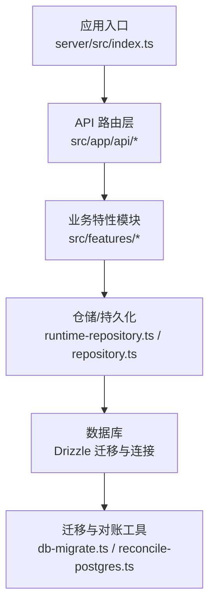
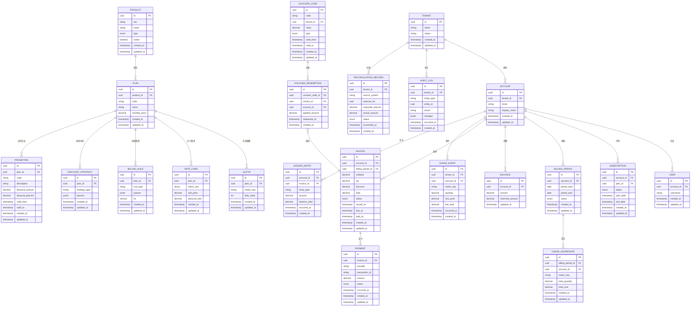
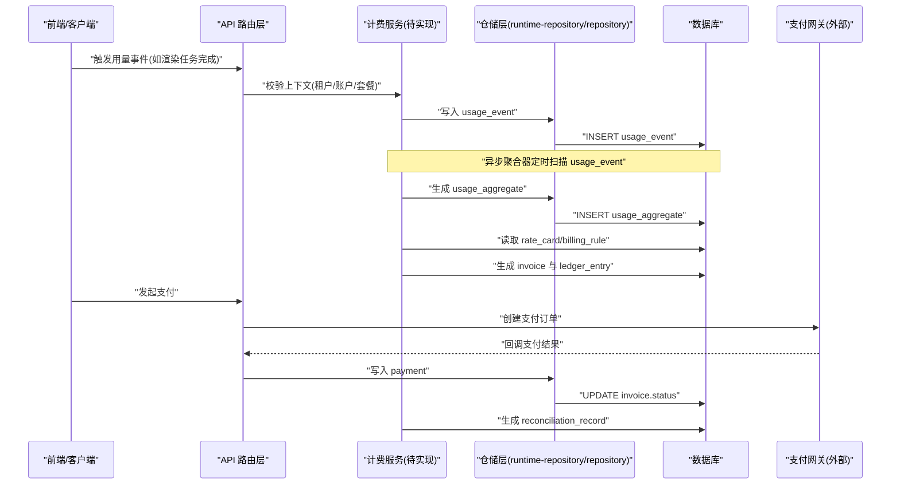
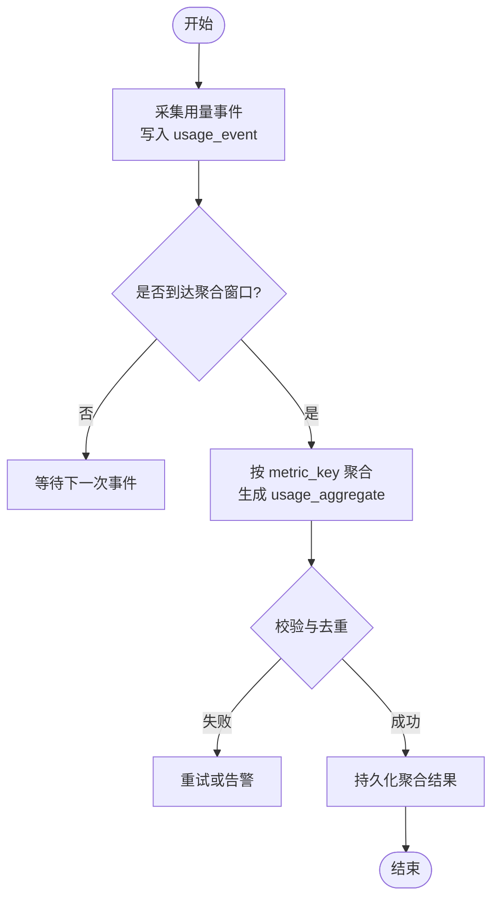
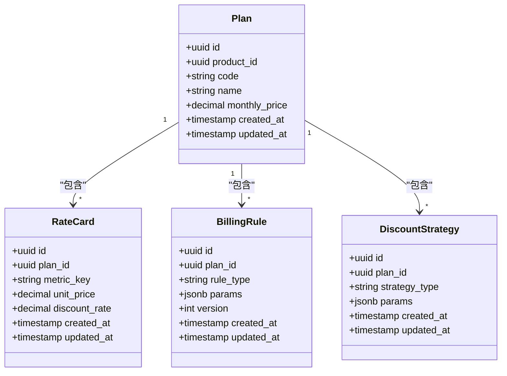
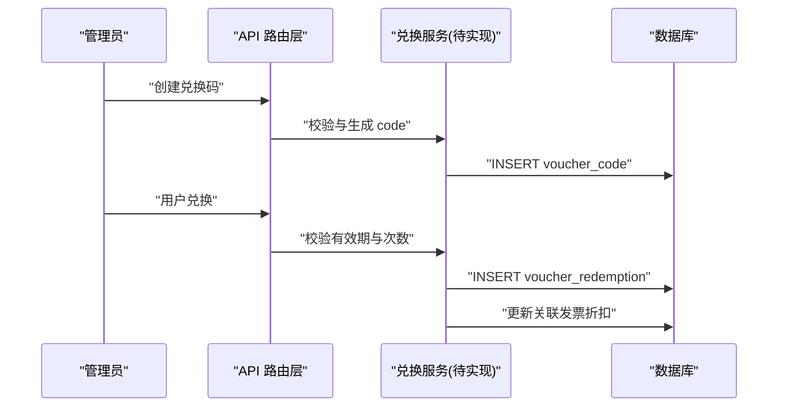
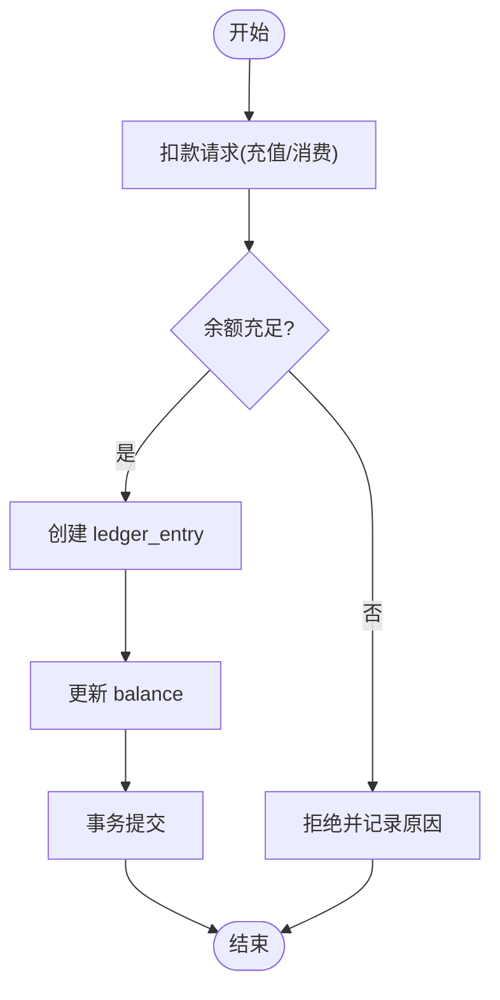
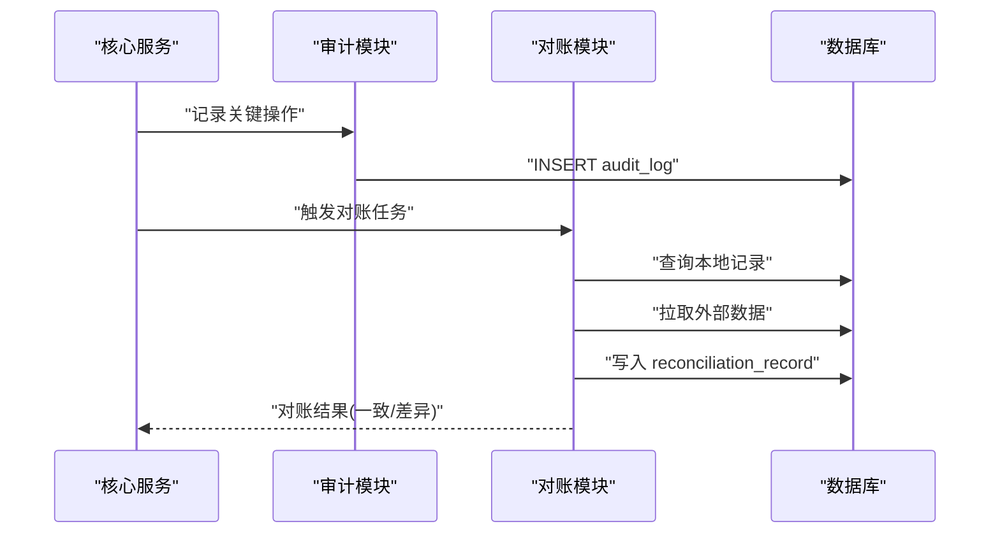
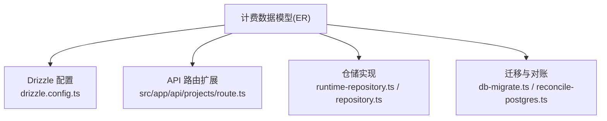

# 计费模型

<cite>
**本文引用的文件**   
- [drizzle.config.ts](file://drizzle.config.ts)
- [server/src/index.ts](file://server/src/index.ts)
- [src/app/api/projects/route.ts](file://src/app/api/projects/route.ts)
- [src/features/director/runtime-repository.ts](file://src/features/director/runtime-repository.ts)
- [src/features/render/repository.ts](file://src/features/render/repository.ts)
- [scripts/setup/db-migrate.ts](file://scripts/setup/db-migrate.ts)
- [scripts/migration/reconcile-postgres.ts](file://scripts/migration/reconcile-postgres.ts)
</cite>

## 目录
1. [简介](#简介)
2. [项目结构](#项目结构)
3. [核心组件](#核心组件)
4. [架构总览](#架构总览)
5. [详细组件分析](#详细组件分析)
6. [依赖分析](#依赖分析)
7. [性能考虑](#性能考虑)
8. [故障排查指南](#故障排查指南)
9. [结论](#结论)
10. [附录](#附录)

## 简介
本文件为 PurpleInk 计费系统的数据模型文档，聚焦计费周期、用量统计、费率卡片与兑换码等计费实体，以及计费流水账本、余额管理、账单生成的表结构设计。同时涵盖计费规则版本控制、折扣策略与促销活动的数据模型支持，并给出审计追踪、对账机制与财务合规性数据存储方案，以及扩展性与多租户隔离的模型设计建议。当前仓库未包含已实现的计费代码，本文基于现有工程结构与常见计费模式提出可落地的数据模型与集成点建议，便于后续实现与演进。

## 项目结构
从仓库结构看，计费相关能力尚未在业务层显式落地，但存在可用于集成的基础设施：
- 数据库迁移与配置：通过 Drizzle ORM 进行数据库建模与迁移（drizzle.config.ts），并提供迁移脚本入口（scripts/setup/db-migrate.ts）与对账工具（scripts/migration/reconcile-postgres.ts）。
- API 路由：Next.js App Router 下的 API 路由示例（如 src/app/api/projects/route.ts）可作为计费接口扩展的挂载点。
- 运行时与渲染仓储：features 目录下存在运行时与渲染相关的仓储实现（如 runtime-repository.ts、repository.ts），可作为用量采集与事件落库的参考位置。

**图表来源** 
- [server/src/index.ts](file://server/src/index.ts)
- [src/app/api/projects/route.ts](file://src/app/api/projects/route.ts)
- [src/features/director/runtime-repository.ts](file://src/features/director/runtime-repository.ts)
- [src/features/render/repository.ts](file://src/features/render/repository.ts)
- [scripts/setup/db-migrate.ts](file://scripts/setup/db-migrate.ts)
- [scripts/migration/reconcile-postgres.ts](file://scripts/migration/reconcile-postgres.ts)

**章节来源**
- [drizzle.config.ts](file://drizzle.config.ts)
- [scripts/setup/db-migrate.ts](file://scripts/setup/db-migrate.ts)
- [scripts/migration/reconcile-postgres.ts](file://scripts/migration/reconcile-postgres.ts)
- [src/app/api/projects/route.ts](file://src/app/api/projects/route.ts)
- [src/features/director/runtime-repository.ts](file://src/features/director/runtime-repository.ts)
- [src/features/render/repository.ts](file://src/features/render/repository.ts)

## 核心组件
本节概述计费系统的核心数据域与关系，为后续详细设计奠定基础：
- 租户与账户：租户（tenant）、账户（account）、用户（user）构成计费主体。
- 产品与套餐：产品（product）、套餐（plan）、订阅（subscription）、用量配额（quota）。
- 费率与规则：费率卡（rate_card）、计费规则（billing_rule）、折扣策略（discount_strategy）、促销活动（promotion）。
- 用量与事件：用量事件（usage_event）、用量聚合（usage_aggregate）、计费周期（billing_period）。
- 账务与账单：余额（balance）、流水账本（ledger_entry）、账单（invoice）、支付记录（payment）。
- 兑换码：兑换码（voucher_code）、兑换记录（voucher_redemption）。
- 审计与对账：审计日志（audit_log）、对账记录（reconciliation_record）。

[本图为概念性 ER 图，用于说明计费数据模型关系，不直接映射到具体源文件]

## 架构总览
计费系统采用“事件驱动 + 周期性结算”的架构：
- 用量采集：在各功能模块（如渲染、AI 调用、存储使用）埋点产生 usage_event，按租户与账户维度写入。
- 周期结算：按 billing_period 聚合 usage_aggregate，结合 rate_card 与 billing_rule 计算费用，生成 invoice。
- 支付与对账：支付记录 payment 与外部渠道对齐，reconciliation_record 保障一致性。
- 审计与合规：所有关键变更写入 audit_log，满足财务审计要求。
- 多租户隔离：以 tenant_id 作为主隔离键，确保数据与权限隔离。

**图表来源** 
- [src/app/api/projects/route.ts](file://src/app/api/projects/route.ts)
- [src/features/director/runtime-repository.ts](file://src/features/director/runtime-repository.ts)
- [src/features/render/repository.ts](file://src/features/render/repository.ts)

## 详细组件分析

### 计费周期与用量聚合
- 计费周期（billing_period）：按账户划分时间窗口，状态包括未开始、进行中、已关闭、已结算。
- 用量事件（usage_event）：记录每次资源消耗，包含度量键、数量、单价、行金额、发生时间。
- 用量聚合（usage_aggregate）：周期内按度量键汇总总量与成本，供账单计算。

**图表来源** 
- [src/features/director/runtime-repository.ts](file://src/features/director/runtime-repository.ts)
- [src/features/render/repository.ts](file://src/features/render/repository.ts)

**章节来源**
- [src/features/director/runtime-repository.ts](file://src/features/director/runtime-repository.ts)
- [src/features/render/repository.ts](file://src/features/render/repository.ts)

### 费率卡片与计费规则
- 费率卡（rate_card）：绑定套餐与度量键，定义单位价格与折扣率。
- 计费规则（billing_rule）：针对套餐的规则参数（如阶梯计价、封顶策略），支持版本控制。
- 折扣策略（discount_strategy）：全局或套餐级折扣策略，参数化配置。

**图表来源** 
- [drizzle.config.ts](file://drizzle.config.ts)

**章节来源**
- [drizzle.config.ts](file://drizzle.config.ts)

### 兑换码与促销活动
- 兑换码（voucher_code）：租户级发放，支持固定金额或百分比折扣，有效期控制。
- 兑换记录（voucher_redemption）：记录兑换行为，关联发票与账户，防止重复使用。
- 促销活动（promotion）：与套餐关联的活动配置，支持时间窗与条件限制。

**图表来源** 
- [src/app/api/projects/route.ts](file://src/app/api/projects/route.ts)

**章节来源**
- [src/app/api/projects/route.ts](file://src/app/api/projects/route.ts)

### 余额管理与流水账本
- 余额（balance）：账户维度，记录可用余额与冻结金额。
- 流水账本（ledger_entry）：每笔资金变动记录，含类型、金额、变动后余额、发生时间。
- 账单（invoice）：周期结算产物，包含子总额、税费、折扣、总金额与状态。

**图表来源** 
- [src/features/render/repository.ts](file://src/features/render/repository.ts)

**章节来源**
- [src/features/render/repository.ts](file://src/features/render/repository.ts)

### 审计追踪与对账机制
- 审计日志（audit_log）：记录关键实体的增删改操作，包含变更详情与时间戳。
- 对账记录（reconciliation_record）：与外部系统（支付网关、云厂商）对账，记录期望与实际差异及状态。

**图表来源** 
- [scripts/migration/reconcile-postgres.ts](file://scripts/migration/reconcile-postgres.ts)

**章节来源**
- [scripts/migration/reconcile-postgres.ts](file://scripts/migration/reconcile-postgres.ts)

## 依赖分析
计费数据模型依赖以下基础设施：
- Drizzle ORM：用于数据库建模与迁移（drizzle.config.ts）。
- Next.js API 路由：作为计费接口的扩展点（src/app/api/projects/route.ts）。
- 仓储层：用量采集与聚合的持久化逻辑（runtime-repository.ts、repository.ts）。
- 迁移与对账工具：数据库初始化与一致性校验（db-migrate.ts、reconcile-postgres.ts）。

**图表来源** 
- [drizzle.config.ts](file://drizzle.config.ts)
- [src/app/api/projects/route.ts](file://src/app/api/projects/route.ts)
- [src/features/director/runtime-repository.ts](file://src/features/director/runtime-repository.ts)
- [src/features/render/repository.ts](file://src/features/render/repository.ts)
- [scripts/setup/db-migrate.ts](file://scripts/setup/db-migrate.ts)
- [scripts/migration/reconcile-postgres.ts](file://scripts/migration/reconcile-postgres.ts)

**章节来源**
- [drizzle.config.ts](file://drizzle.config.ts)
- [src/app/api/projects/route.ts](file://src/app/api/projects/route.ts)
- [src/features/director/runtime-repository.ts](file://src/features/director/runtime-repository.ts)
- [src/features/render/repository.ts](file://src/features/render/repository.ts)
- [scripts/setup/db-migrate.ts](file://scripts/setup/db-migrate.ts)
- [scripts/migration/reconcile-postgres.ts](file://scripts/migration/reconcile-postgres.ts)

## 性能考虑
- 用量事件写入：采用批量插入与分区表（按时间分区）提升写入吞吐。
- 聚合计算：异步批处理，避免阻塞主流程；使用物化视图加速查询。
- 索引策略：对 tenant_id、account_id、metric_key、occurred_at 建立复合索引。
- 事务边界：流水记账与余额更新在同一事务中，保证一致性。
- 缓存策略：热点费率卡与规则可缓存，降低数据库压力。

[本节为通用性能建议，不直接分析具体文件]

## 故障排查指南
- 用量事件丢失：检查仓储层写入路径与重试机制，确认消息队列（如有）堆积情况。
- 聚合异常：核对度量键与费率卡匹配关系，检查去重逻辑与幂等性。
- 余额不一致：核查流水账本顺序与事务提交，比对外部支付回调。
- 对账差异：定位 reconciliation_record 的差异字段，拉取外部系统原始数据进行比对。

**章节来源**
- [src/features/director/runtime-repository.ts](file://src/features/director/runtime-repository.ts)
- [src/features/render/repository.ts](file://src/features/render/repository.ts)
- [scripts/migration/reconcile-postgres.ts](file://scripts/migration/reconcile-postgres.ts)

## 结论
本文提出了 PurpleInk 计费系统的完整数据模型与架构建议，覆盖计费周期、用量统计、费率卡片、兑换码、流水账本、余额管理、账单生成、规则版本控制、折扣与促销、审计与对账，以及扩展性与多租户隔离。建议在现有仓储与 API 路由基础上逐步实现计费服务，并通过 Drizzle 迁移与对账工具保障数据一致性与合规性。

[本节为总结性内容，不直接分析具体文件]

## 附录
- 术语表：
  - 租户（tenant）：计费隔离的最小组织单元。
  - 账户（account）：租户下的付费主体。
  - 套餐（plan）：产品的一种定价与配额组合。
  - 度量键（metric_key）：用量统计的维度标识（如“渲染时长”、“存储空间”）。
  - 费率卡（rate_card）：单位价格与折扣的配置。
  - 流水账本（ledger_entry）：资金变动的明细记录。
  - 对账记录（reconciliation_record）：与外部系统的一致性校验结果。

[本节为补充信息，不直接分析具体文件]