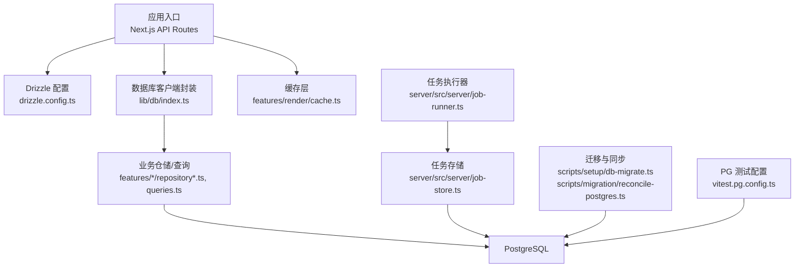
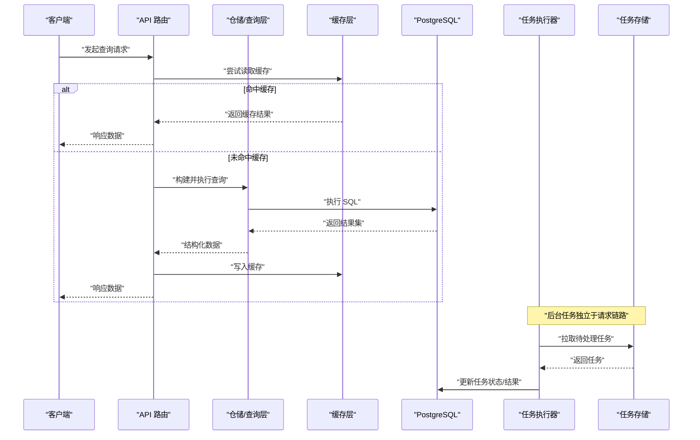
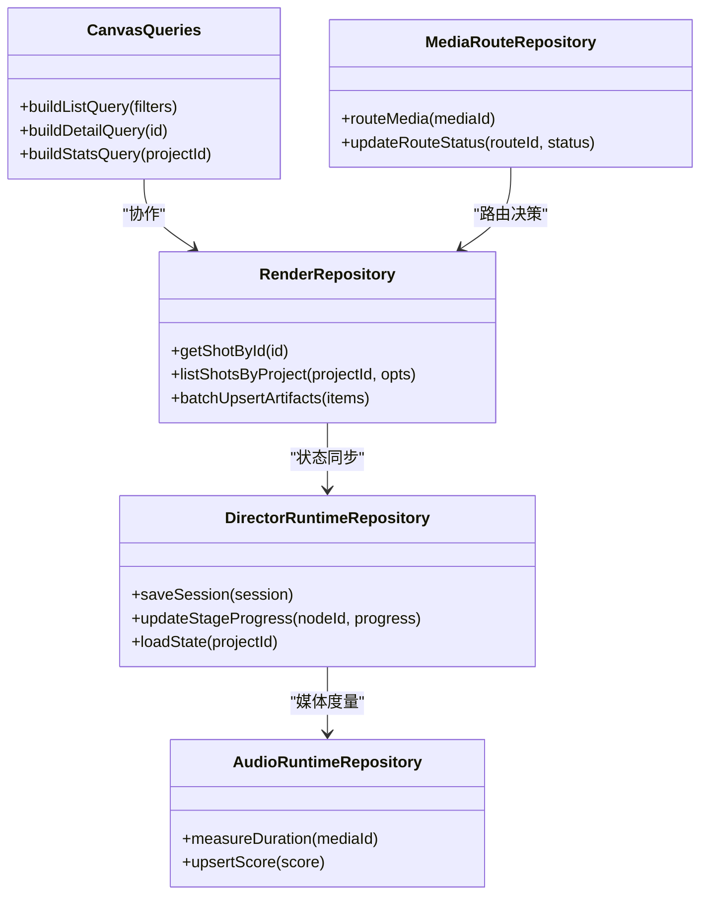
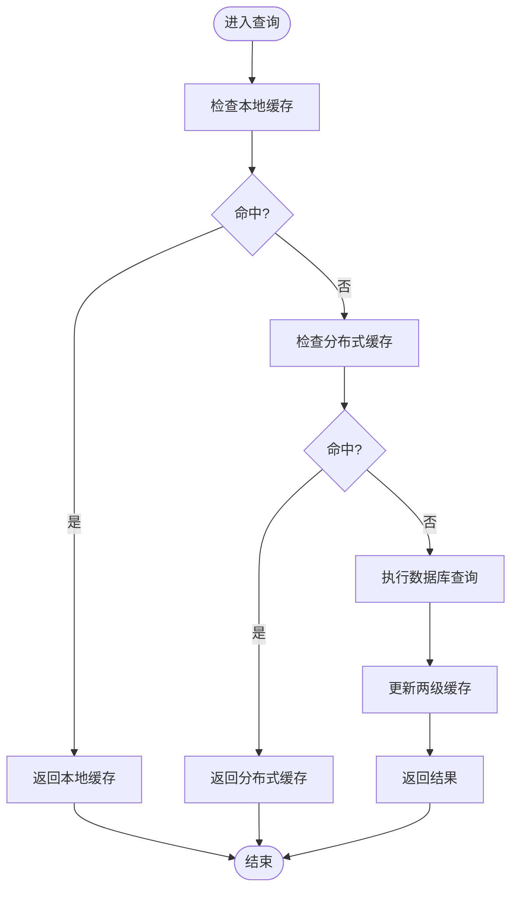
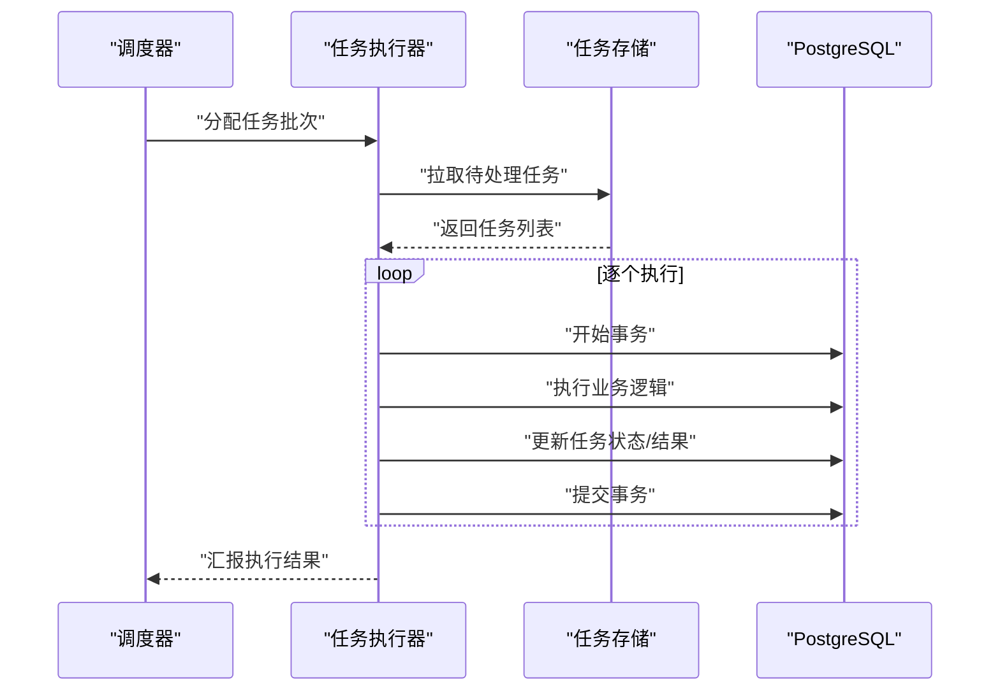
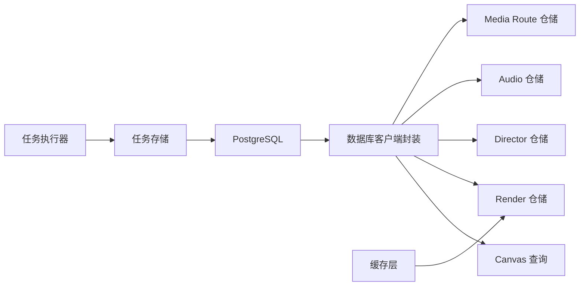

# 查询优化与性能调优

<cite>
**本文引用的文件**   
- [drizzle.config.ts](file://drizzle.config.ts)
- [package.json](file://package.json)
- [lib/db/index.ts](file://src/lib/db/index.ts)
- [features/canvas/queries.ts](file://src/features/canvas/queries.ts)
- [features/render/cache.ts](file://src/features/render/cache.ts)
- [features/render/repository.ts](file://src/features/render/repository.ts)
- [features/director/runtime-repository.ts](file://src/features/director/runtime-repository.ts)
- [features/audio/runtime-repository.ts](file://src/features/audio/runtime-repository.ts)
- [features/routing/media-route-repository.ts](file://src/features/routing/media-route-repository.ts)
- [scripts/setup/db-migrate.ts](file://scripts/setup/db-migrate.ts)
- [scripts/migration/reconcile-postgres.ts](file://scripts/migration/reconcile-postgres.ts)
- [server/src/server/job-runner.ts](file://server/src/server/job-runner.ts)
- [server/src/server/job-store.ts](file://server/src/server/job-store.ts)
- [vitest.pg.config.ts](file://vitest.pg.config.ts)
</cite>

## 目录
1. [简介](#简介)
2. [项目结构](#项目结构)
3. [核心组件](#核心组件)
4. [架构总览](#架构总览)
5. [详细组件分析](#详细组件分析)
6. [依赖关系分析](#依赖关系分析)
7. [性能考量](#性能考量)
8. [故障排查指南](#故障排查指南)
9. [结论](#结论)
10. [附录](#附录)

## 简介
本文件面向 PurpleInk 平台的查询优化与性能调优，聚焦 Drizzle Query Builder 的高级用法、复杂查询构建与优化技巧；深入讲解索引策略设计、查询计划分析与慢查询优化；覆盖事务管理、并发控制与锁机制；给出缓存策略、读写分离与分库分表方案；并包含连接池调优、内存管理与资源监控、性能基准测试、负载测试与容量规划指导。文档以仓库实际代码为依据，结合可视化图示帮助读者快速定位关键实现与优化点。

## 项目结构
PurpleInk 使用 Drizzle ORM 进行数据库访问，相关配置与迁移脚本位于根目录与 scripts 目录；数据访问层分布在 features 下的各业务模块（如 canvas、render、director、audio、routing）的 repository/queries 文件中；服务端任务执行与持久化在 server 子项目中；测试环境通过 vitest 的 PostgreSQL 配置驱动。

**图表来源** 
- [drizzle.config.ts](file://drizzle.config.ts)
- [lib/db/index.ts](file://src/lib/db/index.ts)
- [features/render/cache.ts](file://src/features/render/cache.ts)
- [server/src/server/job-runner.ts](file://server/src/server/job-runner.ts)
- [server/src/server/job-store.ts](file://server/src/server/job-store.ts)
- [scripts/setup/db-migrate.ts](file://scripts/setup/db-migrate.ts)
- [scripts/migration/reconcile-postgres.ts](file://scripts/migration/reconcile-postgres.ts)
- [vitest.pg.config.ts](file://vitest.pg.config.ts)

**章节来源**
- [drizzle.config.ts](file://drizzle.config.ts)
- [package.json](file://package.json)

## 核心组件
- Drizzle 配置与迁移：集中管理数据库连接、方言与迁移流程，确保 schema 一致性与可重复部署。
- 数据库客户端封装：统一连接池、事务边界、错误处理与重试策略。
- 业务仓储与查询：按领域划分的数据访问层，封装复杂查询、批量操作与聚合逻辑。
- 缓存层：针对热点读路径提供多级缓存，降低数据库压力。
- 任务执行与持久化：后台任务调度、状态持久化与幂等性保障。
- 测试与验证：PostgreSQL 集成测试配置，保证查询与事务行为正确性。

**章节来源**
- [drizzle.config.ts](file://drizzle.config.ts)
- [lib/db/index.ts](file://src/lib/db/index.ts)
- [features/canvas/queries.ts](file://src/features/canvas/queries.ts)
- [features/render/cache.ts](file://src/features/render/cache.ts)
- [server/src/server/job-runner.ts](file://server/src/server/job-runner.ts)
- [server/src/server/job-store.ts](file://server/src/server/job-store.ts)
- [vitest.pg.config.ts](file://vitest.pg.config.ts)

## 架构总览
下图展示从 API 请求到数据库访问与缓存交互的整体流程，以及任务执行器的异步处理链路。

**图表来源** 
- [lib/db/index.ts](file://src/lib/db/index.ts)
- [features/render/cache.ts](file://src/features/render/cache.ts)
- [server/src/server/job-runner.ts](file://server/src/server/job-runner.ts)
- [server/src/server/job-store.ts](file://server/src/server/job-store.ts)

## 详细组件分析

### Drizzle 配置与迁移
- 配置要点：指定数据库方言、连接参数、迁移目录与生成规则，确保跨环境一致性。
- 迁移流程：开发/预发/生产环境通过统一脚本执行迁移与校验，避免 schema 漂移。
- 建议：启用严格模式与类型推断，减少运行时错误；对大表变更采用增量迁移与在线切换策略。

**章节来源**
- [drizzle.config.ts](file://drizzle.config.ts)
- [scripts/setup/db-migrate.ts](file://scripts/setup/db-migrate.ts)
- [scripts/migration/reconcile-postgres.ts](file://scripts/migration/reconcile-postgres.ts)

### 数据库客户端封装
- 连接池：合理设置最大连接数、空闲超时与获取超时，避免连接耗尽与泄漏。
- 事务：封装 begin/commit/rollback，支持嵌套事务与保存点，确保原子性与一致性。
- 错误处理：捕获并分类异常（超时、死锁、约束冲突），提供重试与降级策略。
- 监控：记录慢查询、连接池水位与错误率，便于问题定位。

**章节来源**
- [lib/db/index.ts](file://src/lib/db/index.ts)

### 业务仓储与查询（示例：Canvas、Render、Director、Audio、Routing）
- 查询构建：使用 Drizzle 链式 API 组合条件、排序、分页与聚合，避免字符串拼接。
- 复杂查询：合理使用 JOIN、子查询与窗口函数，减少往返次数；必要时拆分查询后合并。
- 批量操作：使用批量插入/更新提升吞吐，注意事务边界与回滚成本。
- 索引友好：WHERE 与 JOIN 字段优先使用索引列，避免函数包裹导致索引失效。

**图表来源** 
- [features/canvas/queries.ts](file://src/features/canvas/queries.ts)
- [features/render/repository.ts](file://src/features/render/repository.ts)
- [features/director/runtime-repository.ts](file://src/features/director/runtime-repository.ts)
- [features/audio/runtime-repository.ts](file://src/features/audio/runtime-repository.ts)
- [features/routing/media-route-repository.ts](file://src/features/routing/media-route-repository.ts)

**章节来源**
- [features/canvas/queries.ts](file://src/features/canvas/queries.ts)
- [features/render/repository.ts](file://src/features/render/repository.ts)
- [features/director/runtime-repository.ts](file://src/features/director/runtime-repository.ts)
- [features/audio/runtime-repository.ts](file://src/features/audio/runtime-repository.ts)
- [features/routing/media-route-repository.ts](file://src/features/routing/media-route-repository.ts)

### 缓存层（渲染缓存）
- 缓存策略：键设计基于查询指纹（参数、过滤条件、排序），TTL 与失效策略需与数据一致性权衡。
- 多级缓存：本地内存缓存 + 分布式缓存（如 Redis），热点数据优先命中。
- 写路径：更新后主动失效或延迟失效，避免脏读；批量更新时合并失效。
- 监控：命中率、延迟分布与内存占用，动态调整 TTL 与容量。

**图表来源** 
- [features/render/cache.ts](file://src/features/render/cache.ts)

**章节来源**
- [features/render/cache.ts](file://src/features/render/cache.ts)

### 任务执行与持久化（后台作业）
- 任务模型：定义任务类型、优先级、重试次数与幂等键。
- 调度策略：轮询与拉取结合，限制并发度，避免过载。
- 状态机：运行中、成功、失败、重试，支持人工干预与补偿。
- 持久化：任务状态与结果落库，确保崩溃恢复与审计。

**图表来源** 
- [server/src/server/job-runner.ts](file://server/src/server/job-runner.ts)
- [server/src/server/job-store.ts](file://server/src/server/job-store.ts)

**章节来源**
- [server/src/server/job-runner.ts](file://server/src/server/job-runner.ts)
- [server/src/server/job-store.ts](file://server/src/server/job-store.ts)

## 依赖关系分析
- 模块耦合：仓储层依赖数据库客户端与缓存层，任务执行器依赖任务存储与数据库。
- 外部依赖：PostgreSQL、可能的分布式缓存（Redis）、消息队列（可选）。
- 潜在循环：仓储之间应避免直接循环调用，通过事件或领域服务解耦。
- 接口契约：仓储方法签名稳定，变更需评估影响面与兼容性。

**图表来源** 
- [lib/db/index.ts](file://src/lib/db/index.ts)
- [features/canvas/queries.ts](file://src/features/canvas/queries.ts)
- [features/render/repository.ts](file://src/features/render/repository.ts)
- [features/director/runtime-repository.ts](file://src/features/director/runtime-repository.ts)
- [features/audio/runtime-repository.ts](file://src/features/audio/runtime-repository.ts)
- [features/routing/media-route-repository.ts](file://src/features/routing/media-route-repository.ts)
- [features/render/cache.ts](file://src/features/render/cache.ts)
- [server/src/server/job-runner.ts](file://server/src/server/job-runner.ts)
- [server/src/server/job-store.ts](file://server/src/server/job-store.ts)

**章节来源**
- [lib/db/index.ts](file://src/lib/db/index.ts)
- [features/render/cache.ts](file://src/features/render/cache.ts)
- [server/src/server/job-runner.ts](file://server/src/server/job-runner.ts)
- [server/src/server/job-store.ts](file://server/src/server/job-store.ts)

## 性能考量
- 索引策略
  - 选择选择性高的列建立索引，避免过度索引导致写放大。
  - 复合索引顺序遵循 WHERE 等值条件在前、范围条件在后。
  - 定期分析索引使用情况，删除无用索引。
- 查询计划分析
  - 使用 EXPLAIN/EXPLAIN ANALYZE 观察扫描方式、连接顺序与代价。
  - 关注全表扫描、临时表与文件排序，优化 JOIN 与过滤条件。
- 慢查询优化
  - 拆分复杂查询为多次简单查询，或在应用层合并。
  - 使用覆盖索引减少回表，避免 SELECT *。
  - 分页使用游标或基于索引的偏移优化。
- 事务与并发
  - 短事务、最小锁定范围，避免长事务阻塞。
  - 使用乐观锁（版本号）或悲观锁（FOR UPDATE）根据场景选择。
  - 死锁检测与重试，合理设置隔离级别。
- 缓存策略
  - 热点读路径优先缓存，写路径及时失效。
  - 缓存穿透/击穿/雪崩防护：空值缓存、互斥锁、随机 TTL。
- 读写分离与分库分表
  - 读多写少场景引入只读副本，主从复制延迟需监控。
  - 水平分表按业务键分区，路由层透明化。
- 连接池与内存
  - 连接池大小与 CPU/IO 能力匹配，避免过多上下文切换。
  - 监控堆内存与 GC，避免大对象与内存泄漏。
- 监控与告警
  - 指标：QPS、延迟、错误率、连接池水位、缓存命中率。
  - 日志：慢查询日志、错误堆栈、事务耗时。
- 基准与负载测试
  - 使用压测工具模拟真实流量，逐步增加负载至瓶颈。
  - 容量规划：依据峰值 QPS 与 P99 延迟确定资源上限。

[本节为通用指导，不直接分析具体文件]

## 故障排查指南
- 常见问题
  - 连接池耗尽：检查连接泄漏、长事务与并发设置。
  - 慢查询：定位 EXPLAIN 中的高代价节点，优化索引与查询。
  - 缓存不一致：核对失效策略与写路径一致性。
  - 任务堆积：检查消费者并发度与下游依赖可用性。
- 诊断步骤
  - 查看数据库慢查询日志与监控面板。
  - 检查连接池指标与线程池状态。
  - 复现问题并采集快照（线程、内存、GC）。
  - 回归测试验证修复效果。

**章节来源**
- [vitest.pg.config.ts](file://vitest.pg.config.ts)

## 结论
通过系统化的索引设计、查询优化、事务与并发控制、缓存与读写分离、连接池与内存管理，以及完善的监控与压测体系，PurpleInk 平台可在高并发与大数据量场景下保持稳定与高性能。建议持续迭代优化，结合业务增长动态调整策略。

[本节为总结，不直接分析具体文件]

## 附录
- 参考配置与脚本
  - Drizzle 配置与迁移脚本用于统一数据库访问与版本管理。
  - Vitest PG 配置用于集成测试与查询行为验证。
- 最佳实践清单
  - 所有查询必须经过 EXPLAIN 验证。
  - 缓存键需包含关键参数与版本信息。
  - 事务内仅执行必要操作，避免远程调用。
  - 压测覆盖峰值与突发流量场景。

**章节来源**
- [drizzle.config.ts](file://drizzle.config.ts)
- [scripts/setup/db-migrate.ts](file://scripts/setup/db-migrate.ts)
- [vitest.pg.config.ts](file://vitest.pg.config.ts)