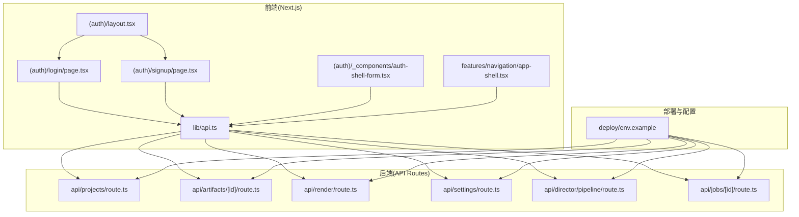
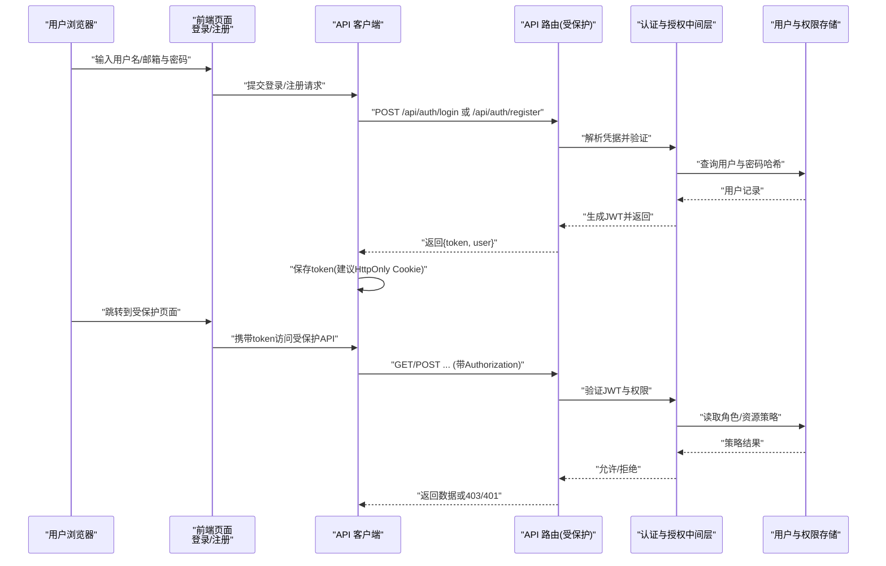
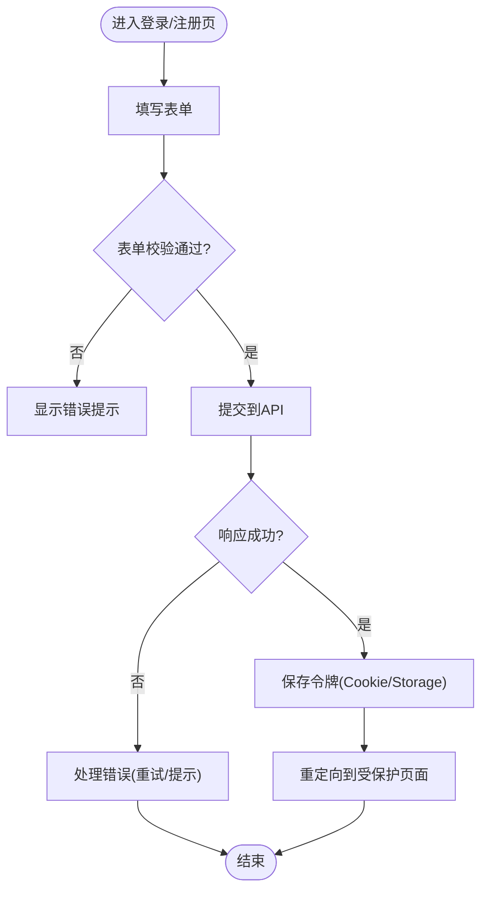
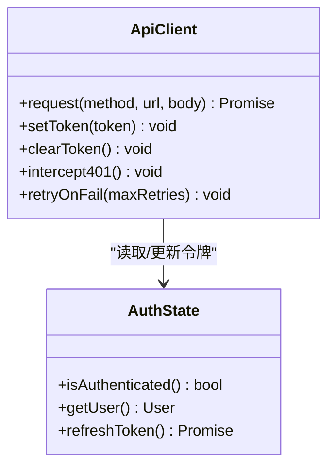
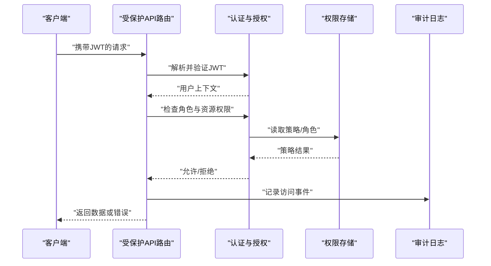
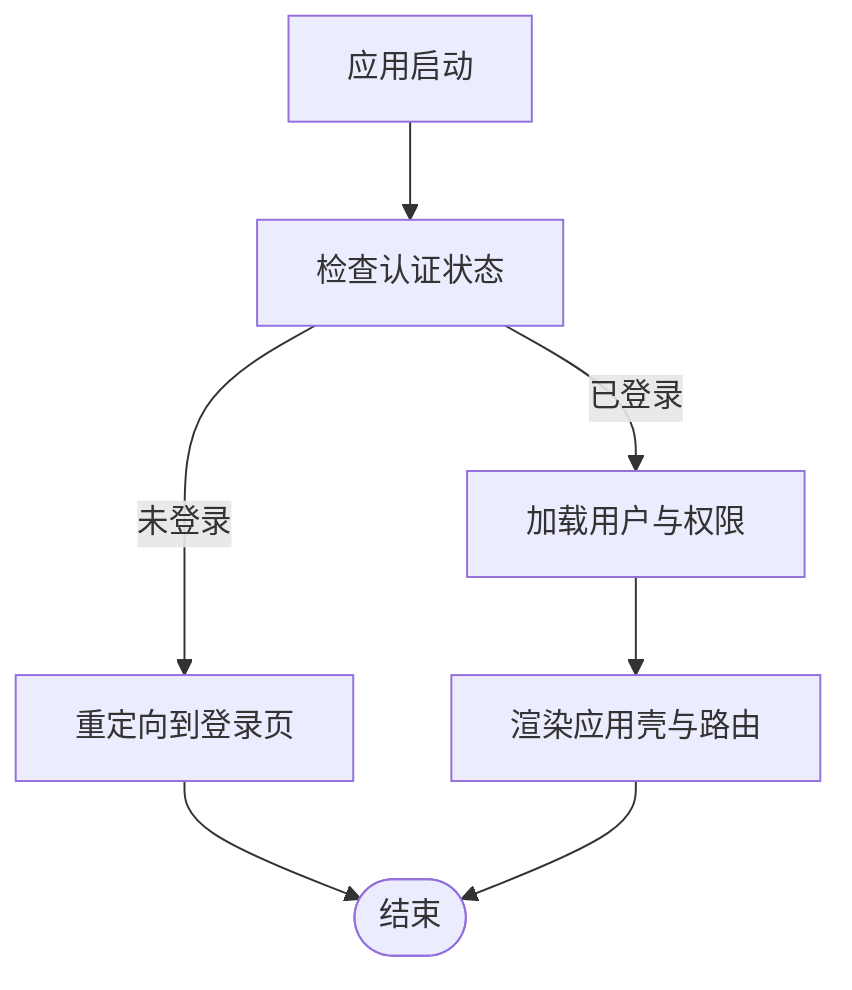
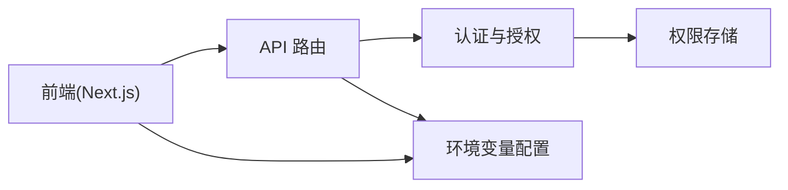

# 认证授权系统

<cite>
**本文引用的文件**   
- [src/app/(auth)/layout.tsx](file://src/app/(auth)/layout.tsx)
- [src/app/(auth)/login/page.tsx](file://src/app/(auth)/login/page.tsx)
- [src/app/(auth)/signup/page.tsx](file://src/app/(auth)/signup/page.tsx)
- [src/app/(auth)/_components/auth-shell-form.tsx](file://src/app/(auth)/_components/auth-shell-form.tsx)
- [src/app/api/projects/route.ts](file://src/app/api/projects/route.ts)
- [src/app/api/artifacts/[id]/route.ts](file://src/app/api/artifacts/[id]/route.ts)
- [src/app/api/render/route.ts](file://src/app/api/render/route.ts)
- [src/app/api/settings/route.ts](file://src/app/api/settings/route.ts)
- [src/app/api/director/pipeline/route.ts](file://src/app/api/director/pipeline/route.ts)
- [src/app/api/jobs/[id]/route.ts](file://src/app/api/jobs/[id]/route.ts)
- [src/lib/api.ts](file://src/lib/api.ts)
- [src/features/navigation/app-shell.tsx](file://src/features/navigation/app-shell.tsx)
- [deploy/env.example](file://deploy/env.example)
</cite>

## 目录
1. [简介](#简介)
2. [项目结构](#项目结构)
3. [核心组件](#核心组件)
4. [架构总览](#架构总览)
5. [详细组件分析](#详细组件分析)
6. [依赖关系分析](#依赖关系分析)
7. [性能考虑](#性能考虑)
8. [故障排查指南](#故障排查指南)
9. [结论](#结论)
10. [附录](#附录)

## 简介
本文件为 PurpleInk 平台的认证与授权系统提供完整文档，涵盖基于 JWT 的身份认证流程（注册、登录、密码重置与会话管理）、角色权限模型、资源访问控制与细粒度权限验证、多因素认证与验证码校验、防暴力破解策略、OAuth2.0 集成与第三方登录、单点登录实现、安全最佳实践（密码加密、令牌刷新、会话劫持防护）以及审计日志与安全监控合规性要求。文档面向技术与非技术读者，力求以循序渐进的方式呈现系统设计与实现要点。

## 项目结构
PurpleInk 采用 Next.js App Router 组织前端与 API 路由。认证相关的前端页面集中在 (auth) 路由组内，API 鉴权逻辑分布在各业务 API 路由中，并通过统一的客户端库进行请求封装。部署与环境变量配置位于 deploy 目录。

**图表来源** 
- [src/app/(auth)/layout.tsx](file://src/app/(auth)/layout.tsx)
- [src/app/(auth)/login/page.tsx](file://src/app/(auth)/login/page.tsx)
- [src/app/(auth)/signup/page.tsx](file://src/app/(auth)/signup/page.tsx)
- [src/app/(auth)/_components/auth-shell-form.tsx](file://src/app/(auth)/_components/auth-shell-form.tsx)
- [src/lib/api.ts](file://src/lib/api.ts)
- [src/features/navigation/app-shell.tsx](file://src/features/navigation/app-shell.tsx)
- [src/app/api/projects/route.ts](file://src/app/api/projects/route.ts)
- [src/app/api/artifacts/[id]/route.ts](file://src/app/api/artifacts/[id]/route.ts)
- [src/app/api/render/route.ts](file://src/app/api/render/route.ts)
- [src/app/api/settings/route.ts](file://src/app/api/settings/route.ts)
- [src/app/api/director/pipeline/route.ts](file://src/app/api/director/pipeline/route.ts)
- [src/app/api/jobs/[id]/route.ts](file://src/app/api/jobs/[id]/route.ts)
- [deploy/env.example](file://deploy/env.example)

**章节来源**
- [src/app/(auth)/layout.tsx](file://src/app/(auth)/layout.tsx)
- [src/app/(auth)/login/page.tsx](file://src/app/(auth)/login/page.tsx)
- [src/app/(auth)/signup/page.tsx](file://src/app/(auth)/signup/page.tsx)
- [src/app/(auth)/_components/auth-shell-form.tsx](file://src/app/(auth)/_components/auth-shell-form.tsx)
- [src/lib/api.ts](file://src/lib/api.ts)
- [src/features/navigation/app-shell.tsx](file://src/features/navigation/app-shell.tsx)
- [src/app/api/projects/route.ts](file://src/app/api/projects/route.ts)
- [src/app/api/artifacts/[id]/route.ts](file://src/app/api/artifacts/[id]/route.ts)
- [src/app/api/render/route.ts](file://src/app/api/render/route.ts)
- [src/app/api/settings/route.ts](file://src/app/api/settings/route.ts)
- [src/app/api/director/pipeline/route.ts](file://src/app/api/director/pipeline/route.ts)
- [src/app/api/jobs/[id]/route.ts](file://src/app/api/jobs/[id]/route.ts)
- [deploy/env.example](file://deploy/env.example)

## 核心组件
- 认证页面与表单：登录、注册与统一认证外壳表单，负责收集用户凭据、展示错误信息并调用 API。
- API 客户端：统一封装 HTTP 请求，处理令牌注入、重试与错误映射。
- API 路由：按业务域划分，每个路由在入口处执行身份与权限校验，确保仅合法用户可访问受保护资源。
- 导航与状态：应用壳根据认证状态决定路由守卫与菜单可见性。

**章节来源**
- [src/app/(auth)/login/page.tsx](file://src/app/(auth)/login/page.tsx)
- [src/app/(auth)/signup/page.tsx](file://src/app/(auth)/signup/page.tsx)
- [src/app/(auth)/_components/auth-shell-form.tsx](file://src/app/(auth)/_components/auth-shell-form.tsx)
- [src/lib/api.ts](file://src/lib/api.ts)
- [src/features/navigation/app-shell.tsx](file://src/features/navigation/app-shell.tsx)

## 架构总览
下图展示了从前端到后端的认证与授权关键路径：前端通过 API 客户端发起请求，后端 API 路由解析并验证 JWT，随后依据角色与资源策略进行细粒度权限检查，最终返回受控数据或错误。

**图表来源** 
- [src/app/(auth)/login/page.tsx](file://src/app/(auth)/login/page.tsx)
- [src/app/(auth)/signup/page.tsx](file://src/app/(auth)/signup/page.tsx)
- [src/lib/api.ts](file://src/lib/api.ts)
- [src/app/api/projects/route.ts](file://src/app/api/projects/route.ts)
- [src/app/api/artifacts/[id]/route.ts](file://src/app/api/artifacts/[id]/route.ts)
- [src/app/api/render/route.ts](file://src/app/api/render/route.ts)
- [src/app/api/settings/route.ts](file://src/app/api/settings/route.ts)
- [src/app/api/director/pipeline/route.ts](file://src/app/api/director/pipeline/route.ts)
- [src/app/api/jobs/[id]/route.ts](file://src/app/api/jobs/[id]/route.ts)

## 详细组件分析

### 认证页面与表单
- 登录页：收集邮箱/用户名与密码，调用认证接口，成功后跳转至应用首页或目标页面。
- 注册页：收集必要用户信息，调用注册接口，成功后引导登录。
- 认证外壳表单：复用表单结构与校验逻辑，支持扩展更多认证方式（如验证码、MFA）。

**图表来源** 
- [src/app/(auth)/login/page.tsx](file://src/app/(auth)/login/page.tsx)
- [src/app/(auth)/signup/page.tsx](file://src/app/(auth)/signup/page.tsx)
- [src/app/(auth)/_components/auth-shell-form.tsx](file://src/app/(auth)/_components/auth-shell-form.tsx)

**章节来源**
- [src/app/(auth)/login/page.tsx](file://src/app/(auth)/login/page.tsx)
- [src/app/(auth)/signup/page.tsx](file://src/app/(auth)/signup/page.tsx)
- [src/app/(auth)/_components/auth-shell-form.tsx](file://src/app/(auth)/_components/auth-shell-form.tsx)

### API 客户端与令牌管理
- 统一封装请求头注入 Authorization 或 Cookie。
- 处理 401/403 错误，触发令牌刷新或登出流程。
- 可选重试机制与超时控制。

**图表来源** 
- [src/lib/api.ts](file://src/lib/api.ts)

**章节来源**
- [src/lib/api.ts](file://src/lib/api.ts)

### 受保护 API 路由与权限校验
- 入口校验：解析 JWT，验证签名与过期时间。
- 角色与资源策略：根据用户角色与资源标识进行细粒度权限判断。
- 审计日志：记录访问事件（成功/失败），便于安全监控与合规审计。

**图表来源** 
- [src/app/api/projects/route.ts](file://src/app/api/projects/route.ts)
- [src/app/api/artifacts/[id]/route.ts](file://src/app/api/artifacts/[id]/route.ts)
- [src/app/api/render/route.ts](file://src/app/api/render/route.ts)
- [src/app/api/settings/route.ts](file://src/app/api/settings/route.ts)
- [src/app/api/director/pipeline/route.ts](file://src/app/api/director/pipeline/route.ts)
- [src/app/api/jobs/[id]/route.ts](file://src/app/api/jobs/[id]/route.ts)

**章节来源**
- [src/app/api/projects/route.ts](file://src/app/api/projects/route.ts)
- [src/app/api/artifacts/[id]/route.ts](file://src/app/api/artifacts/[id]/route.ts)
- [src/app/api/render/route.ts](file://src/app/api/render/route.ts)
- [src/app/api/settings/route.ts](file://src/app/api/settings/route.ts)
- [src/app/api/director/pipeline/route.ts](file://src/app/api/director/pipeline/route.ts)
- [src/app/api/jobs/[id]/route.ts](file://src/app/api/jobs/[id]/route.ts)

### 导航与应用壳的认证状态
- 应用壳根据认证状态渲染侧边栏与受保护视图。
- 未登录时重定向至登录页；已登录时加载用户信息与权限。

**图表来源** 
- [src/features/navigation/app-shell.tsx](file://src/features/navigation/app-shell.tsx)

**章节来源**
- [src/features/navigation/app-shell.tsx](file://src/features/navigation/app-shell.tsx)

## 依赖关系分析
- 前端依赖：认证页面与表单依赖 API 客户端；导航壳依赖认证状态。
- 后端依赖：各 API 路由依赖认证与授权模块；权限策略依赖存储层。
- 环境变量：部署配置包含密钥、令牌有效期、第三方登录配置等。

**图表来源** 
- [src/lib/api.ts](file://src/lib/api.ts)
- [src/app/api/projects/route.ts](file://src/app/api/projects/route.ts)
- [src/app/api/artifacts/[id]/route.ts](file://src/app/api/artifacts/[id]/route.ts)
- [src/app/api/render/route.ts](file://src/app/api/render/route.ts)
- [src/app/api/settings/route.ts](file://src/app/api/settings/route.ts)
- [src/app/api/director/pipeline/route.ts](file://src/app/api/director/pipeline/route.ts)
- [src/app/api/jobs/[id]/route.ts](file://src/app/api/jobs/[id]/route.ts)
- [deploy/env.example](file://deploy/env.example)

**章节来源**
- [src/lib/api.ts](file://src/lib/api.ts)
- [src/app/api/projects/route.ts](file://src/app/api/projects/route.ts)
- [src/app/api/artifacts/[id]/route.ts](file://src/app/api/artifacts/[id]/route.ts)
- [src/app/api/render/route.ts](file://src/app/api/render/route.ts)
- [src/app/api/settings/route.ts](file://src/app/api/settings/route.ts)
- [src/app/api/director/pipeline/route.ts](file://src/app/api/director/pipeline/route.ts)
- [src/app/api/jobs/[id]/route.ts](file://src/app/api/jobs/[id]/route.ts)
- [deploy/env.example](file://deploy/env.example)

## 性能考虑
- 令牌校验应使用无状态 JWT 验证，避免每次请求都查询数据库。
- 权限策略缓存热点数据（如角色与资源映射），降低存储层压力。
- 前端请求合并与去抖，减少重复认证与授权开销。
- 合理设置令牌有效期与刷新策略，平衡安全性与用户体验。

[本节为通用指导，不直接分析具体文件]

## 故障排查指南
- 401 未认证：检查令牌是否存在、是否过期、是否被篡改；确认客户端是否正确注入 Authorization 或 Cookie。
- 403 禁止访问：检查用户角色与资源策略；确认权限存储中的策略配置是否正确。
- 登录失败：核对凭据格式、密码哈希算法、账户锁定策略与验证码/MFA 配置。
- 审计日志缺失：确认审计写入是否成功，日志通道是否可用。

**章节来源**
- [src/lib/api.ts](file://src/lib/api.ts)
- [src/app/api/projects/route.ts](file://src/app/api/projects/route.ts)
- [src/app/api/artifacts/[id]/route.ts](file://src/app/api/artifacts/[id]/route.ts)
- [src/app/api/render/route.ts](file://src/app/api/render/route.ts)
- [src/app/api/settings/route.ts](file://src/app/api/settings/route.ts)
- [src/app/api/director/pipeline/route.ts](file://src/app/api/director/pipeline/route.ts)
- [src/app/api/jobs/[id]/route.ts](file://src/app/api/jobs/[id]/route.ts)

## 结论
PurpleInk 的认证授权系统以 JWT 为核心，结合前端页面、API 客户端与受保护路由形成完整的身份与权限闭环。通过角色与资源策略实现细粒度访问控制，辅以审计日志与安全监控满足合规需求。建议在后续迭代中完善多因素认证、验证码校验、防暴力破解与 OAuth2.0 第三方登录能力，并持续优化令牌刷新与会话安全策略。

[本节为总结，不直接分析具体文件]

## 附录
- 安全最佳实践清单：
  - 密码加密：使用强哈希算法（如 bcrypt/scrypt/argon2），禁止明文存储。
  - 令牌刷新：短期 Access Token + 长期 Refresh Token，支持服务端吊销。
  - 会话劫持防护：启用 HttpOnly、Secure、SameSite Cookie；绑定设备指纹/IP 白名单。
  - 验证码与 MFA：登录关键操作引入图形验证码或短信/邮件验证码；敏感操作启用 TOTP 或 WebAuthn。
  - 防暴力破解：限流与指数退避、账户锁定、异常登录告警。
  - 审计与监控：全量记录认证与授权事件，接入 SIEM 与告警平台。
  - 合规性：遵循最小权限原则、数据脱敏、保留周期与可追溯性。

[本节为通用指导，不直接分析具体文件]