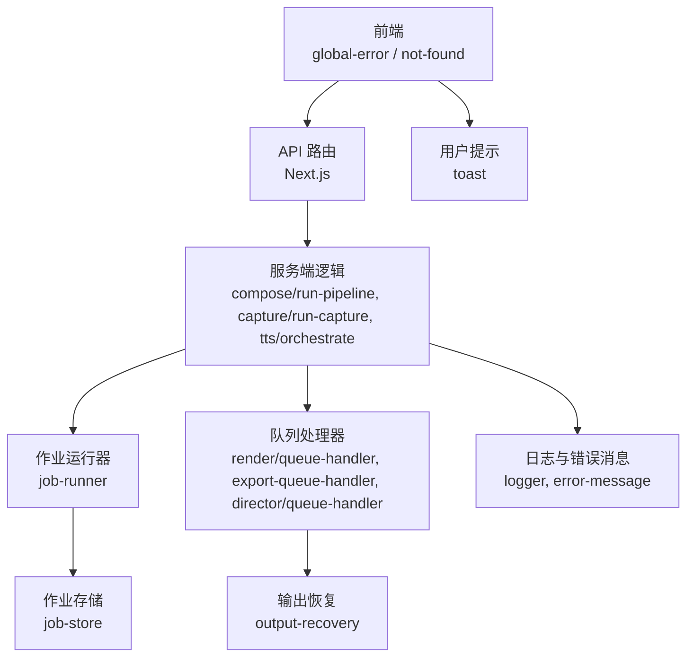
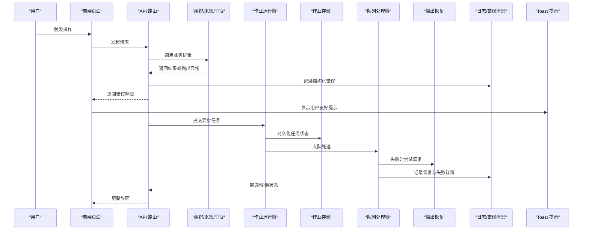
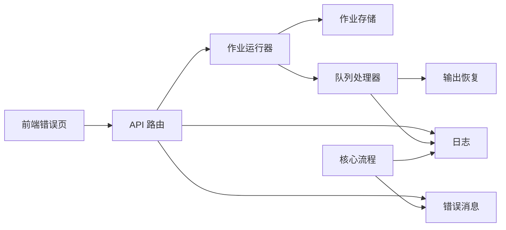

# 错误处理机制

<cite>
**本文引用的文件**   
- [src/app/global-error.tsx](file://src/app/global-error.tsx)
- [src/app/not-found.tsx](file://src/app/not-found.tsx)
- [src/app/(products)/error.tsx](file://src/app/(products)/error.tsx)
- [src/app/(products)/not-found.tsx](file://src/app/(products)/not-found.tsx)
- [src/components/ui/toast.tsx](file://src/components/ui/toast.tsx)
- [server/src/lib/error-message.ts](file://server/src/lib/error-message.ts)
- [server/src/lib/logger.ts](file://server/src/lib/logger.ts)
- [server/src/server/job-runner.ts](file://server/src/server/job-runner.ts)
- [server/src/server/job-store.ts](file://server/src/server/job-store.ts)
- [server/src/capture/run-capture.ts](file://server/src/capture/run-capture.ts)
- [server/src/compose/run-pipeline.ts](file://server/src/compose/run-pipeline.ts)
- [server/src/tts/orchestrate.ts](file://server/src/tts/orchestrate.ts)
- [src/features/director/queue-handler.ts](file://src/features/director/queue-handler.ts)
- [src/features/render/export-queue-handler.ts](file://src/features/render/export-queue-handler.ts)
- [src/features/render/queue-handler.ts](file://src/features/render/queue-handler.ts)
- [src/features/director/output-recovery.ts](file://src/features/director/output-recovery.ts)
- [src/features/director/stage-result.ts](file://src/features/director/stage-result.ts)
- [src/features/director/stage-runner.ts](file://src/features/director/stage-runner.ts)
- [src/features/render/renderer.ts](file://src/features/render/renderer.ts)
- [src/features/render/cache.ts](file://src/features/render/cache.ts)
- [src/features/render/admission.ts](file://src/features/render/admission.ts)
- [src/features/render/persistence.ts](file://src/features/render/persistence.ts)
- [tests/worker-error-hygiene.test.ts](file://tests/worker-error-hygiene.test.ts)
</cite>

## 目录
1. [简介](#简介)
2. [项目结构](#项目结构)
3. [核心组件](#核心组件)
4. [架构总览](#架构总览)
5. [详细组件分析](#详细组件分析)
6. [依赖关系分析](#依赖关系分析)
7. [性能考量](#性能考量)
8. [故障排查指南](#故障排查指南)
9. [结论](#结论)
10. [附录](#附录)

## 简介
本文件为 PurpleInK 平台构建统一的错误处理机制文档，覆盖分层错误处理架构、错误分类与编码规范、国际化提示、全局捕获与异常传播、错误恢复策略、日志记录与监控告警、客户端错误处理、网络重试与服务降级等。目标是让开发者与非技术读者都能理解并正确使用平台的错误处理体系。

## 项目结构
PurpleInK 的错误处理贯穿前端（Next.js App Router）、服务端（Node/TypeScript）与后台任务（队列/工作进程）。关键位置包括：
- 前端全局错误页与产品域错误页
- 服务端统一错误消息与日志工具
- 作业运行器与持久化层
- 采集、编排、TTS、渲染等核心流程的异常边界
- 队列处理器与输出恢复机制
- 测试用例对错误卫生性的约束

**图示来源** 
- [src/app/global-error.tsx](file://src/app/global-error.tsx)
- [src/app/not-found.tsx](file://src/app/not-found.tsx)
- [src/app/(products)/error.tsx](file://src/app/(products)/error.tsx)
- [src/app/(products)/not-found.tsx](file://src/app/(products)/not-found.tsx)
- [server/src/lib/logger.ts](file://server/src/lib/logger.ts)
- [server/src/lib/error-message.ts](file://server/src/lib/error-message.ts)
- [server/src/server/job-runner.ts](file://server/src/server/job-runner.ts)
- [server/src/server/job-store.ts](file://server/src/server/job-store.ts)
- [server/src/capture/run-capture.ts](file://server/src/capture/run-capture.ts)
- [server/src/compose/run-pipeline.ts](file://server/src/compose/run-pipeline.ts)
- [server/src/tts/orchestrate.ts](file://server/src/tts/orchestrate.ts)
- [src/features/director/queue-handler.ts](file://src/features/director/queue-handler.ts)
- [src/features/render/export-queue-handler.ts](file://src/features/render/export-queue-handler.ts)
- [src/features/render/queue-handler.ts](file://src/features/render/queue-handler.ts)
- [src/features/director/output-recovery.ts](file://src/features/director/output-recovery.ts)
- [src/components/ui/toast.tsx](file://src/components/ui/toast.tsx)

**章节来源**
- [src/app/global-error.tsx](file://src/app/global-error.tsx)
- [src/app/not-found.tsx](file://src/app/not-found.tsx)
- [src/app/(products)/error.tsx](file://src/app/(products)/error.tsx)
- [src/app/(products)/not-found.tsx](file://src/app/(products)/not-found.tsx)
- [server/src/lib/logger.ts](file://server/src/lib/logger.ts)
- [server/src/lib/error-message.ts](file://server/src/lib/error-message.ts)
- [server/src/server/job-runner.ts](file://server/src/server/job-runner.ts)
- [server/src/server/job-store.ts](file://server/src/server/job-store.ts)
- [server/src/capture/run-capture.ts](file://server/src/capture/run-capture.ts)
- [server/src/compose/run-pipeline.ts](file://server/src/compose/run-pipeline.ts)
- [server/src/tts/orchestrate.ts](file://server/src/tts/orchestrate.ts)
- [src/features/director/queue-handler.ts](file://src/features/director/queue-handler.ts)
- [src/features/render/export-queue-handler.ts](file://src/features/render/export-queue-handler.ts)
- [src/features/render/queue-handler.ts](file://src/features/render/queue-handler.ts)
- [src/features/director/output-recovery.ts](file://src/features/director/output-recovery.ts)
- [src/components/ui/toast.tsx](file://src/components/ui/toast.tsx)

## 核心组件
- 前端全局错误与未找到页面：提供用户友好的错误展示与导航回退。
- 服务端错误消息与日志：统一错误码、错误信息模板与结构化日志。
- 作业运行器与存储：负责长任务的执行、失败状态管理与持久化。
- 队列处理器：消费任务、重试与降级、错误上报。
- 输出恢复：在部分失败时尝试恢复或补偿。
- Toast 提示：面向用户的即时反馈。

**章节来源**
- [src/app/global-error.tsx](file://src/app/global-error.tsx)
- [src/app/not-found.tsx](file://src/app/not-found.tsx)
- [src/app/(products)/error.tsx](file://src/app/(products)/error.tsx)
- [src/app/(products)/not-found.tsx](file://src/app/(products)/not-found.tsx)
- [server/src/lib/error-message.ts](file://server/src/lib/error-message.ts)
- [server/src/lib/logger.ts](file://server/src/lib/logger.ts)
- [server/src/server/job-runner.ts](file://server/src/server/job-runner.ts)
- [server/src/server/job-store.ts](file://server/src/server/job-store.ts)
- [src/features/director/queue-handler.ts](file://src/features/director/queue-handler.ts)
- [src/features/render/export-queue-handler.ts](file://src/features/render/export-queue-handler.ts)
- [src/features/render/queue-handler.ts](file://src/features/render/queue-handler.ts)
- [src/features/director/output-recovery.ts](file://src/features/director/output-recovery.ts)
- [src/components/ui/toast.tsx](file://src/components/ui/toast.tsx)

## 架构总览
下图展示了从前端到后端再到队列与持久化的错误处理路径，以及用户可见的提示与日志记录点。

**图示来源** 
- [src/app/global-error.tsx](file://src/app/global-error.tsx)
- [src/app/(products)/error.tsx](file://src/app/(products)/error.tsx)
- [server/src/compose/run-pipeline.ts](file://server/src/compose/run-pipeline.ts)
- [server/src/capture/run-capture.ts](file://server/src/capture/run-capture.ts)
- [server/src/tts/orchestrate.ts](file://server/src/tts/orchestrate.ts)
- [server/src/server/job-runner.ts](file://server/src/server/job-runner.ts)
- [server/src/server/job-store.ts](file://server/src/server/job-store.ts)
- [src/features/director/queue-handler.ts](file://src/features/director/queue-handler.ts)
- [src/features/render/export-queue-handler.ts](file://src/features/render/export-queue-handler.ts)
- [src/features/render/queue-handler.ts](file://src/features/render/queue-handler.ts)
- [src/features/director/output-recovery.ts](file://src/features/director/output-recovery.ts)
- [server/src/lib/logger.ts](file://server/src/lib/logger.ts)
- [server/src/lib/error-message.ts](file://server/src/lib/error-message.ts)
- [src/components/ui/toast.tsx](file://src/components/ui/toast.tsx)

## 详细组件分析

### 前端全局错误与未找到页面
- global-error：捕获运行时异常，渲染兜底错误页，避免白屏。
- not-found：资源不存在时的通用提示。
- (products)/error 与 not-found：产品域内的错误与未找到页面，提供更具体的上下文与回退操作。

建议实践：
- 所有页面级错误应向上冒泡至 global-error，确保一致性体验。
- 针对可恢复错误提供“重试”“返回首页”等操作入口。
- 将用户可见文案集中管理，便于国际化与多语言切换。

**章节来源**
- [src/app/global-error.tsx](file://src/app/global-error.tsx)
- [src/app/not-found.tsx](file://src/app/not-found.tsx)
- [src/app/(products)/error.tsx](file://src/app/(products)/error.tsx)
- [src/app/(products)/not-found.tsx](file://src/app/(products)/not-found.tsx)

### 服务端错误消息与日志
- error-message：定义错误码、错误类型与消息模板，支持参数化与国际化键值。
- logger：结构化日志记录，包含请求ID、阶段、错误码、堆栈摘要与上下文。

建议实践：
- 所有异常需映射为标准错误对象，携带错误码与可读消息。
- 敏感信息脱敏，避免泄露密钥与用户隐私。
- 使用分级日志（info/warn/error），便于监控与告警。

**章节来源**
- [server/src/lib/error-message.ts](file://server/src/lib/error-message.ts)
- [server/src/lib/logger.ts](file://server/src/lib/logger.ts)

### 作业运行器与存储
- job-runner：调度与执行作业，捕获异常并更新状态，支持重试与超时控制。
- job-store：持久化作业元数据、状态与错误信息，保证可观测性与可恢复性。

建议实践：
- 作业失败必须写入错误原因与堆栈摘要，便于诊断。
- 对幂等性操作进行保护，避免重复执行造成副作用。
- 结合队列处理器实现指数退避重试。

**章节来源**
- [server/src/server/job-runner.ts](file://server/src/server/job-runner.ts)
- [server/src/server/job-store.ts](file://server/src/server/job-store.ts)

### 队列处理器与输出恢复
- render/queue-handler：渲染任务队列处理，包含失败重试、降级与错误上报。
- export-queue-handler：导出任务队列处理，关注大文件与I/O异常。
- director/queue-handler：导演流程队列处理，协调多阶段任务。
- output-recovery：在部分失败时尝试恢复中间产物或补偿步骤。

建议实践：
- 区分可重试与不可重试错误，前者进入重试队列，后者直接失败。
- 设置最大重试次数与退避策略，防止风暴式重试。
- 恢复策略需幂等且可审计，记录恢复动作与结果。

**章节来源**
- [src/features/render/queue-handler.ts](file://src/features/render/queue-handler.ts)
- [src/features/render/export-queue-handler.ts](file://src/features/render/export-queue-handler.ts)
- [src/features/director/queue-handler.ts](file://src/features/director/queue-handler.ts)
- [src/features/director/output-recovery.ts](file://src/features/director/output-recovery.ts)

### 核心流程异常边界
- run-pipeline：编排流程入口，统一捕获阶段异常，记录阶段与输入摘要。
- run-capture：采集流程，处理浏览器驱动、网络与媒体异常。
- orchestrate：TTS 编排，处理音频生成与合成异常。

建议实践：
- 每个阶段应有明确的错误分类与恢复点。
- 对外部依赖（如模型服务、存储）失败需快速失败与降级。
- 保留最小必要上下文，避免过度日志导致性能问题。

**章节来源**
- [server/src/compose/run-pipeline.ts](file://server/src/compose/run-pipeline.ts)
- [server/src/capture/run-capture.ts](file://server/src/capture/run-capture.ts)
- [server/src/tts/orchestrate.ts](file://server/src/tts/orchestrate.ts)

### 渲染与缓存
- renderer：渲染引擎，处理帧序列、编码与输出。
- cache：渲染缓存，命中与失效策略影响错误恢复。
- admission：准入控制，限制并发与资源占用。
- persistence：持久化层，保障中间产物与结果落盘。

建议实践：
- 缓存失效时需重新计算，避免脏读。
- 准入失败应给出明确的用户提示与等待时间。
- 持久化失败需回滚或标记不一致，触发修复流程。

**章节来源**
- [src/features/render/renderer.ts](file://src/features/render/renderer.ts)
- [src/features/render/cache.ts](file://src/features/render/cache.ts)
- [src/features/render/admission.ts](file://src/features/render/admission.ts)
- [src/features/render/persistence.ts](file://src/features/render/persistence.ts)

### 阶段结果与运行器
- stage-result：阶段结果模型，包含成功、失败与部分成功状态。
- stage-runner：阶段运行器，封装执行、异常捕获与结果提交。

建议实践：
- 阶段失败应保留中间状态，便于断点续跑。
- 结果提交需原子性，避免部分写入导致不一致。
- 对第三方依赖失败进行隔离与熔断。

**章节来源**
- [src/features/director/stage-result.ts](file://src/features/director/stage-result.ts)
- [src/features/director/stage-runner.ts](file://src/features/director/stage-runner.ts)

### 用户提示与交互
- toast：轻量级通知组件，用于即时反馈与错误提示。

建议实践：
- 错误提示应简洁、可操作，避免技术术语。
- 重要错误需提供“查看详情”“复制错误码”等功能。
- 批量错误聚合展示，减少干扰。

**章节来源**
- [src/components/ui/toast.tsx](file://src/components/ui/toast.tsx)

### 错误卫生性测试
- worker-error-hygiene.test：对工作进程错误处理进行契约测试，确保错误不会泄漏或未处理。

建议实践：
- 对所有异步路径添加错误断言。
- 模拟外部依赖失败，验证重试与降级。
- 定期回归测试，确保错误处理不退化。

**章节来源**
- [tests/worker-error-hygiene.test.ts](file://tests/worker-error-hygiene.test.ts)

## 依赖关系分析
错误处理在各模块间的依赖如下：
- 前端依赖全局错误页与 Toast 组件。
- 服务端依赖错误消息与日志工具。
- 作业运行器依赖存储与队列处理器。
- 队列处理器依赖输出恢复与日志。
- 核心流程依赖各自领域的异常边界。

**图示来源** 
- [src/app/global-error.tsx](file://src/app/global-error.tsx)
- [src/app/(products)/error.tsx](file://src/app/(products)/error.tsx)
- [server/src/lib/error-message.ts](file://server/src/lib/error-message.ts)
- [server/src/lib/logger.ts](file://server/src/lib/logger.ts)
- [server/src/server/job-runner.ts](file://server/src/server/job-runner.ts)
- [server/src/server/job-store.ts](file://server/src/server/job-store.ts)
- [src/features/director/queue-handler.ts](file://src/features/director/queue-handler.ts)
- [src/features/render/export-queue-handler.ts](file://src/features/render/export-queue-handler.ts)
- [src/features/render/queue-handler.ts](file://src/features/render/queue-handler.ts)
- [src/features/director/output-recovery.ts](file://src/features/director/output-recovery.ts)
- [server/src/compose/run-pipeline.ts](file://server/src/compose/run-pipeline.ts)
- [server/src/capture/run-capture.ts](file://server/src/capture/run-capture.ts)
- [server/src/tts/orchestrate.ts](file://server/src/tts/orchestrate.ts)

**章节来源**
- [server/src/lib/error-message.ts](file://server/src/lib/error-message.ts)
- [server/src/lib/logger.ts](file://server/src/lib/logger.ts)
- [server/src/server/job-runner.ts](file://server/src/server/job-runner.ts)
- [server/src/server/job-store.ts](file://server/src/server/job-store.ts)
- [src/features/director/queue-handler.ts](file://src/features/director/queue-handler.ts)
- [src/features/render/export-queue-handler.ts](file://src/features/render/export-queue-handler.ts)
- [src/features/render/queue-handler.ts](file://src/features/render/queue-handler.ts)
- [src/features/director/output-recovery.ts](file://src/features/director/output-recovery.ts)
- [server/src/compose/run-pipeline.ts](file://server/src/compose/run-pipeline.ts)
- [server/src/capture/run-capture.ts](file://server/src/capture/run-capture.ts)
- [server/src/tts/orchestrate.ts](file://server/src/tts/orchestrate.ts)

## 性能考量
- 日志采样：在高吞吐场景下启用采样，避免 I/O 瓶颈。
- 错误聚合：合并相似错误，降低告警噪音。
- 重试退避：指数退避与抖动，避免雪崩。
- 降级开关：通过配置快速关闭非核心功能，保障主流程。
- 缓存命中：合理设计缓存键与失效策略，减少重复计算。

[本节为通用指导，无需特定文件引用]

## 故障排查指南
- 定位错误码：通过错误码快速识别错误类别与来源。
- 查看结构化日志：结合请求ID与阶段信息追踪调用链。
- 检查作业状态：在作业存储中查看失败原因与重试次数。
- 验证恢复策略：确认输出恢复是否按预期执行。
- 复现场景：使用最小数据集与固定种子重现问题。

**章节来源**
- [server/src/lib/logger.ts](file://server/src/lib/logger.ts)
- [server/src/server/job-store.ts](file://server/src/server/job-store.ts)
- [src/features/director/output-recovery.ts](file://src/features/director/output-recovery.ts)

## 结论
PurpleInK 的错误处理机制以分层架构为核心，覆盖前端、服务端与后台任务。通过统一错误码、结构化日志、队列重试与输出恢复，实现了高可用与可观测性。建议持续完善错误分类、国际化与监控告警，确保用户体验与系统稳定性。

[本节为总结，无需特定文件引用]

## 附录
- 错误分类建议：业务异常、系统错误、网络异常、资源不足、权限拒绝等。
- 错误码规范：前缀+模块+编号，语义清晰且可扩展。
- 国际化支持：错误消息键值化，前端按需加载翻译。
- 监控告警：基于错误率、延迟与资源指标设定阈值。
- 常见场景与解决方案：详见各组件分析中的建议实践。

[本节为补充说明，无需特定文件引用]