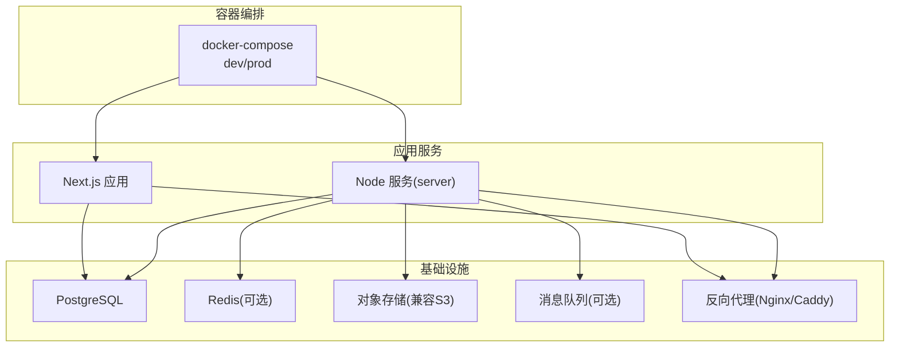
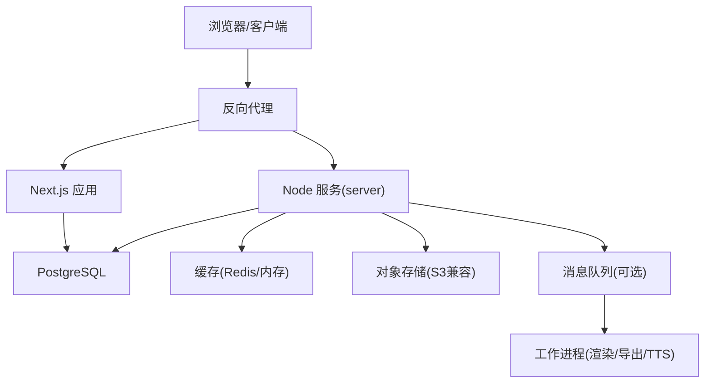
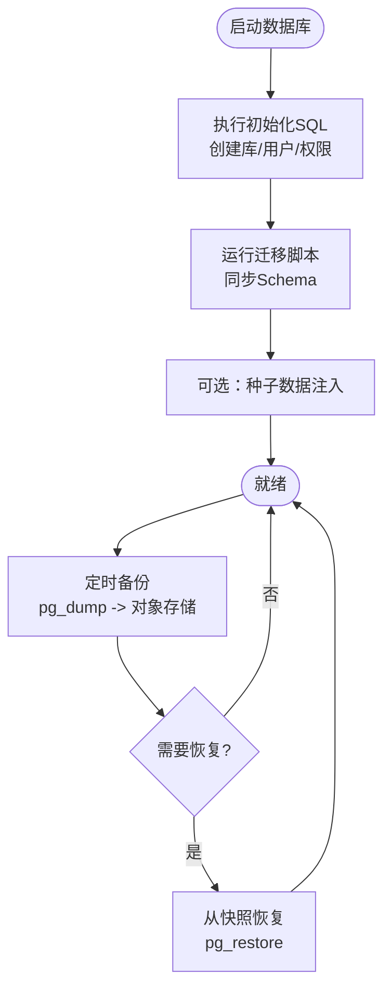
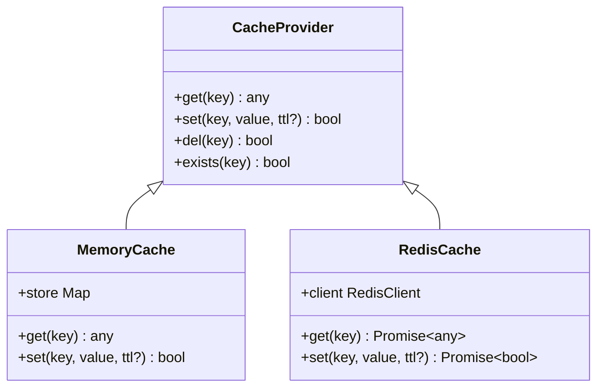
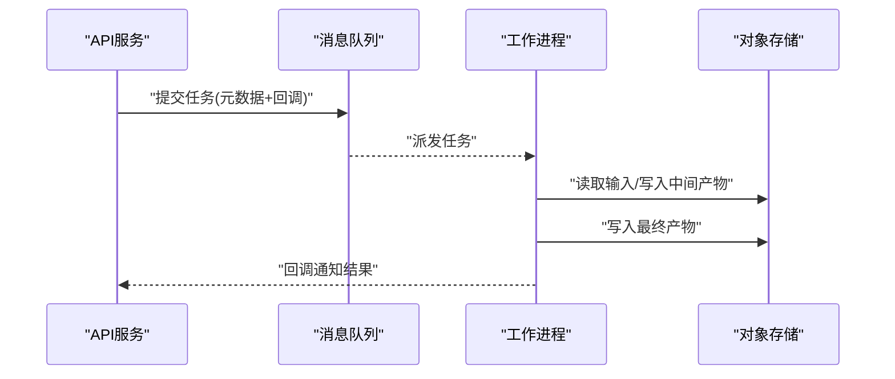
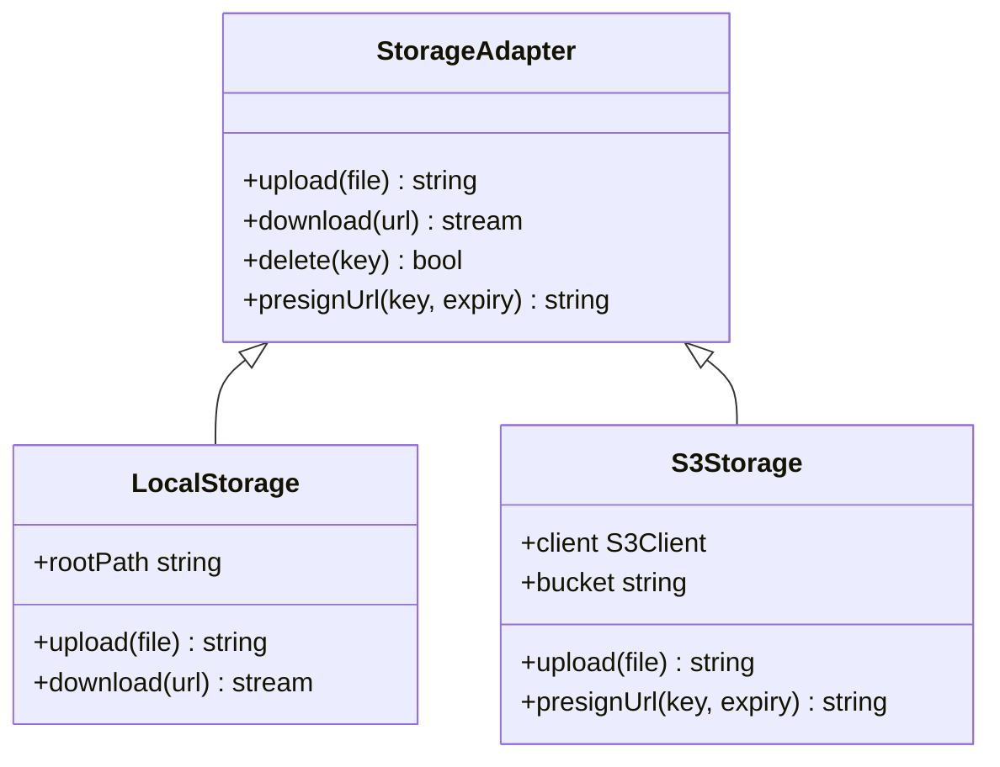
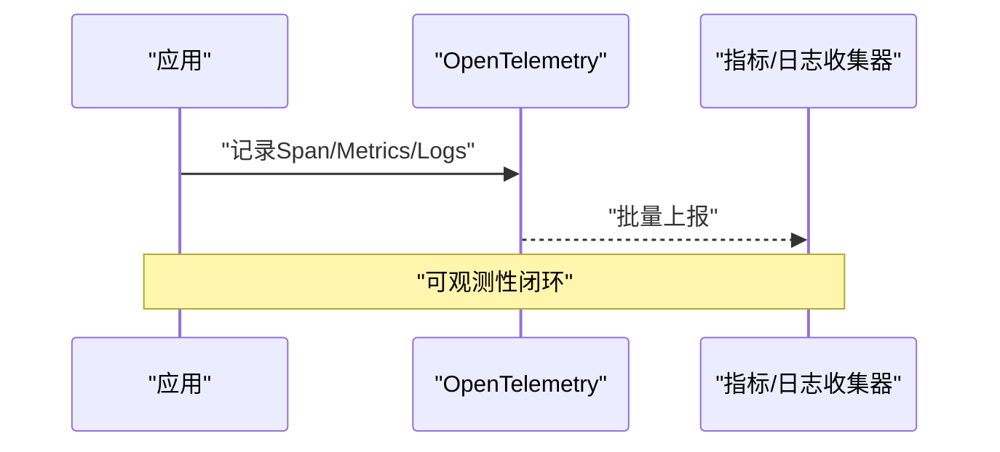
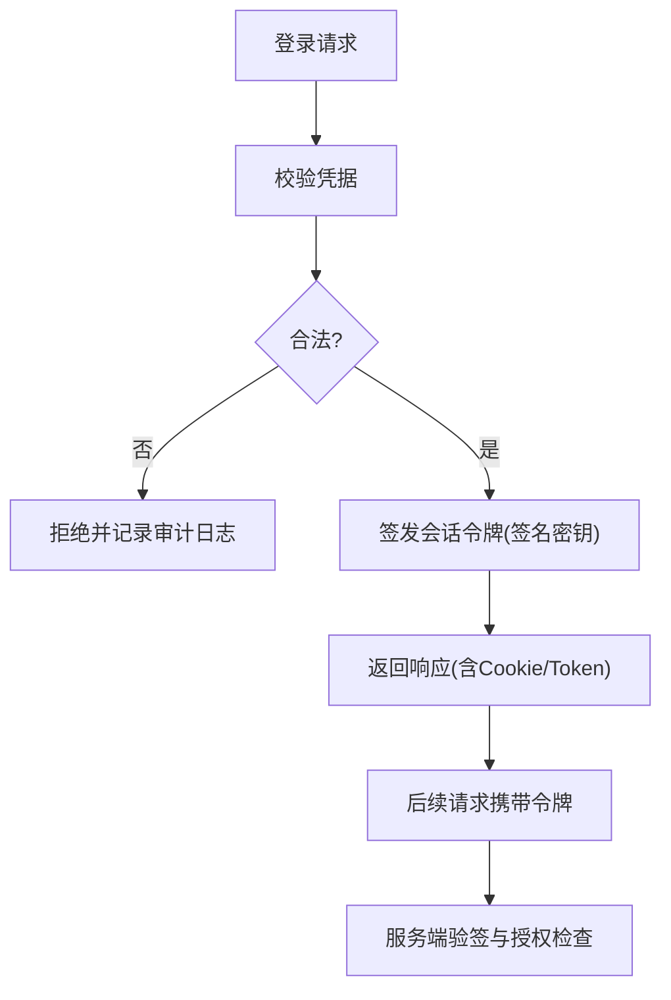
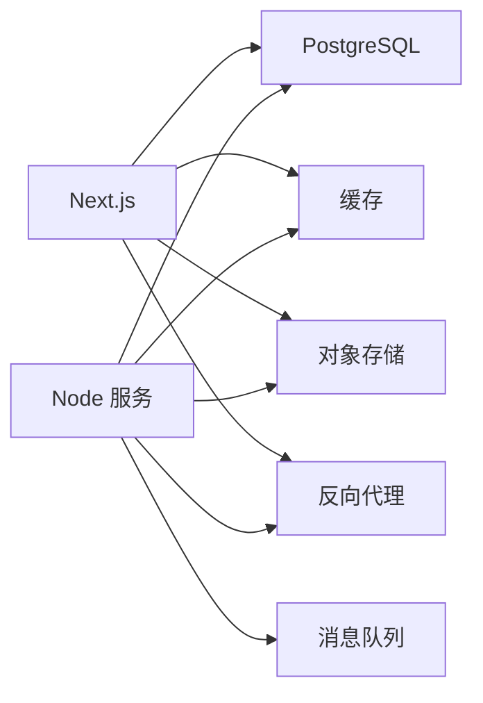
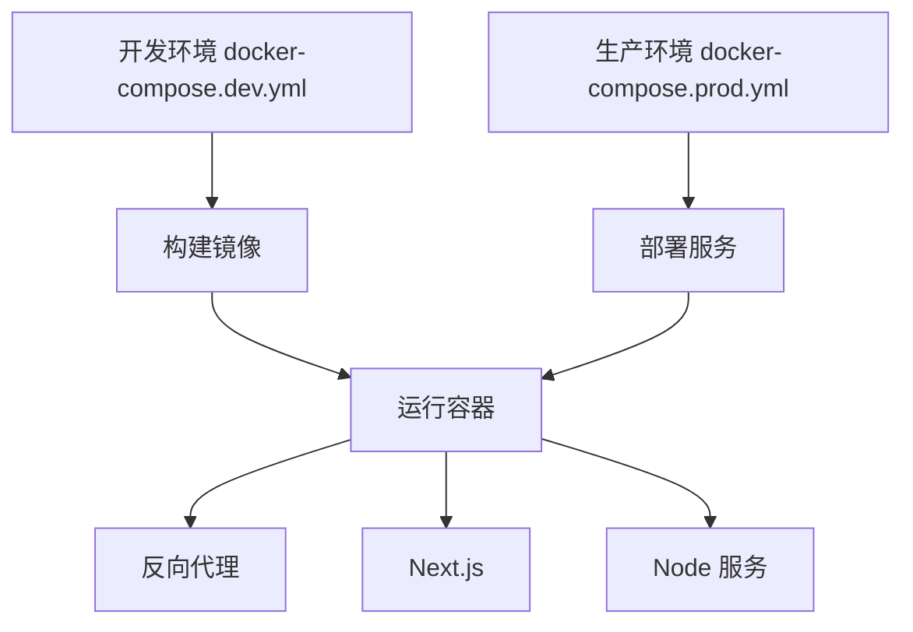

# 基础设施架构

<cite>
**本文引用的文件**   
- [docker-compose.dev.yml](file://docker-compose.dev.yml)
- [docker-compose.prod.yml](file://docker-compose.prod.yml)
- [Dockerfile](file://Dockerfile)
- [drizzle.config.ts](file://drizzle.config.ts)
- [server/src/index.ts](file://server/src/index.ts)
- [scripts/setup/postgres-init.sql](file://scripts/setup/postgres-init.sql)
- [scripts/migration/provision-master-key.ts](file://scripts/migration/provision-master-key.ts)
- [scripts/migration/reconcile-postgres.ts](file://scripts/migration/reconcile-postgres.ts)
- [scripts/migration/sqlite-backup.ts](file://scripts/migration/sqlite-backup.ts)
- [scripts/migration/import-postgres.ts](file://scripts/migration/import-postgres.ts)
- [scripts/setup/db-migrate.ts](file://scripts/setup/db-migrate.ts)
- [scripts/setup/bootstrap-credentials.ts](file://scripts/setup/bootstrap-credentials.ts)
- [deploy/reverse-proxy/Dockerfile](file://deploy/reverse-proxy/Dockerfile)
- [deploy/reverse-proxy/entrypoint.sh](file://deploy/reverse-proxy/entrypoint.sh)
- [deploy/reverse-proxy/secrets/basic_auth_credentials.example](file://deploy/reverse-proxy/secrets/basic_auth_credentials.example)
- [src/features/auth/session.ts](file://src/features/auth/session.ts)
- [src/features/auth/signing-key.ts](file://src/features/auth/signing-key.ts)
- [src/features/auth/human-check.ts](file://src/features/auth/human-check.ts)
- [src/features/render/cache.ts](file://src/features/render/cache.ts)
- [src/lib/storage/index.ts](file://src/lib/storage/index.ts)
- [src/lib/queue/index.ts](file://src/lib/queue/index.ts)
- [src/instrumentation.ts](file://src/instrumentation.ts)
- [next.config.ts](file://next.config.ts)
</cite>

## 目录
1. [简介](#简介)
2. [项目结构](#项目结构)
3. [核心组件](#核心组件)
4. [架构总览](#架构总览)
5. [详细组件分析](#详细组件分析)
6. [依赖关系分析](#依赖关系分析)
7. [性能考量](#性能考量)
8. [故障排查指南](#故障排查指南)
9. [结论](#结论)
10. [附录](#附录)

## 简介
本文件面向PurpleInK平台的基础设施架构，聚焦支撑系统稳定运行的关键组件与配置，包括数据库（PostgreSQL）、缓存层、消息队列、对象存储、监控与日志、安全基础设施等。文档提供拓扑图与组件配置说明，帮助读者快速理解并落地部署。

## 项目结构
仓库采用前后端一体化开发模式：前端基于Next.js，服务端能力通过server目录中的Node服务承载部分后台任务与工具；基础设施编排通过docker-compose管理本地与生产环境。

图表来源
- [docker-compose.dev.yml](file://docker-compose.dev.yml)
- [docker-compose.prod.yml](file://docker-compose.prod.yml)
- [Dockerfile](file://Dockerfile)

章节来源
- [docker-compose.dev.yml](file://docker-compose.dev.yml)
- [docker-compose.prod.yml](file://docker-compose.prod.yml)
- [Dockerfile](file://Dockerfile)

## 核心组件
- 数据库：PostgreSQL，使用Drizzle ORM进行迁移与类型生成；提供初始化SQL与迁移脚本。
- 缓存层：内存缓存或Redis（按环境变量切换），用于渲染缓存与会话/验证码等热点数据。
- 消息队列：异步任务处理（导出、渲染、TTS等）可通过内置队列或外部MQ实现。
- 对象存储：媒体文件与产物通过可插拔存储后端（如S3兼容）管理。
- 监控与日志：OpenTelemetry集成、结构化日志、健康检查探针。
- 安全：会话与签名密钥、反机器人校验、基础认证、网络加密。

章节来源
- [drizzle.config.ts](file://drizzle.config.ts)
- [scripts/setup/postgres-init.sql](file://scripts/setup/postgres-init.sql)
- [src/features/render/cache.ts](file://src/features/render/cache.ts)
- [src/lib/queue/index.ts](file://src/lib/queue/index.ts)
- [src/lib/storage/index.ts](file://src/lib/storage/index.ts)
- [src/instrumentation.ts](file://src/instrumentation.ts)
- [src/features/auth/session.ts](file://src/features/auth/session.ts)
- [src/features/auth/signing-key.ts](file://src/features/auth/signing-key.ts)
- [src/features/auth/human-check.ts](file://src/features/auth/human-check.ts)

## 架构总览
下图展示PurpleInK在容器化部署下的整体交互：客户端经反向代理访问Next.js应用，业务逻辑由Next与Node服务共同承担，持久化到PostgreSQL，缓存与对象存储作为扩展层，消息队列解耦耗时任务。

图表来源
- [docker-compose.dev.yml](file://docker-compose.dev.yml)
- [docker-compose.prod.yml](file://docker-compose.prod.yml)
- [server/src/index.ts](file://server/src/index.ts)
- [src/lib/storage/index.ts](file://src/lib/storage/index.ts)
- [src/lib/queue/index.ts](file://src/lib/queue/index.ts)

## 详细组件分析

### 数据库（PostgreSQL）
- 设计原则
  - 使用Drizzle进行类型安全的迁移与查询构建，确保Schema演进可追溯。
  - 通过初始化SQL完成库/用户/权限的预置，便于容器化启动。
- 索引策略
  - 对外键与高频查询字段建立B-Tree索引；对JSON字段使用GIN索引以支持JSON路径查询。
  - 针对时间范围查询添加复合索引，避免全表扫描。
- 备份恢复
  - 提供SQLite备份脚本与导入PostgreSQL的工具，便于迁移与演练。
  - 建议结合pg_dump/pg_restore与对象存储快照实现异地容灾。

图表来源
- [scripts/setup/postgres-init.sql](file://scripts/setup/postgres-init.sql)
- [scripts/migration/reconcile-postgres.ts](file://scripts/migration/reconcile-postgres.ts)
- [scripts/migration/sqlite-backup.ts](file://scripts/migration/sqlite-backup.ts)
- [scripts/migration/import-postgres.ts](file://scripts/migration/import-postgres.ts)
- [scripts/setup/db-migrate.ts](file://scripts/setup/db-migrate.ts)
- [drizzle.config.ts](file://drizzle.config.ts)

章节来源
- [drizzle.config.ts](file://drizzle.config.ts)
- [scripts/setup/postgres-init.sql](file://scripts/setup/postgres-init.sql)
- [scripts/migration/reconcile-postgres.ts](file://scripts/migration/reconcile-postgres.ts)
- [scripts/migration/sqlite-backup.ts](file://scripts/migration/sqlite-backup.ts)
- [scripts/migration/import-postgres.ts](file://scripts/migration/import-postgres.ts)
- [scripts/setup/db-migrate.ts](file://scripts/setup/db-migrate.ts)

### 缓存层（Redis/内存缓存）
- 使用场景
  - 渲染结果缓存、验证码/临时令牌、限流计数、分布式锁。
- 实现要点
  - 根据环境变量选择内存缓存或Redis后端，统一抽象接口。
  - 设置合理的过期时间与淘汰策略，避免内存泄漏。

图表来源
- [src/features/render/cache.ts](file://src/features/render/cache.ts)

章节来源
- [src/features/render/cache.ts](file://src/features/render/cache.ts)

### 消息队列（异步任务处理）
- 任务类型
  - 视频导出、渲染、TTS合成、AI调用重试等耗时操作。
- 设计要点
  - 生产者将任务入队，消费者按优先级/并发度消费，失败重试与死信队列保障可靠性。
  - 与对象存储协作，读写中间产物与最终输出。

图表来源
- [src/lib/queue/index.ts](file://src/lib/queue/index.ts)
- [src/lib/storage/index.ts](file://src/lib/storage/index.ts)

章节来源
- [src/lib/queue/index.ts](file://src/lib/queue/index.ts)
- [src/lib/storage/index.ts](file://src/lib/storage/index.ts)

### 对象存储（媒体文件管理）
- 功能范围
  - 上传、分片、断点续传、CDN加速、生命周期管理、版本控制。
- 接入方式
  - 通过统一存储接口适配不同后端（本地磁盘、S3兼容、云厂商对象存储）。

图表来源
- [src/lib/storage/index.ts](file://src/lib/storage/index.ts)

章节来源
- [src/lib/storage/index.ts](file://src/lib/storage/index.ts)

### 监控与日志
- 指标与追踪
  - 集成OpenTelemetry采集请求时延、错误率、资源使用等指标，上报至后端收集器。
- 日志聚合
  - 结构化日志输出，配合日志采集器集中存储与检索。
- 健康检查
  - 暴露健康探针，供负载均衡与健康检查使用。

图表来源
- [src/instrumentation.ts](file://src/instrumentation.ts)

章节来源
- [src/instrumentation.ts](file://src/instrumentation.ts)

### 安全基础设施
- 身份认证与会话
  - 使用签名密钥签发/验证会话令牌，支持刷新与撤销。
- 授权控制
  - 基于角色的访问控制（RBAC）与资源级鉴权。
- 数据加密
  - 传输层TLS加密；敏感字段静态加密（KMS/密钥轮换）。
- 网络安全
  - 反向代理启用基础认证与IP白名单；最小权限原则。

图表来源
- [src/features/auth/session.ts](file://src/features/auth/session.ts)
- [src/features/auth/signing-key.ts](file://src/features/auth/signing-key.ts)
- [src/features/auth/human-check.ts](file://src/features/auth/human-check.ts)
- [deploy/reverse-proxy/entrypoint.sh](file://deploy/reverse-proxy/entrypoint.sh)
- [deploy/reverse-proxy/secrets/basic_auth_credentials.example](file://deploy/reverse-proxy/secrets/basic_auth_credentials.example)

章节来源
- [src/features/auth/session.ts](file://src/features/auth/session.ts)
- [src/features/auth/signing-key.ts](file://src/features/auth/signing-key.ts)
- [src/features/auth/human-check.ts](file://src/features/auth/human-check.ts)
- [deploy/reverse-proxy/entrypoint.sh](file://deploy/reverse-proxy/entrypoint.sh)
- [deploy/reverse-proxy/secrets/basic_auth_credentials.example](file://deploy/reverse-proxy/secrets/basic_auth_credentials.example)

## 依赖关系分析
- 应用与服务
  - Next.js应用依赖PostgreSQL、缓存、对象存储与消息队列。
  - Node服务负责后台任务与工具链，同样依赖上述基础设施。
- 反向代理
  - 统一入口，提供TLS终止、基础认证、限流与访问控制。

图表来源
- [docker-compose.dev.yml](file://docker-compose.dev.yml)
- [docker-compose.prod.yml](file://docker-compose.prod.yml)
- [server/src/index.ts](file://server/src/index.ts)

章节来源
- [docker-compose.dev.yml](file://docker-compose.dev.yml)
- [docker-compose.prod.yml](file://docker-compose.prod.yml)
- [server/src/index.ts](file://server/src/index.ts)

## 性能考量
- 数据库
  - 合理索引与查询计划优化；连接池大小与超时配置；读写分离与只读副本。
- 缓存
  - 热点数据优先命中缓存；设置合适的TTL与容量上限；避免缓存穿透与雪崩。
- 对象存储
  - 大文件分片上传与并行下载；CDN缓存静态资源；生命周期策略清理过期数据。
- 消息队列
  - 批处理与背压控制；消费者水平扩展；幂等性与重试退避。
- 监控
  - 关键路径埋点与采样；告警阈值与自愈策略。

[本节为通用指导，不直接分析具体文件]

## 故障排查指南
- 数据库问题
  - 检查初始化SQL是否成功执行；查看迁移状态与回滚策略；确认连接参数与权限。
- 缓存异常
  - 核对缓存后端连通性；检查Key命名空间与TTL；观察命中率与内存占用。
- 对象存储
  - 验证凭证与桶策略；检查网络ACL与跨域配置；定位上传失败原因。
- 消息队列
  - 关注队列长度与消费延迟；排查死信队列与重试风暴；确认消费者健壮性。
- 监控与日志
  - 通过指标面板定位瓶颈；结合TraceID追踪请求链路；审计日志定位安全问题。

章节来源
- [scripts/setup/db-migrate.ts](file://scripts/setup/db-migrate.ts)
- [scripts/migration/reconcile-postgres.ts](file://scripts/migration/reconcile-postgres.ts)
- [src/features/render/cache.ts](file://src/features/render/cache.ts)
- [src/lib/storage/index.ts](file://src/lib/storage/index.ts)
- [src/lib/queue/index.ts](file://src/lib/queue/index.ts)
- [src/instrumentation.ts](file://src/instrumentation.ts)

## 结论
PurpleInK的基础设施围绕PostgreSQL、缓存、对象存储与消息队列构建，配合反向代理与监控体系形成高可用、可扩展的平台底座。通过严格的密钥管理与安全策略，保障数据安全与合规。建议在上线前完成容量规划、备份演练与监控告警调优。

[本节为总结性内容，不直接分析具体文件]

## 附录

### 部署与环境配置
- 容器编排
  - 使用docker-compose管理多服务编排，区分开发与生产环境。
- 反向代理
  - 提供Docker镜像与入口脚本，支持基础认证与证书挂载。
- 应用构建
  - Dockerfile定义构建阶段与运行环境，确保依赖一致。

图表来源
- [docker-compose.dev.yml](file://docker-compose.dev.yml)
- [docker-compose.prod.yml](file://docker-compose.prod.yml)
- [deploy/reverse-proxy/Dockerfile](file://deploy/reverse-proxy/Dockerfile)
- [deploy/reverse-proxy/entrypoint.sh](file://deploy/reverse-proxy/entrypoint.sh)
- [Dockerfile](file://Dockerfile)

章节来源
- [docker-compose.dev.yml](file://docker-compose.dev.yml)
- [docker-compose.prod.yml](file://docker-compose.prod.yml)
- [deploy/reverse-proxy/Dockerfile](file://deploy/reverse-proxy/Dockerfile)
- [deploy/reverse-proxy/entrypoint.sh](file://deploy/reverse-proxy/entrypoint.sh)
- [Dockerfile](file://Dockerfile)

### 密钥与凭据管理
- 主密钥
  - 提供主密钥生成与分发脚本，确保敏感信息隔离。
- 凭据引导
  - 启动时自动引导凭据，减少人工干预。
- 示例配置
  - 提供基础认证凭据示例，便于快速搭建。

章节来源
- [scripts/migration/provision-master-key.ts](file://scripts/migration/provision-master-key.ts)
- [scripts/setup/bootstrap-credentials.ts](file://scripts/setup/bootstrap-credentials.ts)
- [deploy/reverse-proxy/secrets/basic_auth_credentials.example](file://deploy/reverse-proxy/secrets/basic_auth_credentials.example)

### Next.js运行时配置
- 环境变量
  - 通过配置文件加载数据库、缓存、对象存储与队列相关的环境变量。
- 构建优化
  - 按需引入与代码分割，提升首屏性能。

章节来源
- [next.config.ts](file://next.config.ts)