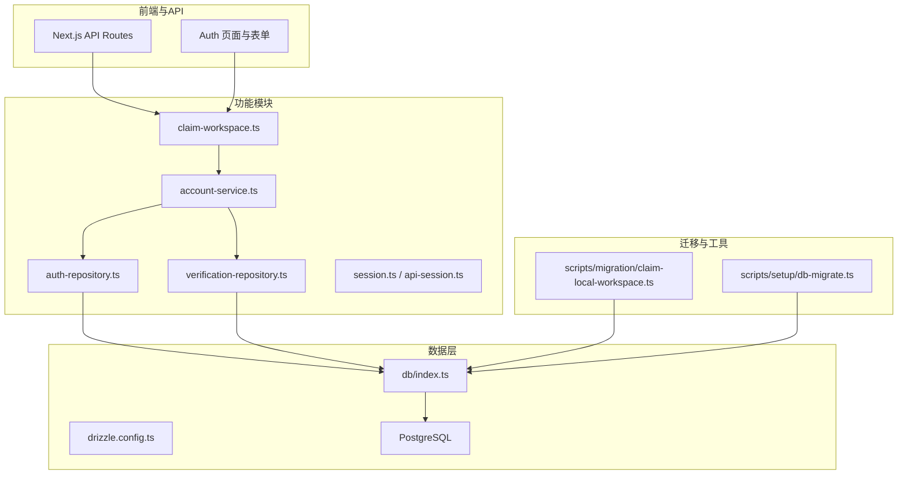
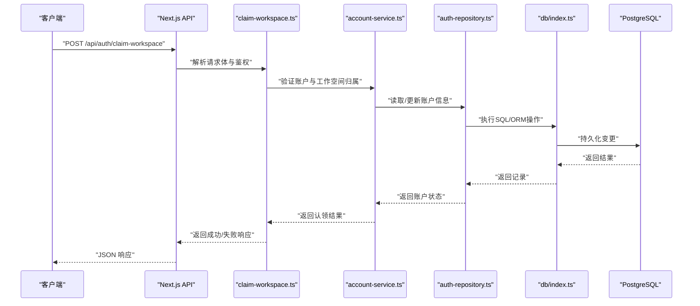
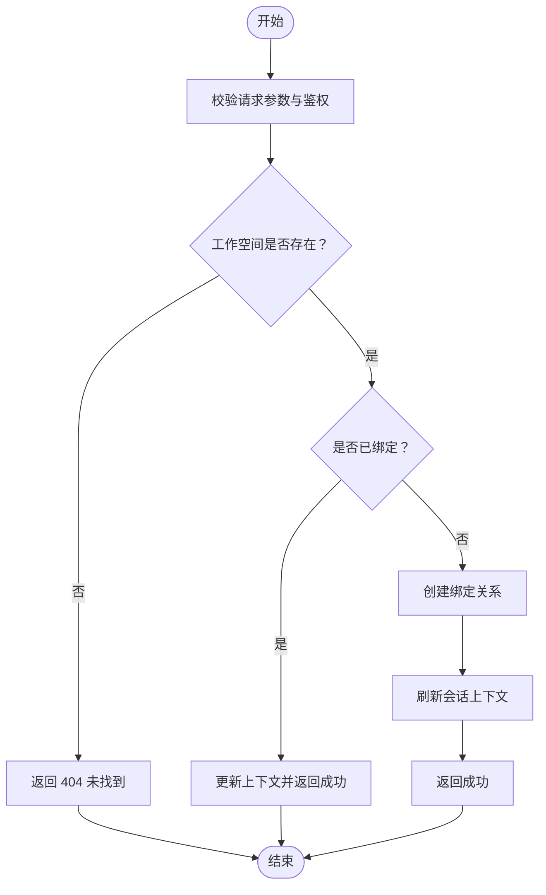
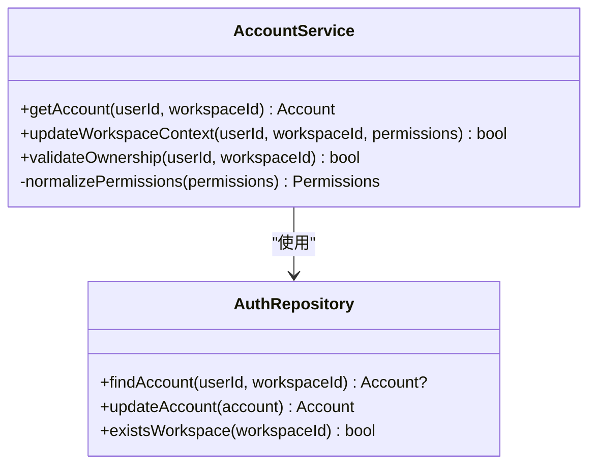
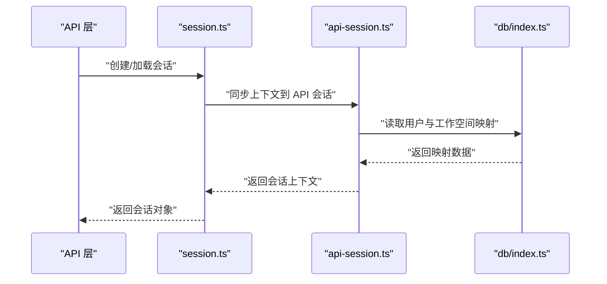
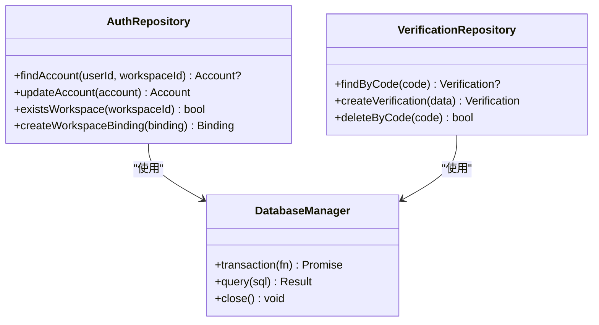
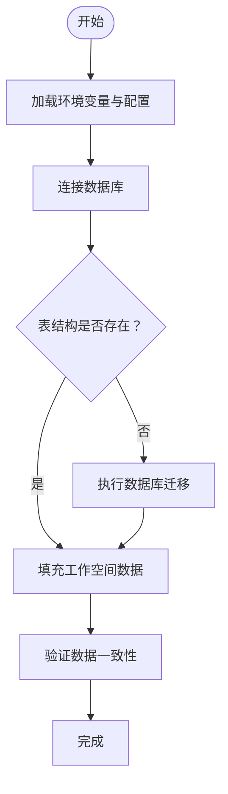
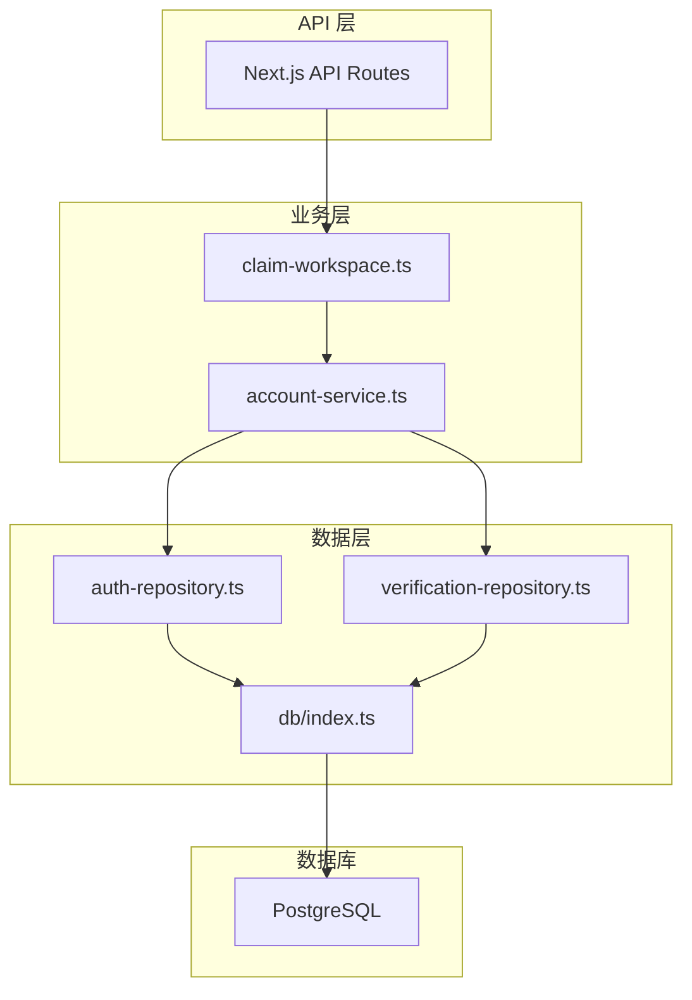

# 工作空间上下文迁移

<cite>
**本文档引用的文件**   
- [workspace-context-contract.test.ts](file://tests/workspace-context-contract.test.ts)
- [claim-workspace.pg.test.ts](file://src/features/auth/claim-workspace.pg.test.ts)
- [claim-workspace.ts](file://src/features/auth/claim-workspace.ts)
- [account-service.pg.test.ts](file://src/features/auth/account-service.pg.test.ts)
- [account-service.ts](file://src/features/auth/account-service.ts)
- [auth-repository.ts](file://src/features/auth/auth-repository.ts)
- [verification-repository.ts](file://src/features/auth/verification-repository.ts)
- [session.ts](file://src/features/auth/session.ts)
- [api-session.ts](file://src/features/auth/api-session.ts)
- [db/index.ts](file://src/lib/db/index.ts)
- [drizzle.config.ts](file://drizzle.config.ts)
- [scripts/migration/claim-local-workspace.ts](file://scripts/migration/claim-local-workspace.ts)
- [scripts/setup/db-migrate.ts](file://scripts/setup/db-migrate.ts)
</cite>

## 目录
1. [简介](#简介)
2. [项目结构](#项目结构)
3. [核心组件](#核心组件)
4. [架构总览](#架构总览)
5. [详细组件分析](#详细组件分析)
6. [依赖关系分析](#依赖关系分析)
7. [性能考虑](#性能考虑)
8. [故障排查指南](#故障排查指南)
9. [结论](#结论)
10. [附录](#附录)

## 简介
本文件围绕“工作空间上下文迁移”主题，系统性梳理仓库中与工作空间（Workspace）相关的认证、会话、数据库与迁移脚本的实现与交互。重点覆盖：
- 工作空间认领（Claim Workspace）流程
- 账户服务与会话管理
- 数据访问层（Repository）与数据库配置
- 迁移脚本如何驱动本地/生产环境的数据一致性

该文档以代码为依据，提供架构图、时序图、流程图与依赖图，帮助读者快速理解并安全地扩展或维护相关工作空间迁移能力。

## 项目结构
与“工作空间上下文迁移”直接相关的代码主要分布在以下位置：
- 功能模块：src/features/auth（认证与会话）、src/lib/db（数据库访问）
- 测试用例：tests/workspace-context-contract.test.ts、src/features/auth/* 的 pg 测试
- 迁移与初始化脚本：scripts/migration、scripts/setup

图表来源
- [claim-workspace.ts](file://src/features/auth/claim-workspace.ts)
- [account-service.ts](file://src/features/auth/account-service.ts)
- [auth-repository.ts](file://src/features/auth/auth-repository.ts)
- [verification-repository.ts](file://src/features/auth/verification-repository.ts)
- [session.ts](file://src/features/auth/session.ts)
- [api-session.ts](file://src/features/auth/api-session.ts)
- [db/index.ts](file://src/lib/db/index.ts)
- [drizzle.config.ts](file://drizzle.config.ts)
- [scripts/migration/claim-local-workspace.ts](file://scripts/migration/claim-local-workspace.ts)
- [scripts/setup/db-migrate.ts](file://scripts/setup/db-migrate.ts)

章节来源
- [workspace-context-contract.test.ts](file://tests/workspace-context-contract.test.ts)
- [claim-workspace.pg.test.ts](file://src/features/auth/claim-workspace.pg.test.ts)
- [account-service.pg.test.ts](file://src/features/auth/account-service.pg.test.ts)

## 核心组件
- 工作空间认领（Claim Workspace）
  - 负责将当前用户与工作空间建立绑定关系，确保后续请求具备正确的上下文。
  - 关键实现位于 claim-workspace.ts，配合 account-service.ts 完成账户校验与更新。
- 账户服务（Account Service）
  - 封装账户查询、更新、权限判断等逻辑，为认领流程提供数据支撑。
- 数据访问层（Repositories）
  - auth-repository.ts、verification-repository.ts 分别负责认证相关实体与验证码实体的持久化操作。
- 会话管理（Session）
  - session.ts 与 api-session.ts 提供服务端与 API 层的会话读写与校验能力。
- 数据库与配置
  - db/index.ts 暴露连接与事务能力；drizzle.config.ts 定义 ORM 配置与迁移策略。
- 迁移脚本
  - scripts/migration/claim-local-workspace.ts 用于本地环境的工作空间认领与数据修复。
  - scripts/setup/db-migrate.ts 统一执行数据库迁移。

章节来源
- [claim-workspace.ts](file://src/features/auth/claim-workspace.ts)
- [account-service.ts](file://src/features/auth/account-service.ts)
- [auth-repository.ts](file://src/features/auth/auth-repository.ts)
- [verification-repository.ts](file://src/features/auth/verification-repository.ts)
- [session.ts](file://src/features/auth/session.ts)
- [api-session.ts](file://src/features/auth/api-session.ts)
- [db/index.ts](file://src/lib/db/index.ts)
- [drizzle.config.ts](file://drizzle.config.ts)
- [scripts/migration/claim-local-workspace.ts](file://scripts/migration/claim-local-workspace.ts)
- [scripts/setup/db-migrate.ts](file://scripts/setup/db-migrate.ts)

## 架构总览
下图展示了从 API 调用到数据库写入的完整链路，以及迁移脚本如何介入数据准备与修复。

图表来源
- [claim-workspace.ts](file://src/features/auth/claim-workspace.ts)
- [account-service.ts](file://src/features/auth/account-service.ts)
- [auth-repository.ts](file://src/features/auth/auth-repository.ts)
- [db/index.ts](file://src/lib/db/index.ts)

章节来源
- [workspace-context-contract.test.ts](file://tests/workspace-context-contract.test.ts)

## 详细组件分析

### 工作空间认领流程（Claim Workspace）
- 目标：在当前用户与工作空间之间建立或确认关联，确保后续业务操作具备正确上下文。
- 输入：用户标识、工作空间标识、可选的权限参数。
- 处理：
  - 校验用户身份与工作空间存在性
  - 检查是否已存在绑定关系或冲突
  - 更新账户表中的工作空间上下文
  - 刷新会话中的工作空间上下文
- 输出：认领成功或失败的状态码与消息

图表来源
- [claim-workspace.ts](file://src/features/auth/claim-workspace.ts)
- [account-service.ts](file://src/features/auth/account-service.ts)
- [session.ts](file://src/features/auth/session.ts)
- [api-session.ts](file://src/features/auth/api-session.ts)

章节来源
- [claim-workspace.pg.test.ts](file://src/features/auth/claim-workspace.pg.test.ts)
- [account-service.pg.test.ts](file://src/features/auth/account-service.pg.test.ts)

### 账户服务（Account Service）
- 职责：封装账户数据的查询、更新与权限判断，为认领流程提供可靠的数据基础。
- 关键点：
  - 支持按用户ID与工作空间ID进行联合查询
  - 在更新时保证事务性与幂等性
  - 对异常情况进行分类与错误提示

图表来源
- [account-service.ts](file://src/features/auth/account-service.ts)
- [auth-repository.ts](file://src/features/auth/auth-repository.ts)

章节来源
- [account-service.ts](file://src/features/auth/account-service.ts)
- [auth-repository.ts](file://src/features/auth/auth-repository.ts)

### 会话管理（Session）
- 职责：在服务端与 API 层维护用户会话与工作空间上下文的一致性。
- 关键点：
  - 会话创建时注入默认工作空间
  - 认领成功后刷新会话上下文
  - 跨请求保持上下文稳定

图表来源
- [session.ts](file://src/features/auth/session.ts)
- [api-session.ts](file://src/features/auth/api-session.ts)
- [db/index.ts](file://src/lib/db/index.ts)

章节来源
- [session.ts](file://src/features/auth/session.ts)
- [api-session.ts](file://src/features/auth/api-session.ts)

### 数据访问层（Repositories）
- 职责：抽象数据库操作，提供统一的查询与更新接口。
- 关键点：
  - 使用 Drizzle ORM 进行类型安全的 SQL 构建
  - 支持事务与重试机制
  - 对并发场景下的竞态条件进行处理

图表来源
- [auth-repository.ts](file://src/features/auth/auth-repository.ts)
- [verification-repository.ts](file://src/features/auth/verification-repository.ts)
- [db/index.ts](file://src/lib/db/index.ts)

章节来源
- [auth-repository.ts](file://src/features/auth/auth-repository.ts)
- [verification-repository.ts](file://src/features/auth/verification-repository.ts)

### 迁移脚本（Migration Scripts）
- 目标：在本地或测试环境中预置工作空间数据，确保认领流程可顺利执行。
- 关键点：
  - 批量创建用户与工作空间映射
  - 清理脏数据并重建索引
  - 与数据库迁移脚本协同工作

图表来源
- [scripts/migration/claim-local-workspace.ts](file://scripts/migration/claim-local-workspace.ts)
- [scripts/setup/db-migrate.ts](file://scripts/setup/db-migrate.ts)
- [drizzle.config.ts](file://drizzle.config.ts)

章节来源
- [scripts/migration/claim-local-workspace.ts](file://scripts/migration/claim-local-workspace.ts)
- [scripts/setup/db-migrate.ts](file://scripts/setup/db-migrate.ts)
- [drizzle.config.ts](file://drizzle.config.ts)

## 依赖关系分析
工作空间上下文迁移涉及多个模块之间的协作，下图展示了核心依赖关系：

图表来源
- [claim-workspace.ts](file://src/features/auth/claim-workspace.ts)
- [account-service.ts](file://src/features/auth/account-service.ts)
- [auth-repository.ts](file://src/features/auth/auth-repository.ts)
- [verification-repository.ts](file://src/features/auth/verification-repository.ts)
- [db/index.ts](file://src/lib/db/index.ts)

章节来源
- [workspace-context-contract.test.ts](file://tests/workspace-context-contract.test.ts)

## 性能考虑
- 数据库查询优化
  - 使用索引加速用户与工作空间的联合查询
  - 避免 N+1 查询问题，采用批量操作
- 会话管理
  - 缓存常用上下文信息，减少重复查询
  - 合理设置会话过期时间，平衡安全性与性能
- 事务处理
  - 最小化事务范围，降低锁竞争
  - 对长事务进行拆分，提高并发度
- 迁移脚本
  - 分批处理大数据量，避免内存溢出
  - 使用幂等设计，支持重复执行

## 故障排查指南
- 常见问题
  - 工作空间不存在：检查数据库中的工作空间记录
  - 权限不足：验证用户角色与工作空间权限配置
  - 会话不同步：检查会话刷新逻辑与缓存一致性
- 调试步骤
  - 启用详细日志，记录关键节点状态
  - 使用测试用例复现问题，定位具体环节
  - 检查数据库约束与索引状态
- 恢复措施
  - 使用迁移脚本重建数据
  - 清理无效会话并重新登录
  - 回滚有问题的变更并重新执行

## 结论
工作空间上下文迁移是系统认证与会话管理的核心环节。通过清晰的模块划分、可靠的数据库访问层与完善的迁移脚本，确保了数据一致性与用户体验。建议在生产环境中加强监控与告警，及时发现并处理潜在问题。

## 附录
- 相关测试用例
  - workspace-context-contract.test.ts：验证工作空间上下文契约
  - claim-workspace.pg.test.ts：端到端测试认领流程
  - account-service.pg.test.ts：账户服务单元测试
- 配置文件
  - drizzle.config.ts：数据库 ORM 配置
  - .env.example：环境变量示例