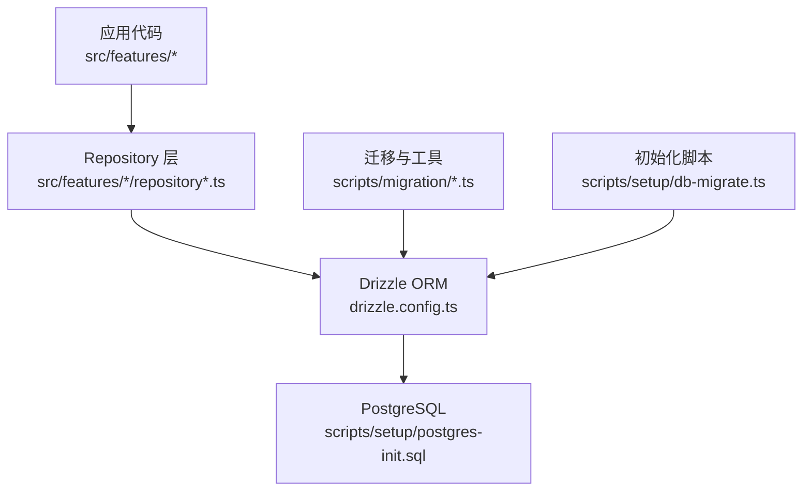
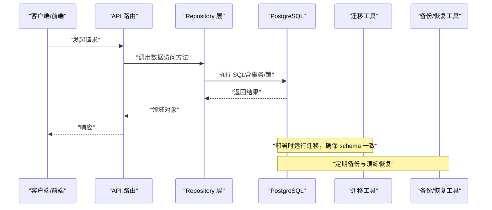
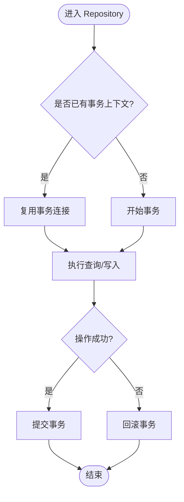
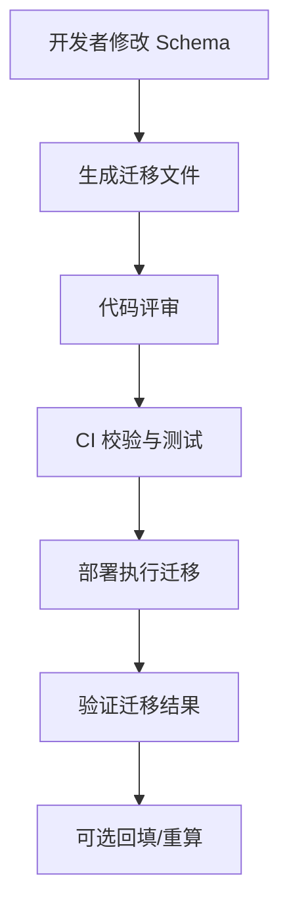
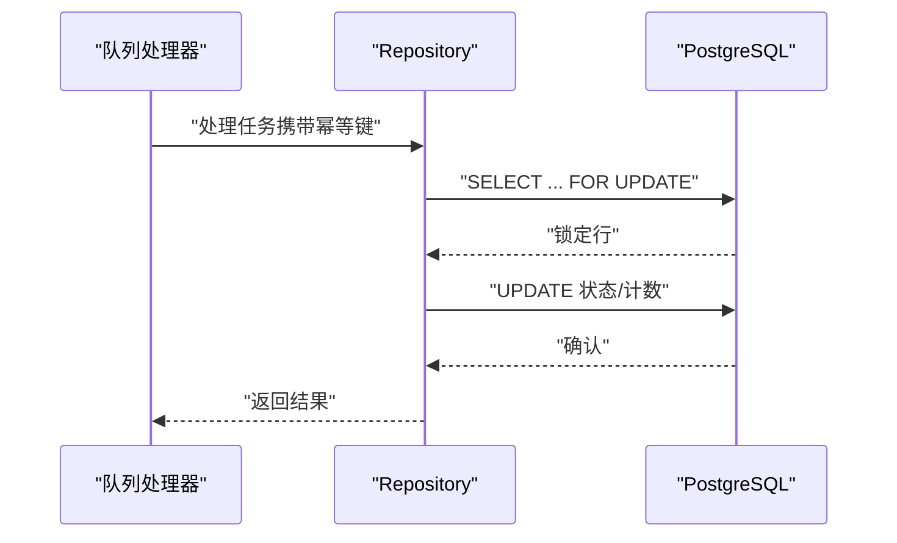
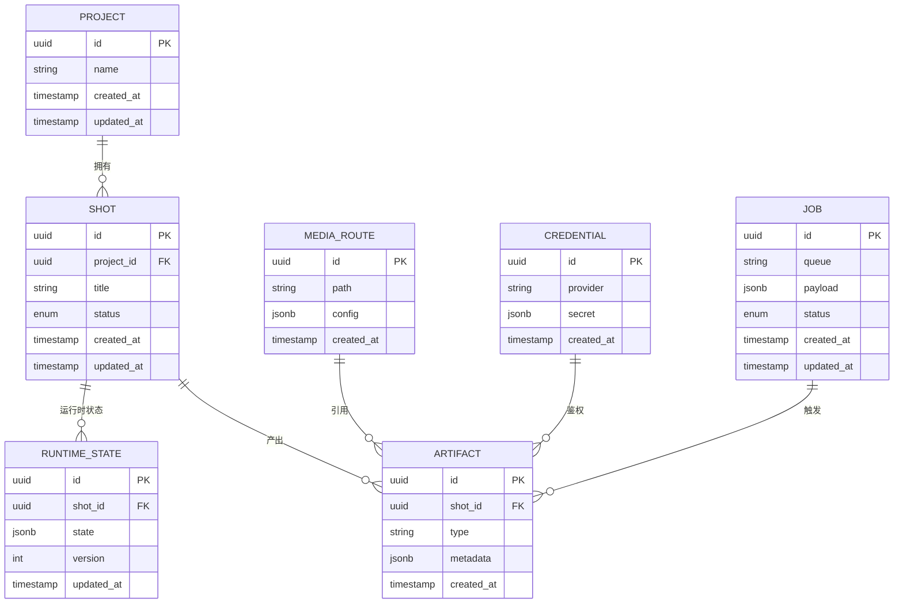
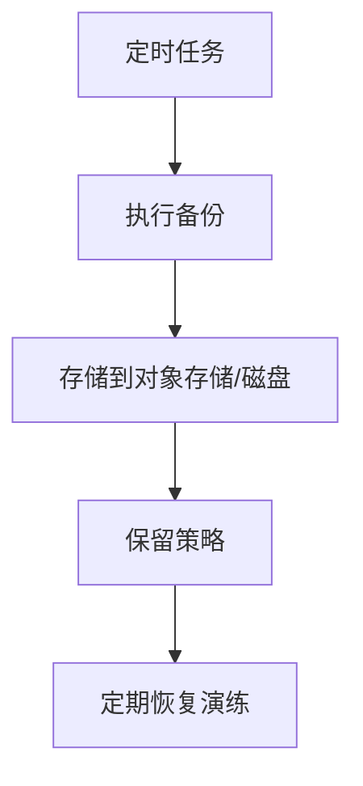
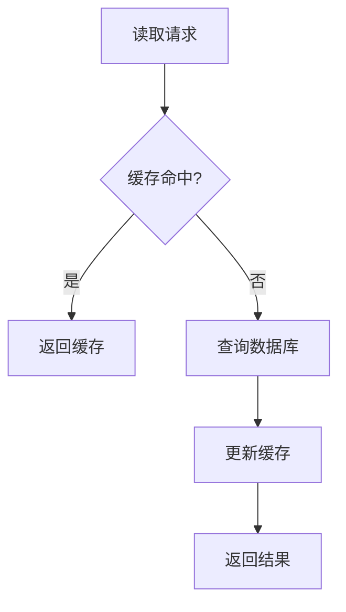
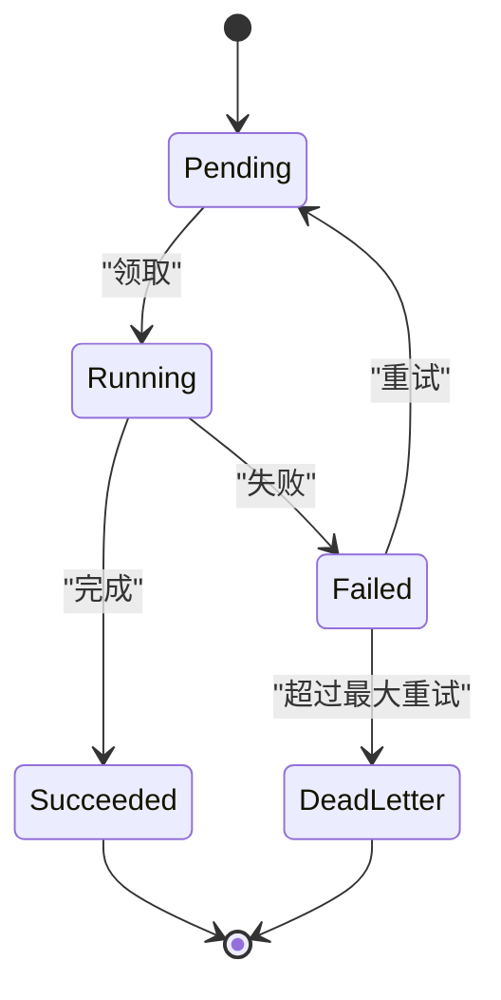
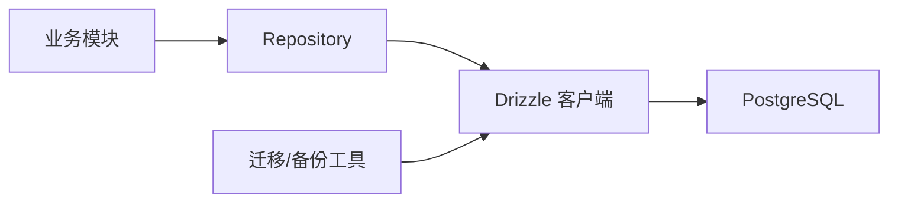

# 数据架构设计

<cite>
**本文引用的文件**   
- [drizzle.config.ts](file://drizzle.config.ts)
- [scripts/setup/db-migrate.ts](file://scripts/setup/db-migrate.ts)
- [scripts/setup/postgres-init.sql](file://scripts/setup/postgres-init.sql)
- [scripts/migration/export-sqlite.ts](file://scripts/migration/export-sqlite.ts)
- [scripts/migration/import-postgres.ts](file://scripts/migration/import-postgres.ts)
- [scripts/migration/provision-master-key.ts](file://scripts/migration/provision-master-key.ts)
- [scripts/migration/reconcile-postgres.ts](file://scripts/migration/reconcile-postgres.ts)
- [scripts/migration/sqlite-backup.ts](file://scripts/migration/sqlite-backup.ts)
- [server/src/server/job-store.ts](file://server/src/server/job-store.ts)
- [src/features/audio/runtime-repository.pg.test.ts](file://src/features/audio/runtime-repository.pg.test.ts)
- [src/features/credentials/provider-credential-store.pg.test.ts](file://src/features/credentials/provider-credential-store.pg.test.ts)
- [src/features/director/runtime-repository.pg.test.ts](file://src/features/director/runtime-repository.pg.test.ts)
- [src/features/render/cache.pg.test.ts](file://src/features/render/cache.pg.test.ts)
- [src/features/render/repository.pg.test.ts](file://src/features/render/repository.pg.test.ts)
- [src/features/routing/media-route-repository.pg.test.ts](file://src/features/routing/media-route-repository.pg.test.ts)
- [src/lib/db/index.ts](file://src/lib/db/index.ts)
</cite>

## 目录
1. [引言](#引言)
2. [项目结构](#项目结构)
3. [核心组件](#核心组件)
4. [架构总览](#架构总览)
5. [详细组件分析](#详细组件分析)
6. [依赖分析](#依赖分析)
7. [性能考虑](#性能考虑)
8. [故障排查指南](#故障排查指南)
9. [结论](#结论)
10. [附录](#附录) 

## 引言
本文件为 PurpleInk 平台的数据架构设计文档，聚焦 PostgreSQL 数据库设计、Drizzle ORM 使用模式、迁移与版本控制、一致性保证与并发控制、备份恢复、性能调优与查询优化、模型演进与兼容性、数据安全与访问控制等关键主题。文档面向研发与运维人员，兼顾可读性与可执行性，帮助团队在现有工程基础上持续演进数据层。

## 项目结构
PurpleInk 采用前后端分离与多进程（Web/Worker）架构，数据层通过 Drizzle ORM 与 PostgreSQL 交互。与数据相关的关键位置包括：
- Drizzle 配置与迁移脚本位于根目录与 scripts 子目录
- 各业务域（音频、导演、渲染、路由、凭据等）通过 repository 层访问数据库
- 测试用例覆盖 PostgreSQL 集成场景，体现表结构与约束约定
- 初始化 SQL 用于数据库环境准备

**图表来源** 
- [drizzle.config.ts](file://drizzle.config.ts)
- [scripts/setup/db-migrate.ts](file://scripts/setup/db-migrate.ts)
- [scripts/setup/postgres-init.sql](file://scripts/setup/postgres-init.sql)

**章节来源**
- [drizzle.config.ts](file://drizzle.config.ts)
- [scripts/setup/db-migrate.ts](file://scripts/setup/db-migrate.ts)
- [scripts/setup/postgres-init.sql](file://scripts/setup/postgres-init.sql)

## 核心组件
- Drizzle ORM 配置与连接管理：集中式配置数据库连接参数、驱动与迁移路径，确保跨模块一致行为
- Repository 抽象：按业务域划分数据访问接口，封装 CRUD、事务与复杂查询
- 迁移与版本控制：基于 Drizzle 的迁移脚本与辅助脚本实现增量升级与回滚策略
- 集成测试：针对 PostgreSQL 的端到端验证，保障表结构、索引与约束正确性

**章节来源**
- [drizzle.config.ts](file://drizzle.config.ts)
- [src/lib/db/index.ts](file://src/lib/db/index.ts)

## 架构总览
下图展示从 Web/Worker 到数据库的整体数据流，以及迁移与备份工具的位置。

**图表来源** 
- [scripts/setup/db-migrate.ts](file://scripts/setup/db-migrate.ts)
- [scripts/migration/reconcile-postgres.ts](file://scripts/migration/reconcile-postgres.ts)
- [scripts/migration/sqlite-backup.ts](file://scripts/migration/sqlite-backup.ts)

## 详细组件分析

### Drizzle ORM 使用模式
- 连接与实例化：通过统一的数据库入口创建连接池与客户端，避免重复连接
- Schema 定义：以 TypeScript 类型驱动，确保类型安全与 IDE 支持
- 查询构建：使用 Drizzle 的查询构建器进行条件过滤、排序、分页与聚合
- 事务与锁：在写路径中显式开启事务，必要时使用行级锁或更新锁保证一致性
- 错误处理：统一捕获并转换数据库异常为领域错误

**图表来源** 
- [src/lib/db/index.ts](file://src/lib/db/index.ts)

**章节来源**
- [src/lib/db/index.ts](file://src/lib/db/index.ts)

### 数据迁移管理与版本控制
- 迁移脚本：使用 Drizzle CLI 生成与执行迁移，确保 schema 变更可追踪
- 初始化脚本：PostgreSQL 初始化 SQL 用于创建角色、扩展与基础结构
- 迁移编排：通过 db-migrate 脚本在启动或部署阶段执行迁移
- 数据同步：提供 reconcile 工具对比与修复本地与远程 schema 差异
- 历史数据迁移：sqlite 导出/导入脚本用于过渡期数据迁移

**图表来源** 
- [scripts/setup/db-migrate.ts](file://scripts/setup/db-migrate.ts)
- [scripts/migration/reconcile-postgres.ts](file://scripts/migration/reconcile-postgres.ts)
- [scripts/migration/export-sqlite.ts](file://scripts/migration/export-sqlite.ts)
- [scripts/migration/import-postgres.ts](file://scripts/migration/import-postgres.ts)

**章节来源**
- [scripts/setup/db-migrate.ts](file://scripts/setup/db-migrate.ts)
- [scripts/setup/postgres-init.sql](file://scripts/setup/postgres-init.sql)
- [scripts/migration/reconcile-postgres.ts](file://scripts/migration/reconcile-postgres.ts)
- [scripts/migration/export-sqlite.ts](file://scripts/migration/export-sqlite.ts)
- [scripts/migration/import-postgres.ts](file://scripts/migration/import-postgres.ts)

### 数据一致性、事务与并发控制
- 事务边界：所有写操作包裹在事务中，失败自动回滚
- 并发控制：对热点行使用行级锁或乐观锁字段（版本号），避免竞态
- 幂等性：对外部事件与队列消费采用幂等键，防止重复处理
- 最终一致性：异步任务完成后通过状态机推进，允许短暂不一致

**图表来源** 
- [src/features/audio/runtime-repository.pg.test.ts](file://src/features/audio/runtime-repository.pg.test.ts)
- [src/features/director/runtime-repository.pg.test.ts](file://src/features/director/runtime-repository.pg.test.ts)

**章节来源**
- [src/features/audio/runtime-repository.pg.test.ts](file://src/features/audio/runtime-repository.pg.test.ts)
- [src/features/director/runtime-repository.pg.test.ts](file://src/features/director/runtime-repository.pg.test.ts)

### 数据模型与关系（概念图）
以下为概念性实体关系图，用于说明常见领域对象之间的关联与约束。实际字段与约束以迁移与测试为准。

[此图为概念示意，不直接映射具体源文件]

### 备份与恢复
- SQLite 备份：提供导出脚本用于离线备份与迁移
- PostgreSQL 备份：建议结合 pg_dump/pg_restore 或云厂商快照
- 恢复演练：定期演练恢复流程，验证完整性与可用性

**图表来源** 
- [scripts/migration/sqlite-backup.ts](file://scripts/migration/sqlite-backup.ts)

**章节来源**
- [scripts/migration/sqlite-backup.ts](file://scripts/migration/sqlite-backup.ts)

### 缓存与读写分离
- 读路径缓存：对热点查询结果进行短期缓存，降低数据库压力
- 失效策略：基于 TTL 与事件驱动的失效机制
- 一致性权衡：允许短暂不一致，提升吞吐

**图表来源** 
- [src/features/render/cache.pg.test.ts](file://src/features/render/cache.pg.test.ts)

**章节来源**
- [src/features/render/cache.pg.test.ts](file://src/features/render/cache.pg.test.ts)

### 作业持久化
- 作业存储：将队列作业持久化，支持重试、超时与死信
- 状态机：作业状态流转清晰，便于监控与排障

**图表来源** 
- [server/src/server/job-store.ts](file://server/src/server/job-store.ts)

**章节来源**
- [server/src/server/job-store.ts](file://server/src/server/job-store.ts)

## 依赖分析
- 模块耦合：Repository 层屏蔽底层 SQL，上层仅依赖接口，降低耦合
- 外部依赖：PostgreSQL 驱动、Drizzle 客户端、对象存储（可选）
- 循环依赖：通过接口与分层避免循环引用

**图表来源** 
- [src/lib/db/index.ts](file://src/lib/db/index.ts)
- [drizzle.config.ts](file://drizzle.config.ts)

**章节来源**
- [src/lib/db/index.ts](file://src/lib/db/index.ts)
- [drizzle.config.ts](file://drizzle.config.ts)

## 性能考虑
- 索引策略
  - 主键与唯一约束：确保快速定位与去重
  - 外键索引：加速 JOIN 与级联删除
  - 复合索引：针对高频查询条件组合建立
  - 部分索引：对活跃子集建立索引，减少体积
- 查询优化
  - 避免 SELECT *，按需选择字段
  - 合理使用分页与游标
  - 避免 N+1 查询，批量加载
- 连接池
  - 合理设置最大连接数与超时
  - 长事务与短事务分离
- 缓存
  - 热点数据缓存，TTL 与失效策略
- 监控与诊断
  - 慢查询日志与执行计划分析
  - 指标采集与告警

[本节为通用指导，不直接分析具体文件]

## 故障排查指南
- 常见问题
  - 迁移失败：检查迁移顺序与依赖，使用 reconcile 工具比对
  - 连接池耗尽：调整池大小与超时，排查长事务
  - 死锁与锁等待：分析锁持有者与等待链，优化事务粒度
  - 数据不一致：核对幂等键与状态机，补充补偿逻辑
- 调试手段
  - 启用详细日志与审计
  - 使用 EXPLAIN ANALYZE 分析慢查询
  - 回放生产流量至测试库复现问题

**章节来源**
- [scripts/migration/reconcile-postgres.ts](file://scripts/migration/reconcile-postgres.ts)
- [scripts/setup/db-migrate.ts](file://scripts/setup/db-migrate.ts)

## 结论
PurpleInk 的数据架构以 Drizzle ORM 为核心，结合清晰的 Repository 分层与完善的迁移/备份工具链，支撑高并发与可扩展的业务需求。通过严格的事务与并发控制、合理的索引与缓存策略，以及完善的安全与合规措施，平台能够在演进过程中保持数据一致性与系统稳定性。建议持续完善监控与演练机制，确保在生产环境中具备高可用与可恢复能力。

## 附录
- 参考实践
  - 幂等键设计与去重表
  - 分库分表与归档策略
  - 敏感数据加密与脱敏
- 术语表
  - Repository：数据访问抽象层
  - 幂等性：多次执行产生相同结果
  - 最终一致性：允许短暂不一致，最终达到一致

[本节为补充信息，不直接分析具体文件]