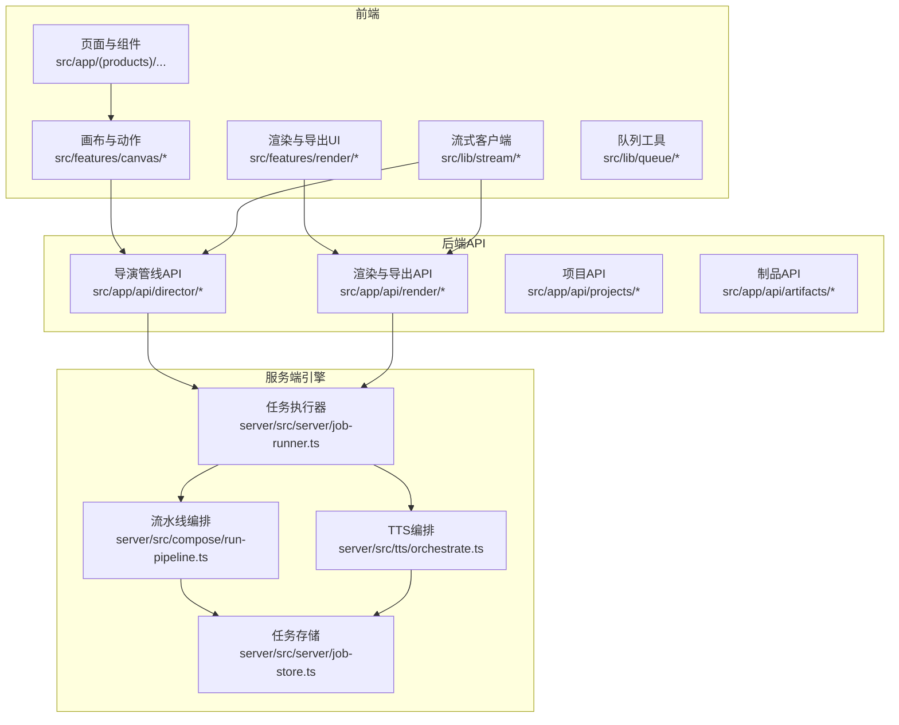
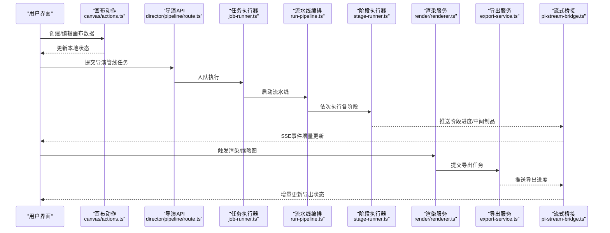
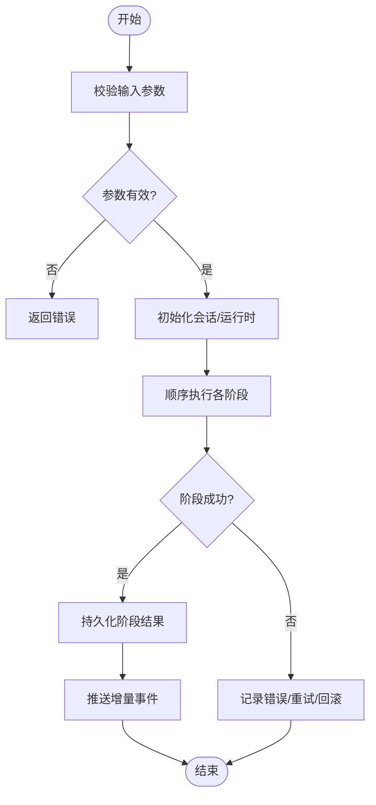
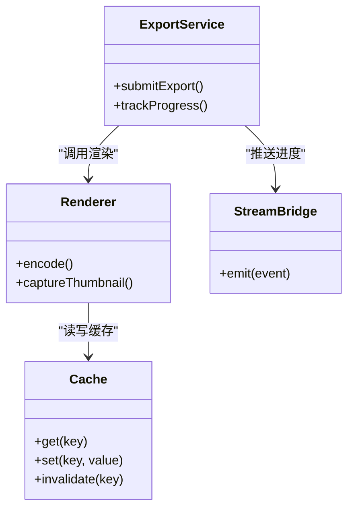
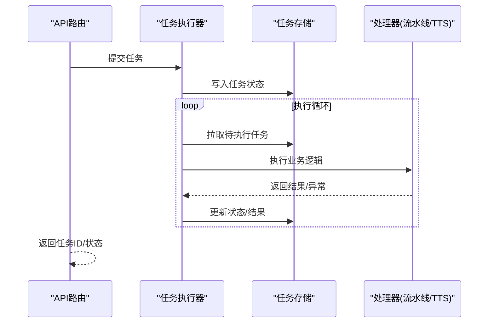
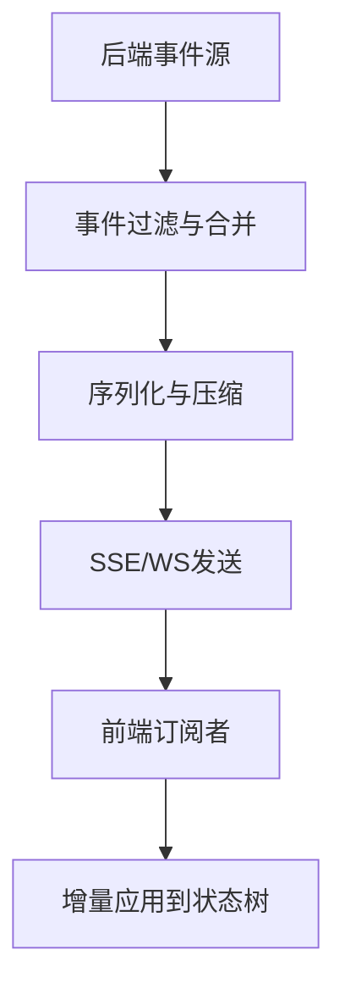
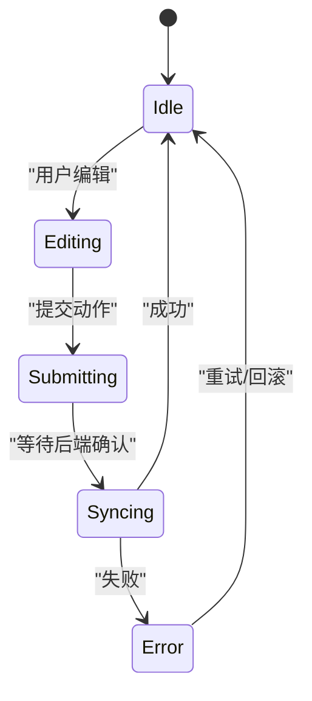
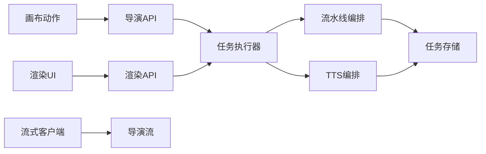

# 数据流与状态管理

<cite>
**本文引用的文件**   
- [src/app/api/director/pipeline/route.ts](file://src/app/api/director/pipeline/route.ts)
- [src/app/api/director/stage/route.ts](file://src/app/api/director/stage/route.ts)
- [src/app/api/director/stream/[nodeId]/route.ts](file://src/app/api/director/stream/[nodeId]/route.ts)
- [src/app/api/director/stream/project/[projectId]/route.ts](file://src/app/api/director/stream/project/[projectId]/route.ts)
- [src/app/api/render/route.ts](file://src/app/api/render/route.ts)
- [src/app/api/render/export/route.ts](file://src/app/api/render/export/route.ts)
- [src/app/api/projects/route.ts](file://src/app/api/projects/route.ts)
- [src/app/api/artifacts/[id]/route.ts](file://src/app/api/artifacts/[id]/route.ts)
- [server/src/server/job-runner.ts](file://server/src/server/job-runner.ts)
- [server/src/server/job-store.ts](file://server/src/server/job-store.ts)
- [server/src/compose/run-pipeline.ts](file://server/src/compose/run-pipeline.ts)
- [server/src/tts/orchestrate.ts](file://server/src/tts/orchestrate.ts)
- [src/features/director/advance.ts](file://src/features/director/advance.ts)
- [src/features/director/runtime-repository.ts](file://src/features/director/runtime-repository.ts)
- [src/features/director/session-store.ts](file://src/features/director/session-store.ts)
- [src/features/director/stage-runner.ts](file://src/features/director/stage-runner.ts)
- [src/features/director/stage-result.ts](file://src/features/director/stage-result.ts)
- [src/features/director/pi-stream-bridge.ts](file://src/features/director/pi-stream-bridge.ts)
- [src/features/canvas/actions.ts](file://src/features/canvas/actions.ts)
- [src/features/canvas/types.ts](file://src/features/canvas/types.ts)
- [src/features/canvas/status.ts](file://src/features/canvas/status.ts)
- [src/features/render/renderer.ts](file://src/features/render/renderer.ts)
- [src/features/render/export-service.ts](file://src/features/render/export-service.ts)
- [src/features/render/cache.ts](file://src/features/render/cache.ts)
- [src/lib/stream/index.ts](file://src/lib/stream/index.ts)
- [src/lib/queue/index.ts](file://src/lib/queue/index.ts)
</cite>

## 目录
1. [简介](#简介)
2. [项目结构](#项目结构)
3. [核心组件](#核心组件)
4. [架构总览](#架构总览)
5. [详细组件分析](#详细组件分析)
6. [依赖关系分析](#依赖关系分析)
7. [性能考量](#性能考量)
8. [故障排查指南](#故障排查指南)
9. [结论](#结论)
10. [附录](#附录)

## 简介
本文件面向PurpleInk平台的数据流与状态管理，覆盖从用户输入到最终输出的完整链路，包括：
- 前端状态管理策略（React局部状态、全局状态、缓存机制）
- 后端请求处理、业务编排、持久化与任务调度
- 实时数据同步（WebSocket/SSE事件流、增量更新）
- 关键流程的数据流图与状态转换图

## 项目结构
PurpleInk采用前后端分离的Next.js应用，服务端能力集中在server/src目录，业务特性按feature拆分在src/features下，API路由位于src/app/api。

图表来源
- [src/app/api/director/pipeline/route.ts](file://src/app/api/director/pipeline/route.ts)
- [src/app/api/render/route.ts](file://src/app/api/render/route.ts)
- [server/src/server/job-runner.ts](file://server/src/server/job-runner.ts)
- [server/src/compose/run-pipeline.ts](file://server/src/compose/run-pipeline.ts)
- [server/src/tts/orchestrate.ts](file://server/src/tts/orchestrate.ts)

章节来源
- [src/app/api/director/pipeline/route.ts](file://src/app/api/director/pipeline/route.ts)
- [src/app/api/render/route.ts](file://src/app/api/render/route.ts)
- [server/src/server/job-runner.ts](file://server/src/server/job-runner.ts)
- [server/src/compose/run-pipeline.ts](file://server/src/compose/run-pipeline.ts)

## 核心组件
- 导演管线（Director）：负责分阶段推进生产流程，维护会话与运行时状态，驱动各Stage执行并产出中间制品。
- 渲染服务（Render）：将画布内容编码为媒体产物，支持缩略图生成与导出任务。
- 任务执行器（Job Runner）：统一调度长耗时任务，提供幂等执行、重试与结果落库。
- 流式桥接（Stream Bridge）：将后端事件以SSE/WS形式推送给前端，实现增量更新。
- 画布动作（Canvas Actions）：封装对画布数据的增删改查与版本提交。
- 缓存层（Cache）：针对渲染产物与查询结果进行缓存，降低重复计算与IO压力。

章节来源
- [src/features/director/advance.ts](file://src/features/director/advance.ts)
- [src/features/director/runtime-repository.ts](file://src/features/director/runtime-repository.ts)
- [src/features/director/session-store.ts](file://src/features/director/session-store.ts)
- [src/features/director/stage-runner.ts](file://src/features/director/stage-runner.ts)
- [src/features/director/stage-result.ts](file://src/features/director/stage-result.ts)
- [src/features/director/pi-stream-bridge.ts](file://src/features/director/pi-stream-bridge.ts)
- [src/features/render/renderer.ts](file://src/features/render/renderer.ts)
- [src/features/render/export-service.ts](file://src/features/render/export-service.ts)
- [src/features/render/cache.ts](file://src/features/render/cache.ts)

## 架构总览
下图展示一次“创建项目→启动导演管线→阶段推进→渲染导出”的端到端数据流。

图表来源
- [src/app/api/director/pipeline/route.ts](file://src/app/api/director/pipeline/route.ts)
- [server/src/server/job-runner.ts](file://server/src/server/job-runner.ts)
- [server/src/compose/run-pipeline.ts](file://server/src/compose/run-pipeline.ts)
- [src/features/director/stage-runner.ts](file://src/features/director/stage-runner.ts)
- [src/features/render/renderer.ts](file://src/features/render/renderer.ts)
- [src/features/render/export-service.ts](file://src/features/render/export-service.ts)
- [src/features/director/pi-stream-bridge.ts](file://src/features/director/pi-stream-bridge.ts)

## 详细组件分析

### 导演管线与阶段推进
- 职责：接收前端提交的导演指令，维护会话与运行时上下文，按阶段推进并持久化中间结果。
- 关键点：
  - 阶段执行器负责调用具体Stage逻辑，产出阶段结果并写入运行时仓库。
  - 通过流式桥接将阶段进度与中间制品增量推送至前端。
  - 失败时记录错误并允许重试或回滚。

图表来源
- [src/features/director/advance.ts](file://src/features/director/advance.ts)
- [src/features/director/stage-runner.ts](file://src/features/director/stage-runner.ts)
- [src/features/director/stage-result.ts](file://src/features/director/stage-result.ts)
- [src/features/director/runtime-repository.ts](file://src/features/director/runtime-repository.ts)
- [src/features/director/pi-stream-bridge.ts](file://src/features/director/pi-stream-bridge.ts)

章节来源
- [src/app/api/director/stage/route.ts](file://src/app/api/director/stage/route.ts)
- [src/features/director/advance.ts](file://src/features/director/advance.ts)
- [src/features/director/stage-runner.ts](file://src/features/director/stage-runner.ts)
- [src/features/director/stage-result.ts](file://src/features/director/stage-result.ts)
- [src/features/director/runtime-repository.ts](file://src/features/director/runtime-repository.ts)
- [src/features/director/session-store.ts](file://src/features/director/session-store.ts)
- [src/features/director/pi-stream-bridge.ts](file://src/features/director/pi-stream-bridge.ts)

### 渲染与导出
- 职责：根据画布与制品生成缩略图与导出产物，支持任务队列与缓存。
- 关键点：
  - 渲染服务负责编码与合成，导出服务负责任务编排与结果落盘。
  - 缓存层避免重复渲染，提升响应速度。
  - 通过流式接口向客户端推送渲染进度。

图表来源
- [src/features/render/renderer.ts](file://src/features/render/renderer.ts)
- [src/features/render/export-service.ts](file://src/features/render/export-service.ts)
- [src/features/render/cache.ts](file://src/features/render/cache.ts)
- [src/features/director/pi-stream-bridge.ts](file://src/features/director/pi-stream-bridge.ts)

章节来源
- [src/app/api/render/route.ts](file://src/app/api/render/route.ts)
- [src/app/api/render/export/route.ts](file://src/app/api/render/export/route.ts)
- [src/features/render/renderer.ts](file://src/features/render/renderer.ts)
- [src/features/render/export-service.ts](file://src/features/render/export-service.ts)
- [src/features/render/cache.ts](file://src/features/render/cache.ts)

### 任务执行器与持久化
- 职责：统一调度长耗时任务，保证幂等执行、失败重试与结果持久化。
- 关键点：
  - 任务执行器从队列中拉取任务，调用对应处理器。
  - 任务存储负责状态机与结果落库，支持查询与恢复。

图表来源
- [server/src/server/job-runner.ts](file://server/src/server/job-runner.ts)
- [server/src/server/job-store.ts](file://server/src/server/job-store.ts)
- [server/src/compose/run-pipeline.ts](file://server/src/compose/run-pipeline.ts)
- [server/src/tts/orchestrate.ts](file://server/src/tts/orchestrate.ts)

章节来源
- [server/src/server/job-runner.ts](file://server/src/server/job-runner.ts)
- [server/src/server/job-store.ts](file://server/src/server/job-store.ts)

### 实时数据同步（SSE/WS与增量更新）
- 职责：将后端事件（阶段进度、渲染进度、导出状态）推送到前端，实现低延迟的增量更新。
- 关键点：
  - 流式桥接抽象事件类型与传输协议，前端订阅特定节点或项目的事件通道。
  - 增量更新策略仅推送变更字段，减少带宽与渲染开销。

图表来源
- [src/features/director/pi-stream-bridge.ts](file://src/features/director/pi-stream-bridge.ts)
- [src/lib/stream/index.ts](file://src/lib/stream/index.ts)

章节来源
- [src/app/api/director/stream/[nodeId]/route.ts](file://src/app/api/director/stream/[nodeId]/route.ts)
- [src/app/api/director/stream/project/[projectId]/route.ts](file://src/app/api/director/stream/project/[projectId]/route.ts)
- [src/features/director/pi-stream-bridge.ts](file://src/features/director/pi-stream-bridge.ts)
- [src/lib/stream/index.ts](file://src/lib/stream/index.ts)

### 画布状态与动作
- 职责：封装画布数据的CRUD、版本提交与状态同步。
- 关键点：
  - 使用局部状态管理交互态，全局状态用于跨组件共享。
  - 提交动作触发后端流水线或渲染任务，并通过流式事件保持两端一致。

图表来源
- [src/features/canvas/actions.ts](file://src/features/canvas/actions.ts)
- [src/features/canvas/types.ts](file://src/features/canvas/types.ts)
- [src/features/canvas/status.ts](file://src/features/canvas/status.ts)

章节来源
- [src/features/canvas/actions.ts](file://src/features/canvas/actions.ts)
- [src/features/canvas/types.ts](file://src/features/canvas/types.ts)
- [src/features/canvas/status.ts](file://src/features/canvas/status.ts)

### 项目与制品管理
- 职责：项目的创建、查询与制品的访问控制。
- 关键点：
  - 项目API提供基础CRUD与权限校验。
  - 制品API基于ID访问，结合缓存与CDN加速分发。

章节来源
- [src/app/api/projects/route.ts](file://src/app/api/projects/route.ts)
- [src/app/api/artifacts/[id]/route.ts](file://src/app/api/artifacts/[id]/route.ts)

## 依赖关系分析
- 前端依赖：
  - 画布动作依赖状态与类型定义；渲染UI依赖渲染与导出服务；流式客户端依赖流库。
- 后端依赖：
  - API路由依赖任务执行器；任务执行器依赖流水线与TTS编排；所有持久化依赖任务存储。
- 外部集成：
  - 第三方AI/媒体服务通过适配器接入，错误隔离与重试策略由上层编排。

图表来源
- [src/features/canvas/actions.ts](file://src/features/canvas/actions.ts)
- [src/app/api/director/pipeline/route.ts](file://src/app/api/director/pipeline/route.ts)
- [src/app/api/render/route.ts](file://src/app/api/render/route.ts)
- [server/src/server/job-runner.ts](file://server/src/server/job-runner.ts)
- [server/src/compose/run-pipeline.ts](file://server/src/compose/run-pipeline.ts)
- [server/src/tts/orchestrate.ts](file://server/src/tts/orchestrate.ts)
- [server/src/server/job-store.ts](file://server/src/server/job-store.ts)

章节来源
- [src/features/canvas/actions.ts](file://src/features/canvas/actions.ts)
- [src/app/api/director/pipeline/route.ts](file://src/app/api/director/pipeline/route.ts)
- [src/app/api/render/route.ts](file://src/app/api/render/route.ts)
- [server/src/server/job-runner.ts](file://server/src/server/job-runner.ts)
- [server/src/compose/run-pipeline.ts](file://server/src/compose/run-pipeline.ts)
- [server/src/tts/orchestrate.ts](file://server/src/tts/orchestrate.ts)
- [server/src/server/job-store.ts](file://server/src/server/job-store.ts)

## 性能考量
- 增量更新：仅推送变更字段，避免全量刷新；前端按需合并状态。
- 缓存策略：渲染产物与查询结果多级缓存（内存/磁盘/CDN），失效策略明确。
- 任务批处理：批量提交与去重，减少重复计算与IO。
- 流式传输：SSE/WS连接复用，背压与断线重连机制。
- 资源限制：并发度控制、超时与熔断保护，防止雪崩。

[本节为通用指导，不直接分析具体文件]

## 故障排查指南
- 常见问题定位：
  - 阶段失败：检查阶段日志与错误码，确认输入契约与依赖服务可用性。
  - 渲染失败：查看缓存命中情况与编码器输出，核对输入尺寸与格式。
  - 流式中断：检查网络与代理配置，确认事件订阅与重连逻辑。
- 建议步骤：
  - 启用调试日志与追踪ID，串联前后端调用链。
  - 使用任务存储查询任务状态机，定位卡点。
  - 回放事件流，验证增量更新是否正确合并。

章节来源
- [server/src/server/job-runner.ts](file://server/src/server/job-runner.ts)
- [server/src/server/job-store.ts](file://server/src/server/job-store.ts)
- [src/features/director/stage-runner.ts](file://src/features/director/stage-runner.ts)
- [src/features/render/renderer.ts](file://src/features/render/renderer.ts)
- [src/features/director/pi-stream-bridge.ts](file://src/features/director/pi-stream-bridge.ts)

## 结论
PurpleInk平台通过“导演管线+任务执行器+流式桥接”的架构，实现了从用户输入到最终产物的稳定、可扩展的数据流与状态管理。前端以局部与全局状态协同，配合增量更新与缓存，保障交互流畅；后端以任务化与编排化为核心，确保复杂流程的可观测性与可恢复性。建议在后续迭代中持续优化缓存命中率、事件合并策略与错误恢复路径。

[本节为总结性内容，不直接分析具体文件]

## 附录
- 术语说明：
  - 导演管线：按阶段推进的生产流程编排。
  - 阶段：流水线中的最小可执行单元。
  - 制品：中间或最终产物（如图像、音频、视频）。
  - 流式桥接：将后端事件推送至前端的通信层。
- 参考文件：
  - 导演相关：[src/features/director/advance.ts](file://src/features/director/advance.ts)、[src/features/director/stage-runner.ts](file://src/features/director/stage-runner.ts)
  - 渲染相关：[src/features/render/renderer.ts](file://src/features/render/renderer.ts)、[src/features/render/export-service.ts](file://src/features/render/export-service.ts)
  - 任务相关：[server/src/server/job-runner.ts](file://server/src/server/job-runner.ts)、[server/src/server/job-store.ts](file://server/src/server/job-store.ts)
  - 流式相关：[src/features/director/pi-stream-bridge.ts](file://src/features/director/pi-stream-bridge.ts)、[src/lib/stream/index.ts](file://src/lib/stream/index.ts)