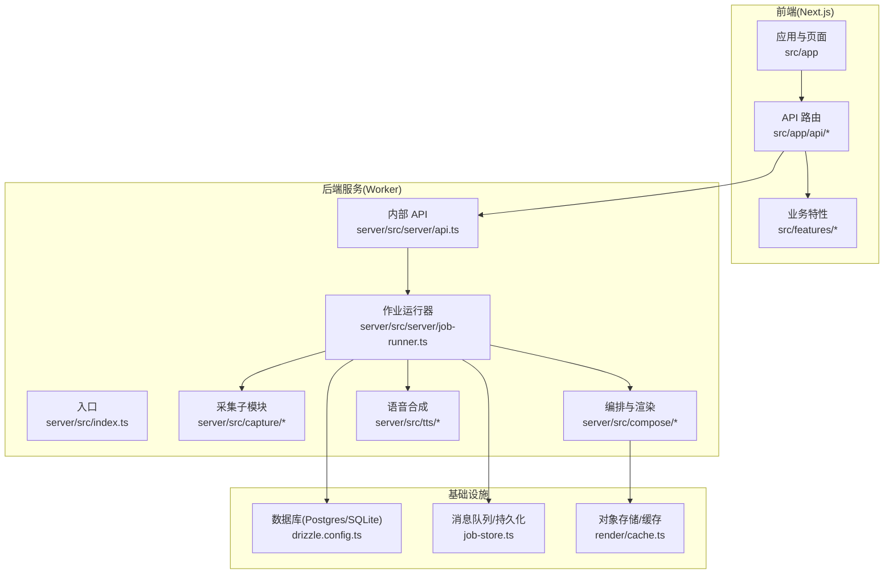
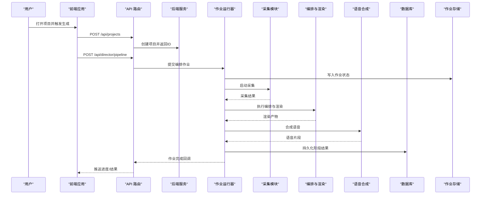
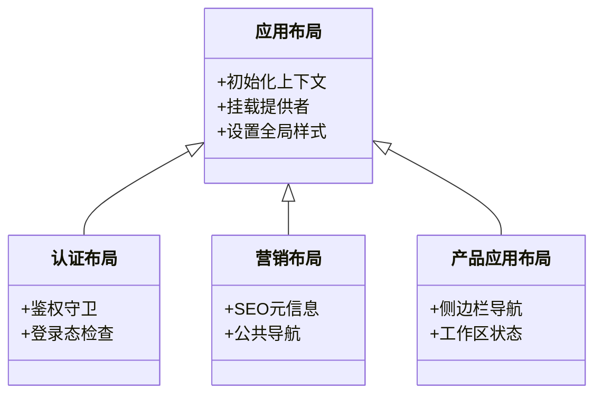
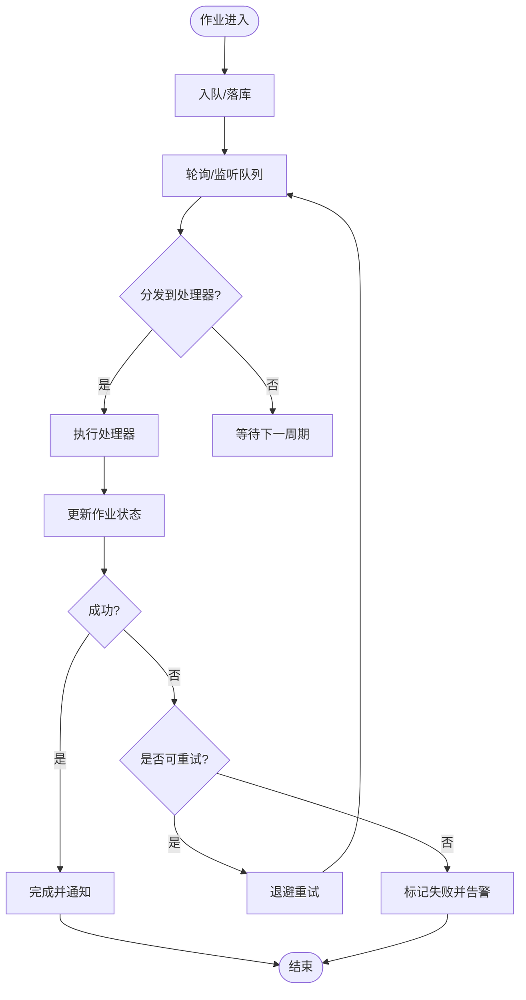
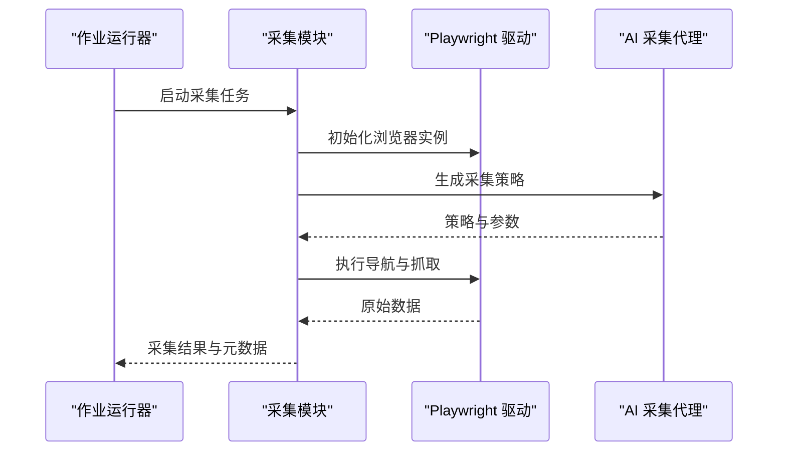
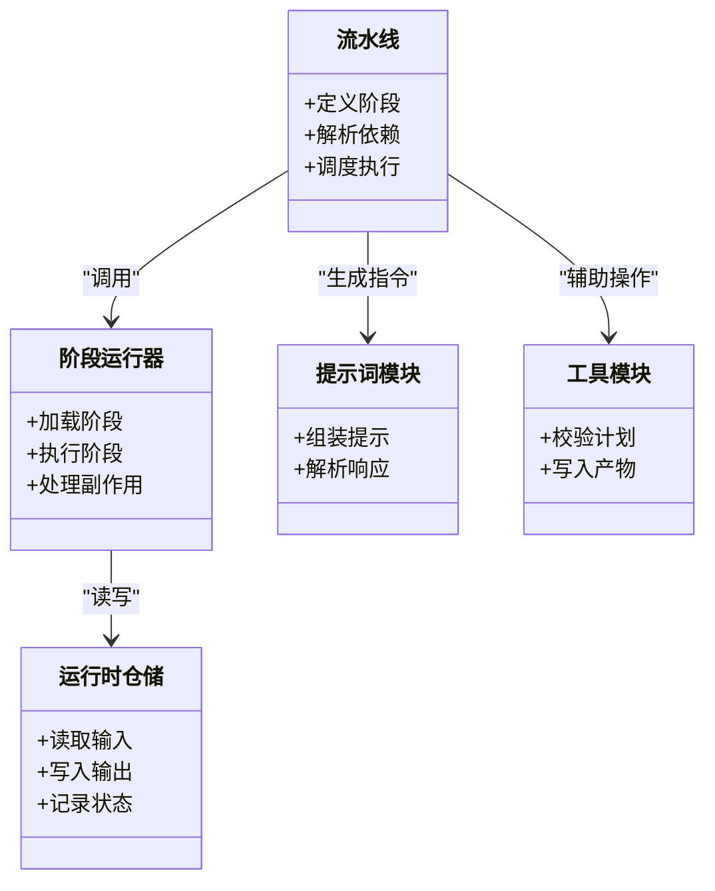
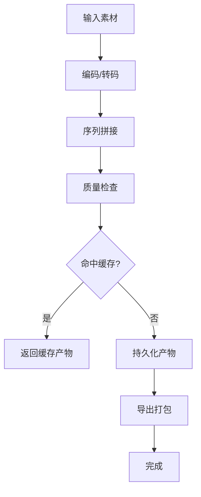
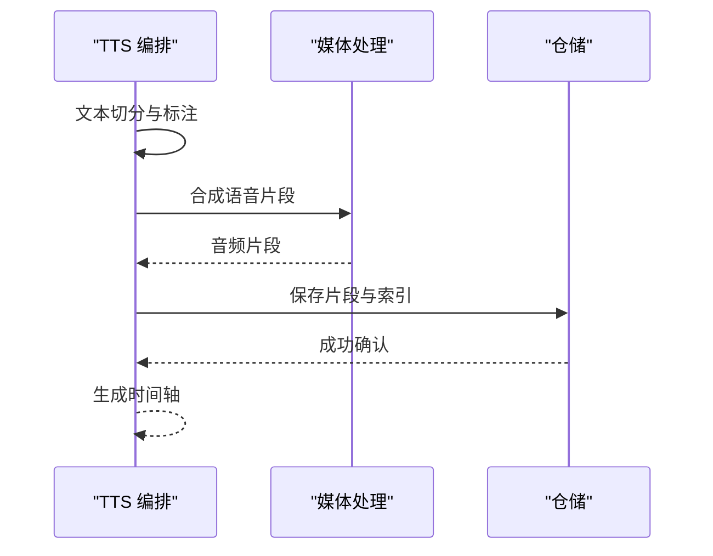
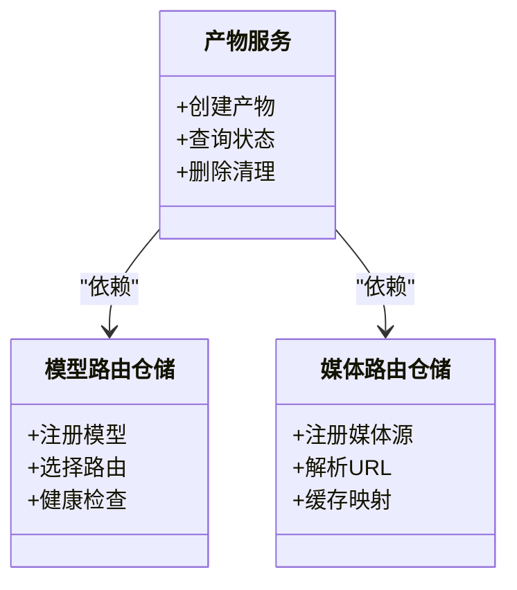
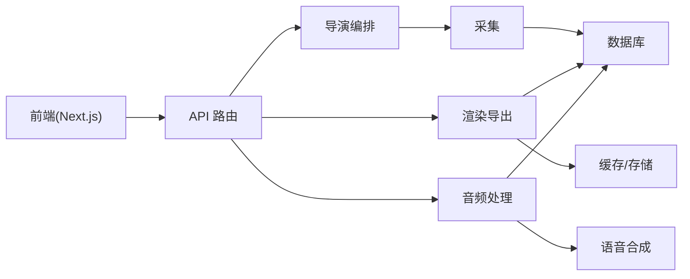

# 架构设计

<cite>
**本文引用的文件**   
- [package.json](file://package.json)
- [next.config.ts](file://next.config.ts)
- [tsconfig.json](file://tsconfig.json)
- [docker-compose.dev.yml](file://docker-compose.dev.yml)
- [Dockerfile.web](file://Dockerfile.web)
- [Dockerfile.worker](file://Dockerfile.worker)
- [deploy/compose.yaml](file://deploy/compose.yaml)
- [deploy/env.example](file://deploy/env.example)
- [deploy/worker.env.example](file://deploy/worker.env.example)
- [server/package.json](file://server/package.json)
- [server/tsconfig.json](file://server/tsconfig.json)
- [server/src/index.ts](file://server/src/index.ts)
- [server/src/server/api.ts](file://server/src/server/api.ts)
- [server/src/server/job-runner.ts](file://server/src/server/job-runner.ts)
- [server/src/server/job-store.ts](file://server/src/server/job-store.ts)
- [server/src/capture/run-capture.ts](file://server/src/capture/run-capture.ts)
- [server/src/capture/playwright-driver.ts](file://server/src/capture/playwright-driver.ts)
- [server/src/capture/ai-capture-agent.ts](file://server/src/capture/ai-capture-agent.ts)
- [server/src/compose/run-pipeline.ts](file://server/src/compose/run-pipeline.ts)
- [server/src/compose/render.ts](file://server/src/compose/render.ts)
- [server/src/tts/orchestrate.ts](file://server/src/tts/orchestrate.ts)
- [server/src/lib/logger.ts](file://server/src/lib/logger.ts)
- [src/app/layout.tsx](file://src/app/layout.tsx)
- [src/app/providers.tsx](file://src/app/providers.tsx)
- [src/app/(auth)/layout.tsx](file://src/app/(auth)/layout.tsx)
- [src/app/(marketing)/layout.tsx](file://src/app/(marketing)/layout.tsx)
- [src/app/products/(app)/layout.tsx](file://src/app/products/(app)/layout.tsx)
- [src/app/api/projects/route.ts](file://src/app/api/projects/route.ts)
- [src/app/api/render/route.ts](file://src/app/api/render/route.ts)
- [src/app/api/director/pipeline/route.ts](file://src/app/api/director/pipeline/route.ts)
- [src/app/api/artifacts/[id]/route.ts](file://src/app/api/artifacts/[id]/route.ts)
- [src/features/director/index.ts](file://src/features/director/index.ts)
- [src/features/director/pipeline.ts](file://src/features/director/pipeline.ts)
- [src/features/director/stage-runner.ts](file://src/features/director/stage-runner.ts)
- [src/features/director/runtime-repository.ts](file://src/features/director/runtime-repository.ts)
- [src/features/render/renderer.ts](file://src/features/render/renderer.ts)
- [src/features/render/export-service.ts](file://src/features/render/export-service.ts)
- [src/features/render/cache.ts](file://src/features/render/cache.ts)
- [src/features/audio/narration.ts](file://src/features/audio/narration.ts)
- [src/features/audio/repository.ts](file://src/features/audio/repository.ts)
- [src/features/artifacts/service.ts](file://src/features/artifacts/service.ts)
- [src/features/routing/model-route-repository.ts](file://src/features/routing/model-route-repository.ts)
- [src/features/routing/media-route-repository.ts](file://src/features/routing/media-route-repository.ts)
- [drizzle.config.ts](file://drizzle.config.ts)
- [scripts/setup/db-migrate.ts](file://scripts/setup/db-migrate.ts)
</cite>

## 目录
1. [简介](#简介)
2. [项目结构](#项目结构)
3. [核心组件](#核心组件)
4. [架构总览](#架构总览)
5. [详细组件分析](#详细组件分析)
6. [依赖关系分析](#依赖关系分析)
7. [性能考虑](#性能考虑)
8. [故障排查指南](#故障排查指南)
9. [结论](#结论)
10. [附录](#附录)

## 简介
PurpleInk 是一个面向“导演式”内容生产的平台，支持从采集、编排、渲染到导出的端到端流水线。系统采用前后端分离与微服务化思路：前端基于 Next.js 提供 Web 应用与 API 路由；后端服务（Worker）负责重任务执行（浏览器采集、AI 编排、渲染导出、TTS 合成等），通过队列与持久化存储解耦。整体强调可扩展性、可观测性与安全性，并通过策略模式与事件驱动实现灵活扩展。

## 项目结构
仓库采用多包与分层组织：
- 前端应用与 API 路由位于 src/app，按功能域划分 features（director、render、audio、artifacts、routing 等）。
- 服务端 Worker 位于 server/src，包含采集、编排、渲染、TTS、作业调度与存储等模块。
- 部署与基础设施配置集中在 deploy 与 docker-compose.*，以及 Dockerfile.web、Dockerfile.worker。
- 数据库迁移与脚本在 scripts 下，使用 Drizzle 管理 schema。

图表来源
- [src/app/layout.tsx:1-200](file://src/app/layout.tsx#L1-L200)
- [src/app/api/projects/route.ts:1-200](file://src/app/api/projects/route.ts#L1-L200)
- [server/src/index.ts:1-200](file://server/src/index.ts#L1-L200)
- [server/src/server/api.ts:1-200](file://server/src/server/api.ts#L1-L200)
- [server/src/server/job-runner.ts:1-200](file://server/src/server/job-runner.ts#L1-L200)
- [server/src/capture/run-capture.ts:1-200](file://server/src/capture/run-capture.ts#L1-L200)
- [server/src/compose/run-pipeline.ts:1-200](file://server/src/compose/run-pipeline.ts#L1-L200)
- [server/src/tts/orchestrate.ts:1-200](file://server/src/tts/orchestrate.ts#L1-L200)
- [drizzle.config.ts:1-200](file://drizzle.config.ts#L1-L200)

章节来源
- [package.json:1-200](file://package.json#L1-L200)
- [next.config.ts:1-200](file://next.config.ts#L1-L200)
- [tsconfig.json:1-200](file://tsconfig.json#L1-L200)
- [docker-compose.dev.yml:1-200](file://docker-compose.dev.yml#L1-L200)
- [deploy/compose.yaml:1-200](file://deploy/compose.yaml#L1-L200)

## 核心组件
- 前端应用层：Next.js App Router 组织页面与布局，API 路由作为统一入口，调用后端服务或本地特性逻辑。
- 特性域（features）：按领域拆分 director（导演编排）、render（渲染与导出）、audio（音频与字幕）、artifacts（产物管理）、routing（模型与媒体路由）等。
- 后端 Worker：独立进程承载耗时任务，包括浏览器采集、AI 编排、渲染导出、TTS 合成，通过 job-runner 统一调度。
- 数据与存储：Drizzle ORM 管理数据库，job-store 持久化作业状态，render/cache 管理中间产物与缓存。
- 基础设施：容器化部署（Dockerfile.web、Dockerfile.worker），Compose 编排开发环境，环境变量集中管理。

章节来源
- [src/app/providers.tsx:1-200](file://src/app/providers.tsx#L1-L200)
- [src/app/(auth)/layout.tsx:1-200](file://src/app/(auth)/layout.tsx#L1-L200)
- [src/app/(marketing)/layout.tsx:1-200](file://src/app/(marketing)/layout.tsx#L1-L200)
- [src/app/products/(app)/layout.tsx:1-200](file://src/app/products/(app)/layout.tsx#L1-L200)
- [src/features/director/index.ts:1-200](file://src/features/director/index.ts#L1-L200)
- [src/features/render/renderer.ts:1-200](file://src/features/render/renderer.ts#L1-L200)
- [src/features/audio/narration.ts:1-200](file://src/features/audio/narration.ts#L1-L200)
- [src/features/artifacts/service.ts:1-200](file://src/features/artifacts/service.ts#L1-L200)
- [server/src/server/job-runner.ts:1-200](file://server/src/server/job-runner.ts#L1-L200)
- [server/src/server/job-store.ts:1-200](file://server/src/server/job-store.ts#L1-L200)

## 架构总览
PurpleInk 的架构遵循“前端轻量 + 后端重任务”的分离模式：
- 前端负责交互、状态管理与请求编排，通过 API 路由将请求转发至后端服务。
- 后端服务以微服务形态运行，每个职责清晰（采集、编排、渲染、TTS），通过作业队列与持久化存储协作。
- 关键流程如“创建项目 → 导演编排 → 渲染导出 → 产物归档”通过事件与状态机推进，确保可追踪与可恢复。

图表来源
- [src/app/api/projects/route.ts:1-200](file://src/app/api/projects/route.ts#L1-L200)
- [src/app/api/director/pipeline/route.ts:1-200](file://src/app/api/director/pipeline/route.ts#L1-L200)
- [server/src/server/job-runner.ts:1-200](file://server/src/server/job-runner.ts#L1-L200)
- [server/src/capture/run-capture.ts:1-200](file://server/src/capture/run-capture.ts#L1-L200)
- [server/src/compose/run-pipeline.ts:1-200](file://server/src/compose/run-pipeline.ts#L1-L200)
- [server/src/tts/orchestrate.ts:1-200](file://server/src/tts/orchestrate.ts#L1-L200)
- [server/src/server/job-store.ts:1-200](file://server/src/server/job-store.ts#L1-L200)

## 详细组件分析

### 前端应用与路由
- 应用布局与提供者：通过 layout.tsx 与 providers.tsx 组织全局上下文、主题与认证状态。
- 路由分组：(auth)、(marketing)、(public)、products/(app) 等体现不同业务域与访问控制。
- API 路由：projects、render、director、artifacts 等接口封装对后端的调用与错误处理。

图表来源
- [src/app/layout.tsx:1-200](file://src/app/layout.tsx#L1-L200)
- [src/app/(auth)/layout.tsx:1-200](file://src/app/(auth)/layout.tsx#L1-L200)
- [src/app/(marketing)/layout.tsx:1-200](file://src/app/(marketing)/layout.tsx#L1-L200)
- [src/app/products/(app)/layout.tsx:1-200](file://src/app/products/(app)/layout.tsx#L1-L200)

章节来源
- [src/app/layout.tsx:1-200](file://src/app/layout.tsx#L1-L200)
- [src/app/providers.tsx:1-200](file://src/app/providers.tsx#L1-L200)
- [src/app/(auth)/layout.tsx:1-200](file://src/app/(auth)/layout.tsx#L1-L200)
- [src/app/(marketing)/layout.tsx:1-200](file://src/app/(marketing)/layout.tsx#L1-L200)
- [src/app/products/(app)/layout.tsx:1-200](file://src/app/products/(app)/layout.tsx#L1-L200)

### 后端服务与作业调度
- 入口与 API：index.ts 启动服务，api.ts 暴露内部接口供前端或其他服务调用。
- 作业运行器：job-runner.ts 负责拉取作业、分派到对应处理器、更新状态与重试。
- 作业存储：job-store.ts 提供作业的持久化与查询能力，保证失败恢复。

图表来源
- [server/src/server/job-runner.ts:1-200](file://server/src/server/job-runner.ts#L1-L200)
- [server/src/server/job-store.ts:1-200](file://server/src/server/job-store.ts#L1-L200)

章节来源
- [server/src/index.ts:1-200](file://server/src/index.ts#L1-L200)
- [server/src/server/api.ts:1-200](file://server/src/server/api.ts#L1-L200)
- [server/src/server/job-runner.ts:1-200](file://server/src/server/job-runner.ts#L1-L200)
- [server/src/server/job-store.ts:1-200](file://server/src/server/job-store.ts#L1-L200)

### 采集子系统（浏览器与 AI Agent）
- 采集驱动：playwright-driver.ts 提供浏览器自动化能力，run-capture.ts 协调采集流程。
- AI 采集代理：ai-capture-agent.ts 根据目标与策略生成采集指令，提升灵活性。

图表来源
- [server/src/capture/run-capture.ts:1-200](file://server/src/capture/run-capture.ts#L1-L200)
- [server/src/capture/playwright-driver.ts:1-200](file://server/src/capture/playwright-driver.ts#L1-L200)
- [server/src/capture/ai-capture-agent.ts:1-200](file://server/src/capture/ai-capture-agent.ts#L1-L200)

章节来源
- [server/src/capture/run-capture.ts:1-200](file://server/src/capture/run-capture.ts#L1-L200)
- [server/src/capture/playwright-driver.ts:1-200](file://server/src/capture/playwright-driver.ts#L1-L200)
- [server/src/capture/ai-capture-agent.ts:1-200](file://server/src/capture/ai-capture-agent.ts#L1-L200)

### 导演编排与流水线（Director Pipeline）
- 流水线编排：pipeline.ts 定义阶段与依赖关系，stage-runner.ts 执行具体阶段。
- 运行时仓储：runtime-repository.ts 维护阶段输入输出与状态，advance.ts 推进状态机。
- 提示词与工具：prompts 与 tools 目录提供结构化 LLM 交互与工具调用。

图表来源
- [src/features/director/pipeline.ts:1-200](file://src/features/director/pipeline.ts#L1-L200)
- [src/features/director/stage-runner.ts:1-200](file://src/features/director/stage-runner.ts#L1-L200)
- [src/features/director/runtime-repository.ts:1-200](file://src/features/director/runtime-repository.ts#L1-L200)
- [src/features/director/index.ts:1-200](file://src/features/director/index.ts#L1-L200)

章节来源
- [src/features/director/pipeline.ts:1-200](file://src/features/director/pipeline.ts#L1-L200)
- [src/features/director/stage-runner.ts:1-200](file://src/features/director/stage-runner.ts#L1-L200)
- [src/features/director/runtime-repository.ts:1-200](file://src/features/director/runtime-repository.ts#L1-L200)
- [src/features/director/index.ts:1-200](file://src/features/director/index.ts#L1-L200)

### 渲染与导出（Render & Export）
- 渲染器：renderer.ts 负责帧捕获、编码与拼接。
- 导出服务：export-service.ts 管理导出任务、并发与缓存。
- 缓存与 QA：cache.ts 与 qa-check.ts 保障一致性质量与性能。

图表来源
- [src/features/render/renderer.ts:1-200](file://src/features/render/renderer.ts#L1-L200)
- [src/features/render/export-service.ts:1-200](file://src/features/render/export-service.ts#L1-L200)
- [src/features/render/cache.ts:1-200](file://src/features/render/cache.ts#L1-L200)

章节来源
- [src/features/render/renderer.ts:1-200](file://src/features/render/renderer.ts#L1-L200)
- [src/features/render/export-service.ts:1-200](file://src/features/render/export-service.ts#L1-L200)
- [src/features/render/cache.ts:1-200](file://src/features/render/cache.ts#L1-L200)

### 语音合成（TTS）
- 编排：orchestrate.ts 协调文本分段、语音合成与时间轴对齐。
- 媒体与存储：media.ts 与 repository.ts 管理音频片段与元数据。

图表来源
- [server/src/tts/orchestrate.ts:1-200](file://server/src/tts/orchestrate.ts#L1-L200)
- [src/features/audio/narration.ts:1-200](file://src/features/audio/narration.ts#L1-L200)
- [src/features/audio/repository.ts:1-200](file://src/features/audio/repository.ts#L1-L200)

章节来源
- [server/src/tts/orchestrate.ts:1-200](file://server/src/tts/orchestrate.ts#L1-L200)
- [src/features/audio/narration.ts:1-200](file://src/features/audio/narration.ts#L1-L200)
- [src/features/audio/repository.ts:1-200](file://src/features/audio/repository.ts#L1-L200)

### 产物与路由（Artifacts & Routing）
- 产物服务：service.ts 管理产物生命周期与版本。
- 模型与媒体路由：model-route-repository.ts 与 media-route-repository.ts 抽象外部服务与资源路径。

图表来源
- [src/features/artifacts/service.ts:1-200](file://src/features/artifacts/service.ts#L1-L200)
- [src/features/routing/model-route-repository.ts:1-200](file://src/features/routing/model-route-repository.ts#L1-L200)
- [src/features/routing/media-route-repository.ts:1-200](file://src/features/routing/media-route-repository.ts#L1-L200)

章节来源
- [src/features/artifacts/service.ts:1-200](file://src/features/artifacts/service.ts#L1-L200)
- [src/features/routing/model-route-repository.ts:1-200](file://src/features/routing/model-route-repository.ts#L1-L200)
- [src/features/routing/media-route-repository.ts:1-200](file://src/features/routing/media-route-repository.ts#L1-L200)

## 依赖关系分析
- 前端依赖 Next.js 生态与 TypeScript，API 路由与特性模块解耦清晰。
- 后端依赖 Playwright、LLM 客户端、数据库与对象存储，通过 job-runner 统一调度。
- 数据存储通过 Drizzle 管理，迁移脚本与配置集中。

图表来源
- [src/app/api/projects/route.ts:1-200](file://src/app/api/projects/route.ts#L1-L200)
- [src/app/api/render/route.ts:1-200](file://src/app/api/render/route.ts#L1-L200)
- [src/app/api/director/pipeline/route.ts:1-200](file://src/app/api/director/pipeline/route.ts#L1-L200)
- [server/src/server/job-runner.ts:1-200](file://server/src/server/job-runner.ts#L1-L200)
- [drizzle.config.ts:1-200](file://drizzle.config.ts#L1-L200)

章节来源
- [package.json:1-200](file://package.json#L1-L200)
- [next.config.ts:1-200](file://next.config.ts#L1-L200)
- [server/package.json:1-200](file://server/package.json#L1-L200)
- [server/tsconfig.json:1-200](file://server/tsconfig.json#L1-L200)
- [drizzle.config.ts:1-200](file://drizzle.config.ts#L1-L200)

## 性能考虑
- 异步与并发：作业运行器与导出服务支持并发控制与限流，避免资源争用。
- 缓存策略：渲染与产物缓存减少重复计算，提高响应速度。
- 流式处理：采集与渲染过程尽量流式传输，降低内存峰值。
- 数据库优化：合理索引与分页查询，避免全表扫描。
- 资源隔离：Worker 与前端分离，避免阻塞 UI 线程。

[本节为通用指导，不直接分析具体文件]

## 故障排查指南
- 日志与可观测性：server/src/lib/logger.ts 提供统一日志，便于定位问题。
- 作业状态：job-store.ts 与 job-runner.ts 的状态变更可用于回溯失败原因。
- 常见错误：网络超时、浏览器实例异常、LLM 调用失败、编码错误等，建议在 API 层增加重试与降级。
- 调试建议：启用详细日志、检查环境变量、验证数据库连接与存储权限。

章节来源
- [server/src/lib/logger.ts:1-200](file://server/src/lib/logger.ts#L1-L200)
- [server/src/server/job-runner.ts:1-200](file://server/src/server/job-runner.ts#L1-L200)
- [server/src/server/job-store.ts:1-200](file://server/src/server/job-store.ts#L1-L200)

## 结论
PurpleInk 通过前后端分离与微服务化实现了高内聚、低耦合的架构。导演式编排与事件驱动确保了复杂流水线的可控与可观测。未来可在模型路由与媒体路由上进一步抽象，增强多供应商支持与弹性伸缩。

[本节为总结，不直接分析具体文件]

## 附录
- 基础设施要求：Node.js 运行时、Postgres/SQLite、对象存储（可选）、Playwright 依赖。
- 部署拓扑：Web 服务（Next.js）+ Worker 服务（Node.js），通过 Compose 编排，环境变量集中管理。
- 安全设计原则：最小权限、密钥管理、输入校验、输出清洗、审计日志。

章节来源
- [deploy/compose.yaml:1-200](file://deploy/compose.yaml#L1-L200)
- [deploy/env.example:1-200](file://deploy/env.example#L1-L200)
- [deploy/worker.env.example:1-200](file://deploy/worker.env.example#L1-L200)
- [Dockerfile.web:1-200](file://Dockerfile.web#L1-L200)
- [Dockerfile.worker:1-200](file://Dockerfile.worker#L1-L200)
- [scripts/setup/db-migrate.ts:1-200](file://scripts/setup/db-migrate.ts#L1-L200)