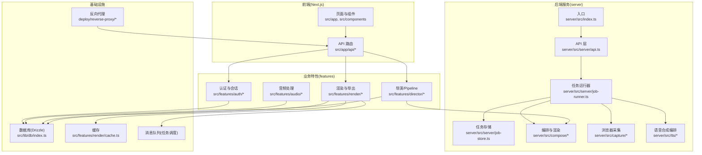
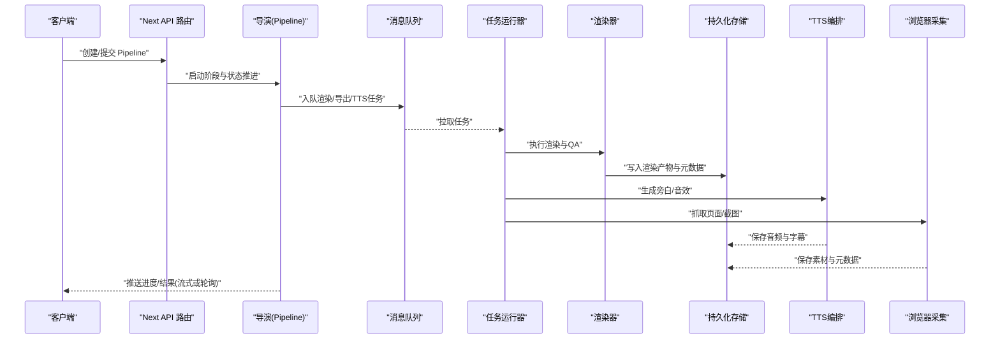
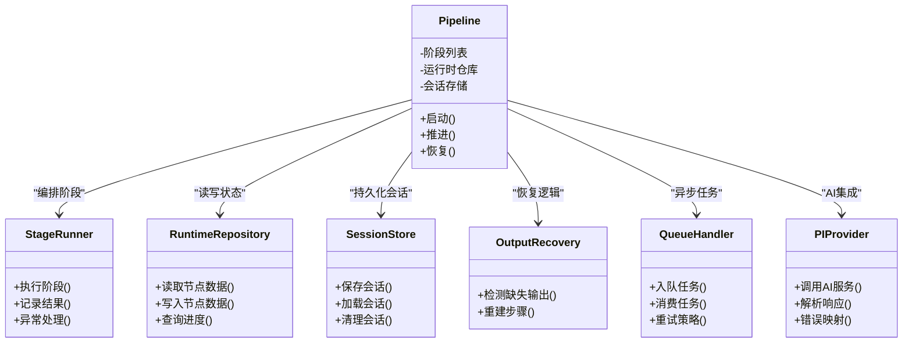
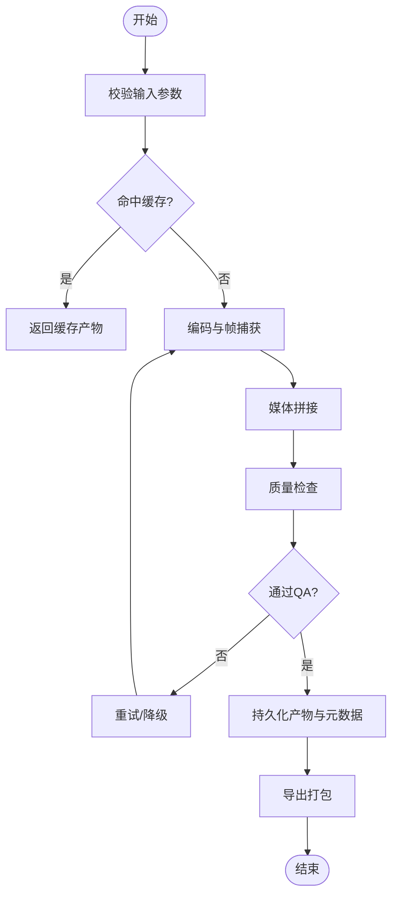
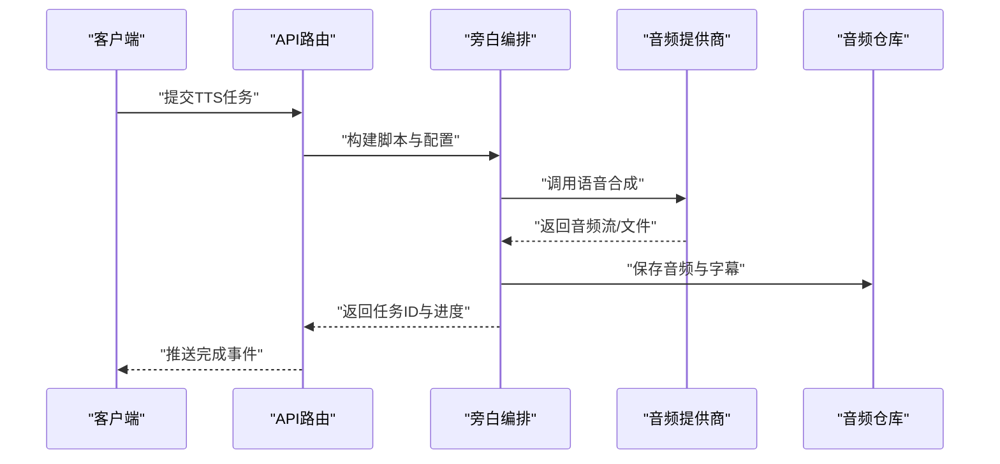
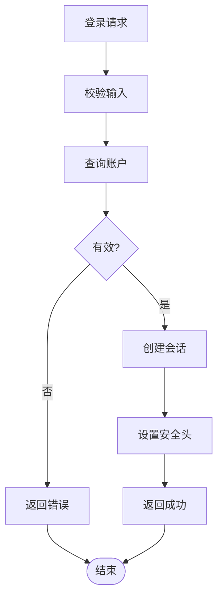
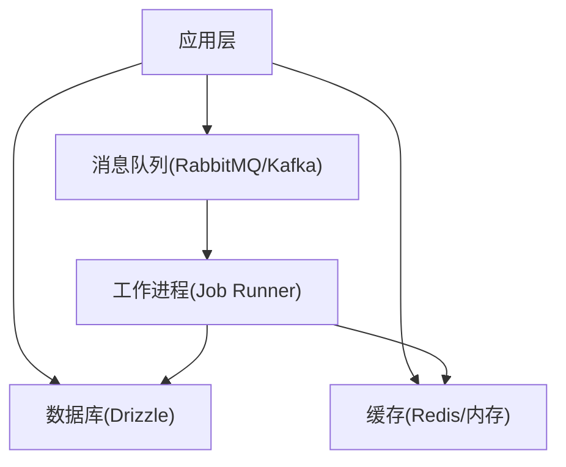
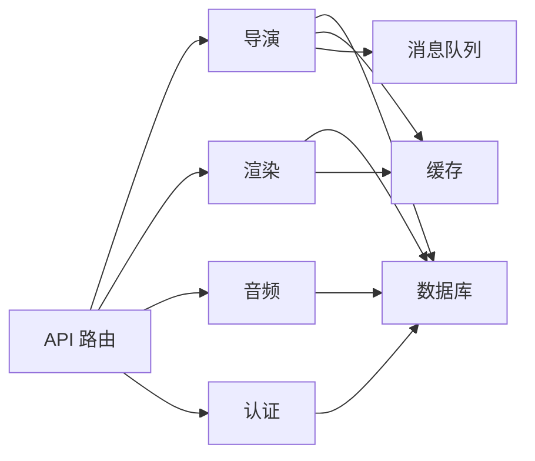

# 架构设计

<cite>
**本文引用的文件**   
- [server/src/index.ts](file://server/src/index.ts)
- [server/src/server/api.ts](file://server/src/server/api.ts)
- [server/src/server/job-runner.ts](file://server/src/server/job-runner.ts)
- [server/src/server/job-store.ts](file://server/src/server/job-store.ts)
- [server/src/compose/run-pipeline.ts](file://server/src/compose/run-pipeline.ts)
- [server/src/compose/render.ts](file://server/src/compose/render.ts)
- [server/src/tts/orchestrate.ts](file://server/src/tts/orchestrate.ts)
- [server/src/capture/run-capture.ts](file://server/src/capture/run-capture.ts)
- [src/app/api/director/pipeline/route.ts](file://src/app/api/director/pipeline/route.ts)
- [src/app/api/director/stage/route.ts](file://src/app/api/director/stage/route.ts)
- [src/app/api/director/stream/[nodeId]/route.ts](file://src/app/api/director/stream/[nodeId]/route.ts)
- [src/app/api/projects/route.ts](file://src/app/api/projects/route.ts)
- [src/app/api/artifacts/[id]/route.ts](file://src/app/api/artifacts/[id]/route.ts)
- [src/app/api/render/route.ts](file://src/app/api/render/route.ts)
- [src/app/api/render/export/route.ts](file://src/app/api/render/export/route.ts)
- [src/features/director/pipeline.ts](file://src/features/director/pipeline.ts)
- [src/features/director/advance.ts](file://src/features/director/advance.ts)
- [src/features/director/runtime-repository.ts](file://src/features/director/runtime-repository.ts)
- [src/features/director/session-store.ts](file://src/features/director/session-store.ts)
- [src/features/director/queue-handler.ts](file://src/features/director/queue-handler.ts)
- [src/features/director/pi-provider.ts](file://src/features/director/pi-provider.ts)
- [src/features/director/stage-runner.ts](file://src/features/director/stage-runner.ts)
- [src/features/director/stage-result.ts](file://src/features/director/stage-result.ts)
- [src/features/director/output-recovery.ts](file://src/features/director/output-recovery.ts)
- [src/features/render/renderer.ts](file://src/features/render/renderer.ts)
- [src/features/render/repository.ts](file://src/features/render/repository.ts)
- [src/features/render/export-service.ts](file://src/features/render/export-service.ts)
- [src/features/render/cache.ts](file://src/features/render/cache.ts)
- [src/features/audio/narration.ts](file://src/features/audio/narration.ts)
- [src/features/audio/repository.ts](file://src/features/audio/repository.ts)
- [src/features/audio/media-provider.ts](file://src/features/audio/media-provider.ts)
- [src/features/auth/account-service.ts](file://src/features/auth/account-service.ts)
- [src/features/auth/session.ts](file://src/features/auth/session.ts)
- [src/features/auth/http.ts](file://src/features/auth/http.ts)
- [src/lib/db/index.ts](file://src/lib/db/index.ts)
- [drizzle.config.ts](file://drizzle.config.ts)
- [Dockerfile](file://Dockerfile)
- [docker-compose.dev.yml](file://docker-compose.dev.yml)
- [docker-compose.prod.yml](file://docker-compose.prod.yml)
- [deploy/reverse-proxy/Dockerfile](file://deploy/reverse-proxy/Dockerfile)
- [deploy/reverse-proxy/entrypoint.sh](file://deploy/reverse-proxy/entrypoint.sh)
- [next.config.ts](file://next.config.ts)
- [package.json](file://package.json)
</cite>

## 目录
1. [简介](#简介)
2. [项目结构](#项目结构)
3. [核心组件](#核心组件)
4. [架构总览](#架构总览)
5. [详细组件分析](#详细组件分析)
6. [依赖关系分析](#依赖关系分析)
7. [性能考量](#性能考量)
8. [故障排查指南](#故障排查指南)
9. [结论](#结论)
10. [附录](#附录)

## 简介
本文件为 PurpleInk 平台的架构设计文档，面向开发者与运维人员，系统阐述前后端分离、微服务化考虑、容器化部署策略，以及关键架构模式（Provider、Repository、Pipeline）在系统中的落地方式。文档涵盖 API 路由设计、状态管理、实时通信机制、数据库与缓存策略、消息队列使用等基础设施要点，并辅以架构图与交互图帮助理解整体设计与数据流向。

## 项目结构
PurpleInk 采用 Next.js 全栈应用组织方式：
- 前端页面与组件位于 src/app 与 src/components，API 路由位于 src/app/api。
- 业务特性模块集中在 src/features，按领域划分（如 director、render、audio、auth 等）。
- 服务端独立进程 server/src 提供媒体采集、TTS编排、渲染执行等能力，并通过 job runner 与持久化存储协作。
- 部署相关配置包括 Dockerfile、docker-compose.*.yml、反向代理配置等。

**图表来源** 
- [server/src/index.ts:1-200](file://server/src/index.ts#L1-L200)
- [server/src/server/api.ts:1-200](file://server/src/server/api.ts#L1-L200)
- [server/src/server/job-runner.ts:1-200](file://server/src/server/job-runner.ts#L1-L200)
- [server/src/server/job-store.ts:1-200](file://server/src/server/job-store.ts#L1-L200)
- [server/src/compose/run-pipeline.ts:1-200](file://server/src/compose/run-pipeline.ts#L1-L200)
- [server/src/capture/run-capture.ts:1-200](file://server/src/capture/run-capture.ts#L1-L200)
- [server/src/tts/orchestrate.ts:1-200](file://server/src/tts/orchestrate.ts#L1-L200)
- [src/app/api/director/pipeline/route.ts:1-200](file://src/app/api/director/pipeline/route.ts#L1-L200)
- [src/app/api/render/route.ts:1-200](file://src/app/api/render/route.ts#L1-L200)
- [src/features/director/pipeline.ts:1-200](file://src/features/director/pipeline.ts#L1-L200)
- [src/features/render/renderer.ts:1-200](file://src/features/render/renderer.ts#L1-L200)
- [src/features/render/cache.ts:1-200](file://src/features/render/cache.ts#L1-L200)
- [src/lib/db/index.ts:1-200](file://src/lib/db/index.ts#L1-L200)
- [drizzle.config.ts:1-200](file://drizzle.config.ts#L1-L200)
- [Dockerfile:1-200](file://Dockerfile#L1-L200)
- [docker-compose.dev.yml:1-200](file://docker-compose.dev.yml#L1-L200)
- [docker-compose.prod.yml:1-200](file://docker-compose.prod.yml#L1-L200)
- [deploy/reverse-proxy/Dockerfile:1-200](file://deploy/reverse-proxy/Dockerfile#L1-L200)
- [deploy/reverse-proxy/entrypoint.sh:1-200](file://deploy/reverse-proxy/entrypoint.sh#L1-L200)

**章节来源**
- [server/src/index.ts:1-200](file://server/src/index.ts#L1-L200)
- [server/src/server/api.ts:1-200](file://server/src/server/api.ts#L1-L200)
- [server/src/server/job-runner.ts:1-200](file://server/src/server/job-runner.ts#L1-L200)
- [server/src/server/job-store.ts:1-200](file://server/src/server/job-store.ts#L1-L200)
- [server/src/compose/run-pipeline.ts:1-200](file://server/src/compose/run-pipeline.ts#L1-L200)
- [server/src/capture/run-capture.ts:1-200](file://server/src/capture/run-capture.ts#L1-L200)
- [server/src/tts/orchestrate.ts:1-200](file://server/src/tts/orchestrate.ts#L1-L200)
- [src/app/api/director/pipeline/route.ts:1-200](file://src/app/api/director/pipeline/route.ts#L1-L200)
- [src/app/api/render/route.ts:1-200](file://src/app/api/render/route.ts#L1-L200)
- [src/features/director/pipeline.ts:1-200](file://src/features/director/pipeline.ts#L1-L200)
- [src/features/render/renderer.ts:1-200](file://src/features/render/renderer.ts#L1-L200)
- [src/features/render/cache.ts:1-200](file://src/features/render/cache.ts#L1-L200)
- [src/lib/db/index.ts:1-200](file://src/lib/db/index.ts#L1-L200)
- [drizzle.config.ts:1-200](file://drizzle.config.ts#L1-L200)
- [Dockerfile:1-200](file://Dockerfile#L1-L200)
- [docker-compose.dev.yml:1-200](file://docker-compose.dev.yml#L1-L200)
- [docker-compose.prod.yml:1-200](file://docker-compose.prod.yml#L1-L200)
- [deploy/reverse-proxy/Dockerfile:1-200](file://deploy/reverse-proxy/Dockerfile#L1-L200)
- [deploy/reverse-proxy/entrypoint.sh:1-200](file://deploy/reverse-proxy/entrypoint.sh#L1-L200)

## 核心组件
- 导演与 Pipeline（Director & Pipeline）
  - 负责将复杂创作流程分解为阶段（Stage），通过运行时仓库与会话存储协调状态推进，支持输出恢复与错误恢复。
  - 关键文件：pipeline.ts、advance.ts、runtime-repository.ts、session-store.ts、stage-runner.ts、stage-result.ts、output-recovery.ts、queue-handler.ts、pi-provider.ts。
- 渲染与导出（Render & Export）
  - 封装渲染引擎、帧序列、媒体组装、QA检查、缩略图生成与导出队列；具备缓存层与持久化仓库。
  - 关键文件：renderer.ts、repository.ts、export-service.ts、cache.ts、frame-sequence.ts、media-assembly.ts。
- 音频与TTS（Audio & TTS）
  - 音频格式处理、时长测量、字幕生成、多提供商适配（OpenAI兼容、StepFun、Mimo）；TTS编排串联文本到语音的流水线。
  - 关键文件：narration.ts、repository.ts、media-provider.ts、openai-compatible-audio-client.ts、stepfun-audio-client.ts、mimo-audio-client.ts、tts/orchestrate.ts。
- 认证与会话（Auth & Session）
  - 账户服务、会话管理、HTTP 安全头、验证码与密码重置流程。
  - 关键文件：account-service.ts、session.ts、http.ts、verification-code.ts、password.ts。
- 基础设施（DB、Cache、MQ）
  - 数据库访问通过 Drizzle ORM 配置与连接；缓存用于渲染产物与中间结果；消息队列承载异步任务（渲染、导出、TTS）。
  - 关键文件：db/index.ts、drizzle.config.ts、render/cache.ts、features/director/queue-handler.ts。

**章节来源**
- [src/features/director/pipeline.ts:1-200](file://src/features/director/pipeline.ts#L1-L200)
- [src/features/director/advance.ts:1-200](file://src/features/director/advance.ts#L1-L200)
- [src/features/director/runtime-repository.ts:1-200](file://src/features/director/runtime-repository.ts#L1-L200)
- [src/features/director/session-store.ts:1-200](file://src/features/director/session-store.ts#L1-L200)
- [src/features/director/stage-runner.ts:1-200](file://src/features/director/stage-runner.ts#L1-L200)
- [src/features/director/stage-result.ts:1-200](file://src/features/director/stage-result.ts#L1-L200)
- [src/features/director/output-recovery.ts:1-200](file://src/features/director/output-recovery.ts#L1-L200)
- [src/features/director/queue-handler.ts:1-200](file://src/features/director/queue-handler.ts#L1-L200)
- [src/features/director/pi-provider.ts:1-200](file://src/features/director/pi-provider.ts#L1-L200)
- [src/features/render/renderer.ts:1-200](file://src/features/render/renderer.ts#L1-L200)
- [src/features/render/repository.ts:1-200](file://src/features/render/repository.ts#L1-L200)
- [src/features/render/export-service.ts:1-200](file://src/features/render/export-service.ts#L1-L200)
- [src/features/render/cache.ts:1-200](file://src/features/render/cache.ts#L1-L200)
- [src/features/audio/narration.ts:1-200](file://src/features/audio/narration.ts#L1-L200)
- [src/features/audio/repository.ts:1-200](file://src/features/audio/repository.ts#L1-L200)
- [src/features/audio/media-provider.ts:1-200](file://src/features/audio/media-provider.ts#L1-L200)
- [src/features/auth/account-service.ts:1-200](file://src/features/auth/account-service.ts#L1-L200)
- [src/features/auth/session.ts:1-200](file://src/features/auth/session.ts#L1-L200)
- [src/features/auth/http.ts:1-200](file://src/features/auth/http.ts#L1-L200)
- [src/lib/db/index.ts:1-200](file://src/lib/db/index.ts#L1-L200)
- [drizzle.config.ts:1-200](file://drizzle.config.ts#L1-L200)

## 架构总览
PurpleInk 采用前后端分离与模块化特性组织，结合 Next.js API 路由作为统一入口，内部通过“导演”驱动 Pipeline 推进，渲染与导出走异步队列，TTS 与媒体采集由独立服务支撑。反向代理对外暴露 HTTPS 与安全头，数据库通过 Drizzle 统一管理。

**图表来源** 
- [src/app/api/director/pipeline/route.ts:1-200](file://src/app/api/director/pipeline/route.ts#L1-L200)
- [src/features/director/pipeline.ts:1-200](file://src/features/director/pipeline.ts#L1-L200)
- [src/features/director/queue-handler.ts:1-200](file://src/features/director/queue-handler.ts#L1-L200)
- [server/src/server/job-runner.ts:1-200](file://server/src/server/job-runner.ts#L1-L200)
- [src/features/render/renderer.ts:1-200](file://src/features/render/renderer.ts#L1-L200)
- [server/src/tts/orchestrate.ts:1-200](file://server/src/tts/orchestrate.ts#L1-L200)
- [server/src/capture/run-capture.ts:1-200](file://server/src/capture/run-capture.ts#L1-L200)

## 详细组件分析

### 导演与 Pipeline（Director & Pipeline）
- 职责
  - 定义阶段（Stage）与执行顺序，维护运行时状态与节点数据，支持失败恢复与输出恢复。
  - 通过队列处理器协调异步任务，确保阶段推进的幂等性与一致性。
- 关键模式
  - Provider 模式：对 AI 服务（如 Gemini、StepFun、Mimo）进行抽象与路由，便于扩展与替换。
  - Repository 模式：运行时仓库与会话存储解耦数据访问，便于测试与迁移。
  - Pipeline 模式：将复杂流程拆分为可组合的阶段，提升可观测性与可恢复性。
- 数据流
  - 输入：项目/镜头规格、提示词、素材清单。
  - 处理：阶段执行、AI 调用、媒体处理、QA校验。
  - 输出：渲染产物、音频、字幕、元数据与进度事件。

**图表来源** 
- [src/features/director/pipeline.ts:1-200](file://src/features/director/pipeline.ts#L1-L200)
- [src/features/director/stage-runner.ts:1-200](file://src/features/director/stage-runner.ts#L1-L200)
- [src/features/director/runtime-repository.ts:1-200](file://src/features/director/runtime-repository.ts#L1-L200)
- [src/features/director/session-store.ts:1-200](file://src/features/director/session-store.ts#L1-L200)
- [src/features/director/output-recovery.ts:1-200](file://src/features/director/output-recovery.ts#L1-L200)
- [src/features/director/queue-handler.ts:1-200](file://src/features/director/queue-handler.ts#L1-L200)
- [src/features/director/pi-provider.ts:1-200](file://src/features/director/pi-provider.ts#L1-L200)

**章节来源**
- [src/features/director/pipeline.ts:1-200](file://src/features/director/pipeline.ts#L1-L200)
- [src/features/director/advance.ts:1-200](file://src/features/director/advance.ts#L1-L200)
- [src/features/director/runtime-repository.ts:1-200](file://src/features/director/runtime-repository.ts#L1-L200)
- [src/features/director/session-store.ts:1-200](file://src/features/director/session-store.ts#L1-L200)
- [src/features/director/stage-runner.ts:1-200](file://src/features/director/stage-runner.ts#L1-L200)
- [src/features/director/stage-result.ts:1-200](file://src/features/director/stage-result.ts#L1-L200)
- [src/features/director/output-recovery.ts:1-200](file://src/features/director/output-recovery.ts#L1-L200)
- [src/features/director/queue-handler.ts:1-200](file://src/features/director/queue-handler.ts#L1-L200)
- [src/features/director/pi-provider.ts:1-200](file://src/features/director/pi-provider.ts#L1-L200)

### 渲染与导出（Render & Export）
- 职责
  - 渲染引擎负责帧序列生成、媒体组装、QA检查与缩略图生成；导出服务将产物打包并落盘或上传。
  - 缓存层加速重复渲染与预览；仓库层持久化渲染任务与结果。
- 关键模式
  - Repository 模式：渲染仓库与导出仓库隔离数据访问，便于单元测试与迁移。
  - Pipeline 模式：渲染流程分阶段（编码、拼接、转码、QA），支持断点续传与重试。
- 数据流
  - 输入：镜头规格、模板、素材路径。
  - 处理：编码转换、帧捕获、拼接、压缩、QA。
  - 输出：视频/图片、缩略图、元数据与导出文件。

**图表来源** 
- [src/features/render/renderer.ts:1-200](file://src/features/render/renderer.ts#L1-L200)
- [src/features/render/repository.ts:1-200](file://src/features/render/repository.ts#L1-L200)
- [src/features/render/export-service.ts:1-200](file://src/features/render/export-service.ts#L1-L200)
- [src/features/render/cache.ts:1-200](file://src/features/render/cache.ts#L1-L200)

**章节来源**
- [src/features/render/renderer.ts:1-200](file://src/features/render/renderer.ts#L1-L200)
- [src/features/render/repository.ts:1-200](file://src/features/render/repository.ts#L1-L200)
- [src/features/render/export-service.ts:1-200](file://src/features/render/export-service.ts#L1-L200)
- [src/features/render/cache.ts:1-200](file://src/features/render/cache.ts#L1-L200)

### 音频与TTS（Audio & TTS）
- 职责
  - 音频模块负责格式处理、时长测量、字幕生成与多提供商适配；TTS编排串联文本到语音的流水线。
- 关键模式
  - Provider 模式：OpenAI兼容、StepFun、Mimo 等音频提供商抽象，统一接口与错误处理。
  - Repository 模式：音频仓库持久化音频片段、字幕与元数据。
- 数据流
  - 输入：文本脚本、音色配置、语言设置。
  - 处理：文本切分、语音合成、音频后处理、字幕对齐。
  - 输出：音频文件、字幕文件、时长与元数据。

**图表来源** 
- [src/features/audio/narration.ts:1-200](file://src/features/audio/narration.ts#L1-L200)
- [src/features/audio/repository.ts:1-200](file://src/features/audio/repository.ts#L1-L200)
- [src/features/audio/media-provider.ts:1-200](file://src/features/audio/media-provider.ts#L1-L200)
- [server/src/tts/orchestrate.ts:1-200](file://server/src/tts/orchestrate.ts#L1-L200)

**章节来源**
- [src/features/audio/narration.ts:1-200](file://src/features/audio/narration.ts#L1-L200)
- [src/features/audio/repository.ts:1-200](file://src/features/audio/repository.ts#L1-L200)
- [src/features/audio/media-provider.ts:1-200](file://src/features/audio/media-provider.ts#L1-L200)
- [server/src/tts/orchestrate.ts:1-200](file://server/src/tts/orchestrate.ts#L1-L200)

### 认证与会话（Auth & Session）
- 职责
  - 账户服务管理用户注册、登录、密码重置；会话管理维护鉴权上下文；HTTP 层设置安全头与防重放。
- 关键模式
  - Repository 模式：账户与验证码仓库隔离数据访问。
  - 安全策略：最小权限、令牌有效期、CSRF/XSS防护。
- 数据流
  - 输入：用户名/邮箱、密码、验证码。
  - 处理：校验、哈希、签发会话、刷新令牌。
  - 输出：会话Cookie、JWT、状态码与错误信息。

**图表来源** 
- [src/features/auth/account-service.ts:1-200](file://src/features/auth/account-service.ts#L1-L200)
- [src/features/auth/session.ts:1-200](file://src/features/auth/session.ts#L1-L200)
- [src/features/auth/http.ts:1-200](file://src/features/auth/http.ts#L1-L200)

**章节来源**
- [src/features/auth/account-service.ts:1-200](file://src/features/auth/account-service.ts#L1-L200)
- [src/features/auth/session.ts:1-200](file://src/features/auth/session.ts#L1-L200)
- [src/features/auth/http.ts:1-200](file://src/features/auth/http.ts#L1-L200)

### 基础设施（DB、Cache、MQ）
- 数据库
  - 使用 Drizzle ORM 进行类型安全的查询与迁移；表结构设计遵循规范化与索引优化原则。
- 缓存
  - 渲染产物与中间结果缓存，减少重复计算；支持过期策略与失效回源。
- 消息队列
  - 任务调度与异步处理，支持重试、死信队列与监控指标。

**图表来源** 
- [src/lib/db/index.ts:1-200](file://src/lib/db/index.ts#L1-L200)
- [drizzle.config.ts:1-200](file://drizzle.config.ts#L1-L200)
- [src/features/render/cache.ts:1-200](file://src/features/render/cache.ts#L1-L200)
- [src/features/director/queue-handler.ts:1-200](file://src/features/director/queue-handler.ts#L1-L200)
- [server/src/server/job-runner.ts:1-200](file://server/src/server/job-runner.ts#L1-L200)

**章节来源**
- [src/lib/db/index.ts:1-200](file://src/lib/db/index.ts#L1-L200)
- [drizzle.config.ts:1-200](file://drizzle.config.ts#L1-L200)
- [src/features/render/cache.ts:1-200](file://src/features/render/cache.ts#L1-L200)
- [src/features/director/queue-handler.ts:1-200](file://src/features/director/queue-handler.ts#L1-L200)
- [server/src/server/job-runner.ts:1-200](file://server/src/server/job-runner.ts#L1-L200)

## 依赖关系分析
- 耦合与内聚
  - 导演模块高内聚，依赖运行时仓库与会话存储，降低外部耦合。
  - 渲染与导出模块通过仓库与缓存解耦，便于横向扩展。
  - 音频与TTS通过 Provider 抽象屏蔽第三方差异。
- 直接/间接依赖
  - API 路由依赖业务特性模块；业务特性模块依赖基础设施（DB、Cache、MQ）。
  - 服务端进程依赖作业运行器与持久化存储。
- 循环依赖
  - 通过接口与抽象避免循环依赖；模块间通过事件与队列解耦。

**图表来源** 
- [src/app/api/director/pipeline/route.ts:1-200](file://src/app/api/director/pipeline/route.ts#L1-L200)
- [src/app/api/render/route.ts:1-200](file://src/app/api/render/route.ts#L1-L200)
- [src/features/director/pipeline.ts:1-200](file://src/features/director/pipeline.ts#L1-L200)
- [src/features/render/renderer.ts:1-200](file://src/features/render/renderer.ts#L1-L200)
- [src/features/audio/narration.ts:1-200](file://src/features/audio/narration.ts#L1-L200)
- [src/features/auth/account-service.ts:1-200](file://src/features/auth/account-service.ts#L1-L200)
- [src/lib/db/index.ts:1-200](file://src/lib/db/index.ts#L1-L200)
- [src/features/render/cache.ts:1-200](file://src/features/render/cache.ts#L1-L200)
- [src/features/director/queue-handler.ts:1-200](file://src/features/director/queue-handler.ts#L1-L200)

**章节来源**
- [src/app/api/director/pipeline/route.ts:1-200](file://src/app/api/director/pipeline/route.ts#L1-L200)
- [src/app/api/render/route.ts:1-200](file://src/app/api/render/route.ts#L1-L200)
- [src/features/director/pipeline.ts:1-200](file://src/features/director/pipeline.ts#L1-L200)
- [src/features/render/renderer.ts:1-200](file://src/features/render/renderer.ts#L1-L200)
- [src/features/audio/narration.ts:1-200](file://src/features/audio/narration.ts#L1-L200)
- [src/features/auth/account-service.ts:1-200](file://src/features/auth/account-service.ts#L1-L200)
- [src/lib/db/index.ts:1-200](file://src/lib/db/index.ts#L1-L200)
- [src/features/render/cache.ts:1-200](file://src/features/render/cache.ts#L1-L200)
- [src/features/director/queue-handler.ts:1-200](file://src/features/director/queue-handler.ts#L1-L200)

## 性能考量
- 缓存策略
  - 渲染产物与中间结果缓存，减少重复计算；合理设置 TTL 与失效策略。
- 异步与并发
  - 使用消息队列削峰填谷，限制并发度避免资源争用；实现重试与退避。
- I/O 优化
  - 数据库索引与查询优化；大文件分块传输与流式处理。
- 资源隔离
  - 渲染与TTS任务隔离执行环境，避免相互影响；GPU/CPU资源配额管理。

[本节为通用指导，不直接分析具体文件]

## 故障排查指南
- 常见问题
  - 任务失败：检查队列堆积、重试次数与死信队列；查看作业运行器日志。
  - 渲染超时：检查缓存命中率、媒体文件大小与编码参数；调整超时与并发。
  - TTS失败：验证提供商密钥与配额；检查文本长度与格式。
  - 认证问题：检查会话有效期、安全头与跨域配置。
- 诊断工具
  - 启用结构化日志与指标上报；使用链路追踪定位瓶颈。
  - 数据库慢查询分析与索引建议；缓存命中率监控。

**章节来源**
- [server/src/server/job-runner.ts:1-200](file://server/src/server/job-runner.ts#L1-L200)
- [src/features/render/cache.ts:1-200](file://src/features/render/cache.ts#L1-L200)
- [src/features/audio/narration.ts:1-200](file://src/features/audio/narration.ts#L1-L200)
- [src/features/auth/session.ts:1-200](file://src/features/auth/session.ts#L1-L200)

## 结论
PurpleInk 通过清晰的模块边界与架构模式（Provider、Repository、Pipeline）实现了可扩展、可维护且高性能的媒体创作平台。前后端分离与容器化部署提升了交付效率与稳定性；消息队列与缓存保障了吞吐与延迟；认证与会话确保了安全性。未来可进一步引入服务网格与分布式追踪，增强可观测性与弹性伸缩能力。

[本节为总结，不直接分析具体文件]

## 附录
- 部署策略
  - 容器化：每个服务独立镜像，环境变量注入配置；反向代理统一入口。
  - 编排：docker-compose 管理开发/生产环境；Kubernetes 用于生产集群。
- 配置管理
  - 敏感信息通过密钥管理；配置文件与环境变量分离。
- 监控与告警
  - 指标收集（CPU、内存、队列长度、错误率）；告警规则与通知渠道。

**章节来源**
- [Dockerfile:1-200](file://Dockerfile#L1-L200)
- [docker-compose.dev.yml:1-200](file://docker-compose.dev.yml#L1-L200)
- [docker-compose.prod.yml:1-200](file://docker-compose.prod.yml#L1-L200)
- [deploy/reverse-proxy/Dockerfile:1-200](file://deploy/reverse-proxy/Dockerfile#L1-L200)
- [deploy/reverse-proxy/entrypoint.sh:1-200](file://deploy/reverse-proxy/entrypoint.sh#L1-L200)
- [next.config.ts:1-200](file://next.config.ts#L1-L200)
- [package.json:1-200](file://package.json#L1-L200)