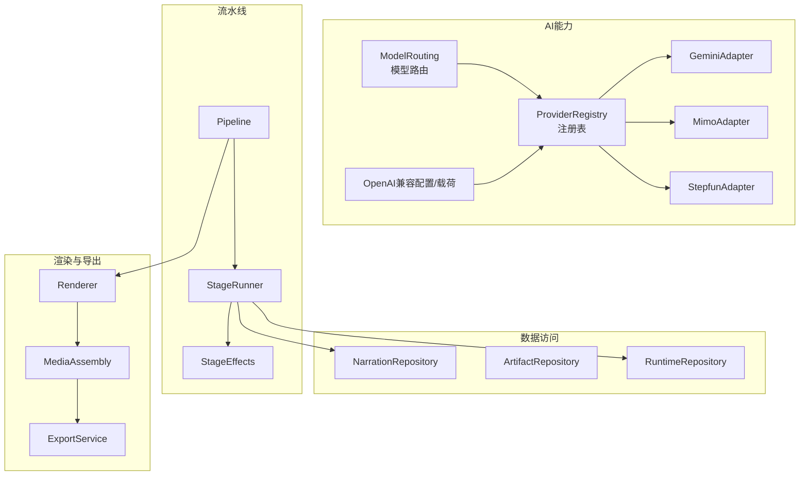
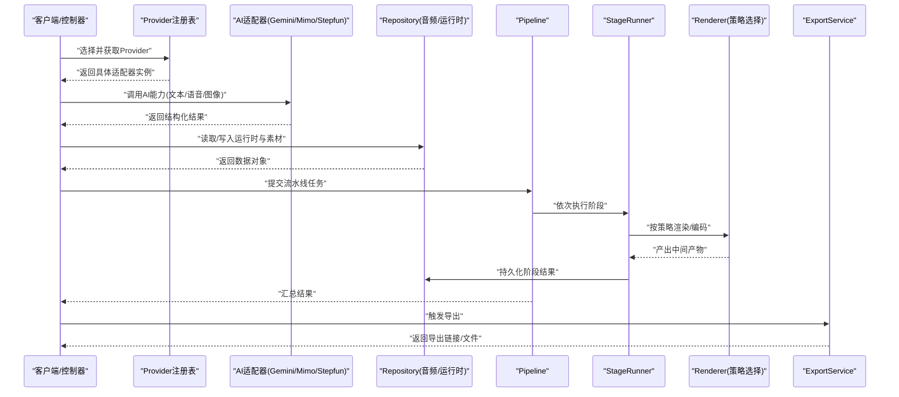
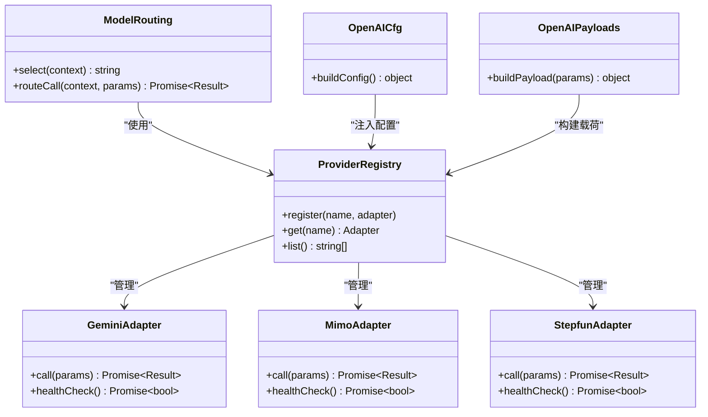
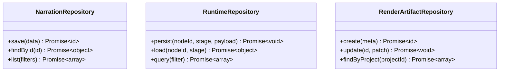
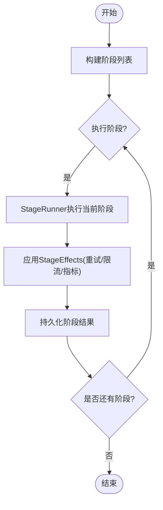
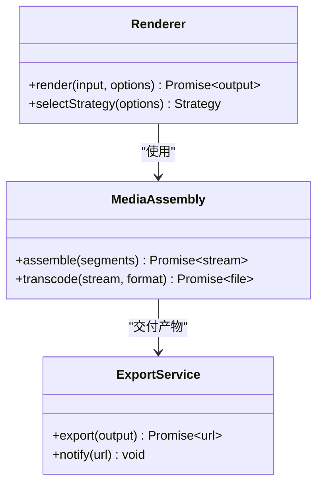
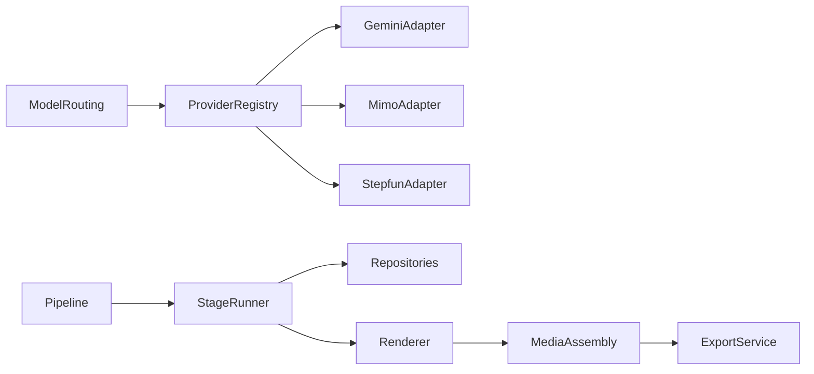

# 核心设计模式

<cite>
**本文引用的文件**   
- [provider-registry.ts](file://src/features/ai/provider-registry.ts)
- [gemini-adapter.ts](file://src/features/ai/gemini-adapter.ts)
- [mimo-adapter.ts](file://src/features/ai/mimo-adapter.ts)
- [stepfun-adapter.ts](file://src/features/ai/stepfun-adapter.ts)
- [model-routing.ts](file://src/features/ai/model-routing.ts)
- [narration-repository.ts](file://src/features/audio/narration-repository.ts)
- [repository.ts](file://src/features/audio/repository.ts)
- [runtime-repository.ts](file://src/features/director/runtime-repository.ts)
- [render-artifact-repository.ts](file://src/features/render/render-artifact-repository.ts)
- [pipeline.ts](file://src/features/director/pipeline.ts)
- [run-pipeline.ts](file://server/src/compose/run-pipeline.ts)
- [renderer.ts](file://src/features/render/renderer.ts)
- [media-assembly.ts](file://src/features/render/media-assembly.ts)
- [export-service.ts](file://src/features/render/export-service.ts)
- [stage-runner.ts](file://src/features/director/stage-runner.ts)
- [stage-effects.ts](file://src/features/director/stage-effects.ts)
- [openai-compatible-config.ts](file://src/features/ai/openai-compatible-config.ts)
- [openai-compatible-payloads.ts](file://src/features/ai/openai-compatible-payloads.ts)
</cite>

## 目录
1. [简介](#简介)
2. [项目结构](#项目结构)
3. [核心组件](#核心组件)
4. [架构总览](#架构总览)
5. [详细组件分析](#详细组件分析)
6. [依赖关系分析](#依赖关系分析)
7. [性能考量](#性能考量)
8. [故障排查指南](#故障排查指南)
9. [结论](#结论)
10. [附录](#附录)

## 简介
本文件面向PurpleInk平台的核心设计模式，聚焦以下四种关键模式及其在代码中的落地：
- Provider模式：统一AI服务集成接口（Gemini、Mimo、Stepfun等适配器），通过注册表与路由实现可插拔扩展。
- Repository模式：抽象数据访问层，屏蔽存储细节（SQLite/PostgreSQL/内存），为业务提供一致的数据读写契约。
- Pipeline模式：媒体处理流水线，将导演编排、渲染、导出等阶段串联，支持顺序执行、错误恢复与结果持久化。
- Strategy模式：渲染算法选择策略，根据输入类型、目标格式或质量偏好动态切换编码/合成策略。

文档将从架构视角解释每种模式的职责边界、协作方式与扩展点，并通过图示展示调用序列与类关系，帮助读者快速定位实现位置并安全扩展。

## 项目结构
本项目采用“功能域+分层”的组织方式：
- features/ai：Provider模式与模型路由、配置适配
- features/audio：音频领域仓储与队列处理
- features/director：导演编排、阶段运行器、流水线调度
- features/render：渲染、媒体组装、导出服务
- server/src/compose：服务端流水线编排入口

图表来源
- [provider-registry.ts:1-200](file://src/features/ai/provider-registry.ts#L1-L200)
- [gemini-adapter.ts:1-200](file://src/features/ai/gemini-adapter.ts#L1-L200)
- [mimo-adapter.ts:1-200](file://src/features/ai/mimo-adapter.ts#L1-L200)
- [stepfun-adapter.ts:1-200](file://src/features/ai/stepfun-adapter.ts#L1-L200)
- [model-routing.ts:1-200](file://src/features/ai/model-routing.ts#L1-L200)
- [openai-compatible-config.ts:1-200](file://src/features/ai/openai-compatible-config.ts#L1-L200)
- [openai-compatible-payloads.ts:1-200](file://src/features/ai/openai-compatible-payloads.ts#L1-L200)
- [narration-repository.ts:1-200](file://src/features/audio/narration-repository.ts#L1-L200)
- [repository.ts:1-200](file://src/features/audio/repository.ts#L1-L200)
- [runtime-repository.ts:1-200](file://src/features/director/runtime-repository.ts#L1-L200)
- [pipeline.ts:1-200](file://src/features/director/pipeline.ts#L1-L200)
- [stage-runner.ts:1-200](file://src/features/director/stage-runner.ts#L1-L200)
- [stage-effects.ts:1-200](file://src/features/director/stage-effects.ts#L1-L200)
- [renderer.ts:1-200](file://src/features/render/renderer.ts#L1-L200)
- [media-assembly.ts:1-200](file://src/features/render/media-assembly.ts#L1-L200)
- [export-service.ts:1-200](file://src/features/render/export-service.ts#L1-L200)

章节来源
- [provider-registry.ts:1-200](file://src/features/ai/provider-registry.ts#L1-L200)
- [pipeline.ts:1-200](file://src/features/director/pipeline.ts#L1-L200)
- [renderer.ts:1-200](file://src/features/render/renderer.ts#L1-L200)

## 核心组件
- AI Provider注册表与适配器：集中管理不同AI服务的接入，暴露统一调用接口；配合模型路由与OpenAI兼容配置，实现多供应商无缝切换。
- 数据仓库（Repository）：对音频、运行时状态、渲染产物等提供一致的CRUD与查询能力，屏蔽底层数据库差异。
- 流水线（Pipeline）：以阶段（Stage）为单位组织任务，驱动阶段运行器按序执行，支持副作用处理与结果提交。
- 渲染与导出：基于策略选择编码器/合成器，完成帧捕获、媒体拼接与最终导出。

章节来源
- [provider-registry.ts:1-200](file://src/features/ai/provider-registry.ts#L1-L200)
- [narration-repository.ts:1-200](file://src/features/audio/narration-repository.ts#L1-L200)
- [runtime-repository.ts:1-200](file://src/features/director/runtime-repository.ts#L1-L200)
- [pipeline.ts:1-200](file://src/features/director/pipeline.ts#L1-L200)
- [renderer.ts:1-200](file://src/features/render/renderer.ts#L1-L200)

## 架构总览
下图展示了Provider、Repository、Pipeline与Strategy的协作关系：上层控制器/路由通过Provider注册表获取AI能力，通过Repository访问数据，通过Pipeline编排阶段，由Renderer依据策略进行渲染与导出。

图表来源
- [provider-registry.ts:1-200](file://src/features/ai/provider-registry.ts#L1-L200)
- [gemini-adapter.ts:1-200](file://src/features/ai/gemini-adapter.ts#L1-L200)
- [mimo-adapter.ts:1-200](file://src/features/ai/mimo-adapter.ts#L1-L200)
- [stepfun-adapter.ts:1-200](file://src/features/ai/stepfun-adapter.ts#L1-L200)
- [narration-repository.ts:1-200](file://src/features/audio/narration-repository.ts#L1-L200)
- [runtime-repository.ts:1-200](file://src/features/director/runtime-repository.ts#L1-L200)
- [pipeline.ts:1-200](file://src/features/director/pipeline.ts#L1-L200)
- [stage-runner.ts:1-200](file://src/features/director/stage-runner.ts#L1-L200)
- [renderer.ts:1-200](file://src/features/render/renderer.ts#L1-L200)
- [export-service.ts:1-200](file://src/features/render/export-service.ts#L1-L200)

## 详细组件分析

### Provider模式（AI服务集成）
- 目标：统一不同AI供应商的调用协议，隐藏鉴权、请求构造与响应解析差异。
- 关键点：
  - 注册表集中管理适配器生命周期与查找逻辑。
  - 适配器实现统一的调用接口，内部封装供应商SDK/HTTP调用。
  - 模型路由根据配置或上下文选择最优Provider。
  - OpenAI兼容配置/载荷用于标准化请求体与响应结构。
- 适用场景：新增AI供应商、切换默认供应商、按租户/环境路由到不同模型。
- 扩展点：
  - 新增适配器需实现统一接口并在注册表中注册。
  - 路由规则可扩展（按区域、成本、延迟、配额）。
  - 配置项可通过OpenAI兼容字段注入。

图表来源
- [provider-registry.ts:1-200](file://src/features/ai/provider-registry.ts#L1-L200)
- [gemini-adapter.ts:1-200](file://src/features/ai/gemini-adapter.ts#L1-L200)
- [mimo-adapter.ts:1-200](file://src/features/ai/mimo-adapter.ts#L1-L200)
- [stepfun-adapter.ts:1-200](file://src/features/ai/stepfun-adapter.ts#L1-L200)
- [model-routing.ts:1-200](file://src/features/ai/model-routing.ts#L1-L200)
- [openai-compatible-config.ts:1-200](file://src/features/ai/openai-compatible-config.ts#L1-L200)
- [openai-compatible-payloads.ts:1-200](file://src/features/ai/openai-compatible-payloads.ts#L1-L200)

章节来源
- [provider-registry.ts:1-200](file://src/features/ai/provider-registry.ts#L1-L200)
- [model-routing.ts:1-200](file://src/features/ai/model-routing.ts#L1-L200)
- [openai-compatible-config.ts:1-200](file://src/features/ai/openai-compatible-config.ts#L1-L200)
- [openai-compatible-payloads.ts:1-200](file://src/features/ai/openai-compatible-payloads.ts#L1-L200)

### Repository模式（数据访问抽象）
- 目标：为音频、运行时状态、渲染产物等提供一致的读写接口，屏蔽存储实现差异。
- 关键点：
  - NarrationRepository负责旁白/字幕数据的存取。
  - RuntimeRepository负责导演运行时节点状态、阶段结果与进度。
  - RenderArtifactRepository负责渲染产物元数据与路径映射。
- 适用场景：切换数据库、增加缓存层、引入分片/归档策略。
- 扩展点：
  - 新增实体仓储需遵循统一接口契约。
  - 可在仓储层加入重试、幂等、审计日志。

图表来源
- [narration-repository.ts:1-200](file://src/features/audio/narration-repository.ts#L1-L200)
- [repository.ts:1-200](file://src/features/audio/repository.ts#L1-L200)
- [runtime-repository.ts:1-200](file://src/features/director/runtime-repository.ts#L1-L200)
- [render-artifact-repository.ts:1-200](file://src/features/render/render-artifact-repository.ts#L1-L200)

章节来源
- [narration-repository.ts:1-200](file://src/features/audio/narration-repository.ts#L1-L200)
- [runtime-repository.ts:1-200](file://src/features/director/runtime-repository.ts#L1-L200)
- [render-artifact-repository.ts:1-200](file://src/features/render/render-artifact-repository.ts#L1-L200)

### Pipeline模式（媒体处理流水线）
- 目标：将复杂媒体处理流程拆分为多个阶段，顺序执行并保证状态一致性。
- 关键点：
  - Pipeline定义阶段列表与执行语义。
  - StageRunner负责单个阶段的执行、异常处理与结果提交。
  - StageEffects提供横切能力（如重试、限流、指标上报）。
  - run-pipeline作为服务端入口，协调外部资源与持久化。
- 适用场景：导演编排、渲染管线、导出流水线。
- 扩展点：
  - 新增阶段只需实现阶段接口并注册到Pipeline。
  - 可插入自定义Effect链。

图表来源
- [pipeline.ts:1-200](file://src/features/director/pipeline.ts#L1-L200)
- [stage-runner.ts:1-200](file://src/features/director/stage-runner.ts#L1-L200)
- [stage-effects.ts:1-200](file://src/features/director/stage-effects.ts#L1-L200)
- [run-pipeline.ts:1-200](file://server/src/compose/run-pipeline.ts#L1-L200)

章节来源
- [pipeline.ts:1-200](file://src/features/director/pipeline.ts#L1-L200)
- [stage-runner.ts:1-200](file://src/features/director/stage-runner.ts#L1-L200)
- [stage-effects.ts:1-200](file://src/features/director/stage-effects.ts#L1-L200)
- [run-pipeline.ts:1-200](file://server/src/compose/run-pipeline.ts#L1-L200)

### Strategy模式（渲染算法选择）
- 目标：根据输入类型、输出格式、质量偏好等条件动态选择渲染/编码策略。
- 关键点：
  - Renderer封装策略选择与执行，对外暴露统一渲染接口。
  - MediaAssembly负责媒体片段组装与转码。
  - ExportService负责最终产物生成与分发。
- 适用场景：多格式导出、多编码器切换、按需质量优化。
- 扩展点：
  - 新增策略需实现统一渲染接口并注册到选择器。
  - 可按项目/用户维度配置默认策略。

图表来源
- [renderer.ts:1-200](file://src/features/render/renderer.ts#L1-L200)
- [media-assembly.ts:1-200](file://src/features/render/media-assembly.ts#L1-L200)
- [export-service.ts:1-200](file://src/features/render/export-service.ts#L1-L200)

章节来源
- [renderer.ts:1-200](file://src/features/render/renderer.ts#L1-L200)
- [media-assembly.ts:1-200](file://src/features/render/media-assembly.ts#L1-L200)
- [export-service.ts:1-200](file://src/features/render/export-service.ts#L1-L200)

## 依赖关系分析
- Provider注册表依赖各适配器实现，被模型路由与上层控制器使用。
- Repository被StageRunner与Pipeline消费，确保阶段间状态一致。
- Pipeline依赖StageRunner与StageEffects，组合渲染与导出服务。
- Renderer依赖MediaAssembly与ExportService，形成渲染到导出的完整链路。

图表来源
- [provider-registry.ts:1-200](file://src/features/ai/provider-registry.ts#L1-L200)
- [model-routing.ts:1-200](file://src/features/ai/model-routing.ts#L1-L200)
- [pipeline.ts:1-200](file://src/features/director/pipeline.ts#L1-L200)
- [stage-runner.ts:1-200](file://src/features/director/stage-runner.ts#L1-L200)
- [renderer.ts:1-200](file://src/features/render/renderer.ts#L1-L200)
- [media-assembly.ts:1-200](file://src/features/render/media-assembly.ts#L1-L200)
- [export-service.ts:1-200](file://src/features/render/export-service.ts#L1-L200)

章节来源
- [provider-registry.ts:1-200](file://src/features/ai/provider-registry.ts#L1-L200)
- [pipeline.ts:1-200](file://src/features/director/pipeline.ts#L1-L200)
- [renderer.ts:1-200](file://src/features/render/renderer.ts#L1-L200)

## 性能考量
- Provider层：
  - 连接池与超时控制：为每个适配器维护独立连接池，避免跨供应商阻塞。
  - 请求合并与去重：相同参数请求合并，减少重复调用。
  - 降级与熔断：健康检查失败时自动切换到备用供应商。
- Repository层：
  - 批量操作与分页查询：减少往返次数，降低数据库压力。
  - 读写分离与缓存：热点数据入缓存，写路径异步落盘。
- Pipeline层：
  - 阶段并行与背压：无依赖阶段可并发执行，限制并发度防止资源耗尽。
  - 中间产物压缩与流式处理：减少磁盘IO与内存峰值。
- Renderer层：
  - 策略选择开销最小化：预计算策略表，避免运行时分支判断。
  - 编码器复用与硬件加速：复用FFmpeg进程，启用GPU编解码。

[本节为通用指导，不直接分析具体文件]

## 故障排查指南
- Provider问题：
  - 检查健康检查与凭据配置是否正确。
  - 查看请求载荷是否符合OpenAI兼容规范。
  - 确认模型路由规则是否匹配预期。
- Repository问题：
  - 校验事务边界与幂等键，避免重复写入。
  - 监控慢查询与锁等待，必要时加索引。
- Pipeline问题：
  - 定位失败阶段，查看StageEffects的重试与限流日志。
  - 检查阶段间数据契约是否变更。
- Renderer问题：
  - 核对输入媒体格式与目标编码策略兼容性。
  - 检查导出服务回调与存储权限。

章节来源
- [openai-compatible-config.ts:1-200](file://src/features/ai/openai-compatible-config.ts#L1-L200)
- [openai-compatible-payloads.ts:1-200](file://src/features/ai/openai-compatible-payloads.ts#L1-L200)
- [stage-effects.ts:1-200](file://src/features/director/stage-effects.ts#L1-L200)
- [renderer.ts:1-200](file://src/features/render/renderer.ts#L1-L200)

## 结论
PurpleInk通过Provider、Repository、Pipeline与Strategy四大设计模式，构建了高内聚、低耦合且易于扩展的平台架构。Provider模式统一AI能力接入，Repository模式屏蔽数据差异，Pipeline模式保障复杂流程的可观测性与可靠性，Strategy模式提升渲染灵活性与性能。建议在扩展新功能时严格遵循现有契约与边界，优先通过注册与策略注入实现零侵入扩展。

[本节为总结性内容，不直接分析具体文件]

## 附录
- 最佳实践清单：
  - 新增Provider：实现统一接口→注册→更新路由规则→补充测试用例。
  - 新增Repository：定义接口契约→实现存储→注入依赖→覆盖边界用例。
  - 新增Pipeline阶段：实现阶段接口→注册到Pipeline→添加Effect→验证端到端流程。
  - 新增渲染策略：实现渲染接口→注册到选择器→配置默认策略→基准测试。

[本节为补充信息，不直接分析具体文件]