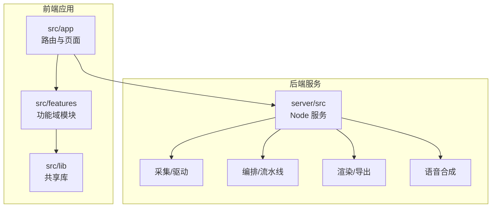
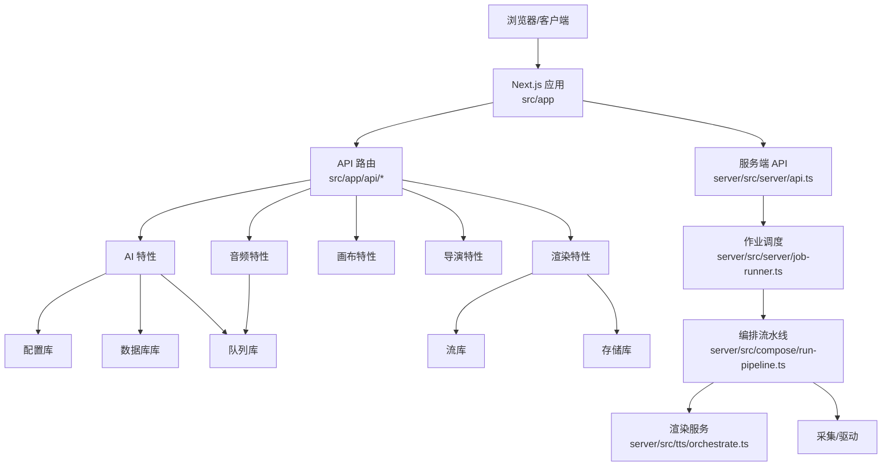
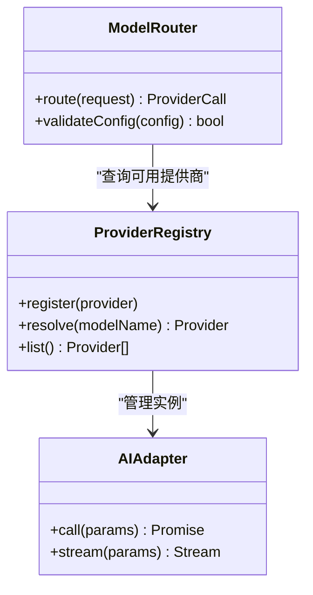
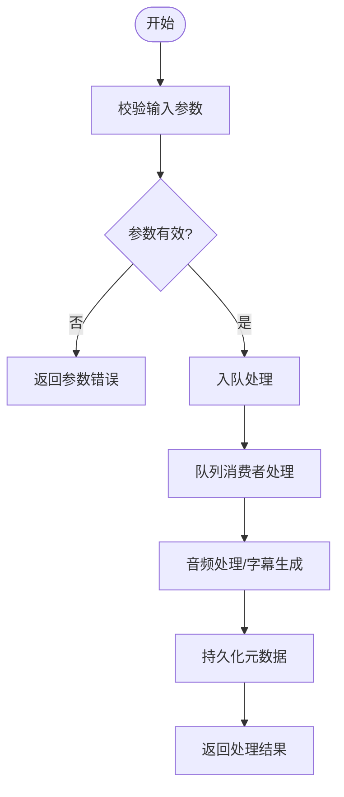
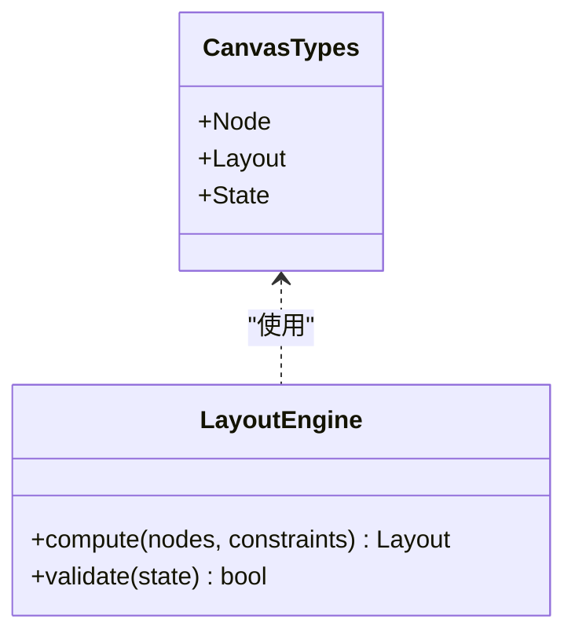
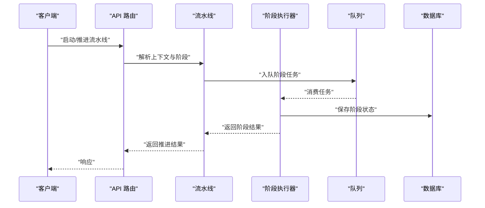
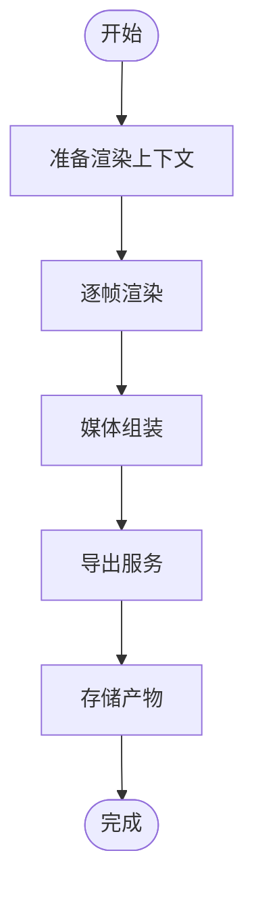
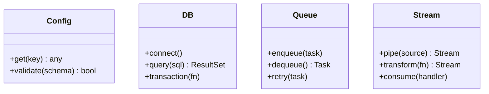
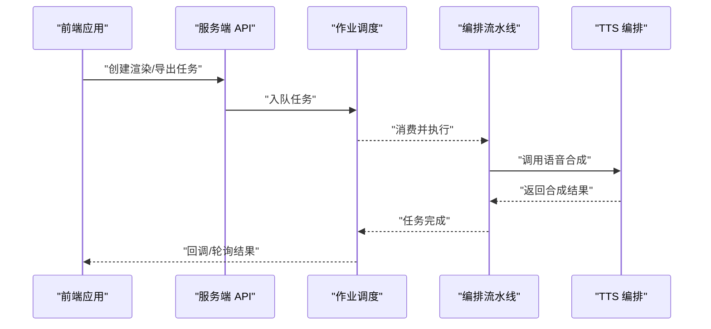
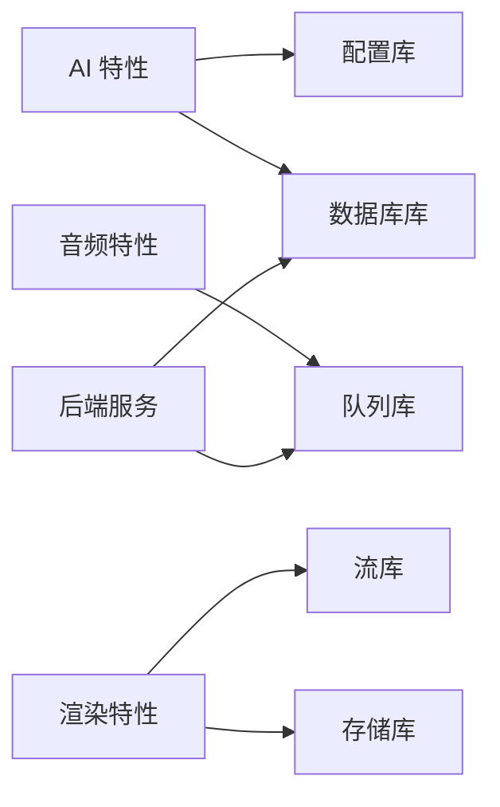

# 模块边界与依赖管理

<cite>
**本文引用的文件**   
- [package.json](file://package.json)
- [tsconfig.json](file://tsconfig.json)
- [next.config.ts](file://next.config.ts)
- [src/app/layout.tsx](file://src/app/layout.tsx)
- [src/app/providers.tsx](file://src/app/providers.tsx)
- [src/app/api/auth/login/route.ts](file://src/app/api/auth/login/route.ts)
- [src/app/api/projects/route.ts](file://src/app/api/projects/route.ts)
- [src/app/api/render/route.ts](file://src/app/api/render/route.ts)
- [src/app/api/director/pipeline/route.ts](file://src/app/api/director/pipeline/route.ts)
- [src/features/ai/index.ts](file://src/features/ai/index.ts)
- [src/features/ai/provider-registry.ts](file://src/features/ai/provider-registry.ts)
- [src/features/ai/model-routing.ts](file://src/features/ai/model-routing.ts)
- [src/features/audio/index.ts](file://src/features/audio/index.ts)
- [src/features/audio/narration.ts](file://src/features/audio/narration.ts)
- [src/features/audio/repository.ts](file://src/features/audio/repository.ts)
- [src/features/canvas/index.ts](file://src/features/canvas/index.ts)
- [src/features/canvas/types.ts](file://src/features/canvas/types.ts)
- [src/features/director/index.ts](file://src/features/director/index.ts)
- [src/features/director/pipeline.ts](file://src/features/director/pipeline.ts)
- [src/features/director/stage-runner.ts](file://src/features/director/stage-runner.ts)
- [src/features/render/index.ts](file://src/features/render/index.ts)
- [src/features/render/renderer.ts](file://src/features/render/renderer.ts)
- [src/features/render/export-service.ts](file://src/features/render/export-service.ts)
- [src/lib/queue/index.ts](file://src/lib/queue/index.ts)
- [src/lib/stream/index.ts](file://src/lib/stream/index.ts)
- [src/lib/config/index.ts](file://src/lib/config/index.ts)
- [src/lib/db/index.ts](file://src/lib/db/index.ts)
- [server/src/index.ts](file://server/src/index.ts)
- [server/src/server/api.ts](file://server/src/server/api.ts)
- [server/src/server/job-runner.ts](file://server/src/server/job-runner.ts)
- [server/src/compose/run-pipeline.ts](file://server/src/compose/run-pipeline.ts)
- [server/src/tts/orchestrate.ts](file://server/src/tts/orchestrate.ts)
- [server/src/lib/logger.ts](file://server/src/lib/logger.ts)
</cite>

## 目录
1. [引言](#引言)
2. [项目结构](#项目结构)
3. [核心组件](#核心组件)
4. [架构总览](#架构总览)
5. [详细组件分析](#详细组件分析)
6. [依赖分析](#依赖分析)
7. [性能考虑](#性能考虑)
8. [故障排查指南](#故障排查指南)
9. [结论](#结论)
10. [附录](#附录)

## 引言
本文件为 PurpleInK 平台的“模块边界与依赖管理”文档，聚焦于 features 功能域划分、lib 共享库组织、server 独立服务设计，以及模块间的依赖关系与通信接口（API 契约、事件总线、消息队列等）。同时给出依赖注入机制、服务发现、版本兼容性管理的实践建议，并总结代码组织的最佳实践（命名规范、文件结构、导入导出约定），辅以模块依赖图与接口契约定义。

## 项目结构
PurpleInK 采用前后端同仓（monorepo）与分层模块化组织：
- src/app：Next.js 应用路由与页面，按功能域拆分 API 路由与页面布局。
- src/features：按业务领域划分的特性模块（AI、音频、画布、导演、渲染、认证、凭据、导航、项目、仪表板、路由等）。
- src/lib：跨特性的通用能力（配置、数据库、队列、流、存储、TTS、工作流等）。
- server：独立的 Node.js 服务，承载采集、编排、渲染、TTS 等后端任务。
- scripts、tests、deploy、docs：工程化脚本、测试与部署文档。

**图表来源** 
- [src/app/layout.tsx:1-200](file://src/app/layout.tsx#L1-L200)
- [src/app/providers.tsx:1-200](file://src/app/providers.tsx#L1-L200)
- [server/src/index.ts:1-200](file://server/src/index.ts#L1-L200)

**章节来源**
- [package.json:1-200](file://package.json#L1-L200)
- [tsconfig.json:1-200](file://tsconfig.json#L1-L200)
- [next.config.ts:1-200](file://next.config.ts#L1-L200)

## 核心组件
- 前端入口与提供者
  - 根布局与全局 Provider 负责主题、国际化、状态容器等横切关注点。
  - API 路由层将 HTTP 请求映射到各特性模块的控制器或服务。
- 特性模块（features）
  - AI：模型路由、提供商注册、适配器与配置。
  - Audio：音频处理、字幕、媒体提供器、队列处理器。
  - Canvas：画布数据模型、布局、状态与工作流错误处理。
  - Director：导演流水线、阶段执行、运行时工件读写。
  - Render：渲染器、帧序列、媒体组装、导出服务。
- 共享库（lib）
  - 配置、数据库连接、队列抽象、流式传输、存储抽象、TTS 工具等。
- 后端服务（server）
  - 独立进程暴露内部 API，运行作业调度、采集、编排、渲染与 TTS 管线。

**章节来源**
- [src/app/layout.tsx:1-200](file://src/app/layout.tsx#L1-L200)
- [src/app/providers.tsx:1-200](file://src/app/providers.tsx#L1-L200)
- [src/features/ai/index.ts:1-200](file://src/features/ai/index.ts#L1-L200)
- [src/features/audio/index.ts:1-200](file://src/features/audio/index.ts#L1-L200)
- [src/features/canvas/index.ts:1-200](file://src/features/canvas/index.ts#L1-L200)
- [src/features/director/index.ts:1-200](file://src/features/director/index.ts#L1-L200)
- [src/features/render/index.ts:1-200](file://src/features/render/index.ts#L1-L200)
- [src/lib/config/index.ts:1-200](file://src/lib/config/index.ts#L1-L200)
- [src/lib/db/index.ts:1-200](file://src/lib/db/index.ts#L1-L200)
- [src/lib/queue/index.ts:1-200](file://src/lib/queue/index.ts#L1-L200)
- [src/lib/stream/index.ts:1-200](file://src/lib/stream/index.ts#L1-L200)
- [server/src/index.ts:1-200](file://server/src/index.ts#L1-L200)

## 架构总览
系统由前端 Next.js 应用与后端 Node.js 服务组成，通过 REST API 与流式通道交互；特性模块以领域边界组织，共享库提供横切能力；后端服务内部分解为采集、编排、渲染、TTS 等子系统，并通过作业调度与队列进行异步协作。

**图表来源** 
- [src/app/api/auth/login/route.ts:1-200](file://src/app/api/auth/login/route.ts#L1-L200)
- [src/app/api/projects/route.ts:1-200](file://src/app/api/projects/route.ts#L1-L200)
- [src/app/api/render/route.ts:1-200](file://src/app/api/render/route.ts#L1-L200)
- [src/app/api/director/pipeline/route.ts:1-200](file://src/app/api/director/pipeline/route.ts#L1-L200)
- [server/src/server/api.ts:1-200](file://server/src/server/api.ts#L1-L200)
- [server/src/server/job-runner.ts:1-200](file://server/src/server/job-runner.ts#L1-L200)
- [server/src/compose/run-pipeline.ts:1-200](file://server/src/compose/run-pipeline.ts#L1-L200)
- [server/src/tts/orchestrate.ts:1-200](file://server/src/tts/orchestrate.ts#L1-L200)

## 详细组件分析

### 特性模块：AI
- 职责：模型路由、提供商注册、适配器与配置校验。
- 关键文件：
  - 索引与注册表：[src/features/ai/index.ts](file://src/features/ai/index.ts)、[src/features/ai/provider-registry.ts](file://src/features/ai/provider-registry.ts)
  - 模型路由：[src/features/ai/model-routing.ts](file://src/features/ai/model-routing.ts)
- 依赖关系：依赖 lib/config 读取配置，依赖 lib/db 持久化配置或会话，依赖 lib/queue 提交异步任务。
- 接口契约：
  - 提供商注册：统一注册键、能力描述、默认配置。
  - 模型路由：根据策略选择提供商与参数。
- 错误处理：对无效配置、不可用提供商、超时与网络异常进行分类处理。

**图表来源** 
- [src/features/ai/provider-registry.ts:1-200](file://src/features/ai/provider-registry.ts#L1-L200)
- [src/features/ai/model-routing.ts:1-200](file://src/features/ai/model-routing.ts#L1-L200)

**章节来源**
- [src/features/ai/index.ts:1-200](file://src/features/ai/index.ts#L1-L200)
- [src/features/ai/provider-registry.ts:1-200](file://src/features/ai/provider-registry.ts#L1-L200)
- [src/features/ai/model-routing.ts:1-200](file://src/features/ai/model-routing.ts#L1-L200)

### 特性模块：Audio
- 职责：音频格式处理、测量、字幕生成、媒体提供器、队列处理器。
- 关键文件：
  - 索引与核心：[src/features/audio/index.ts](file://src/features/audio/index.ts)、[src/features/audio/narration.ts](file://src/features/audio/narration.ts)
  - 仓库与运行时：[src/features/audio/repository.ts](file://src/features/audio/repository.ts)
- 依赖关系：依赖 lib/queue 处理长任务，依赖 lib/storage 存取媒体文件，依赖 lib/db 持久化元数据。
- 接口契约：
  - 叙述生成：输入文本与配置，输出音频片段与时间轴。
  - 字幕：输入音频与识别结果，输出 ASS/SRT。
- 错误处理：对媒体解码失败、编码错误、队列消费异常进行重试与降级。

**图表来源** 
- [src/features/audio/narration.ts:1-200](file://src/features/audio/narration.ts#L1-L200)
- [src/features/audio/repository.ts:1-200](file://src/features/audio/repository.ts#L1-L200)
- [src/lib/queue/index.ts:1-200](file://src/lib/queue/index.ts#L1-L200)

**章节来源**
- [src/features/audio/index.ts:1-200](file://src/features/audio/index.ts#L1-L200)
- [src/features/audio/narration.ts:1-200](file://src/features/audio/narration.ts#L1-L200)
- [src/features/audio/repository.ts:1-200](file://src/features/audio/repository.ts#L1-L200)

### 特性模块：Canvas
- 职责：画布数据结构、布局算法、状态管理与工作流错误处理。
- 关键文件：
  - 索引与类型：[src/features/canvas/index.ts](file://src/features/canvas/index.ts)、[src/features/canvas/types.ts](file://src/features/canvas/types.ts)
- 依赖关系：依赖 lib/db 持久化画布状态，依赖 lib/queue 触发重排与导出。
- 接口契约：
  - 布局计算：输入节点集合与约束，输出布局结果。
  - 状态变更：增量更新与一致性校验。

**图表来源** 
- [src/features/canvas/types.ts:1-200](file://src/features/canvas/types.ts#L1-L200)
- [src/features/canvas/index.ts:1-200](file://src/features/canvas/index.ts#L1-L200)

**章节来源**
- [src/features/canvas/index.ts:1-200](file://src/features/canvas/index.ts#L1-L200)
- [src/features/canvas/types.ts:1-200](file://src/features/canvas/types.ts#L1-L200)

### 特性模块：Director
- 职责：导演流水线、阶段执行、运行时工件读写、恢复与验证。
- 关键文件：
  - 索引与流水线：[src/features/director/index.ts](file://src/features/director/index.ts)、[src/features/director/pipeline.ts](file://src/features/director/pipeline.ts)
  - 阶段执行：[src/features/director/stage-runner.ts](file://src/features/director/stage-runner.ts)
- 依赖关系：依赖 lib/queue 调度阶段任务，依赖 lib/db 持久化阶段状态，依赖 lib/stream 推送进度。
- 接口契约：
  - 流水线推进：输入阶段上下文，输出阶段结果与下一步动作。
  - 阶段执行：输入阶段定义与数据，输出阶段产物。

**图表来源** 
- [src/app/api/director/pipeline/route.ts:1-200](file://src/app/api/director/pipeline/route.ts#L1-L200)
- [src/features/director/pipeline.ts:1-200](file://src/features/director/pipeline.ts#L1-L200)
- [src/features/director/stage-runner.ts:1-200](file://src/features/director/stage-runner.ts#L1-L200)
- [src/lib/queue/index.ts:1-200](file://src/lib/queue/index.ts#L1-L200)
- [src/lib/db/index.ts:1-200](file://src/lib/db/index.ts#L1-L200)

**章节来源**
- [src/features/director/index.ts:1-200](file://src/features/director/index.ts#L1-L200)
- [src/features/director/pipeline.ts:1-200](file://src/features/director/pipeline.ts#L1-L200)
- [src/features/director/stage-runner.ts:1-200](file://src/features/director/stage-runner.ts#L1-L200)

### 特性模块：Render
- 职责：渲染器、帧序列、媒体组装、导出服务。
- 关键文件：
  - 索引与渲染器：[src/features/render/index.ts](file://src/features/render/index.ts)、[src/features/render/renderer.ts](file://src/features/render/renderer.ts)
  - 导出服务：[src/features/render/export-service.ts](file://src/features/render/export-service.ts)
- 依赖关系：依赖 lib/stream 输出流式渲染结果，依赖 lib/storage 存取中间产物，依赖 lib/queue 处理批量导出。
- 接口契约：
  - 渲染：输入画布状态与模板，输出媒体流或文件。
  - 导出：输入渲染任务，输出导出结果与下载链接。

**图表来源** 
- [src/features/render/renderer.ts:1-200](file://src/features/render/renderer.ts#L1-L200)
- [src/features/render/export-service.ts:1-200](file://src/features/render/export-service.ts#L1-L200)
- [src/lib/stream/index.ts:1-200](file://src/lib/stream/index.ts#L1-L200)
- [src/lib/storage/index.ts:1-200](file://src/lib/storage/index.ts#L1-L200)

**章节来源**
- [src/features/render/index.ts:1-200](file://src/features/render/index.ts#L1-L200)
- [src/features/render/renderer.ts:1-200](file://src/features/render/renderer.ts#L1-L200)
- [src/features/render/export-service.ts:1-200](file://src/features/render/export-service.ts#L1-L200)

### 共享库：配置、数据库、队列、流
- 配置：集中管理环境变量与默认值，提供类型安全的访问。
- 数据库：封装连接、事务与迁移，提供仓储模式。
- 队列：抽象任务入队、出队、重试与监控。
- 流：统一流式数据传输与背压控制。

**图表来源** 
- [src/lib/config/index.ts:1-200](file://src/lib/config/index.ts#L1-L200)
- [src/lib/db/index.ts:1-200](file://src/lib/db/index.ts#L1-L200)
- [src/lib/queue/index.ts:1-200](file://src/lib/queue/index.ts#L1-L200)
- [src/lib/stream/index.ts:1-200](file://src/lib/stream/index.ts#L1-L200)

**章节来源**
- [src/lib/config/index.ts:1-200](file://src/lib/config/index.ts#L1-L200)
- [src/lib/db/index.ts:1-200](file://src/lib/db/index.ts#L1-L200)
- [src/lib/queue/index.ts:1-200](file://src/lib/queue/index.ts#L1-L200)
- [src/lib/stream/index.ts:1-200](file://src/lib/stream/index.ts#L1-L200)

### 后端服务：Server
- 职责：独立服务暴露内部 API，运行作业调度、采集、编排、渲染与 TTS。
- 关键文件：
  - 入口与 API：[server/src/index.ts](file://server/src/index.ts)、[server/src/server/api.ts](file://server/src/server/api.ts)
  - 作业调度：[server/src/server/job-runner.ts](file://server/src/server/job-runner.ts)
  - 编排与 TTS：[server/src/compose/run-pipeline.ts](file://server/src/compose/run-pipeline.ts)、[server/src/tts/orchestrate.ts](file://server/src/tts/orchestrate.ts)
  - 日志：[server/src/lib/logger.ts](file://server/src/lib/logger.ts)

**图表来源** 
- [server/src/server/api.ts:1-200](file://server/src/server/api.ts#L1-L200)
- [server/src/server/job-runner.ts:1-200](file://server/src/server/job-runner.ts#L1-L200)
- [server/src/compose/run-pipeline.ts:1-200](file://server/src/compose/run-pipeline.ts#L1-L200)
- [server/src/tts/orchestrate.ts:1-200](file://server/src/tts/orchestrate.ts#L1-L200)

**章节来源**
- [server/src/index.ts:1-200](file://server/src/index.ts#L1-L200)
- [server/src/server/api.ts:1-200](file://server/src/server/api.ts#L1-L200)
- [server/src/server/job-runner.ts:1-200](file://server/src/server/job-runner.ts#L1-L200)
- [server/src/compose/run-pipeline.ts:1-200](file://server/src/compose/run-pipeline.ts#L1-L200)
- [server/src/tts/orchestrate.ts:1-200](file://server/src/tts/orchestrate.ts#L1-L200)
- [server/src/lib/logger.ts:1-200](file://server/src/lib/logger.ts#L1-L200)

## 依赖分析
- 模块耦合与内聚
  - features 模块高内聚、低耦合，通过 lib 共享库解耦横切关注点。
  - server 服务与前端通过 API 契约通信，避免直接引用实现细节。
- 外部依赖与集成点
  - 数据库、存储、队列、流等通过 lib 抽象，便于替换与扩展。
  - 第三方提供商（AI、音频、TTS）通过适配器与注册表接入。
- 潜在循环依赖
  - 通过接口与类型隔离避免循环引用；必要时引入延迟加载或事件总线。

**图表来源** 
- [src/features/ai/index.ts:1-200](file://src/features/ai/index.ts#L1-L200)
- [src/features/audio/index.ts:1-200](file://src/features/audio/index.ts#L1-L200)
- [src/features/render/index.ts:1-200](file://src/features/render/index.ts#L1-L200)
- [src/lib/config/index.ts:1-200](file://src/lib/config/index.ts#L1-L200)
- [src/lib/db/index.ts:1-200](file://src/lib/db/index.ts#L1-L200)
- [src/lib/queue/index.ts:1-200](file://src/lib/queue/index.ts#L1-L200)
- [src/lib/stream/index.ts:1-200](file://src/lib/stream/index.ts#L1-L200)
- [server/src/index.ts:1-200](file://server/src/index.ts#L1-L200)

**章节来源**
- [package.json:1-200](file://package.json#L1-L200)
- [tsconfig.json:1-200](file://tsconfig.json#L1-L200)

## 性能考虑
- 队列与并发
  - 合理设置队列并发度与重试策略，避免资源争用与雪崩。
- 流式处理
  - 使用流式传输减少内存占用，提升大文件处理效率。
- 缓存与幂等
  - 对重复请求与可缓存结果进行缓存，确保幂等性。
- 资源隔离
  - 将 CPU 密集型任务（渲染、TTS）放入独立进程或 Worker，避免阻塞主线程。

## 故障排查指南
- API 路由问题
  - 检查路由参数校验、鉴权逻辑与错误响应格式。
- 队列消费失败
  - 查看日志、重试次数与死信队列，定位失败原因。
- 数据库连接异常
  - 检查连接池、迁移状态与权限配置。
- 流式传输中断
  - 确认背压处理与超时配置，检查下游服务可用性。

**章节来源**
- [src/app/api/auth/login/route.ts:1-200](file://src/app/api/auth/login/route.ts#L1-L200)
- [src/app/api/projects/route.ts:1-200](file://src/app/api/projects/route.ts#L1-L200)
- [src/app/api/render/route.ts:1-200](file://src/app/api/render/route.ts#L1-L200)
- [server/src/lib/logger.ts:1-200](file://server/src/lib/logger.ts#L1-L200)

## 结论
PurpleInK 平台通过清晰的模块边界与依赖管理，实现了高内聚、低耦合的架构。features 按领域划分，lib 提供横切能力，server 独立承担重型任务。借助 API 契约、队列与流式传输，系统具备良好的可扩展性与可维护性。建议在后续迭代中持续完善接口契约、增强错误处理与监控，以提升稳定性与性能。

## 附录
- 命名规范
  - 模块名使用小写连字符，文件名遵循语义化命名。
  - 导出优先使用具名导出，避免默认导出的歧义。
- 文件结构
  - 每个特性模块包含 index.ts 作为统一入口，类型与实现分离。
  - 共享库按能力划分目录，提供最小化 API。
- 导入导出约定
  - 禁止跨特性直接引用实现，仅通过接口与类型通信。
  - 对外暴露的类型需稳定且向后兼容。