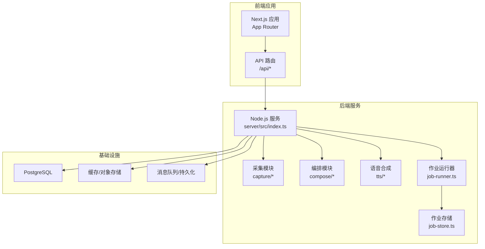
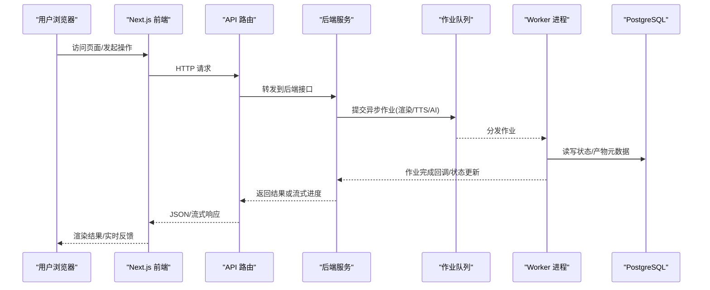
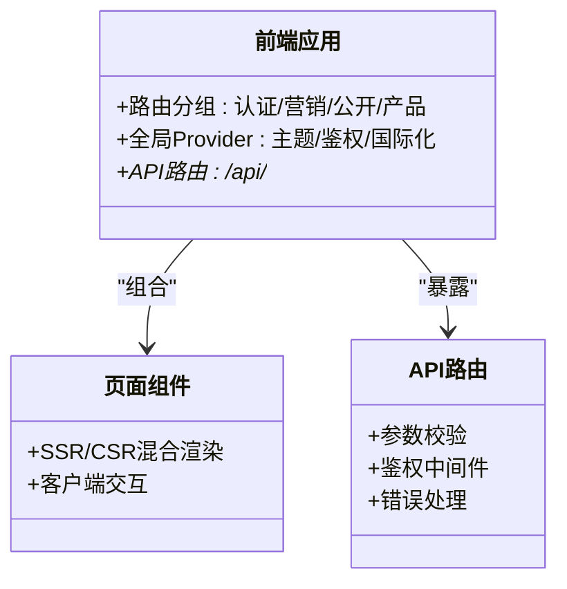
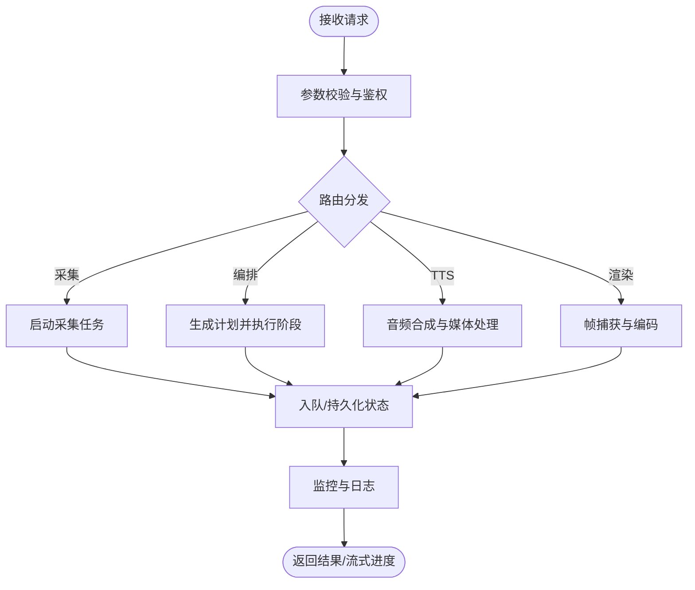
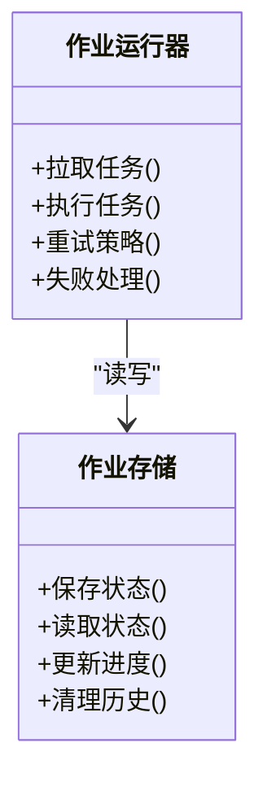
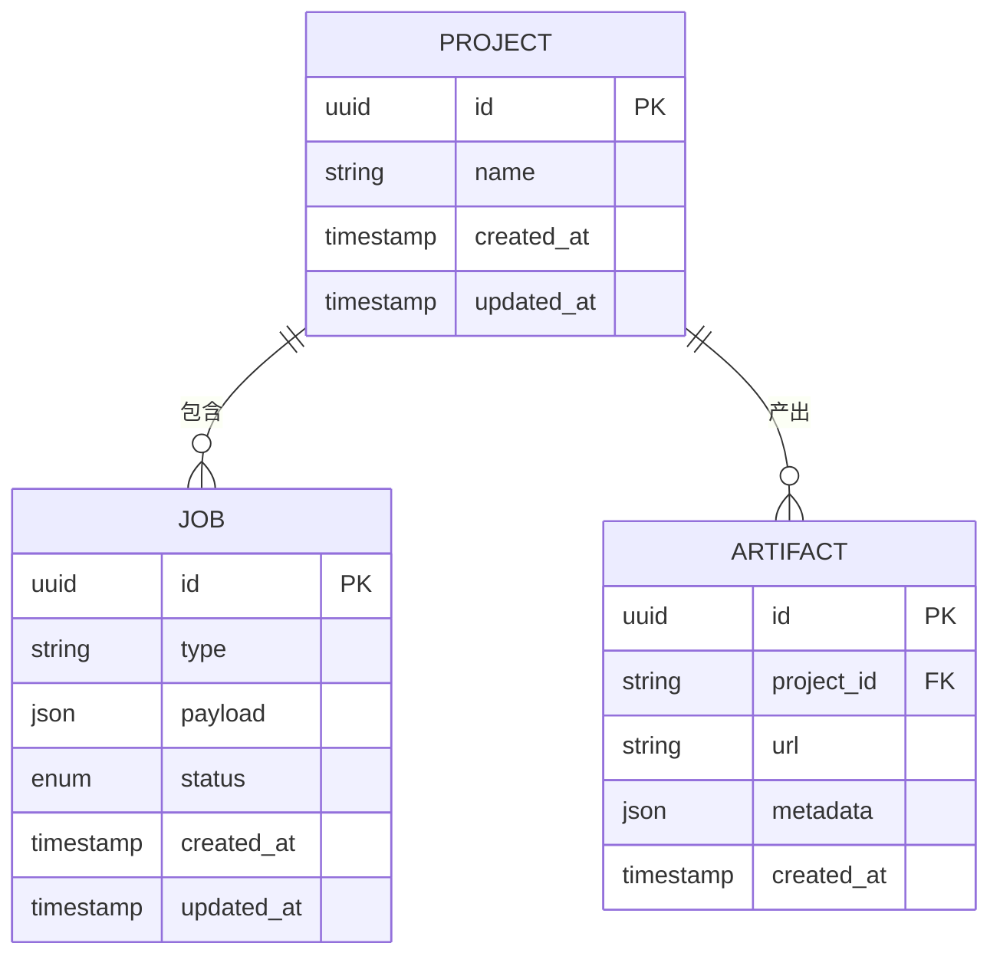
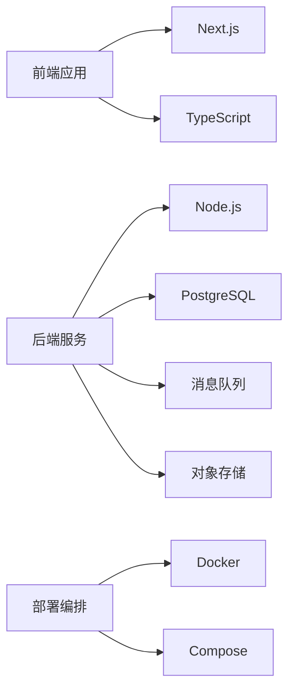
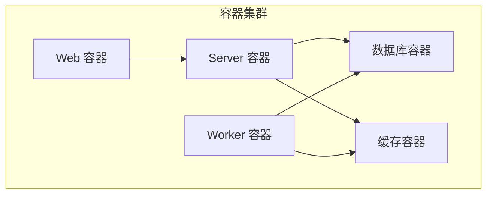

# 系统架构概览

<cite>
**本文引用的文件**   
- [package.json](file://package.json)
- [next.config.ts](file://next.config.ts)
- [tsconfig.json](file://tsconfig.json)
- [Dockerfile.web](file://Dockerfile.web)
- [Dockerfile.worker](file://Dockerfile.worker)
- [docker-compose.dev.yml](file://docker-compose.dev.yml)
- [deploy/compose.yaml](file://deploy/compose.yaml)
- [deploy/env.example](file://deploy/env.example)
- [deploy/worker.env.example](file://deploy/worker.env.example)
- [src/app/layout.tsx](file://src/app/layout.tsx)
- [src/app/providers.tsx](file://src/app/providers.tsx)
- [src/app/(auth)/layout.tsx](file://src/app/(auth)/layout.tsx)
- [src/app/(marketing)/layout.tsx](file://src/app/(marketing)/layout.tsx)
- [src/app/(public)/layout.tsx](file://src/app/(public)/layout.tsx)
- [src/app/products/(app)/layout.tsx](file://src/app/products/(app)/layout.tsx)
- [src/app/api/ping/route.ts](file://src/app/api/ping/route.ts)
- [src/app/api/projects/route.ts](file://src/app/api/projects/route.ts)
- [src/app/api/render/route.ts](file://src/app/api/render/route.ts)
- [src/app/api/director/pipeline/route.ts](file://src/app/api/director/pipeline/route.ts)
- [src/app/api/artifacts/[id]/route.ts](file://src/app/api/artifacts/[id]/route.ts)
- [server/src/index.ts](file://server/src/index.ts)
- [server/src/server/job-runner.ts](file://server/src/server/job-runner.ts)
- [server/src/server/job-store.ts](file://server/src/server/job-store.ts)
- [server/src/capture/run-capture.ts](file://server/src/capture/run-capture.ts)
- [server/src/compose/run-pipeline.ts](file://server/src/compose/run-pipeline.ts)
- [server/src/tts/orchestrate.ts](file://server/src/tts/orchestrate.ts)
- [server/src/lib/logger.ts](file://server/src/lib/logger.ts)
- [scripts/setup/db-migrate.ts](file://scripts/setup/db-migrate.ts)
- [drizzle.config.ts](file://drizzle.config.ts)
- [tests/deployment-config.test.mjs](file://tests/deployment-config.test.mjs)
</cite>

## 目录
1. [简介](#简介)
2. [项目结构](#项目结构)
3. [核心组件](#核心组件)
4. [架构总览](#架构总览)
5. [详细组件分析](#详细组件分析)
6. [依赖关系分析](#依赖关系分析)
7. [性能与可扩展性](#性能与可扩展性)
8. [安全设计原则](#安全设计原则)
9. [部署与基础设施](#部署与基础设施)
10. [故障排查指南](#故障排查指南)
11. [结论](#结论)

## 简介
本文件为 PurpleInk 平台的系统架构概览，面向产品、研发与运维读者。文档从整体架构、前后端分离与微服务划分、容器化部署策略入手，解释关键架构决策（Next.js App Router、TypeScript 类型系统、事件驱动与队列处理等），并给出组件交互图、数据流向图、扩展性与性能优化建议、安全设计原则以及基础设施与部署拓扑说明。

## 项目结构
PurpleInk 采用“前端应用 + 后端服务 + 工作进程”的清晰分层：
- 前端应用：基于 Next.js App Router，提供营销页、认证、产品工作台与 API 路由。
- 后端服务：Node.js 服务，承载采集、编排、渲染、TTS 等能力。
- 工作进程：独立 Worker，负责耗时任务（渲染、导出、TTS、AI 调用等）。
- 配置与脚本：环境配置、数据库迁移、验证与测试脚本。
- 部署：Docker 镜像与 Compose 编排，支持开发与生产环境。

图表来源
- [src/app/layout.tsx:1-200](file://src/app/layout.tsx#L1-L200)
- [src/app/providers.tsx:1-200](file://src/app/providers.tsx#L1-L200)
- [src/app/api/ping/route.ts:1-200](file://src/app/api/ping/route.ts#L1-L200)
- [server/src/index.ts:1-200](file://server/src/index.ts#L1-L200)
- [server/src/server/job-runner.ts:1-200](file://server/src/server/job-runner.ts#L1-L200)
- [server/src/server/job-store.ts:1-200](file://server/src/server/job-store.ts#L1-L200)

章节来源
- [package.json:1-200](file://package.json#L1-L200)
- [next.config.ts:1-200](file://next.config.ts#L1-L200)
- [tsconfig.json:1-200](file://tsconfig.json#L1-L200)

## 核心组件
- 前端应用层
  - 路由与布局：通过 App Router 组织页面与布局，按功能域拆分（认证、营销、公开页、产品工作台）。
  - 状态与提供者：全局 Provider 管理主题、国际化、鉴权上下文等。
  - API 路由：统一入口，转发到后端服务或本地逻辑。
- 后端服务层
  - 采集子系统：浏览器驱动、邮件抓取、Mock 驱动等。
  - 编排子系统：分镜计划、阶段执行、产物写入、会话管理。
  - TTS 子系统：音频录制、媒体处理、流程编排。
  - 作业调度：作业运行器与存储，支撑异步任务与重试。
- 基础设施层
  - 数据库：PostgreSQL，使用 Drizzle 进行迁移与查询。
  - 存储：对象存储用于产物与素材。
  - 队列：用于解耦耗时任务（渲染、导出、TTS、AI 调用）。

章节来源
- [src/app/(auth)/layout.tsx:1-200](file://src/app/(auth)/layout.tsx#L1-L200)
- [src/app/(marketing)/layout.tsx:1-200](file://src/app/(marketing)/layout.tsx#L1-L200)
- [src/app/(public)/layout.tsx:1-200](file://src/app/(public)/layout.tsx#L1-L200)
- [src/app/products/(app)/layout.tsx:1-200](file://src/app/products/(app)/layout.tsx#L1-L200)
- [server/src/capture/run-capture.ts:1-200](file://server/src/capture/run-capture.ts#L1-L200)
- [server/src/compose/run-pipeline.ts:1-200](file://server/src/compose/run-pipeline.ts#L1-L200)
- [server/src/tts/orchestrate.ts:1-200](file://server/src/tts/orchestrate.ts#L1-L200)
- [server/src/server/job-runner.ts:1-200](file://server/src/server/job-runner.ts#L1-L200)
- [server/src/server/job-store.ts:1-200](file://server/src/server/job-store.ts#L1-L200)
- [drizzle.config.ts:1-200](file://drizzle.config.ts#L1-L200)

## 架构总览
PurpleInk 采用前后端分离与微服务化的思路：
- 前端以 Next.js 作为统一入口，提供 SSR/CSR 混合渲染与 API 路由。
- 后端服务聚焦业务编排与资源协调，将重负载任务下沉至 Worker。
- 通过事件与队列实现松耦合，提升可观测性与弹性伸缩能力。
- 容器化部署保证环境一致性与快速交付。

图表来源
- [src/app/api/render/route.ts:1-200](file://src/app/api/render/route.ts#L1-L200)
- [src/app/api/director/pipeline/route.ts:1-200](file://src/app/api/director/pipeline/route.ts#L1-L200)
- [server/src/server/job-runner.ts:1-200](file://server/src/server/job-runner.ts#L1-L200)
- [server/src/server/job-store.ts:1-200](file://server/src/server/job-store.ts#L1-L200)

## 详细组件分析

### 前端应用（Next.js App Router）
- 路由与布局
  - 使用 App Router 的分组布局（认证、营销、公开、产品工作台）实现权限与 UI 隔离。
  - 根布局与 Providers 集中管理全局状态与主题。
- API 路由
  - 统一的 /api 前缀，职责单一，便于网关与限流策略接入。
- 类型系统
  - TypeScript 贯穿全栈，确保前后端契约一致性。

图表来源
- [src/app/layout.tsx:1-200](file://src/app/layout.tsx#L1-L200)
- [src/app/providers.tsx:1-200](file://src/app/providers.tsx#L1-L200)
- [src/app/api/ping/route.ts:1-200](file://src/app/api/ping/route.ts#L1-L200)

章节来源
- [src/app/(auth)/layout.tsx:1-200](file://src/app/(auth)/layout.tsx#L1-L200)
- [src/app/(marketing)/layout.tsx:1-200](file://src/app/(marketing)/layout.tsx#L1-L200)
- [src/app/(public)/layout.tsx:1-200](file://src/app/(public)/layout.tsx#L1-L200)
- [src/app/products/(app)/layout.tsx:1-200](file://src/app/products/(app)/layout.tsx#L1-L200)

### 后端服务（Node.js）
- 采集模块
  - 浏览器驱动、邮件抓取、Mock 驱动，统一抽象为采集任务。
- 编排模块
  - 分镜计划生成、阶段执行、产物写入、会话与状态管理。
- TTS 模块
  - 音频录制、媒体处理、流程编排，支持多供应商适配。
- 作业调度
  - 作业运行器与存储，支撑异步任务、重试与幂等。

图表来源
- [server/src/capture/run-capture.ts:1-200](file://server/src/capture/run-capture.ts#L1-L200)
- [server/src/compose/run-pipeline.ts:1-200](file://server/src/compose/run-pipeline.ts#L1-L200)
- [server/src/tts/orchestrate.ts:1-200](file://server/src/tts/orchestrate.ts#L1-L200)
- [server/src/server/job-runner.ts:1-200](file://server/src/server/job-runner.ts#L1-L200)

章节来源
- [server/src/index.ts:1-200](file://server/src/index.ts#L1-L200)
- [server/src/lib/logger.ts:1-200](file://server/src/lib/logger.ts#L1-L200)

### 作业调度与存储
- 作业运行器
  - 负责任务拉取、执行、重试与失败处理。
- 作业存储
  - 持久化作业状态、产物元数据与执行日志。

图表来源
- [server/src/server/job-runner.ts:1-200](file://server/src/server/job-runner.ts#L1-L200)
- [server/src/server/job-store.ts:1-200](file://server/src/server/job-store.ts#L1-L200)

章节来源
- [server/src/server/job-runner.ts:1-200](file://server/src/server/job-runner.ts#L1-L200)
- [server/src/server/job-store.ts:1-200](file://server/src/server/job-store.ts#L1-L200)

### 数据模型与迁移
- 数据库
  - PostgreSQL 作为主存储，Drizzle 进行迁移与查询。
- 迁移脚本
  - 初始化与版本升级脚本保障一致性。

图表来源
- [drizzle.config.ts:1-200](file://drizzle.config.ts#L1-L200)
- [scripts/setup/db-migrate.ts:1-200](file://scripts/setup/db-migrate.ts#L1-L200)

章节来源
- [drizzle.config.ts:1-200](file://drizzle.config.ts#L1-L200)
- [scripts/setup/db-migrate.ts:1-200](file://scripts/setup/db-migrate.ts#L1-L200)

## 依赖关系分析
- 前端依赖 Next.js、React、TypeScript 与样式框架。
- 后端依赖 Node.js、数据库驱动、队列与对象存储 SDK。
- 部署依赖 Docker、Compose 与 CI/CD 流水线。

图表来源
- [package.json:1-200](file://package.json#L1-L200)
- [next.config.ts:1-200](file://next.config.ts#L1-L200)
- [tsconfig.json:1-200](file://tsconfig.json#L1-L200)
- [docker-compose.dev.yml:1-200](file://docker-compose.dev.yml#L1-L200)

章节来源
- [package.json:1-200](file://package.json#L1-L200)
- [next.config.ts:1-200](file://next.config.ts#L1-L200)
- [tsconfig.json:1-200](file://tsconfig.json#L1-L200)

## 性能与可扩展性
- 前端性能
  - 利用 Next.js 的 SSR/CSR 混合与路由级代码分割，减少首屏体积。
  - 静态资源 CDN 与缓存策略优化加载速度。
- 后端性能
  - 异步作业与队列解耦，避免阻塞请求线程。
  - 数据库连接池与索引优化，减少 I/O 等待。
- 可扩展性
  - Worker 水平扩展，按队列负载自动扩缩容。
  - 微服务边界清晰，便于独立扩容与灰度发布。
- 缓存策略
  - 热点数据缓存（如模板、配置）降低重复计算。
  - 产物缓存与去重，提高复用率。

[本节为通用指导，不直接分析具体文件]

## 安全设计原则
- 鉴权与授权
  - 统一鉴权中间件，最小权限原则。
- 输入校验
  - 严格参数校验与类型约束，防止注入与越权。
- 密钥管理
  - 环境变量与密钥管理服务，禁止硬编码。
- 审计与日志
  - 敏感信息脱敏，操作审计与异常告警。
- 网络安全
  - HTTPS、CORS 白名单、速率限制与防刷。

[本节为通用指导，不直接分析具体文件]

## 部署与基础设施
- 容器化
  - 前端与后端分别构建镜像，Worker 独立镜像。
- 编排
  - Compose 定义服务依赖、网络与卷挂载。
- 环境配置
  - 环境变量模板与校验脚本保障一致性。
- 数据库
  - 初始化 SQL 与迁移脚本，确保版本一致。

图表来源
- [Dockerfile.web:1-200](file://Dockerfile.web#L1-L200)
- [Dockerfile.worker:1-200](file://Dockerfile.worker#L1-L200)
- [docker-compose.dev.yml:1-200](file://docker-compose.dev.yml#L1-L200)
- [deploy/compose.yaml:1-200](file://deploy/compose.yaml#L1-L200)
- [deploy/env.example:1-200](file://deploy/env.example#L1-L200)
- [deploy/worker.env.example:1-200](file://deploy/worker.env.example#L1-L200)

章节来源
- [Dockerfile.web:1-200](file://Dockerfile.web#L1-L200)
- [Dockerfile.worker:1-200](file://Dockerfile.worker#L1-L200)
- [docker-compose.dev.yml:1-200](file://docker-compose.dev.yml#L1-L200)
- [deploy/compose.yaml:1-200](file://deploy/compose.yaml#L1-L200)
- [deploy/env.example:1-200](file://deploy/env.example#L1-L200)
- [deploy/worker.env.example:1-200](file://deploy/worker.env.example#L1-L200)
- [tests/deployment-config.test.mjs:1-200](file://tests/deployment-config.test.mjs#L1-L200)

## 故障排查指南
- 常见问题定位
  - 检查环境变量与密钥是否配置正确。
  - 查看作业运行器日志与队列消费情况。
  - 确认数据库连接与迁移版本。
- 诊断工具
  - 健康检查接口与指标收集。
  - 结构化日志与链路追踪。
- 恢复策略
  - 作业重试与死信队列。
  - 回滚与快照恢复。

章节来源
- [server/src/lib/logger.ts:1-200](file://server/src/lib/logger.ts#L1-L200)
- [server/src/server/job-runner.ts:1-200](file://server/src/server/job-runner.ts#L1-L200)
- [scripts/setup/db-migrate.ts:1-200](file://scripts/setup/db-migrate.ts#L1-L200)

## 结论
PurpleInk 平台通过 Next.js App Router 与 TypeScript 构建高内聚、低耦合的前后端体系；以事件驱动与队列解耦重负载任务，结合容器化与编排实现弹性伸缩与稳定交付。未来可在可观测性、缓存策略与服务治理方面持续演进，进一步提升性能与可靠性。

[本节为总结，不直接分析具体文件]