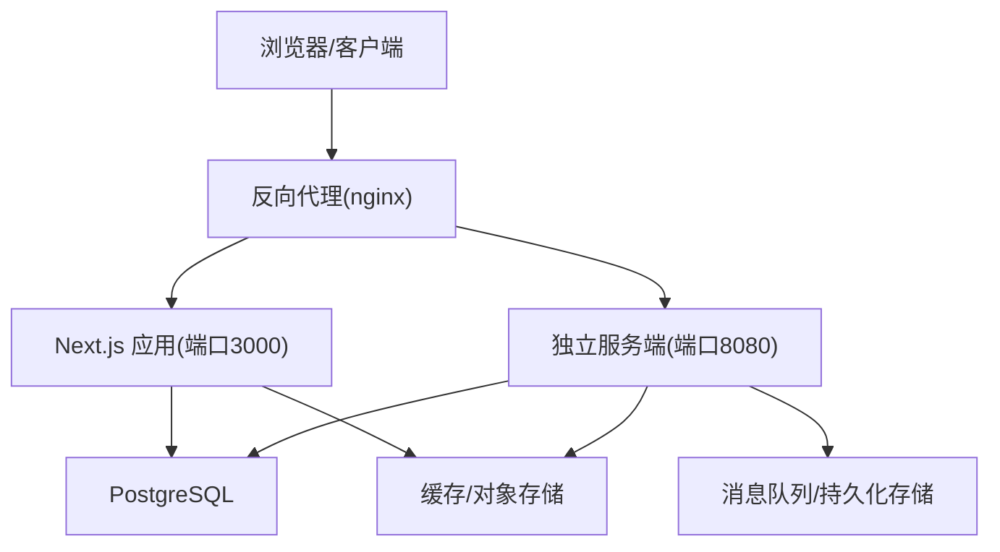
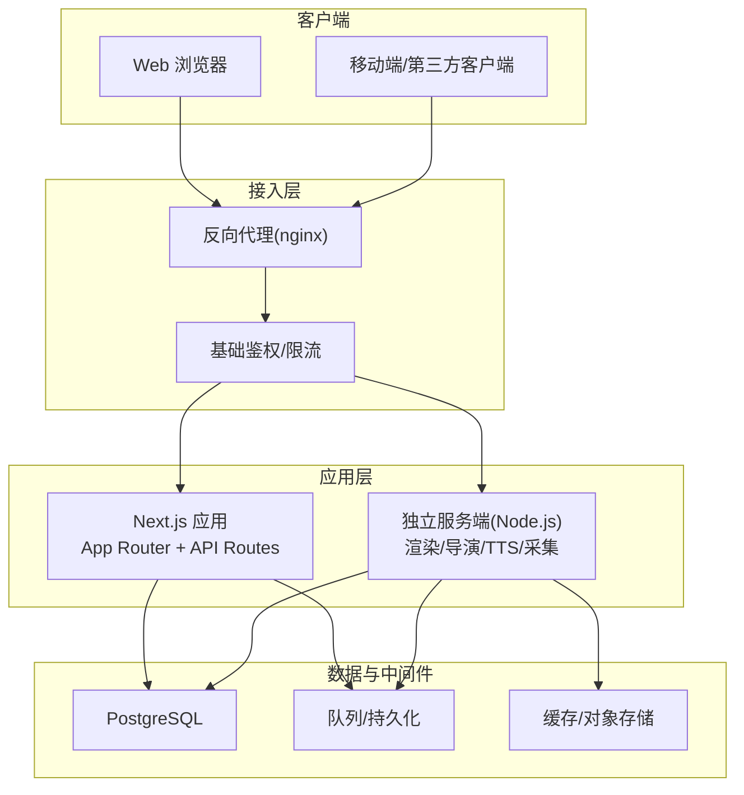
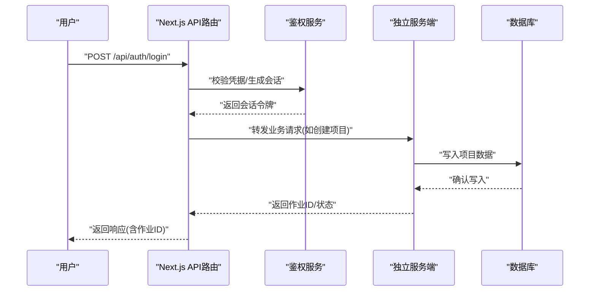
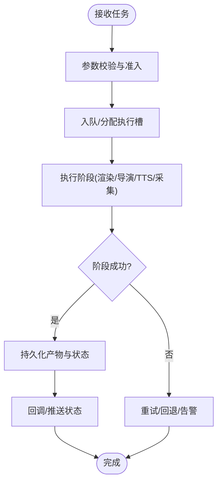
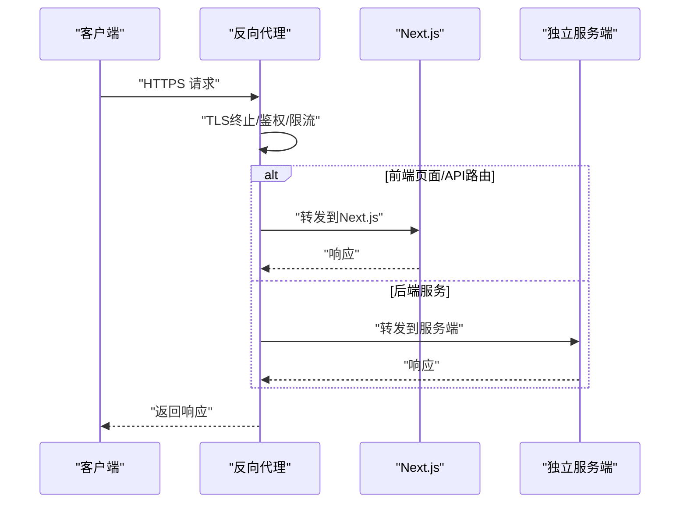
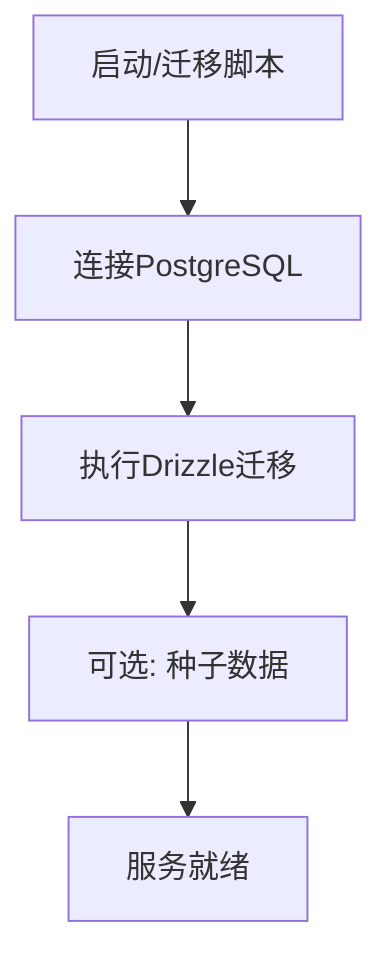
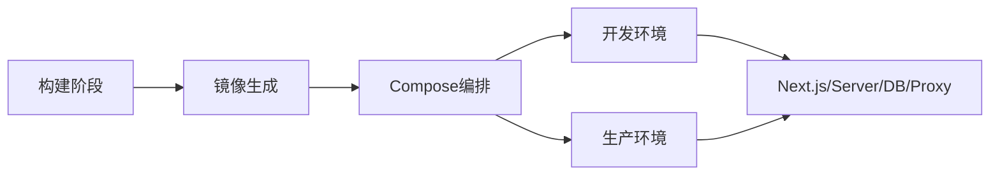
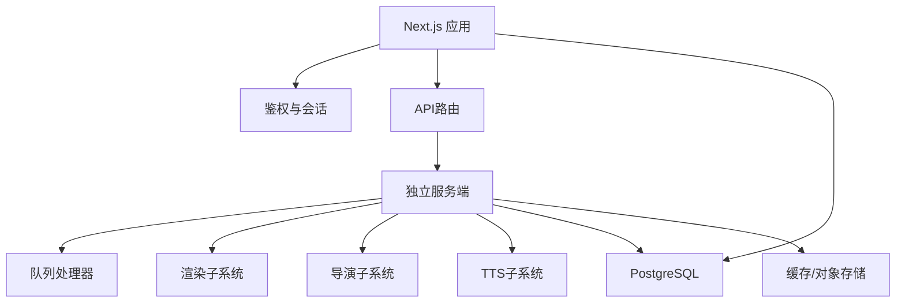

# 系统架构概览

<cite>
**本文引用的文件**   
- [Dockerfile](file://Dockerfile)
- [docker-compose.dev.yml](file://docker-compose.dev.yml)
- [docker-compose.prod.yml](file://docker-compose.prod.yml)
- [next.config.ts](file://next.config.ts)
- [package.json](file://package.json)
- [src/app/layout.tsx](file://src/app/layout.tsx)
- [src/app/providers.tsx](file://src/app/providers.tsx)
- [src/proxy.ts](file://src/proxy.ts)
- [server/src/index.ts](file://server/src/index.ts)
- [server/Dockerfile](file://server/Dockerfile)
- [deploy/reverse-proxy/Dockerfile](file://deploy/reverse-proxy/Dockerfile)
- [deploy/reverse-proxy/entrypoint.sh](file://deploy/reverse-proxy/entrypoint.sh)
- [src/app/api/auth/login/route.ts](file://src/app/api/auth/login/route.ts)
- [src/app/api/projects/route.ts](file://src/app/api/projects/route.ts)
- [src/app/api/render/route.ts](file://src/app/api/render/route.ts)
- [src/app/api/director/pipeline/route.ts](file://src/app/api/director/pipeline/route.ts)
- [src/features/auth/session.ts](file://src/features/auth/session.ts)
- [src/features/auth/account-service.ts](file://src/features/auth/account-service.ts)
- [src/features/director/queue-handler.ts](file://src/features/director/queue-handler.ts)
- [src/features/render/export-service.ts](file://src/features/render/export-service.ts)
- [src/lib/queue/index.ts](file://src/lib/queue/index.ts)
- [scripts/setup/db-migrate.ts](file://scripts/setup/db-migrate.ts)
- [drizzle.config.ts](file://drizzle.config.ts)
</cite>

## 目录
1. [简介](#简介)
2. [项目结构](#项目结构)
3. [核心组件](#核心组件)
4. [架构总览](#架构总览)
5. [详细组件分析](#详细组件分析)
6. [依赖关系分析](#依赖关系分析)
7. [性能考量](#性能考量)
8. [故障排查指南](#故障排查指南)
9. [结论](#结论)
10. [附录](#附录)

## 简介
本文件为 PurpleInk 平台的系统架构概览，面向开发者与运维人员，帮助快速理解前后端分离、Next.js 全栈框架应用、独立服务器进程的职责划分、客户端-服务器通信机制、API 网关设计、负载均衡策略、容器化部署（镜像构建、服务编排、环境隔离）以及微服务边界与服务间通信协议。文档包含系统上下文图、部署架构图与组件交互图，并给出关键流程的时序说明与排障建议。

## 项目结构
PurpleInk 采用“前端 Next.js 应用 + 独立 Node.js 服务端 + 反向代理”的分层架构：
- 前端：基于 Next.js App Router，提供页面路由、API 路由、UI 组件与业务特性模块。
- 服务端：独立的 Node.js 进程，承载渲染、导演（Director）、TTS、采集等重计算任务与队列消费。
- 反向代理：Nginx 或兼容的反向代理容器，负责 TLS 终止、静态资源缓存、请求转发与鉴权。
- 数据层：PostgreSQL（通过 Drizzle ORM），配合迁移脚本进行数据库初始化与版本管理。
- 容器化：多阶段 Docker 构建，Compose 编排开发/生产环境，环境变量与密钥隔离。

图表来源
- [next.config.ts](file://next.config.ts)
- [src/proxy.ts](file://src/proxy.ts)
- [server/src/index.ts](file://server/src/index.ts)
- [docker-compose.dev.yml](file://docker-compose.dev.yml)
- [docker-compose.prod.yml](file://docker-compose.prod.yml)

章节来源
- [package.json](file://package.json)
- [next.config.ts](file://next.config.ts)
- [src/app/layout.tsx](file://src/app/layout.tsx)
- [src/app/providers.tsx](file://src/app/providers.tsx)
- [src/proxy.ts](file://src/proxy.ts)
- [server/src/index.ts](file://server/src/index.ts)
- [docker-compose.dev.yml](file://docker-compose.dev.yml)
- [docker-compose.prod.yml](file://docker-compose.prod.yml)

## 核心组件
- Next.js 应用（前端+API路由）
  - 职责：用户界面、页面渲染、API 路由聚合、鉴权会话管理、与后端服务通信。
  - 关键点：App Router 组织路由；API 路由作为轻量网关，将写操作转发至独立服务端；鉴权与会话由 features/auth 模块实现。
- 独立服务端（Node.js）
  - 职责：渲染管线、导演工作流、TTS 合成、媒体采集、队列消费者、外部模型/媒体服务调用。
  - 关键点：进程内队列调度、异步任务执行、结果持久化与回调通知。
- 反向代理
  - 职责：TLS 终止、静态资源缓存、请求分发、基础鉴权、限流与熔断。
- 数据层
  - 职责：用户、项目、作业、制品、配置等结构化数据存储；迁移与备份。
- 容器与编排
  - 职责：镜像构建、服务编排、环境变量注入、健康检查与滚动更新。

章节来源
- [src/app/layout.tsx](file://src/app/layout.tsx)
- [src/app/providers.tsx](file://src/app/providers.tsx)
- [src/app/api/auth/login/route.ts](file://src/app/api/auth/login/route.ts)
- [src/app/api/projects/route.ts](file://src/app/api/projects/route.ts)
- [src/app/api/render/route.ts](file://src/app/api/render/route.ts)
- [src/app/api/director/pipeline/route.ts](file://src/app/api/director/pipeline/route.ts)
- [server/src/index.ts](file://server/src/index.ts)
- [drizzle.config.ts](file://drizzle.config.ts)
- [scripts/setup/db-migrate.ts](file://scripts/setup/db-migrate.ts)

## 架构总览
整体采用“前后端分离 + API 网关 + 独立服务进程”的模式：
- 客户端通过反向代理访问 Next.js 应用与独立服务端。
- Next.js 应用承担 UI 与轻量 API 路由，复杂任务通过 HTTP/事件转发到独立服务端。
- 独立服务端负责重计算与外部集成，使用队列与持久化保障可靠性。
- 数据层统一由 PostgreSQL 提供，ORM 使用 Drizzle。

图表来源
- [docker-compose.dev.yml](file://docker-compose.dev.yml)
- [docker-compose.prod.yml](file://docker-compose.prod.yml)
- [deploy/reverse-proxy/Dockerfile](file://deploy/reverse-proxy/Dockerfile)
- [deploy/reverse-proxy/entrypoint.sh](file://deploy/reverse-proxy/entrypoint.sh)
- [next.config.ts](file://next.config.ts)
- [server/src/index.ts](file://server/src/index.ts)

## 详细组件分析

### Next.js 应用（前端与 API 路由）
- 路由组织：App Router 按功能域划分页面与 API 路由，便于扩展与维护。
- API 路由：作为轻量网关，校验输入、鉴权、参数转换，并将写操作转发至独立服务端。
- 鉴权与会话：通过 features/auth 模块实现登录、注册、密码重置、会话管理与验证码流程。
- 状态与数据：读取项目、作业、制品等数据，展示实时状态与进度。

图表来源
- [src/app/api/auth/login/route.ts](file://src/app/api/auth/login/route.ts)
- [src/features/auth/session.ts](file://src/features/auth/session.ts)
- [src/app/api/projects/route.ts](file://src/app/api/projects/route.ts)
- [server/src/index.ts](file://server/src/index.ts)

章节来源
- [src/app/api/auth/login/route.ts](file://src/app/api/auth/login/route.ts)
- [src/app/api/projects/route.ts](file://src/app/api/projects/route.ts)
- [src/features/auth/session.ts](file://src/features/auth/session.ts)
- [src/features/auth/account-service.ts](file://src/features/auth/account-service.ts)

### 独立服务端（渲染/导演/TTS/采集）
- 职责划分：
  - 渲染：帧捕获、媒体拼接、导出与缩略图生成。
  - 导演：工作流编排、提示词组装、阶段推进与产物校验。
  - TTS：语音合成、音频处理、字幕生成与时间轴对齐。
  - 采集：浏览器驱动、邮件抓取、AI 采集代理。
- 队列与并发：内部队列处理器协调任务执行，支持分阶段推进与恢复。
- 外部集成：对接 AI 模型、媒体服务、存储与消息通道。

图表来源
- [server/src/index.ts](file://server/src/index.ts)
- [src/features/director/queue-handler.ts](file://src/features/director/queue-handler.ts)
- [src/features/render/export-service.ts](file://src/features/render/export-service.ts)
- [src/lib/queue/index.ts](file://src/lib/queue/index.ts)

章节来源
- [server/src/index.ts](file://server/src/index.ts)
- [src/features/director/queue-handler.ts](file://src/features/director/queue-handler.ts)
- [src/features/render/export-service.ts](file://src/features/render/export-service.ts)
- [src/lib/queue/index.ts](file://src/lib/queue/index.ts)

### 反向代理与鉴权
- 功能：TLS 终止、静态资源缓存、请求转发、基础鉴权、限流与熔断。
- 配置：通过 entrypoint 脚本注入环境变量与证书，动态生成 nginx 配置。
- 安全：敏感凭据通过 secrets 管理，避免硬编码。

图表来源
- [deploy/reverse-proxy/Dockerfile](file://deploy/reverse-proxy/Dockerfile)
- [deploy/reverse-proxy/entrypoint.sh](file://deploy/reverse-proxy/entrypoint.sh)

章节来源
- [deploy/reverse-proxy/Dockerfile](file://deploy/reverse-proxy/Dockerfile)
- [deploy/reverse-proxy/entrypoint.sh](file://deploy/reverse-proxy/entrypoint.sh)

### 数据层与迁移
- 数据库：PostgreSQL，使用 Drizzle ORM 进行类型安全的查询与迁移。
- 迁移：通过脚本进行初始化、种子数据与版本升级。
- 连接：环境变量控制连接字符串、池大小与超时。

图表来源
- [drizzle.config.ts](file://drizzle.config.ts)
- [scripts/setup/db-migrate.ts](file://scripts/setup/db-migrate.ts)

章节来源
- [drizzle.config.ts](file://drizzle.config.ts)
- [scripts/setup/db-migrate.ts](file://scripts/setup/db-migrate.ts)

### 容器化与编排
- 镜像构建：多阶段构建优化体积，分离依赖安装与构建产物。
- 服务编排：Compose 定义 Next.js、服务端、反向代理、数据库等服务的网络与卷挂载。
- 环境隔离：通过 .env、secrets 与环境变量注入，确保不同环境配置隔离。

图表来源
- [Dockerfile](file://Dockerfile)
- [server/Dockerfile](file://server/Dockerfile)
- [docker-compose.dev.yml](file://docker-compose.dev.yml)
- [docker-compose.prod.yml](file://docker-compose.prod.yml)

章节来源
- [Dockerfile](file://Dockerfile)
- [server/Dockerfile](file://server/Dockerfile)
- [docker-compose.dev.yml](file://docker-compose.dev.yml)
- [docker-compose.prod.yml](file://docker-compose.prod.yml)

## 依赖关系分析
- 组件耦合：
  - Next.js 应用依赖鉴权与会话模块、API 路由与外部服务。
  - 独立服务端依赖队列处理器、渲染/导演/TTS 子系统与数据层。
  - 反向代理对 Next.js 与服务端进行解耦转发。
- 外部依赖：
  - 数据库：PostgreSQL（Drizzle ORM）。
  - 存储：对象存储/缓存用于制品与临时文件。
  - 外部模型/媒体服务：AI 提供商与媒体处理服务。

图表来源
- [src/app/api/render/route.ts](file://src/app/api/render/route.ts)
- [src/app/api/director/pipeline/route.ts](file://src/app/api/director/pipeline/route.ts)
- [src/features/director/queue-handler.ts](file://src/features/director/queue-handler.ts)
- [src/features/render/export-service.ts](file://src/features/render/export-service.ts)
- [server/src/index.ts](file://server/src/index.ts)

章节来源
- [src/app/api/render/route.ts](file://src/app/api/render/route.ts)
- [src/app/api/director/pipeline/route.ts](file://src/app/api/director/pipeline/route.ts)
- [src/features/director/queue-handler.ts](file://src/features/director/queue-handler.ts)
- [src/features/render/export-service.ts](file://src/features/render/export-service.ts)
- [server/src/index.ts](file://server/src/index.ts)

## 性能考量
- 请求路径优化：静态资源由反向代理缓存，减少 Next.js 负载。
- 异步与队列：重计算任务通过队列异步执行，避免阻塞请求线程。
- 数据库连接池：合理设置连接池大小与超时，避免连接耗尽。
- 缓存策略：热点数据与制品缓存，降低重复计算与 I/O。
- 水平扩展：无状态服务可横向扩展，结合负载均衡提升吞吐。

[本节为通用指导，不直接分析具体文件]

## 故障排查指南
- 鉴权失败：检查会话生成与校验逻辑、凭据存储与加密密钥。
- 任务失败：查看队列处理器日志、阶段推进状态与错误回滚。
- 渲染异常：检查帧捕获、媒体拼接与导出步骤的输入输出契约。
- 数据库问题：确认迁移是否成功、连接字符串与权限配置。
- 反向代理：检查 TLS 证书、转发规则与限流配置。

章节来源
- [src/features/auth/session.ts](file://src/features/auth/session.ts)
- [src/features/director/queue-handler.ts](file://src/features/director/queue-handler.ts)
- [src/features/render/export-service.ts](file://src/features/render/export-service.ts)
- [scripts/setup/db-migrate.ts](file://scripts/setup/db-migrate.ts)
- [deploy/reverse-proxy/entrypoint.sh](file://deploy/reverse-proxy/entrypoint.sh)

## 结论
PurpleInk 平台采用清晰的分层与职责划分：Next.js 应用负责前端与轻量 API，独立服务端承担重计算与外部集成，反向代理提供统一的接入与安全能力。通过容器化与编排实现环境隔离与弹性扩展，借助队列与持久化保证任务可靠执行。该架构具备良好的可扩展性与可维护性，适合持续演进与规模化部署。

[本节为总结性内容，不直接分析具体文件]

## 附录
- 术语表：Next.js、App Router、API Route、反向代理、队列、Drizzle ORM、Compose。
- 参考链接：项目 README、部署手册与运行手册（位于 docs/deployment 与 docs/configuration）。

[本节为补充信息，不直接分析具体文件]