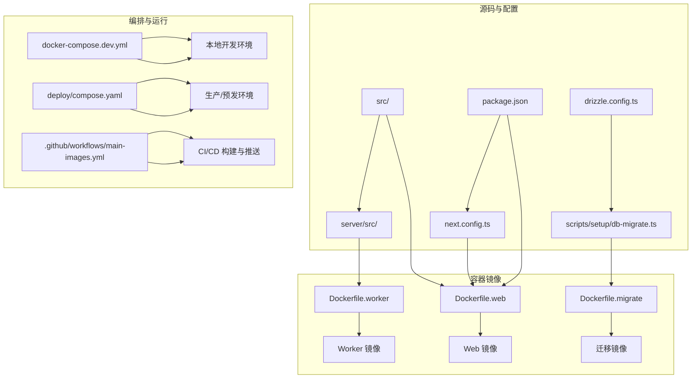
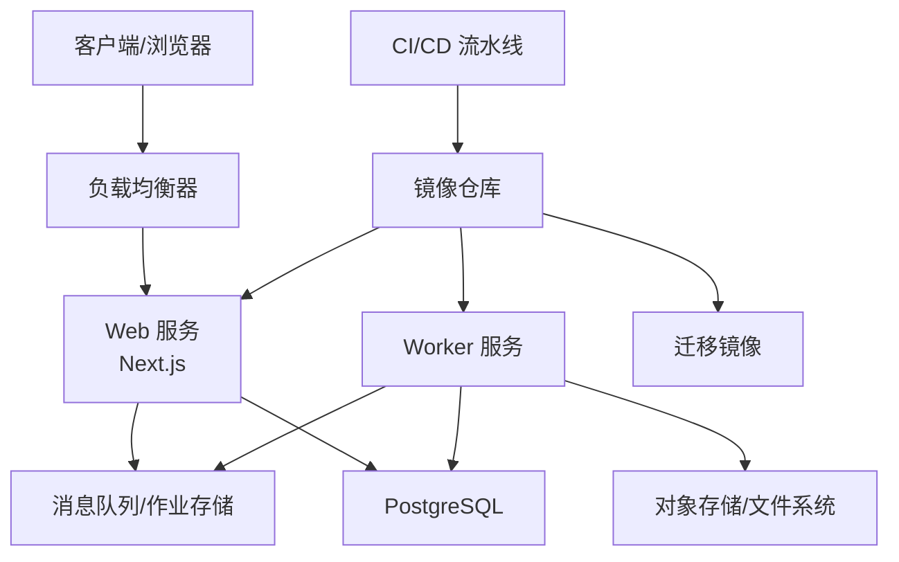
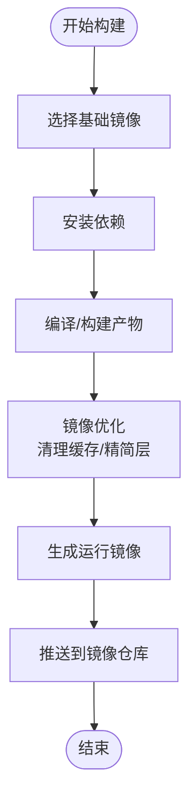
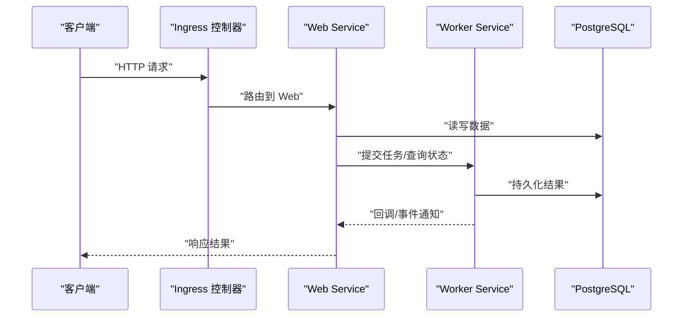
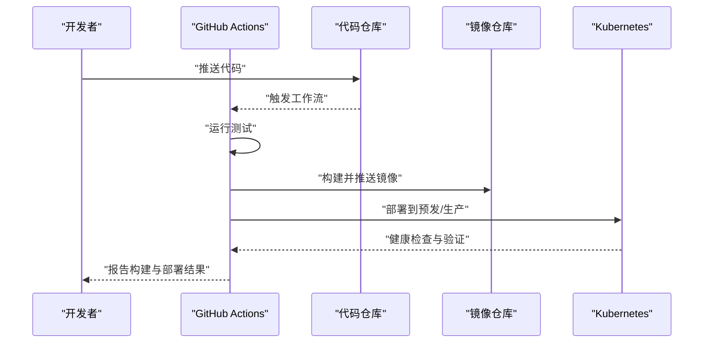
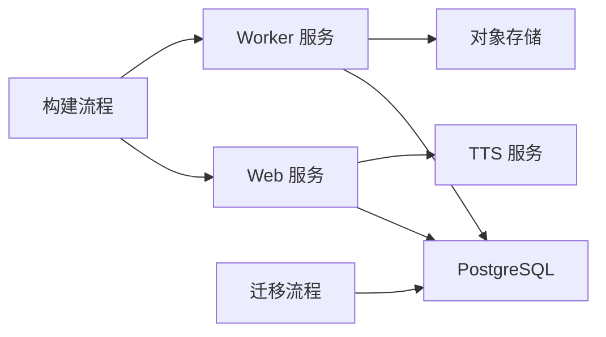

# 部署架构设计

<cite>
**本文档引用的文件**   
- [main-images.yml](file://.github/workflows/main-images.yml)
- [compose.yaml](file://deploy/compose.yaml)
- [env.example](file://deploy/env.example)
- [worker.env.example](file://deploy/worker.env.example)
- [Dockerfile.web](file://Dockerfile.web)
- [Dockerfile.worker](file://Dockerfile.worker)
- [Dockerfile.migrate](file://Dockerfile.migrate)
- [docker-compose.dev.yml](file://docker-compose.dev.yml)
- [package.json](file://package.json)
- [next.config.ts](file://next.config.ts)
- [drizzle.config.ts](file://drizzle.config.ts)
- [tts.env.example](file://config/tts.env.example)
- [README.md](file://deploy/README.md)
</cite>

## 目录
1. [简介](#简介)
2. [项目结构](#项目结构)
3. [核心组件](#核心组件)
4. [架构总览](#架构总览)
5. [详细组件分析](#详细组件分析)
6. [依赖关系分析](#依赖关系分析)
7. [性能考量](#性能考量)
8. [故障排查指南](#故障排查指南)
9. [结论](#结论)
10. [附录](#附录)

## 简介
本文件为 PurpleInk 平台的部署架构设计文档，聚焦容器化与编排、CI/CD 流水线、配置与密钥管理、监控告警、日志聚合、性能分析、灾备恢复、弹性伸缩以及蓝绿发布策略。目标是为运维与研发提供可落地的部署方案与最佳实践，确保平台在生产环境的高可用、可扩展与安全可控。

## 项目结构
仓库采用多服务与多镜像组织方式：
- Web 应用（Next.js）通过 Dockerfile.web 构建镜像
- Worker 任务处理通过 Dockerfile.worker 构建镜像
- 数据库迁移通过 Dockerfile.migrate 构建镜像
- 本地开发使用 docker-compose.dev.yml 编排
- 生产编排参考 deploy/compose.yaml 与环境变量模板 env.example、worker.env.example
- CI/CD 由 .github/workflows/main-images.yml 驱动，负责镜像构建与推送

图表来源
- [Dockerfile.web:1-200](file://Dockerfile.web#L1-L200)
- [Dockerfile.worker:1-200](file://Dockerfile.worker#L1-L200)
- [Dockerfile.migrate:1-200](file://Dockerfile.migrate#L1-L200)
- [docker-compose.dev.yml:1-200](file://docker-compose.dev.yml#L1-L200)
- [compose.yaml:1-200](file://deploy/compose.yaml#L1-L200)
- [main-images.yml:1-200](file://.github/workflows/main-images.yml#L1-L200)

章节来源
- [README.md:1-100](file://deploy/README.md#L1-L100)
- [package.json:1-200](file://package.json#L1-L200)
- [next.config.ts:1-200](file://next.config.ts#L1-L200)
- [drizzle.config.ts:1-200](file://drizzle.config.ts#L1-L200)

## 核心组件
- Web 服务：Next.js 应用，提供 API 路由与页面渲染，依赖 Node.js 运行时与外部模型服务（如 TTS）。
- Worker 服务：后台任务执行器，处理渲染、导出、队列消费等耗时任务。
- 迁移工具：数据库结构与种子数据初始化，支持 Postgres。
- 编排与配置：Compose 定义服务拓扑与依赖；环境变量模板集中管理配置项。
- CI/CD：GitHub Actions 触发镜像构建、测试与推送，保障版本一致性。

章节来源
- [Dockerfile.web:1-200](file://Dockerfile.web#L1-L200)
- [Dockerfile.worker:1-200](file://Dockerfile.worker#L1-L200)
- [Dockerfile.migrate:1-200](file://Dockerfile.migrate#L1-L200)
- [compose.yaml:1-200](file://deploy/compose.yaml#L1-L200)
- [env.example:1-200](file://deploy/env.example#L1-L200)
- [worker.env.example:1-200](file://deploy/worker.env.example#L1-L200)

## 架构总览
PurpleInk 的部署架构以“Web + Worker + 数据库”为核心，结合 CI/CD 实现自动化构建与发布。Web 服务对外暴露 HTTP 接口，Worker 服务异步处理任务，迁移镜像用于数据库变更。通过 Compose 或 Kubernetes 进行编排，配合负载均衡与服务发现实现高可用。

图表来源
- [compose.yaml:1-200](file://deploy/compose.yaml#L1-L200)
- [main-images.yml:1-200](file://.github/workflows/main-images.yml#L1-L200)

章节来源
- [compose.yaml:1-200](file://deploy/compose.yaml#L1-L200)
- [main-images.yml:1-200](file://.github/workflows/main-images.yml#L1-L200)

## 详细组件分析

### 容器镜像构建与优化
- 多阶段构建：在 Dockerfile.web 中分离依赖安装、编译与运行阶段，减小最终镜像体积并提升构建缓存命中率。
- 安全加固：仅包含运行时必要依赖，禁用不必要的系统包，限制权限。
- 资源裁剪：按需引入 Next.js 插件与依赖，避免打包过大产物。
- Worker 镜像：专注于任务执行，剥离前端构建逻辑，提高启动速度。
- 迁移镜像：最小化依赖，专注数据库迁移脚本执行。

图表来源
- [Dockerfile.web:1-200](file://Dockerfile.web#L1-L200)
- [Dockerfile.worker:1-200](file://Dockerfile.worker#L1-L200)
- [Dockerfile.migrate:1-200](file://Dockerfile.migrate#L1-L200)

章节来源
- [Dockerfile.web:1-200](file://Dockerfile.web#L1-L200)
- [Dockerfile.worker:1-200](file://Dockerfile.worker#L1-L200)
- [Dockerfile.migrate:1-200](file://Dockerfile.migrate#L1-L200)

### Kubernetes 编排与服务发现
- 部署对象：Deployment 管理 Web/Worker 副本数，Service 暴露端口，ConfigMap/Secret 注入配置与密钥。
- 服务发现：通过 Service DNS 解析内部服务地址，跨命名空间访问需启用跨命名空间策略。
- 负载均衡：Ingress 控制器统一入口，按路径或域名路由到不同服务。
- 健康检查：探针（liveness/readiness）确保服务可用性。
- 扩缩容：HPA 基于 CPU/内存或自定义指标自动调整副本数。

图表来源
- [compose.yaml:1-200](file://deploy/compose.yaml#L1-L200)

章节来源
- [compose.yaml:1-200](file://deploy/compose.yaml#L1-L200)

### CI/CD 流水线设计与验证
- 触发条件：代码推送或合并至主干分支时触发。
- 步骤：拉取代码、安装依赖、单元测试、集成测试、构建镜像、推送镜像、部署到预发环境。
- 验证：冒烟测试、端到端测试、镜像扫描与合规检查。
- 回滚：失败时自动回滚到上一稳定版本。

图表来源
- [main-images.yml:1-200](file://.github/workflows/main-images.yml#L1-L200)

章节来源
- [main-images.yml:1-200](file://.github/workflows/main-images.yml#L1-L200)

### 环境管理与配置中心
- 环境变量：通过 env.example 与 worker.env.example 集中管理配置项，区分 Web 与 Worker。
- 密钥管理：敏感信息（数据库密码、API Key）通过 Secret 注入，禁止明文写入镜像。
- 配置优先级：环境变量 > ConfigMap > 默认值，便于动态更新。
- 迁移配置：drizzle.config.ts 指定数据库连接与迁移脚本路径。

章节来源
- [env.example:1-200](file://deploy/env.example#L1-L200)
- [worker.env.example:1-200](file://deploy/worker.env.example#L1-L200)
- [drizzle.config.ts:1-200](file://drizzle.config.ts#L1-L200)

### 监控告警与日志聚合
- 指标采集：Node.js 应用暴露 Prometheus 指标，Kubernetes 通过 ServiceMonitor 抓取。
- 日志收集：Sidecar 或 DaemonSet 收集容器日志，统一输出到 ELK/Loki。
- 告警规则：基于错误率、延迟、资源使用阈值触发告警。
- 追踪链路：分布式追踪（OpenTelemetry）串联请求链路。

章节来源
- [compose.yaml:1-200](file://deploy/compose.yaml#L1-L200)

### 灾备恢复与数据保护
- 备份策略：定期全量与增量备份数据库，保留多份历史快照。
- 恢复演练：定期执行恢复演练，验证备份有效性。
- 异地容灾：跨地域复制关键数据，缩短 RTO/RPO。

章节来源
- [drizzle.config.ts:1-200](file://drizzle.config.ts#L1-L200)

### 扩容缩容与蓝绿部署
- 水平扩展：根据负载自动增加/减少副本数，保证吞吐与延迟。
- 蓝绿发布：并行部署新旧版本，流量切换快速且可回滚。
- 灰度发布：按用户比例或标签逐步放量，降低风险。

章节来源
- [compose.yaml:1-200](file://deploy/compose.yaml#L1-L200)

## 依赖关系分析
- 服务依赖：Web 依赖数据库与外部模型服务（TTS），Worker 依赖数据库与对象存储。
- 构建依赖：Next.js 构建依赖 package.json 与 next.config.ts。
- 迁移依赖：Drizzle ORM 配置 drizzle.config.ts 指定迁移脚本。

图表来源
- [compose.yaml:1-200](file://deploy/compose.yaml#L1-L200)
- [package.json:1-200](file://package.json#L1-L200)
- [next.config.ts:1-200](file://next.config.ts#L1-L200)
- [drizzle.config.ts:1-200](file://drizzle.config.ts#L1-L200)

章节来源
- [compose.yaml:1-200](file://deploy/compose.yaml#L1-L200)
- [package.json:1-200](file://package.json#L1-L200)
- [next.config.ts:1-200](file://next.config.ts#L1-L200)
- [drizzle.config.ts:1-200](file://drizzle.config.ts#L1-L200)

## 性能考量
- 镜像大小：多阶段构建与依赖裁剪显著减少镜像体积，提升拉取与启动速度。
- 资源限制：为容器设置 CPU/内存限制，避免资源争用。
- 缓存策略：利用 Next.js 构建缓存与 CDN 缓存静态资源。
- 并发控制：Worker 并发度与队列长度调优，避免背压。
- 数据库连接池：合理配置连接池大小，避免连接耗尽。

章节来源
- [Dockerfile.web:1-200](file://Dockerfile.web#L1-L200)
- [Dockerfile.worker:1-200](file://Dockerfile.worker#L1-L200)
- [compose.yaml:1-200](file://deploy/compose.yaml#L1-L200)

## 故障排查指南
- 启动失败：检查环境变量与 Secret 是否正确注入，查看容器日志定位错误。
- 数据库连接：验证连接字符串与网络策略，确认防火墙与端口开放。
- 任务堆积：监控队列长度与 Worker 利用率，调整并发与资源配额。
- 性能瓶颈：通过指标与追踪定位热点路径，优化代码与资源配置。
- 回滚策略：快速回滚到上一稳定版本，确保业务连续性。

章节来源
- [compose.yaml:1-200](file://deploy/compose.yaml#L1-L200)
- [env.example:1-200](file://deploy/env.example#L1-L200)

## 结论
PurpleInk 的部署架构以容器化与编排为核心，结合 CI/CD 实现自动化构建与发布。通过合理的镜像优化、服务发现、负载均衡、监控告警与灾备策略，确保平台在生产环境的高可用与可扩展性。建议持续迭代配置与监控体系，提升运维效率与系统稳定性。

## 附录
- 本地开发：使用 docker-compose.dev.yml 快速启动开发环境。
- 生产部署：参考 deploy/compose.yaml 与环境变量模板进行部署。
- 文档参考：deploy/README.md 提供部署说明与最佳实践。

章节来源
- [docker-compose.dev.yml:1-200](file://docker-compose.dev.yml#L1-L200)
- [compose.yaml:1-200](file://deploy/compose.yaml#L1-L200)
- [README.md:1-100](file://deploy/README.md#L1-L100)