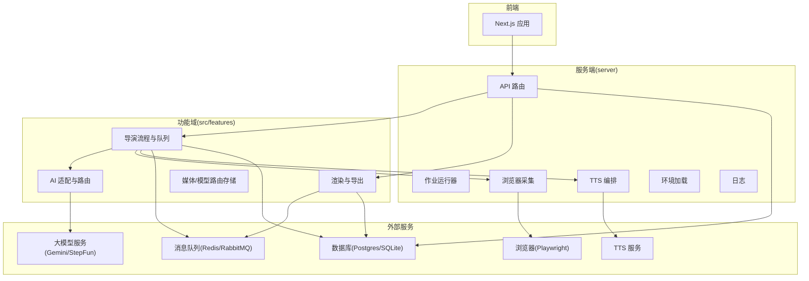
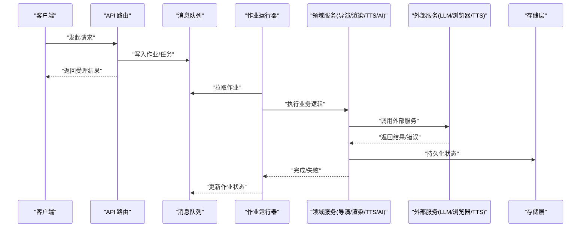
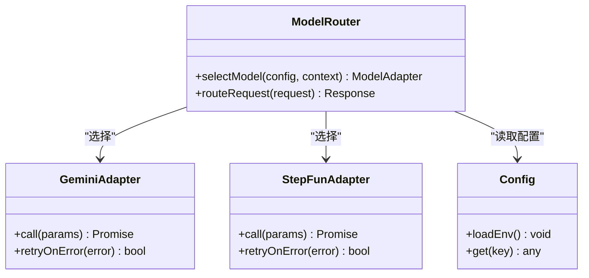
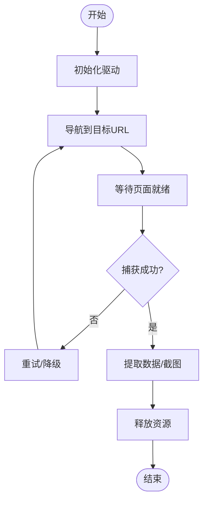
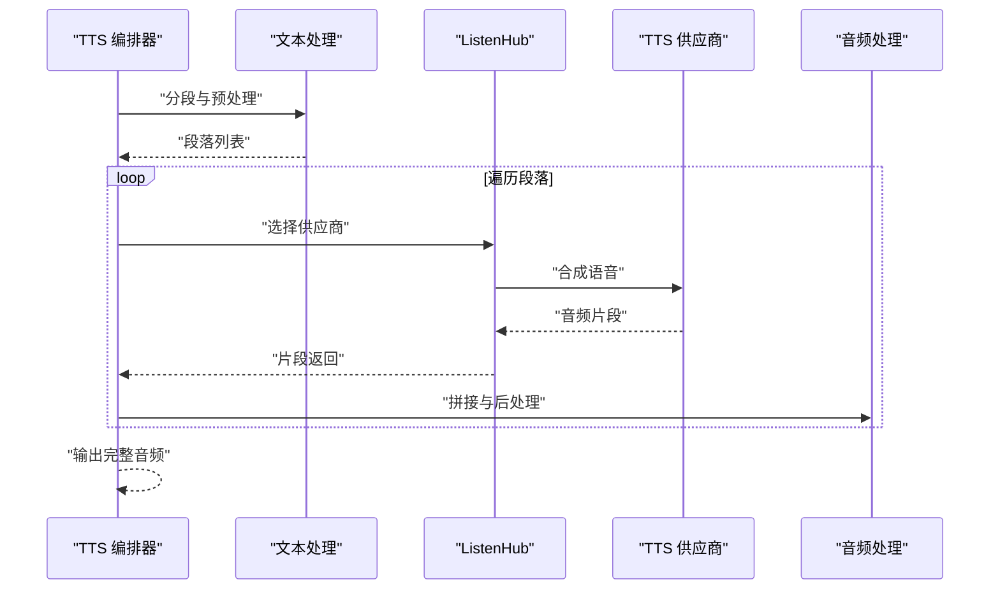
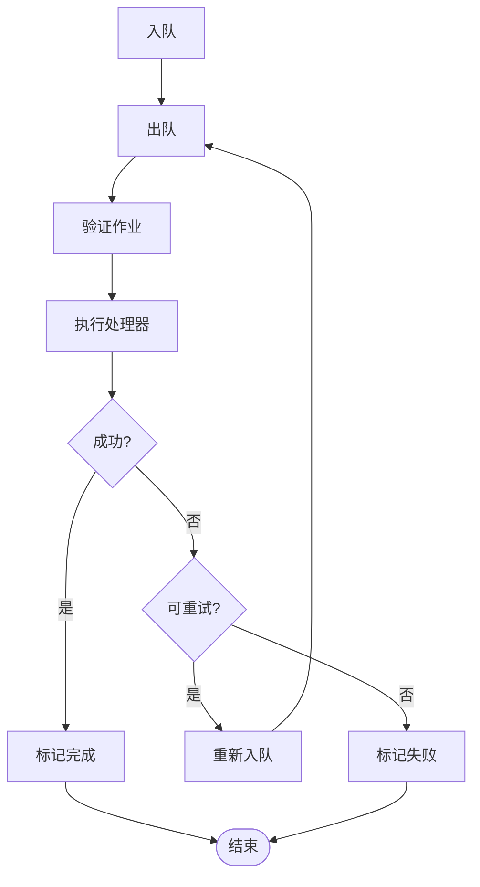
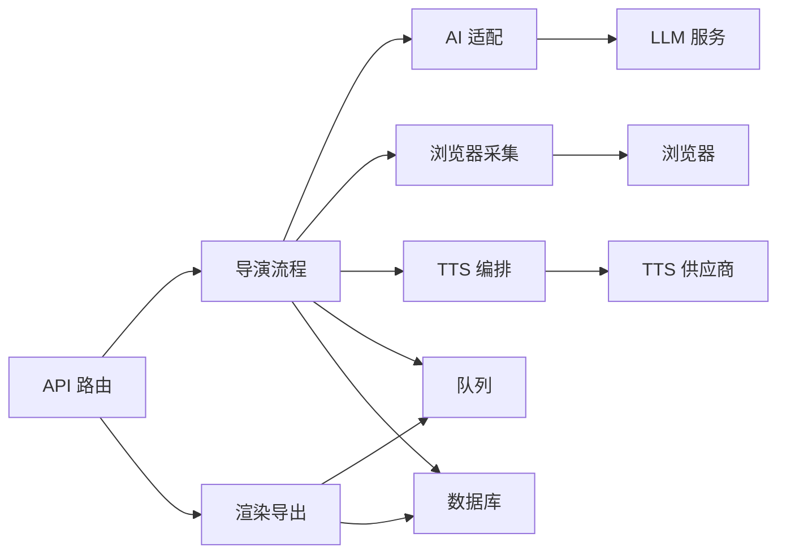

# 集成架构设计

<cite>
**本文引用的文件**   
- [server/src/index.ts](file://server/src/index.ts)
- [server/src/server/api.ts](file://server/src/server/api.ts)
- [server/src/server/job-runner.ts](file://server/src/server/job-runner.ts)
- [server/src/server/job-store.ts](file://server/src/server/job-store.ts)
- [server/src/capture/browser-driver.ts](file://server/src/capture/browser-driver.ts)
- [server/src/capture/playwright-driver.ts](file://server/src/capture/playwright-driver.ts)
- [server/src/capture/mock-driver.ts](file://server/src/capture/mock-driver.ts)
- [server/src/capture/run-capture.ts](file://server/src/capture/run-capture.ts)
- [server/src/tts/orchestrate.ts](file://server/src/tts/orchestrate.ts)
- [server/src/tts/narration.ts](file://server/src/tts/narration.ts)
- [server/src/tts/listenhub.ts](file://server/src/tts/listenhub.ts)
- [server/src/lib/load-env.ts](file://server/src/lib/load-env.ts)
- [server/src/lib/logger.ts](file://server/src/lib/logger.ts)
- [server/src/lib/step-client.ts](file://server/src/lib/step-client.ts)
- [src/features/ai/config.ts](file://src/features/ai/config.ts)
- [src/features/ai/model-routing.ts](file://src/features/ai/model-routing.ts)
- [src/features/ai/gemini-adapter.ts](file://src/features/ai/gemini-adapter.ts)
- [src/features/ai/stepfun-adapter.ts](file://src/features/ai/stepfun-adapter.ts)
- [src/features/director/pipeline.ts](file://src/features/director/pipeline.ts)
- [src/features/director/queue-handler.ts](file://src/features/director/queue-handler.ts)
- [src/features/render/export-service.ts](file://src/features/render/export-service.ts)
- [src/features/render/queue-handler.ts](file://src/features/render/queue-handler.ts)
- [src/features/routing/media-route-repository.ts](file://src/features/routing/media-route-repository.ts)
- [src/features/routing/model-route-repository.ts](file://src/features/routing/model-route-repository.ts)
- [deploy/compose.yaml](file://deploy/compose.yaml)
- [deploy/env.example](file://deploy/env.example)
- [config/tts.env.example](file://config/tts.env.example)
</cite>

## 目录
1. [引言](#引言)
2. [项目结构](#项目结构)
3. [核心组件](#核心组件)
4. [架构总览](#架构总览)
5. [详细组件分析](#详细组件分析)
6. [依赖关系分析](#依赖关系分析)
7. [性能考量](#性能考量)
8. [故障排查指南](#故障排查指南)
9. [结论](#结论)
10. [附录](#附录)

## 引言
本文件面向 PurpleInK 平台的集成架构设计，聚焦外部服务集成模式与系统级通信机制。内容覆盖：
- AI 模型适配器（多厂商、路由与配置）
- 浏览器自动化服务（Playwright/Mock 驱动）
- TTS 服务编排与音频管线
- 第三方 API 调用封装、错误重试与超时处理
- 配置管理、环境变量注入与服务发现
- 消息队列、事件总线与异步通信
- 集成测试策略、模拟服务与故障隔离
- 性能监控、链路追踪与告警通知

## 项目结构
PurpleInK 采用前后端分离与多进程部署：
- server 子工程提供 HTTP API、作业调度、采集与 TTS 能力
- src/features 按领域划分功能模块（AI、导演、渲染、路由等）
- deploy 提供 Docker Compose 与环境模板
- config 提供 TTS 环境示例

图表来源
- [server/src/index.ts](file://server/src/index.ts)
- [server/src/server/api.ts](file://server/src/server/api.ts)
- [server/src/server/job-runner.ts](file://server/src/server/job-runner.ts)
- [src/features/director/pipeline.ts](file://src/features/director/pipeline.ts)
- [src/features/render/export-service.ts](file://src/features/render/export-service.ts)
- [src/features/ai/model-routing.ts](file://src/features/ai/model-routing.ts)

章节来源
- [server/src/index.ts](file://server/src/index.ts)
- [deploy/compose.yaml](file://deploy/compose.yaml)

## 核心组件
- API 层：统一入口，负责鉴权、参数校验、请求分发与响应格式化
- 作业调度：基于队列的作业执行与状态管理
- 浏览器采集：通过 Playwright 或 Mock 驱动进行页面抓取与交互
- TTS 编排：文本到语音的流水线编排、音频合成与后处理
- AI 适配：多模型适配器与路由选择，支持配置化切换
- 渲染导出：视频帧捕获、编码、拼接与导出
- 路由存储：媒体与模型路由规则持久化

章节来源
- [server/src/server/api.ts](file://server/src/server/api.ts)
- [server/src/server/job-runner.ts](file://server/src/server/job-runner.ts)
- [server/src/capture/playwright-driver.ts](file://server/src/capture/playwright-driver.ts)
- [server/src/tts/orchestrate.ts](file://server/src/tts/orchestrate.ts)
- [src/features/ai/model-routing.ts](file://src/features/ai/model-routing.ts)
- [src/features/render/export-service.ts](file://src/features/render/export-service.ts)

## 架构总览
整体采用“API + 作业队列 + 领域服务”的分层架构。HTTP 请求进入 API 层后，根据业务类型入队或直接调用领域服务；领域服务通过适配器访问外部服务（LLM、浏览器、TTS），并通过存储层持久化状态。

图表来源
- [server/src/server/api.ts](file://server/src/server/api.ts)
- [server/src/server/job-runner.ts](file://server/src/server/job-runner.ts)
- [src/features/director/pipeline.ts](file://src/features/director/pipeline.ts)
- [src/features/render/export-service.ts](file://src/features/render/export-service.ts)

## 详细组件分析

### AI 模型适配器与路由
- 适配器模式：为不同厂商（如 Gemini、StepFun）提供统一接口，屏蔽差异
- 路由策略：依据配置与负载动态选择模型，支持灰度与回退
- 配置管理：集中式配置，支持环境变量注入与运行时重载
- 错误处理：统一异常封装、重试与降级

图表来源
- [src/features/ai/model-routing.ts](file://src/features/ai/model-routing.ts)
- [src/features/ai/gemini-adapter.ts](file://src/features/ai/gemini-adapter.ts)
- [src/features/ai/stepfun-adapter.ts](file://src/features/ai/stepfun-adapter.ts)
- [src/features/ai/config.ts](file://src/features/ai/config.ts)

章节来源
- [src/features/ai/model-routing.ts](file://src/features/ai/model-routing.ts)
- [src/features/ai/gemini-adapter.ts](file://src/features/ai/gemini-adapter.ts)
- [src/features/ai/stepfun-adapter.ts](file://src/features/ai/stepfun-adapter.ts)
- [src/features/ai/config.ts](file://src/features/ai/config.ts)

### 浏览器自动化服务
- 驱动抽象：BrowserDriver 接口，具体实现包括 PlaywrightDriver 与 MockDriver
- 采集流程：启动浏览器、导航、等待、截图/录制、资源清理
- 错误恢复：网络抖动、页面加载失败的自动重试与超时控制
- 测试友好：MockDriver 用于无头环境与离线测试

图表来源
- [server/src/capture/browser-driver.ts](file://server/src/capture/browser-driver.ts)
- [server/src/capture/playwright-driver.ts](file://server/src/capture/playwright-driver.ts)
- [server/src/capture/mock-driver.ts](file://server/src/capture/mock-driver.ts)
- [server/src/capture/run-capture.ts](file://server/src/capture/run-capture.ts)

章节来源
- [server/src/capture/browser-driver.ts](file://server/src/capture/browser-driver.ts)
- [server/src/capture/playwright-driver.ts](file://server/src/capture/playwright-driver.ts)
- [server/src/capture/mock-driver.ts](file://server/src/capture/mock-driver.ts)
- [server/src/capture/run-capture.ts](file://server/src/capture/run-capture.ts)

### TTS 服务编排
- 编排器：协调文本分段、语音合成、音频拼接与质量检查
- 供应商接入：通过 ListenHub 抽象 TTS 供应商，支持热插拔
- 音频处理：格式转换、时长测量、字幕对齐
- 错误处理：部分失败重试、回退到备用供应商

图表来源
- [server/src/tts/orchestrate.ts](file://server/src/tts/orchestrate.ts)
- [server/src/tts/narration.ts](file://server/src/tts/narration.ts)
- [server/src/tts/listenhub.ts](file://server/src/tts/listenhub.ts)

章节来源
- [server/src/tts/orchestrate.ts](file://server/src/tts/orchestrate.ts)
- [server/src/tts/narration.ts](file://server/src/tts/narration.ts)
- [server/src/tts/listenhub.ts](file://server/src/tts/listenhub.ts)

### 作业调度与队列
- 作业定义：标准化任务结构与元数据
- 队列消费者：从队列拉取作业并分派给处理器
- 状态机：作业生命周期（待处理、进行中、成功、失败、重试）
- 并发控制：限制并行度，避免资源争用

图表来源
- [server/src/server/job-runner.ts](file://server/src/server/job-runner.ts)
- [server/src/server/job-store.ts](file://server/src/server/job-store.ts)
- [src/features/director/queue-handler.ts](file://src/features/director/queue-handler.ts)
- [src/features/render/queue-handler.ts](file://src/features/render/queue-handler.ts)

章节来源
- [server/src/server/job-runner.ts](file://server/src/server/job-runner.ts)
- [server/src/server/job-store.ts](file://server/src/server/job-store.ts)
- [src/features/director/queue-handler.ts](file://src/features/director/queue-handler.ts)
- [src/features/render/queue-handler.ts](file://src/features/render/queue-handler.ts)

### 渲染与导出
- 帧捕获：基于浏览器渲染获取关键帧
- 编码与拼接：将帧序列编码为视频并拼接
- 质量检查：分辨率、码率、时长校验
- 缓存策略：重复内容复用，减少计算开销

章节来源
- [src/features/render/export-service.ts](file://src/features/render/export-service.ts)
- [src/features/render/queue-handler.ts](file://src/features/render/queue-handler.ts)

### 配置管理与环境变量注入
- 集中加载：统一的环境变量解析与默认值管理
- 敏感信息：密钥与凭据的安全注入
- 运行时重载：支持配置热更新（需配合服务发现）

章节来源
- [server/src/lib/load-env.ts](file://server/src/lib/load-env.ts)
- [deploy/env.example](file://deploy/env.example)
- [config/tts.env.example](file://config/tts.env.example)

### 服务发现与路由存储
- 模型路由：根据上下文与策略选择最佳模型
- 媒体路由：根据内容类型与质量要求选择存储或 CDN
- 持久化：路由规则与状态存储在数据库中

章节来源
- [src/features/routing/model-route-repository.ts](file://src/features/routing/model-route-repository.ts)
- [src/features/routing/media-route-repository.ts](file://src/features/routing/media-route-repository.ts)

## 依赖关系分析
- 低耦合：各领域服务通过接口与适配器解耦
- 高内聚：同一领域的代码集中在对应模块
- 外部依赖：LLM、浏览器、TTS、队列、数据库
- 潜在循环：避免在适配器中直接引用上层领域逻辑

图表来源
- [server/src/server/api.ts](file://server/src/server/api.ts)
- [src/features/director/pipeline.ts](file://src/features/director/pipeline.ts)
- [src/features/render/export-service.ts](file://src/features/render/export-service.ts)
- [src/features/ai/model-routing.ts](file://src/features/ai/model-routing.ts)

章节来源
- [server/src/server/api.ts](file://server/src/server/api.ts)
- [src/features/director/pipeline.ts](file://src/features/director/pipeline.ts)
- [src/features/render/export-service.ts](file://src/features/render/export-service.ts)
- [src/features/ai/model-routing.ts](file://src/features/ai/model-routing.ts)

## 性能考量
- 连接池：数据库与外部服务的连接复用
- 并发控制：队列消费者并行度与限流
- 缓存策略：热点数据与中间结果缓存
- 超时与重试：合理设置超时阈值与重试次数
- 资源清理：及时释放浏览器实例与临时文件

[本节为通用指导，不直接分析具体文件]

## 故障排查指南
- 日志记录：统一日志格式与级别，便于检索与分析
- 错误分类：区分网络错误、业务错误与系统错误
- 告警通知：关键错误触发告警，快速定位问题
- 链路追踪：跨服务调用链跟踪，辅助根因分析

章节来源
- [server/src/lib/logger.ts](file://server/src/lib/logger.ts)
- [server/src/lib/step-client.ts](file://server/src/lib/step-client.ts)

## 结论
PurpleInK 平台通过清晰的架构分层与适配器模式，实现了对外部服务的高内聚、低耦合集成。结合队列与事件驱动，提升了系统的可扩展性与容错性。建议持续完善监控与告警体系，优化性能瓶颈，确保稳定交付。

[本节为总结，不直接分析具体文件]

## 附录
- 部署参考：Docker Compose 与环境模板
- 配置示例：TTS 环境变量示例
- 测试策略：集成测试与模拟服务使用指南

章节来源
- [deploy/compose.yaml](file://deploy/compose.yaml)
- [deploy/env.example](file://deploy/env.example)
- [config/tts.env.example](file://config/tts.env.example)