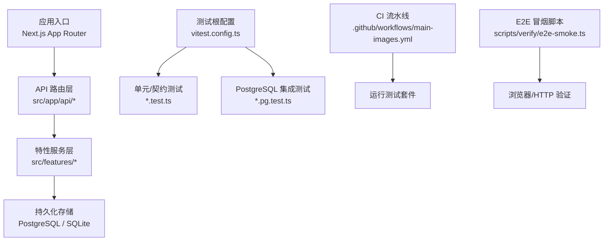
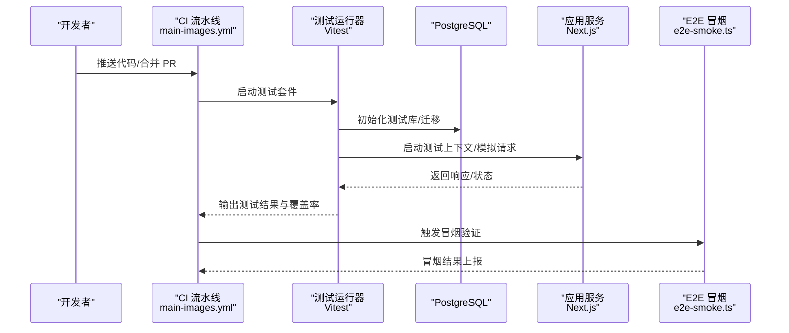
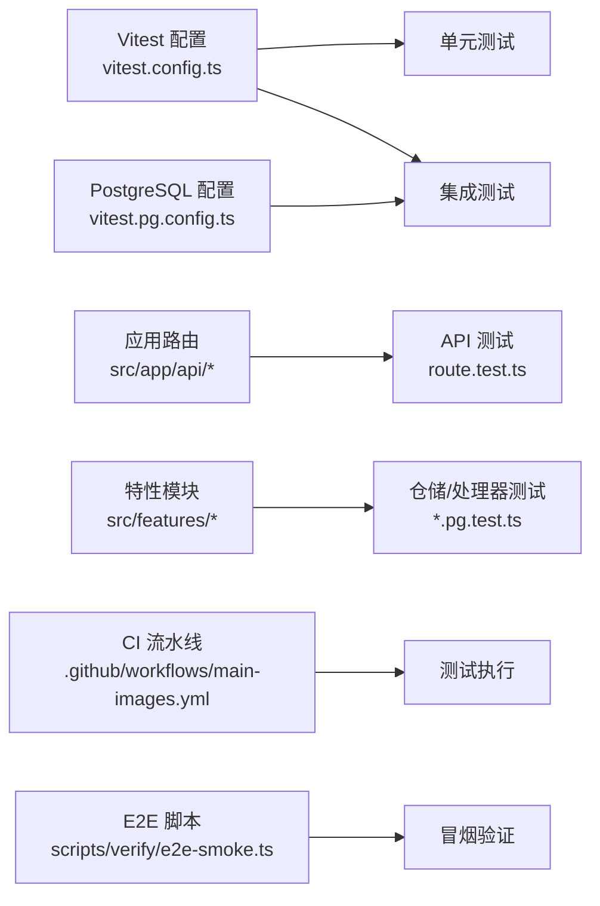

# 测试策略

<cite>
**本文引用的文件**   
- [vitest.config.ts](file://vitest.config.ts)
- [vitest.pg.config.ts](file://vitest.pg.config.ts)
- [package.json](file://package.json)
- [.github/workflows/main-images.yml](file://.github/workflows/main-images.yml)
- [tests/app-route-contract.test.tsx](file://tests/app-route-contract.test.tsx)
- [tests/cvc-ui-smoke.test.tsx](file://tests/cvc-ui-smoke.test.tsx)
- [tests/dependency-contract.test.ts](file://tests/dependency-contract.test.ts)
- [tests/deployment-config.test.mjs](file://tests/deployment-config.test.mjs)
- [tests/env.test.ts](file://tests/env.test.ts)
- [tests/homepage-launch-video-copy.test.mjs](file://tests/homepage-launch-video-copy.test.mjs)
- [tests/hyperframes-local-command.test.ts](file://tests/hyperframes-local-command.test.ts)
- [tests/job-phase-contract.test.ts](file://tests/job-phase-contract.test.ts)
- [tests/products-settings-layout.test.ts](file://tests/products-settings-layout.test.ts)
- [tests/providers-theme.test.tsx](file://tests/providers-theme.test.tsx)
- [tests/scroll-provider-boundary.test.ts](file://tests/scroll-provider-boundary.test.ts)
- [tests/tts-config.test.ts](file://tests/tts-config.test.ts)
- [tests/tts-narration.test.ts](file://tests/tts-narration.test.ts)
- [tests/tts-orchestration.test.ts](file://tests/tts-orchestration.test.ts)
- [tests/tts-pipeline-integration.test.ts](file://tests/tts-pipeline-integration.test.ts)
- [tests/tts-runtime.test.ts](file://tests/tts-runtime.test.ts)
- [tests/url-encoding-contract.test.ts](file://tests/url-encoding-contract.test.ts)
- [tests/worker-error-hygiene.test.ts](file://tests/worker-error-hygiene.test.ts)
- [src/app/api/artifacts/[id]/route.test.ts](file://src/app/api/artifacts/[id]/route.test.ts)
- [src/app/api/director/pipeline/route.test.ts](file://src/app/api/director/pipeline/route.test.ts)
- [src/app/api/director/stage/route.test.ts](file://src/app/api/director/stage/route.test.ts)
- [src/app/api/director/stream/[nodeId]/route.test.ts](file://src/app/api/director/stream/[nodeId]/route.test.ts)
- [src/app/api/jobs/[id]/route.test.ts](file://src/app/api/jobs/[id]/route.test.ts)
- [src/app/api/projects/route.test.ts](file://src/app/api/projects/route.test.ts)
- [src/app/api/render/export/route.test.ts](file://src/app/api/render/export/route.test.ts)
- [src/app/api/settings/route.test.ts](file://src/app/api/settings/route.test.ts)
- [src/features/audio/runtime-repository.pg.test.ts](file://src/features/audio/runtime-repository.pg.test.ts)
- [src/features/credentials/provider-credential-store.pg.test.ts](file://src/features/credentials/provider-credential-store.pg.test.ts)
- [src/features/director/runtime-repository.pg.test.ts](file://src/features/director/runtime-repository.pg.test.ts)
- [src/features/render/cache.pg.test.ts](file://src/features/render/cache.pg.test.ts)
- [src/features/render/repository.pg.test.ts](file://src/features/render/repository.pg.test.ts)
- [src/features/render/thumbnail.integration.pg.test.ts](file://src/features/render/thumbnail.integration.pg.test.ts)
- [src/features/routing/media-route-repository.pg.test.ts](file://src/features/routing/media-route-repository.pg.test.ts)
- [src/features/routing/model-route-repository.pg.test.ts](file://src/features/routing/model-route-repository.pg.test.ts)
- [scripts/verify/e2e-smoke.ts](file://scripts/verify/e2e-smoke.ts)
</cite>

## 目录
1. [简介](#简介)
2. [项目结构](#项目结构)
3. [核心组件](#核心组件)
4. [架构总览](#架构总览)
5. [详细组件分析](#详细组件分析)
6. [依赖分析](#依赖分析)
7. [性能考虑](#性能考虑)
8. [故障排查指南](#故障排查指南)
9. [结论](#结论)
10. [附录](#附录)

## 简介
本文件为 PurpleInk 项目的全面测试策略文档，覆盖单元测试、集成测试与端到端测试的实施方案；阐述测试框架配置、测试环境搭建与模拟策略；给出数据库测试、API 测试与组件测试的最佳实践；包含性能测试、负载测试与安全测试方法；明确测试覆盖率要求、持续集成配置与自动化流程；并涵盖测试数据管理、测试报告生成与缺陷跟踪。

## 项目结构
PurpleInk 采用基于 Next.js 的应用结构与多模块特性组织方式，测试代码主要分布在以下位置：
- 应用层 API 路由测试：位于 src/app/api/** 下的 route.test.ts 文件，针对各 API 端点进行契约与行为验证。
- 特性层（features）测试：按业务域划分，如 audio、render、director、routing、credentials 等，其中 .pg.test.ts 后缀表示需要 PostgreSQL 环境的集成测试。
- 顶层 tests 目录：用于跨层级的契约测试、部署配置校验、TTS 管线集成与运行时测试等。
- 脚本 verify：提供 e2e 冒烟脚本与基线验证工具。

**图表来源** 
- [vitest.config.ts](file://vitest.config.ts)
- [vitest.pg.config.ts](file://vitest.pg.config.ts)
- [.github/workflows/main-images.yml](file://.github/workflows/main-images.yml)
- [scripts/verify/e2e-smoke.ts](file://scripts/verify/e2e-smoke.ts)

**章节来源**
- [vitest.config.ts](file://vitest.config.ts)
- [vitest.pg.config.ts](file://vitest.pg.config.ts)
- [package.json](file://package.json)

## 核心组件
- 测试框架与配置
  - Vitest 作为统一测试运行器，通过 vitest.config.ts 定义全局匹配规则、环境、覆盖率与并行度。
  - 针对 PostgreSQL 的集成测试使用独立配置文件 vitest.pg.config.ts，隔离数据库相关用例执行。
- 测试类型分布
  - 单元测试：纯函数、工具类、状态机、格式转换等无外部依赖逻辑。
  - 集成测试：API 路由、数据库仓储、队列处理器、渲染管线等跨模块交互。
  - 端到端测试：冒烟脚本与关键用户路径验证。
- 测试命名约定
  - 应用层 API 路由测试以 route.test.ts 命名，便于定位与过滤。
  - 数据库集成测试以 .pg.test.ts 后缀标识，避免在普通测试中误执行。

**章节来源**
- [vitest.config.ts](file://vitest.config.ts)
- [vitest.pg.config.ts](file://vitest.pg.config.ts)
- [src/app/api/artifacts/[id]/route.test.ts](file://src/app/api/artifacts/[id]/route.test.ts)
- [src/app/api/director/pipeline/route.test.ts](file://src/app/api/director/pipeline/route.test.ts)
- [src/app/api/director/stage/route.test.ts](file://src/app/api/director/stage/route.test.ts)
- [src/app/api/director/stream/[nodeId]/route.test.ts](file://src/app/api/director/stream/[nodeId]/route.test.ts)
- [src/app/api/jobs/[id]/route.test.ts](file://src/app/api/jobs/[id]/route.test.ts)
- [src/app/api/projects/route.test.ts](file://src/app/api/projects/route.test.ts)
- [src/app/api/render/export/route.test.ts](file://src/app/api/render/export/route.test.ts)
- [src/app/api/settings/route.test.ts](file://src/app/api/settings/route.test.ts)
- [src/features/audio/runtime-repository.pg.test.ts](file://src/features/audio/runtime-repository.pg.test.ts)
- [src/features/credentials/provider-credential-store.pg.test.ts](file://src/features/credentials/provider-credential-store.pg.test.ts)
- [src/features/director/runtime-repository.pg.test.ts](file://src/features/director/runtime-repository.pg.test.ts)
- [src/features/render/cache.pg.test.ts](file://src/features/render/cache.pg.test.ts)
- [src/features/render/repository.pg.test.ts](file://src/features/render/repository.pg.test.ts)
- [src/features/render/thumbnail.integration.pg.test.ts](file://src/features/render/thumbnail.integration.pg.test.ts)
- [src/features/routing/media-route-repository.pg.test.ts](file://src/features/routing/media-route-repository.pg.test.ts)
- [src/features/routing/model-route-repository.pg.test.ts](file://src/features/routing/model-route-repository.pg.test.ts)

## 架构总览
下图展示了 PurpleInk 测试体系的整体架构：从 CI 触发到各类测试执行、数据库环境准备、以及 E2E 冒烟验证的流程。

**图表来源** 
- [.github/workflows/main-images.yml](file://.github/workflows/main-images.yml)
- [vitest.config.ts](file://vitest.config.ts)
- [vitest.pg.config.ts](file://vitest.pg.config.ts)
- [scripts/verify/e2e-smoke.ts](file://scripts/verify/e2e-smoke.ts)

## 详细组件分析

### 单元测试策略
- 目标与范围
  - 覆盖纯函数、工具类、状态机、序列化/反序列化、格式转换等无副作用逻辑。
  - 确保边界条件、异常分支与错误消息正确性。
- 实施要点
  - 使用 Vitest 的断言与模拟能力，隔离外部依赖。
  - 对时间、随机数、文件系统与网络进行 mock。
  - 保持测试粒度小、可重复、快速执行。
- 示例领域
  - TTS 配置与编排、音频度量、字幕处理、主题模式切换等。

**章节来源**
- [tests/tts-config.test.ts](file://tests/tts-config.test.ts)
- [tests/tts-narration.test.ts](file://tests/tts-narration.test.ts)
- [tests/tts-orchestration.test.ts](file://tests/tts-orchestration.test.ts)
- [tests/theme-mode.test.ts](file://src/lib/theme-mode.test.ts)
- [tests/url-encoding-contract.test.ts](file://tests/url-encoding-contract.test.ts)

### 集成测试策略
- 目标与范围
  - 验证 API 路由契约、数据库仓储读写、队列处理与渲染管线协作。
  - 确保跨模块交互的正确性与一致性。
- 实施要点
  - 使用独立的 PostgreSQL 测试数据库，执行迁移与种子数据。
  - 对第三方服务（LLM、对象存储、邮件等）进行桩或模拟。
  - 控制并发与事务回滚，保证测试隔离。
- 示例领域
  - 音视频仓储、凭证存储、导演运行时、渲染缓存与缩略图生成、媒体与模型路由仓储。

**章节来源**
- [src/app/api/artifacts/[id]/route.test.ts](file://src/app/api/artifacts/[id]/route.test.ts)
- [src/app/api/director/pipeline/route.test.ts](file://src/app/api/director/pipeline/route.test.ts)
- [src/app/api/director/stage/route.test.ts](file://src/app/api/director/stage/route.test.ts)
- [src/app/api/director/stream/[nodeId]/route.test.ts](file://src/app/api/director/stream/[nodeId]/route.test.ts)
- [src/app/api/jobs/[id]/route.test.ts](file://src/app/api/jobs/[id]/route.test.ts)
- [src/app/api/projects/route.test.ts](file://src/app/api/projects/route.test.ts)
- [src/app/api/render/export/route.test.ts](file://src/app/api/render/export/route.test.ts)
- [src/app/api/settings/route.test.ts](file://src/app/api/settings/route.test.ts)
- [src/features/audio/runtime-repository.pg.test.ts](file://src/features/audio/runtime-repository.pg.test.ts)
- [src/features/credentials/provider-credential-store.pg.test.ts](file://src/features/credentials/provider-credential-store.pg.test.ts)
- [src/features/director/runtime-repository.pg.test.ts](file://src/features/director/runtime-repository.pg.test.ts)
- [src/features/render/cache.pg.test.ts](file://src/features/render/cache.pg.test.ts)
- [src/features/render/repository.pg.test.ts](file://src/features/render/repository.pg.test.ts)
- [src/features/render/thumbnail.integration.pg.test.ts](file://src/features/render/thumbnail.integration.pg.test.ts)
- [src/features/routing/media-route-repository.pg.test.ts](file://src/features/routing/media-route-repository.pg.test.ts)
- [src/features/routing/model-route-repository.pg.test.ts](file://src/features/routing/model-route-repository.pg.test.ts)

### 端到端测试策略
- 目标与范围
  - 验证关键用户路径与系统冒烟场景，确保部署后基本功能可用。
- 实施要点
  - 使用 scripts/verify/e2e-smoke.ts 发起 HTTP 请求或驱动浏览器，检查页面与接口可用性。
  - 结合 CI 流水线在预发或测试环境自动执行。
- 示例领域
  - 首页加载、登录注册、产品页滚动、导出与播放等基础路径。

**章节来源**
- [scripts/verify/e2e-smoke.ts](file://scripts/verify/e2e-smoke.ts)
- [tests/homepage-launch-video-copy.test.mjs](file://tests/homepage-launch-video-copy.test.mjs)

### 组件测试策略
- 目标与范围
  - 验证 UI 组件渲染、交互与状态变化，确保设计系统与业务组件一致性。
- 实施要点
  - 使用 React Testing Library 或等效工具进行 DOM 查询与事件模拟。
  - 对 Provider、主题、导航等进行上下文注入与模拟。
- 示例领域
  - 主题提供者、滚动边界、设置布局、UI 组件契约等。

**章节来源**
- [tests/providers-theme.test.tsx](file://tests/providers-theme.test.tsx)
- [tests/scroll-provider-boundary.test.ts](file://tests/scroll-provider-boundary.test.ts)
- [tests/products-settings-layout.test.ts](file://tests/products-settings-layout.test.ts)
- [src/components/ui/sidebar.test.ts](file://src/components/ui/sidebar.test.ts)
- [src/components/ui/stage-colors.test.ts](file://src/components/ui/stage-colors.test.ts)
- [src/components/ui/dialog-layering.test.ts](file://src/components/ui/dialog-layering.test.ts)
- [src/components/ui/queue-status-bar.test.ts](file://src/components/ui/queue-status-bar.test.ts)

### 契约与兼容性测试
- 目标与范围
  - 保障 API 契约、依赖关系、环境变量与部署配置稳定性。
- 实施要点
  - 对路由契约、URL 编码、作业阶段契约等进行断言。
  - 校验部署配置与环境变量，防止配置漂移。
- 示例领域
  - 应用路由契约、依赖契约、URL 编码契约、作业阶段契约、部署配置与环境变量。

**章节来源**
- [tests/app-route-contract.test.tsx](file://tests/app-route-contract.test.tsx)
- [tests/dependency-contract.test.ts](file://tests/dependency-contract.test.ts)
- [tests/url-encoding-contract.test.ts](file://tests/url-encoding-contract.test.ts)
- [tests/job-phase-contract.test.ts](file://tests/job-phase-contract.test.ts)
- [tests/deployment-config.test.mjs](file://tests/deployment-config.test.mjs)
- [tests/env.test.ts](file://tests/env.test.ts)

### 工作进程与错误卫生测试
- 目标与范围
  - 确保 Worker 进程的错误处理与日志输出符合预期，避免静默失败。
- 实施要点
  - 模拟异常路径，验证错误分类、重试策略与告警。
- 示例领域
  - Worker 错误卫生、任务调度与恢复。

**章节来源**
- [tests/worker-error-hygiene.test.ts](file://tests/worker-error-hygiene.test.ts)
- [tests/hyperframes-local-command.test.ts](file://tests/hyperframes-local-command.test.ts)

## 依赖分析
测试套件依赖的关键外部资源与内部模块如下：
- 外部依赖
  - PostgreSQL：用于仓储与持久化集成测试。
  - 第三方服务：LLM、对象存储、邮件服务等，需通过桩或模拟替换。
- 内部依赖
  - Next.js 应用路由与服务层：API 测试依赖应用上下文。
  - 特性模块：audio、render、director、routing、credentials 等仓储与处理器。
- 测试配置依赖
  - Vitest 与 PostgreSQL 专用配置，确保隔离与可重复执行。

**图表来源** 
- [vitest.config.ts](file://vitest.config.ts)
- [vitest.pg.config.ts](file://vitest.pg.config.ts)
- [.github/workflows/main-images.yml](file://.github/workflows/main-images.yml)
- [scripts/verify/e2e-smoke.ts](file://scripts/verify/e2e-smoke.ts)

**章节来源**
- [vitest.config.ts](file://vitest.config.ts)
- [vitest.pg.config.ts](file://vitest.pg.config.ts)
- [package.json](file://package.json)

## 性能考虑
- 测试性能优化
  - 合理设置 Vitest 并行度，避免过度竞争导致不稳定。
  - 将耗时较长的集成测试与 E2E 测试分离执行，缩短反馈周期。
  - 使用内存数据库或轻量级 Postgres 实例加速仓储测试。
- 负载与压力测试
  - 针对高并发导出、渲染与流式传输场景，使用压测工具（如 k6、wrk）构造负载。
  - 监控 CPU、内存、I/O 与数据库连接池，识别瓶颈。
- 安全测试
  - 对认证与授权路径进行越权访问测试。
  - 输入校验与注入防护（SQL、XSS、命令注入）验证。
  - 敏感信息泄露检测（密钥、凭据、日志脱敏）。

[本节为通用指导，不直接分析具体文件]

## 故障排查指南
- 常见问题定位
  - 数据库连接失败：检查 PostgreSQL 实例、迁移脚本与测试库初始化。
  - API 测试超时：确认应用上下文启动、端口占用与依赖服务可用性。
  - 组件渲染差异：核对 Provider 注入、主题与国际化配置。
- 调试建议
  - 启用详细日志与堆栈追踪，记录请求/响应与中间状态。
  - 使用 Vitest 的 --reporter=verbose 与 --bail 选项逐步缩小问题范围。
  - 对异步操作增加等待与重试机制，避免竞态条件。

**章节来源**
- [tests/worker-error-hygiene.test.ts](file://tests/worker-error-hygiene.test.ts)
- [tests/env.test.ts](file://tests/env.test.ts)
- [tests/deployment-config.test.mjs](file://tests/deployment-config.test.mjs)

## 结论
PurpleInk 的测试体系以 Vitest 为核心，结合 PostgreSQL 专用配置与 CI 流水线，形成覆盖单元、集成与端到端的完整质量保障。通过明确的测试分层、严格的命名约定与隔离策略，确保测试的可维护性与可扩展性。建议在后续迭代中持续提升覆盖率、完善性能与安全测试，并将测试报告与缺陷跟踪纳入统一的研发流程。

[本节为总结性内容，不直接分析具体文件]

## 附录

### 测试覆盖率要求
- 目标覆盖率
  - 核心业务模块（render、director、audio、routing、credentials）行覆盖率不低于 80%。
  - 公共工具与契约测试行覆盖率不低于 90%。
- 统计与报告
  - 使用 Vitest 内置覆盖率插件生成 HTML 与 JSON 报告。
  - 在 CI 中上传覆盖率报告，设置阈值门禁。

[本节为通用指导，不直接分析具体文件]

### 持续集成配置与自动化流程
- CI 触发
  - 推送与 PR 合并时触发 main-images.yml 流水线。
- 执行步骤
  - 安装依赖、构建应用、启动测试套件（单元与集成）、执行 E2E 冒烟。
  - 生成覆盖率报告与测试报告，归档产物。
- 失败处理
  - 失败通知与回滚策略，保留日志与快照以便回溯。

**章节来源**
- [.github/workflows/main-images.yml](file://.github/workflows/main-images.yml)
- [package.json](file://package.json)

### 测试数据管理
- 数据准备
  - 使用迁移脚本与种子数据初始化测试库。
  - 对敏感数据使用占位符与脱敏。
- 数据清理
  - 每个测试用例结束后回滚事务或清空表，确保隔离。
- 数据版本
  - 与代码版本同步，避免数据漂移。

[本节为通用指导，不直接分析具体文件]

### 测试报告生成与缺陷跟踪
- 报告格式
  - 生成 JUnit XML 与 HTML 报告，便于 CI 可视化与归档。
- 缺陷跟踪
  - 将失败的测试用例关联至缺陷管理系统，标注优先级与复现步骤。
  - 定期回顾与修复，闭环管理。

[本节为通用指导，不直接分析具体文件]