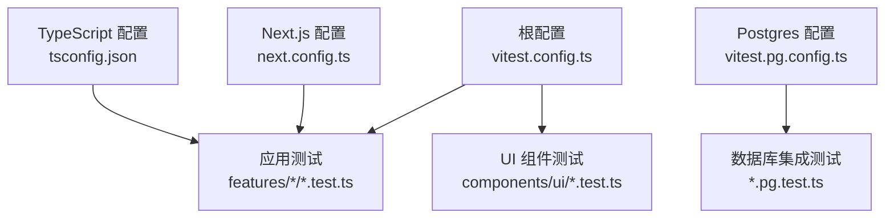
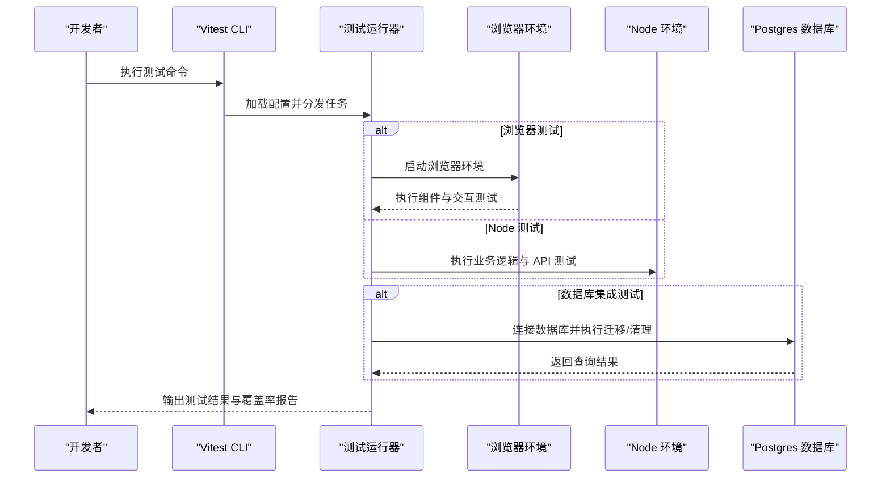
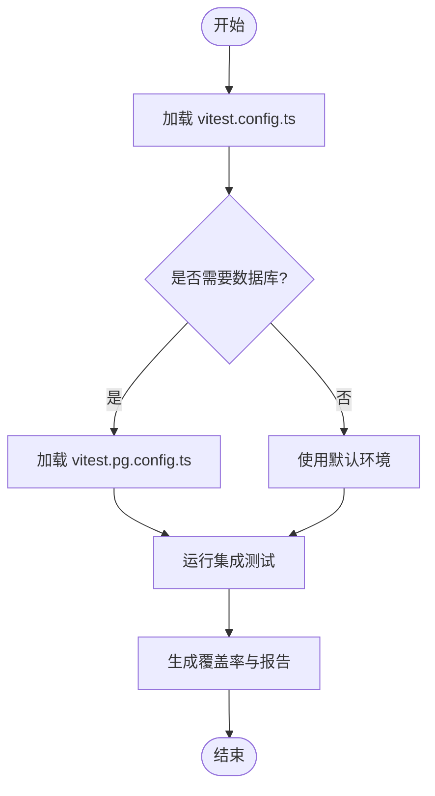
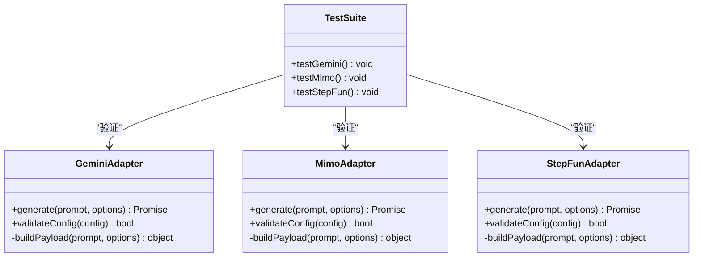
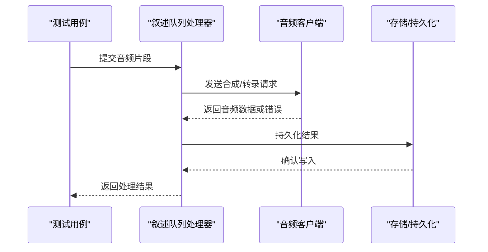
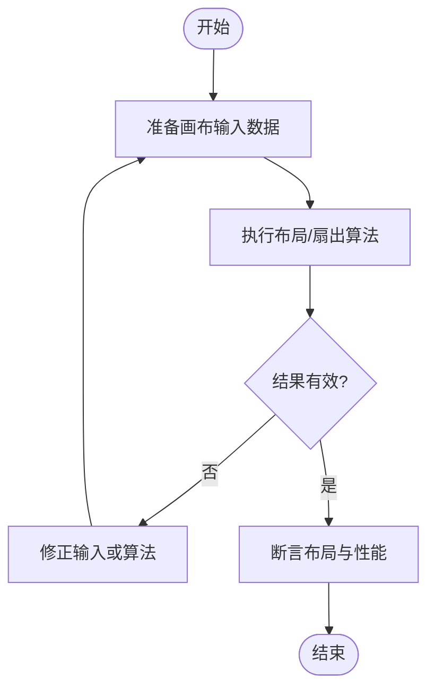
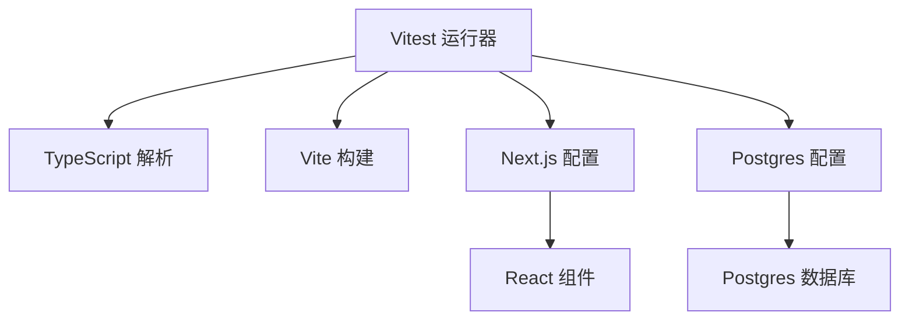

# 单元测试

<cite>
**本文引用的文件**   
- [vitest.config.ts](file://vitest.config.ts)
- [vitest.pg.config.ts](file://vitest.pg.config.ts)
- [package.json](file://package.json)
- [next.config.ts](file://next.config.ts)
- [tsconfig.json](file://tsconfig.json)
- [src/features/ai/gemini-adapter.test.ts](file://src/features/ai/gemini-adapter.test.ts)
- [src/features/ai/mimo-adapter.test.ts](file://src/features/ai/mimo-adapter.test.ts)
- [src/features/ai/stepfun-adapter.test.ts](file://src/features/ai/stepfun-adapter.test.ts)
- [src/features/audio/narration-queue-handler.test.ts](file://src/features/audio/narration-queue-handler.test.ts)
- [src/features/audio/openai-compatible-audio-client.test.ts](file://src/features/audio/openai-compatible-audio-client.test.ts)
- [src/features/audio/stepfun-audio-client.test.ts](file://src/features/audio/stepfun-audio-client.test.ts)
- [src/features/canvas/layout.test.ts](file://src/features/canvas/layout.test.ts)
- [src/features/canvas/fan-out.test.ts](file://src/features/canvas/fan-out.test.ts)
- [src/components/ui/top-bar.test.ts](file://src/components/ui/top-bar.test.ts)
- [src/components/ui/popover.test.ts](file://src/components/ui/popover.test.ts)
- [src/components/ui/media-viewport.test.ts](file://src/components/ui/media-viewport.test.ts)
- [tests/tts-narration.test.ts](file://tests/tts-narration.test.ts)
- [tests/tts-pipeline-integration.test.ts](file://tests/tts-pipeline-integration.test.ts)
</cite>

## 目录
1. [简介](#简介)
2. [项目结构](#项目结构)
3. [核心组件](#核心组件)
4. [架构总览](#架构总览)
5. [详细组件分析](#详细组件分析)
6. [依赖分析](#依赖分析)
7. [性能考虑](#性能考虑)
8. [故障排查指南](#故障排查指南)
9. [结论](#结论)
10. [附录](#附录)

## 简介
本文件面向 PurpleInk 项目的单元测试，系统性说明基于 Vitest 的测试环境配置、运行器选项、配置文件与最佳实践。内容覆盖：
- 测试环境设置与运行器配置（含 Postgres 集成测试）
- 高质量单元测试编写方法（Mock 策略、异步测试、错误处理）
- React 组件测试与用户交互模拟、状态验证
- AI 适配器测试、音频处理测试、画布逻辑测试示例
- 覆盖率要求、报告生成与持续集成建议
- 常见测试模式与反模式

## 项目结构
PurpleInk 采用“功能域 + 组件”的组织方式，测试文件与源码就近放置，便于维护与定位。关键测试位置：
- 功能域测试：位于各 features 目录下，如 ai、audio、canvas 等
- 组件测试：位于 components/ui 下，按 UI 组件划分
- 集成测试：位于 tests 目录，涵盖 TTS 管道、运行时等跨模块流程
- 测试配置：根级 vitest.config.ts 与 vitest.pg.config.ts，分别用于普通测试与需要数据库的测试

**图表来源**
- [vitest.config.ts](file://vitest.config.ts)
- [vitest.pg.config.ts](file://vitest.pg.config.ts)
- [next.config.ts](file://next.config.ts)
- [tsconfig.json](file://tsconfig.json)

**章节来源**
- [vitest.config.ts](file://vitest.config.ts)
- [vitest.pg.config.ts](file://vitest.pg.config.ts)
- [package.json](file://package.json)
- [next.config.ts](file://next.config.ts)
- [tsconfig.json](file://tsconfig.json)

## 核心组件
本节聚焦测试基础设施与运行器，帮助快速搭建与扩展测试能力。

- 测试框架与运行器
  - 使用 Vitest 作为测试框架与运行器，支持 Vite 生态、ESM、TypeScript 与 React Testing Library
  - 通过配置文件启用浏览器环境与 Node 环境，按需隔离测试资源
- 数据库集成测试
  - 提供独立的 Postgres 配置文件，用于需要真实数据库的集成测试
  - 建议在 CI 中通过环境变量控制是否启用数据库测试
- Next.js 集成
  - 借助 next.config.ts 与 tsconfig.json 确保前端与后端代码在测试环境中正确解析
- 脚本入口
  - 通过 package.json 中的脚本命令统一启动测试、覆盖率收集与特定场景测试

**章节来源**
- [vitest.config.ts](file://vitest.config.ts)
- [vitest.pg.config.ts](file://vitest.pg.config.ts)
- [package.json](file://package.json)
- [next.config.ts](file://next.config.ts)
- [tsconfig.json](file://tsconfig.json)

## 架构总览
下图展示测试在不同环境下的执行路径与依赖关系，包括浏览器环境、Node 环境与 Postgres 集成测试。

[无图表来源：该图为概念性流程图，不直接映射具体源文件]

## 详细组件分析

### Vitest 配置与运行器
- 环境选择
  - 浏览器环境：用于 React 组件测试、DOM 操作与事件模拟
  - Node 环境：用于服务端逻辑、API 路由与工具函数测试
- 测试匹配规则
  - 通过 glob 模式匹配 *.test.ts、*.test.tsx 等文件
- 全局设置
  - 可配置超时、重试、覆盖率阈值、 reporters 等
- Postgres 专用配置
  - 独立配置文件用于需要数据库的测试，避免污染默认环境

**图表来源**
- [vitest.config.ts](file://vitest.config.ts)
- [vitest.pg.config.ts](file://vitest.pg.config.ts)

**章节来源**
- [vitest.config.ts](file://vitest.config.ts)
- [vitest.pg.config.ts](file://vitest.pg.config.ts)

### 高质量单元测试编写指南
- Mock 策略
  - 对外部服务（AI 适配器、音频客户端、TTS 服务）进行隔离，使用 mock 或 stub 替代真实调用
  - 对文件系统、网络请求、随机数、时间等进行可控替换
- 异步测试
  - 使用 Promise 与 async/await 编写清晰的可等待断言
  - 合理设置超时与重试，避免不稳定测试
- 错误处理测试
  - 覆盖异常分支与边界条件，验证错误消息与状态回滚
- React 组件测试
  - 使用 React Testing Library 渲染组件，模拟用户交互（点击、输入、拖拽）
  - 验证 UI 状态变化与副作用（如通知、路由跳转）

**章节来源**
- [src/components/ui/top-bar.test.ts](file://src/components/ui/top-bar.test.ts)
- [src/components/ui/popover.test.ts](file://src/components/ui/popover.test.ts)
- [src/components/ui/media-viewport.test.ts](file://src/components/ui/media-viewport.test.ts)

### AI 适配器测试
- 目标
  - 验证不同 AI 提供商（Gemini、Mimo、StepFun）的适配层行为一致性与兼容性
- 要点
  - 构造标准化输入与期望输出
  - 模拟网络响应与错误场景（超时、限流、鉴权失败）
  - 校验参数转换与载荷构建是否符合契约

**图表来源**
- [src/features/ai/gemini-adapter.test.ts](file://src/features/ai/gemini-adapter.test.ts)
- [src/features/ai/mimo-adapter.test.ts](file://src/features/ai/mimo-adapter.test.ts)
- [src/features/ai/stepfun-adapter.test.ts](file://src/features/ai/stepfun-adapter.test.ts)

**章节来源**
- [src/features/ai/gemini-adapter.test.ts](file://src/features/ai/gemini-adapter.test.ts)
- [src/features/ai/mimo-adapter.test.ts](file://src/features/ai/mimo-adapter.test.ts)
- [src/features/ai/stepfun-adapter.test.ts](file://src/features/ai/stepfun-adapter.test.ts)

### 音频处理测试
- 目标
  - 验证音频客户端（OpenAI Compatible、StepFun）与叙述队列处理器在正常与异常路径下的行为
- 要点
  - 模拟音频数据流与分片传输
  - 校验时长测量、格式转换与字幕对齐
  - 覆盖网络错误、解码失败与队列积压场景

**图表来源**
- [src/features/audio/narration-queue-handler.test.ts](file://src/features/audio/narration-queue-handler.test.ts)
- [src/features/audio/openai-compatible-audio-client.test.ts](file://src/features/audio/openai-compatible-audio-client.test.ts)
- [src/features/audio/stepfun-audio-client.test.ts](file://src/features/audio/stepfun-audio-client.test.ts)

**章节来源**
- [src/features/audio/narration-queue-handler.test.ts](file://src/features/audio/narration-queue-handler.test.ts)
- [src/features/audio/openai-compatible-audio-client.test.ts](file://src/features/audio/openai-compatible-audio-client.test.ts)
- [src/features/audio/stepfun-audio-client.test.ts](file://src/features/audio/stepfun-audio-client.test.ts)

### 画布逻辑测试
- 目标
  - 验证布局计算、扇出（fan-out）等核心算法的正确性与稳定性
- 要点
  - 构造典型与极端输入（空节点、重叠、超大画布）
  - 断言布局结果与性能指标（计算耗时、内存占用）
  - 覆盖边界条件与并发更新场景

**图表来源**
- [src/features/canvas/layout.test.ts](file://src/features/canvas/layout.test.ts)
- [src/features/canvas/fan-out.test.ts](file://src/features/canvas/fan-out.test.ts)

**章节来源**
- [src/features/canvas/layout.test.ts](file://src/features/canvas/layout.test.ts)
- [src/features/canvas/fan-out.test.ts](file://src/features/canvas/fan-out.test.ts)

### React 组件测试最佳实践
- 渲染与交互
  - 使用 render 渲染组件，fireEvent/userEvent 模拟用户操作
  - 验证 DOM 变化与组件状态更新
- 状态验证
  - 检查 props/state 变化与副作用触发
  - 对异步更新使用 waitFor 与 findBy* 查询
- 错误边界
  - 模拟错误抛出，验证错误边界捕获与降级显示

**章节来源**
- [src/components/ui/top-bar.test.ts](file://src/components/ui/top-bar.test.ts)
- [src/components/ui/popover.test.ts](file://src/components/ui/popover.test.ts)
- [src/components/ui/media-viewport.test.ts](file://src/components/ui/media-viewport.test.ts)

### 端到端与集成测试（TTS）
- 目标
  - 验证 TTS 管道从文本到音频输出的完整流程
- 要点
  - 使用真实或模拟的后端服务
  - 覆盖多阶段编排、错误恢复与重试机制
  - 生成基线对比与回归检测

**章节来源**
- [tests/tts-narration.test.ts](file://tests/tts-narration.test.ts)
- [tests/tts-pipeline-integration.test.ts](file://tests/tts-pipeline-integration.test.ts)

## 依赖分析
测试与运行时的依赖关系如下：
- Vitest 依赖 TypeScript 与 Vite 生态，确保类型与模块解析一致
- Next.js 配置影响前端组件测试的环境变量与模块别名
- Postgres 集成测试需额外配置数据库连接与迁移脚本

**图表来源**
- [vitest.config.ts](file://vitest.config.ts)
- [vitest.pg.config.ts](file://vitest.pg.config.ts)
- [next.config.ts](file://next.config.ts)
- [tsconfig.json](file://tsconfig.json)

**章节来源**
- [vitest.config.ts](file://vitest.config.ts)
- [vitest.pg.config.ts](file://vitest.pg.config.ts)
- [next.config.ts](file://next.config.ts)
- [tsconfig.json](file://tsconfig.json)

## 性能考虑
- 测试隔离
  - 每个测试用例独立初始化与清理，避免共享状态导致的不稳定
- Mock 开销
  - 合理使用轻量级 mock，避免重型依赖初始化
- 并行执行
  - 启用 Vitest 并行执行，缩短反馈时间
- 覆盖率阈值
  - 设置合理的覆盖率门槛，防止退化

[本节为通用指导，无需引用具体文件]

## 故障排查指南
- 常见问题
  - 浏览器环境缺失：检查 vitest.config.ts 的 browser 配置与环境变量
  - 数据库连接失败：确认 vitest.pg.config.ts 的连接字符串与权限
  - 组件渲染错误：检查 React Testing Library 版本与 DOM 环境
- 调试技巧
  - 使用 console 与断点定位问题
  - 缩小测试范围，逐步复现
  - 查看 Vitest 日志与堆栈信息

**章节来源**
- [vitest.config.ts](file://vitest.config.ts)
- [vitest.pg.config.ts](file://vitest.pg.config.ts)

## 结论
通过系统化的 Vitest 配置与高质量的测试实践，PurpleInk 能够在复杂的前后端与 AI/音频处理场景中保持稳定的质量与交付速度。建议持续完善测试覆盖率、强化集成测试与自动化流水线，以支撑长期演进。

[本节为总结性内容，无需引用具体文件]

## 附录
- 覆盖率与报告
  - 使用 Vitest 内置覆盖率插件生成 HTML 与 JSON 报告
  - 在 CI 中上传报告并设置阈值门禁
- 持续集成建议
  - 分阶段执行：单元 → 集成 → 端到端
  - 缓存依赖与构建产物，加速流水线
  - 使用并行矩阵提升吞吐

[本节为通用指导，无需引用具体文件]