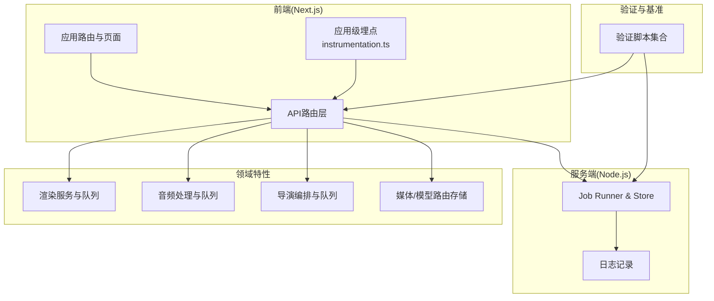
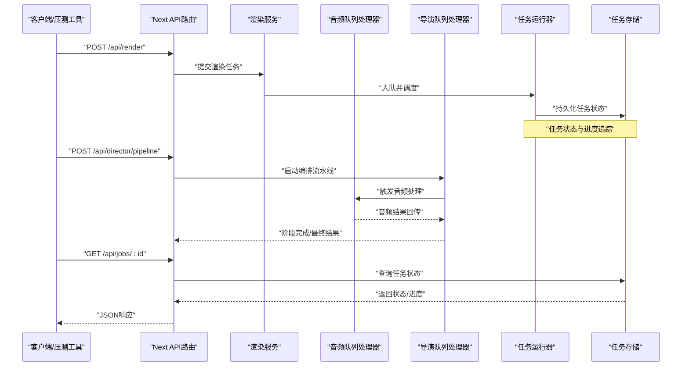
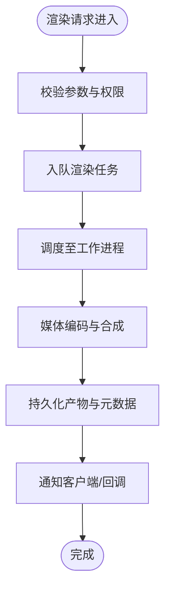
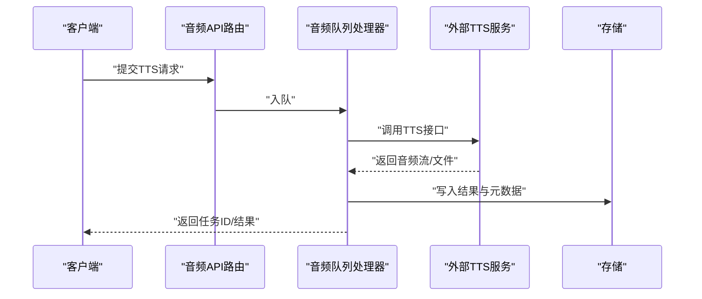
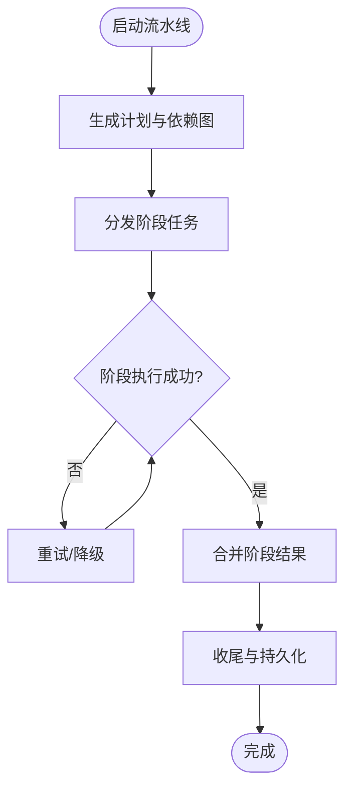
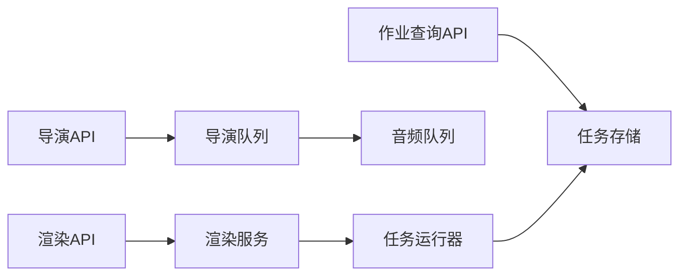

# 性能测试

<cite>
**本文引用的文件**   
- [package.json](file://package.json)
- [vitest.config.ts](file://vitest.config.ts)
- [vitest.pg.config.ts](file://vitest.pg.config.ts)
- [server/package.json](file://server/package.json)
- [scripts/verify/capture-v3-baseline.ts](file://scripts/verify/capture-v3-baseline.ts)
- [scripts/verify/e2e-smoke.ts](file://scripts/verify/e2e-smoke.ts)
- [scripts/verify/auth-flow-smoke.mjs](file://scripts/verify/auth-flow-smoke.mjs)
- [scripts/verify/demo-readiness.mjs](file://scripts/verify/demo-readiness.mjs)
- [scripts/verify/products-scroll.ts](file://scripts/verify/products-scroll.ts)
- [scripts/verify/stepfun-probe.ts](file://scripts/verify/stepfun-probe.ts)
- [scripts/verify/v3-architecture.ts](file://scripts/verify/v3-architecture.ts)
- [src/instrumentation.ts](file://src/instrumentation.ts)
- [server/src/lib/logger.ts](file://server/src/lib/logger.ts)
- [server/src/server/job-runner.ts](file://server/src/server/job-runner.ts)
- [server/src/server/job-store.ts](file://server/src/server/job-store.ts)
- [src/features/render/renderer.ts](file://src/features/render/renderer.ts)
- [src/features/render/export-service.ts](file://src/features/render/export-service.ts)
- [src/features/render/queue-handler.ts](file://src/features/render/queue-handler.ts)
- [src/features/audio/narration-queue-handler.ts](file://src/features/audio/narration-queue-handler.ts)
- [src/features/director/queue-handler.ts](file://src/features/director/queue-handler.ts)
- [src/features/routing/media-route-repository.ts](file://src/features/routing/media-route-repository.ts)
- [src/features/routing/model-route-repository.ts](file://src/features/routing/model-route-repository.ts)
- [src/app/api/render/route.ts](file://src/app/api/render/route.ts)
- [src/app/api/jobs/[id]/route.ts](file://src/app/api/jobs/[id]/route.ts)
- [src/app/api/director/pipeline/route.ts](file://src/app/api/director/pipeline/route.ts)
- [src/app/api/director/stage/route.ts](file://src/app/api/director/stage/route.ts)
- [src/app/api/director/stream/[nodeId]/route.ts](file://src/app/api/director/stream/[nodeId]/route.ts)
- [src/app/api/projects/[id]/route.ts](file://src/app/api/projects/[id]/route.ts)
- [src/app/api/artifacts/[id]/route.ts](file://src/app/api/artifacts/[id]/route.ts)
- [src/app/api/settings/route.ts](file://src/app/api/settings/route.ts)
- [src/app/api/auth/login/route.ts](file://src/app/api/auth/login/route.ts)
- [src/app/api/auth/session/route.ts](file://src/app/api/auth/session/route.ts)
- [src/app/api/ping/route.ts](file://src/app/api/ping/route.ts)
</cite>

## 目录
1. [简介](#简介)
2. [项目结构](#项目结构)
3. [核心组件](#核心组件)
4. [架构总览](#架构总览)
5. [详细组件分析](#详细组件分析)
6. [依赖关系分析](#依赖关系分析)
7. [性能考量](#性能考量)
8. [故障排查指南](#故障排查指南)
9. [结论](#结论)
10. [附录](#附录)

## 简介
本文件面向PurpleInk的性能测试，覆盖负载测试、压力测试与基准测试的实施方法；定义关键性能指标（响应时间、吞吐量、资源利用率）的监控与分析策略；针对媒体处理（视频渲染、音频处理、并发能力）给出可执行的测试方案与脚本指引；并提供瓶颈识别、优化建议与回归检测流程，以及生产环境监控与告警策略。文档同时结合仓库中已有的验证脚本与运行时组件，确保方案可落地执行。

## 项目结构
本项目采用前后端分离与多包管理：前端Next.js应用位于根目录，服务端逻辑位于server目录，通用功能按领域划分在src/features下，验证与基准脚本集中在scripts/verify。测试框架基于Vitest，数据库相关配置独立于主配置。

图表来源
- [src/instrumentation.ts](file://src/instrumentation.ts)
- [server/src/server/job-runner.ts](file://server/src/server/job-runner.ts)
- [server/src/server/job-store.ts](file://server/src/server/job-store.ts)
- [server/src/lib/logger.ts](file://server/src/lib/logger.ts)
- [src/features/render/export-service.ts](file://src/features/render/export-service.ts)
- [src/features/audio/narration-queue-handler.ts](file://src/features/audio/narration-queue-handler.ts)
- [src/features/director/queue-handler.ts](file://src/features/director/queue-handler.ts)
- [src/features/routing/media-route-repository.ts](file://src/features/routing/media-route-repository.ts)
- [src/features/routing/model-route-repository.ts](file://src/features/routing/model-route-repository.ts)

章节来源
- [package.json](file://package.json)
- [vitest.config.ts](file://vitest.config.ts)
- [vitest.pg.config.ts](file://vitest.pg.config.ts)
- [server/package.json](file://server/package.json)

## 核心组件
- 应用级埋点与遥测：通过应用入口的instrumentation模块统一采集请求与关键路径指标，便于端到端性能观测。
- 任务调度与持久化：服务端job-runner与job-store负责任务生命周期、状态管理与持久化，是吞吐与延迟的关键路径。
- 渲染与导出：render模块提供渲染与导出服务，包含队列处理器，用于承载高并发媒体处理。
- 音频处理：audio模块提供TTS与音频合成队列处理器，支撑音频处理速度与并发能力。
- 导演编排：director模块编排AI生成与媒体处理流水线，具备阶段推进与队列处理能力。
- 路由与存储：media-route-repository与model-route-repository为媒体与模型访问提供抽象与持久化。

章节来源
- [src/instrumentation.ts](file://src/instrumentation.ts)
- [server/src/server/job-runner.ts](file://server/src/server/job-runner.ts)
- [server/src/server/job-store.ts](file://server/src/server/job-store.ts)
- [src/features/render/export-service.ts](file://src/features/render/export-service.ts)
- [src/features/render/queue-handler.ts](file://src/features/render/queue-handler.ts)
- [src/features/audio/narration-queue-handler.ts](file://src/features/audio/narration-queue-handler.ts)
- [src/features/director/queue-handler.ts](file://src/features/director/queue-handler.ts)
- [src/features/routing/media-route-repository.ts](file://src/features/routing/media-route-repository.ts)
- [src/features/routing/model-route-repository.ts](file://src/features/routing/model-route-repository.ts)

## 架构总览
下图展示从API到后端处理与队列的核心调用链，适用于负载与压力测试的请求流建模。

图表来源
- [src/app/api/render/route.ts](file://src/app/api/render/route.ts)
- [src/app/api/director/pipeline/route.ts](file://src/app/api/director/pipeline/route.ts)
- [src/app/api/director/stage/route.ts](file://src/app/api/director/stage/route.ts)
- [src/app/api/jobs/[id]/route.ts](file://src/app/api/jobs/[id]/route.ts)
- [src/features/render/export-service.ts](file://src/features/render/export-service.ts)
- [src/features/render/queue-handler.ts](file://src/features/render/queue-handler.ts)
- [src/features/audio/narration-queue-handler.ts](file://src/features/audio/narration-queue-handler.ts)
- [src/features/director/queue-handler.ts](file://src/features/director/queue-handler.ts)
- [server/src/server/job-runner.ts](file://server/src/server/job-runner.ts)
- [server/src/server/job-store.ts](file://server/src/server/job-store.ts)

## 详细组件分析

### 渲染与导出子系统（视频渲染性能）
- 职责：接收渲染请求，组装媒体素材，调用渲染引擎，输出成品或中间产物。
- 关键路径：API路由→渲染服务→队列处理器→任务运行器→存储。
- 性能关注点：I/O吞吐、编码耗时、内存占用、队列积压、并发度。
- 建议指标：首帧时间、端到端渲染时延、每秒渲染帧数、CPU/GPU利用率、磁盘带宽。

图表来源
- [src/app/api/render/route.ts](file://src/app/api/render/route.ts)
- [src/features/render/export-service.ts](file://src/features/render/export-service.ts)
- [src/features/render/queue-handler.ts](file://src/features/render/queue-handler.ts)
- [server/src/server/job-runner.ts](file://server/src/server/job-runner.ts)
- [server/src/server/job-store.ts](file://server/src/server/job-store.ts)

章节来源
- [src/app/api/render/route.ts](file://src/app/api/render/route.ts)
- [src/features/render/export-service.ts](file://src/features/render/export-service.ts)
- [src/features/render/queue-handler.ts](file://src/features/render/queue-handler.ts)
- [server/src/server/job-runner.ts](file://server/src/server/job-runner.ts)
- [server/src/server/job-store.ts](file://server/src/server/job-store.ts)

### 音频处理子系统（TTS与音频速度）
- 职责：文本转语音、音效合成、字幕生成与对齐。
- 关键路径：API→音频队列处理器→外部TTS/音频服务→结果回写。
- 性能关注点：网络延迟、音频编码耗时、并发限制、重试与熔断。
- 建议指标：首字节时间、平均合成时长、错误率、重试次数、外部服务超时率。

图表来源
- [src/app/api/director/stage/route.ts](file://src/app/api/director/stage/route.ts)
- [src/features/audio/narration-queue-handler.ts](file://src/features/audio/narration-queue-handler.ts)

章节来源
- [src/app/api/director/stage/route.ts](file://src/app/api/director/stage/route.ts)
- [src/features/audio/narration-queue-handler.ts](file://src/features/audio/narration-queue-handler.ts)

### 导演编排子系统（并发处理能力）
- 职责：编排多阶段流水线（如分镜、画面、音频），协调各阶段执行与依赖。
- 关键路径：API→导演队列→阶段执行→结果汇聚。
- 性能关注点：阶段间等待、资源争用、失败恢复、幂等性。
- 建议指标：流水线端到端时延、阶段成功率、并发度、背压阈值。

图表来源
- [src/app/api/director/pipeline/route.ts](file://src/app/api/director/pipeline/route.ts)
- [src/features/director/queue-handler.ts](file://src/features/director/queue-handler.ts)

章节来源
- [src/app/api/director/pipeline/route.ts](file://src/app/api/director/pipeline/route.ts)
- [src/features/director/queue-handler.ts](file://src/features/director/queue-handler.ts)

### 路由与存储（媒体/模型访问）
- 职责：统一管理媒体与模型访问路径、缓存与持久化。
- 关键路径：API→路由存储→实际媒体/模型服务。
- 性能关注点：查找开销、缓存命中率、读写放大。
- 建议指标：路由解析时延、缓存命中/缺失比、存储IOPS。

章节来源
- [src/features/routing/media-route-repository.ts](file://src/features/routing/media-route-repository.ts)
- [src/features/routing/model-route-repository.ts](file://src/features/routing/model-route-repository.ts)

### 认证与会话（登录与鉴权）
- 职责：用户登录、会话管理、权限校验。
- 关键路径：API→认证服务→会话存储。
- 性能关注点：哈希计算、令牌签发、并发登录。
- 建议指标：登录时延、令牌签发速率、会话创建失败率。

章节来源
- [src/app/api/auth/login/route.ts](file://src/app/api/auth/login/route.ts)
- [src/app/api/auth/session/route.ts](file://src/app/api/auth/session/route.ts)

### 健康检查与探针
- 职责：快速探测服务可用性、依赖健康。
- 关键路径：API→探针→依赖检查。
- 建议指标：探针时延、依赖健康状态、错误计数。

章节来源
- [src/app/api/ping/route.ts](file://src/app/api/ping/route.ts)
- [scripts/verify/stepfun-probe.ts](file://scripts/verify/stepfun-probe.ts)

## 依赖关系分析
- 前端与后端通过REST API交互，关键API包括渲染、导演、作业查询、项目与设置等。
- 后端任务调度依赖job-runner与job-store，形成稳定的任务生命周期。
- 领域服务之间通过队列解耦，避免同步阻塞，提升吞吐与弹性。

图表来源
- [src/app/api/render/route.ts](file://src/app/api/render/route.ts)
- [src/app/api/director/pipeline/route.ts](file://src/app/api/director/pipeline/route.ts)
- [src/app/api/jobs/[id]/route.ts](file://src/app/api/jobs/[id]/route.ts)
- [src/features/render/export-service.ts](file://src/features/render/export-service.ts)
- [src/features/director/queue-handler.ts](file://src/features/director/queue-handler.ts)
- [src/features/audio/narration-queue-handler.ts](file://src/features/audio/narration-queue-handler.ts)
- [server/src/server/job-runner.ts](file://server/src/server/job-runner.ts)
- [server/src/server/job-store.ts](file://server/src/server/job-store.ts)

章节来源
- [src/app/api/render/route.ts](file://src/app/api/render/route.ts)
- [src/app/api/director/pipeline/route.ts](file://src/app/api/director/pipeline/route.ts)
- [src/app/api/jobs/[id]/route.ts](file://src/app/api/jobs/[id]/route.ts)
- [server/src/server/job-runner.ts](file://server/src/server/job-runner.ts)
- [server/src/server/job-store.ts](file://server/src/server/job-store.ts)

## 性能考量
- 指标体系
  - 响应时间：P50/P95/P99、首字节时间、端到端时延。
  - 吞吐量：RPS、每秒任务完成数、编码帧率。
  - 资源利用率：CPU、内存、磁盘I/O、网络带宽、GPU（如有）。
  - 可靠性：错误率、超时率、重试次数、队列积压长度。
- 基线建立
  - 使用现有验证脚本作为基准用例，稳定后建立性能基线。
  - 建议在相同硬件与配置下重复执行，记录均值与方差。
- 负载与压力
  - 逐步增加并发与请求量，观察系统拐点与退化曲线。
  - 关注队列积压、任务堆积、GC停顿、锁竞争。
- 回归检测
  - 将关键场景纳入CI，自动对比基线，超阈报警。
  - 引入采样与抽样统计，降低测试成本。

[本节为通用指导，不直接分析具体文件]

## 故障排查指南
- 常见问题定位
  - 任务卡滞：检查job-runner与job-store状态、队列消费速率。
  - 渲染超时：查看编码日志、外部服务超时、I/O瓶颈。
  - 音频失败：确认TTS服务可用性、重试策略、配额限制。
- 诊断手段
  - 启用详细日志与结构化输出，关联trace-id。
  - 使用探针与健康检查快速判断依赖状态。
  - 收集系统指标（CPU、内存、磁盘、网络）与业务指标（队列长度、错误计数）。
- 恢复策略
  - 自动重试与退避、熔断与降级、限流与背压。
  - 扩容队列消费者、调整并发度与批大小。

章节来源
- [server/src/lib/logger.ts](file://server/src/lib/logger.ts)
- [server/src/server/job-runner.ts](file://server/src/server/job-runner.ts)
- [server/src/server/job-store.ts](file://server/src/server/job-store.ts)
- [src/app/api/ping/route.ts](file://src/app/api/ping/route.ts)

## 结论
PurpleInk的性能测试应围绕渲染、音频与导演编排三大核心路径展开，结合队列与任务调度机制进行负载与压力测试。通过统一的埋点与日志体系，建立端到端的指标采集与可视化，形成基线与回归检测闭环。在生产环境中，持续监控关键指标并设置告警阈值，保障稳定性与性能。

[本节为总结性内容，不直接分析具体文件]

## 附录

### 性能测试方法与工具
- 工具选择
  - 压测工具：wrk、autocannon、k6、locust（根据团队熟悉度选择）。
  - 指标采集：Prometheus+Grafana、APM（如OpenTelemetry）、系统监控（Node Exporter）。
  - 基准脚本：复用scripts/verify下的验证脚本，扩展为性能用例。
- 实施步骤
  - 准备环境与数据：固定硬件、网络与依赖版本，准备代表性媒体素材。
  - 设计用例：单接口基准、组合场景负载、极限压力、长稳测试。
  - 执行与记录：逐阶段加压，记录指标与日志，保存原始数据。
  - 分析与报告：绘制趋势图、热点图，定位瓶颈并给出优化建议。

章节来源
- [scripts/verify/capture-v3-baseline.ts](file://scripts/verify/capture-v3-baseline.ts)
- [scripts/verify/e2e-smoke.ts](file://scripts/verify/e2e-smoke.ts)
- [scripts/verify/auth-flow-smoke.mjs](file://scripts/verify/auth-flow-smoke.mjs)
- [scripts/verify/demo-readiness.mjs](file://scripts/verify/demo-readiness.mjs)
- [scripts/verify/products-scroll.ts](file://scripts/verify/products-scroll.ts)
- [scripts/verify/stepfun-probe.ts](file://scripts/verify/stepfun-probe.ts)
- [scripts/verify/v3-architecture.ts](file://scripts/verify/v3-architecture.ts)

### 基准测试用例清单（示例）
- 渲染基准
  - 单任务渲染时延（短/中/长视频）
  - 并发渲染吞吐（不同并发度）
  - 大文件渲染稳定性（内存与I/O）
- 音频基准
  - TTS首字节时间与平均合成时长
  - 并发音频处理吞吐
  - 外部服务异常与重试影响
- 导演编排基准
  - 流水线端到端时延
  - 阶段失败恢复与幂等性
  - 资源争用与背压表现
- 认证与会话基准
  - 登录时延与并发登录吞吐
  - 会话创建与校验性能

[本节为用例模板，不直接分析具体文件]

### 生产环境监控与告警策略
- 监控项
  - 应用指标：请求量、时延分布、错误率、队列长度、任务完成速率。
  - 系统指标：CPU、内存、磁盘I/O、网络带宽、容器/进程状态。
  - 依赖指标：外部服务可用性、超时、配额与限流。
- 告警规则
  - 时延P95超过阈值、错误率突增、队列积压持续增长、依赖不可用。
  - 资源饱和（CPU>80%、内存>85%、磁盘I/O饱和）。
- 处置流程
  - 自动扩缩容、限流与降级、熔断与隔离、快速回滚与热修复。

[本节为通用策略，不直接分析具体文件]

### 性能回归检测流程
- CI集成
  - 在PR与发布前执行关键基准用例，对比历史基线。
  - 超阈失败阻断合并，提示回归详情。
- 数据留存
  - 每次执行归档指标与日志，支持回溯与趋势分析。
- 持续改进
  - 定期复盘瓶颈与优化效果，更新基线与阈值。

[本节为流程说明，不直接分析具体文件]