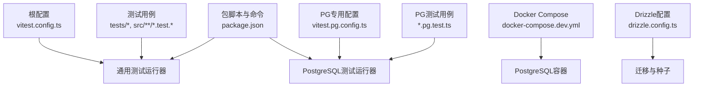
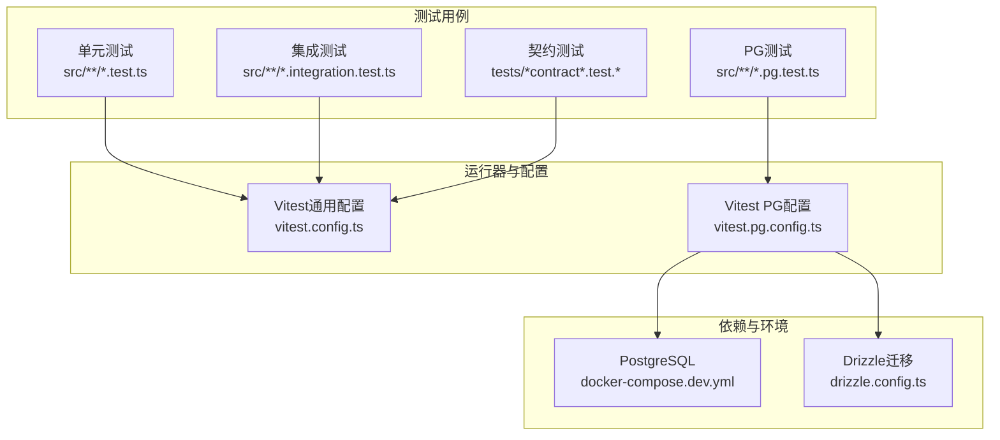
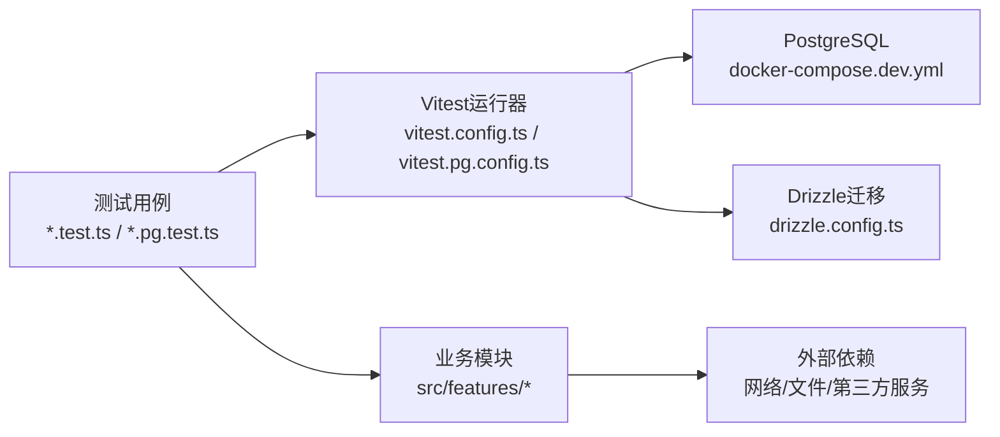

# 测试最佳实践

<cite>
**本文引用的文件**   
- [vitest.config.ts](file://vitest.config.ts)
- [vitest.pg.config.ts](file://vitest.pg.config.ts)
- [package.json](file://package.json)
- [docker-compose.dev.yml](file://docker-compose.dev.yml)
- [drizzle.config.ts](file://drizzle.config.ts)
- [tests/env.test.ts](file://tests/env.test.ts)
- [tests/app-route-contract.test.tsx](file://tests/app-route-contract.test.tsx)
- [src/features/audio/measure.test.ts](file://src/features/audio/measure.test.ts)
- [src/features/audio/mp3.fixture.ts](file://src/features/audio/mp3.fixture.ts)
- [src/features/render/renderer.test.ts](file://src/features/render/renderer.test.ts)
- [src/features/render/cache.pg.test.ts](file://src/features/render/cache.pg.test.ts)
- [src/features/auth/human-check.test.ts](file://src/features/auth/human-check.test.ts)
- [scripts/setup/db-migrate.ts](file://scripts/setup/db-migrate.ts)
- [scripts/setup/postgres-init.sql](file://scripts/setup/postgres-init.sql)
</cite>

## 目录
1. [简介](#简介)
2. [项目结构](#项目结构)
3. [核心组件](#核心组件)
4. [架构总览](#架构总览)
5. [详细组件分析](#详细组件分析)
6. [依赖分析](#依赖分析)
7. [性能考虑](#性能考虑)
8. [故障排查指南](#故障排查指南)
9. [结论](#结论)
10. [附录](#附录)

## 简介
本文件面向PurpleInk项目的测试工程化与最佳实践，覆盖测试代码组织、数据管理、环境配置、测试模式、覆盖率与质量门禁、持续集成以及调试技巧。目标是帮助开发者快速建立稳定、可维护且高效的测试体系，确保功能正确性与交付质量。

## 项目结构
- 测试入口与框架
  - 使用Vitest作为统一测试运行器，提供单元、集成与PostgreSQL相关测试的独立配置。
  - 根级配置文件包括vitest.config.ts与vitest.pg.config.ts，分别用于通用测试与需要数据库的测试。
- 测试文件分布
  - 应用层与特性模块内联测试：在src/features/*与src/components/*中采用*.test.ts或*.test.tsx就近放置，便于定位与维护。
  - 端到端与契约测试：tests目录下集中存放跨模块、跨服务或UI层面的测试用例。
- 测试数据与固定数据
  - 固定数据与夹具（fixture）通常与业务模块同目录或放在__fixtures__子目录，例如音频与渲染模块中的fixture文件。
- 数据库与迁移
  - 通过Drizzle ORM进行数据库迁移与初始化；PostgreSQL测试由独立的Vitest配置驱动，配合docker-compose启动本地依赖。

**图表来源**
- [vitest.config.ts](file://vitest.config.ts)
- [vitest.pg.config.ts](file://vitest.pg.config.ts)
- [package.json](file://package.json)
- [docker-compose.dev.yml](file://docker-compose.dev.yml)
- [drizzle.config.ts](file://drizzle.config.ts)

**章节来源**
- [vitest.config.ts](file://vitest.config.ts)
- [vitest.pg.config.ts](file://vitest.pg.config.ts)
- [package.json](file://package.json)
- [docker-compose.dev.yml](file://docker-compose.dev.yml)
- [drizzle.config.ts](file://drizzle.config.ts)

## 核心组件
- 测试运行器与配置
  - Vitest：统一的测试执行引擎，支持TS、JSX、异步断言、Mock等能力。
  - 双配置策略：通用测试与数据库测试分离，避免不必要的依赖与资源占用。
- 数据库测试支撑
  - Drizzle ORM：定义Schema、执行迁移与数据准备。
  - PostgreSQL：通过docker-compose在本地拉起，保证测试环境与生产一致。
- 测试分类
  - 单元测试：针对函数、工具类与纯逻辑模块。
  - 集成测试：涉及外部依赖（如文件系统、网络、数据库）的模块。
  - 契约测试：API路由与输入输出结构的稳定性保障。
  - UI/交互测试：页面与组件行为验证（按需）。

**章节来源**
- [vitest.config.ts](file://vitest.config.ts)
- [vitest.pg.config.ts](file://vitest.pg.config.ts)
- [drizzle.config.ts](file://drizzle.config.ts)
- [docker-compose.dev.yml](file://docker-compose.dev.yml)

## 架构总览
下图展示测试在不同层次上的协作关系：从用例到运行器、从业务模块到外部依赖（数据库、网络），以及CI中的质量门禁。

**图表来源**
- [vitest.config.ts](file://vitest.config.ts)
- [vitest.pg.config.ts](file://vitest.pg.config.ts)
- [docker-compose.dev.yml](file://docker-compose.dev.yml)
- [drizzle.config.ts](file://drizzle.config.ts)

## 详细组件分析

### 测试文件命名规范与目录结构
- 命名规范
  - 单元测试：与源码同名并追加.test.ts或.test.tsx后缀，置于同一目录或靠近被测试模块。
  - 集成测试：以.integration.test.ts结尾，明确标注为集成级别。
  - 数据库测试：以.pg.test.ts结尾，表示需要PostgreSQL环境。
  - 契约测试：以contract.test.ts或类似命名体现契约性质。
- 目录组织
  - 特性模块（features）内聚测试：将测试贴近实现，减少跨目录跳转。
  - 公共测试与端到端用例集中在tests目录，便于统一管理与运行。
- 示例参考路径
  - 环境变量测试：[tests/env.test.ts](file://tests/env.test.ts)
  - 应用路由契约测试：[tests/app-route-contract.test.tsx](file://tests/app-route-contract.test.tsx)
  - 音频测量测试：[src/features/audio/measure.test.ts](file://src/features/audio/measure.test.ts)
  - 渲染器测试：[src/features/render/renderer.test.ts](file://src/features/render/renderer.test.ts)
  - 缓存PG测试：[src/features/render/cache.pg.test.ts](file://src/features/render/cache.pg.test.ts)

**章节来源**
- [tests/env.test.ts](file://tests/env.test.ts)
- [tests/app-route-contract.test.tsx](file://tests/app-route-contract.test.tsx)
- [src/features/audio/measure.test.ts](file://src/features/audio/measure.test.ts)
- [src/features/render/renderer.test.ts](file://src/features/render/renderer.test.ts)
- [src/features/render/cache.pg.test.ts](file://src/features/render/cache.pg.test.ts)

### 测试数据管理策略
- 固定数据（Fixture）
  - 将稳定的输入数据与期望结果放在fixture文件中，便于复用与版本控制。
  - 示例：音频模块的MP3夹具文件。
- 种子数据（Seed）
  - 通过迁移脚本与SQL初始化脚本生成基础数据，确保测试环境一致性。
  - 示例：PostgreSQL初始化脚本与迁移工具。
- Mock数据与外部依赖模拟
  - 对网络请求、文件系统、第三方服务使用Mock或Stub，隔离不稳定因素。
  - 在Vitest中利用内置Mock能力，结合自定义工厂函数生成随机但可控的数据。
- 数据生命周期
  - 每个测试用例应负责数据的创建、清理，避免相互污染。
  - 对于PG测试，建议使用事务回滚或临时数据库实例。

**章节来源**
- [src/features/audio/mp3.fixture.ts](file://src/features/audio/mp3.fixture.ts)
- [scripts/setup/postgres-init.sql](file://scripts/setup/postgres-init.sql)
- [scripts/setup/db-migrate.ts](file://scripts/setup/db-migrate.ts)

### 测试环境配置
- 环境变量管理
  - 使用.env或运行时注入的方式配置数据库连接、第三方服务密钥等。
  - 在测试中校验必要的环境变量存在性，防止误用默认值。
- 测试数据库
  - 通过docker-compose启动PostgreSQL，确保端口、用户名、密码与迁移脚本一致。
  - 使用Drizzle进行迁移与数据准备，保证Schema与代码同步。
- 外部服务模拟
  - 对HTTP接口、消息队列、对象存储等外部依赖，优先使用Mock或本地替代服务。
  - 在集成测试中尽量保持最小依赖面，聚焦被测逻辑。

**章节来源**
- [docker-compose.dev.yml](file://docker-compose.dev.yml)
- [drizzle.config.ts](file://drizzle.config.ts)
- [scripts/setup/db-migrate.ts](file://scripts/setup/db-migrate.ts)
- [scripts/setup/postgres-init.sql](file://scripts/setup/postgres-init.sql)

### 测试模式与实践
- Given-When-Then模式
  - 将测试分为“前置条件”、“操作”、“断言”三段，提升可读性与可维护性。
  - 适用于单元、集成与契约测试。
- 测试金字塔
  - 底层大量单元测试，中层集成测试，顶层少量端到端测试。
  - 平衡速度与覆盖面，提高反馈效率。
- BDD风格测试
  - 使用描述性语言组织用例，强调用户故事与验收标准。
  - 适合契约测试与关键业务流程。
- 示例参考路径
  - 人类检查服务测试（BDD风格）：[src/features/auth/human-check.test.ts](file://src/features/auth/human-check.test.ts)
  - 渲染器测试（单元/集成混合）：[src/features/render/renderer.test.ts](file://src/features/render/renderer.test.ts)

**章节来源**
- [src/features/auth/human-check.test.ts](file://src/features/auth/human-check.test.ts)
- [src/features/render/renderer.test.ts](file://src/features/render/renderer.test.ts)

### 覆盖率要求与质量门禁
- 覆盖率目标
  - 建议设置行覆盖率、分支覆盖率与函数覆盖率的阈值，逐步提升。
  - 对核心模块（认证、渲染、音频处理）设定更高门槛。
- 质量门禁
  - 在CI中集成覆盖率检查，未达标则阻断合并。
  - 结合静态分析与类型检查，确保代码质量基线。
- 持续集成配置
  - 使用Vitest并行执行测试，缩短反馈时间。
  - 为PG测试单独配置数据库服务与迁移步骤。

[本节为通用指导，不直接分析具体文件]

### 调试测试的技巧与常见问题
- 常见错误
  - 环境变量缺失导致连接失败。
  - 数据库Schema不一致引发迁移失败。
  - Mock未正确覆盖导致测试不稳定。
- 调试技巧
  - 启用详细日志与断点，定位失败用例。
  - 使用Vitest的watch模式快速迭代。
  - 对PG测试，打印实际执行的SQL与查询结果。
- 问题定位流程
  - 复现问题 -> 缩小范围 -> 添加日志 -> 修复并回归。

[本节为通用指导，不直接分析具体文件]

## 依赖分析
测试与运行时的依赖关系如下：

**图表来源**
- [vitest.config.ts](file://vitest.config.ts)
- [vitest.pg.config.ts](file://vitest.pg.config.ts)
- [docker-compose.dev.yml](file://docker-compose.dev.yml)
- [drizzle.config.ts](file://drizzle.config.ts)

**章节来源**
- [vitest.config.ts](file://vitest.config.ts)
- [vitest.pg.config.ts](file://vitest.pg.config.ts)
- [docker-compose.dev.yml](file://docker-compose.dev.yml)
- [drizzle.config.ts](file://drizzle.config.ts)

## 性能考虑
- 测试并行化
  - 合理设置并发数，避免资源竞争与内存溢出。
- 数据库测试优化
  - 使用事务回滚减少数据清理开销。
  - 预置常用数据，减少重复插入。
- Mock与Stub
  - 对外部依赖进行轻量模拟，降低IO与网络延迟。
- 测试拆分
  - 将耗时测试放入独立套件，按需运行。

[本节为通用指导，不直接分析具体文件]

## 故障排查指南
- 环境问题
  - 检查环境变量是否完整，数据库连接参数是否正确。
  - 确认docker-compose服务已启动且端口可用。
- 迁移问题
  - 核对Drizzle配置与数据库版本，重新执行迁移。
- 测试不稳定
  - 检查Mock是否覆盖所有分支，避免时序问题。
  - 增加重试机制或隔离测试数据。
- 参考路径
  - 环境变量测试：[tests/env.test.ts](file://tests/env.test.ts)
  - 人类检查服务测试：[src/features/auth/human-check.test.ts](file://src/features/auth/human-check.test.ts)
  - 渲染器测试：[src/features/render/renderer.test.ts](file://src/features/render/renderer.test.ts)
  - 缓存PG测试：[src/features/render/cache.pg.test.ts](file://src/features/render/cache.pg.test.ts)

**章节来源**
- [tests/env.test.ts](file://tests/env.test.ts)
- [src/features/auth/human-check.test.ts](file://src/features/auth/human-check.test.ts)
- [src/features/render/renderer.test.ts](file://src/features/render/renderer.test.ts)
- [src/features/render/cache.pg.test.ts](file://src/features/render/cache.pg.test.ts)

## 结论
通过规范的测试组织、严谨的数据管理、稳定的环境配置与科学的测试模式，PurpleInk项目能够构建高质量的测试体系。建议在团队内推广本文的最佳实践，并结合CI/CD实现自动化质量门禁，持续提升交付质量与开发效率。

[本节为总结性内容，不直接分析具体文件]

## 附录
- 常用命令
  - 运行通用测试：使用Vitest命令（参考package.json脚本）。
  - 运行PG测试：使用Vitest PG配置命令。
  - 数据库迁移：使用Drizzle CLI与迁移脚本。
- 参考路径
  - 包脚本：[package.json](file://package.json)
  - Docker Compose：[docker-compose.dev.yml](file://docker-compose.dev.yml)
  - Drizzle配置：[drizzle.config.ts](file://drizzle.config.ts)

[本节为补充信息，不直接分析具体文件]